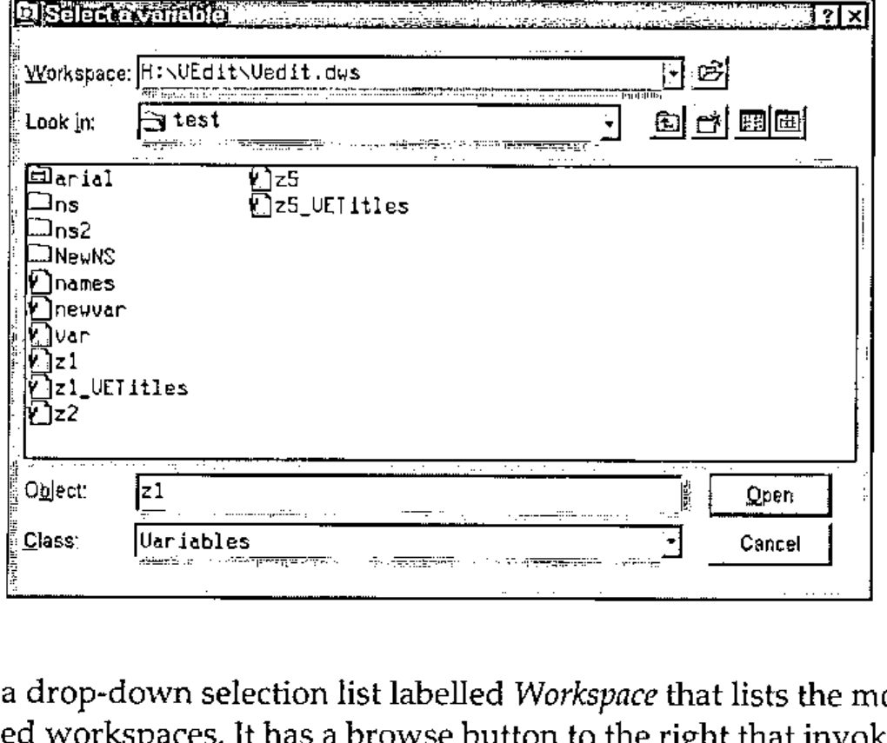

*by David Crossley*
{ .byline }

## Abstract

The paper describes an open-source utility to view or edit a variable but specifically any generalised nested array. The described version is written for Dyalog APL though other implementations are planned. The variable may be sourced from and saved to any namespace in the current workspace or any other workspace. The editor is designed as a development aid. Although available as two namespaces, options are provided to incorporate the tool as a tiny namespace within the Dyalog Session with almost zero-footprint except when active, accessible through the Session menu and toolbar buttons. The utility and installation program are available as a free download from the web.

## Background

At the Madrid Conference in 2002, Jim Lucas [1] presented a paper ("Looking Back On Looking Ahead") in which he made the startling observation that there was no true editor that could handle arrays of any arbitrary depth, fundamental building blocks of APL applications. Whilst APL versions usually include some form of built-in editor, they are limited to simple arrays or at best to text vectors which can be treated as simple arrays.

The development of the editor described in this paper was inspired by that observation. Although not exactly rocket-science, it proved to be a non-trivial undertaking. Former experience with handling large multi-dimensional data in a spreadsheet manner offered an immediate design strategy on how to traverse the structures of arbitrary nested arrays using the Grid object.

In addition, I wanted to provide simplified means to view and edit commonly-used structures but at the discretion of the user; in particular, arrays of text vectors and "parallel" arrays, of which more later.

As a further aid to frequent editing of data structures, I felt that the ability to provide alternative text labels for axes and axis subscripts should be included.

And finally, for a variable editor to be worth its salt, it must be easily accessible, and it should be able to source and save variables anywhere. This led me to provide a way to integrate the editor into the session, and to develop an ancillary product, available as a standalone utility, modelled on the Windows FileBox object, a utility that I have called WSBox.

## The Variable Editor Dialog

The screen-shot below illustrates the dialog in which an array structure has been opened for editing.

![The Variable Editor dialog, its caption naming #.z1 sourced from H:\Hunts\or\BOOKINGS17.DWS, showing a Personnel table with columns Name, Department, Age and Skills[Reading], [Riting], [Rithmetic], [Darts]](art10002700/editor.jpg)

The Caption Bar identifies the name of the variable and its source, in this case a workspace named BOOKINGS17.DWS whose full file path is shown followed by a separator (?) and then the workspace path to the source variable. As this is Dyalog APL the namespace path within the workspace is shown from root (#).

The dialog is normally non-modal and multiple instances of the dialog may be open simultaneously. This permits users to interact with the workspace session. However, a property may be included when the function is called to specify a modal dialog which might be appropriate if the utility were to be incorporated within a user application.

I will firstly describe the fundamentals of how the editor works and then briefly cover its salient features.

### The Grid Display

The top level of a generalised array is an orthogonal structure of any rank. For a non-empty array, each element of the array is a scalar. If the element is a simple scalar, either a character or a number, there is no further depth to that element. However, if it is non-simple, the item contained in that element is a further array which is said to have a depth of 1. Each non-simple element within that array contains a further array with a depth of 2. And so on, until all elements of the array at the lowest level are simple. Even for an empty array, the prototype of that item may be simple or non-simple.

The structure is visually represented by the editor using the Grid object. At any level when navigating a structure, the array at that level is displayed initially showing its last two axes as the rows and columns respectively of the Grid. By default, the axis subscripts are consecutively numbered in the row and column titles using the preferred origin. If the array is a scalar, just a single cell is shown with no titles. If it is a vector, it is usually shown row-wise with just row titles.

Axes are also identified in the pane labelled *View* just above the Grid. Next to each axis, a drop-down list contains the subscripts for that axis. The pane is split into up to three zones. The first (or *slice*) zone on a plane background contains all of the axes other than the last two axes. The middle (or *row*) zone on a background of horizontal stripes contains the penultimate axis (shown as the Grid rows). And the third (or *column*) zone on a background of vertical stripes contains the last dimension (shown as the Grid columns). Of course, if the array is less than two-dimensional, the redundant zones will not be shown, and no zone will be displayed for a scalar array.

By opening and selecting a subscript from the drop-down list for an axis, the Grid cell corresponding to a row or column axis will become current, i.e. it will be highlighted with the cursor placed in that cell, or otherwise, if the axis occurs in the slice zone, the Grid will be refreshed with the contents of the selected plane (or slice) of the sub-array.

However, the real power of this design is that axis icons may be dragged from one zone to another or re-arranged within a zone. Multiple axes may be dragged into a single zone. Thus, the view of the array may be manipulated in any way desired. An array of rank greater than 2 may be shown in its entirety within the two-dimensional Grid. It is simple to invert the view, for example, by exchanging the row and column zones. Knowledge of the chosen orientation of the array at any particular depth is retained so that it may be re-applied when the array is re-visited. Note that such manipulations make no change to the actual variable.

Subject to declared permissions, the value that appears in a cell is directly editable if it is a simple scalar or a special-form text string (see below). Otherwise it is displayed as an icon indicating the type and rank of the enclosed item.

### Plumbing The Depths

As befits an editor designed for nested arrays, there are several ways in which the structure may be navigated, either by "drilling down" to a lower level from a selected cell in the Grid, or by moving up to a higher level in the structure. These actions are supported by tool bar buttons, by short-cut keys, and by use of a popup context menu within the Grid. Drilling-down may also be achieved by double-clicking on a cell. Navigating back to a higher level may also be achieved by clicking on an index icon in the Cell/Array details pane (see below).

### Attributes

When the top-level array or any sub-array is opened, the top pane beneath the tool bar is labelled *Array*, and the attributes of the array or sub-array are displayed in the pane, showing type, depth, rank and shape. In addition, the Pick index of the sub-array is shown, i.e. the vector of indices that would select the sub-array when applied as the index of the edited variable. The first index is a dummy labelled "Top", or "Whole array" at the topmost level. When a cell is selected, the pane label is *Cell* and the attributes refer to the item contained by the selected cell. By clicking on this label, or by using shortcuts Ctrl+A or Ctrl+C, one may flip between details for the current sub-array or the active cell. The current display in the pane is important when using the edit box of the Value pane.

### Editing Facilities

A property may be set in the initial function call to set various restrictions on how the array may be edited, or indeed permission to edit may be denied whilst allowing the user to view the array. Editing may be limited to changing just cell data. It may additionally permit row or column insertion and deletion. Or it may permit changes to the structure. The permissions may also be set dynamically which would allow a user to protect against accidental changes. However, a full, file-based Undo/Re-do mechanism is implemented. Editing features are made available according to the permissions.

Individual cells may be edited directly providing that the cell is editable. When a cell is made active, its value is also displayed in the edit box of the Value pane. Either this value or the cell value may be edited.

If permission is set to alter the structure, the button with the equal (=) symbol may be pressed. The sub-array or the item in the current cell, whichever is shown in the Attributes pane, is then displayed in the edit box as an executable APL expression. This expression may be edited or replaced. The box may be extended to provide more rows for input. The expression is accepted (or rejected) using the buttons to the left. The result of the expression, if it is valid, will replace either the entire sub-array or the current cell item, enclosed if non-scalar. In the former case, confirmation is required.

Tool bar options allow rows or columns to be inserted before or after the current row or column, and also to delete selected rows or columns.

Cut and Paste facilities are supported between other applications, e.g. Excel, if the data is simple using the Windows Clipboard. For nested data, Cut and Paste is supported within and between other instances of the editor using a custom buffer that co-operates with the Windows Clipboard, though the support precludes export to external applications.

### Data Transforms

Several transforms are optionally available to make editing and viewing certain data structures easier.

**Text Vectors.** Any array of text vectors may be treated as though the vectors (or text strings) were scalar items. Strictly, each character of a text vector is a scalar item and would logically be displayed in a separate Grid cell. In an array of text vectors, each vector is a nested element that would require the user to drill down to that single vector in order to view or edit it. It is obviously much more convenient to present each vector as an editable text string in a single Grid cell, in effect to treat the text string as atomic. This is in fact the default setting. Note also that a vector of text vectors (VTV) is presented by default in the rows of a single Grid column, the most natural way to view such data.

**Simple Text Arrays.** For the same reasoning as applied to VTVs, it is usually more convenient to present the last axis of text arrays as text strings; that is, to display each text sting in its own Grid cell. This again is the default. Trailing blanks are preserved in the strings and reconciled after edit changes.

**Horizontal Parallel Vector (HPV).** This is my description for a commonly used data structure in which a nested vector contains items related along the first axis. For example, the vector may represent personnel records consisting of a vector of text names, a text matrix of departments, an integer vector of ages, a text vector indicating sex, a numeric matrix indicating skill ratings, and so forth. The n’th record from each item refers to a single person. The vector may be conveniently presented with the items side-by-side across the columns and the rows indicating record numbers, greatly facilitating the editing of data. Such a layout is illustrated in the screen-shot example.

For this transform to be applied, all of the items must be of rank-2 or less, though a rank-3 text array will be treated as rank-2 if last axis strings are transformed to scalar strings as described above. The columns of a rank-2 array become sub-numbered columns of the Grid display.

A further refinement is provided in that the lengths of the first axis items need not be the same. Items shorter than the maximum will be padded with nulls that will be reconciled as prototype elements if necessary when a null item is edited. An internal mask records null items. This is termed a *permissive* HPV.

This option is not set by default, but preferences are saved and recalled in future uses of the editor.

**Vertical Parallel Vector (VPV).** This structure is similar to an HPV except that the items of the vector are related along the last axis. Records are displayed as the columns of the Grid, and items as the rows of the Grid. Note that for a transformed text array, records are counted along the penultimate axis, not the last axis, since the last-axis items are treated as atomic strings. The permissive form is also supported.

This option is not set by default. HPVs and VPVs are mutually exclusive though both can be set as options, the former taking precedence.

### Axis and Subscript Titles

By default, axes and axis subscripts are numbered consecutively using origin-0 or origin-1 according to preference. Origin is initially chosen according to that in the calling environment and is displayed in the status bar. The `⎕IO` status is active and may be altered by clicking on it.

At any level in the structure, titles may be given for the axes and axis subscripts of the sub-array. This can be done by double-clicking on an axis icon or an axis subscript drop-down box respectively. A small edit box is presented which is scrollable for subscripts. Alternatively, titles may be entered through a Properties dialog available through the Edit menu or status bar. A tool bar button flips between displaying numbers and titles.

Titles may be saved in the same namespace as the associated variable with the name *var\_VETitles* where *var* is the name of the variable. It will be detected automatically when the variable is subsequently opened by the editor.

### Help and Information

There is no Windows help file as yet. However, the status bar provides a large text area in which hints are provided for just about everything in the dialog in sufficient detail to use the particular control. In addition, two buttons to the right of the tool bar provide pop-up dialogs that provide detailed information about the menus, tool bar buttons, the various panes, Grid, status bar and all keyboard short-cuts. The web-site cited below also provides substantial help.

## The VEdit Function

The calling syntax of the top-level function is as follows:

```apl
{a} VEdit b
```

*b* is the name with optional namespace path of a variable, or null. If no path is given, it is taken to be in the calling namespace. If it is null, the WSBox dialog is invoked to choose a variable from the active or any other workspace.

*a* is an optional list of properties observing the usual rules for `⎕WC`’s right argument. The keywords are:

> *Modal* , either 0 or 1, to indicate whether or not the dialog should be modal; defaults to 0.
>
> *ReadOnly*, either 0, 1 or 2; defaults to 0. If set to 2, access permission is read-only and it may not be altered from the dialog.
>
> *TypeChangeable*, either 0 or 1, to indicate whether the data type of an edited cell may be altered; defaults to 1.
>
> *StructureChangeable*, either 0 or 1, to indicate whether the structure of the variable may be changed; defaults to 1 which supersedes *TypeChangeable.*

The *VEdit* function and secondary functions reside in the *vedit* namespace except for the *WSBox* function and its associated functions which reside in the *wsbox* namespace.

## The WSBox Dialog and Function

The WSBox dialog is modelled closely on the standard Windows FileBox as illustrated below.



It contains a drop-down selection list labelled *Workspace* that lists the most recently used workspaces. It has a browse button to the right that invokes the standard FileBox to select another workspace from the file system. The workspace defaults to the current active workspace.

The remainder of the dialog controls identify the namespaces and contents within the selected workspace. Namespaces and GUI objects are equivalent to FileBox folders and namespace objects are equivalent to FileBox files. Since it may be valid to select a namespace or GUI object, the convention is adopted to click on the icon to open up the namespace or GUI object and to click on the name to select it and place it in the *Object* edit box. For other objects, clicking on either icon or name will select the object.

Just as FileBox allows wildcard expressions to select files, the *Object* edit box permits wildcard expressions to identify objects, including a more refined set of name class codes to select objects as shown in Table 1. The syntax for this is to enclose single character codes in square brackets to identify the classes of objects required, e.g. \*[ad] to select active and dynamic functions from the namespace.

Of course, in the context of the Variable Editor, the Class of selectable objects is limited to variables. However, WSBox is a stand-alone utility in its own namespace that may be used anywhere.

| Class Nr | Code | Description |
|:-:|:-:|---|
| 1 | L | Label |
| 20 | V | Variable |
| 21 | R | Array of References (not yet implemented) |
| 30 | F | User-defined Function |
| 31 | L | Locked function |
| 32 | A | Assigned Function |
| 33 | D | Dynamic Function |
| 34 | E | External Function |
| 40 | O | User-defined Operator |
| 41 | K | Locked Operator |
| 43 | Y | Dynamic Operator |
| 90 | N | Namespace |
| 91 | G | GUI Object |
| 92 | S | Reference (not yet implemented) |

**Table 1: Extended Name Classes**

### WSBox Syntax

The WSBox function has the following syntax:

```apl
r←{a} WSBox b
```

*a* is the optional name of the parent GUI for the WSBox dialog (a Form object). It defaults to the calling namespace given by `⎕CS''`.

*b* is a list of properties using standard rules as for `⎕WC` similar to those for FileBox as follows:

> *Caption*. The text to appear in the Caption Bar of the dialog.
>
> *Workspace*. The full file path of the initial workspace to be selected. If this is null, the active workspace is selected. If it is 0, selection will be limited to the current workspace and the Workspace drop-down list and browse button will be omitted.
>
> *Path*. The full path that identifies a namespace within the workspace. If the namespace does not exist, the contents of root will be displayed.
>
> *Objects*. The name or names of objects that should be initially selected. Acceptance of multiple names depends on the *Style* setting. If a name is given with a full path, the *Path* property is superseded.
>
> *Classes*. This property identifies permitted classes to appear in the Class drop-down list. It is expressed as nested pairs of items that define the text to appear in the drop-down list and a scalar or vector of numbers identifying the extended name class numbers as defined in Table 1 that should be included when that class is chosen. Standard `⎕NC` class numbers may also be included; thus 3 would identify any type of function, whereas 33 would identify just dynamic functions.
>
> *Mode*. Either *‘Read’* or *‘Write’* where case is not relevant. In Read mode, only existing objects may be selected. In Write mode, an object name that does not exist may be specified in the Object edit box. Defaults to Read.
>
> *Style*. Either *‘Single’* or *‘Multi’* where case is not relevant. This indicates whether just a single or multiple objects may be selected. Defaults to Single.

The result *r* provides information about the selected object or objects as follows:

> The name of the selected workspace, or '' for the current workspace.
>
> The full path from root of each of the selected objects.
>
> The extended name classification of each object as defined in Table 1.
>
> The Type of each object if it is a GUI object, otherwise ''.

## Integration Within the Dyalog Session

An installation program is packaged with the Variable Editor (and WSBox) that displays a dialog using Property Sheets when the distribution workspace is loaded. The recommended procedure is to install a small namespace called *aftools* in the Dyalog Session (`⎕SE`). This namespace contains a few service functions plus tiny cover functions that define the Variable Editor and WSBox namespaces within the Session (*vedit* and *wsbox*) when activated and remove the namespaces when they are no longer required. Thus the normal footprint of the utilities within the workspace is almost zero. However, the utilities will work just as well if the actual namespaces are permanently defined in the Session.

The namespaces are actually stored as efficient object representations in a component file established normally in a sub-folder of the Dyalog APL folder named *APLForum*, though an alternative location may be given. The actual location is stored in the Windows Registry under key HKEY\_CURRENT\_USER/Software/APLForum. Sub-keys VEdit and WSBox store user preferences such as dialog position and most-recently-used lists.

In addition, the Variable Editor may be set up in the Session Action menu and also as a tool bar button. When actioned, if the current session object is a variable it will be selected for editing; otherwise, the WSBox utility will be called to select a variable to edit. Note that double-clicking on a name in the session will invoke the standard Dyalog variable editor since this cannot be intercepted.

Facilities using the WSBox utility may also be established in the Session Action menu and as two tool bar buttons: the first to retrieve one or more objects from any workspace and define them in the current environment; and the second to copy one or more objects from any workspace to a namespace in any other. The latter makes two separate calls to FileBox and performs the copy.

In order to copy to another workspace, a small intermediary workspace will be installed in the *APLForum* folder that uses a shared-variable interface to control the process. Unfortunately, Dyalog APL does not provide a means of saving a workspace under program control without leaving an SI stack, and also possibly impairing a latent expression defined in the workspace. The final save requires user intervention through the desktop to complete the process, actually no more than executing the pre-output command: `)SAVE wsname`.

## The APL Forum Web-site

The Variable Editor and WSBox utilities are available for download from a new open-source web-site committed to the free distribution of APL software contributed by members of the APL community. The utilities are available as a zipped Dyalog workspace. Information about the utilities may be viewed on the web-site and may also be downloaded as a single zipped file containing HTML and image files that may be viewed through a browser.

The web-site address is http://www.aplforum.com/.

## Reference

[1] Jim Lucas, *Looking Back On Looking Ahead*, APL’2000 Madrid Proceedings, APL Quote Quad, June 2002 - Volume 32, Number 4 (ACM/SIGAPL)
