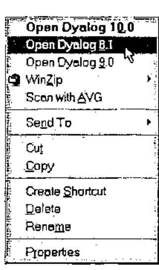

*by David Crossley*
{ .byline }

When you install your version of APL under Windows, the workspace file type will probably be registered in the Windows Registry and associated with the calling program. Thereafter you can left-double-click (or left-single-click if that option is chosen) on a workspace file in Explorer to launch APL and load that workspace. You can instead right-click to open a context menu and select Open to do the same thing.

But what if you have several installed versions of APL from the same vendor? The latest installation will probably pre-empt the Open setting leaving you apparently with no choice other than to launch the version that you wish to use and then load the workspace from APL.

However, Windows allows you to add your own file associations to the context menu. Perhaps this is old hat to you but if not, read on. In Explorer, select a workspace, then choose File/Options. from the menu and open the File Types tab. Locate and select the registered file type (eg Dyalog APL Workspace) and then choose Edit to display another dialog.

Amongst the options list, you will see **open**, possibly the only option. If you select this and then Edit, you will see the Action in a non-editable field and an Application Used input field containing something like:

"H:\\DYALOG10\\DYALOG.EXE" "%1"

This, of course, is the path to the application program. The "%1" indicates the selected workspace file to be passed to the application when it is launched. There is a Browse button to locate the application program you wish to use. **Leave this as it is.** Cancel to return to the previous dialog.

To add a new association, select New to present the same dialog. You may now define your own Action. For example, enter “Open Dyalog &8.1” without the quotes. The & as usual denotes a shortcut character that will appear underlined. Use Browse to locate the application file. It is advisable to enclose this in double quotes, necessary if the path includes spaces, and also the "%1" with a separating space. Press OK to save this and return to the calling menu.

You will see the new entry in the Actions list. The default action is highlighted in bold type. You can set any you choose using the Set Default button. This is the action that is used when you left-double-click a workspace file.

There remains just one small problem. The original action is labelled **open** whereas you might prefer something like **Open Dyalog &10** so that “Open Dyalog <u>1</u>0” appears in the context menu. Oddly, you cannot edit the Action field. You must make the adjustment directly in the Windows Registry.

**Caution:** It is advisable to back-up the Registry before making amendments.

Open the Windows Registry through Run in the Start menu, type “regedit” and expand HKEY_CLASSES_ROOT.

Search for the subkey for the workspace file extension, eg **.dws**, and click on that. Its default value indicates the file type by its subkey code, eg **dwsfile**.

Search for and open the file type subkey, eg **dwsfile**, and then the **shell** subkey. You will see the coded names of the file associations, in this example **open** and **open_Dyalog_81**. Notice that the new action has a derived name. If you click on the action subkey name, you will see its displayed form as the default value. You may safely edit the default value for any action to whatever you like. Right click on the value field, choose Modify and then edit the little pop-up box. Precede the shortcut character with &.

You are now in business. The little illustration demonstrates what my context menu looks like when I right-click on a Dyalog workspace. Of course, the action will succeed only if the workspace is actually readable by that version of APL.
