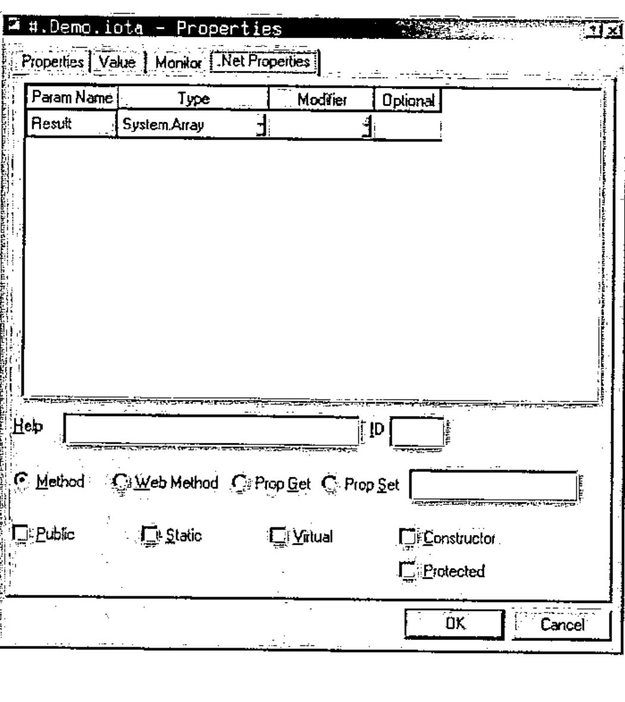
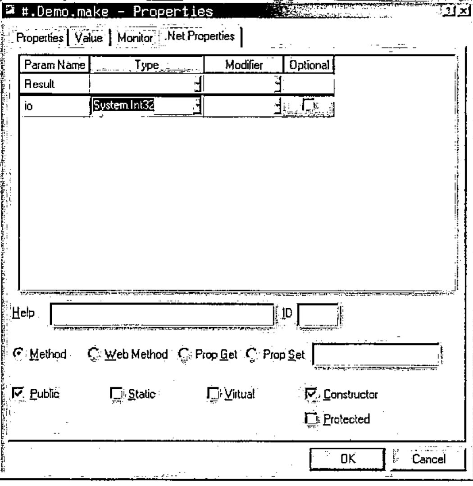
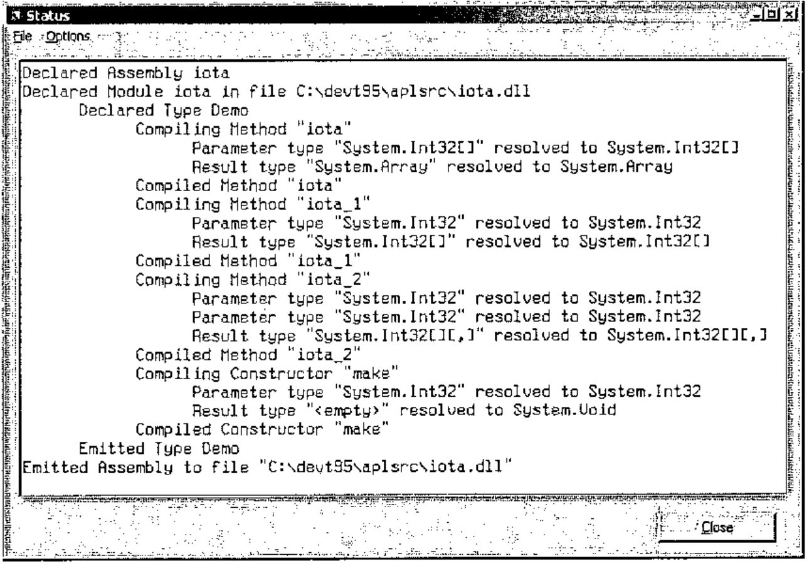
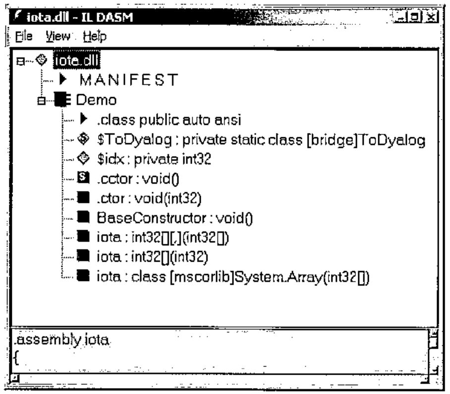
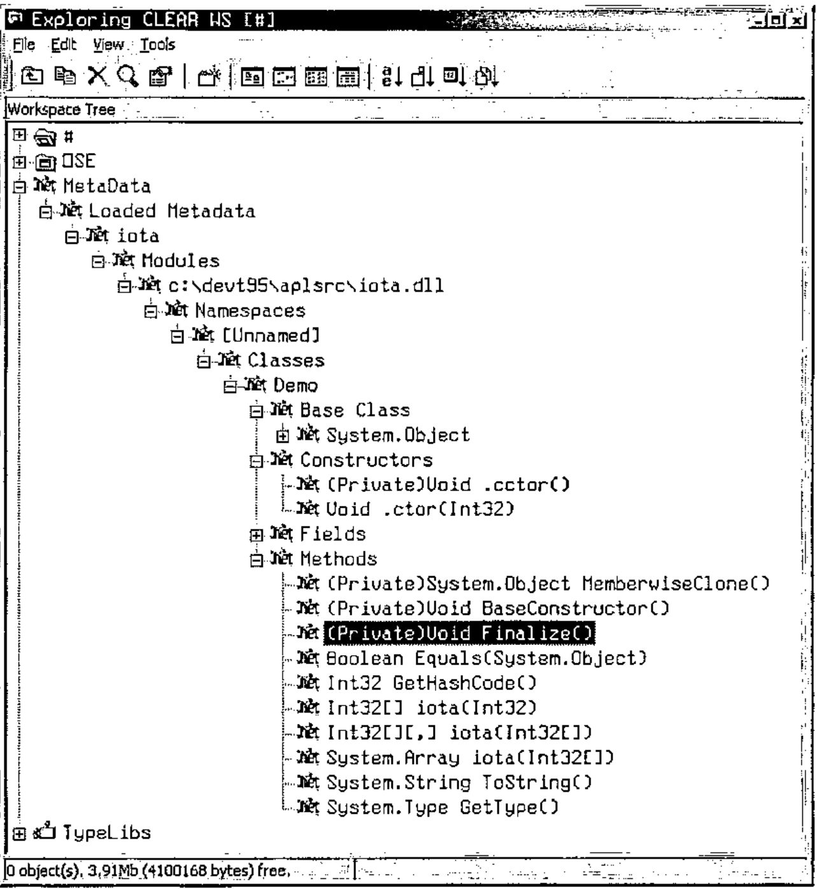
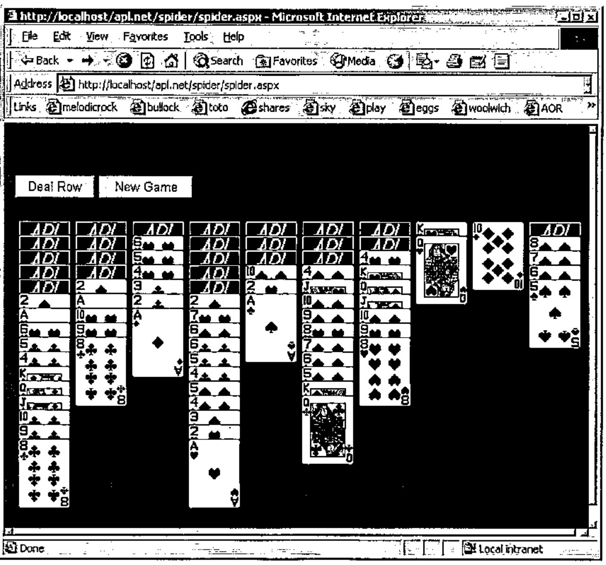

*by John Daintree, Senior Programmer, Dyadic Systems Ltd*<br>
*mailing list: dotnet@dyadic.com*
{ .byline }

## Introduction

This is the first of three papers discussing Dyadic Systems’ new .Net compatible product, Dyalog.Net. In this paper we introduce Dyalog.Net and give a broad overview of the facilities available. Subsequent papers will focus on particular aspects of the integration with Microsoft. Net.

Dyadic Systems has set up a mailing list to discuss Dyalog.Net related issues. To subscribe to this list, send an email to dotnet@dyadic.com with SUBSCRIBE as the subject.

## Setting the Scene

### What would *you* do if Bill called?

It was back in 1999 that Dyadic Systems received a phone call from Microsoft. OK, the call wasn’t from Bill Gates himself (who, incidentally has an interest in APL), but from Microsoft employees who described themselves as "Software Evangelists". Would Dyadic Systems Ltd be interested in participating with Microsoft in the development of a "Major New Technology"?

Duh! we said "Yes".

Shortly thereafter we received a visit from two Microsoft representatives who had come from Seattle to see us. And yes, their business cards did say "Software Evangelist".

The product Dyalog.Net is the result of a collaboration between Dyadic Systems and Microsoft. Dyalog.Net combines the power of Dyalog APL with the benefits of the Microsoft .Net Framework.

## What is Microsoft .Net?

Anyone who has even glanced at a computer related publication over the past 6 to 24 months could not have helped but become aware of Microsoft .Net.

The .Net Framework is, to quote Microsoft,

> *"…a set of Microsoft software technologies for connecting your world of information, people, systems, and devices. It enables an unprecedented level of software integration …., discrete, building-block applications that connect to each other—as well as to other, larger applications…. .NET connected software delivers what developers need to create XML Web services and stitch them together. The benefit to individuals is seamless, compelling experiences with information sharing."*

From an APL perspective Microsoft .Net provides us with a large number of objects, i.e. instances of classes (or, to use Microsoft .Net parlance, *Types*). These Types are distributed within dynamic link libraries (or *Assemblies*). Types also follow a dot-delimited naming convention, conveniently called *Namespaces*.

So, for example, there is a class called **File** that resides in a namespace called **System.IO**, to give a complete name for the Type of **System.IO.File**. This class allows us to manipulate files in an object-oriented fashion.

The Microsoft .Net Framework, as shipped by Microsoft, consists (amongst other things) of a large number of assemblies and the infrastructure required to host them.

Assemblies are self-describing, that is to say that an Assembly not only contains the binary code to implement all the methods in the assembly but also data that describes every method in the assembly. In addition every parameter to every method in every type in every namespace is described in this data. This extremely valuable source of information is termed *Metadata*.

### Metadata

It is tempting to compare metadata with Type Library information, which we may be familiar with from COM. However type library information was essentially optional within the COM environment (although Dyalog APL requires it).

Metadata is an integral part of an assembly. Without metadata the assembly is incomplete and there is no way to access the methods within it (from Dyalog.Net or from any other programming language). Gone are the days of missing type libraries or worse, incorrect or inconsistent type libraries.

### Inheritance.

The .Net model is a rich Object-Oriented model. With one single exception every Type derives from (i.e. *inherits* from) a single base-type. This inheritance can be arbitrarily deep, but ultimately every Type derives from a Type called **System.Object**. **System.Object** is the exception to this rule, as it derives from nothing; it is the "Grand-Daddy of them all".

## What is Dyalog.Net?

Dyalog.Net is a companion product to Dyalog APL 9.0. Dyalog.Net requires that the Microsoft .Net Framework is installed. In fact Dyadic Systems recommends that the .Net SDK be installed on the machine, as this package includes a number of useful tools, a large amount of documentation and a vast number of useful examples.

Dyalog.Net allows APL programmers to make use of the Types defined with assemblies, including those Types that are part of Microsoft .Net itself, and also new Types written in a number of languages, such as VB.Net, or Microsoft’s new .Net specific language, C#, (pronounced "C-Sharp").

Dyalog.Net also allows APL programmers to create their own Types that can subsequently be used by .Net aware applications, which in turn may be written in any .Net aware language.

## Why?

Amongst the classes included within the .Net Framework are Types such as **System.Web.UI.Page**, which allows us to write Web Pages without any need to write the TCPIP "plumbing code". **System.Web.WebServices.WebService**, which allows us to write an application that can be called over the Internet by any WebService aware application. There is a namespace called **System.Windows.Forms**, which contains a number of Types that allow us to manipulate the GUI of the host operating system.

In addition there are a large number of "primitive" types such as 64-bit integers, currency types, datetime types and so on, that can be used as part of an APL application.

In other words there are a large number of extremely useful classes that we want to be able to utilize.

## How?

## Using Existing Types.

Dyalog.Net is fully compatible with Dyalog APL 9.0 and is able to run all existing Dyalog APL code and applications. To preserve this level of backwards compatibility Dyadic Systems has introduced a new system variable, `⎕USING`, to determine that .Net Types are to be used by the application. `⎕USING` allows the programmer to specify which .Net classes to use, and in addition, in which assembly these Types are located.

The simplest specification of `⎕USING` is a single empty character vector.

```apl
      ⎕using←,⊂''
      ⍴⎕using
1
```

and this can be abbreviated to

```apl
      ⎕using←''
      ⍴⎕using
1
```

Most of the basic .Net types are defined within an Assembly called mscorlib.dll. Dyalog.Net automatically makes this Assembly available so we do not need to specify an assembly name in `⎕USING`.

We can now access some of the "primitive" .Net objects

```apl
      dt1←System.DateTime.New 2002 8 31 7 30 0
      dt1
31/08/2002 07:30:00
```

The **DateTime** Type is a class that allows is to manipulate dates and times as primitive objects.

```apl
      ⎕nc 'dt1'
9
```

We can see that `dt1` is an object of class 9, i.e. it is a "namespace reference", or more precisely a reference to a .Net object.

The display form of a .Net object is obtained from a method within the object called **ToString**. This is a method that is defined on **System.Object**, and because every object in the .Net framework derives (ultimately) from **System.Object** we should be able to call **ToString** on all objects. Dyalog.Net calls the **ToString** method whenever the display form of a .Net object is required. We could easily type

```apl
      dt1.ToString ⍬
31/08/2002 07:30:00
```

To get the same result

Many of the methods within the .Net framework exist in a number of forms, where each form may take a different number of parameters, or where the parameters may have different types. This is a concept called *overloading*.

Dyalog.Net automatically matches your parameters with each of the possible sets for the method and picks the version of the method that matches what you have supplied.

In this instance we want to call the *overload* of the **ToString** function that takes zero arguments, so we provide an empty parameter list, specified by `⍬`.

The `New` method, that we called to create `dt1`, is known as the *constructor* for the Type. That is, it can be used to create an initialised instance of the Type. The constructor for the **DateTime** class is overloaded, and in the example above we used the overload that took 6 numeric parameters. Alternatively we could have called the overload that takes only three arguments.

```apl
      dt2←System.DateTime.New 2002 8 31
      dt2
31/08/2002 00:00:00
```

We can see that in this case we have specified the date part of the **DateTime**, and defaulted the time section.

We can determine the exact type of a .Net object by calling its GetType member. Again, this member is defined on System.Object and so is available on all objects. GetType returns an instance of the System.Type class. The display form is again obtained from ToString, and so is easily readable.

```apl
      type←dt2.GetType
      type
System.DateTime
```

The **ToString** member of the **DateTime** object has a number of overloads, some of which take arguments, and one of which does not. In APL we have no mechanism to have an optional right argument to a function so **ToString** appears as a monadic function, and we use `⍬` to indicate an empty parameter list. **GetType** only has a single overload, and this take no arguments, so **GetType** appears as a niladic function in the object.

We can use the result of **GetType** to find out more about the instance, for example, the list of Constructors that are available to us:

```apl
      ↑⍕¨dt2.GetType.GetConstructors ⍬
Void .ctor(Int64)
Void .ctor(Int32, Int32, Int32)
Void .ctor(Int32, Int32, Int32, System.Globalization.Calendar)
Void .ctor(Int32, Int32, Int32, Int32, Int32, Int32)
Void .ctor(Int32, Int32, Int32, Int32, Int32, Int32,
     System.Globilization.Calendar)
Void .ctor(Int32, Int32, Int32, Int32, Int32, Int32, Int32)
Void .ctor(Int32, Int32, Int32, Int32, Int32, Int32, Int32,
     System.Globalization.Calendar)
```

These are the methods that the function `New` calls internally. The result of **GetConstructors** is actually an array of **MethodInfo** objects. The display form of a **MethodInfo** is a C language-like description of the method. You will notice that format, `⍕`, calls the **ToString** member of the object.

The documentation for the **DateTime** class describes each of these overloads in detail.

As mentioned previously we can manipulate these **DateTime** objects as if they were primitive objects in APL, for example

```apl
      diff←dt1-dt2
      ⎕nc 'diff'
9
      diff.GetType
System.TimeSpan
      diff
07:30:00
      diff.TotalSeconds
27000
```

Subtraction of **DateTime** objects results in an instance of a **TimeSpan** object. Dyalog.Net calls the **op_Subtraction** method defined on the **DateTime** Type. This method does the actual calculation and returns the result, which again is a namespace reference. In the same way Dyalog.Net can perform addition, multiplication, comparison, and other common operations on .Net objects.

Scalar extension works in exactly the way we would expect

```apl
      dt2 dt1-dt2
00:00:00  07:30:00
      (dt2 dt1-dt2).TotalSeconds
0 27000
```

In the examples so far, all the methods we have called have been methods on instances of the Type. These are called *instance* methods. However, there are a number of methods that we can call directly on the class. These are called *static* methods, for example

```apl
      System.DateTime.IsLeapYear ¨1600 1601
1 0
```

We can also have static properties on .Net Types

```apl
      now←System.DateTime.Now
      now
27/05/2002 10:21:32
```

The static property **Now** (unsurprisingly) provides the current date and time.

.Net objects can generate errors. Within the .Net framework errors are handled in a very APL like way. When an error is raised the calling method can trap the error and handle it accordingly. If the error is not caught the application is interrupted and may either terminate or enter a debugger.

Within the .Net framework, errors are called *Exceptions*. Exceptions are raised (i.e. *thrown*) and trapped (i.e. *caught*). In Dyalog.Net, when a .Net method throws an exception an `EXCEPTION` error is signalled. When an `EXCEPTION` is signalled the system variable `⎕EXCEPTION` is set to the value of the thrown exception. This is itself an instance of a .Net object, specifically something that derives from **System.Exception**. The exception object has members such as **Message**, which return a text-description of the error, and **StackTrace**, which returns the execution stack at the point the error was thrown.

The **DateTime** class has a static method called **Parse**, which takes a string argument and attempts to convert the string to an instance of **DateTime**.

```apl
      dt1←System.DateTime.New 2002 8 31
      str←dt1.ToString ⍬
      dt2←System.DateTime.Parse str
      dt2=dt1
1
```

If we call **Parse** with an invalid string an Exception is raised

```apl
      System.DateTime.Parse '27/05/2002a'
EXCEPTION
```

and we can interogate the exception

```apl
      ⎕exception.Message
The string was not recognized as a valid DateTime.  There is an
 unknown word starting at index 10.
      ⎕exception.GetType
System.FormatException
```

`EXCEPTION` has the value 90 and can be trapped in the usual way.

The use of System as a prefix to all the references to **DateTime** may be something of a nuisance. The syntax of `⎕USING` allows us to omit this part of the name

```apl
      ⎕using←'System'
      DateTime.Now
27/05/2002 10:29:30
```

The value of each element of `⎕USING`, is prepended to the classname until a match is found.

We can use multiple elements in `⎕USING` to access components from multiple namespaces in multiple assemblies, for example to get the SOAP representation of an array

```apl
      ⎕using←,⊂'System' 'System.IO'
      ⎕using,←⊂'System.Runtime.Serialization.Formatters.Soap,
              System.Runtime.Serialization.Formatters.Soap.dll'
```

In this example, the third element of `⎕USING` includes the filename of the assembly. This is separated from the namespace specification by a comma. Dyalog.Net loads this assembly into memory, thus making the Types defined in it available.

We can then write fairly trivial serialization code to get the SOAP for the array. (With thanks to Stefano Lanzavecchia who originally posted similar code to dotnet@dyadic.com)

```apl
      fmt←SoapFormatter.New ⍬
      ms←MemoryStream.New ⍬
      a←((2 3 ⍴⍳6) (2 2⍴'hello' 'world') (.1+⍳3))
      fmt.Serialize ms a
      soap←82 ⎕dr ms.ToArray
      soap
<SOAP-ENV:Envelope xmlns:xsi="http://www.w3.org/2001/XMLSchema-in
stance" xmlns:xsd="http://www.w3.org/2001/XMLSchema" xmlns:SOAP-E
NC="http://schemas.xmlsoap.org/soap/encoding/" xmlns:SOAP-ENV="ht
tp://schemas.xmlsoap.org/soap/envelope/" xmlns:clr="http://schema
s.microsoft.com/soap/encoding/clr/1.0" SOAP-ENV:encodingStyle="ht
tp://schemas.xmlsoap.org/soap/encoding/">
<SOAP-ENV:Body>
<SOAP-ENC:Array SOAP-ENC:arrayType="xsd:anyType[3]">
<item href="#ref-2"/>
<item href="#ref-3"/>
<item href="#ref-4"/>
</SOAP-ENC:Array>
<SOAP-ENC:Array id="ref-2" SOAP-ENC:arrayType="xsd:short[2,3]">
<item>1</item>
<item>2</item>
<item>3</item>
<item>4</item>
<item>5</item>
<item>6</item>
</SOAP-ENC:Array>
<SOAP-ENC:Array id="ref-3" SOAP-ENC:arrayType="xsd:anyType[2,2]"
<item id="ref-5" xsi:type="SOAP-ENC:string">hello</item>
<item id="ref-6" xsi:type="SOAP-ENC:string">world</item>
<item id="ref-7" xsi:type="SOAP-ENC:string">hello</item>
<item id="ref-8" xsi:type="SOAP-ENC:string">world</item>
</SOAP-ENC:Array>
<SOAP-ENC:Array id="ref-4" SOAP-ENC:arrayType="xsd:double[3]">
<item>1.1</item>
<item>2.1</item>
<item>3.1</item>
</SOAP-ENC:Array>
</SOAP-ENV:Body>
</SOAP-ENV:Envelope>
```

## Creating new Types

In addition to being able to make use of existing Types, Dyalog.Net allows us to define new Types (that derive from any appropriate existing Type). This can be achieved in a number of ways. In this paper we will consider the traditional mechanism, `⎕WC`, that will be familiar to most users of Dyalog APL.

We want to create a new .Net Type, so we use `⎕WC` to create a new namespace. We can (optionally) provide the name of the Type from which we wish to derive. The name of the base type is resolved using the current value of `⎕USING`, so the following statements are equivalent:

```apl
⎕using←'System'⋄  'Demo'⎕WC'NetType' 'Object'
⎕using←0⍴⎕using   'Demo'⎕WC'NetType'
⎕using←''      ⋄  'Demo'⎕WC'NetType' 'System.Object'
```

Once we have created the namespace we move into that space

```apl
      )cs Demo
#.Demo
```

We now define an APL function in any of the usual ways

```apl
      ⎕fx 'r←iota n' 'r←⍳n'
      )fns
iota
```

As already stated, a .Net assembly includes metadata that describes the parameters to each of the methods in the assembly. From the Dyalog.Net development environment we use a dialog box to provide this information.

We can right click on the name of a function, and select the "Properties" menu item. This presents us with the properties dialog box for the function.



We can modify this box to provide the correct information about the method that we wish to export.

From an APL perspective, the method iota can take a rank 1 array of integers as its parameter. The result will be an **Array** of corresponding rank. The following dialog box contains the appropriate definitions.

![The same page with Result of type System.Array and shape of type System.Int32[]; Public checked](art10002750/props2.jpg)

In this illustration "System.Int32[]" is the .Net specification of a rank 1 array of 32-bit integers. Similarly "System.Array" is the .Net specification of an **Array** of unknown type and unknown rank.

This is the closest match we can get to the APL definition of the iota primitive, however other languages with a less elegant mechanism for creating arrays would benefit from a simpler declaration of the function. For this reason it is good practice to provide overloads for the common cases in addition to the generic solution.

Here is the properties box for a function called iota_1 that provides the metadata for the rank 1 variant of iota. Here the result is a rank 1 array of integers and the parameter is a scalar 32-bit integer. Note that we can specify the "external" name for iota_1, in this case "iota", thus specifying that we are providing an overload for that function.

![The .Net Properties page for #.Demo.iota_1: Result of type System.Int32[], Param1 of type System.Int32; external name iota; Public checked](art10002750/props3.jpg)

Similarly here is the properties box for a function called iota_2 that provides the metadata for the rank 2 variant of iota.

![The .Net Properties page for #.Demo.iota_2: Result of type System.Int32[][,], Param1 and Param2 of type System.Int32; external name iota](art10002750/props4.jpg)

Note that here, because we need to return a nested array, the result type is declared as a 2 dimensional array of Int32[].

Finally we may want to specify the index origin that should be used when iota is executed. We could pass an extra argument to the iota method each time it is called, but a better solution would be to define a constructor method for the Demo class. This constructor could have a single argument that is the value of `⎕IO` to be used during the iota calculations.

At runtime, each instance of our Demo class is its own instance of the Demo namespace. As `⎕IO` has namespace scope, we can be sure that each instance of Demo will execute independently of any other.

Here is the body and of our constructor method.

```apl
     ∇ make io
[1]
[2]    :Trap 0
[3]        ⎕IO←io
[4]    :Else
[5]        (Exception.New'io must be 0 or 1')⎕SIGNAL 90
[6]    :End
     ∇
```

Note that we trap any error from the assignment to `⎕IO`. If there is an error we use `⎕SIGNAL` to raise a .Net Exception, with an appropriate message.



Note that we have checked the "Constructor" check box, and that the method does not return a result (the Type field of "Result" is empty). When this method is called we will be inside a newly created instance of the Demo namespace, so the assignment to `⎕IO` will only affect this instance of Demo.

Once we have defined all the methods in our Type we can package our workspace as a .Net assembly. This can be achieved with the "Make Assembly" menuitem on the session menu. When we select this item we can choose the name and location of the desired assembly, and Dyalog.Net builds the assembly. The status window is used to provide information about the "compilation" process



You will notice the word "compiled" in the Dyalog.Net status window. It is important to note that the APL code itself is not compiled. The process compiles "stub" functions that make calls into the Dyalog.Net interpreter. The word "compile" is used to be consistent with other languages and .Net tools.

Also, the workspace is not saved at this point, if we want to save our source code, it is necessary to use `)SAVE` to save the workspace. The Assembly that we have created includes the active workspace so we do not need to ship our workspace with the generated dynamic link library.

We can use Microsoft’s ILDASM tool, to investigate the contents of our newly created assembly, and we can see the several overloads of the iota function, and also our definition of the constructor, called ".ctor".



Of course, Dyalog.Net has a built-in Metadata viewer. This is part of the Workspace Explorer.



This is the C# code that uses instances of our Demo class to perform the iota calculations. We can clearly see the advantages of using the "simple" overloads of iota.

```csharp
using System;
class UseIota
      {
      static void Main()
            {
            Demo demo = new Demo(0);
            int[] shape={1,2,3};

            Console.WriteLine(demo.iota(10));

            Console.WriteLine(demo.iota(10,10));

            demo = new Demo(1);

            Console.WriteLine(demo.iota(shape));
            }
      };
```

## Future Papers

### APLScript

Using the development environment to create .Net Assemblies is a convenient mechanism for those of us who are familiar and comfortable with the IDE. On many occasions it is more convenient to define our source code using a more traditional mechanism. This is where APLScript comes in. The following example lists the same Demo class, this time, written in APLScript. This is saved in a single UNICODE text file, and we use the APLScript compiler to generate the assembly. APLScript will be discussed in detail in a following paper.

```apl
:Class Demo

    ∇make io
    :Access Constructor
    :ParameterList Int32
    :Trap 0
        ⎕IO←io
    :Else
        (Exception.New'io must be 0 or 1')⎕SIGNAL 90
    :End
    ∇

    ∇r←iota n
    :Access Public
    :ParameterList Int32[]
    :Returns Array
    r←⍳n
    ∇

    ∇r←iota_1 n
    :Access Public
    :ParameterList Int32
    :Returns Int32[]
    :Implements Method iota
    r←iota n
    ∇

    ∇r←iota_2 n
    :Access Public
    :ParameterList Int32[]
    :Returns Int32[][,]
    :Implements Method iota
    r←iota n
    ∇

:EndClass
```

### Web Pages and Web Services

We will see how we can use the .Net framework and APLScript to create web pages such as this one. The multi threading aspects of providing web pages will be discussed.



### The .Net GUI: System.Windows.Forms

The System.Windows.Forms namespace contains a rich and varied set of classes that can be used to create GUI applications. These classes are available to us either as an alternative to, or in addition to, the native Dyalog GUI.
