*by John Daintree*
{ .byline }

## Introduction

This is the second of three papers discussing Dyadic Systems’ .Net compatible product, Dyalog.Net.

In this paper we discuss APLScript, a UNICODE based representation of APL programs.

Dyadic Systems has set up a mailing list to discuss Dyalog.Net related issues. To subscribe to this list, send an email to dotnet@dyadic.com with SUBSCRIBE as the subject.

## Why APLScript?

APL has traditionally been developed using dedicated development environments. These environments typically comprise of editors, debuggers, workspace explorer tools, and a host of other features that "enhance " the coding experience. In many cases, especially when one is writing a simple utility or application it may be more convenient to dispense with this complex environment.

APLScript is a version of Dyalog APL that allows us to write APL code in any UNICODE aware editor. Armed with just Notepad, or our favourite text editor, we can write and deploy our APL application.

Another advantage of using APLScript is that we can take advantage of existing source-control systems to save our APL code. Also, we can use standard text comparison utilities to quickly find changes across versions of our source code. In multiple language projects the APL source code can be saved alongside the source code of the other languages, and even viewed using the same tools.

## Hello World

Using APLScript we can simply open Notepad and write a simple function:

```apl
∇hello
⎕←'Hello World'
∇
```

### Typing APL into Notepad?

Dyalog.Net ships with a useful little utility called the APL IME. IME is an abbreviation of Input Method Editor. The APL IME allows us to type APL code (using our chosen APL translate table) into any application that is "IME aware".

The IME can be configured from the Control Panel

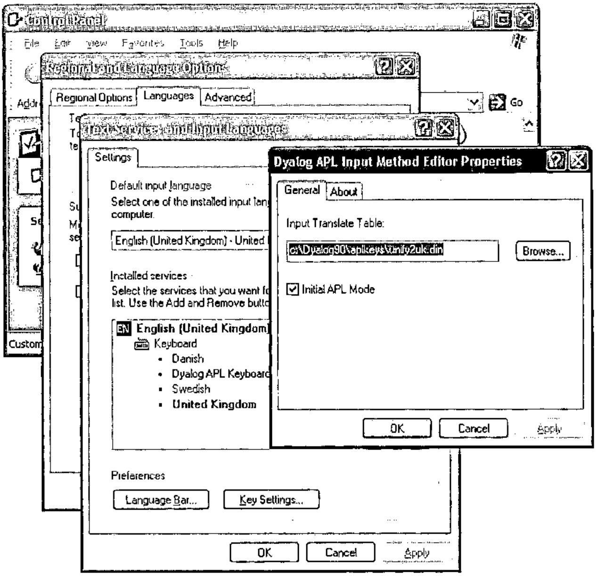

During use, the APL IME presents itself as a small button that also indicates if APL input is currently enabled.

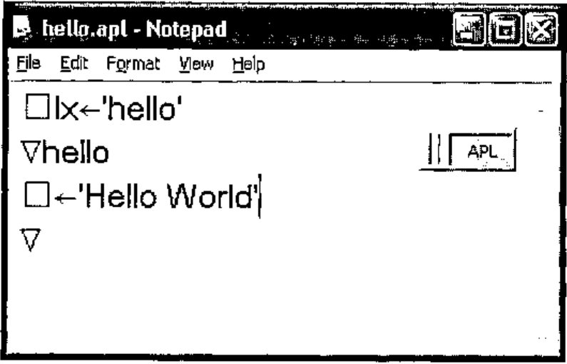

### Back to the World

We can use the APLScript compiler to generate an executable file from this source code (which was saved in the text file hello.apl).

```text
aplc /lx:hello /console hello.apl
```

The program aplc.exe is the APLScript compiler. This itself is written in Dyalog APL, and has been packaged into an executable by the Dyalog APL development environment.

On the command line we have used the /lx option to specify that the hello function is the "entry-point" of the program. The /console option indicates that this application can write to the host command window directly , and does not use the Dyalog session for input or output.

The full list of options for aplc.exe can be obtained with the command aplc /?, and this returns:

aplc.exe command line options:

```text
/?               Usage
/r:file          Add reference to assembly
/o[ut]:file      Output file name
/x:file          Read source files from Visual Studio.Net project file
/res:file        Add resource to output file
/q               Operate quietly
/v               Verbose
/s               Treat warnings as errors
/runtime         Build a non-debuggable binary
/lx:expression   Specify entry point (Latent Expression)
/t:library       Build .Net library (.dll)
/t:nativeexe     Build native executable (.exe). Default
/t:workspace     Build dyalog workspace (.dws)
/nomessages      Process does not use windows messages. Use when creating
                 a process to run under IIS
/console         Creates a console application
```

Some of these options will be discussed in this and future articles.

We can open a command window and execute hello.exe, which we can see is a "normal" executable file:

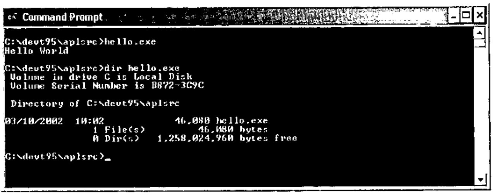

This use of APLScript to create standalone executable files is independent of the .Net Framework. This example will compile and execute on any windows platform, with or without the .Net framework. The simplicity of the example illustrates the convenience of APLScript.

The Dyalog APL Development environment can be used to create executables directly from workspaces.

## Writing Code in APLScript

The rules for APLScript are fairly simple. There are three things that can appear in APLScript.

1. An APLScript statement, e.g. `:Class`, `:EndClass`, `:Field`
2. A function definition, delimited by ‘`∇`’
3. An executable expression

## APLScript Statements

### `:Class`, `:EndClass`

e.g.

```apl
:Class Example:System.Object
      .
      .
      .
:EndClass
```

These APLScript declarations declare that the subsequent functions and code expressions comprise a new .Net Type. In full, we specify the name of the new class and the name of the base class. If the base class name is omitted it defaults to System.Object.

The example above declares a new Type called Example, that derives from System.Object.

### `:Field`

e.g.

```apl
:Field Int32 Code
```

`:Field` defines a named "slot" within the class. This slot has a particular type and only data of the declared type can be stored in the field.

In the example we are declaring a field called `Code`, which can only contain data of type `Int32`

### `:Struct`, `:EndStruct`

e.g.

```apl
:Struct Booking
    DateTime When
    String Customer
:EndStruct
```

These statements define a "structure". A structure is a set of name value pairs, which can be passed as a single entity to a function.

Each entry in a structure is similar to a field in that the data must be of the appropriate type.

### `:Namespace`, `:EndNamespace`

e.g.

```apl
:Namespace utils
      .
      .
      .
:EndNamespace
```

Similar to `:Class`, but these declarations define a "traditional" namespace that will contain the subsequent functions and evaluated code expressions.

### `:Property`, `:EndProperty`

e.g.

```apl
:Property Int32:IO
    ∇r←get
[1] r←⎕IO
∇
    ∇set value
[1] ⎕io←value
    ∇
:EndProperty
```

These statements allow us to define functions that will be called to set and get the values for a property.

This example above defines a property called `IO`.

The APLScript compiler generates a function called `get_IO` which contains the get portion of the code, and a `set_IO` function that contains the set portion.

Encapsulating access to `⎕IO` as a property allows the calling language to use simple reference and assignment to access the current value. Using functions that perform the assignment and retrieval of the value allows the APL code to perform error checking on the value and throw appropriate exceptions if necessary.

A property can be made read-only by omitting the "set" portion of the `:Property` declaration.

### `:Indexer`, `:EndIndexer`

e.g.

```apl
:Indexer Array:Item
:ParameterList Int32
    ∇set args
[1] value index←args
[2] value ⎕freplace tie index
    ∇
    ∇r←get index
[2] r←⎕fread tie index
    ∇
:EndIndexer
```

An *indexer* is a special type of property. The indexer specifies the "default" member of a Type. We will see another example of an indexer later.

## APLScript Functions

e.g.

```apl
     ∇hello
[1]  ⎕←'Hello World'
     ∇
```

APL Functions in APLScript are indicated by the ‘`∇`’ character.

Within the body of the function line numbers may be present but are ignored by the script compiler.

When a function appears within `:Class` and `:EndClass` statements additional statements may be contained within the body of the function. These statements determine the metadata for the function.

The permitted statements are as follows.

### `:Access`

e.g.

```apl
:Access Public
```

or

```apl
:Access Constructor
```

or

```apl
:Access ClassConstructor
```

or

```apl
:Access Public Constructor
```

"`:Access Public`" indicates that the function is "exported" from the Type in which it is defined. A function can be marked as `Public` (the default) or `Private`. A private function can only be called by the APL code in the workspace, not by any code that instantiates an instance of the Type.

"`:Access Constructor`" indicates that the function is a constructor for the type. A constructor function is called on a new instance of the type and allows the APL code to initialise the contents of the new object.

"`:Access ClassConstructor`" indicates that the function is a class constructor for the type. This function will be called before any instances of the type are created. This allows the APL code to initialise any elements of the class that will be common to all instances.

As shown in the final example, qualifiers to `:Access` can be merged in a single `:Access` statement.

The `Constructor` and `ClassConstructor` qualifiers are only applicable within `:Class`/`:EndClass` statements

### `:ParameterList`

e.g.

```apl
:ParameterList Int32,String
```

or

```apl
:ParameterList Int32 value,String forename,String surname
```

`:ParameterList` specifies the parameter types of a function. It is a comma separated list. Each element of the list specifies the type of the corresponding parameter. A name for the parameter can be specified, and this appears in the metadata, but is otherwise unused.

`:ParameterList` has no impact on how the function is called from APL, it is only used to provide metadata for the assembly that is created from the script.

### `:Returns`

e.g.

```apl
:Returns Int32
```

`:Returns` specifies the type of the return value for the function. If `:Returns` is omitted from a function definition then the function should not return a result.

### `:Implements`

e.g.

```apl
:Implements Iota
```

or

```apl
:Implements PropGet IO
```

or

```apl
:Implements PropSet IO
```

`:Implements` allows us to export the containing function with a name other than the name of the function itself . This allows us to specify that a function provides an "overload" of a method. In addition `:Implements` can be used to indicate that a function is a get or set *accessor* for a property.

Each of these statements provide the same information in APLScript that was provided by the various dialog boxes in the Dyalog.Net development environment.

## APLScript Executable Expressions

Executable expressions are those expressions that appear outside of the body of a function.

Executable expressions are evaluated by the APLScript compiler **at compile time.** For example, consider the following APLScript program

```apl
⎕lx←'hello'
⎕cy 'DISPLAY'

toupper←{
      idx←⎕AV⍳⍵
      off←48×(idx≥18)∧idx≤43
      ⎕AV[idx+off]
 }

∇hello
[1] ⎕←DISPLAY toupper 'Hello World'∇
```

The first eight lines of the code are "executable expressions". As such they are executed at compile time. The assignment to `⎕LX` prevents the error that the script compiler would generate if we do not used the /lx command line option. The `DISPLAY` workspace is copied into this executable at compile time, so there are no additional workspaces to ship with our executable. We can also fix dynamic functions in this section of an APLScript program, and these can be called as normal from the body of the script.

## Reading the Command Line

Here is a simple APLScript program that uses the APL function `DISPLAY` to display the result of an APL primitive applied to the arguments passed to the program.

```apl
⎕lx←'disp'
⎕cy 'DISPLAY'

∇disp ;args
args←2 ⎕nq '.' 'GetCommandLineArgs'
⎕←DISPLAY ⍳⍎¨1↓args
∇
```

Note the new method `GetCommandLineArgs` on the root object. This method returns a vector of character vectors, providing the command line arguments of the program. `Args[⎕io]` is the name of the executing program, and so in this example is discarded. In addition there is a method called `GetCommandLine` that returns a character vector containing the command line as it was typed.

So, compiling and executing this program gives:

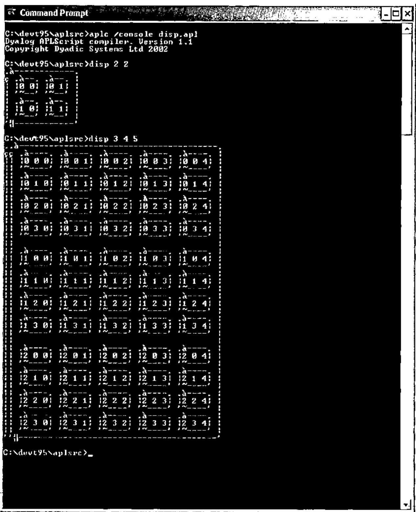

Unfortunately the command window is unable to display the APL characters used by the `DISPLAY` function correctly.

## APLScript and .Net Assemblies

In the first of these Dyalog.Net articles we used the Dyalog APL development environment to create a simple .Net Assembly that contained APL functions that could be called from a C# program. Let us now examine the APLScript version of the APL code from that article:

```apl
:Class Demo

    ∇make io
    :Access Constructor
    :ParameterList Int32

    ⎕io←io
    ∇

    ∇r←iota n
    :Access Public
    :ParameterList Int32[]
    :Returns Array

    r←⍳n
    ∇

    ∇r←iota_1 n
    :Access Public
    :ParameterList Int32
    :Returns Int32[]
    :Implements Method iota

    r←iota n
    ∇

    ∇r←iota_2 n
    :Access Public
    :ParameterList Int32,Int32
    :Returns Int32[][,]
    :Implements Method iota

    r←iota n
    ∇
:EndClass
```

Let’s examine the code a section at a time

```apl
:Class Demo
```

We declare a new .Net Type called `Demo`. The base class is omitted so the new Type will derive from System.Object.

```apl
    ∇make io
    :Access Constructor
    :ParameterList Int32

    ⎕io←io
    ∇
```

The integer parameter of the constructor is used as the value of `⎕IO` for this object.

Note that each instance of a .Net Type written in APL is its own namespace. This means that each instance can have its own global variables (inside the namespace) and because `⎕IO` has "namespace scope" the assignment above will only affect this instance of the Demo Type. At any time there may be multiple instances of `Demo`, possibly with different values of `⎕IO`.

```apl
    ∇r←iota n
```

Here we define a function called `iota`.

```apl
    :Access Public
    :ParameterList Int32[]
    :Returns Array
```

The function is "public", which means that it can be called directly by code outside of the workspace.

The function is declared as taking a vector of integers, and returning an array of arbitrary rank and shape.

This is the most "generic" declaration that we can make for an iota function, and most completely describes the apl iota primitive.

```apl
    r←⍳n
    ∇
```

The function just returns the result of the application of the APL primitive to the argument.

```apl
    ∇r←iota_1 n
    :Access Public
    :ParameterList Int32
    :Returns Int32[]
    :Implements Method iota

    r←iota n
    ∇

    ∇r←iota_2 n
    :Access Public
    :ParameterList Int32,Int32
    :Returns Int32[][,]
    :Implements Method iota

    r←iota n
    ∇
```

In addition to the basic `iota` function, we can also define "overloads" of `iota`. This is illustrated in the two functions above, each of which define an overload of `iota` and return arrays of rank 1 and 2 respectively. The `:Implements` statement declares that the methods `iota_1` and `iota_2` are visible externally with the name "iota". Note that `iota_1` and `iota_2` each call the previously declared `iota` function. `iota` is called as if it were any other APL function.

The definition of the class is terminated with the `:EndClass` statement.

This APL source code is saved in the file iota.apl (remember that this is UNICODE text file). Again, we can use the APLScript compiler to compile the APL code into a .Net Assembly

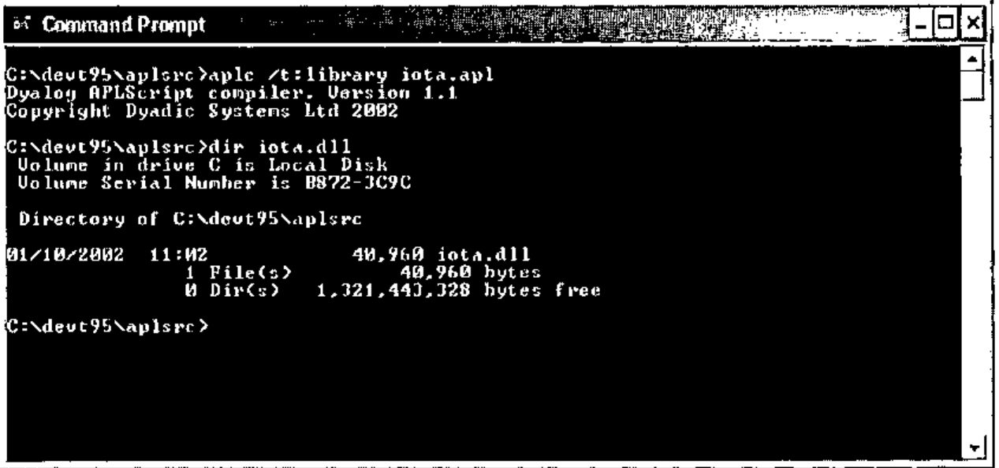

Similar C# code to that presented in the first article can then use the Demo Type contained within the assembly.

```csharp
using System;

class UseIota
    {
    static void TestDemo()
        {
        Demo demo = new Demo(2);
        int[] shape={1,2,3};

        Console.WriteLine(demo.iota(10));
        Console.WriteLine(demo.iota(10,10));
        Console.WriteLine(demo.iota(shape));
        }

    static void Main()
        {
        TestDemo();
        }
    };
```

## A Note about Debugging

If we have an error in our APL code then the Dyalog APL development environment is invoked at runtime to allow us to debug the application. Consider the case where the C# programmer attempts to create an instance of Demo, passing an invalid value for `⎕IO` to the constructor function. The Dyalog debugger displays as shown below:

![The Dyalog APL/W session and debugger showing DOMAIN ERROR in make[4] ⎕IO←io](art10002760/debug.jpg)

We can use the usual techniques to fix the problem. Notice that as shown below, `)SI` includes the full stack trace of the application, including the portion from the C# code. `⎕SI` just returns the APL portion of the stack.

![The session after )si, listing AppDomain_USE_IOTA_EXE.Assembly_iota.Demo.make[4]*, UseIota.TestDemo[], UseIota.Main[] and the system thread; io is 2](art10002760/si.jpg)

The ideal solution to this error is to trap the error on assignment to `⎕IO` and throw a .Net exception that the C# code can catch. The new constructor would look as follows

```apl
    ∇make io
    :Access Constructor
    :ParameterList Int32

    :Trap 0
    ⎕io←io
:Else
    (ArgumentException.New 'io must be 0 or 1') ⎕signal 90
:EndTrap
    ∇
```

If we had compiled our APLScript library with the /runtime option then we would have seen the standard Dyalog "runtime violation" dialog box, not the debugger.

## APLScript and Microsoft Visual Studio.

APLScript has allowed us to remove the APL language from the constraints of any particular development environment. We have seen that we can use Notepad, or any UNICODE text editor, to write APL code. In addition there is at least one important development environment that can now be used to develop APL code, and that is **Microsoft Visual Studio. Net.**

When Dyalog.Net is installed on a machine where Microsoft Visual Studio. Net (hereafter referred to as VS.NET) is installed, the installation process integrates APLScript with VS.NET.

When we select "New Project " from the VS.NET IDE we are given the option to create an "Apl exe project" or a "Apl dll project".

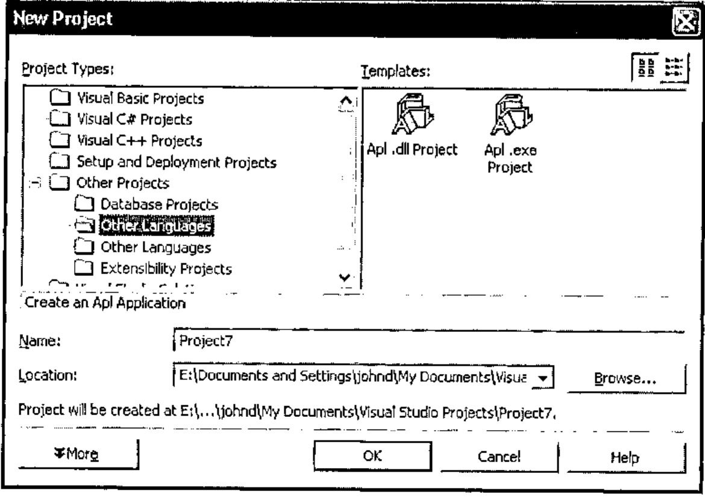

Selecting "Apl .exe project" causes VS.NET to create an empty project for us that initially contains a file called main.apl which is our initial APLScript source code document.

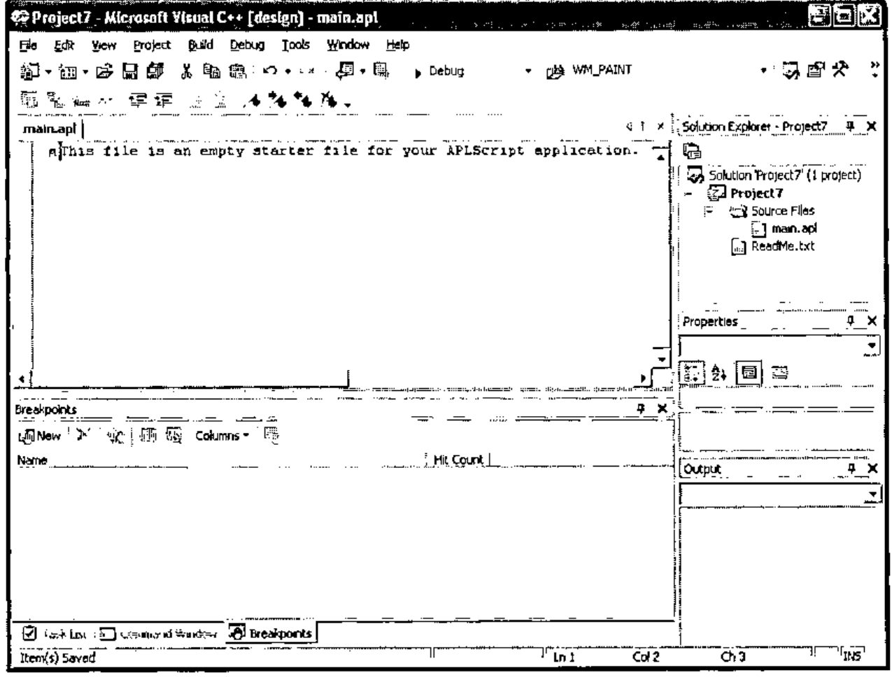

Using the APL IME we can type our APL code into the VS.NET editor.

Here is a simple GUI "hello world" program

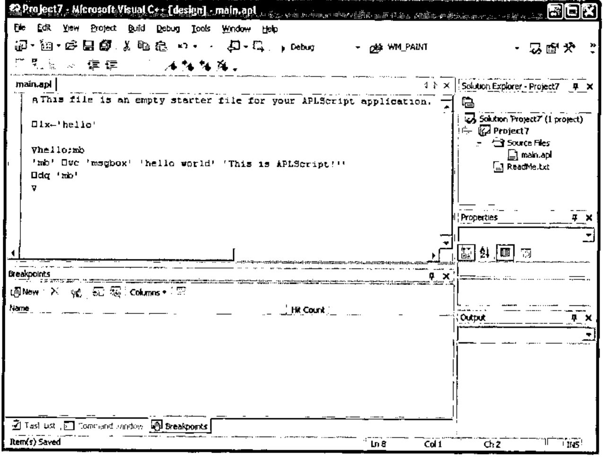

We can select "Build Project" from the Build Menu

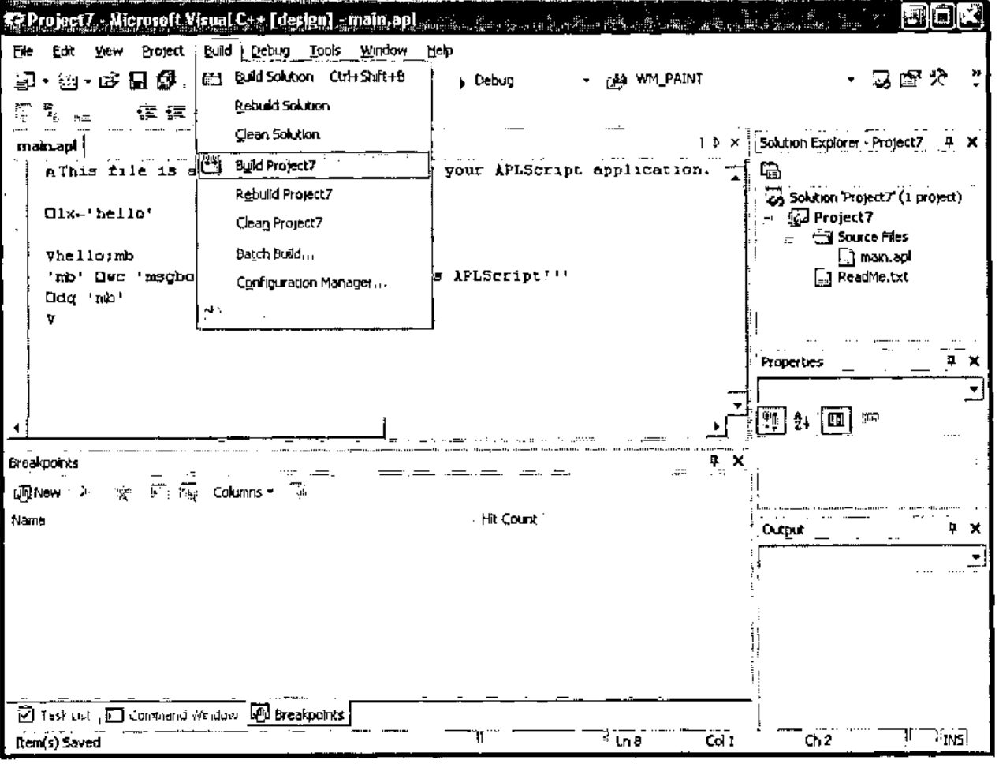

And this invokes the APLScript compiler, which compiles the source code.

Finally, we can execute project7.exe.

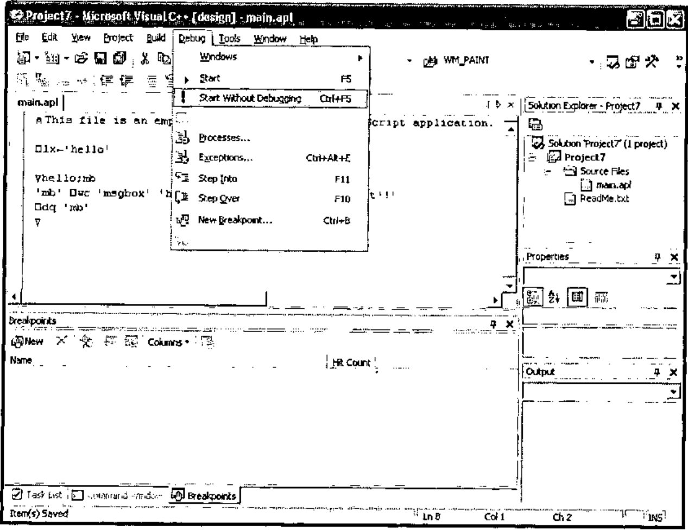

And we get…

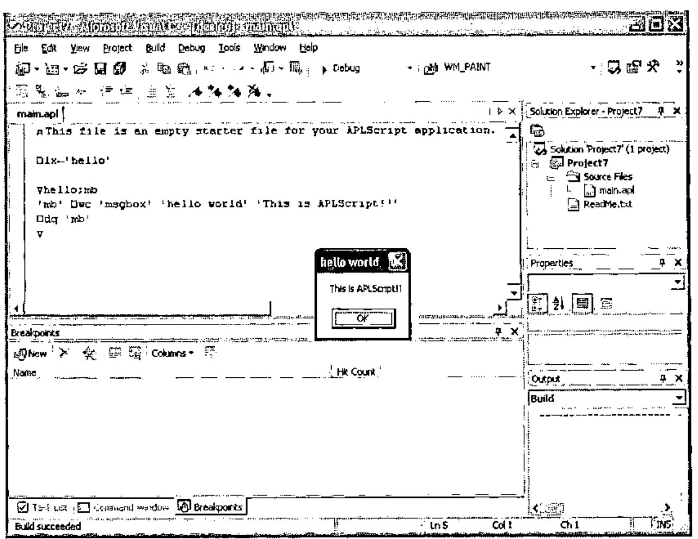

Admittedly a trivial example, but it indicates the portability of APLScript.

Let’s look at a more complicated example that uses two programming languages, some .Net, and some APL component files.

## The ComponentFile Solution

Dyalog.Net ships with a VS.NET *solution* called ComponentFiles. A solution is a number of related projects. In ComponentFiles we have a project called cfiles, which is written in APLScript, and a project called ComponentFiles which contains C# source code.

If we open the ComponentFiles solution in VS.NET we see the following:

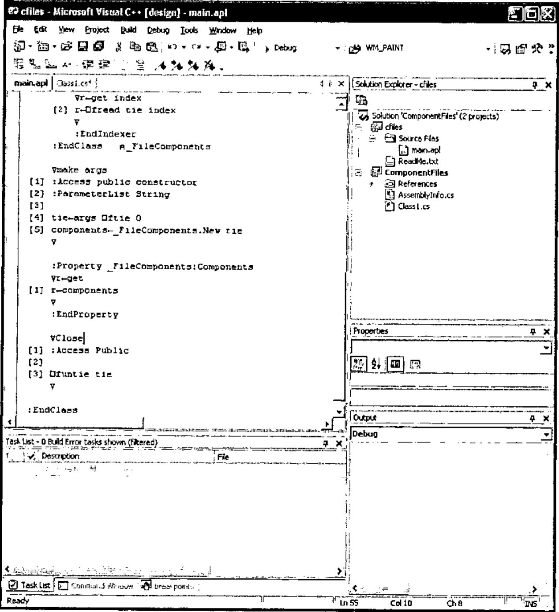

The ComponentFiles solution contains an APLscript program that presents an object-oriented interface to APL component files. Also in ComponentFiles is a C# program that uses the APL code to retrieve and modify components in a simple component file.

On the right hand side of the window we can see the "Solution Explorer" which lists the files that make up the solution, and we can see the current source file open in the editor. This is main.apl and is the APLScript code for the cfiles project.

Here is the full listing of the APLScript program

```apl
⍝ This file is an empty starter file for your APLScript application.
⎕io←1
⎕ml←0

:Class ComponentFile

    :Class _FileComponents
        ∇make arg
    [1] :Access constructor
    [2] :ParameterList Int32
    [3]
    [4] tie←arg
        ∇

        :Property Int32:Count
        ∇r←get
    [1] r←¯1+2⊃⎕fsize tie
        ∇
        :EndProperty

        ∇r←Add array
    [1] :Access public
    [2] :ParameterList Array
    [3] :Returns Int32
    [4]
    [5] r←array ⎕fappend tie
        ∇

        :Indexer Array:Item
        :ParameterList Int32
        ∇set args
    [1] (2⊃args) ⎕freplace tie (1⊃args)
        ∇
        ∇r←get index
    [2] r←⎕fread tie index
        ∇
        :EndIndexer
    :EndClass⍝ _FileComponents

    ∇make args
[1] :Access public constructor
[2] :ParameterList String
[3]
[4] tie←args ⎕ftie 0
[5] components←_FileComponents.New tie
    ∇

    :Property _FileComponents:Components
    ∇r←get
[1] r←components
    ∇
    :EndProperty

   ∇Close
[1] :Access Public
[2]
[3] ⎕funtie tie
    ∇

:EndClass
```

The APLScript defines two .Net types , one called `ComponentFile` and one called `_FileComponents`. The `ComponentFile` Type encompasses operations that can be performed on a file, e.g. `Close`. The `_FileComponents` Type encompasses operations that can be performed on components in the file, such as `Add` and `Count`. The `_FileComponents` Type uses an indexer to present the components in the file as an array. Notice also that `_FileComponents` is declared **inside** the definition of `ComponentFile`. This allows us to define, in .Net terminology, a **"Nested Type".**

When an instance of `ComponentFile` is created the constructor function (`make`) is called with the filename of the desired component file as a parameter. The `make` function ties the component file and stores the tie number in a variable called `tie`. This variable is global to the current namespace and so is specific to this particular instance of the `ComponentFile` object, each instance of `ComponentFile` has its own namespace. In addition the make routine creates a new instance of the `_FileComponents` class, passing the new tie number to the constructor of this Type.

The `ComponentFile` object has a property called `Components` that returns the instance of the `_FileComponents` class that was created in the `ComponentFile` constructor. Note that this is a read-only property.

Here’s the C# program that accesses the ComponentFile Type.

```csharp
using System;

namespace ComponentFiles
{
      /// <summary>
      /// Summary description for Class1.
      /// </summary>
      class Class1
      {
            public static void Main()
            {
                  ComponentFile file = new ComponentFile(".\\cfiles.dcf");

                  for (int i=1;i<=file.Components.Count;i++)
                            DumpArray(file.Components[i]);

                  Console.WriteLine(file.ToString());

                  Console.Write("file.Count:");
                  Console.WriteLine(file.Components.Count);

                  Console.Write("file.Components[1]:");
                  DumpArray(file.Components[1]);

                  int[] New = new int[3];

                  New[0]=1;
                  New[1]=3;
                  New[2]=5;

                  Console.Write("Added component at ");
                  int at = file.Components.Add(New);

                  Console.WriteLine(at);

                  Console.Write("New component contains:");
                  DumpArray(file.Components[at]);

                  New[0]=11;
                  New[1]=33;
                  New[2]=55;

                  Console.Write("Overwritten component.Now contains:");
                  file.Components[at]=New;
                  DumpArray(file.Components[at]);

                  file.Close();
            }

            static void DumpArray(Array a)
            {
                  switch (a.Rank)
                  {
                        case 1:
                              for (int i=0;i<a.Length;i++)
                              {
                                    if (i!=0)
                                          Console.Write(",");
                                    Console.Write(a.GetValue(i));
                              }
                              break;
                        default:
                                    Console.Write(a.ToString());
                                    break;
                  }
                  Console.WriteLine();
            }
      }
}
```

Look at the following line of the C# program

```csharp
Console.WriteLine(file.Components.Count);
```

The variable `file` refers to an instance of the `ComponentFile` Type. `ComponentFile` has a property, `Components`, that returns an instance of the `_FileComponents` Type, which has a `Count` property. When this line of C# is executed the code specified in the get section of the `:Property` declaration of `Count` is executed.

Remember that `_FileComponents` defined an indexer called `Item`:

```apl
    :Indexer Array:Item
    :ParameterList Int32
    ∇set args
[1] (2⊃args) ⎕freplace tie (1⊃args)
    ∇
    ∇r←get index
[2] r←⎕fread tie index
    ∇
    :EndIndexer
```

This indicates that the `_FileComponent` Type has a Property called `Item`, that is the *default* member of the class. If `Item` was declared using `:Property` the C# code would have to use

```csharp
array=File.Components.Item[2] ;
```

To access the 2<sup>nd</sup> component of the file. Because we used `:Indexer` to declare `Item`, the C# code can be simplified to

```csharp
array=File.Components[2];
```

which is somewhat more convenient for the C# programmer. The APL code that is executed in each case would be identical.

Similarly, assignment to the appropriate element of the component file can be achieved with

```csharp
File.Components[2]=array;
```

And this will execute the APL code in the set section of the `:Indexer` declaration.

If we initialize the component file so that it contains a single component that is the vector ‘This is the first component’ the output from the C# program is as follows

![The console output: This is the first component / ComponentFile / file.Count:1 / file.Components[1]:This is the first component / Added component at 2 / New component contains:1,3,5 / Overwritten component.Now contains:11,33,55 / Press any key to continue](art10002760/output.jpg)

## Summary

APLScript allows us to abstract the APL language from the traditional developments, giving us the ability integrate our APL code with other languages and development environments.

## The Next Article

In the next article we will examine the use of APLScript to write web pages.

> John Daintree<br>
> Senior Programmer<br>
> Dyadic Systems Ltd
>
> mailing list: dotnet@dyadic.com
