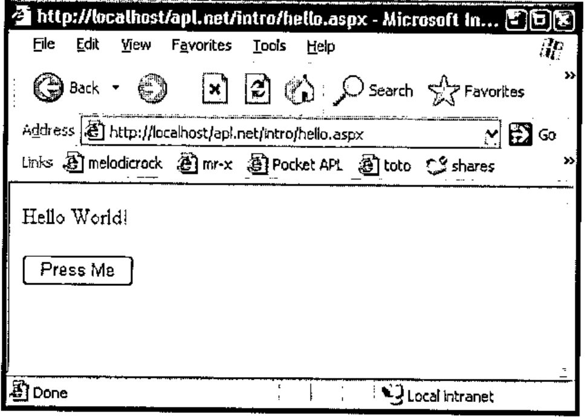
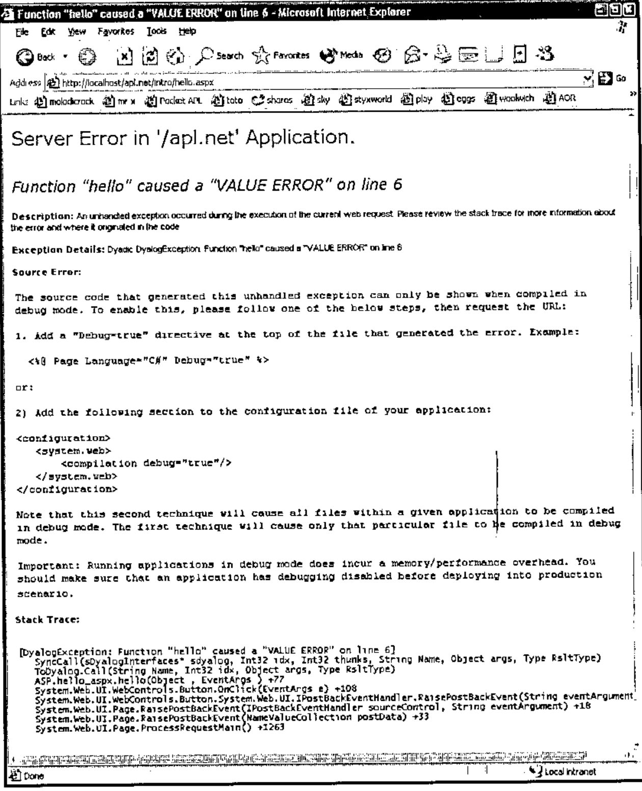
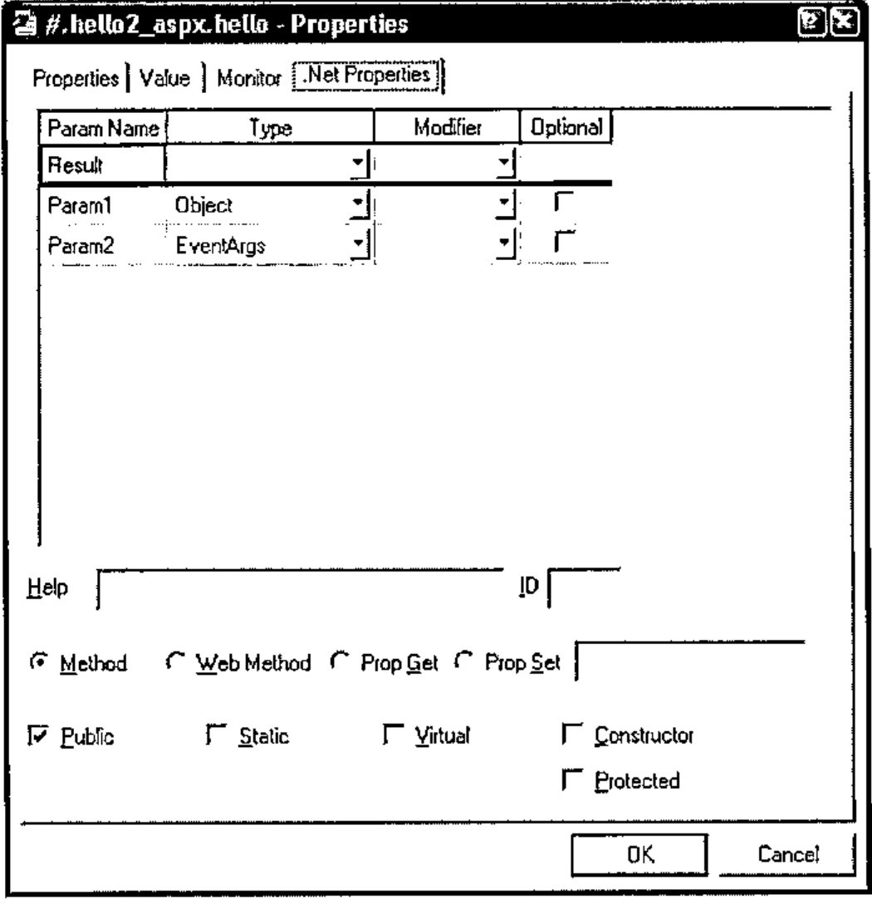
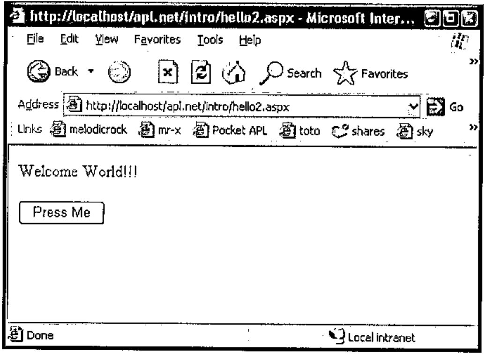
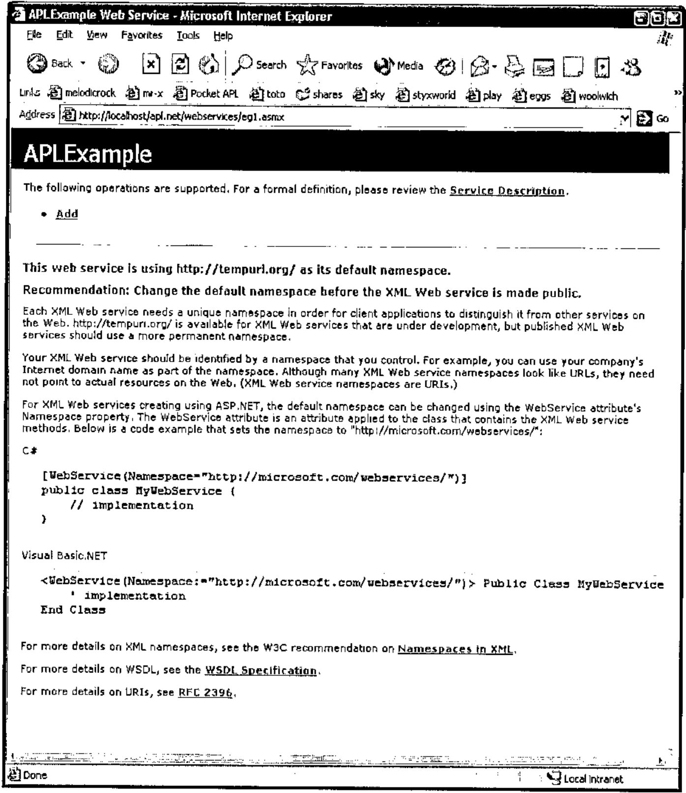
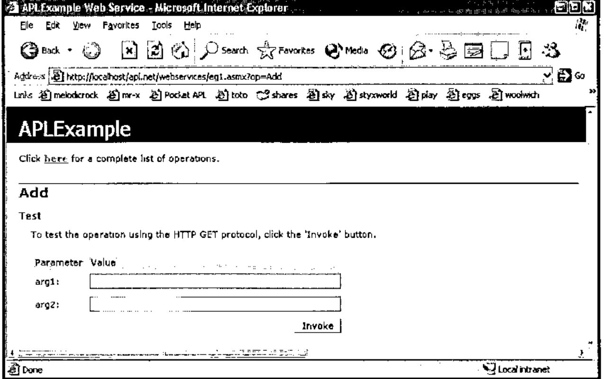
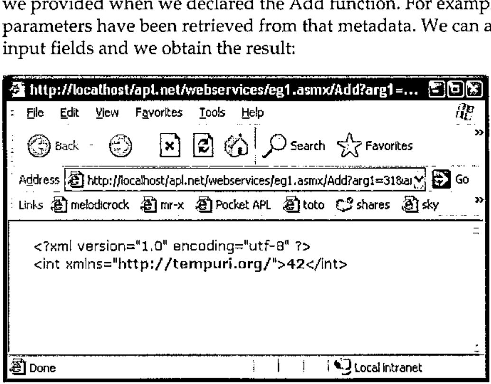

*by John Daintree, Senior Programmer, Dyalog Ltd*<br>
*mailing list: dotnet@dyalog.com*
{ .byline }

## Introduction

This is the third of a number of papers discussing Dyalog’s Microsoft .Net Framework compatible product, Dyalog.Net. This paper brings together the topics raised in the first two papers, and uses them to write APL web services and web pages. The reader may benefit from re-reading the first two Dyalog.Net papers. All of the features discussed here are also available in the newly released Dyalog APL version 10.0.

Dyalog has set up a mailing list to discuss Dyalog.Net related issues. To subscribe to this list, send an email to dotnet@dyalog.com with SUBSCRIBE as the subject.

## Hello (The Whole) World

This is the sample "Hello World" program that we introduced in the last paper.

```apl
∇hello
[1] ⎕←'Hello World'
∇
```

With a couple of minor "tweaks" we can enable this function to be run from within a web page:

```apl
∇hello args
[1] :Access Public
[2] :ParameterList Object,EventArgs
[3]
[4] Response.Write 'Hello World!'
∇
```

The most important change is on line [4]. The assignment to quad has been replaced with a function call to something called `Response.Write`. At the moment we will just say that this will cause the string `"Hello World!"` to be displayed on the client’s browser. But how is this achieved? Where does `Response` come from? What are `EventArgs` and `Object`?

## Anatomy of a Dyalog.NET Web Page

### Initialisation

Typically the above piece of script will be embedded in an .aspx file. This file contains both the script that controls the variable content of the page and the html that defines the static content of the page, the control layout and so on. Here is the full content of the .aspx file for the hello example:

```html
<script language="apl" runat="server">

∇hello args
:Access Public
:ParameterList Object,EventArgs

Response.Write 'Hello World!'
∇
</script>

<body>
<form runat=server>
<asp:Button id="Pressme" Text="Press Me" OnClick="hello"/>
</form>
</body>
```

We should examine this text fairly closely.

```html
<script language="apl" runat="server">
```

This line specifies a number of things. First, `<script` introduces the section of the text that contains the program that will control the other elements of the page. `language="apl"` specifies that the script is written in the language apl, which has been registered on the machine. `runat="server"` determines that the script will be executed on the server machine. This ensures that there is zero APL footprint on the client machine. There are no downloads necessary to access a Dyalog.Net web site.

We will examine the hello function shortly.

`</script>` specifies that we have ended the script section of the page, and

`<body>` begins the body of the page. This is the section that defines the layout of the page.

Within the body, we define a single form that contains a single button, which will initially display the text "Press Me". The button has an id, or name, of "Pressme".

Notice that the form definition also includes a `runat=server` tag. This ensures that the state of the page (and all its children) is maintained on the server, again minimizing the footprint on the client.

A crucial feature of the button contained on the page is provided by the expression `OnClick="hello"`. This statement indicates that when the user presses the button, the function "hello" should be executed. The function "hello" is defined, in APLScript, in the script portion of the page.

### Compilation

The first time our web page is accessed, the *APLCodeGenerator* processes the .aspx page. The purpose of this tool is to convert the content of the file to a single piece of APLScript.

Here’s a snippet of the output from the APLCodeGenerator (the line wrap is for the convenience in this document):

```apl
:Class hello_aspx:System.Web.UI.Page,
System.Web.SessionState.IRequiresSessionState
```

The script defines a class called "hello_aspx" (this name is derived from the original file name).

This new Type derives from a Type called "`System.Web.UI.Page`". The new Type also provides the functionality of the `System.Web.SessionState.IRequiresSessionState` interface. The use of interfaces is beyond the scope of this paper, but may be discussed in a future article.

The generated script contains code to create and initialise the "Pressme" button:

```apl
__ctrl←(System.Web.UI.WebControls.Button.New ⍬)
Pressme←__ctrl
__ctrl.ID←'Pressme'
__ctrl.Text←'Press Me'
__ctrl.onClick←⎕OR 'hello'
```

The last line of this code attaches the "hello" function to the onClick event of the newly created button.

In addition the generated code includes our "hello" function

```apl
∇hello args
:Access Public
:ParameterList Object,EventArgs

Response.Write 'Hello World!'
∇
```

In order for the "hello" function to be callable at runtime we need to use the APLScript `:Access` statement to make this a `Public` method. In addition we need to specify the types of each of the parameters that will be passed to the method. The first parameter is declared as being of type "`Object`", in fact it will be a reference to the button that raised the event. The second parameter is of type `EventArgs`, and will include information pertinent to the specific Click event. In this example we will use neither piece of information, but we need to provide the correct metadata for the function.

As mentioned earlier, `Response.Write` outputs its argument String to the output stream of this web page. Our class (hello_aspx) derives from `System.Web.UI.Page`. It is this base class that defines the `Response` property, and because our class has derived from it we can use `Response` directly, as if it were a member of our current namespace.

The automatically generated APLScript is saved to a temporary file. This file is then passed to the APLScript compiler, which generates a .Net assembly.

### Runtime

Once the page has been compiled the created assembly is loaded into the ASP.NET process on the server machine. This process creates an instance of our hello_aspx class and some of the automatically created APL code is executed (i.e. that code which creates the button). Finally the appropriate HTML is sent "down the wire" to the client. This displays the correct user interface in the client browser. It is important to realize that all the APL code is executed on the server machine. The only data sent to the client is the HTML that defines how the page should appear.

This HTML should be displayed correctly in any browser, not just Microsoft Internet Explorer. When the user presses the "Press Me" button, our function "hello" is called (on the server), and "Hello World!" is included in the HTML that is sent down the response stream.

The client browser appears as follows:



### Debugging

We should consider the case where our "hello" function may contain an error. For example if we refer to a non-existent variable in our callback function. There are two possible outcomes. If we have not yet enabled debugging of our ASP.NET scripts, the client will see an error message describing the cause of the error.



However, if we enable debugging of our ASP.NET web pages we can use the Dyalog APL debugger to debug the APL program in the normal way. We enable debugging by modifying the debug attribute in our web.config file:

```xml
<configuration>
  <system.web>
    <!-- DYNAMIC DEBUG COMPILATION
          Set debug="true" to enable debugging and bind to
dyalog.net.dll. Otherwise, setting this value to false will bind
to dyalog.net.runtime.dll which will prohibit debugging.
    -->
    <compilation debug="true"/>

    <!-- EXECUTION TIMEOUT
          This controls the time in seconds for which a resource
is allowed to try to execute before ASP.NET cancels (times out)
the execution of the request. 90 seconds is the default value. If
you know that a certain process will take longer than 90 seconds
to execute you should increase this value. Note that if debug is
true, ASP.NET automatically resets this parameter to a very high
number.
    -->
    <httpRuntime executionTimeout="90"/>
  </system.web>
</configuration>
```

Once we have made this change, we can re-execute the page. This time we get the Dyalog.Net debugger, neatly displaying the cause of the error.

![The Dyalog APL/W 10.0.2 session showing 1:VALUE ERROR at hello[6] Response.Write msg, with the debugger window showing the function](art10002770/debugger.jpg)

Once we are stopped in the debugger, we can interrogate the system a little.

First, let’s look at `)SI`.

```apl
)si
·   AppDomain__LM_W3svc_1_Root_apl_net_2_126935779779687500.Asse
mbly_bl7d6ml2.ASP.hello_aspx.hello[6]*
·    System.Web.UI.WebControls.Button.OnClick[]
·    System.Web.UI.WebControls.Button.System.Web.UI.IPostBackEve
ntHandler.RaisePostBackEvent[]
·    System.Web.UI.Page.RaisePostBackEvent[]
·    System.Web.UI.Page.RaisePostBackEvent[]
·    System.Web.UI.Page.ProcessRequestMain[]
·    System.Web.UI.Page.ProcessRequest[]
·    System.Web.UI.Page.ProcessRequest[]
·    System.Web.CallHandlerExecutionStep.Execute[]
·    System.Web.HttpApplication.ExecuteStep[]
·    System.Web.HttpApplication.ResumeSteps[]
·    System.Web.HttpApplication.System.Web.IHttpAsyncHandler.Beg
inProcessRequest[]
·    System.Web.HttpRuntime.ProcessRequestInternal[]
·    System.Web.HttpRuntime.ProcessRequest[]
·    System.Web.Hosting.ISAPIRuntime.ProcessRequest[]
&1 (system thread:1708)
```

We can see that `)SI` includes the sections of the call stack that are "outside" APL. (`⎕SI` will still return just the APL portion of the stack). In addition we can see from `)SI` that Dyalog.Net is running the incoming requests on different threads. The current call has been raised on system thread number 1708, and this has been mapped to APL thread number 1. Additional system threads will be mapped to additional APL threads. The use of threads in this way allows for a very efficient management of multiple, simultaneously connected users.

Also of interest is the name of the current namespace in which we are executing the "hello" callback.

```apl
{↑'#',1↓¨('.'=⍵)⊂⍵} '' ⎕ns ''
#
AppDomain__LM_W3svc_1_Root_apl_net_2_126935779779687500
Assembly_bl7d6ml2
ASP
hello_aspx
```

For a number of reasons, Dyalog.Net has taken our original namespace (hello_aspx, from the name of the file hello.aspx) and instantiated it within other namespaces. The reason for having these outer namespaces is to provide isolation from other APL web applications that may be running on this server, in the same workspace. This isolation, along with the concept of AppDomains may be discussed in a future paper.

When a web page in APLScript is compiled the APLCodeGenerator inserts a niladic function called `this` into the source code. `this` returns a reference to the current object.

```apl
      ⎕vr 'this'
    ∇ r←this
[1]
[2]   ⍝Automatically generated function
[3]    r←((⎕NS'').##)
[4]
    ∇

this.GetType
ASP.hello_aspx

this.GetType.BaseType
System.Web.UI.Page
```

We can see that our Type is indeed derived from "`System.Web.UI.Page`".

So, to fix our bug and continue execution, we repair our hello function, by changing msg to Msg, and then continue execution with `→⎕lc`.

## Web Pages from Workspaces

As an alternative to using APLScript we could define our hello_aspx Type inside a traditional workspace. In this example we’ll call the Type `hello2_aspx` for clarity.

```apl
      )CLEAR
      )WSID hello2_ws
```

We need to specify which elements of the .Net Framework we wish to use.

```apl
      ⎕using←'System' 'System.Web.UI,System.Web.dll'
```

We now define our new Type. `'Page'` specifies the base class for our Type, and because of our current value for `⎕USING` it will be resolved to `System.Web.UI.Page`.

```apl
      'hello2_aspx'⎕WC'nettype' 'Page'
      )cs hello2_aspx
```

And we can define our "Hello" function as

```apl
⎕vr 'hello'
     ∇ hello args
[1]
[2]     Response.Write'Welcome World!!!'
  ∇
```

Once we have our hello function we can use the appropriate dialog box to set the metadata for the function:



Finally we can `)save` our workspace.

ASP.NET cannot access the workspace directly. We still need a .aspx file that references the workspace.

Here’s hello2.aspx that does just that:

```html
<%@Page Language="apl" Debug="true" Inherits="hello2_aspx"
src="hello2_ws.dws" %>

<body>
<form runat=server>
<asp:Button id="Pressme" Text="Press Me" OnClick="hello" />
</form>
</body>
```

The body of the page is identical to hello.aspx, but now we specify that this page inherits from a Type (called hello2_aspx) defined inside a file called hello2_ws.dws, the workspace that we have just saved.

Pointing our browser at hello2.aspx, and pressing the button gives:



Using this method, the layout of the namespaces at runtime is very similar to that when using APLScript. However, to many programmers, or for larger projects this may be a more convenient way to package the application.

## Web Services

Web Services are programmatic elements that may be called over the internet. Dyalog.Net is a perfect tool to write web services, both with APLScript or from workspaces.

As with Dyalog.Net web pages, all the calculation behind the web service is performed on the server machine. Only XML strings that contain the parameters to, and the results of the web service are passed from client to server and vice-versa.

### A Simple Web Service

Within the Microsoft .Net Framework Web Services typically reside within files with a .asmx extension. Here is the content of a trivial web service written in APLScript:

```apl
<%@ WebService Language="apl" Class="APLExample" %>

:Class APLExample:System.Web.Services.WebService

    ∇ R←Add arg
[1]   :Access WebMethod
[2]   :ParameterList Int32 arg1,Int32 arg2
[3]   :Returns Int32
[4]    R←+/arg
    ∇

:EndClass
```

The layout of this file is similar to that of the .aspx files that are used to define web pages. In the case of web services however, we have no &lt;body&gt; section, because a web service has no user interface of its own. The &lt;script&gt; section is implied because it is the only section in the file. In addition the opening declaration in the files declares that this file contains a web service definition.

```apl
<%@ WebService Language="apl" Class="APLExample" %>
```

We are defining a web service, that is written in the APL language. This specific file contains a web service called "APLExample". This is the Type of the web service that we are implementing

Our web service contains a single function called Add, and it adds two integral arguments. As we have seen before in APLScript, the function defines its parameter list and return type. In addition, and specific to web services, is the
`:Access WebMethod` declaration. This is similar to the `:Access Public` declaration that we have seen before, but additional metadata is emitted for methods marked with the `WebMethod` declaration.

### Accessing the Web Service from Internet Explorer

When we point our client browser at eg1.asmx we see:



This is the default GUI that Internet Explorer gives us when we access any web service.

If we select our chosen function from the top of the page we see:



The contents of this page have been dynamically created from the metadata that we provided when we declared the Add function. For example, the names of the parameters have been retrieved from that metadata. We can add values to the two input fields and we obtain the result:



The result from the web service is returned as an XML string. This is not very useful to us as it stands, but a web service can be called from a number of sources which may be able to decode the XML stream and present the result in a more meaningful manner.

### Accessing the Web Service from APL

Accessing a web service is typically a two-stage process. First we need a "proxy class" that connects to the web service. This class is essentially a thin layer of code that presents a functional interface to the XML streams that pass arguments to, and retrieve results back from, the web service. Fortunately Microsoft ships a tool that creates this proxy class for us. The wsdl.exe utility that is part of the .Net Framework can generate a proxy class from the URL of the web service. Dyalog.Net ships with a workspace that contains a cover function for wsdl. The utility wsdl actually generates C# source code, so the APL cover function also invokes the C# compiler to produce an assembly that we can use.

The proxy class is the only code that runs on the client machine. The web service itself runs only on the server.

Here’s the relevant code and result from the APL session, (again this is wrapped for this document).

```apl
      )load c:\dyalog10\samples\asp.net\webservices\
webservices.dws
      MakeProxy 'http://localhost/apl.net/webservices\eg1.asm
C:\devt10\aplsrc\APLExample.dll
```

The file `C:\devt10\aplsrc\APLExample.dll` is the assembly that contains the proxy class to access the web service. We can use `⎕USING` to load this assembly.

```apl
      ⎕using←',C:\devt10\aplsrc\APLExample.dll'
```

and create an instance of the proxy class:

```apl
      example←APLExample.New ⍬
```

which we can subsequently use:

```apl
      example.Add 31 11
42
```

We can, of course create arbitrarily complex web services. Dyalog.Net and Dyalog APL Version 10.0 ship with a web service example to manage golf course bookings. Dyalog.Net web services may be written in APLScript, as in the above example, or created and saved in traditional workspaces.

And, of course we can use the MakeProxy function to access web services written in any language with any accessible URL. We are not restricted to only those written in Dyalog.Net.

There are a number of interactive tutorials for both web services and web pages which can be accessed from http://www.dyalog.com.
