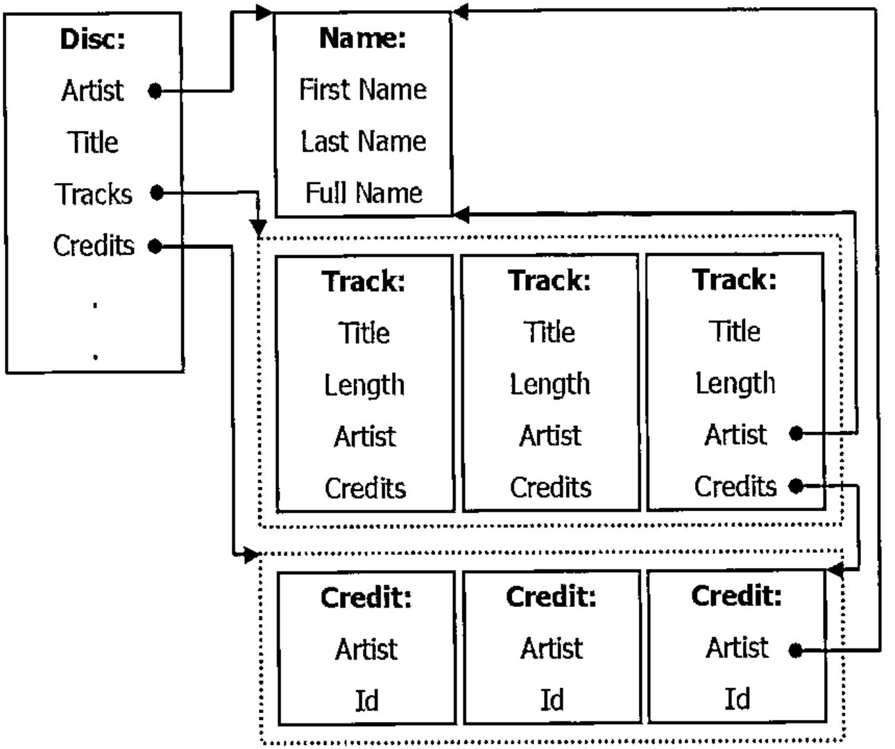
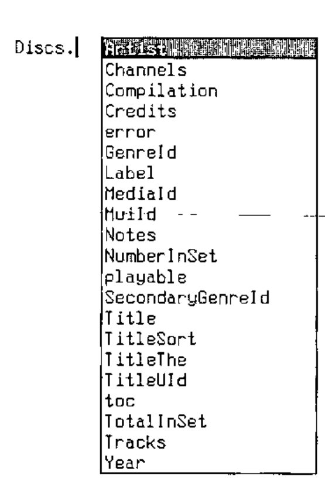
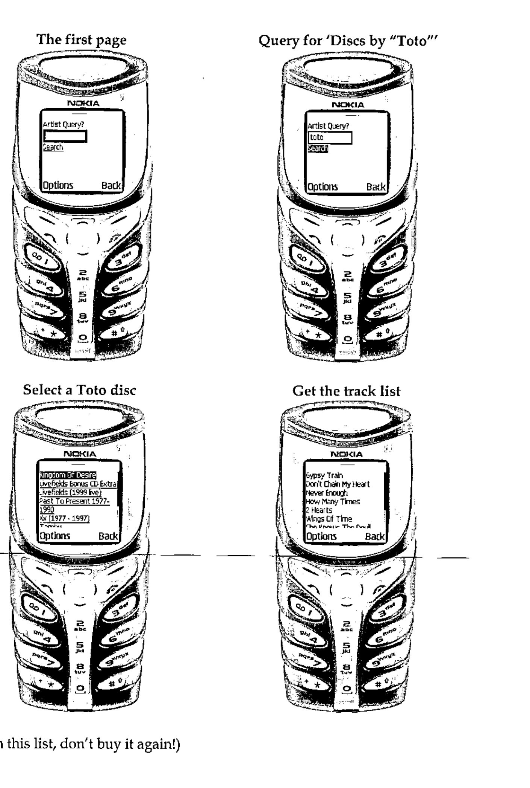

*by John Daintree, Senior Programmer, Dyalog Ltd*
{ .byline }

## Abstract

Any collector of music (or for that matter of anything) will recognise the need for a mechanism for keeping track of the items in a collection. Namespaces are an obvious choice for representing uniform, structured data, such as a collection of music CDs. This paper describes software that make extensive use of namespaces, namespace refs, and namespace reference arrays. A small number of functions provide simple but extensive query facilities which allow convenient browsing of the catalogue.

## Overview

For some time I have been aware of the need to have a complete and up-to-date list of the CDs in my modest collection (1565 discs to date). There are two main reasons for this database. Firstly, in the event of theft or the house burning down and the entire collection needing to be replaced. Secondly, I’m not the most astute shopper and have, on more occasions than I would like to admit, purchased a CD that I already own.

It would be madness to attempt to manually enter all the information on 1565 CDs. Fortunately there are a number of on-line resources which can be used to retrieve catalogue information for CDs, be they currently available, deleted or even bootlegs.

One such resource is the CDDB database from Gracenote Corp. (www.gracenote.com). Gracenote provide an ActiveX Control that can be incorporated into any application. This control manages all the CD drive and TCP/IP internet access that is required to retrieve information about a CD. In practice, one can insert a CD into the drive on the computer, make the appropriate calls to the control and have artist, track, musician information, recording date and location etc. retrieved automatically from the online database. The Gracenote database currently contains extensive information for over 2 million CDs.

Having identified our information source and our retrieval mechanism it becomes necessary to design the layout of our local database.

## Data Structure

One can consider the catalogue information of a CD as the following diagram:



Each *Disc* has been recorded by a specific *Artist*. The artist may have a first name, last name, and a full name. Separating the artist’s name into first and last parts allows for efficient alphabetic sorting. In the case of a group, e.g. "The Tubes", the first and/or last name fields may not be used.

A *Disc*, of course, also has a *Title*, a list of *Tracks* and potentially a number of *Credits*, i.e. a list of which musicians performed which role in the recording of the disc.

A *Track* on a *Disc* has a *Title*, a *Length* (its duration), and a further list of *Credits*, which may override those *Credits* on the main disc. Given the existence of compilation discs, where each track may be recorded by a different artist, it is necessary for each track to refer to an *Artist*. In non-compilation discs this refers to the same information as the *Artist* information of the *Disc*.

A *Credit* is simply an association of an artist with a particular role, for example Bass Guitarist, Composer, or Recording Location.

Given the uniformity of the data, every *Disc* has the same fields, every track has the same fields etc, it is simple to think of a *Disc* as a namespace, and the *Tracks* on a discs as an vector of namespaces. A CD collection therefore, is a vector of *Discs*.

## Notes on Implementation

There are a number of points that I think are worth making:

1. I intentionally implemented this software with no GUI. The nature of the queries and the results returned is such that the Dyalog APL session is a fine input and output device. Especially given a large `⎕PW` and the session’s horizontal scrollbar which is available in version 10.
2. I have used dynamic functions as much as possible. This was primarily to extend my own understanding of programming in "D".
3. I typically run with `⎕IO←0` and `⎕ML←0`, so `⊃` is "first" and `↑` is "mix".
4. As we are retrieving all our data from an external database any errors or omissions in the database will show up in our data. For example, mis-spelled words, incomplete listings, missing credits and so on.

## Implementation

The cddb workspace contains a vector named `Discs`. This is (to date) a 1565 element vector.

```apl
      )LOAD cddb
      ⍴Discs
1565
```

Let’s look at the first few elements of Discs

```apl
      four←4↑Discs
      four
#.Disc  #.Disc  #.Disc  #.Disc
```

Each namespace in the `Discs` vector displays as `#.Disc`. The display form of a namespace is obtained from the name used when the namespace was created

```apl
      'x' ⎕ns ''
      x
#.x
```

if we take a *reference*, let’s call it `ref`, to this namespace, the display form of the ref is identical (in fact the interpreter cannot distinguish between the reference and the original name, `x`).

```apl
      ref←x
      ref
#.x
```

if we discard `x`, the reference, `ref`, is sufficient to keep the namespace "alive" in the workspace, but it remembers its display form.

```apl
      ⎕ex 'x'
      ref
#.x
```

We can use this to create namespaces with a particular display form:

```apl
new←{
      ⍺←#
      ⍺.{
          r←⍵ ⎕NS''
          ns←⍎⍵
          ex←⎕EX ⍵
          ns
      }⍵
 }
```

```apl
      new 'Disc'
#.Disc
      new¨4⍴⊂'Disc'
#.Disc  #.Disc  #.Disc  #.Disc
```

As we will see later it is convenient to specify that the parent of each *Track* on a *Disc* is the *Disc* itself. The `new` function above, allows us to specify that our namespace should be created as a child of any namespace provided in the left argument.

```apl
discs←new¨4⍴⊂'Disc'
      discs new¨⊂'Track'
#.Disc.Track  #.Disc.Track  #.Disc.Track  #.Disc.Track
```

And the Artist for each of the discs

```apl
      discs.Artist←new¨4⍴⊂'Name'
      discs.Artist
#.Name  #.Name  #.Name  #.Name
```

For each disc that is added to the collection we create a new Disc namespace. This namespace is then populated with data obtained from the Gracenote Corp. ActiveX control.

The AutoComplete feature of version 10 is especially useful when programming with namespaces, and namespace arrays. For example, we can see the contents of each Disc by typing "Discs." (assuming AutoComplete is set up appropriately) into the session:



So, let’s examine a specific disc, the first one in the collection.

```apl
      (⊃Discs).Artist
#.Name
      (⊃Discs).Artist.FullName
Donald Fagen
      (⊃Discs).Tracks
#.Disc.Track  #.Disc.Track  #.Disc.Track  #.Disc.Track
#.Disc.Track  #.Disc.Track  #.Disc.Track  #.Disc.Track
      ⍴(⊃Discs).Tracks
8
      (⊃Discs).Title
The Nightfly
```

Dyalog APL supports "reference arrays" i.e. arrays of references to namespaces We can then use intuitive ‘.’ notation to access names from each element within an array of namespace references, so

```apl
      ⍴(⊃Discs).Tracks
8
      ↑(⊃Discs).Tracks.Title
I.G.Y
Green Flower Street
Ruby Baby
Maxine
New Frontier
The Nightfly
The Goodbye Look
Walk Between The Raindrops
```

And of course, this applies to elements in the `Discs` vector too.

```apl
      (2↑Discs).Title
The Nightfly  Images And Words
      (2↑Discs).Artist.FullName
Donald Fagen  Dream Theater
      (2↑Discs).(Artist.FullName,'\',Title)
Donald Fagen\The Nightfly  Dream Theater\Images And Words
```

Reference arrays are very powerful, not only can we access variables from each element in an array of namespace references but we can also execute functions on an array of namespace references. E.g.

```apl
      r←Discs.⍎⊂'Artist.FullName≡''Lisa Loeb'''
```

`r` is a Boolean vector containing a 1 for each disc recorded by Lisa Loeb and a 0 elsewhere. This leads us to our first simple query function, and also to our first problem.

```apl
where←{
      16::'no match'
      ⍺/⍨⍺.⍎⊂⍵
 }
```

Should the boolean expression `⍺.⍎⊂⍵` result in an array containing only zeroes the interpreter will generate a NONCE ERROR. Currently the interpreter cannot create an "prototypical" namespace, any attempt to do so will generate NONCE ERROR. The `where` function traps this error and returns `'no match'`. All of the functions illustrated here are intended to be used from the session, indeed there is no GUI in the workspace. For this reason a `'no match'` return is acceptable.

```apl
      Discs where 'Artist.FullName≡''nonexistant band'''
no match

      Discs where 'Artist.FullName≡''Lisa Loeb'''
#.Disc  #.Disc  #.Disc  #.Disc
```

So there are 4 discs in the collection recorded by Lisa Loeb. This is such a useful query that it warrants a function all of its own, which we can rewrite without the use of execute.

```apl
      by←{
            msk←⍺.{Artist.FullName≡⍵}⊂⍵
            msk/⍺
       }

      Discs by 'Lisa Loeb'
#.Disc  #.Disc  #.Disc  #.Disc

      ↑(Discs by 'Lisa Loeb').Title
Tails
Firecracker
Truthfully
Cake And Pie
```

The extra parentheses in the above statement are a little unwieldy, however the addition of a small function `of` provides great improvement.

```apl
of←{
      ⍵.⍎⊂⍺
}

      ↑'Title' of Discs by 'Lisa Loeb'
Tails
Firecracker
Truthfully
Cake And Pie
```

It should by now be apparent that if we design our data layout well we can make powerful queries with really tiny APL expressions.

It is at this point that I realized what most APL programmers will have known for years, APL allows us to write program statements that look like English language phrases.

A useful extension of the `by` function would allow partial matches of names. This is achieved with the operator `find`.

```apl
      find←{16::'no match'
            ⍺←Discs
            ''≢0⍴⍵:⊃,/(⊂⍺)∇¨⍵
            n←⊂toupper ⍵↓⍨exact←'|'=⊃⍵
            exact:⍺/⍨n≡∘toupper¨⍺⍺ ⍺
            ⍺/⍨1∊¨↓(⊃n)⍷∘toupper↑⍺⍺ ⍺
       }
```

`find` attempts to locate (in a case-independent match) the right argument in the data returned by the left function operand, so our `by` function becomes:

```apl
      by←{⍵.Artist.FullName} find
```

so

```apl
      ⍴Discs by 'Lisa Loeb'
7
      ↑'Artist.FullName' of Discs by 'Lisa Loeb'
Lisa Loeb & Nine Stories
Lisa Loeb
Lisa Loeb
Lisa Loeb
Lisa Loeb & Nine Stories
Lisa Loeb & Nine Stories
Lisa Loeb
```

Or even,

```apl
      ↑'Artist.FullName Title' of Discs by 'Lisa Loeb'
Lisa Loeb & Nine Stories  Waiting for Wednesday
Lisa Loeb                 Tails
Lisa Loeb                 Firecracker
Lisa Loeb                 Truthfully
Lisa Loeb & Nine Stories  Do You Sleep?
Lisa Loeb & Nine Stories  Stay (I Missed You)
Lisa Loeb                 Cake And Pie
```

So in many cases the more flexible find function is more useful.

You may have noticed the use of `'|'` in `find` to force a exact match to the argument.

```apl
      ⍴Discs by 'Lisa Loeb'
7
      ⍴Discs by '|Lisa Loeb'
4
```

This is the only "special character" used by the `find` operator. In an attempt to maintain the use of English phrases in the search strings we have a cover function to do these exact matches.

```apl
exactly←{'|',⍵}

      ⍴Discs by exactly 'Lisa Loeb'
4
```

The `find` operator is pretty generic, we can slot in alternate function operands to search in other fields of the Disc, for example

```apl
      called←{⍵.Title} find

      ⍴Discs called 'Greatest Hits'
18

↑'Artist.FullName Title' of 5↑Discs called 'Greatest Hits'
Styx                      Greatest Hits Part 2
Queen                     Greatest Hits I
Queen                     Queen Greatest Hits II
Richard Marx              Richard Marx - Greatest Hits
Styx                      Styx - Greatest Hits
```

Also `find` can accept a nested argument

```apl
      ⍴Discs called 'Best Of'
37
      ⍴Discs called 'Best Of' 'Greatest Hits'
55
```

Again, to maintain the use of "English Phrases" throughout we can have an `or` function

```apl
      or←{(⊂⍺),{''≡0⍴⍵:⊂⍵ ⋄ ⍵}⍵}

      ⍴Discs called 'Best Of' or 'Greatest Hits'
55
      ⍴Discs by 'Toto' or 'Styx' or 'Journey'
106
```

So far, we have pretty much been interested only in searching through the vector of Discs. Let’s look at retrieving information from individual tracks.

Each Disc has a vector of Tracks.

```apl
      ⍴¨(2↑Discs).Tracks
 8 8

      ↑¨(2↑Discs).Tracks.Title
 I.G.Y                       Pull Me Under
 Green Flower Street         Another Day
 Ruby Baby                   Take The Time
 Maxine                      Surrounded
 New Frontier                Metropolis, Pt. 1
 The Nightfly                Under A Glass Moon
 The Goodbye Look            Wait For Sleep
 Walk Between The Raindrops  Learning To Live

      ↑¨(2↑Discs by 'Lisa Loeb').Tracks.Title
 Waiting for Wednesday       It's Over
 Stay (live)                 Snow Day
 Alone (live)                Taffy
 Hurricane (live)            When All The Stars Were Falling
 Garden of Delights (live)   Do You Sleep?
 Taffy (live)                Hurricane
                             Rose-Colored Times
                             Sandalwood
                             Alone
                             Waiting For Wednesday
                             Lisa Listen
                             Garden Of Delights
                             Stay
```

Remember our `of` function?

```apl
      of←{
            ⍵.⍎⊂⍺
      }
```

The problem with this function is that if `⍵` is a nested vector we will get a `LENGTH ERROR`, as the enclosed `⍺` is distributed across `⍵`:

```apl
      'Title' of 'Tracks' of 2↑Discs by 'Lisa Loeb'
LENGTH ERROR
of[1] ⍵.⍎⊂⍺
```

We need a more generic of function:

```apl
      of←{
            ⍵.⍎⍺{
                 0=⍵:⍺
                 (⊂⍺)∇ ⍵-1
            }≡⍵
      }
```

This `of` makes sure that the argument (‘Title’ or ‘Tracks’) is enclosed deep enough to be distributed across the array of namespaces.

```apl
      ↑¨'Title' of 'Tracks' of 2↑Discs by 'Lisa Loeb'

 Waiting for Wednesday       It's Over
 Stay (live)                 Snow Day
 Alone (live)                Taffy
 Hurricane (live)            When All The Stars Were Falling
 Garden of Delights (live)   Do You Sleep?
 Taffy (live)                Hurricane
                             Rose-Colored Times
                             Sandalwood
                             Alone
                             Waiting For Wednesday
                             Lisa Listen
                             Garden Of Delights
                             Stay
```

Which (almost) gives us our "English Phrases" back. Even better can be achieved with a little function assignment

```apl
      on←of
      r←'Title' of 'Tracks' on Discs by 'Lisa Loeb'
```

A useful function is `tracks`

```apl
      ∇ r←tracks
[1]     r←⊃,/Discs.Tracks
      ∇
```

`tracks` is one of the few non-dfn functions in the workspace. It merely returns a vector of all the tracks in the database. It is niladic, which prevents it being implemented as a dfn.

It is worth noting that `⊃,/` is a recognised idiom in version 10 of Dyalog APL. As such, `tracks` runs several thousand times faster than it does on version 9.

```apl
      ⍴¨Discs tracks

1565 16246

      ⍴tracks called 'Animal'

10
```

Because each Track has an Artist field, which refers to the appropriate recording artist we can do

```apl
      ↑'Artist.FullName' of tracks called 'Animal'
Glenn Walters
Toto
Planet X
Steve Vai
Toto
Toto LIVE & ALIVE
Def Leppard
Gowan
Gowan
Carmen Grillo
```

We can use `tracks` to get some fairly scary statistics

```apl
      ⍴tracks by 'Styx'
389
      ⍴tracks by 'Celine Dion'
64
      longest←⊃tracks[⍒tracks.Length]

↑'Artist.FullName  Title (⍕Length)' of longest
Robbie Williams
These Dreams
1884.306667
```

So the longest track in the database is 1884 seconds (about 35 minutes) long, is called "These Dreams" and is by Robbie Williams.

Now, those of you with any knowledge of Mr Williams’ body of work will be aware that he’s never recorded a 35 minute track in his life. Chances are that the last track on this album ends with 25 minutes of silence and then a "hidden" song at the end. Lets look at the next longest track.

```apl
      longest←2⊃tracks[⍒tracks.Length]

      ↑'Artist.FullName Title (⍕Length)' of longest
Transatlantic
All of the Above
1859.226667
```

About 31 minutes. Transatlantic is a progressive rock supergroup (comprised of members of Spock’s Beard, Dream Theater, Marillion and The Flower Kings). Knowing these boys, it’s quite likely that they have a track that is 31 minutes long.

I mentioned earlier that a useful design point is to have the parent of a *Track* be the *Disc* on which it is recorded. This allows us to use `'##'` to retrieve a *Disc* from a *Track*.

```apl
      animals←tracks called 'Animal'

      ↑'Artist.FullName Title' of '##' of animals
Glenn Walters          The King Of Retro Cool
Toto                   Past To Present 1977-1990
Planet X               Live From Oz
Steve Vai              Passion and Warfare
Toto                   Hold Me Back (Live)
Toto                   Toto Live & Alive
Def Leppard            Vault: Def Leppard's Greatest Hits
Gowan                  Strange Animal
Gowan                  No Kilt Tonight (Solo Live)
Carmen Grillo          Both Sides Of The Coin
```

Every *Disc* and *Track* has a number of *Credits* associated with it. Each *Credit* includes information such as who played bass guitar on the track, or who composed a track, or where a track was recorded and so on.

I was really taken by this idea of using English phrases for the queries, so I wanted to be able to write expressions like

```apl
Discs where 'Steve Lukather' played 'Guitar', or
Discs where 'Bob Dylan' played
```

The function `where` takes a character vector which is executed in each element of its left argument. The problem then was to write the function `played` so that it returns an appropriate argument for `where`. This proved to be difficult, so I compromised and wrote a function `_played` which does all the work, and `played` that generates a simple a character vector that invokes `_played`

```apl
      played←{
            qte←{' ''',⍵,''' '}
            ths←'(⎕ns '''').## '
            ths,'#._played',(qte ⍺),(qte ⍵)
      }

      'Lukather'played'Guitar'
(⎕ns '').## #._played 'Lukather' 'Guitar'
```

Note the use of `(⎕ns '').##` to return a reference to the current space.

```apl
      _played←{
            0::0
            creditsof←{
                 ⊃,/⍵.(Credits,⊃,/Tracks.Credits)
            }
            name role←⍵
            c←(creditsof ⍺)by name
            r←(∨/¨(⊂toupper role)∘.⍷toupper¨Roles)/Roles
            ⊃c.Id∊r
      }

      lukather←Discs where 'Lukather' played 'guitar'
      ⍴lukather
12
      ↑'Artist.FullName Title' of Lukather
Richard Marx                       Rush Street
Toto                               Toto IV
Larry Carlton and Steve Lukather   No Substitutions
Toto                               Tambu
Wilson Phillips                    Wilson Phillips
Joseph Williams                    3
Toto                               Toto
Various Artists                    Stone Cold Queen
Dune                               Dune
Asia                               Then & Now
Lara Fabian                        Adagio
Toto                               Through The Looking Glass
```

Because `played` is a function with an argument the statement

```apl
Discs where 'Bob Dylan' played
```

is syntactically incorrect (`played` is called with no argument). However because of how `_played` is written we can do

```apl
anything←''
```

and

```apl
Discs where 'Bob Dylan' played anything
```

which is OK.

```apl
      ⍴Discs where 'Bob Dylan' played anything
2
```

OK, so I’m not a big Bob Dylan fan.

An extremely useful addition to the suite of functions is "display":

```text
      display ⊃Discs
┌─────────────────────────────────┐
│Donald Fagen (1982)              │
│The Nightfly                     │
├─────────────────────────────────┤
│1. I.G.Y                     6:03│
│2. Green Flower Street       3:42│
│3. Ruby Baby                 5:39│
│4. Maxine                    3:49│
│5. New Frontier              6:21│
│6. The Nightfly              5:47│
│7. The Goodbye Look          4:50│
│8. Walk Between The Raindrops 2:38│
└─────────────────────────────────┘
```

The `display` function can provide various levels of information about a disc, indicated by its left argument. For example, passing a 3 as the argument to `display` lists all the credits for the disc, and for each of its tracks. So displaying the result of the "Dylan Query" shows that Bob has a writing credit for the last track on the disc.

```text
      3 display ⊃Discs where 'Bob Dylan' played anything
┌─────────────────────────────────────────────────────────────┐
│Billy Joel (1987)                                            │
│KOHUEPT (Live in Leningrad)                                  │
│Columbia/ 7464-40996-2                                       │
│Billy Joel                                                   │
│                                                             │
│Soft Rock                                                    │
│                                                             │
│Guitar-Electric        : Billy Joel                          │
│Keyboards-Various      : Billy Joel                          │
│Piano                  : Billy Joel                          │
│Vocals                 : Billy Joel                          │
│Engineer               : Bradshaw Leigh                      │
│Mixing                 : Bradshaw Leigh                      │
│Mixing                 : Brian Ruggles                       │
│Producer               : Brian Ruggles                       │
│Keyboards-Various      : Dave Lebolt                         │
│Bass Guitar            : Doug Stegmeyer                      │
│Recording Location     : Fleetwood Mobile Recording Unit     │
│Vocals-Backing         : George Simms                        │
│Engineer               : Jim Boyer                           │
│Mixing                 : Jim Boyer                           │
│Producer               : Jim Boyer                           │
│Guitar-Electric        : Kevin Dukes                         │
│Drums and Percussion   : Liberty DeVitto                     │
│Saxophone              : Mark Rivera                         │
│Vocals-Backing         : Peter Hewlett                       │
│Acoustic Guitar        : Russell Javors                      │
│Guitar-Electric        : Russell Javors                      │
│Mastering Location     : Sterling Sound, New York            │
│Mastering              : Ted Jensen                          │
│Mixing Location        : The Hit Factory, New York City      │
│Assistant Engineer     : Tim Leitner                         │
├─────────────────────────────────────────────────────────────┤
│ 1. Odoya                                               1:17 │
│    Vocals-Backing                 : David Abezadze          │
│    Vocals-Backing                 : Georgi Dylidze          │
│    Vocals-Backing                 : Giya Chirakadze         │
│    Vocals-Backing                 : Nugree Gamtjebeli       │
│    Vocals-Backing                 : Timur Chkuatzeli        │
│    Vocals-Backing                 : Tomaz Eliava            │
│    Vocals-Backing                 : Yosif Zurabauli         │
│    Vocals-Backing                 : Zurab Loladze           │
│    Songwriter (Music & Lyrics)    : <Traditional>           │
│                                                             │
│ 2. Angry Young Man                                     5:24 │
│    Songwriter (Music & Lyrics) : Billy Joel                 │
│                                                             │
│ 3. Honesty                                             3:58 │
│    Songwriter (Music & Lyrics) : Billy Joel                 │
│                                                             │
│ 4. Goodnight Saigon                                    7:20 │
│    Songwriter (Music & Lyrics) : Billy Joel                 │
│                                                             │
│ 5. Stiletto                                            5:08 │
│    Songwriter (Music & Lyrics) : Billy Joel                 │
│                                                             │
│ 6. Big Man On Mulberry Street                          7:17 │
│    Songwriter (Music & Lyrics) : Billy Joel                 │
│                                                             │
│ 7. Baby Grand                                          6:09 │
│    Songwriter (Music & Lyrics) : Billy Joel                 │
│                                                             │
│ 8. An Innocent Man                                     6:08 │
│    Songwriter (Music & Lyrics) : Billy Joel                 │
│                                                             │
│ 9. Allentown                                           4:22 │
│    Songwriter (Music & Lyrics) : Billy Joel                 │
│                                                             │
│10. A Matter Of Trust                                   5:08 │
│    Songwriter (Music & Lyrics) : Billy Joel                 │
│                                                             │
│11. Only The Good Die Young                             3:32 │
│    Songwriter (Music & Lyrics) : Billy Joel                 │
│                                                             │
│12. Sometimes a Fantasy                                 3:38 │
│    Songwriter (Music & Lyrics) : Billy Joel                 │
│                                                             │
│13. Uptown Girl                                         3:08 │
│    Songwriter (Music & Lyrics) : Billy Joel                 │
│                                                             │
│14. Big Shot                                            4:45 │
│    Songwriter (Music & Lyrics) : Billy Joel                 │
│                                                             │
│15. Back In The U.S.S.R.                                2:44 │
│    Songwriter (Music & Lyrics) : John Lennon                │
│    Songwriter (Music & Lyrics) : Paul McCartney             │
│                                                             │
│16. The Times They Are A Changin'                       2:57 │
│    Songwriter (Music & Lyrics) : Bob Dylan                  │
└─────────────────────────────────────────────────────────────┘
```

## And Finally…

It works for DVDs too.

```apl
      ⍴DVDs

321
```

Oh, and since I started writing this

```apl
      ⍴Discs

1575
```

## And Finally Finally…

One of the objectives of the exercise was to prevent the accidental purchase of duplicate copies of the same CD. This requires some sort of remote access to the database. The following piece of APLScript implements a Mobile Web Page (i.e. one that can be accessed by mobile phones). When on one of my many trips to the local record shop I can ’phone the server before I buy anything to see if I already have it.

```apl
<%@ Page Inherits="System.Web.UI.MobileControls.MobilePage"
Language="apl" %>
<%@ Register TagPrefix="Mobile"
Namespace="System.Web.UI.MobileControls"
assembly="System.Web.Mobile"%>

<script language="apl" runat=server>
∇ListTracks args
disc←⊃##.{Discs called ⍵} (⊃⌽args).ListItem.Text
tracks←disc.Tracks
TrackList.Items.Add¨tracks.Title
TrackList.Items.Add¨disc.Notes,##.display disc.Credits
ActiveForm←ShowTracks
∇

∇ListDiscs  args
discs←##.{Discs by ⍵} (⊃⌽args).ListItem.Text
DiscList.Items.Add ¨discs.Title
ActiveForm←ShowDiscs
∇

∇ListArtists args
→(0≠⎕nc '##.Discs')/⎕lc+1⋄##.⎕cy 'c:\cddb\cddb'
discs←##.{Discs by ⍵} Query.Text
⍎('no match'≡discs)/'Status.Text←discs ⋄ →0'
ArtistList.Items.Add ¨ ↓{⍵[⍋⍵;]}↑∪discs.Artist.FullName
ActiveForm←ShowArtists
∇
</script>

<Mobile:Form runat="server" id=Start>
 <Mobile:LiteralText runat="server" Text="Artist Query?"/>
 <Mobile:TextBox runat="server" id=Query/>
 <Mobile:Command runat="server" Text = Search id=Search
OnClick=ListArtists/>
 <Mobile:LiteralText runat="server" id=Status/>
</Mobile:Form>

<Mobile:Form runat="server" id=ShowArtists Paginate=true>
 <Mobile:List runat="server" id=ArtistList
OnItemCommand=ListDiscs/>
</Mobile:Form>

<Mobile:Form runat="server" id=ShowDiscs Paginate=true>
 <Mobile:List runat="server" id=DiscList
OnItemCommand=ListTracks/>
</Mobile:Form>

<Mobile:Form runat="server" id=ShowTracks Paginate=true>
 <Mobile:List runat="server" id=TrackList/>
</Mobile:Form>
```



(if it’s in this list, don’t buy it again!)
