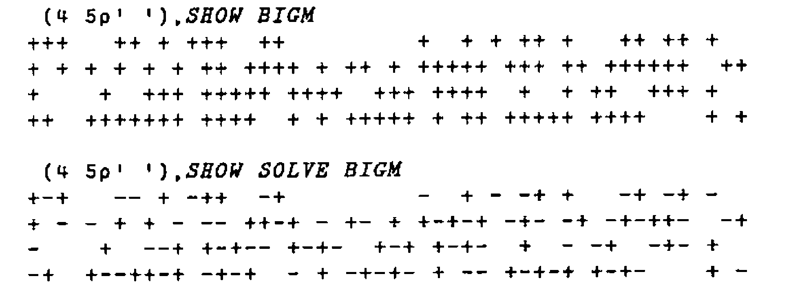

*by Mike Day*
{ .byline }

Just before Christmas last year, I was having lunch with my friend Mike in his Government department’s canteen. We studied Maths together many years ago and are still "Scientific" civil servants. He wondered if I could help him solve his rounding problem. His unit determines the amount of grant payable to a number (say 50) of "clients" under a few (around 4) different accounting headings. However most clients bid for less than all 4. His ministry has formulae to allocate the available funds resulting in integral amounts of pounds (let us say) to each bidder for each heading. However, they only pay out half of the approved funds.

Mike had the task of making the tables of Ministry expenditure look right in whole numbers even though halved from the original approved levels; the sum of the rounded halves must be as near as possible the same as the rounded half of the sum for any client or for any heading or indeed overall.

By the way, Mike has Excel for Windows but not APL. He has always taken a guarded and rather bemused view of my interest in it.

We can restate his problem only slightly more formally as:

## Problem 1

Seek a way of arbitrarily rounding each half-integral number in a matrix up or down so that the absolute cumulative error in each row, each column, and over the whole array shall be nowhere greater than one half unit.

As a smaller example than the real thing, consider 5 clients and 3 headings with these agreed (100%) spends:

```text
Figure 1

      1    2    3
1    33    0   55
2     0  120   30
3     0   67    0
4    23   29   43
5     0    0   37
```

We only need worry about the odd cells as the even ones stay integral correctly. Mark the odd cells in a Boolean matrix:

```text
Figure 2

      1    2    3
1     1    0    1
2     0    0    0
3     0    1    0
4     1    1    1
5     0    0    1
```

Mike’s problem is effectively to replace each one in figure 2 by a plus or minus one so that all the marginal sums are 0 or +1 or -1. One solution is easily seen to be:

```apl
Figure 3

      1    2    3
1     1    0   ¯1    0
2     0    0    0    0
3     0   ¯1    0   ¯1
4    ¯1    1    1    1
5     0    0   ¯1   ¯1

      0    0   ¯1   ¯1
```

I’ve appended the totals. So the complete result for the rounded halved matrix is:

```text
Figure 4

      1    2    3
1    17    0   27   44
2     0   60   15   75
3     0   33    0   33
4    11   15   22   48
5     0    0   18   18

     28  108   82  218
```

Compare the unrounded version:

```text
Figure 5
        1        2        3
1    16.5             27.5     44
2               60    15       75
3               33.5           33.5
4    11.5     14.5    21.5     47.5
5                     18.5     18.5
     28      108      82.5    218.5
```

Mike has solved his real problem by inspection but he thought there must be an algorithm to do the trick. I agreed but at first I couldn’t see how. Then I saw the light. Look at Figure 3 again — but change the signs of all the margins except the total:

```text
Figure 6

      1    2    3
1     1    0   -1    0
2     0    0    0    0
3     0   -1    0    1
4    -1    1    1   -1
5     0    0   -1    1

      0    0    1   -1
```

The marginal totals of the 6 x 4 table are all zero! We have an extended problem which is simpler than the original:

## Problem 2

Given a Boolean matrix with even numbers of ones in each row and column, replace each one by plus or minus one so that all the marginal sums are zero. The (`¯1 1`) DROP of the solution is a solution to PROBLEM 1 and the negation of each marginal total except the overall cell is the sum for the corresponding reduced row or column.

How do we set up the extended Problem? It is easy enough in APL to adapt our matrix: append a new column which is the 2’s modulus of the sum of each row. Do the same with the columns and append a new row. So, if *M* is the original matrix,

```apl
      ME ← 2 | x,[1] +⌿ x← (ME,+/ME)
```

It’s neater to defer the parity check. We still need to solve the extended table, *ME*! Consider this problem:

```apl
      M ← 1 1 ⍴ 1                          Figure 7
```

which is extended to

```apl
      ME                                   Figure 8

1 1
1 1
```

trivially solved by

```text
+ -                                        Figure 9
- +
```

The solution can be traced in a cycle from 1 to 4 (to 1) with alternating signs:

```text
1 2                                        Figure 10
4 3
```

The next most trivial problem is the 2 x 2 matrix:

```apl
      ⎕ ← M ← 2 2 ⍴ 1 0 0 1
1 0                                        Figure 11
0 1
```

extending to

```apl
      ME
1   0   1                                  Figure 12
0   1   0
1   0   1
```

We see that there is still an easy solution:

```text
+       -                                  Figure 13
    -   +
-   +
```

This again equates to the assignation of alternating signs to a cycle of cells in the order 1 to 6:

```text
1       2                                  Figure 14
.   4   3
6   5
```

Why does it work? In establishing an even parity of ones in rows and columns in the matrix, we allow the existence of complete rectangles of 4 points: any candidate (e.g. 2) must have 2 mates, (1 and 3). There is evidently a missing point opposite 2. However it closes the rectangle whose other corners are 4 5 and 6. We can therefore regard it as doubleton of plus and minus ones cancelling out to zero.

Of course sometimes, as in figure 8, the rectangle is complete and does not need completing with a virtual point.

And that’s it! Start with a plus at an arbitrary 1 in the extended Boolean matrix, and move in a city grid path, i.e. alternately across (left/right) with a plus and up/down with a minus stepping through remaining target cells in the array. I actually set all the ones to value two to start with so that I can use the same array throughout rather than have one for Booleans and one for the new values. As real problems tend to have more than one closed path, we need to be able to choose a new arbitrary starting point from time to time.

Here’s a bigger example:



I’ve set SHOW’s ⋄ characters to blank for readability on the printed page.

It is all fairly simple and I hardly need bother you with the simple code. It’s in the appendix. I used my own version of Direct Definition under APL\*PLUS/PC 8 to set up utility functions with somewhat meaningful names. I hoped in this way to keep the main function *SOLVE* quite undaunting for my non-APLer colleague, looking deliberately quite FORTRAN-ish! This did indeed allow Mike to learn enough Excel macro/programming language to mimic the APL functions in around 100 lines.

It would of course have been a good opportunity to use Dynamic Data Exchange with a Windows-based APL as described by Adrian Smith in Vector 9.2, 1992. Adrian has drawn my attention to a Philip Benkhard’s paper *"A Dance of Rounds"* (APL Quote Quad 1991). He deals with the more general problem of distributed rounding of arrays of fractional numbers rather than strictly half integral ones, and considers relative errors as well as absolute ones. As I do not have a fully implemented second generation APL yet, I am not sure whether his approach would solve Mike’s poser. I suspect it would!

I haven’t yet succeeded in generalising my algorithm to 3 or more dimensions. "Why?" said Mike. "What about more than one year?" said I. In investigating the higher dimensional question I did derive a rather neater set of functions than those you see: there’s only one *INDEXNEXT* function which handles each dimension in turn. In three dimensions you go across, down, back. Everything is done on the ravel of the Boolean with a tricky one-liner to return the indices of the required one-space which is then checked for the next candidate. Unfortunately it only works in one and two dimensions. So I hope Mike’s users don’t add up across years!

I suspect that one way to generalise to n-dimensions is to develop my explanation of why the 2-d method works: each candidate point must have *n* neighbours in the extended array. That leaves `(2*n) - (n+1)` possibly virtual points to complete the corners of the n-rectangle. In order to catch Vector’s deadline I leave it as an exercise!

## Appendix: Function Listings

```apl
      ⍝ N.B. ⎕IO←1 throughout
      ∆∆L ∆L
A∆COMMENT: ⍵ ⍝.. COVER/UTILITY FNS FOR MAIN FN 'SOLVE' ...
COL: ⍵[;⍺[2]] ⍝            find column ⍺[2] of matrix ⍵
ROW: ⍵[⍺[1];] ⍝            find row    ⍺[2] of matrix ⍵
FIRST:1↑ ⍵ ⍝               return first element of a list
LAST:¯1↑ ⍵ ⍝               return last  element of a list

INDEXNEXT: ⍵ MINDEX WHERE ⍵
  ⍝ find the indices of the next untreated cell

INDEXNEXTINCOL:x:NONE x←(WHERE ⍺ COL ⍵ ),LAST ⍺ :INDEXNEXT ⍵
  ⍝ next in ⍵[;[⍺[2]]

INDEXNEXTINROW:(FIRST ⍺ ),WHERE ⍺ ROW ⍵
  ⍝ find next cell in ⍵[⍺[1];]

MINDEX:,1+(⍴ ⍺ )⊤¯1+ ⍵
  ⍝ index pair for ⍺-dim matrix given ravelled index ⍵

WHERE:⍳0:2∊ ⍵ ←, ⍵ :, ⍵ ⍳2
  ⍝ find the next untreated cell in a vector

NONE:2>⍴ ⍵ ⍝          check if at least two elements in list

SHOW:'-⋄+'[2+ ⍵ ]
  ⍝ display a matrix of +1 -1 or 0 as + - or ⋄

SOLVER:SHOW y,[1]+⌿y←x,+/x←SOLVE ⎕←2>? ⍵ ⍴ ⍺
  ⍝ do a problem size ⍵, sparsity ÷⍺

ODD:2| ⍵ ⍝ mark all odd elements

EXTEND:2×ODD ⍵ ,[1]+⌿ ⍵ ← ⍵ ,+/ ⍵
  ⍝ append rows + cols, check parity, double

TRIM: ¯1 ¯1 ↓ ⍵ ⍝ remove appended row and column
```

```apl
      ∇ SOLVE[⎕]∇
[0]   z←SOLVE m;i;⎕IO
[1]   ⍝  Solves half integer matrix rounding problem
[2]   ⍝  by following city-grid route in an extended even parity matrix.
[3]
[4]   ⍝  The style is deliberately FORTRAN with most 'APL' consigned to
[5]   ⍝  direct definition one-line utility functions
[6]
[7]   ⍝  boolean matrix m
[8]   ⍝  z has +/- ones in place of m's ones.
[9]   ⍝       Magnitude of all row + col + total sums ≤ 1
[10]
[11]   ⎕IO←1
[12]   m←EXTEND m ⍝                append row+col, adjust parity, double
[13]   i←⍴m ⍝                      arbitrary seed
[14]  loop:
[15]   →(NONE i←i INDEXNEXTINCOL m)/end ⍝ next cell, same col if poss.
[16]  ⍝                                   finish if none anywhere
[17]   m[i[1];i[2]]←1 ⍝                   set cell
[18]   i←i INDEXNEXTINROW m ⍝             next cell in row. MUST be one!
[19]   m[i[1];i[2]]←¯1 ⍝                  set it
[20]   →loop ⍝                            repeat until done
[21]
[22]  end:
[23]   z←TRIM m ⍝                         clean up the answer
      ∇
```
