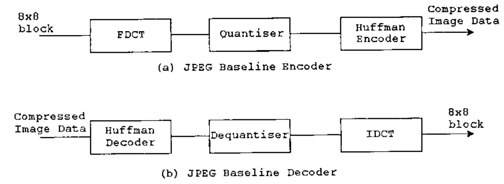
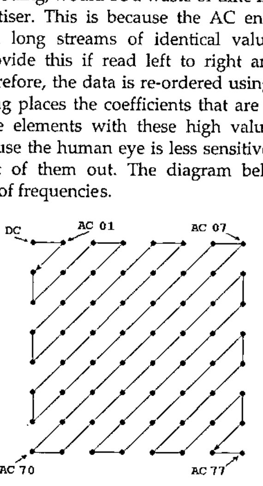
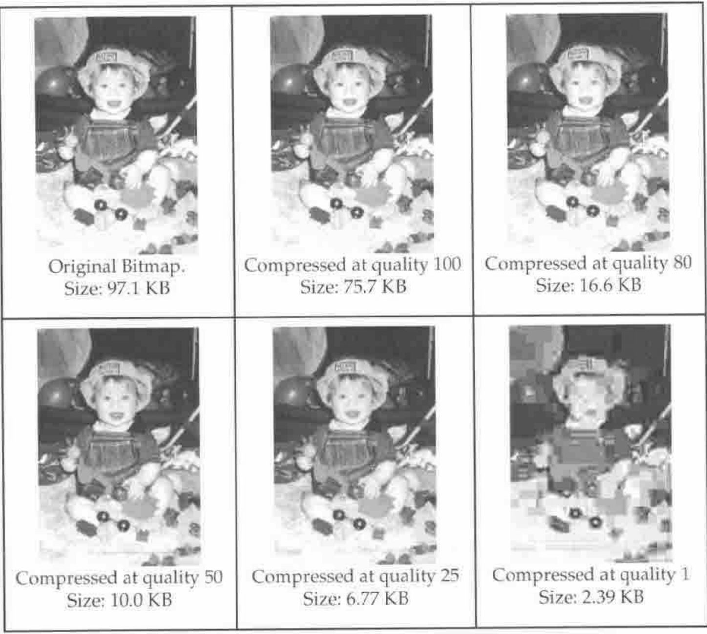

*by Richard Dazeley*
{ .byline }

## Abstract

JPEG baseline is one of the world’s most used compression algorithms. This is because it is fast, offers good compression with little noticeable image degradation, and allows the user to specify the level of image quality. The algorithm uses a number compression techniques such as difference, run-length and Huffman coding. It also does a number of image manipulation functions such as colour space conversion and changing from the spatial to the frequency domain. This paper explains the algorithm in detail as well as giving code for a J implementation. The implementation given compresses 24-bit Windows bitmap images. Also provided is a brief explanation and code implementation of JFIF (JPEG File Interchange Format). The result is an implementation that runs in a similar time as implementations in compiler-based languages.

## Introduction

In a world with limited data storage and bandwidth our ability to store and transfer information cheaply has become a major field of research and development. The ability to compress data significantly helps to reduce this expense making information more readily available to everyone. Digital images are one of the most costly information sources and have been the focus of a number of techniques. There are two major advantages to image compression over other sources such as text and speech. The first is that their "multi-dimensional characteristic implies that image data has more redundancies than one dimensional data such as speech" (Kou 1995, p6). Secondly an image is capable of losing a great deal of its information before the human viewer is capable of observing any degradation. However this is not possible at all in sources like text.

With the advent of the World Wide Web the number of transfers of photographic images has exploded and one of the most popular compression techniques for this type of image is JPEG. The JPEG (Joint Photographic Experts Group) standard specification (ISO/IEC IS 10918, or ITU-T T.81) defines four operation modes: sequential DCT based mode, sequential lossless mode, progressive DCT based mode, and hierarchical mode. The first mode is the simplest and is referred to as JPEG baseline and is what most people mean when they refer to JPEG.

This simpler but by no means trivial algorithm will be the focus of this paper. The algorithm will be applied to a standard 24-bit Windows bitmap file using the functional language J. While a compiled language such as C or Java may be better suited in some ways to an algorithm like this, an array based language such as J offers an interesting alternative as it provides a number of tools well suited to the matrix manipulation required.

## Setting up the Image Data

There are four initial tasks that need to be performed prior to compression. The first is obviously to load the bitmap but then excess bytes need to be removed, the colour space converted and a suitable data structure built that allows the algorithm to operate smoothly. This process is controlled by the `setUp` function.

```j
SetUp =: blocks@fillImage@shape@components@colourSpace@
        removeZeros
```

### Load Bitmap

The process of loading the bitmap involves reading in the data, converting it, extracting some important information from the header and setting up our initial data structure. The following function and its subsidiaries performs these tasks.

```j
loadBitmap   =: boxElements@interpret@read@usage
```

There are two pieces of information that are important for this algorithm. The first is the path and file name of the bitmap to be compressed and the second is the quality level to perform the compression. The function `usage` allows the user the option of giving a value or using the default quality setting. The output of the function is two boxes: the first is the quality setting followed by the path and file name.

```j
usage        =: ({:,{.)`(quality&;) @. (#>2:)
quality      =: 80
```

The `loadBitmap` function then reads in the file data and converts it from characters to integers with the following functions:

```j
read         =: >@{.;1!:1@{:
interpret    =: {.,charToInt&.>@{:
charToInt    =: a.&i.
```

The last stage is to extract the width, height and start of image information that is contained in the bitmap header. All of these pieces of information are 4 bytes in size and start at the 18th, 22nd and 10th elements respectively. This is done with the following code.

```j
boxElements  =: {.,(imageWidth;imageHeight;image)@>@{:
image        =: fileStart}.|
imageHeight  =: (22+i.4)&group
imageWidth   =: (18+i.4)&group
fileStart    =: (10+i.4)&group
group        =: 256&#.@|.@:{
```

This information is collated into an array of four boxes in the format below.

| Quality | Image Width | Image Height | Image Data |
|---|---|---|---|

### Removing Zeros

The Windows bitmap file can contain extra zeros at the end of each row of pixel data. This is because Windows allocates memory in DWORD (4 bytes) sized blocks. The number of extra zeros at the end of each row is the amount needed to fill out the row of bytes to a multiple of four. For instance, an image of one pixel width has three bytes to represent blue, green, and red (Windows bitmaps are the reverse of the more common RGB format) plus one zero to fill out the four bytes required. Therefore, a width of two pixels would have two zeros, three pixels would have three zeros and four pixels would have no zeros. In the following set of functions the `stencil` function builds an array of 1s based on the width of the image and appends to the tail a number of zeros. The `removeZeros` function duplicates the stencil for each row and performs a copy over the array of pixels. This copies only the elements we need and removes the excess zeros.

```j
removeZeros  =: }:,<@(pixels #~ ($@pixels $ stencil))
stencil      =: >:@(0&*)@(i.@(3&*@width)),(0&*)@i.@numZeros
numZeros     =: (4&|)@(4&-)@(4&|)@(3&*@width)
width        =: >@(1&{)
pixels       =: >@(3&{)
```

### Colour Space Conversion

Windows bitmaps store each pixel’s data using three colour channels: blue, green and red (BGR). JPEG, however, requires that an image uses the YUV or YCbCr colour space. One reason for this is because the human eye is much more sensitive to variances in luminance than those in chrominance. Therefore, significantly more compression can be achieved on the horizontal and vertical chrominance channels without any visible degradation in the image (Taylor, 1999)[^1].

Colour space conversion can be done by calculating the following equations:

```text
Y  =    0.299 R + 0.587  G + 0.114 B
Cb = -0.1687 R - 0.3313 G +   0.5 B + 128
Cr =      0.5 R - 0.4187 G - 0.813 B + 128
```

In J this was easily done by multiplying the reverse of BGR by the matrix `YCbCr` at rank 1. The rows of the resulting 3×3 matrix are then added together along with the array `inc`. The reshape function takes a number on the left and makes a matrix with that number of columns out of the array to the right.

```j
YCbCr        =: 3 3 $ 0.299,     0.587,     0.114,
                      0.1687,    0.3313,    0.5,
                      0.5,       0.4187,    0.0813
inc          =: 0 128 128
colourSpace  =: }:,<@,@(convert"1@|."1@(3&reshape)@pixels)
convert      =: (inc&+)@:(+/"1)@(YCbCr&(*"1~))
reshape      =: (>.@($@]%[),[)$]
```

### Components and Blocks

The JPEG algorithm requires that an image is compressed within its component parts. In this script the source file is always regarded as having three components Y, Cb and Cr (A grey scale image would normally only have the luminance component). Therefore, our next step is to extract each component’s data into separate arrays. The following code does this calling three functions which in turn call the `selector` function passing it an additional three-element array. This array gives which byte we are interested in for that component. This array is duplicated to the length of the number of pixels in the image. J’s copy function is then used to select only the elements required for that component.

```j
components   =: }:,<@(Y;Cb;Cr)
selector     =: pixels@](#~)([($~)(3&*@numPixels@]))
Y            =: (1 0 0)&selector
Cb           =: (0 1 0)&selector
Cr           =: (0 0 1)&selector
numPixels    =: width * height
```

The end result of the `components` function is three boxes, each containing an array representing a component extracted from each of the pixels. These three boxes are all contained within the image data box of our main data structure.

Within these components the JPEG compression operates on individual 8×8 blocks of data. Therefore, we need to cut each component into blocks of this size. To do this we first need to convert each component array of data into a matrix with the same width and height as the original image.

```j
shape        =: }:,<@(dim (<@|.@$"1 >) pixels)
dim          =: height , width
```

You may notice here that after the array has been shaped into the same size as the original image it then flips the order of the rows. This is done because Windows bitmaps start at the bottom and scan upwards (Lamothe, 1998). Secondly, before we cut out our blocks we need to consider the case where the image’s width or height is not divisible by 8, which would result in some non-standard size blocks. This is corrected by filling out the width and height of each component with zeros. The `fillImage` function does this by building a template matrix that is the desired minimum size. The desired minimum size is the same size or bigger than the source image and it is also divisible by 8 in both dimensions. This template is then laminated onto each component. J then fills out the component matrix with zeros to the same size as the template. The template matrix is then removed leaving the component with the correct dimensions.

```j
fillImage    =: }:,<@(template fillComp (>@pixels))
fillComp     =: (;/)@{:@([,:])
template     =: i.@(newHeight,newWidth)
newWidth     =: blockWidth&ceiling@width
newHeight    =: blockHeight&ceiling@height
ceiling      =: ((|-)|)+]
```

We are now ready to cut the blocks which is done by repeatedly cutting the component into lots of 8 rows. Then by transposing the resulting matrix, repeating the cutting process and transposing it back, we have effectively been cutting in lots of 8 columns giving us our 8×8 blocks.

```j
blocks       =: }:,<@(<@(<@trans@cut@trans@cut@>)@pixels)
cut          =: _8&(<\)
trans        =: |:@>
```

## JPEG Baseline Compression

Now that the image data is structured appropriately we can perform the JPEG compression algorithm. The baseline algorithm is DCT (Discrete Cosine Transform) based and the basic system is shown in Figure 1. The encoder diagram contains three stages: an 8×8 FDCT (Forward DCT), a quantiser and a Huffman encoder. The FDCT converts the 64 samples that are in the spatial domain to a set of 64 values that are in the frequency domain. The first frequency is called the DC coefficient (zero frequency coefficient) and the rest are the AC coefficients (non-zero frequency coefficients). These values are re-ordered and quantised according to the quality specified by the user and then Huffman coded. Both the quantisation and Huffman coding is accomplished through the use of look-up tables. The Decoder is the inverse of the encoding process using a Huffman decoder, a dequantiser, and an 8×8 IDCT (Inverse DCT). The decoding process is not implemented here.



**Figure 1: JPEG Baseline System Diagram (Kou, 1995)**

### Discrete Cosine Transform

The Discrete Cosine Transform converts the set of 64 samples from a block into a set of frequency coefficients. This is done through the application of the following equation. However, few JPEG encoders are actually implemented using this definition as it is very computational intensive and any accuracy gained is lost during quantisation. Instead they use one of a number of fast DCT algorithms. This application is using the AAN[^2] method as implemented in the IJG JPEG-6a library.

The FDCT given a block of samples: S<sub>*yx*</sub> (*y*,*x* = 0,1,…,7) is defined by:

> S<sub>*vu*</sub> = ¼ C<sub>*u*</sub>C<sub>*v*</sub> Σ<sub>*x*=0</sub><sup>7</sup> Σ<sub>*y*=0</sub><sup>7</sup> S<sub>*yx*</sub> cos((2*x*+1)*u*π/16) cos((2*y*+1)*v*π/16)

Also, included below is the IDCT, should the reader feel inclined to implement a JPEG decoder.

> S<sub>*yx*</sub> = ¼ Σ<sub>*x*=0</sub><sup>7</sup> Σ<sub>*y*=0</sub><sup>7</sup> C<sub>*u*</sub>C<sub>*v*</sub>S<sub>*vu*</sub> cos((2*x*+1)*u*π/16) cos((2*y*+1)*v*π/16)

where

> C<sub>*m*</sub> = 1/√2 for m = 0; 1 otherwise

To perform the FDCT using the AAN method we first need to subtract 128 from all the samples in each block.

```j
FDCT         =: }:,<@(FDCTblock&.>@pixels)
FDCTblock    =: (DCT@sub)&.>
sub          =: 128&(-/~)
```

The next step is to apply the transform’s set of calculations by column and then by rows. In the graph below is a set of values needed to generate the fast transform.


**Figure 2: Fast DCT Multiplication Factors.**

Basically 8 samples are entered (1 row or column) and 8 coefficients are generated. Each output element is a result of multiplying each of the input elements by its corresponding graph values and adding the results. The J implementation, though, has altered this slightly to minimise the amount of multiplications but still provides the same results.

```j
DCT          =: (DCTcalc"1)&.|:@:(DCTcalc"1)
DCTcalc      =: output @ step4 @ step3 @ step2 @ step1
step1        =: 4&{. (+,-&|.) |.@(_4&{.)
step2        =: [, step2a ,step2b
step2a       =: (2&{. (+,-&|.) |.@(_2&{.))@(4&{.)
step2b       =: +/@>@(2&(<\))@(_4&{.)
step3        =: [, t1, t2, t3
    t1       =: (0.707106781)&*@+/@((10 11)&{)
    t2       =: (0.382683433)&*@-/@((12 14)&{)
    t3       =: (0.707106781)&*@(13&{)
step4        =: [,t4,t5, +/@p1, -/@p1
    t4       =: ((0.541196100)&*@(12&{))+(16&{)
    t5       =: ((1.306562965)&*@(14&{))+(16&{)
output       =: +/@p2, +/@p3, +/@p4, -/@p5,
                -/@p2, +/@p5, -/@p4, -/@p3
    p1       =:  7 17 &{
    p2       =:  8  9 &{
    p3       =: 20 19 &{
    p4       =: 11 15 &{
    p5       =: 21 18 &{
```

### Quantisation

The quantisation phase of the algorithm is now performed on the result of the FDCT and is the lossy part of the JPEG algorithm. This stage involves first building a Quantisation Matrix or QM. There are two QMs (luminance and chrominance) in this implementation, comprising 64 quantiser step-size parameters each based on the specified quality.

```j
divisorsLuminance    =: divisors@quantumLuminance
divisorsChrominance=:divisors@quantumChrominance
divisors        =: %@(((64$AANscaleFactor)*(8#AANscaleFactor)
                    *8)&*)
quantumLuminance  =: quantumLConst&quantum
quantumChrominance=: quantumCConst&quantum
qualityFactor   =: (200&-)@(2&*)`(5000&%)@.(50&(<~))
quantum              =: (mnQm, mxQm)&interval@<.@(100&(%~))@(50&+)
                     @([*qualityFactor@((min,max)&interval)@])
interval        =: ({.@[>.])(+.>.])({:@[<.])
max                  =: 100
min                  =: 1
mxQm            =: 255
mnQm            =: 1
```

The `quantumLConst`, `quantumCConst` and `AANscaleFactor` are arrays and are given in Appendix A. The quality factor calculates a factor between 0 and 5000 according to the quality level specified at the start. The `quantum` function first calls `interval` then calculates the quantiser steps. The `interval` function is dyadic and forces any elements outside the interval specified by min and max to be in the interval. The result is fed into the function divisors which uses the `AANscaleFactor` to calculate the two QMs.

The resulting array of 64 coefficients from the FDCT are then divided by the relevant QM and rounded to the nearest integer. In the above code the QMs were also inverted so in the `qCalc` function below the result from the FDCT and the QMs are actually multiplied.

```j
quantise=: }:,<@(<@(divisorsLuminance@>@{.qCalc >@{.@pixels)
          ,<@(divisorsChrominance@>@{. qCalc >@(1&{)@pixels)
          ,<@(divisorsChrominance@>@{. qCalc >@{:@pixels))
qCalc    =: <@zigzag"1@round@([(*"1)(,/)@>@])
round    =: <.@(0.5&+)
```

### Zig-Zag Re-ordering

The next stage, entropy coding, would be a waste of time if performed on the data received from the quantiser. This is because the AC encoding uses run-length coding which relies on long streams of identical values and our matrix of coefficients will not provide this if read left to right and top to bottom as it currently would be. Therefore, the data is re-ordered using what is called zig-zag re-ordering. This ordering places the coefficients that are most likely to have the highest values first. The elements with these high values tend to be the low frequencies. This is because the human eye is less sensitive to high frequencies so the quantiser cuts a lot of them out. The diagram below shows the zig-zag ordering of an 8×8 block of frequencies.



**Figure3: Zig-Zag ordering (Kou, 1995)**

This re-ordering was implemented simply by having an array with the order of the elements’ indices and by using the from function. The array `jpegNaturalOrder` is provided in appendix A.

```j
zigzag       =: jpegNaturalOrder&{
```

### Entropy Coding

In JPEG the Quantised DCT coefficients are entropy coded using difference and run-length coding combined with Huffman coding. The DC component is coded separately from the AC part. The entropy encoder is able to use up to two DC and two AC Huffman tables as has been used in this implementation. The following function calls the appropriate DC and AC encoders for each component.

```j
entropy      =: }:,<"2@((DCY ,. >@ACY)@{., (DCC ,.
>@ACC)@(1&{)
               ,: (DCC ,. >@ACC)@{:)@:>@pixels
```

### Encoding DC Coefficient

There is a lot of locale correlation between blocks in photographic images. This is taken advantage of in JPEG by employing difference coding between the DC components called Differential Pulse Code Modulation (DPCM). To do this, first all the DC components are extracted from the blocks within a component. Then the difference between them is calculated. This value is then binary coded in a two step process. The first step is to assign a category to the DPCM and which is Huffman coded. Then if the difference is not zero, the second step is to assign additional bits to indicate the specific value and sign. The amount of extra bits is the same as the category number.

Below is a table that gives the category classifications in relation to the DC difference.

| Category (SSSS) | DPCM Difference (DIFF Values) |
|---|---|
| 0 | 0 |
| 1 | –1,1 |
| 2 | –3,–2,2,3 |
| 3 | –7…–4, 4…7 |
| 4 | –15…–8, 8…15 |
| 5 | –31…–16, 16…31 |
| 6 | –63…–32, 32…63 |
| 7 | –127…–64, 64…127 |
| 8 | –255…–128,128…255 |
| 9 | –511…–256, 256…511 |
| 10 | –1023…–512,512…1023 |
| 11 | –2047…–1024,1024…2047 |

**Table 1: Difference magnitude categories for DC coefficients (Kou, 1995)**

There are three additional rules that apply to the coding process here. The first is that the Huffman code words must be generated in such a way that no codeword has all its bits set to ‘1’ or it will conflict with JFIF marker prefixes. The second is that the most significant bit of the appended difference magnitude is set to ‘0’ for a negative DPCM and ‘1’ for a positive difference (Kou, 1995).

The following code does this by finding the DPCM array and feeding it into a fork which calculates the Huffman coded category bitstream, as well as the specific difference value bitstream and joins the two.

```j
DCY          =: <@(SSSSY,DIFF)"0@difference
DCC          =: <@(SSSSC,DIFF)"0@difference
```

The DPCM array is calculated using the `difference` function which works by extracting the DC elements (the first element from each box), appending a zero at the start, finding the difference between pairs and negating the result.

```j
difference   =: -@(2:-/\])@(0&,)@({.@>@,)
```

The SSSS functions generate the bitstream for the category.

```j
SSSSY        =: (DCbitsY&code) (|.@{.)
                (|.@,@#:@(512&+)@(DCvalsY&code))
SSSSC        =: (DCbitsC&code) (|.@{.)
                (|.@,@#:@(2048&+)@(DCvalsC&code))
```

The right prong of its fork first calls the `code` function and passes in a look-up table for the Huffman code. The `code` function picks out the relevant Huffman code by using the value generated by the `category` function. However, the value returned when converted to binary will be missing any preceding zeros. This is corrected by filling the value out with extra zeros and using the `code` function again to look-up the number of required bits for the category to select that many elements.

On inspection of table 1 it can be observed that the category for a given value is actually the number of bits it takes to represent it. The `category` function uses this characteristic by converting the value to binary and taking the shape of the binary number. There is one small problem with this though and that is that a DC value of zero is a special case. Due to the binary representation zero being ‘0’ it, therefore, has the shape of 1 but it should be in category 0. To correct this we test the DC coefficient to see if it’s not equal to zero. If it is not then we use the calculated value, otherwise we use the value 0.

```j
code         =: ({~) category
category     =: ({.{])@((~:0:),(;/@$@#:))"0
```

The `DIFF` function represents the specific DPCM value as a binary bitstream by simply using the antibase2 function if the value is positive. If negative it first decrements the value and then finds the antibase2. There are some cases, though, where it may have an extra one at the head e.g. \_7 would generate 1 0 0 0 instead of the intended 0 0 0. Therefore, `DIFF` also tests for this case and removes the head element if it occurs.

```j
DIFF         =: (]`}.@.((#.@}.)=0:))@#:@<:` #: @. (]>0:)
```

### Encoding AC Coefficient

Due to zig-zag ordering the high frequencies tend to be zero. This is utilised by using run-length coding on the AC part of the block. The code for the AC part is generated by repeatedly counting the number of zero coefficients until a non-zero one is encountered. This is then represented using the RS byte which is Huffman coded. The first four bits store the run-length of zeros and the last four hold the category value of the non-zero coefficient encountered after the run.

```text
RS = binary 'R R R R S S S S'
```

There are two special cases which are handled through the use of two predefined bytes. The first is if the run-length has sixteen or more zeros. In this case a special byte called the ZRL (zero run length) is inserted. The second is if there are only zeros left until the end of the block. In this situations the byte called the EOB (end of block) is added.

```text
ZRL =  '1 1 1 1 0 0 0 0'
EOB =  '0 0 0 0 0 0 0 0'
```

The precise value of the AC coefficient (called ZZ) is then added after the RS byte using the number of bits specified by the SSSS portion of the byte.

In the J implementation the DC component of a block is replaced by a zero and passed into the function `data` which builds a two row matrix. The first row gives the run-length of zeros the second gives the corresponding coefficient encountered after that run length. This is then passed into the `RS` and `ZZ` functions which generate the Huffman coded RS byte and the specific coefficient bit streams respectively. These are then joined into a single bit stream for each non zero coefficient.

```j
ACY
=:(<@((>@hufCodeY@RS)(<@(>@{.,>@{:)"1@,.)>@ZZ)@data)"1@prep
ACC
=:(<@((>@hufCodeC@RS)(<@(>@{.,>@{:)"1@,.)>@ZZ)@data)"1@prep
prep=:(0&,)@}."1@>@,
```

The `data` function uses a function `fixIndices` to build an array of the index locations of non-zero coefficients. For the top row it takes this array of indices and calculates the difference between them minus one to give the run-length. The second row is built by using the from (`{`) function to select the non-zero coefficients. Both rows then call the EOB function which adds the `EOB` special byte if the last coefficient is zero. The `fixIndices` function uses the function `indices` to build the initial array.

It then finds the difference between them and inserts the ZRL special byte should any runs be 16 elements or longer by using the `split` function.

```j
data    =: <@((EOB run@fixIndices),:(EOB fixIndices{]))
fixIndices =: (+/\)@(16&split)@:-@(2:-/\])@(0&,)@indices
indices =: ((i.64)&(#~))@(0&~:)
split   =: ;@:(<@g"0)
g       =: f^:(<{:)^:_
f       =: (,}:) , --&{:
EOB     =: ]`(],0:)@. (({:@[)=0:)
run     =: ,@((]`0:@.({.=_1:),}.)@<:@-@(2:-/\])@(0:,]))
```

The `ZZ` function takes the matrix generated by `data` and, using only the second row, generates the bit streams using the `DIFF` function used in the DC coding.

```j
ZZ      =: <@DIFF&.>@<"0@{:@>
```

The `RS` function takes the run-length element from the first row, left-shifts it 4 places by multiplying it by sixteen and then adds a category value using the `category` function defined earlier.

```j
RS      =: <@(((16&*)@{.)+(category@{:))@>
```

The `hufcode` functions look-up the appropriate Huffman code and the number of bits required to represent that code and the trim function removes the excess elements.

```j
hufCodeY =: <@trim"1@|:@(ACnumBitsY ,  |:@:(|."1)@ACvalueY)@>
hufCodeC =: <@trim"1@|:@(ACnumBitsC ,  |:@:(|."1)@ACvalueC)@>
ACvalueY =: (#:@(65536&+))@(ACvalsY&({~))
ACvalueC =: (#:@(65536&+))@(ACvalsC&({~))
ACnumBitsY   =: ACbitsY&({~)
ACnumBitsC   =: ACbitsC&({~)
trim         =: <@|.@(({.{.}.)
```

## JPEG File Interchange Format

The JFIF (JPEG File Interchange Format)is a minimal file format that allows the exchange of JPEG bitstreams between a variety of platforms and applications. The JFIF format is an extension to the older format JIF (JPEG Interchange Format) and allows for extra extensions. A JFIF format must have the JFIF APP0 marker directly after the SOI (Start of Image) marker (Hamilton, 1992).

While there are around 30 markers that specify coding information the most common and the ones used in this implementation are listed in table 2.

| Description | Marker Symbol | Code Assignment (Hex) |
|---|---|---|
| Start Of Image | SOI | FFD8 |
| Application-Specific JFIF | APP0 | FFE0 |
| Comment | COM | FFFE |
| Start Of Frame for Baseline | SOF | FFC0 |
| Define Huffman Table(s) | DHT | FFC4 |
| Define Quantisation Table(s) | DQT | FFDB |
| Start Of Scan | SOS | FFDA |
| End Of Image | EOI | FFD9 |

**Table 2: Typical Markers for JPEG Baseline (Kou, 1995)**

The implementation of the JFIF section basically involves appending header information to the beginning of the file and an EOI marker at the end of the file. The main function that does this is the `appendHeader` function. Its first operation is to call the function `bitStream` which takes all of the bitstream pieces from all the separate blocks and components and joins them into a single stream. It then uses the `reshape` function defined earlier to convert it into a matrix with rows of 8 bits and each row is then converted into a byte. It also inserts an extra byte with the value 0 after every byte that has a value of 255. This is done because the value 255 is reserved for markers. The `appendHeader` function then attaches the various header information which can be found in appendix A.

```j
appendHeader =: (({.header1)&,)@
                (DQT,SOF,(({.header2)&,)@(;@bitStream))
bitStream    =: b@(254&a)@#.@(8&reshape)@
                ;@(pixels,.>@(4&{),.>@(5&{))
a            =: <@g"0
b            =: <@(]`(>:@{.,<:@{:) @. (#>1:))@>
header1      =: (SOI,"1 JFIF,"1 COM)
header2      =: (DHT,"1 SOS)
appendFooter =: EOI&(,~)
```

## Saving the File

The process of writing the compressed JPEG image to file is performed by the `saveJpeg` function. The compressed data is passed in as the right argument and the path and file name entered by the user as the left argument. The function `outFile` takes the image data and appends the header and footer to the beginning and end of the data and then calls the function `intToChar` to convert it all to characters ready for the `write` function to save the file.

```j
saveJpeg     =: write~ outFile
outFile      =: intToChar@appendFooter@appendHeader
write        =: 1!:2<
intToChar    =: a.&({~)
```

## Bringing It All Together

The various stages of the compression algorithm have been written and now just need to be brought together. The `compress` function below takes the loaded bitmap, sets up the data structure and calls the `FDCT`, `quantise` and `entropy` functions defined above.

```j
compress     =: entropy@quantise@FDCT@setUp
```

This is called in the main function `JPGcompress` which loads the bitmap before it calls `compress` using what is entered on the right parameter and passes the compressed data to the saveJpeg function.

```j
JPGcompress =:  saveJpeg (compress@loadBitmap)
```

## Running JPGcompress

The JPEG compression implementation above when entered works in almost the same time as other compression algorithms written in other languages. During testing, a number of images were compressed and opened in third party programs such as Internet browsers and image editing tools to ensure they displayed the image correctly.

To run the compression algorithm use the `JPGcompress` function using the following rule.

```text
<path\filename.jpg> JPGcompress
<path\filename.bmp>[;<quality>]
```

The first path and file name is for the file you wish to write to and will overwrite any existing file or create a new file if one does not already exist. The second path and file name is for the bitmap file you wish to compress. The last part in brackets is optional. If not included the compression quality level will be 80, which gives a good quality image and decent compression. If you want a different level of compression then add the semicolon and integer representing the quality level. The value 100 will not lose any information (and may be larger than the original image, depending on the image’s detail) while the value 1 will give a very high level of compression but may result in an unrecognisable image.

Below are six copies of a photo of my son Uisce (Ish-Ka): the first is the original bitmap and the other five are examples of different quality levels.



## Conclusion

JPEG baseline is one of the world’s most used compression algorithms. This is because it is fast, offers good compression with little noticeable image degradation and allows the user to specify the level of image quality. The purpose of this paper was to show one possible implementation for the algorithm in J. By using a language such as J a number of areas of the implementation were simplified. The quantity of code was also reduced significantly. For instance, a Java implementation by James Weeks in 1998 took approximately 1500 lines of code.

## References

Hamilton, Eric. "JPEG File Interchange Format" Version 1.02, C-Cube Microsystems, September 1, 1992, http://www.jpeg.org/public/jfif.pdf.

Kou, Weidong. "Digital Image Compression: Algorithms and Standards", Kluwer Academic Publishers, Boston, 1995.

Lamothe, Andre."Windows® Game Programming For Dummies", IDG Books Worldwide February 1998.

Taylor, Nathan. "The inner workings of two key multimedia compression systems: MPEG and JPEG", *Australian Personal Computer*, Australian Consolidated Press, July 1999.

Weeks, James R. "JpegEncoder", Version 1.0a, Java program, BioElectroMech, 1998, http://www.obrador.com.

Hagey , Warren. "Huffman Coding", 1998, http://educ.queensu.ca/~compsci/units/encoding/huffman.html.

Stergiou, Chris. "What is a Neural Network", 1998, http://www.doc.ic.ac.uk/~nd/surprise_96/journal/vol1/cs11/article1.html

## Appendix A

### Header Information and Functions

Following is the header information that is appended to the start and end of the compressed image.

```j
word              =: (256 256)&#:
SOI               =: 255 216
JFIF              =: 255 224 0 16 74 70 73 70 0 1 0 0 0 1 0 1 0 0
comment           =: 'JPEG Encoder programmed in J. Copyright 2000,
                     Richard Dazeley and the University of Tasmania.'
COMlength         =: word@(2&+)@$comment
COMheader         =: 255 254
COM               =: COMheader,"1 COMlength,"1 charToInt comment
DQT               =:(DQTheader&,)@(DQTtableY@>@{., 1:,  DQTtableC@>@{.)
DQTheader         =: 255 219 0 132 0
DQTtableY         =: jpegNaturalOrder&{@quantumLuminance
DQTtableC         =: jpegNaturalOrder&{@quantumChrominance
SOF               =: (SOFheader&,)@SOFinfo
SOFheader         =: 255 192 0 17
SOFinfo           =: (precision&,)@(word@height, word@width,
                     numComponents, 1:, sampleFactor, 0:, 2:,
                     sampleFactor, 1:, 3:, sampleFactor, 1:)
DHTtable          =: bitsDCluminance, valDCluminance,
                     bitsACluminance, valACluminance,
                     bitsDCchrominance, valDCchrominance,
                     bitsACchrominance, valACchrominance
DHTdata           =: (word@(2&+)@$,"1]) DHTtable
DHTheader         =: 255 196
DHT               =: (DHTheader,"1 DHTdata)
SOS               =: 255 218 0 12 3 1 0 2 17 3 17 0 63 0
```

### Tables and General Data

Following is a listing of the look-up tables and general data that has been used through the JPEG implementation.

```j
precision         =: 8
blockWidth        =: 8
blockHeight       =: 8
numComponents     =: 3:
sampleFactor      =: 9:+8:
AANscaleFactor    =: 1.0 1.387039845 1.306562965 1.175875602
                     1.0 0.785694958 0.541196100 0.275899379
quantumLConst     =: 16 11 10 16 24 40 51 61 12 12 14 19 26 58
                     60 55 14 13 16 24 40 57 69 56 14 17 22 29
                     51 87 80 62 18 22 37 56 68 109 103 77 24
                     35 55 64 81 104 113 92 49 64 78 87 103 121
                     120 101 72 92 95 98 112 100 103 99

quantumCConst     =: 17 18 24 47 99 99 99 99 18 21 26 66 99 99
                     99 99 24 26 56 99 99 99 99 99 47 66 99 99
                     99 99 99 99 99 99 99 99 99 99 99 99 99 99
                     99 99 99 99 99 99 99 99 99 99 99 99 99 99
                     99 99 99 99 99 99 99 99

bitsDCluminance   =: 0 0 1 5 1 1 1 1 1 1 0 0 0 0 0 0 0
valDCluminance    =: 0 1 2 3 4 5 6 7 8 9 10 11
bitsDCchrominance =: 1 0 3 1 1 1 1 1 1 1 1 1 0 0 0 0 0
valDCchrominance  =: 0 1 2 3 4 5 6 7 8 9 10 11
bitsACluminance   =: 16 0 2 1 3 3 2 4 3 5 5 4 4 0 0 1 125

valACluminance    =: 1 2 3 0 4 17 5 18 33 49 65 6 19 81 97 7 34
                     113 20 50 129 145 161 8 35 66 177 193 21
                     82 209 240 36 51 98 114 130 9 10 22 23 24
                     25 26 37 38 39 40 41 42 52 53 54 55 56 57
                     58 67 68 69 70 71 72 73 74 83 84 85 86 87
                     88 89 90 99 100 101 102 103 104 105 106
                     115 116 117 118 119 120 121 122 131 132
                     133 134 135 136 137 138 146 147 148 149
                     150 151 152 153 154 162 163 164 165 166
                     167 168 169 170 178 179 180 181 182 183
                     184 185 186 194 195 196 197 198 199 200
                     201 202 210 211 212 213 214 215 216 217
                     218 225 226 227 228 229 230 231 232 233
                     234 241 242 243 244 245 246 247 248 249
                     250

bitsACchrominance =: 17 0 2 1 2 4 4 3 4 7 5 4 4 0 1 2 119

valACchrominance=: 0 1 2 3 17 4 5 33 49 6 18 65 81 7 97 113
                   19 34 50 129 8 20 66 145 161 177 193 9 35
                   51 82 240 21 98 114 209 10 22 36 52 225 37
                   241 23 24 25 26 38 39 40 41 42 53 54 55 56
                   57 58 67 68 69 70 71 72 73 74 83 84 85 86
                   87 88 89 90 99 100 101 102 103 104 105 106
                   115 116 117 118 119 120 121 122 130 131
                   132 133 134 135 136 137 138 146 147 148
                   149 150 151 152 153 154 162 163 164 165
                   166 167 168 169 170 178 179 180 181 182
                   183 184 185 186 194 195 196 197 198 199
                   200 201 202 210 211 212 213 214 215 216
                   217 218 226 227 228 229 230 231 232 233
                   234 242 243 244 245 246 247 248 249 250

DCvalsY           =: 0 2 3 4 5 6 14 30 62 126 254 510
DCbitsY           =: 2 3 3 3 3 3 4 5 6 7 8 9
DCvalsC           =: 0 1 2 6 14 30 62 126 254 510 1022 2046
DCbitsC           =: 2 2 2 3 4 5 6 7 8 9 10 11

ACvalsY           =: 10 0 1 4 11 26 120 248 1014 65410 65411 0 0 0 0 0 0
                     12 27 121 502 2038 65412 65413 65414 65415 65416 0 0
                     0 0 0 0 28 249 1015 4084 65417 65418 65419 65420
                     65421 65422 0 0 0 0 0 0 58 503 4085 65423 65424
                     65425 65426 65427 65428 65429 0 0 0 0 0 0 59 1016
                     65430 65431 65432 65433 65434 65435 65436 65437 0 0
                     0 0 0 0 122 2039 65438 65439 65440 65441 65442 65443
                     65444 65445 0 0 0 0 0 0 123 4086 65446 65447 65448
                     65449 65450 65451 65452 65453 0 0 0 0 0 0 250 4087
                     65454 65455 65456 65457 65458 65459 65460 65461 0 0
                     0 0 0 0 504 32704 65462 65463 65464 65465 65466
                     65467 65468 65469 0 0 0 0 0 0 505 65470 65471 65472
                     65473 65474 65475 65476 65477 65478 0 0 0 0 0 0 506
                     65479 65480 65481 65482 65483 65484 65485 65486
                     65487 0 0 0 0 0 0 1017 65488 65489 65490 65491 65492
                     65493 65494 65495 65496 0 0 0 0 0 0 1018 65497 65498
                     65499 65500 65501 65502 65503 65504 65505 0 0 0 0 0
                     0 2040 65506 65507 65508 65509 65510 65511 65512
                     65513 65514 0 0 0 0 0 0 65515 65516 65517 65518
                     65519 65520 65521 65522 65523 65524 0 0 0 0 0 2041
                     65525 65526 65527 65528 65529 65530 65531 65532
                     65533 65534 0 0 0 0

ACbitsY           =: 4 2 2 3 4 5 7 8 10 16 16 0 0 0 0 0 0 4 5 7 9 11 16
                     16 16 16 16 0 0 0 0 0 0 5 8 10 12 16 16 16 16 16 16
                     0 0 0 0 0 0 6 9 12 16 16 16 16 16 16 16 0 0 0 0 0 0
                     6 10 16 16 16 16 16 16 16 16 0 0 0 0 0 0 7 11 16 16
                     16 16 16 16 16 16 0 0 0 0 0 0 7 12 16 16 16 16 16 16
                     16 16 0 0 0 0 0 0 8 12 16 16 16 16 16 16 16 16 0 0 0
                     0 0 0 9 15 16 16 16 16 16 16 16 16 0 0 0 0 0 0 9 16
                     16 16 16 16 16 16 16 16 0 0 0 0 0 0 9 16 16 16 16 16
                     16 16 16 16 0 0 0 0 0 0 10 16 16 16 16 16 16 16 16
                     16 0 0 0 0 0 0 10 16 16 16 16 16 16 16 16 16 0 0 0 0
                     0 0 11 16 16 16 16 16 16 16 16 16 0 0 0 0 0 0 16 16
                     16 16 16 16 16 16 16 16 0 0 0 0 0 11 16 16 16 16 16
                     16 16 16 16 16 0 0 0 0

ACvalsC           =: 0 1 4 10 24 25 56 120 500 1014 4084 0 0 0 0 0 0 11
                     57 246 501 2038 4085 65416 65417 65418 65419 0 0 0 0
                     0 0 26 247 1015 4086 32706 65420 65421 65422 65423
                     65424 0 0 0 0 0 0 27 248 1016 4087 65425 65426 65427
                     65428 65429 65430 0 0 0 0 0 0 58 502 65431 65432
                     65433 65434 65435 65436 65437 65438 0 0 0 0 0 0 59
                     1017 65439 65440 65441 65442 65443 65444 65445 65446
                     0 0 0 0 0 0 121 2039 65447 65448 65449 65450 65451
                     65452 65453 65454 0 0 0 0 0 0 122 2040 65455 65456
                     65457 65458 65459 65460 65461 65462 0 0 0 0 0 0 249
                     65463 65464 65465 65466 65467 65468 65469 65470
                     65471 0 0 0 0 0 0 503 65472 65473 65474 65475 65476
                     65477 65478 65479 65480 0 0 0 0 0 0 504 65481 65482
                     65483 65484 65485 65486 65487 65488 65489 0 0 0 0 0
                     0 505 65490 65491 65492 65493 65494 65495 65496
                     65497 65498 0 0 0 0 0 0 506 65499 65500 65501 65502
                     65503 65504 65505 65506 65507 0 0 0 0 0 0 2041 65508
                     65509 65510 65511 65512 65513 65514 65515 65516 0 0
                     0 0 0 0 16352 65517 65518 65519 65520 65521 65522
                     65523 65524 65525 0 0 0 0 0 1018 32707 65526 65527
                     65528 65529 65530 65531 65532 65533 65534 0 0 0 0

ACbitsC           =: 2 2 3 4 5 5 6 7 9 10 12 0 0 0 0 0 0 4 6 8 9 11 12 16
                     16 16 16 0 0 0 0 0 0 5 8 10 12 15 16 16 16 16 16 0 0
                     0 0 0 0 5 8 10 12 16 16 16 16 16 16 0 0 0 0 0 0 6 9
                     16 16 16 16 16 16 16 16 0 0 0 0 0 0 6 10 16 16 16 16
                     16 16 16 16 0 0 0 0 0 0 7 11 16 16 16 16 16 16 16 16
                     0 0 0 0 0 0 7 11 16 16 16 16 16 16 16 16 0 0 0 0 0 0
                     8 16 16 16 16 16 16 16 16 16 0 0 0 0 0 0 9 16 16 16
                     16 16 16 16 16 16 0 0 0 0 0 0 9 16 16 16 16 16 16 16
                     16 16 0 0 0 0 0 0 9 16 16 16 16 16 16 16 16 16 0 0 0
                     0 0 0 9 16 16 16 16 16 16 16 16 16 0 0 0 0 0 0 11 16
                     16 16 16 16 16 16 16 16 0 0 0 0 0 0 14 16 16 16 16
                     16 16 16 16 16 0 0 0 0 0 10 15 16 16 16 16 16 16 16
                     16 16 0 0 0 0

jpegNaturalOrder=: 0 1 8 16 9 2 3 10 17 24 32 25 18 11 4 5 12
                   19 26 33 40 48 41 34 27 20 13 6 7 14 21 28
                   35 42 49 56 57 50 43 36 29 22 15 23 30 37
                   44 51 58 59 52 45 38 31 39 46 53 60 61 54
                   47 55 62 63
```

[^1]: [Editor’s Note] YUV, Y Cb Cr represent the same colour space where instead of decomposing a colour into its Red, Green and Blue components, Luminance (Y), Blue Chrominance (U or Cb) and Red Chrominance (V or Cr) are used.?
[^2]: [Editor’s Note] ANN: Artificial Neural Network
