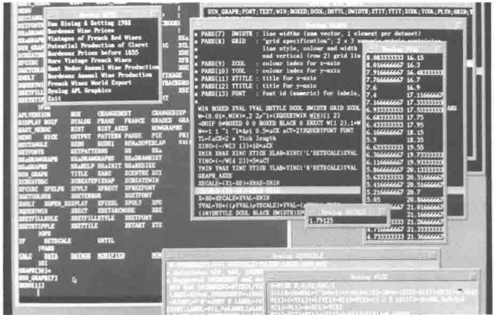
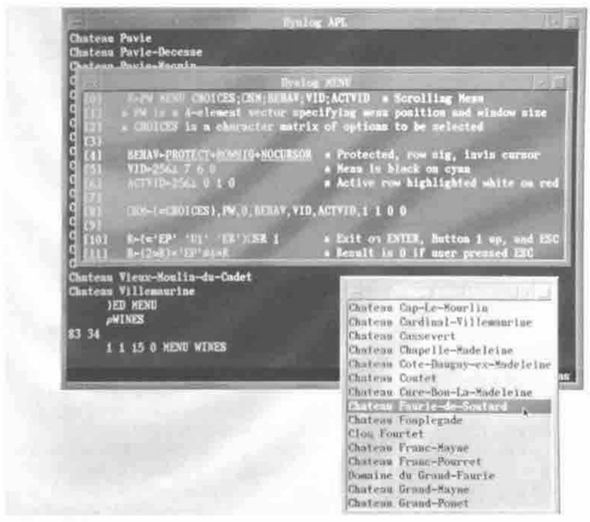
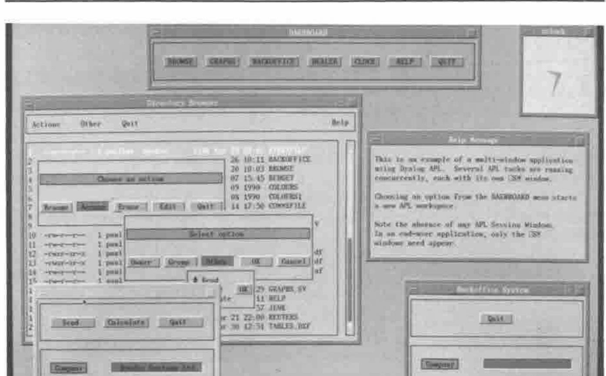
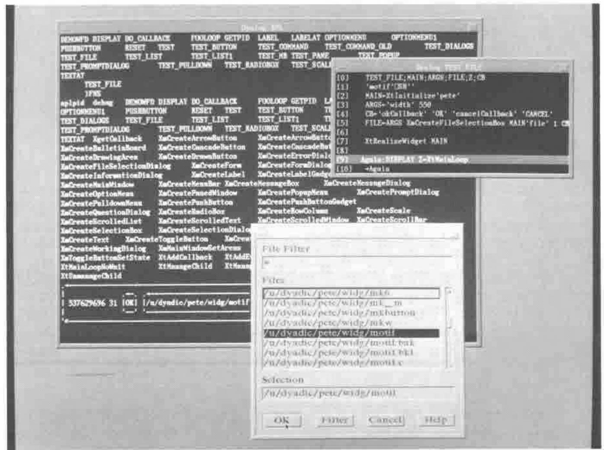
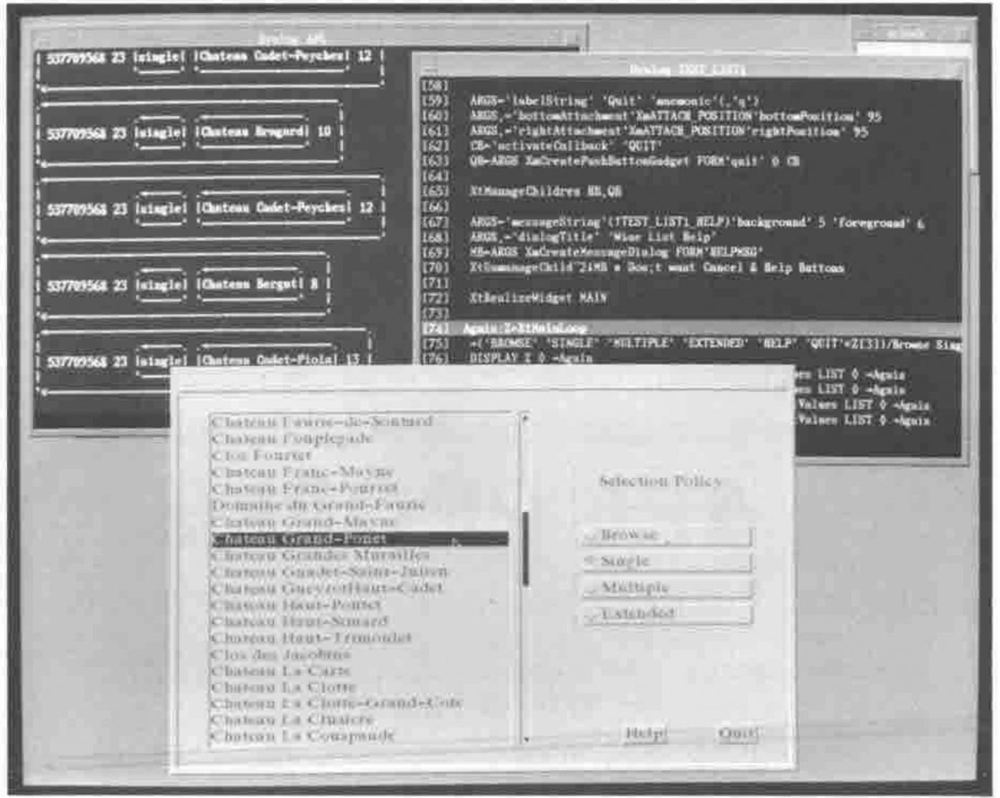

*by Peter Donnelly*
{ .byline }

This article describes how Dyalog APL takes advantage of the facilities of the X Window System, and discusses plans for exploiting Motif and Windows 3.0.

## First Some History

Dyalog APL Version 1.0 was launched at APL83 in Washington and has subsequently been ported to over 50 different Unix-based computer systems. In those days most Unix systems were accessed using black-and-white "glass teletype" screens connected by 9600 baud (or slower) RS232 lines. These devices imposed severe limitations on the type of user-interface that could be provided, although even in those days Dyalog APL sported a full-screen Session Manager and an "AP124-like" Screen Manager.

Towards the end of 1987, Dyadic decided to break away from the restrictions imposed by RS232 lines. We decided to assume that the user had a bit-mapped colour display with near-instantaneous screen update and, ultimately, some kind of a window manager. Effectively we decided to design for the "workstation".

## A New Screen Manager

The first result of this new strategy was `⎕SM` which was first demonstrated at APL-ication in September 1988. This was (and arguably still is) a radical approach to the age-old problem of providing a way of driving the user-interface that is both effective AND fits in well with the APL language.

So what makes `⎕SM` (and its companion system function `⎕SR`) so different? Firstly, `⎕SM` uses a nested array to represent the screen. In one fell swoop, the difficulty of specifying how you put a string of text and/or a number at a specific position on the screen was resolved, i.e.

```apl
⎕SM←1 3⍴'Hello World' 10 20   ⍝ "Hello World" at row 10, col 20.
⎕SM←⎕SM,[1]42 10 40           ⍝ & the number 42 at row 10, col 40.

   DISPLAY ⎕SM
.→--------------------.
↓ .→----------.       |
| |Hello World| 10 20 |
| '-----------'       |
|                     |
| 42            10 40 |
|                     |
'∊--------------------'
```

Secondly, the effect of localising `⎕SM` is to stick a piece of perspex onto the current screen definition (you can see it, but you can’t touch it) and then paint the new screen definition on top. When you exit from a function in which `⎕SM` is localised, the perspex and whatever was stuck on it are discarded, and the screen automatically reverts to its previous appearance. This makes the provision of pop-up help, pop-up menus and pop-up dialog boxes a totally trivial task.

A third important feature is that `⎕SM` handles most if not all of the first level of user-interaction automatically. For example, both horizontal and vertical scrolling within a simple field AND scrolling of related fields is done internally. Data conversion and formatting of numbers and dates is also performed by `⎕SM` and `⎕SR`, so that the APL programmer can concentrate on the application and not on the housekeeping.

Finally, (and this is not immediately obvious) `⎕SM` and `⎕SR` encourage an "event-driven" approach to writing applications. Essentially, what you do is to assign a whole collection of user-interface components (text entry fields, buttons, menus, etc.) to `⎕SM`, then "give" it all to the user to do what he wants and in whatever order he considers appropriate. You control things by defining certain field behaviours in advance which subsequently trigger "events" causing `⎕SR` to terminate. After identifying and then processing the particular event, you go back into `⎕SR` (which is effectively re-entrant) and carry on.

```apl
 ...
 Z←⍬
Loop:
 Z←('EP' 'F1')((6⌊⍴Z)↑Z) ⎕SR FIELDS
 →(Z[4]∊¨'F1' 'EP')/Help Exit
 →((Z[1]=WFDsopt)∧Z[5]EVENT MODIFIED)/Ship
 →((Z[1]=WFDctype)∧Z[5]EVENT ENTER)/Ctype
 →((Z[1]=WFDprod)∧Z[5]EVENT ENTER)/Getprod
 →((Z[1]=WFDdate)∧Z[5]EVENT BADFIELD)/BadDate
 →((Z[1]=WFDdate)∧Z[5]EVENT EXIT)/GoodDate
⍝
⍝------------------------------------------------- Bad Date
BadDate:
 ⎕SM[WFDmsg;1]←⊂78↑'Invalid date' ⋄ Z←(2↑Z),1 ⋄ →Loop
⍝------------------------------------------------- Help
Help:
 4 5 16 0 HELP1 WFDHELP ⋄ →Loop
⍝---------------------------------------- Let user select customer type
Ctype:
⍝  CTYPE displays a menu of customer types and returns user's choice.
⍝  Note that the behaviour of this field is reset so that menu only
⍝  appears on the first visit.
 ⎕SM[WFDctype;1 7]←(⊂CTYPE),0 ⋄ →Loop
 ...
```

*Figure 1 : The ⎕SR ‘event loop’*
{ .caption }

Figure 1 illustrates a "snippet" of code taken from the *DEMOWFD* function in the `⎕SM` demonstration workspace *SMDEMO*, which is included with all versions of Dyalog APL. Note that if the user enters an invalid date, `⎕SR` terminates with a BADFIELD event. This event is processed by displaying a suitable error message, then `⎕SR` is called again. The value Z in the left argument, which was returned when `⎕SR` terminated, contains the current screen context (field, cursor position, keystroke) and ensures that the interaction with the user is restarted where it left off. Similarly, when the cursor enters the WFDctype field, `⎕SR` exits with an ENTER event. This is processed by displaying a pop-up menu (done by the function `CTYPE`) for the user to choose an option, then continuing once again.

This process is remarkably similar to the "event loop" used by X Window Toolkits like Motif and OPEN LOOK, and the "message loop" used by Microsoft Windows 3.0, but more of this later …

## Using Windows for the Developer

Let us leave the discussion of `⎕SM` and move on to describe how Dyalog APL uses "windows" to improve the APL programmer’s lot.

In 1988, Dyadic began the development of Dyalog APL for DOS/386 using the Phar Lap 386 DOS|extender that had just become commercially available. At about that time, I happened to be invited along to a Microsoft seminar on OS/2. I don’t remember much of what was said about OS/2, but I was forcibly struck by the powerful development tools provided by Quick-C and (horror of horrors) BASIC. They were, I realised, INFINITELY superior to those provided by any current implementation of APL. Although several colleagues in Dyadic had been pointing this fact out for some time, I for one only really got the message when I saw how much easier it was to debug a program in BASIC than in APL! That did it - the Dyalog APL Development Environment (codenamed "JADE") was born.

The first implementation of "JADE" (*Just Another Development Environment*) appeared in Dyalog APL for DOS/386, but it has since been ported to other versions and is even available on ASCII terminals. In simple terms, you have three types of windows. First there is the Session Window in which you enter APL expressions and in which results are displayed. Secondly, you may have one or more Edit Windows in which you can view and/or edit functions and variables. The key thing here is that you can freely switch from one Edit Window to another, and to and from the Session. You can edit all of your functions at the same time, use "Cut-and-Paste" to move lines of code between them, try out expressions in the Session then copy them into functions, and generally have a field day. The great thing is that everything is visible (or at worst only partially obscured) at the same time.

The third type of window is used by the Tracer. This is invoked by typing an expression and pressing the TRACE key (usually mapped to Ctrl-Enter). When you trace a defined function or operator, it appears in a pop-up window on the screen and the next line to be executed is highlighted. If you press Enter, the line is executed and you stop at the next one. If you press TRACE, the execution of any defined functions in the line is also traced, with the functions popping up in their own windows as they run. At any point, the APL execution stack is reflected by a stack of overlapping windows on the screen. Debugging is further enhanced by the ability to display variables in Edit Windows and watch them change as you step through the code.

JADE was implemented for DOS in character mode, using line-drawing characters to draw borders around the Edit and Trace windows. Facilities to move and resize the windows were built into the APL interpreter. However, it was designed with a Graphical window manager (which would handle all the moving, resizing, etc. itself) in mind.

## First Pick Your Window System …

Early in 1990 Dyadic began the development of Dyalog APL/X for the X Window System. We would have preferred to have started sooner, but previously X had appeared to be only one of the many windowing systems available for Unix. The market leader, Sun Microsystems, had its own product called SunWindows which it was trying to promote as an industry standard. Apollo and Hewlett Packard also had their own proprietary window systems. All of these products had completely different programming interfaces, and the task of supporting them all was clearly out of the question. We had to pick the one that would become the most widely adopted. When the Open Software Foundation (IBM, DEC, HP, etc.) adopted X and when Sun announced that they would support it on the new SPARCstation, Dyadic took the plunge and started work on X.

I don’t want to spend too much time describing the intricacies of the X Window System, but there is one very important point that I need to emphasise. X is not a window manager that imposes a particular user interface style. On the contrary, X provides mechanisms to support many quite different interface styles. Unlike Macintosh or Microsoft Windows, X does not have a specific "look and feel". X does not provide user interface components such as button boxes, scroll-bars, menus or dialog boxes. However, window managers built using X (such as OSF Motif and Sun’s OPEN LOOK) do impose a specific user interface style and do provide the "widgets" with which (thanks to Microsoft’s pricing policy) we are now all becoming so familiar.

Although we felt reasonably secure in choosing X, it was not at all clear at the beginning of 1990 which window manager would emerge as the Unix standard. Battle lines between the Open Software Foundation (Motif) and the System V camp lead by Sun and AT&T (OPEN LOOK) had only just been drawn. For this reason we decided to concentrate first on porting JADE to X, and to postpone major extensions to `⎕SM` until one or other window manager emerged as the standard. Several people have commented on the fact that Dyalog APL/X does more for the programmer than it does for the user. This is a temporary thing and is part of our evolutionary plan for the product. We couldn’t extend `⎕SM` without plumping for one or other window manager, otherwise the end result would lack the consistent "look and feel" that is considered essential in end-user applications. This is much less of a problem for the developer, for whom power and speed are far more important. In 1991 it is now reasonably clear that Motif is emerging as the Unix standard. Had we chosen OPEN LOOK (which was the leading contender early in 1990) we would have got it badly wrong!

## JADE Under X

In Dyalog APL/X, the Session and each of the Edit and Trace Windows are all separately managed "top-level" windows under the control of whichever window manager is in operation. In Microsoft Windows 3.0 terms, all the windows are OVERLAPPING in style. The appearance of the window borders and of the controls used to manipulate them differs from one window manager to another. However, the appearance of the window contents and the behaviour of the mouse and keyboard within the windows are consistent across all the machines we support. (OK, I lied, but if all systems had the same keyboard it would be true!)

At this point I must digress to discuss "Keyboard Focus"…

Most if not all of the Unix window managers support two different so-called "keyboard focus policies". This refers to the mechanism by which the user tells the system which window he/she wants to talk to. Microsoft Windows only supports (imposes) the "explicit-focus" model which requires the user to click on a window first. Motif and OPEN LOOK allow the user to choose between this method and the "pointer-focus" model, in which the window which contains the sprite (the cursor associated with the mouse) has the focus. Dyalog APL/X necessarily supports both, but I will assume the use of the "pointer-focus" model (because I prefer it) from now on. So back to telling you how it all works …

As in most other applications with a Graphical User Interface, you have two cursors. One is the cursor associated with the mouse, to which I will refer as the sprite. The other is the text input cursor which indicates the position at which the next character you type will be displayed. This I will call the cursor. Actually, you have several cursors, one for each window, but only the cursor in the window which has the focus is visible.

So suppose that you have just started Dyalog APL/X. On your screen you will see a single window entitled "Dyalog Session" in which appears the customary banner, "clear ws" message and 6-space prompt. There are no scroll bars and no menus; not because such things are undesirable, but because Dyalog APL/X is written for X and not (yet) for one of the window managers that sit on top of X. At this stage, you can if you wish put the mouse away in your pocket (thus ensuring that the sprite remains stationary in the Session Window) and proceed as before. Users of Dyalog APL for DOS/386 who move to the IBM RS/6000 will even find the keyboard layout familiar. Sun, HP and DEC keyboards are (sadly) somewhat different. However we have been given a mouse to play with, so let’s use it!

## Using the Mouse

The first thing that you will find is that you can position the cursor (the text cursor) by moving the mouse and clicking the left button. This behaviour is consistent in all Dyalog APL/X windows, and is also supported by `⎕SR`. Double-clicking the left button over any APL name opens an Edit Window for that object (the first click positions the cursor, the second says "edit it"). When an Edit Window is opened, the sprite is automatically moved to the centre of the Edit Window and the cursor positioned in the first line. If you point and double-click on another name in the Edit Window (or indeed in the Session), a second Edit Window will appear with the cursor and sprite positioned within it ready for action. The policy of moving the sprite automatically, when it is fairly obvious what the user wants, is used throughout. For example, if you press the Search key, the sprite and cursor jump automatically into the "Search String" field ready to accept your input. This approach has been found to minimise the amount of cursing that so often emanates from a GUI user whose keyboard is not talking to the window he/she thinks it is!!!

Clicking the middle mouse button performs the EXECUTE command which is normally the function of the Enter key. If, for example, you want to execute a line further up in the Session, you just point at it, click the Left Button (to position the cursor) and then click the Middle Button to run it. Double-clicking the Middle Button performs the TRACE command. This means that when you are debugging a function, you can with a single button, control which lines are traced and which are simply executed. Furthermore, if at any time you want to see the value of a variable, just double-click the Left Button on its name and up it pops in an Edit Window.

Figure 2 shows a photograph taken of the Dyalog APL/X development environment in action.



*Figure 2: Photograph of APL development environment*
{ .caption }

The right button is used for "tagging", which highlights a block of text for a subsequent COPY, MOVE or DELETE. Pressing it down starts a "tag" and highlights the current line. Dragging the mouse with the Right Button held down extends the "tag" to lines above or below as required. Releasing the button ends the "tag" leaving the block highlighted. Double-clicking the right button clears (untags) the currently selected block.

Additional commands can be mapped to the mouse buttons used in conjunction with the Shift, Ctrl and Alt keys. For example, Shift+Left Button can mean HOME. These mappings can be changed by the user.

## Extending the Screen Manager for X

As I pointed out earlier, the task of extending the Dyalog APL user interface tools (`⎕SM`/`⎕SR`) to conform with a full-blooded window manager with scroll bars, menus, dialog boxes, and so forth, requires first that we select which window manager we will support. Until one or other of them emerged as a standard, Dyadic was unwilling to gamble on making this choice, and to have attempted several would have taken too long. Nevertheless, the current release of Dyalog APL/X (Version 6.1) contains several important extensions to `⎕SM`/`⎕SR` to make it possible to simulate the "look-and-feel" of your choice.

The first point is that `⎕SM` has its own separate window on the display. This accelerates the process of developing and debugging the user-interface because you can type in one window and see the results in another. The initial size of the `⎕SM` window and the character string displayed in its title bar are configurable. The Session Window is displayed only if required, so that in a "closed" application the user would only see your `⎕SM` screen configured as you require it.

If the user resizes the `⎕SM` window, a `RESIZE` error (event code 1007) is generated after the execution of the current line and before the next. If the resize occurs during a call to `⎕SR`, it terminates gracefully and returns a result; so the application can resume where it was interrupted after the resize has been handled. Generally, an APL program should set `⎕TRAP` to catch resize events and re-format the display according to the newly selected geometry.

`⎕SR` has been extended to accept button presses and releases as exit keys. This means that you can specify that `⎕SR` terminates and returns a result in response to a button event. This makes it very easy to program pop-up and pull-down menus. The photograph shown in Figure 3 shows such a menu function being traced, together with the resulting `⎕SM` display. Note that `MENU[10]` specifies ‘D1’ (the code for pressing [D]own button 1) as an exit key along with ‘ER’ (enter) and ‘EP’ (escape).

Another extension to `⎕SM`/`⎕SR` is that a new BUTTON behaviour type has been added. A field with BUTTON behaviour may only be selected by pointing at it with the sprite and clicking a button. A BUTTON field cannot otherwise accept user input, and the cursor cannot be positioned within it. When `⎕SR` exits it returns information about the field addressed by the cursor and about the BUTTON field that was selected. An example of where this is useful is the provision of context-sensitive help.



*Figure 3: Photograph of the MENU function*
{ .caption }

## Multi-window Applications

Many Dyalog APL/X users have asked us to support multiple instances of the `⎕SM` window, and this will be provided for in a future release as described later on in this article. In the meantime it is perfectly possible to provide a multi-window front-end by running several Dyalog APL tasks concurrently, with separate `⎕SM` windows attached to each workspace. There are in fact certain advantages to this approach because each workspace deals only with a particular aspect of an application and can perhaps be re-used in another - object-oriented programming, perhaps?

The key feature of a multi-window application is that the user can interact with several windows at the same time. In a true multi-tasking environment like Unix, this is very simple because the Operating System does it for you. All that is required is to provide a way of communicating between the separate tasks.

The photograph illustrated in Figure 4 shows such an application. It consists of five separate APL tasks, each with its own `⎕SM` window. At the top of the screen is positioned the DASHBOARD, which controls the application as a whole. Clicking on any of its buttons simply starts another APL task which )LOADs the appropriate workspace.



*Figure 4: Photograph of DASHBOARD multi-window application*
{ .caption }

The DEALER and BACKOFFICE workspaces communicate with one another using an External Variable. This is a unique feature of Dyalog APL whereby a disk file can be associated with a variable in a workspace. When the variable changes, the associated file is automatically updated with the new value(s). When the variable is referenced, the file is read. As it is a file, the data can be shared between different users, or in this case, by different APL tasks run by the same user. Note that to avoid the cost of continually polling for a new value, the DEALER workspace notifies the BACKOFFICE workspace when something has changed by sending it a Unix signal.

BACKOFFICE sits in `⎕DL` or `⎕SR` using few, if any, cpu cycles. When a signal is sent by DEALER, it interrupts the `⎕DL` or `⎕SR` and causes BACKOFFICE to spring into action. The new data is obtained by referencing the External Variable. After processing, BACKOFFICE goes back into its wait state pending the next interrupt.

This method of communication proves to be very fast, because small, frequently used files tend to be permanently cached in main memory by Unix. What the photograph may fail to convey is that the various boxes and buttons displayed by `⎕SM` have the same 3-D appearance as Motif and Windows 3.0. This is achieved by drawing the top and left sides of the box in a light colour, and the bottom and right sides in a dark colour. The lines used to draw the boxes also employ specially designed characters which are part of a new font supplied with Dyalog APL/X Version 6.1.

## A Motif Interface

Dyadic now believes that OSF Motif is emerging as the accepted standard window manager for Unix systems. OPEN LOOK may offer certain technical benefits, and is thought by many to have superior user-interface features. Nevertheless, Motif’s strong resemblance to Presentation Manager and to Windows 3.0 makes it the likely winner.

To investigate the possibilities of an interface to Motif we have developed an Auxiliary Processor (AP). This is a separate program written in C that communicates with the APL interpreter through Unix pipes. You start an AP with dyadic `⎕SH`. The left argument is the name of the C-program, the right argument is an optional vector of vectors containing start-up parameters.

```apl
'motif' ⎕SH '' ⍝ Start the motif AP
```

The effect, which is analogous to )COPY, is to define one or more External Functions in your workspace. These have the same syntax and behaviour as regular defined functions, but are effectively entry points into compiled sub-routines in the AP. At the time of writing, the motif AP defines over 60 External Functions; one Function for each of the Motif widget set, plus several other utilities.

Before looking at how the APL→Motif interface might work, it is useful to discuss Motif concepts and examine how Motif is driven from C, the language for which it was designed. Motif consists of four components; a widget set, a window manager, a style guide (somewhat like IBM’s CUA) and a user interface description language (UIL). For the purposes of this article we are concerned only with the Motif widget set.

## Programming with Widgets

So what is a "widget"? Well, the text books say that a widget is a complex data structure that combines an X window with a set of procedures that perform actions on that window. Widgets are implemented using object oriented principles such as "a class hierarchy", "encapsulation" and "inheritance". For example, the PushButton widget is a sub-class of the Label widget and inherits many of its characteristics and behaviour as well as adding those of its own. The bad news is that you really have to understand all this clever stuff to be able to use widgets effectively, if only because all the documentation is written in object-oriented terms. The good news is that Motif works in roughly the same way as Windows 3.0, so that once you’ve learnt one system it is easy to understand the other. The basic process, which I have simplified considerably for the sake of brevity, is as follows:

1. Initialise the X Toolkit
2. Create your widgets and set their resources.
3. Register callbacks.
4. Realise the widget tree.
5. Enter the event loop.

### Initialisation

Before you start, you must initialise the X Toolkit on which Motif is based. Among other things you must register the name and class of your application, as these are required by the X resource manager. Initialisation is performed by the C function `XtInitialize` which creates and returns a handle for a top-level "shell" widget.

### Creating the Widget Tree

Widgets are constructed in a hierarchical tree, with the shell widget (created by `XtInitialize`) at the top. Every widget, except the shell widget, has a "parent" which "manages" it. To create a widget of a particular type or class, you can call the appropriate `XmCreate…` C routine specifying its name, its parent, and a set of "resources".

### Setting Widget Resources

The term "resource" means a piece of data associated with or used by a widget. Resources are specified as {name, value} pairs. For example, to specify that you want your PushButton widget to display the text ‘OK’, you specify that the resource called "labelString" has the value "OK". In C you set up a resource list as an array of {name, value} pairs, where the value is either a number or a pointer to another data structure, such as a character string. This list is supplied as a parameter to the appropriate `XmCreate…`. You can also modify and query the value of resources after the widget has been created.

### Callbacks

Most (although not all) widgets support one or more types of "callback". A callback is a particular action or event that can occur in the widget. The idea is that you can associate a list of functions with a callback. Then, whenever the particular action or event occurs, the functions are executed for you. For example, the PushButton widget supports three callback lists, namely `armCallback`, `activateCallback`, and `disarmCallback`. When the user presses a mouse button inside a PushButton widget, the functions on the `armCallback` list are executed. If the user releases a mouse button while the sprite is contained within the PushButton widget the functions on the `activateCallback` list are executed, followed by the functions on the `disarmCallback` list. If the user moves the sprite out of the PushButton widget before releasing the button, only the functions on the `disarmCallback` list are invoked. Callbacks provide the principle mechanism for your application to respond to user input. In C a callback is registered using the `XtAddCallback` routine, specifying the widget id, the callback type, the function to be added to the callback list, and (optionally) some data to pass to it when it is executed.

### Realising the Widget Tree

Having created all your widgets, you have to "realise" the widget tree. This step actually creates all of the X windows that are required.

### The Event Loop

This is the really interesting bit. Having initialised, created and realised your widgets, you now enter an **infinite** loop which performs just two steps over and over again.

```
GET EVENT
DISPATCH EVENT
```

This is normally performed by the C routine `XtMainLoop` which, once called, never exits. The only way your application gains control is when one of your callback functions is invoked as the result of some user action, such as a button press in a PushButton widget. It is perfectly OK for a callback function to add to or modify the widget tree in some way, so that an application is not entirely "static" in nature. But how does my program ever terminate?, I hear you cry. The answer is that a callback function has to an explicit exit(0) itself (like a naked → in APL). This is the only way out!!!

Incidentally, the equivalent loop in Windows 3.0 is …

```
GET MESSAGE
DISPATCH MESSAGE
```

## A PushButton Example

Figure 5 shows the listing of a C program. The program displays a PushButton widget which is 250 pixels wide by 150 high. It contains the legend "Press Here". If the user positions the sprite within the PushButton widget and presses a mouse button, the program prints the message "Button Pressed". If the user now releases the button, it prints "Button Released". Simple eh!

```c
/************ C Program to Display a PushButton Widget **********/
#include <Xm/Xm.h>
#include <Xm/PushBG.h>

void main();
void armCB();           /* Callback for the Pushbutton */
void activateCB();      /* Callback for the Pushbutton */
char *btn_text;         /* button label */

void main (argc, argv)
int argc;
char **argv;
{
     Widget toplevel;      /* Shell widget        */
     Widget button;        /* Pushbutton widget   */
     Arg args[10];         /* arg list            */
     int n;                /* arg count           */

/* Initialize toolkit */
     toplevel = XtInitialize (argv[0], "Example", NULL, NULL,
                              &argc, argv);

/* Create compoundstring for the button text */
     btn_text = XmStringCreateLtoR("Press Here",
                    XmSTRING_DEFAULT_CHARSET);

/* Set up arglist for Pushbutton widget */
     n=0;
     XtSetArg(args[n], XmNlabelType, XmSTRING); n++;
     XtSetArg(args[n], XmNlabelString, btn_text); n++;
     XtSetArg(args[n], XmNwidth, 250); n++;
     XtSetArg(args[n], XmNheight, 150); n++;

/* Create Pushbutton widget */
     button = XmCreatePushButton(toplevel, "button", args, n);

/* Manage Pushbutton Widget */
     XtManageChild(button);

/* Addcallbacks */
     XtAddCallback(button, XmNarmCallback, armCB,
                   "Button Pressed");
     XtAddCallback(button, XmNactivateCallback, activateCB,
                   "Button Released");

/* Realise Widget tree and give to user*/
     XtRealizeWidget(toplevel);
     XtMainLoop();
 }

/*********** Callbacks for the Pushbutton **********************/

void armCB (w, client_data, call_data)
Widget w;                  /* widget id              */
caddr_t client_data;       /* data from application  */
caddr_t call_data;         /* data from widget class */
{
     XmAnyCallbackStruct *cb = (XmAnyCallbackStruct *)call_data;
     printf ("Callback reason = %d\n", cb->reason);
     printf ("Application data = %s\n", client_data);
}

void activateCB (w, client_data, call_data)
Widget w;                  /* widget id              */
caddr_t client_data;       /* data from application  */
caddr_t call_data;         /* data from widget class */

{
     XmAnyCallbackStruct *cb = (XmAnyCallbackStruct *)call_data;
     printf ("Callback reason = %d\n", cb->reason);
     printf ("Application data= %s\n", client_data);

     XtFree(btn_text); /* Free button label */
     exit(0);          /* and TERMINATE     */
}
```

*Figure 5: PushButton example in C*
{ .caption }

Figure 6 shows an equivalent Dyalog APL function which does exactly the same thing. It is probably more profitable to discuss the APL code …

Line[1] starts the `motif` Auxiliary Processor which defines all the External Functions we need to drive Motif. Line [2] initialises the X Toolkit.

```apl
    ∇ BUTTON;TOP;BTN;ARGS;MSG;CB         ⍝ PushButton Example
[1]   'motif'⎕SH''                       ⍝ Start motif AP
[2]   TOP←XtInitialize 'Example'         ⍝ Initialise X Toolkit
[3]
[4]   ARGS←'labelType' 2                 ⍝ Define resources
[5]   ARGS←args,'labelString' 'Press Here'
[6]   ARGS←args,'width' 250 'height' 150
[7]
[8]   CB←'armCallback' 'Button Pressed'         ⍝ Define callbacks
[9]   CB←CB,'activateCallback' 'Button Released'
[10]
[11]  BTN←ARGS XmCreatePushButton TOP'btn' 1 CB ⍝ Create widget
[12]
[13]  XtRealizeWidget TOP                ⍝ Realise widget tree
[14]
[15] Again:MSG←XtMainLoop                ⍝ Enter event loop
[16] DISPLAY MSG                         ⍝ Print message
[17] →(MSG[3]≢⊂'Button Released'/Again   ⍝ Continue ...
[18] RESET                               ⍝ Close motif AP, exit
    ∇
```

*Figure 6: PushButton Example in APL*
{ .caption }

Lines[4 5 6] set up resources as a nested vector containing {name, value} pairs. Note that the "labelType" resource can take the value 1 (the label is a pixmap) or 2 (the label is a character string). A C programmer is expected to use global names which are defined in X header files (XmSTRING ←→ 2). Similarly, a C programmer does not specify the name of a resource as a string constant (e.g. "labelString") but uses a global name (`XmNlabelString`) instead. This extra level of indirection could also be employed in APL.

Lines [8 9] define callbacks. The "obvious" way to implement callbacks might have been to have the AP execute APL functions when a particular action occurs. We have (at this
 stage) decided not to do this, but to have a single general-purpose callback routine in the AP which sends back a message consisting of a nested vector made up as follows:

> {Widget ID} {callback reason} {client_data} {call_data_1}…{call_data_n}

where {client_data} is an APL array associated with the specific widget and callback type when the widget was created, and {call_data} is data supplied dynamically by the widget itself where appropriate. This type of interface is easier to implement and more consistent with Windows 3.0.

In this example we are asking the AP to send back ‘Button Pressed’ when an `armCallback` occurs, and ‘Button Released’ when an `activateCallback` occurs.

Line 11 creates the widget using the External Function `XmCreatePushButton`. The result `BTN` is the widget id.

All of the functions to create widgets have the same syntax. The left argument is optional and defines the resources to be set as a nested vector of {name, value} pairs. The right argument is a nested vector containing 2-4 elements:

| | |
|---|---|
| Parent widget id | integer |
| Name | character vector |
| Managed flag | 1 = manage, 0 = don’t manage (optional, default 0) |
| Callbacks | vector of {name, array} pairs (optional) |

The "Managed Flag" determines whether or not the widget is to be managed immediately or not. If not, you must subsequently manage it explicitly using the `XtManageChild` External Function. An example where you would want to do this is a dialog box which you want to pop up (manage) and down (un-manage) dynamically.

If no callbacks are specified, a useful default which is appropriate for the widget in question is assumed. For example, the default callback for the PushButton widget is `'activateCallback' ''`. By default, you will therefore be notified when the PushButton is clicked.

Line 13 realises the widget tree. It takes only the id of the top-level widget as its argument.

Line 15 implements the Motif event loop. This bit is rather tricky to understand, let alone explain, but is best thought of in terms of the Windows 3.0 message loop instead. Effectively, whenever one of the callbacks is fired, the External Function `XtMainloop` returns a message in the format described above. Note that there must be *at least one* callback defined, or we would never get back from `XtMainLoop`.

Line 16 displays the message, and line 17 branches back into `XtMainLoop` unless we have received ‘Button Released’. Don’t even think about how the AP sorts this out (the one thing you cannot do is start the event loop again), just accept that it all works! The `RESET` function on line 18 closes the AP by `⎕EX`ing all its External Functions.

## File Selection Box Example

The PushButton widget is a very simple type of widget. An example of a far more complex widget is the `FileSelectionBox`, which is a so-called "composite" widget. It is however just as easy to drive from Dyalog APL. Figure 7 contains a screen photograph showing the `TEST_FILE` function being traced.

The `FileSelectionBox` widget allows the user to enter a file name. The user can type the name in or, using a selection mask, choose from a list of files using the mouse. In this simple example, we have defined two callbacks, `okCallback` which is actioned when the user clicks the "OK" button, and `cancelCallback` which is actioned by the "CANCEL" button. As you can see from the photograph, when the user clicks "OK" the name of the file is returned in the 4th element of the result of `XtMainLoop`. This is an example where the widget itself supplies data to the callback.



*Figure 7: Photograph of the TEST_FILE function*
{ .caption }

## Multiple Widget Example

The List widget is a general-purpose widget that lets a user choose one or more items from a list. The photograph in Figure 8 shows the function `TEST_LIST1` being traced. This function puts up a `ScrolledList` widget, and alongside it a `RadioBox` widget, for the user to choose the "selection policy". The List widgets support 4 different selection policies. You can set or change the selection policy by setting its "`selectionPolicy`" resource to one of ‘browse’, ‘single’, ‘multiple’, or ‘extended’. Note that a `RadioBox` widget allows only one of its buttons to be enabled at any one time. The example also has 2 PushButtons labelled "Quit" and "Help".

As you can see from the photo, by the time we get to realising the widget tree we are down to line[72] of the function. OK, some of the code could have been put into sub-functions, but even so it is beginning to get a trifle long-winded.



*Figure 8: Photograph of the TEST_LIST1 function*
{ .caption }

## So where do we go from here?

Dyalog APL’s "window-based" development environment has been successfully implemented under DOS/386 in character mode, but really comes into its own under X. The Windows 3.0 implementation will take it a stage further, as it will be possible to use menus, scroll-bars and so forth that are not implemented at the X level. Indeed, Dyadic intends to demonstrate this new version at APL91.

`⎕SM`/`⎕SR` currently provide a natural and powerful means to drive the user interface. With the simple extensions provided in Dyalog APL/X, it is possible today to generate multi-window applications with a similar "look and feel" to Motif.

The motif Auxiliary Processor proves to be a powerful and effective means for driving true Motif widgets from Dyalog APL. However, it has some disadvantages. Firstly, the Motif widget set is actually quite restrictive. It does not, for example, have anything to handle numbers. Secondly, once you start using a reasonable number of widgets, it begins to look a trifle cumbersome (although it still beats writing in C into a cocked hat).

We believe that the answer lies in extending `⎕SM`/`⎕SR` to encompass the Motif widget set, and of course, Windows 3.0 menus, dialog boxes, etc. This will provide the best of both worlds - a consistent interface for the end-user, and a natural and concise interface for the APL programmer. This major extension of `⎕SM`/`⎕SR` is in fact likely to appear first in the Windows 3.0 version of Dyalog APL that is being announced at APL91.

If you can get there, be sure to call in at Dyadic’s booth for a demonstration.
