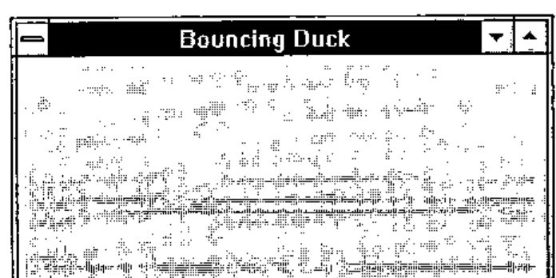
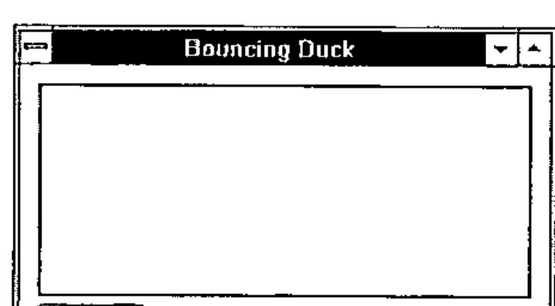
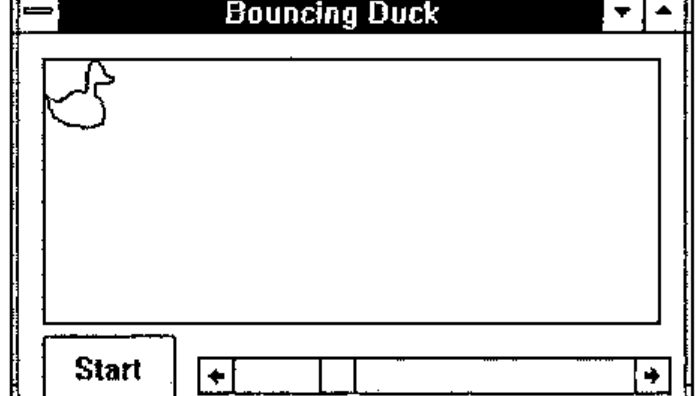
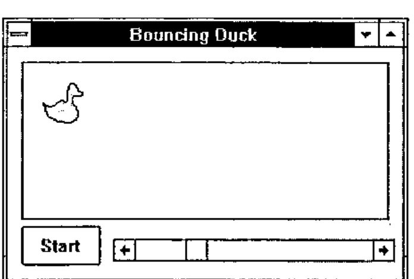
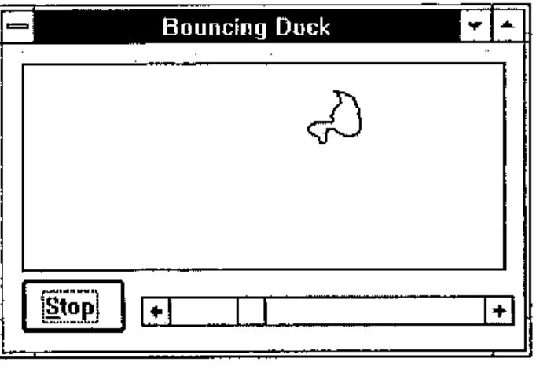
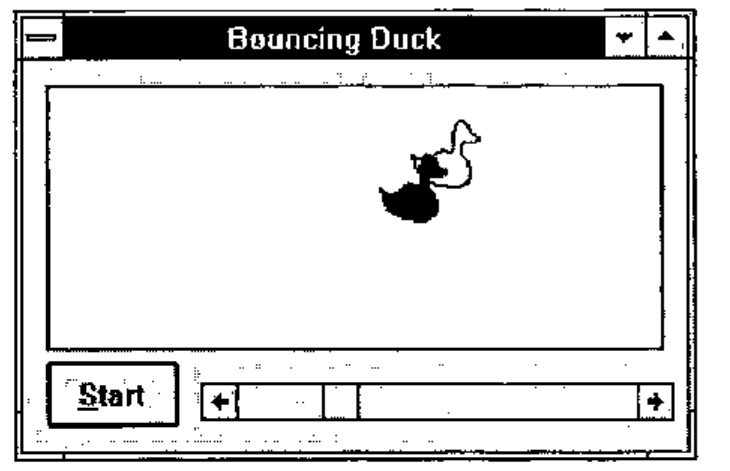
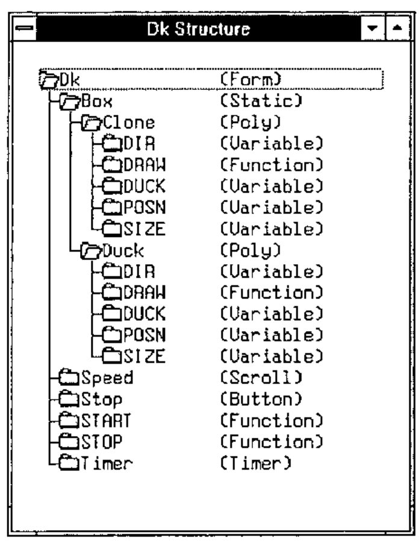
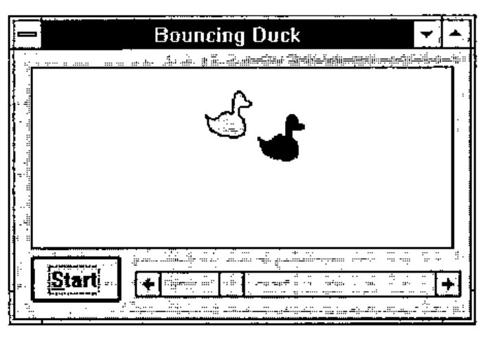

*by Peter Donnelly, Dyadic Systems Limited*
{ .byline }

## Introduction

In Dyalog APL/W Version 7, Dyadic introduced the concept of *namespaces*. A namespace is a container that may be used to store functions, variables and other objects and provides a separate execution environment which is isolated from the outer workspace and from other namespaces. In Version 7, GUI objects are themselves namespaces and may therefore *contain* any functions and variables they need for their operation. Dyalog APL/W thereby supports ***encapsulation***, an important feature of object-oriented programming. This article is effectively the script of a demonstration that explains how useful this concept is in practice. If you have a copy of Dyalog APL/W Version 7, you will be able to reproduce the entire demonstration by typing in the APL code.

## The Demonstration

First we will create a Form called *Dk*. Its Caption is `Bouncing Duck`; it has a Pixel co-ordinate system and is positioned at (300 300) with a size of (175 300):

```apl
'Dk' ⎕WC 'Form' 'Bouncing Duck' (300 300)(175 300)'Pixel'
```



Now we can step *into* the Form. The system command `)CS` means *Change Space* and is used to switch from one namespace to another. Having changed, `)CS` reports the full pathname of the new current namespace:

```apl
      )CS Dk
#.Dk
```

Now that we are *within* the Form we can create some child objects. First we need a Static window in which to draw the duck. Note that the Attach property defines how the child object reacts to its parent being resized. In this case, we want the Static to shrink/expand so that its edges remain a fixed distance from the sides of the Form.

```apl
'Box' ⎕WC 'Static' (10 10)(120 280)
'Box' ⎕WS 'Attach' ('Top' 'Left' 'Bottom' 'Right')
```

Next we will add a stop/start button called *Stop*. Its Caption (initially) will be "Start", and its Select event will fire a callback function called *START*. This time, the Attach property makes the Button fixed in size and remain a constant distance from the bottom left corner of the Form.

```apl
'Stop' ⎕WC 'Button' 'Start' (135 10)(30 60)
                    ('Event' 'Select' 'START')
'Stop' ⎕WS 'Attach' ('Bottom' 'Left' 'Bottom' 'Left')
```

Now we will add a scrollbar called *Speed* to input the speed of the duck. Note that, by specifying a height of `⍬`, you get a standard height scrollbar. The HScroll property specifies that it is a horizontal scrollbar. The Range property defines the scale. The Step property defines the amounts (small change and large change) by which it scrolls. The Thumb property specifies the position of the "thumb". The Attach property fixes the height of the scrollbar, but lets it expand and contract horizontally with the Form.

```apl
'Speed' ⎕WC 'Scroll' (145 80) (⍬ 215) ('HScroll' ¯1)
'Speed' ⎕WS ('Range' 60)('Step' 2 10)('Thumb' 15)
'Speed' ⎕WS 'Attach' ('Bottom' 'Left' 'Bottom' 'Right')
```



The last object we need is a Timer. The job of a Timer is to fire an event at regular intervals. We can animate the duck by attaching a callback function (which draws the duck) to the Timer. Our Timer will fire every 50 milliseconds, but initially it will be inactive.

```apl
'Timer' ⎕WC 'Timer' 50 ('Active' 0)
```

Whenever the Timer fires it generates a Timer event. We will attach this to a callback function called *DRAW* that resides (and runs) *within* the Duck object, which in a moment we will create as a child of the Static Box. The function is therefore referenced by its pathname (from here) which is `Box.Duck.DRAW`

```apl
'Timer' ⎕WS 'Event' 'Timer' 'Box.Duck.DRAW'
```

The next thing to do is to write the two functions needed to start and stop the animated display. Let’s first write the *START* function:

```apl
    ∇ START
[1]    'Timer'⎕WS'Active' 1     ⍝ Activate the Timer
[2]    'Stop'⎕WS('Caption' '&Stop')('Event' 'Select' 'STOP')
    ∇
```

The first line of *START* activates the Timer by setting its Active property to 1. The second line changes the Caption of the Button to "Stop" and changes the callback function to *STOP*. (Incidentally, this nicely illustrates how you can control an application dynamically by changing the callback function associated with an event "on the fly".) The *STOP* function is simply the reverse.

```apl
    ∇ STOP
[1]    'Timer'⎕WS'Active' 0     ⍝ De-activate the Timer
[2]    'Stop'⎕WS('Caption' '&Start')('Event' 'Select' 'START')
    ∇
```

*STOP* de-activates the Timer by setting its Active property to 0. Then it changes the Caption of the Button to "Start" and changes the callback function back to *START*.

![Object List [ Dk ]: #, ##, ⎕SE, Box (Static), Speed (Scroll), Stop (Button), START and STOP (Function), Timer (Timer)](art10002890/objlist1.jpg)

So what do we have now? Let’s use the Object List dialog to see what objects and functions we have defined within the *Dk* Form.

Next we need to define the co-ordinates of our Duck. First we will step *into* the Box object in which we want to draw the duck:

```apl
      )CS Box
#.Dk.Box
```

Then set up the co-ordinates in a variable called *DUCK*.

```apl
DUCK←44 2⍴0
DUCK[;1]←15 17 18 18 17 15 14 13 14 13  9  6  2  0  0  2  6  7
          7  9 10 10 10 11 12 15 17 18 22 25 28 29 30 30 30 29
         29 29 28 27 26 24 20 15
DUCK[;2]← 0  2  4  6  8 10 12 14 17 18 18 18 19 21 23 25 27 29
         30 30 28 26 24 22 22 22 24 25 26 26 25 23 21 19 17 14
         12 10  8  6  4  3  1  0
```

(Naturally, if you have the co-ordinates already set up in a variable in another workspace, you simply copy the variable in. `)COPY` brings objects into the *current namespace* as you would expect.)

Using these co-ordinates, we can now create a Poly object called *Duck*. (Note that in Dyalog APL, graphical objects are not transient things but are **true objects** that generate events and can be manipulated like Forms, Buttons and so forth.) The FStyle and FillCol properties define a solid yellow fill.

```apl
'Duck' ⎕WC 'Poly' DUCK ('FStyle' 0)('FillCol' 255 255 0)
```



The next step further illustrates the facility in Dyalog APL to *encapsulate* code and data *within* the object to which they rightfully belong. First, we will copy the variable containing the duck’s co-ordinates *into* the Duck object:

```apl
Duck.DUCK ← DUCK
```

Then erase the variable from here (*Dk.Box*):

```apl
      )ERASE DUCK
      ⍴⎕NL 2 3 4    ⍝ Nothing here now
0
```

Now we will step *into* the Duck namespace:

```apl
      )CS Duck
#.Dk.Box.Duck
      )VARS
DUCK
```

To animate the duck, we need to write the *DRAW* function that is attached to our Timer.

To simplify the code we will first define some *static* variables. A static variable is one that is global to a namespace. It is therefore visible to functions that run in that namespace, but is not visible from outside that namespace. In this case we will use static variables to remember the position (*POSN*) and direction of motion (*DIR*) of the duck between successive calls to *DRAW*.

```apl
POSN←0 0
DIR←1 1
```

Rather than computing it each time, we will also create a variable *SIZE* defining the size of the object. We need this to calculate when it hits a wall.

```apl
SIZE←(⌈⌿DUCK)-⌊⌿DUCK
```

Finally, the *DRAW* function itself:

```apl
    ∇ DRAW;WINSIZE;SPEED
[1]    WINSIZE←'##'⎕WG'SIZE'                  ⍝ Size of parent window
[2]    SPEED←(×DIR)×'##.##.Speed'⎕WG'Thumb'   ⍝ Speed from scrollbar
[3]    POSN←POSN+SPEED                        ⍝ Calculate new position
[4]    DIR←×DIR×1 ¯1[1+(POSN≤0)∨WINSIZE<POSN+SIZE] ⍝ Does it bounce ?
[5]    POSN←0⌈POSN⌊WINSIZE-SIZE               ⍝ Update position
[6]    ⎕WS'POINTS'(DUCK+(⍴DUCK)⍴POSN)         ⍝ and redraw
    ∇
```

Note that the variables and the function we have created are ***encapsulated*** within the Duck object.

```apl
      )FNS
DRAW
      )VARS
DIR     DUCK     POSN     SIZE
```

![Object List [ Dk.Box.Duck ]: #, ##, ⎕SE, DIR (Variable), DRAW (Function), DUCK, POSN and SIZE (Variable)](art10002890/objlist2.jpg)

We can test our system by running the *DRAW* function directly from here. You can see how it works using the Tracer.

```apl
      DRAW   ⍝ Trace it !
```



Now let’s switch back to the main workspace …

```apl
      )CS
#
```

… and start the system by clicking *Start*. While this is running, the session remains active. We can (for example) directly change the properties of the Duck object; for example:

```apl
'Dk.Box.Duck' ⎕WS 'FillCol' 255 0 0     ⍝ Red
'Dk.Box.Duck' ⎕WS 'FillCol' 255 255 0   ⍝ Back to yellow
```

More interestingly, we can step *into* the Duck object and do it from there:

```apl
      )CS Dk.Box.Duck
#.Dk.Box.Duck
      POSN←10 10
      DUCK←⌽DUCK
```

## Encapsulation and Inheritance

So what have we achieved? Essentially, we have produced an Object (called *Dk*) which contains within it all the sub-objects, code and data needed to perform its allotted task; in a nutshell, ***encapsulation***. Having made one object, we can clone it to make others. This introduces ***inheritance***, another important principle of object-oriented programming.



```apl
      )CS #.Dk.Box
#.Dk.Box
      'Clone' ⎕WC ⎕OR 'Duck'
```

The new object *Clone* is a complete copy of the original namespace, including the functions and variables it contains. (In practice, these are merely pointers, so they do not consume undue amounts of workspace.) Notice that the cloned duck is displayed on top of the original one because it inherits all its attributes, including its size and position.

We can move *Dk* by running the *DRAW* function:

```apl
Duck.DRAW
```

We can also identify the clone by making it red:

```apl
'Clone' ⎕WS 'FillCol' (255 0 0)
```



To animate the second object we need to create another Timer object:

```apl
      )CS ##
#.Dk
      'T2' ⎕WC 'Timer' 100 ('Event' 'Timer' 'Box.Clone.DRAW')
                         ('Active' 0)
```

In addition, we need to edit the *START* and *STOP* functions to activate and deactivate the new Timer *T2*:

```apl
∇START[1]'T2' 'Timer' ⎕WS¨⊂'Active' 1∇
∇STOP[1]'T2' 'Timer' ⎕WS¨⊂'Active' 0∇
```

The *Clone* object inherits its *DRAW* function from the original *Dk*. We can however change it to rotate the duck at random intervals:

```apl
      )CS #.Dk.Box.Clone
#.Dk.Box.Clone

      ∇DRAW[7] →(5≠?5)/0 ⋄ DUCK←⌽DUCK ∇
```

Now start it up:

```apl
      )CS
#
```

Click *Start* button.



This picture illustrates the structure of the Form (and namespace) *Dk*. It was produced using the MSOUTLIN.VBX (OUTLINE) custom control which is distributed with Visual Basic and which can be accessed directly from Dyalog APL/W Version 7.

Finally, we can save the object we have created:

```apl
      )OBJECTS
Dk
      )SAVE DUCK
```

The object can then be copied into any active workspace where it will come up ready for use exactly as it was when it was saved:

```apl
      )COPY DUCK Dk
```


