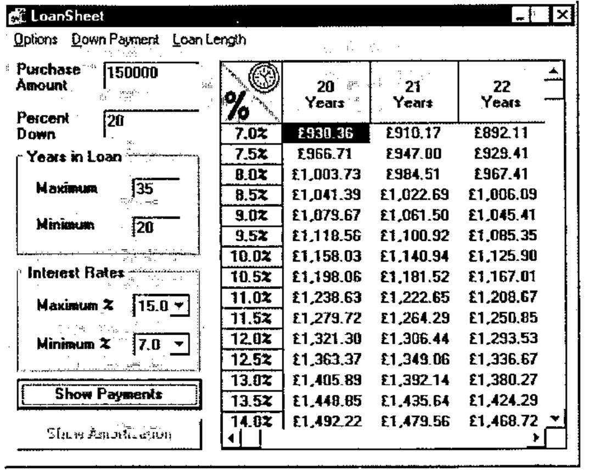
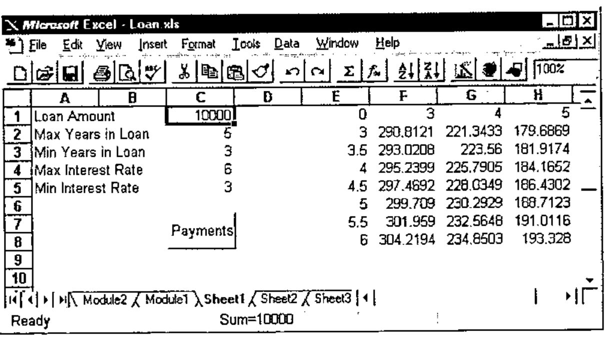
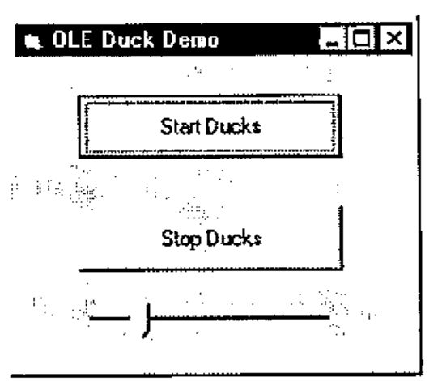
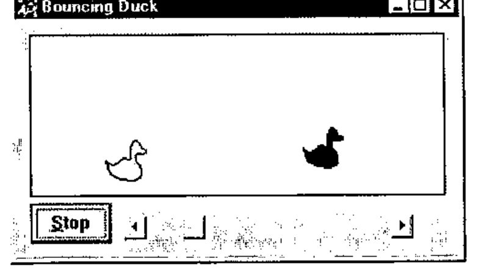

*by Peter Donnelly (Dyadic Systems Limited)*
{ .byline }

## Introduction

Dyalog APL/W Version 8.0, released in May, already includes support for OLE Controls (OCXs). This capability allows you to incorporate external GUI objects in your Dyalog APL applications just as easily as if they were built-in controls.

At the APL96 Dyadic vendor forum, Peter Donnelly announced support for *OLE Automation*: the next part of the OLE jigsaw.

OLE Automation allows you to drive one application from another and to mix code written in different programming languages. In practical terms, this means that you may write a subroutine to perform calculations in (say) C++ and use the subroutine directly in Visual Basic 4 or Excel 7. Equally, you could write the code in Visual Basic and call it from C++. Dyalog APL/W is now a member of this code-sharing club.

OLE Automation is, however, much more than just a mechanism to facilitate cross-application macros because it deals not just with subroutine calls but with *objects*. An object is a combination of code and data that can be treated as a unit. Without getting too deeply into the terminology, an object defines a *class*; when you work with an object you create one or more *instances* of that class.

## Namespaces and Objects

There is a direct correspondence between the object model and Dyalog APL namespace technology, a correspondence that is thoroughly exploited in the implementation of OLE Automation.

An OLE object is simply a collection of methods (code that performs tasks) and properties (data that affects behaviour). An object corresponds directly to a Dyalog APL namespace which contains functions that do things and variables that affect things. Furthermore, OLE objects are hierarchical in nature; objects may contain sub-objects just as namespaces may contain sub-namespaces. To complete the picture, an OLE Server is an application that provides (exposes) one or more OLE objects. Thus an OLE Server corresponds directly to a workspace that contains one or more namespaces.

However, one element of the equation was missing. When you access an OLE object, you do so by creating an *instance* of its class and you may work with several instances at the same time. Furthermore, several applications may access the same OLE object at the same time, each with its own set of instances. Each instance inherits its methods (functions) and the initial values of its properties from the class. However, different property values will soon be established in different instances so they must be maintained separately.

Dyalog APL/W Version 8.1 includes the capability for a namespace to spawn instances of itself. Initially, a new instance is simply a pointer to the original namespace (not a copy), but as soon as anything in it is changed, the new value is recorded separately. Thus instance namespaces will typically share functions but maintain separate sets of data.

## Defining a Dyalog APL OLE Server

Peter demonstrated just how easy it is to create your own OLE Server. Just 3 steps are involved.

1. Create a workspace containing at least one namespace which itself contains some functions and/or variables.
2. Tell Dyalog APL that you wish to export the namespace as an OLE object by changing its Type to OLEServer. You do this by executing `⎕WC` *inside* the namespace.
3. `)Save` the workspace. At this point, Dyalog APL automatically updates the Windows registry and type libraries with all of the information needed to make your objects accessible by OLE.

## Example of a Dyalog APL OLE Server

As an example, Peter loaded a workspace called LOANOA. This contained a single namespace called *Loan* which is used to calculate monthly repayments on a loan. Within *Loan* there was a single function *CalcPayments* and a variable *PeriodType*. The *CalcPayments* function takes a 5-element numeric vector as an argument whose elements specify:

1. loan amount
2. maximum number of periods for repayment
3. minimum number of periods for repayment
4. maximum annual interest rate
5. minimum annual interest rate

*CalcPayments* also uses the "global" variable *PeriodType* which specifies whether the periods (above) are years or months. This is done solely to illustrate how another application can manipulate an APL object via its variables (properties) as well as by calling its functions (methods).

*CalcPayments* returns a matrix. The first row contains the period numbers (from min to max). The first column contains the interest rates (from min to max in steps of 0.5%). Other elements contain the monthly repayments for the corresponding number of periods and interest rates. The transcript of the APL session and a listing of *CalcPayments* is given below.

```apl
Dyalog APL/W Version 8.1
Serial No : 000043 / Pentium
Wed Aug  7 10:58:44 1996
clear ws
      )LOAD DEMO\LOANOA
DEMO\LOANOA saved Wed Jul 31 13:25:02 1996
      )OBS
Loan
      )CS Loan
#.Loan
      )FNS
CalcPayments
      )VARS
PeriodType

      CalcPayments 10000 5 3 6 3
0     3           4           5
3     290.8120963 221.3432699 179.6869066
3.5   293.0207973 223.5600105 181.9174497
4     295.2398501 225.7905464 184.1652206
4.5   297.4692448 228.0348608 186.4301924
5     299.708971  230.2929357 188.7123364
5.5   301.959018  232.5647523 191.0116217
6     304.2193745 234.8502905 193.3280153
      )CS
#
      Loan.⎕WC 'OLEServer'
      )SAVE
DEMO\LOANOA saved Wed Aug  7 11:00:58 1996

[0]   PAYMENTS←CalcPayments X;LoanAmt;LenMin;LenMax;IntrMin;IntrMax;
      PERIODS;INTEREST;NI;NM;PER;INT
[1]    ⍝ Calculates loan repayments
[2]    ⍝ Argument X specifies:
[3]         ⍝   LoanAmt      Loan amount
[4]         ⍝   LenMax       Maximum loan period
[5]         ⍝   LenMin       Minimum loan period
[6]         ⍝   IntrMax      Maximum interest rate
[7]         ⍝   IntrMin      Minimum interest rate
[8]    ⍝ Also uses the following global variable (for illustration)
[9]         ⍝   PeriodType   Type of period;1 = years, 2 = months
[10]
[11]  LoanAmt LenMax LenMin IntrMax IntrMin←X
[12]
[13]  PER←PERIODS←¯1+LenMin+⍳1+LenMax-LenMin
[14]  PERIODS←PERIODS×12 1[PeriodType]
[15]  INT←INTEREST←0.5ׯ1+(2×IntrMin)+⍳1+2×IntrMax-IntrMin
[16]  INTEREST←INTEREST÷100×12 1[PeriodType]
[17]
[18]  NI←⍴INTEREST
[19]  NM←⍴PERIODS
[20]
[21]  PAYMENTS←(LoanAmt)×((NI,NM)⍴NM/INTEREST)÷1-1÷(1+INTEREST)∘.*PERIODS
[22]  PAYMENTS←PER,[1]PAYMENTS
[23]  PAYMENTS←(0,INT),PAYMENTS
```

## Using the Server from Visual Basic

Peter next started Visual Basic Version 4.0 and loaded a Visual Basic application he had prepared earlier. This was based upon an example (VB\SAMPLES\GRID\LOAN.VBP) which is distributed with Visual Basic and is described in the *Programmer’s Guide* Chapter 13. Peter had modified the code so that instead of performing the calculations in Visual Basic, it employed the Dyalog APL Loan object instead.



The changes required to the original Visual Basic code were as follows.

Firstly, in the declarations section, Peter had declared a variable called APLLoan to be of type Object :

```text
Dim APLLoan As Object
```

Secondly, in the module that gets executed when the application starts (the Load procedure for the Form), he had inserted the statement:

```text
Set APLLoan = CreateObject("dyalog.Loan")
```

The effect of these two statements is that when the application is run, VB asks OLE to provide the external object called "dyalog.Loan". This name was recorded by Dyalog APL when the workspace was saved and OLE knows that to satisfy this request it must start Dyalog APL with the corresponding workspace name. When it starts, Dyalog APL recognises that the request has come from OLE and responds in the appropriate manner. In particular, it creates an instance of the *Loan* namespace which is connected to the Visual Basic process that has requested it. Note that the APL Session is not displayed, although this *can* be specified for debugging purposes.

The final change was to rewrite the VB subroutine that performed the calculations to call instead the Dyalog APL Loan object. This subroutine is considerably shorter than the original and is shown below.

```text
Private Sub CalcPmnts()
    Dim PeriodType
    ' Calculate the number of periods and interest rates to display.
    Periods = (LenMax - LenMin) + 1
    Rates = ((IntrMax - IntrMin) * 2) + 1
    If mnuOptLen(0).Checked = True Then
        PeriodType = 1
    Else
        PeriodType = 2
    End If
    ' Set PeriodType property of APLLoan object
    APLLoan.PeriodType = PeriodType
    ' Call CalcPayments method of APLLoan object
    Payments = APLLoan.CalcPayments(LoanAmt, LenMax, LenMin, IntrMax, IntrMin)
End Sub
```

There are really only two statements worth comment. The first is the line:

```text
APLLoan.PeriodType = PeriodType
```

In Visual Basic terms, this statement sets the PeriodType property of the APLLoan object to the value of a local variable, also called PeriodType. What actually happens, is that the APL variable *PeriodType* in the corresponding running instance of the *Loan* namespace is set to the requested value.

The second statement of note calls the APL function *CalcPayments* and receives the result.

```text
Payments = APLLoan.CalcPayments(LoanAmt, LenMax, LenMin, IntrMax, IntrMin)
```

In Visual Basic terms, this statement invokes the CalcPayments method of the APLLoan object. In practice, it calls the *CalcPayments* APL function with the specified argument and puts the result in the local variable Payments. Note that the conversion between a Dyalog APL floating-point matrix and the corresponding Visual Basic data type is performed automatically for you.

## Using the Server from Excel

Peter next started Excel Version 7.0 and loaded a spreadsheet that he had prepared earlier and is shown below. The Payments button fires a simple macro (Excel now uses Visual Basic as its macro language) which once again calls our APL Loan object to perform repayment calculations. In this case, the loan period is always expressed in years.



The macro code is (as you would expect) almost identical to the Visual Basic example, except that this time the PeriodType is always set to 1.

```text
Sub Calc()
    Dim APLLoan As Object
    Dim Payments As Variant
    Set APLLoan = CreateObject("dyalog.Loan")
    LoanAmt = Cells(1, 3).Value
    LenMax = Cells(2, 3).Value
    LenMin = Cells(3, 3).Value
    IntrMax = Cells(4, 3).Value
    IntrMin = Cells(5, 3).Value
    APLLoan.PeriodType = 1
    Payments = APLLoan.CalcPayments(LoanAmt, LenMax, LenMin,
IntrMax, IntrMin)
    For r = 0 To UBound(Payments, 1)
        For c = 0 To UBound(Payments, 2)
            Cells(r + 1, c + 5).Value = Payments(r, c)
        Next c
    Next r
End Sub
```

## So what’s going on?

At this stage, we have two applications (Visual Basic and Excel) connected to a single Dyalog APL interpreter and a **single** workspace LOANOA. Each application is connected to a **separate running instance** of the *Loan* namespace, although there is only one copy of the *CalcPayments* function in memory. Only the variable *PeriodType* is duplicated in the two instances of *Loan*. Note that the synchronisation of OLE requests from the different applications is entirely handled for you by Dyalog APL.

## Accessing an OLE Server from Dyalog APL

Although Peter ran out of time in his presentation, Dyadic also demonstrated how Dyalog APL can act as an OLE client. This is simply a matter of creating a new OLEClient object giving it the name of the server object to which it is to be connected. For example, to use the Loan object from Dyalog APL you could do the following:

```apl
      'LN'⎕WC'OLEClient' 'dyalog.Loan'
      )OBS
LN
      )CS LN
#.LN
      )FNS
CalcPayments
      )VARS
PeriodType
      CalcPayments 10000 5 3 6 3
0     3           4           5
3     290.8120963 221.3432699 179.6869066
3.5   293.0207973 223.5600105 181.9174497
4     295.2398501 225.7905464 184.1652206
4.5   297.4692448 228.0348608 186.4301924
5     299.708971  230.2929357 188.7123364
5.5   301.959018  232.5647523 191.0116217
6     304.2193745 234.8502905 193.3280153
```

Once again, the mapping between the object and a namespace is direct and natural. If the OLE object is a foreign (non-APL) one, as it would normally be, the functions in the client namespace correspond to the object’s methods, and the variables in the namespace represent its properties. In the above example, we have two separate copies of Dyalog APL running; one is the client, the other the server and the mapping between the corresponding functions and variables is direct. Effectively, the client namespace *LN* is an instance of the remote namespace *Loan*. This may seem an odd thing to want to do, but add the fact that network OLE allows you to run client and server processes on different machines and suddenly this capability becomes more exciting.

## Conclusion

Dyalog APL with OLE technology offers a new range of opportunities for APL developers. Not only can you deliver complete packaged GUI applications in APL, but you can now market stand-alone software components that can be incorporated into other products which are constructed with other languages.

For companies with legacy mainframe APL applications, Dyalog APL offers you the chance to leverage this code in a Windows environment without the need to rewrite the user-interface in APL. You simply discard the existing user-interface, package the application as a set of OLE objects, and give it to your Windows programming staff to call from the programming environment of their choice.

Peter further illustrated this point using his own legacy APL application, the bouncing ducks demo, which has been presented in various guises at previous APL conferences. Only this time, he ran it from Visual Basic.



The Visual Basic Automation Controller
{ .caption }



The Dyalog APL OLEDuck object
{ .caption }
