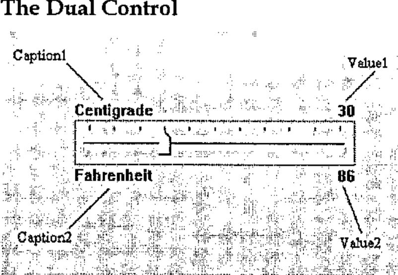
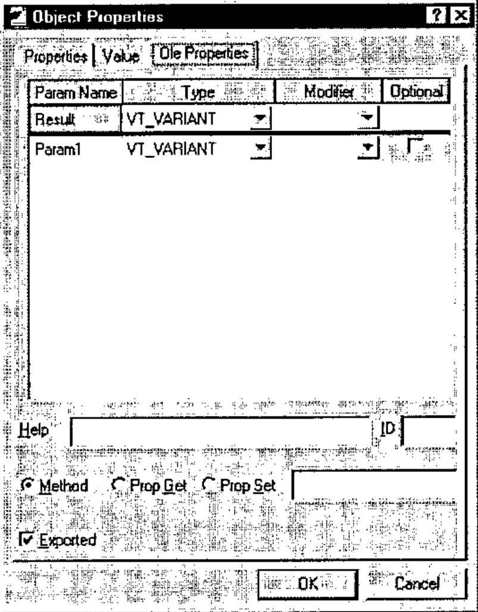
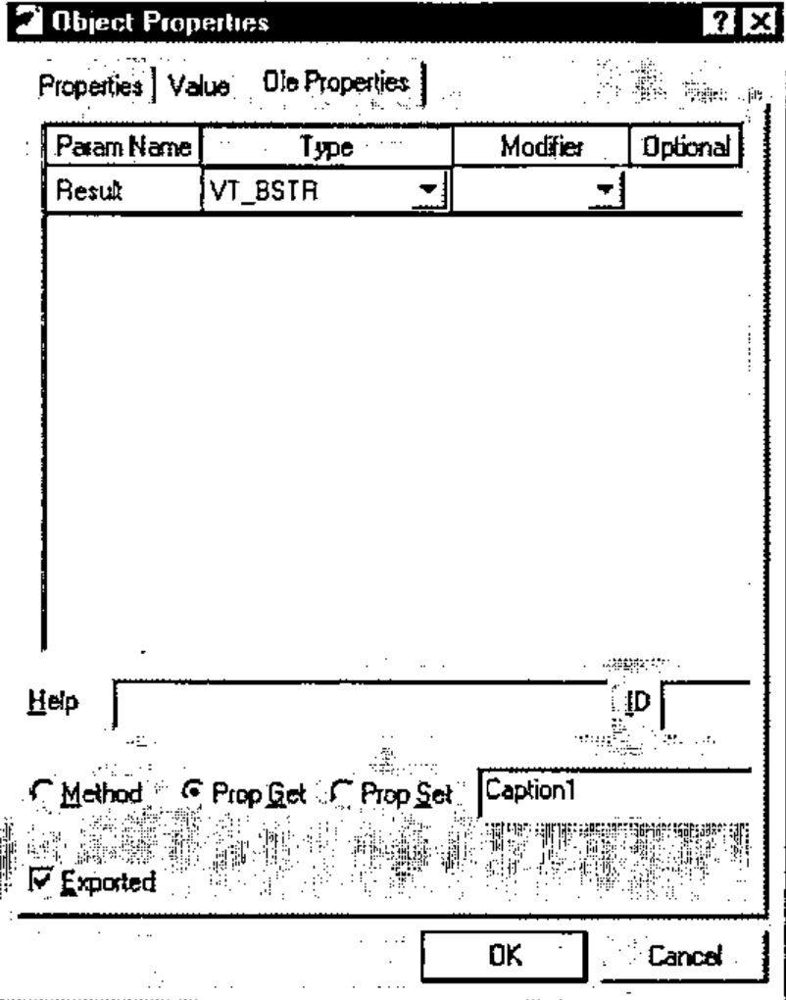
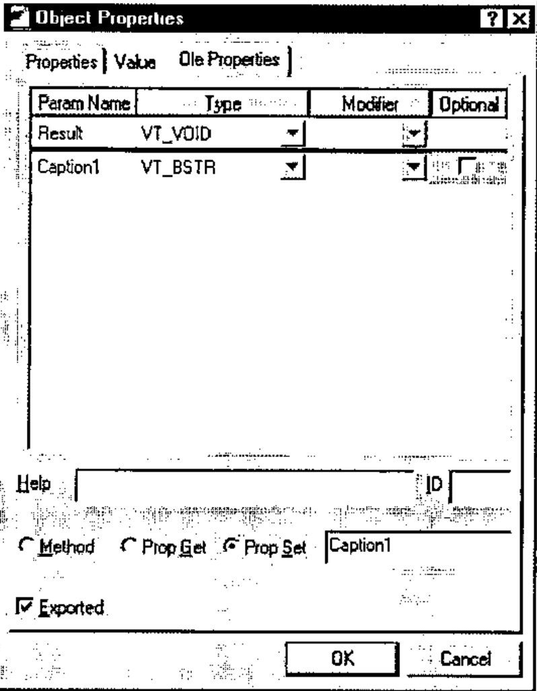
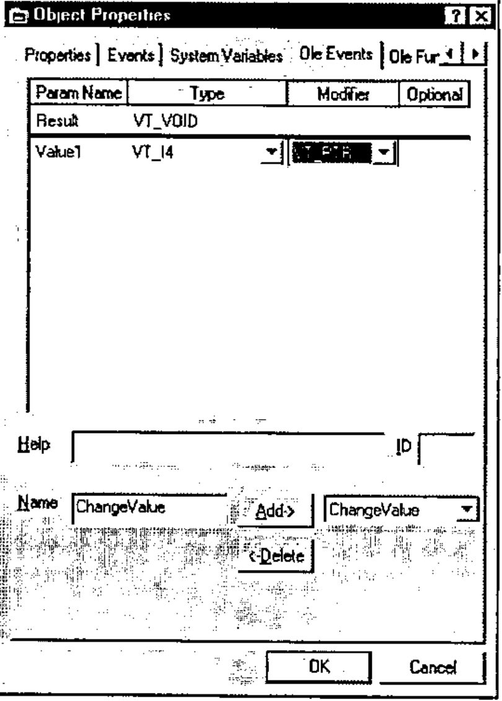

*introduction by Adrian Smith, workshop notes by Dyadic Systems*
{ .byline }

## Introduction

This workshop was probably the highlight of the conference - it was given twice, and was fully booked on both occasions. As Ray has already said, it was an object lesson in how to manage a room full of eager APLers faced with some unfamiliar hardware and novel concepts. Virtually everyone ended the session with the OCX control working correctly, but we all had to work at it just enough that most of the material stood a chance of sticking to our poor confused brains. Here are Dyadic’s workshop notes, exactly as used.

## Workshop Notes

An *ActiveX Control* is basically a user-defined control that may be included in GUI applications and Web Browsers. In this workshop you will learn how to

- Create an ActiveX control in Dyalog APL
- Define and Export Properties, Methods and Events
- Include your ActiveX control in a Visual basic application
- Run your ActiveX control from a Web Browser.

## The Dual Control



The ActiveX control we will use for this workshop is deliberately an extremely simple one; so that the intricacies of the control itself do not get in the way of the principles involved.

There are actually very few restrictions concerning the complexity of the ActiveX control, and it is perfectly possible to package complete multiple-window Dyalog APL applications in this way. Your ActiveX control will be called a *Dyalog Dual Control* and is based on the Dyalog APL *TrackBar* object.

The Dual control allows the user to enter a number using a slider, whilst displaying its value in two different units. For example, you could use it to enter a temperature value which is displayed in both Centigrade and Fahrenheit units. Equally, the same control could be used to enter a measurement of length which is concurrently displayed in centimetres and inches.

### Methods

None. (The Dual control provides no methods.)

### Properties

The Dual control provides the following properties:

| Property | Description |
|---|---|
| Caption1 | A text string that describes the primary units. This is displayed in the top left corner of the object. |
| Caption2 | A text string that describes the secondary or derived units. This is displayed in the bottom left corner of the object. |
| Value1 | The current value of the control measured in primary units |
| Value2 | The current value of the control measured in secondary units. |
| Intercept | Used to derive Value2 from Value1 |
| Gradient | Used to derive Value2 from Value1 |
| Min | The minimum value of Value1 |
| Max | The maximum value of Value1 |

Value2 is derived from Value1 using the expression:

```apl
Value2←Intercept+Gradient×Value1
```

### Events

The Dual control generates a ChangeValue event whenever the user alters Value1 using the slider.

The event message will contain a single parameter (the new value) which may be modified by the host application. In other words, every time the value in the control changes, the host application may detect this as an event and has the opportunity to override the user.

## Introducing the Dual Control

To save time, the basic APL code for the Dual control has already been written. However, you will have to turn it into an ActiveX control yourself.

1. `)LOAD DUALBASE`
2. Run the function *TEST* and observe how the 2 Dual controls behave.
3. View the function *TEST* and observe how 2 separate instances of the *Dual* namespace *F.D1* and *F.D2* have been created using `⎕OR` and `⎕NS`.
4. Using the Dyalog APL Workspace Explorer, open up the various namespaces. See how *F1.D1* and *F1.D2* are clones of *Dual*.
5. Open the function *Dual.Create* and see how the individual components of the control are defined.
6. Close the Form *F*.

## Changing Dual into an ActiveX Control

1. Change the name of the workspace to DUAL:

   ```apl
   )WSID DUAL
   ```

2. Make a new namespace called *F*

   ```apl
   )NS F
   ```

3. Using the Workspace Explorer, move the *Dual* namespace into *F*, so that *Dual* is a child namespace of *F*.
4. Now edit the function *F.Dual.Create* and make the following changes:
5. Remove all references to the local variable *POSITION*. This change is required because an ActiveX control has no say in its position within its parent. (Hint: use the Search/Replace dialog to remove all occurrences of `POSITION←`)
6. Remove the right argument, *SIZE* and change `Create[1]` from:

   ```apl
   H W←SIZE
   ```

   to

   ```apl
   H W←⎕WG 'Size'.
   ```

   This change allows the control to fit itself within the space allocated by the host application.

7. Change `Create[4]` from:

   ```apl
   CH←⊃'##'⎕WG⊂'TextSize' 'W'
   ```

   to

   ```apl
   CH←⊃⎕WG⊂'TextSize' 'W'
   ```

   The original code was designed to pick up the character height from the parent Form. The ActiveXControl object does this automatically via its own TextSize property.

   After making these changes, the *Create* function should be as follows:

   ```apl
       ∇ Create;H;W;POS;SH;CH;Y1;Y2
   [1]   H W←⎕WG'Size'
   [2]   SH←40 ⍝ Default Trackbar height
   [3]   POS←2↑⌊0.5×0⌈(H-SH)
   [4]   CH←⊃⎕WG⊂'TextSize' 'W'
   [5]   'Slider'⎕WC'TrackBar'POS('Size'SH W)
   [6]   'Slider'⎕WS('Limits'(Min,Max))('AutoConf' 0)
   [7]   'Slider'⎕WS('TickSpacing' 10)('TickAlign' 'Top')
   [8]   'Slider'⎕WS('Event' 'ThumbDrag' 'ChangeValue')
   [9]   'Slider'⎕WS('Event' 'Scroll' 'ChangeValue')
   [10]  Y1←POS[1]-CH+1
   [11]  Y2←POS[1]+SH+1
   [12]  'Cap1'⎕WC'Text'Caption1(Y1,0)('AutoConf' 0)
   [13]  'Cap2'⎕WC'Text'Caption2(Y2,0)('AutoConf' 0)
   [14]  'V1'⎕WC'Text'(⍕Value1)(Y1,W)('HAlign' 2)('AutoConf' 0)
   [15]  CalcValue2
   [16]  'V2'⎕WC'Text'(⍕Value2)(Y2,W)('HAlign' 2)('AutoConf' 0)
       ∇
   ```

8. Open the function *F.Dual.Build*. This function turns the *Dual*’s parent namespace into a Form (an ActiveXControl currently requires a parent Form) and turns *Dual* itself into an AciveXControl. It then attaches functions *Create* and *Configure* as callbacks on the Create and Configure events of the ActiveXControl object itself.

   ```apl
       ∇ Build
   [1]   ##.⎕WC'Form'('Coord' 'Pixel')('KeepOnClose' 1)
   [2]   ⎕WC'ActiveXControl'('Size' 80 200)('KeepOnClose' 1)
   [3]   ⎕WS'Event' 'Create' 'Create'
   [4]   ⎕WS'Event' 'Configure' 'Configure'
   [5]   ⎕NQ'' 'Create'
       ∇
   ```

9. Run function *F.Dual.Build*. You should see a Form containing a single instance of the Dual control. Please resist any temptation to play with it at this stage; we want it to be in is default state for when we save it.
10. Type the following expression; note that the ClassID, which uniquely identifies your control, is allocated when you create the ActiveXControl object.

    ```apl
    'F.Dual'⎕WG'ClassID'
    ```

11. Type `)SAVE`. This causes APL to make an OCX file containing your ActiveX control and to register it with Windows. To confirm, type:

    ```apl
    ⎕CMD'DIR *.OCX'
    ```

## Testing the Dual Control

1. Close Dyalog APL
2. Start Visual Basic and click *Standard EXE*.
3. Click the right mouse button in the leftmost toolbox and select *Components* from the pop-up menu.
4. Locate the control named *Dyalog DUAL Objects*, set its check box on and click OK. This adds a tool for the Dual control to the Visual Basic designer toolbox.
5. Click on the new tool and drag out an outline on your Form. An instance of the Dual control will appear.
6. Repeat step 5 to position a second instance of the Dual control on your Visual Basic Form.
7. Select Run/Start from the Visual Basic menubar.
8. Exercise the 2 Dual controls.
9. Select Run/End from the Visual Basic menubar.
10. Click on one of the Dual controls and scroll through its Property list. Notice that all the properties listed are standard Visual Basic ones; there are no properties (or indeed methods and events) exported. We will learns how to do this next.
11. Close Visual Basic; do not save the project.

## Defining and Exporting Properties

1. Start Dyalog APL and load the DUAL workspace (Hint: use the *File* menu; it will be the most recently saved file).
2. Change space into the *F.Dual* namespace.

   ```apl
   )CS F.Dual
   ```

3. The properties we wish to export are:

   | | |
   |---|---|
   | Caption1 | Description of the primary set of units |
   | Caption2 | Description of the secondary set of units |
   | Value1 | The primary value in the control |
   | Min | Minimum for Value1 |
   | Max | Maximum for Value1 |
   | Intercept | Used to derive the secondary value (Value2) |
   | Gradient | Used to derive the secondary value (Value2) |

   Although we could export all these properties as *variables*, it is generally more useful to employ *Get* and *Put* functions. The reason for this is that there is no mechanism to detect when the host application changes a property/variable; nor is there any mechanism to prevent it assigning an inappropriate value. The *Get* and *Put* functions you need are listed below. To save you time, you can copy them in from the workspace DUALFNS.

   ```apl
   )COPY DUALFNS

       ∇ R←GetCaption1
   [1]   R←Caption1
       ∇

       ∇ SetCaption1 C
   [1]   'Cap1'⎕WS'Text'(Caption1←C)
       ∇

       ∇ R←GetCaption2
   [1]   R←Caption2
       ∇

       ∇ SetCaption2 C
   [1]   'Cap2'⎕WS'Text'(Caption2←C)
       ∇

       ∇ R←GetIntercept
   [1]   R←Intercept
       ∇

       ∇ SetIntercept I
   [1]   Intercept←I
   [2]   CalcValue2
   [3]   'V2'⎕WS'Text'(⍕Value2)
       ∇

       ∇ R←GetGradient
   [1]   R←Gradient
       ∇

       ∇ SetGradient G
   [1]   Gradient←G
   [2]   CalcValue2
   [3]   'V2'⎕WS'Text'(⍕Value2)
       ∇

       ∇ R←GetValue1
   [1]   R←Value1
       ∇

       ∇ SetValue1 V
   [1]   1 ⎕NQ'' 'ChangeValue'V
       ∇
   ```

   The *Get* functions need no explanation; they simply return the value of the corresponding variable. The *Set* functions assign a new value to the corresponding variable and update the control accordingly. *SetValue1* does this by enqueuing a ChangeValue event which invokes the *ChangeValue* callback.

4. Display the Object Properties dialog box for the function *GetCaption1*. (Hint: use the Workspace Explorer). Select the *Ole Properties* tab. As you have not yet defined any Ole attributes, the default display is as follows:

   

   Using the right mouse button menu, delete the *Param1* and *Param2* rows (this is a *Get* function so it requires no parameter arguments).

   Change the data type for the *Result* to *VT_BSTR* (a text string).

   Check the *Prop Get* radio button to indicate that this is a *Property Get* function and enter the name of the property (*Caption1*) to which it applies.

   Finally, make sure that the *Exported* option is checked.

   Note that it is not necessary for the property name referenced by the *Get* and *Put* functions to correspond to a variable name, although in this case it does.

   The final Ole properties dialog box for *GetCaption1* should appear as follows:

   

   Now do the same for the *SetCaption1* function. This function takes an argument which it expects to be a character vector. It must therefore be defined as having a single parameter of data type *VT_BSTR*; the parameter name is unimportant. However, you must ensure that the *Optional* button is unchecked.

   In APL terms, the function does not return a result. However, in OLE terms the result is defined to be of type *VT_VOID*.

   The Ole properties for *SetCaption1* should appear as follows:

   

5. Now complete the Ole Properties for *GetCaption2* and *SetCaption2*, *GetIntercept* and *SetIntercept*, *GetGradient* and *SetGradient* and for *GetValue1* and *SetValue1* in a similar manner. Note that the data type for *Gradient* and *Intercept* properties should be *VT_R8* and for the *Value1* property it should be *VT_I4*. Use the following check-list.

### OLE Properties Check-List

| Function | Result | Param | Get/Set | Property | Done |
|---|---|---|---|---|---|
| *GetCaption1* | VT_BSTR | | Get | Caption1 | |
| *GetCaption2* | VT_BSTR | | Get | Caption2 | |
| *GetGradient* | VT_R8 | | Get | Gradient | |
| *GetIntercept* | VT_R8 | | Get | Intercept | |
| *GetValue1* | VT_I4 | | Get | Value1 | |
| *SetCaption1* | VT_VOID | VT_BSTR | Set | Caption1 | |
| *SetCaption2* | VT_VOID | VT_BSTR | Set | Caption2 | |
| *SetGradient* | VT_VOID | VT_R8 | Set | Gradient | |
| *SetIntercept* | VT_VOID | VT_R8 | Set | Intercept | |
| *SetValue1* | VT_VOID | VT_I4 | Set | Value1 | |

6. When you have finished this task, open the Properties dialog box for the Dual object itself and look at the Ole Properties tag. This provides another interface to define exported functions.
7. Finally, re-save the workspace. This will update your .OCX file with all the new information.

   ```apl
   )SAVE
   ```

## Setting Properties from Visual Basic

1. Close Dyalog APL
2. Start Visual Basic and click *Standard EXE.*
3. Click the right mouse button in the leftmost toolbox and select *Components* from the pop-up menu.
4. Locate the control named *Dyalog DUAL Objects*, set its check box on and click *OK*. This adds a tool for the Dual control to the Visual Basic designer toolbox.
5. Click on the new tool and drag out an outline on your Form. An instance of the Dual control (called Dual1) will appear.
6. In the Properties dialog box, set the Dual1 properties as follows:

   | | |
   |---|---|
   | Caption1 | Centimetres |
   | Caption2 | Inches |
   | Gradient | 0.3937 |
   | Intercept | 0 |

7. Repeat step 5 to position a second instance of the Dual control (Dual2) on your Visual Basic Form.
8. Double-Click the left mouse button over your Form (*Form1*). This will bring up the code editor dialog box. Edit the Form_Load() subroutine, entering the following program statements. This code will be run when Visual Basic starts your application and loads the Form *Form1*. It illustrates how you can change the properties of your Dyalog APL ActiveX control dynamically.

   ```text
   Private Sub Form_Load()
   Dual2.Caption1 = "Inches"
   Dual2.Caption2 = "Centimetres"
   Dual2.Intercept = 0
   Dual2.Gradient = 2.54
   End Sub
   ```

9. Now test your application by selecting Run/Start from the menubar. When you have finished, select Run/End.
10. Exit Visual Basic; do **not** save the Project or the Form.

## Defining and Exporting Events

1. Start Dyalog APL and load the DUAL workspace (Hint: use the *File* menu; it will be the most recently saved file)
2. Using the Workspace Explorer, open the callback function *ChangeValue* in *F.Dual* Alter `ChangeValue[2]` from:

   ```apl
   Value1←⊃¯1↑MSG
   ```

   to

   ```apl
   Value1←4 ⎕NQ '' 'ChangeValue' (⊃¯1↑MSG)
   ```

   Then close the function. Previously, the *ChangeValue* function simply accepted the new value (of the Trackbar thumb) that it received as the last element of the event message. Now it generates an external *ChangeValue* event for the host application. The host may in turn modify the new value which is returned as the result of the expression. Thus not only can Dyalog APL generate events which are detectable by the host application, it can also accept modifications.

3. Again using the Workspace Explorer, open the Properties dialog box for the Dual object itself and select the *OleEvents* tab.
    1. Enter the name of the event *ChangeValue* into the edit box labelled *Name*.
    2. Click *Add*
    3. Click the right mouse button over the *Result* row and select *Insert*
    4. Change the name *Param1* to *Value1*, the *Type* to *VT_I4* and the *Modifier* to *VT_PTR*. This defines the event to supply a pointer to an integer. The fact that it is a *pointer* means that the (integer) parameter may be modified by the host application.

   The final appearance of this dialog box should be as follows:

   

4. Click OK, change back to the root space, and save the workspace

   ```apl
   )CS #
   )SAVE
   ```

## Using Events from Visual Basic

1. Close Dyalog APL
2. Start Visual Basic and click *Standard EXE*.
3. Click the right mouse button in the leftmost toolbox and select *Components* from the pop-up menu.
4. Locate the control named *Dyalog DUAL Objects*, set its check box on and click *OK*. This adds a tool for the Dual control to the Visual Basic designer toolbox.
5. Click on the new tool and drag out an outline on your Form. An instance of the Dual control (called Dual1) will appear.
6. Select the label tool and add a label object to the Form. Select its Font property and change it to 14-point bold.
7. Double-click over Dual1 to bring up the code window. Notice how Visual Basic presents you with a skeleton subroutine for the (only) event *ChangeValue* which we have just defined and exported. Notice too that Visual Basic knows that the single parameter is named *Value1* and that its data type is *Long* (*VT_I4*).
8. Enter the following code, then close the code window.

   ```text
   Private Sub Dual1_ChangeValue(Value1 As Long)
   Label1.Caption=Str(Value1)
   End Sub
   ```

9. Start the application using *Run/Start*. Exercise the Dual control and observe that Visual Basic updates the Label1 control in response to the ChangeValue events. When you have finished, select *Run/End*.
10. Double-click over Dual1 to bring up the code window. Alter the Dual1_ChangeValue subroutine to the following, then close the code window.

    ```text
    Private Sub Dual1_ChangeValue(Value1 As Long)
    Value1=2*(Value1/2)
    Label1.Caption=Str(Value1)
    End Sub
    ```

11. Start the application using *Run/Start*. Exercise the Dual control and observe that now the slider moves in increments of 2. When you have finished, select *Run/End*.
12. Close Visual Basic; do not save anything.

## Using Dual in a Web Page

1. Start Dyalog APL and load the DUAL workspace again.

   ```apl
   )LOAD DUAL
   )CS F.Dual
   )COPY DUALUTIL WRITE_HTML
   ```

2. Look at the function *WRITE_HTML*.

   ```apl
       ∇ TITLE WRITE_HTML FILE;NID;HTML;CLASS;HEIGHT;WIDTH;CRLF
   [1]   CLASS←1↓¯1↓⎕WG'ClassID'
   [2]   HEIGHT WIDTH←⍕¨⎕WG'Size'
   [3]   CRLF←⎕AV[4 3]
   [4]   HTML←'<html><head><title>',TITLE,'</title></head>',CRLF
   [5]   HTML,←'<body>',CRLF
   [6]   HTML,←'<h2 align="center"><font face="Arial">'
   [7]   HTML,←TITLE,'</font></h2>',CRLF
   [8]   HTML,←'<p align="center"><object classid="clsid:'
   [9]   HTML,←,CLASS,'"'
   [10]  HTML,←' width="',WIDTH,'" height="',HEIGHT,'">'
   [11]  HTML,←'</object></p>',CRLF,'</body></html>',CRLF
   [12]  :Trap 0
   [13]      NID←FILE ⎕NCREATE 0
   [14]  :Else
   [15]      NID←FILE ⎕NTIE 0
   [16]      FILE ⎕NERASE NID
   [17]      NID←FILE ⎕NCREATE 0
   [18]  :EndTrap
   [19]  HTML ⎕NAPPEND NID
   [20]  ⎕NUNTIE NID
       ∇
   ```

   This function writes a very simple page of HTML that references your Dyalog APL ActiveX control via its ClassID (lines [1] and [9]).

3. Now run it:

   ```apl
   'Dyalog Dual Control' WRITE_HTML 'dual.htm'
   ```

4. Close Dyalog APL
5. Start your Web Browser and point it at the file you have just saved by typing the URL:

   ```text
   file://c:\dyalog82\dual.htm
   ```

6. Close your browser

## Calling Dual from VBScript

1. Start Dyalog APL and load the DUAL workspace again.

   ```apl
   )LOAD DUAL
   )CS F.Dual
   )COPY DUALUTIL UPDATE_CLASSID
   ```

2. Look at the function *UPDATE_CLASSID*.

   ```apl
       ∇ UPDATE_CLASSID FILE;NID;HTML;CLASSID;I
   [1]   NID←FILE ⎕NTIE 0
   [2]   HTML←⎕NREAD NID,82,(⎕NSIZE NID),0
   [3]   I←'clsid:'⍷HTML
   [4]   I←⊃I/⍳⍴I
   [5]   I+←5
   [6]   CLASSID←1↓¯1↓⎕WG'ClassID'
   [7]   HTML[I+⍳⍴CLASSID]←CLASSID
   [8]   HTML ⎕NREPLACE NID 0
   [9]   ⎕NUNTIE NID
       ∇
   ```

   This function simply updates an HTML file with the object’s ClassID.

3. Now run the function to update the supplied HTML file called `dualtest.htm`.

   ```apl
   UPDATE_CLASSID 'dualtest.htm'
   ```

4. Close Dyalog APL.
5. Start your Web Browser and point it at the file you have just saved by typing the URL:

   ```text
   file://c:\dyalog82\dualtest.htm
   ```

6. Close your browser.
