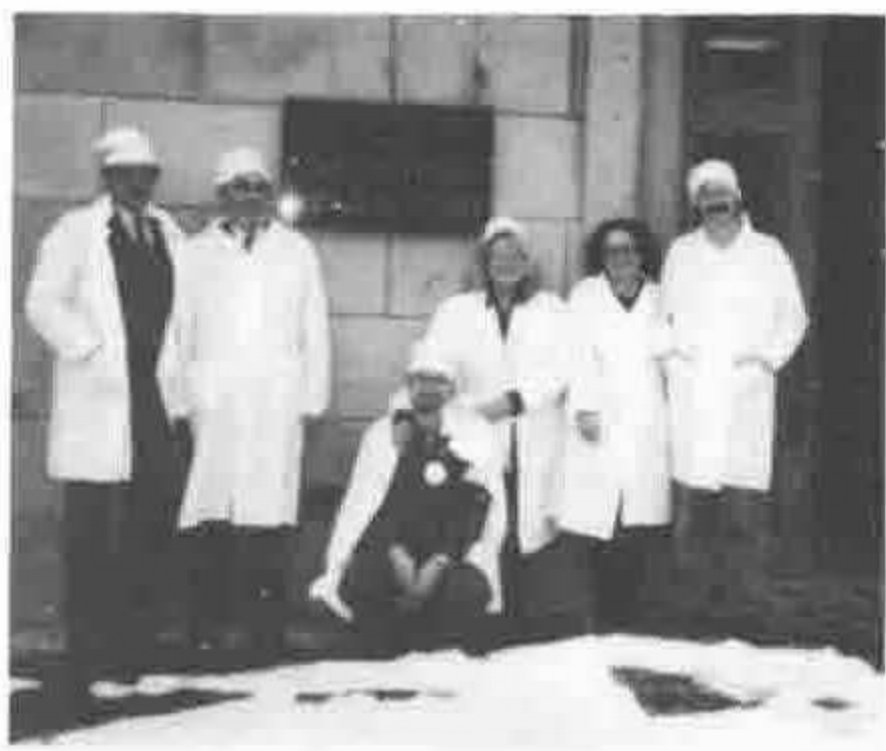

*Translated from Obninsky Newspaper 20 February 1992 by Michel J. Dumontier and Ludmilla Lemagnen*
{ .byline }

In February a group of French scientists visited Obninsk: Gérard Langlet, crystallographer and theoretical physicist at CEA, Saclay; Jean-Jacques Girardot, Professor at the Ecole des Mines de Saint-Etienne; Michel Dumontier, Engineer from the Research Centre of the Defence Ministry. The Manager of the group was Ludmilla Lemagnen.

The Delegation at the Atomic Centre: A. Skomorokhov, G. Langlet, D. Lukyanov, L. Lemagnen, Mrs. Kuprianova and J.J. Girardot
{ .caption }

At the invitation of the Union of APL Users, the group took part in a seminar in Obninsk together with specialists from CEI. APL occupies a unique place in the computer industry world-wide. APL was invented by K.E. Iverson at the beginning of the 1960s to be a ‘tool of thought’ for the Computer Age. Now APL has spread all over the West. In the USSR (we will use the old name) a Union of Soviet APL Users was created in Obninsk and registered with the Town Council in 1990. USAU is a union of non-commercial organisations for the development and expansion of computer technology with a strong APL bias, for its introduction into scientific, industrial and educational domains and for the promotion of APL Russian and International seminars.

Among the six members of the Committee, three are from Obninsk: V. Kuprianov, A. Skomorokhov and O. Luksha.

When a journalist does not fully understand his subject he must rely on a specialist, and trust him to explain it to the reader. So I asked Oleg Luksha to describe the seminar.

> "Immediately after the creation of USAU we began methodically to develop international contacts. In 1990 Soviet programmers took part the in annual international APL conference, that year in Copenhagen. Two papers were presented by us and they caused a sensation. It proved that Soviets were not born yesterday! Also in 1990, in Leningrad, there was a Soviet-Finnish seminar to which 30 Finnish and 50 Soviet specialists contributed. Thereafter events followed one another rapidly. The decision was taken to hold the 1992 international APL conference at St Petersburg.
>
> Last year, in Obninsk, we celebrated the fifth anniversary of APL activity in our country. We have been visited by specialists from several countries, one of whom is the chief APL architect of APL in IBM, Jim Brown. Our contacts are still widening greatly: 11 people from Obninsk took part in the conference ‘Using APL in Statistics’ that was held in Finland. We have established a high level of international scientific relations and today have up-to-date information on the problems in which we are interested.
>
> The French-Russian seminar that was held in Obninsk could be called more precisely a school for our specialists. Gérard Langlet gave a lecture: ‘Towards a New Information Theory’. His new theory is based on algorithms. The lecture caused a shock. For us it is an interesting and revolutionary theory. Langlet is a polymath. He works in biology, chemistry, botany, physics and linguistics. Afterwards Ludmilla Lemagnen was overheard saying he is a genius.
>
> Jean-Jacques Girardot has created a new programming language called CTalk, based on APL concepts. Girardot is a man of great authority in modern computer technology. Michel Dumontier’s lecture was also a shock because of the amount of research in it that was new to us. Roughly, evaluating all the work of the school, we can say that Dumontier has opened new horizons and new domains in the use of APL. We consider our seminar was a significant step forward which will promote the success of the international conference at St Petersburg."

Apart from the science, the seminar had other fruitful results. French people have visited the IATE, and they made contact with the Ecole des Mines of Saint Etienne and will now exchange groups of students and undertake joint projects. Our guests have greatly appreciated the atmosphere of the Humanitarian Centre. They thought the standard of the students of the Centre to be higher than the mean standard in France. The French delegation was entertained by the Mayor of the town, Yuri Kyrillov. They had the idea of twinning Obninsk with Saclay, and our guests returned to France with a letter from our Mayor to the Mayor of Saclay.
