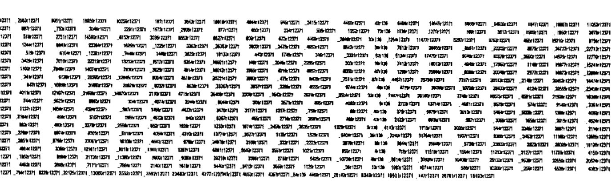

*by Michel Dumontier*
{ .byline }

**Summary:** We give here the algorithm for the inversion of Boolean matrices, in the Boolean sense of course, for matrixes of any order. This article was first published in *Les Nouvelles d’APL* N° 35.

## Introduction

In issue No. 8 of *Les Nouvelles d’APL*, Gérard Langlet [1] gives the following matrix of order 15:

```apl
      GA
0 0 0 0 0 1 0 1 1 1 1 0 1 0 1
0 1 1 0 0 1 1 0 1 1 0 0 0 0 0
0 0 0 0 0 1 1 1 0 1 1 1 0 0 1
1 0 1 1 0 1 0 1 0 1 0 1 1 0 0
0 0 0 1 0 1 0 0 1 1 1 0 1 0 1
1 1 1 1 0 0 0 1 1 0 1 1 1 1 1
1 0 0 0 0 1 1 1 0 1 1 0 0 1 1
0 0 0 1 0 0 1 0 1 1 0 1 1 0 1
1 0 1 0 0 0 1 1 1 0 0 0 1 1 0
1 1 0 0 0 0 0 0 1 0 1 1 1 1 1
1 0 0 0 0 0 0 0 0 0 0 0 0 0 0
0 0 0 1 0 0 0 1 0 1 1 1 0 0 0
0 0 0 0 0 0 1 0 0 1 0 1 0 1 0
0 0 0 0 0 1 0 0 0 1 0 0 0 1 0
1 0 0 0 1 1 1 0 1 1 0 1 0 0 0
```

And asks:

1. Is it possible to find its inverse?
2. Is the solution unique?
3. What is the shortest program and, if possible, the quickest, able to produce in the general case such an inversion without error, if necessary on the largest possible matrices?

He added, certainly with mischief: the solution in the next issue… we talked over the phone very often and he knew that I had the solution and believed that I was going to give it.

Without waking up the cat that sleeps,[^1] I got away with a dirty trick in the following issue without revealing the algorithm. I gave the inverted matrix by saying that the matrix in question is the 5355th root of the unit matrix (by raising the matrix to the power 5354, one obtains the inverse): a method that is certainly not the shortest!

Let us verify it here.

Here is the function that raises a matrix to its N<sup>th</sup> power:

```apl
    ∇ Z←M MP N;MD;L;C;I;L2;⎕IO
[1]   ⎕IO←0 ⋄ Z←M ⋄ I←0⋄ L←⌊2⍟N ⋄ L2←2*L ⋄ MD←L2|N
[2]   'Z←Z≠.∧Z'wh'L≥I←I+1' ⋄ →(0=MD)/0 ⋄I←0
[3]   'Z←Z≠.∧M'wh'MD≥I←I+1'
    ∇

      GA MP 5355
1 0 0 0 0 0 0 0 0 0 0 0 0 0 0
0 1 0 0 0 0 0 0 0 0 0 0 0 0 0
0 0 1 0 0 0 0 0 0 0 0 0 0 0 0
0 0 0 1 0 0 0 0 0 0 0 0 0 0 0
0 0 0 0 1 0 0 0 0 0 0 0 0 0 0
0 0 0 0 0 1 0 0 0 0 0 0 0 0 0
0 0 0 0 0 0 1 0 0 0 0 0 0 0 0
0 0 0 0 0 0 0 1 0 0 0 0 0 0 0
0 0 0 0 0 0 0 0 1 0 0 0 0 0 0
0 0 0 0 0 0 0 0 0 1 0 0 0 0 0
0 0 0 0 0 0 0 0 0 0 1 0 0 0 0
0 0 0 0 0 0 0 0 0 0 0 1 0 0 0
0 0 0 0 0 0 0 0 0 0 0 0 1 0 0
0 0 0 0 0 0 0 0 0 0 0 0 0 1 0
0 0 0 0 0 0 0 0 0 0 0 0 0 0 1
```

Here is the function that let us find the inverse:

```apl
    ∇ Z←TU M;⎕IO;I;U;N;P;N2
[1]   Z←1⋄N←1↑⍴M⋄U←(⍳N)∘.=⍳N⋄ U←U∧U ⋄P←M ⋄N2←N×N
[2]   BO:P←P≠.∧M ⋄  Z←Z+1 ⋄ →(N2=+/(,P)=,U)/0⋄→BO
    ∇
      TU GA
5355
```

3 seconds to wait! Not so long (considering that it’s performing 5354 Boolean matrix products!)

The story is that the only weapon he had for matrix inversion was the following function. He said that mathematicians had not yet discovered what the inverse of a Boolean matrix (in the Boolean sense) is, nor did they know how to calculate it.

```apl
    ∇ Z←BINV M
[1]   Z←⎕CT<|⌹M
    ∇
```

Let us try it on a small matrix:

```apl
      A←3 3⍴?9⍴2
      A
0 1 0
1 1 0
0 1 1

      A≠.∧BINV A
1 0 0
0 1 0
0 0 1
```

Indeed that works fine, but on the matrix GA it does not work.

Here is the proof…

*I see some of my readers are frowning: they believed it was necessary to replace the + of the numerical inner product by the Boolean or… No! It is the XOR you must use, `∨.∧` performs the transitive closure of a graph, provided that you apply it to the same matrix: `B∨.∧B`.*

But back to business:

```apl
      GA≠.∧BINV GA
1 0 0 0 0 0 1 1 1 0 0 1 0 1 0
1 1 0 0 0 0 0 0 0 0 0 0 0 0 0
1 0 1 0 0 0 1 1 0 1 0 1 0 1 0
1 0 0 1 0 1 1 1 0 0 0 1 1 1 0
0 0 0 0 1 0 1 1 1 0 0 1 0 1 0
0 0 0 0 0 1 1 0 0 1 0 0 1 0 0
1 0 0 0 0 0 0 1 0 1 1 1 0 1 0
1 0 0 0 0 1 0 0 0 0 1 1 1 1 0
1 0 0 0 0 0 1 0 1 1 1 0 0 0 0
0 0 0 0 0 0 0 1 1 0 1 1 0 1 0
0 0 0 0 0 0 0 0 0 0 1 0 0 0 0
1 0 0 0 0 0 0 0 0 1 0 1 0 1 0
0 0 0 0 0 0 1 0 0 0 0 0 0 0 0
1 0 0 0 0 1 0 0 1 0 1 0 0 1 0
1 0 1 1 0 0 0 1 0 1 1 1 1 0 1
```

Calculating the inverse in the numerical sense of GA:

```apl
      4 1⍕⌹GA
0.0 0.0 0.0 0.0 0.0 0.0 0.0 0.0 0.0 0.0 1.0 0.0 0.0 0.0 0.0
¯0.4 0.6 ¯1.0 0.6 ¯1.0 ¯0.9 1.3 0.7 ¯0.3 1.3 ¯2.1 0.7 ¯1.3 ¯0.1 0.0
1.0 0.0 0.0 0.0 1.0 1.7 ¯0.7 ¯1.3 ¯0.7 ¯1.7 1.3 ¯1.3 2.7 ¯1.3 0.0
¯1.0 0.0 0.0 0.0 0.0 ¯0.3 0.3 0.7 0.3 0.3 ¯0.7 0.7 ¯1.3 0.7 0.0
0.8 ¯0.2 ¯2.0 0.8 0.0 0.5 1.7 ¯0.7 ¯1.1 ¯0.3 ¯2.5 ¯0.7 1.3 ¯2.1 1.0
¯1.0 0.0 1.0 0.0 0.0 ¯0.7 ¯0.3 0.3 0.7 0.7 ¯0.3 0.3 ¯1.7 1.3 0.0
¯0.8 0.2 0.0 0.2 0.0 ¯0.9 0.7 0.3 0.5 0.7 ¯1.1 0.3 ¯0.7 ¯0.3 0.0
0.0 0.0 0.0 0.0 ¯1.0 ¯0.3 0.3 0.7 0.3 0.3 ¯0.7 0.7 ¯1.3 0.7 0.0
0.0 0.0 1.0 ¯1.0 0.0 0.3 ¯1.3 0.3 0.7 ¯0.3 1.7 0.3 ¯0.7 1.3 0.0
1.2 0.2 ¯1.0 0.2 0.0 0.5 0.3 ¯0.3 ¯0.9 ¯0.7 0.5 ¯0.3 1.7 ¯0.9 0.0
0.0 0.0 0.0 0.0 1.0 0.0 0.0 ¯1.0 0.0 0.0 0.0 0.0 1.0 ¯1.0 0.0
¯0.2 ¯0.2 1.0 ¯0.2 0.0 0.2 ¯1.0 0.0 0.2 0.0 0.8 0.0 0.0 0.6 0.0
0.0 0.0 ¯1.0 1.0 0.0 ¯1.0 1.0 0.0 0.0 1.0 ¯2.0 0.0 0.0 ¯1.0 0.0
¯0.2 ¯0.2 0.0 ¯0.2 0.0 0.2 0.0 0.0 0.2 0.0 ¯0.2 0.0 0.0 0.6 0.0
0.8 ¯0.2 0.0 ¯0.2 0.0 1.2 0.0 0.0 ¯0.8 ¯1.0 0.8 ¯1.0 1.0 ¯0.4 0.0
```

This is not at all the same thing as the inverse in the Boolean sense.

## Inversion of a Boolean matrix

We must once again use the algorithm of the inversion modulo p [2] and set p=2, but re-write the algorithm in origin 0.

```apl
    ∇ Z←M DIO2 P;⎕IO;I;T;U;N;IT;MU;D
[1]   ⎕IO←0⋄ T←⍉⌽M ⋄N←1↑⍴M
[2]   U←(⍳N)∘.=⍳N ⋄ IT←INV T ⋄D←|DET M
[3]   MU←⊖U ⋄ Z←(N,N)⍴0 ⋄ I←0  ⋄ N1←N-1
[4]   INC:Z[I;]←(P|D×⍳P)⍳(P|((IT)+.×MU[I;])×D)
[5]   →(N1≥I←I+1)/INC
    ∇

      P←2
      ⎕←IGA←GA DIO2 P
0 0 0 0 0 0 0 0 0 0 1 0 0 0 0
0 1 1 1 1 0 0 0 0 0 1 0 0 0 0
1 0 0 0 1 1 0 0 0 1 0 0 0 0 0
1 0 0 0 0 1 1 0 1 1 0 0 0 0 0
0 1 0 0 0 0 1 0 1 1 0 0 0 1 1
1 0 1 0 0 0 1 1 0 0 1 1 1 0 0
0 1 0 1 0 1 0 1 1 0 1 1 0 0 0
0 0 0 0 1 1 1 0 1 1 0 0 0 0 0
0 0 1 1 0 1 0 1 0 1 1 1 0 0 0
0 1 1 1 0 1 1 1 1 0 0 1 1 0 0
0 0 0 0 1 0 0 1 0 0 0 0 1 1 0
1 1 1 1 0 1 1 0 1 0 0 0 0 1 0
0 0 1 1 0 1 1 0 0 1 0 0 0 1 0
1 1 0 1 0 1 0 0 1 0 1 0 0 1 0
0 1 0 1 0 0 0 0 0 1 0 1 1 0 0

      GA≠.∧IGA
1 0 0 0 0 0 0 0 0 0 0 0 0 0 0
0 1 0 0 0 0 0 0 0 0 0 0 0 0 0
0 0 1 0 0 0 0 0 0 0 0 0 0 0 0
0 0 0 1 0 0 0 0 0 0 0 0 0 0 0
0 0 0 0 1 0 0 0 0 0 0 0 0 0 0
0 0 0 0 0 1 0 0 0 0 0 0 0 0 0
0 0 0 0 0 0 1 0 0 0 0 0 0 0 0
0 0 0 0 0 0 0 1 0 0 0 0 0 0 0
0 0 0 0 0 0 0 0 1 0 0 0 0 0 0
0 0 0 0 0 0 0 0 0 1 0 0 0 0 0
0 0 0 0 0 0 0 0 0 0 1 0 0 0 0
0 0 0 0 0 0 0 0 0 0 0 1 0 0 0
0 0 0 0 0 0 0 0 0 0 0 0 1 0 0
0 0 0 0 0 0 0 0 0 0 0 0 0 1 0
0 0 0 0 0 0 0 0 0 0 0 0 0 0 1
```

QED.

**Properties**: See [3].

We can process matrices of any order. (We work in J now). To keep the examples compact, we are going to work on a matrix of order 20 here.

The preceding matrix was invertible in the Boolean sense because its determinant was odd (it was 15); an even determinant in a Boolean matrix is equivalent to a null determinant in matrices of numbers (whether they are integers or reals). In other words, `2|det a` would be 0 in this case.

```j
   a
0 1 0 1 1 0 0 1 0 0 1 0 0 1 1 1 1 0 0 0
0 0 1 0 1 1 1 0 1 0 0 0 0 0 0 0 1 1 1 0
0 0 0 1 1 0 0 1 1 1 0 0 1 0 1 1 1 0 1 0
1 1 0 0 1 1 0 1 1 0 1 0 1 1 1 0 0 0 1 1
0 1 1 1 1 0 1 0 1 0 0 1 0 0 1 1 1 1 0 1
1 1 1 1 0 1 1 1 0 1 0 1 0 1 1 0 0 0 1 0
1 0 0 0 0 1 1 1 1 1 0 1 1 1 0 1 1 1 1 1
0 1 0 1 0 1 1 0 0 1 1 1 0 0 0 0 0 1 0 1
1 0 0 0 1 0 1 1 1 0 0 0 1 0 0 0 1 1 0 0
0 1 0 1 1 0 1 1 0 0 1 1 1 0 1 1 0 0 1 1
0 1 1 0 0 1 0 1 1 1 1 0 0 0 0 1 0 0 1 1
1 1 1 1 1 0 0 0 1 1 1 1 0 0 0 0 0 0 1 1
1 1 1 0 0 1 1 0 0 1 0 0 0 1 0 1 1 1 1 0
1 0 1 1 0 1 0 0 0 1 1 1 1 0 0 0 1 1 0 0
0 1 1 1 0 1 1 1 1 1 1 1 1 1 1 0 1 1 0 0
0 1 1 1 1 1 0 1 0 1 1 1 1 1 0 1 0 0 1 0
0 1 0 1 0 0 0 1 1 0 1 1 1 1 1 0 1 1 0 0
0 0 0 1 0 0 0 0 0 0 1 0 0 1 0 1 0 1 1 1
1 1 1 0 1 1 1 1 1 0 0 0 1 1 1 0 1 0 0 1
1 0 1 0 1 0 0 0 1 0 1 0 0 1 1 1 1 1 1 0

   det a
12371
```

It’s possible to invert it in the Boolean sense:

```j
   +b=:a dio p
1 1 1 1 0 1 1 0 0 1 1 0 0 1 1 0 1 1 1 0
1 1 1 0 1 1 1 1 0 0 0 0 1 0 0 1 1 1 0 1
1 0 1 0 0 0 1 1 1 1 1 1 1 0 1 1 0 1 0 0
0 0 1 0 1 1 1 1 1 0 1 0 1 0 1 1 0 1 1 1
0 1 0 1 1 0 0 1 1 1 0 1 0 0 0 0 0 0 1 0
1 1 0 0 0 1 0 1 0 0 0 1 0 0 0 1 0 1 1 1
1 0 0 0 0 1 0 0 1 0 1 0 1 1 0 0 0 1 0 0
0 1 0 1 1 0 0 1 1 1 0 1 1 1 1 1 1 0 1 0
1 1 1 1 0 1 0 1 1 0 1 0 1 1 0 0 1 0 1 0
1 1 1 0 0 0 1 0 0 1 0 0 0 1 0 0 1 1 1 1
1 0 1 1 0 0 0 0 0 1 0 0 1 1 0 1 1 0 0 1
0 1 1 0 1 0 1 0 1 1 0 0 0 0 1 1 0 1 0 0
1 0 1 1 1 0 0 1 1 0 1 1 1 1 1 1 0 0 1 0
0 1 1 0 0 0 0 1 0 1 1 1 1 1 1 1 0 1 1 0
0 1 0 1 0 0 0 0 1 1 0 0 1 0 0 1 0 0 0 1
0 1 1 1 0 1 1 0 0 0 1 0 0 0 0 0 0 0 1 0
1 0 1 1 0 1 1 1 0 1 1 1 0 1 1 0 1 1 1 0
1 0 0 0 1 0 0 1 0 0 1 0 0 0 0 0 0 1 0 0
0 0 1 1 0 0 0 0 0 1 1 0 1 1 0 0 0 1 0 1
0 0 1 1 0 0 0 1 1 1 1 1 0 1 0 1 1 1 1 1
```

and to invert it in the numerical sense.

```j
   c =:%.a
```

NB: It is unreadable, but we print it to prove that it has been calculated.



One can *navigate* a Boolean matrix in two oceans: that of numbers and that of Booleans.

### Property 1: in the numerical ocean

Let us take any numerical vector (no limit on numbers as in inverse modulo p)

```j
   +n=:20?100
55 6 67 46 47 66 70 81 9 43 24 10 48 97 34 83 29 15 30 68
```

Apply to it the inner product by the matrix `a` giving the vector `i`

```j
   +i=:a +/ . * n
447 333 450 565 484 605 704 348 354 547 477 405 561 403 645 6
48 399 363 677 490
```

Let us apply the inner product of the inverse of `a` (in the numerical sense) on the vector `i` and we have to recover the original vector `n`.

```j
   +c+/ . * i
55 6 67 46 47 66 70 81 9 43 24 10 48 97 34 83 29 15 30 68
```

QED.

### Property 2: in the numerical and the Boolean ocean, let us show that Boolean Matrices work in 2 ways

Let us take a random Boolean vector.

```j
   +v=:?20$2
0 0 1 0 0 0 1 1 0 1 1 0 1 0 0 1 1 1 0 0
```

Let us apply to it the inner product of the matrix `a` on `v` as if it were a vector of integers to give a vector of integers `w` :

```j
   +w=.a +/ . * v
4 4 5 3 5 4 7 4 5 5 5 3 6 6 8 6 5 3 5 5
```

That obviously gives integers as we would expect. (They are sums of numbers that are either 0 or 1.)

Let us apply the inner product of the inverse of `a` on the vector `w` and then we have to find the original vector `v`.

```j
   c +/ . * w
0 0 1 0 0 0 1 1 0 1 1 0 1 0 0 1 1 1 0 0
```

QED1.

But we are going to make the Boolean matrix work in the Boolean ocean, by using Boolean inversion.

Let us take again our vector `v` and apply it to the Boolean matrix product to give the vector `bw`.

Note: `bw` is a Boolean vector as opposed to the numerical vector `n` obtained previously.

```j
   +bw=:has ~:/ . *.v
0 0 1 1 1 0 1 0 1 1 1 1 0 0 0 0 1 1 1 1
```

Let us apply the Boolean matrix product of the inverse of `a` in the Boolean sense (matrix `b`) on the vector `bw` produced and then we would have to recover the original vector `v`.

```j
   b ~:/ . *.bw
0 0 1 0 0 0 1 1 0 1 1 0 1 0 0 1 1 1 0 0
```

Let us compare it to the vector `v`

```j
   v
0 0 1 0 0 0 1 1 0 1 1 0 1 0 0 1 1 1 0 0
```

QED2.

Let us compare the vector `w` obtained previously and the vector `bw`.

The vector `bw` represents the parity of `w`.

```j
   w
4 4 5 3 5 4 7 4 5 5 5 3 6 6 8 6 5 3 5 5

   bw
0 0 1 1 1 0 1 0 1 1 1 1 0 0 0 0 1 1 1 1
```

Oh, what fun! (When one is retired and has plenty of time.)

## References

[1] Gérard Langlet. Travaux pratiques en APL, *Les Nouvelles d’APL* N° 8 p 97.

[2] Michel J.Dumontier. Inversion matricielle modulo p, Systèmes linéaires modulo p. *Les Nouvelles d’APL* N° 35 pp. 45-54. Translated as Matrix Inversion modulo p, Linear systems modulo p, *Vector* 18.1.

[3] Properties of Boolean Matrices generated by Gray functions. Michel J. Dumontier APL-CAM Journal, Vol 14, N°2.

[^1]: For those who don’t know: a French idiom meaning it is not necessary to reawaken old quarrels. *Let sleeping dogs lie* is probably the closest English equivalent.
