*by Michel Dumontier*
{ .byline }

> *What is an idea about which one does not think at all?*<br>
> Alain (philosopher).

## Preamble

We have an answer to Alain’s proposal: the mind of an APL or J user is full of ideas which others cannot think: they do not have the "tools of thought", they are neither "symbol-minded", nor "APL-minded", nor "J -minded".

This fact disturbs some people, and to keep their place in the sun they try to eliminate us, APL- or J-minded. Worse still, they despise our precious languages, because it is well known that one despises the things that one does not understand. However, we hear them proclaim with annoying regularity that APL is dead and yet this lie does not suffocate them. I wouldn’t be surprised if some of my readers had the same experience…

Why Mucipher? Modulo, Undecipherable, cipher. And it rhymes with Lucifer…

## Summary

In this paper I will introduce a ciphering algorithm based on the classes of congruence modulo p, applying the theory described in [1]: some of the possibilities will be presented here but there are several more that I won’t describe.

Indeed, the user (as well as the author) can freely adapt the theories because the ideas generated by the experience with J, and in general the array-oriented mindset, possibly following a long experience with APL, are many and varied.

## Reminder of Vocabulary

The message (vector of characters M) called *clear* is transformed into a vector of characters C called *cipher* by the sender using a ciphering or coding algorithm. The receiver then takes the cipher C and with a *decoding* or *deciphering* algorithm (the opposite of the *encipherment*), reconstitutes (legitimately) the message M.

An attacker can intercept the cipher C and attempt to reconstitute M, without having all the information on the ciphering techniques used. I’ll refer to this act (a true vandalism!) as *hacking*.

## Reminder of properties of the inversion modulo p described in [1]

One can represent a file or a message as a string of bytes. A byte can take the values 0 to 255. It can be helpful to remember that the indices in `⎕AV` will vary from 1 to 256, if the index origin is 1.

Let’s take matrices whose elements vary between 0 and 255. We have seen that it is useless to go beyond 255 because a matrix `A` is equivalent to a matrix `256|A` in our case.

Let’s choose to work in modulo 256 to cover the entire domain.

To encourage the readers to carry on, I will give some idea about how difficult is already the cryptanalysis of such a system, but I warn them to be aware that this is still nothing compared to the obstacles I am going to add later.

The number of 10×10 matrices, built of values from 0 to 255, is 256<sup>100</sup>, that is:
6668014432879854274079851790721257797144758322315908160396257811764037237
8176320715214322008715542907429299105934332404458888016541193650803633560
5233083004609515757951401455846307828591181402472896501613588660198169074
8037476461291163877376

This number’s order of magnitude is 10<sup>240</sup>, to be compared with the total number of atoms in the universe, estimated to be around 10<sup>75</sup>… it makes you wonder!

But the real strength of the idea goes beyond the impossibility of trying all the combinations. A hacker still wouldn’t know that we are working in modulo 256. In fact, if one wanted to send a message, he could restrict himself to a reduced set of alphabet + numbers + 10 symbols at least, and choose p in the range [47, 256].

Cryptanalysis is not limited to the brute force attack, of trying all the matrices: a cleverer approach is based on the analysis of the cipher. In general, the knowledge of the language in which the original message was written, permits one to use the frequencies of the doublets, of the triplets, and perhaps also of the quadruplets, but no more than that … a simple workaround at this kind of analysis would be to cipher in parcels of 10 bytes, which means that a hacker would need to study frequencies of 256<sup>10</sup> = 1.20893e24 combinations of 10-uplets. Want more? What about a matrix of order 20!

The example I will give below should be enough to convince you of the power of this approach. And if it doesn’t, nothing will.

Anyway, after this small digression, let us return to our subject.

Here is the coding function for a message taken from the complete ASCII alphabet. The same function serves to *decode*, that is, to recover the original message from the cipher, since one passes as argument the transformation matrix.

```j
   code=: 3 : 0
:
n=:0{$x.
t=:0$0
while. 0 < $y. do.
t=:t,x. +/ . * n{.y.
y.=.n}.y.
continue.
end.
r=:p|t
)
```

Here’s an example:

```j
   v
```

Voici la fonction de codage d’un message pris dans l’alphabet ASCII complet. C’est la même fonction qui sert à décoder c’est à dire retrouver le message original à partir du chiffré puisqu’on lui passe en argument la matrice de transformation.

```j
   $v
243
```

The text has 243 characters; it’s convenient to pad it, to make it 250 (multiple of 10) characters long.

Let us take p=256.

Here is a matrix `a` and its inverse `b` modulo 256.

```j
   a
 85 176  36  74 170 217  80  36 153   1
234  97 131  87  67  74 212  31 161  12
116  96  39 192 169   2 202 143  73 105
 81 131 183 214  59 118  95  12  18  51
144 212 107 214  74  46  91 238 150  94
118 160 240 103  12 113 151 190 220  33
 26 169 212 148 167 250   4 234  49 246
133  71 183 150 213 212 168 186 163  89
136 169  82 221 112 234  70 242  29 106
213 245  84 134 136 208 237 169  62 240

   b
154  77   9  49 133  74  15 190  99 136
197  59 146 115  39 103   1 237 244 245
174 156 179 186 113  54 196 109 116  83
183  37  27 242  37  15 175  55 191 202
 13 141 107 204 191 217 238 201   0 222
155  88  86 133 133   0  29  80 150 226
 42 138 171  52  48  36  84 223 110 211
177  76  50 162 226  13 126 144 217 251
 80  78 191  15 124 132 102  48 250  17
 56 149  22  91 250 158 160 214 103 245

   a=:x: a              NB. Convert to extended integers
   det a
10825048232774544296531
   b=:a dio p
   b=:x: b              NB. the same for  b
   det b
1780901000902498614235
```

Let us calculate `w`:

```j
   +w=:a code a. i. 250{.v
4 221 197 249 209 173 112 149 86 60 201 98 109 252 181 232
255 108 80 171 232 241 117 87 22 57 166 202 43 196 144 54
48 44 193 100 112 242 14 103 149 47 105 66 146 184 91 2
199 87 41 249 123 6 211 234 218 36 53 171 239 14 192 174
64 92 184 56 166 145 185 4...
```

What we will transmit is not the vector of numbers `w` because that would be too cumbersome, but rather the vector of corresponding ASCII characters.

```j
   ,u=:w{a.
```

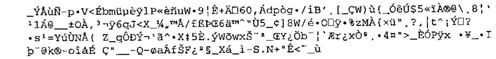

Let’s decode `u`, or, more correctly, `w`, which is equal to `a. i. u`

```j
   +x=:b code a. i. u
86 111 105 99 105 32 108 97 32 102 111 110 99 116 105
111 110 32 100 101 32 99 111 100 97 103 101 32 100 39
117 110 32 109 101 115 115 97 103 101 32 112 114 105
115 32 100 97 110 115 32 108 39 97 108 112 104 97 98
101 116 32 65 83 67 73 73 32 99 111 109 11...
```

and read it:

```j
   x{a.
```

Voici la fonction de codage d’un message pris dans l’alphabet ASCII complet. C’est la même fonction qui sert à décoder c’est à dire retrouver le message original à partir du chiffré puisqu’on lui passe en argument la matrice de transformation.

We have of course recovered the text and found the 7 extra spaces added as padding to make the text length a multiple of 10, in J simply `250{.v`

Knowing the matrix `a`, the function `dio` presented in [1] allows us to calculate `b` according to `p`. There exists an infinity of pairs `a,b` that work fine but we will not show here how to calculate matrices `a` that generate a matrix `b` that works… If you are interested (and I hope you are a rich businessman), please send an e-mail to the author.

## Implementing other transformations

This paper could have stopped here. The cipher algorithm just introduced is equivalent to a long XOR (XOR on the message with a key as long as the message) and the coding, as well as the decoding, is instantaneous.

But I will not stop there. Because this cipher is so quick, we can do 2 or 3 further transformations, similarly reversible, the decoding consisting of executing the transformations in reverse order.

I will only give a single example to save other equally if not more interesting transformations from public exposure, therefore increasing their effectiveness.

Those who wish to know other transformations *will* have to address the author who can provide a great many others. With APL and J one is never short of ideas. Warning: the usage of the cryptography is regulated. In the same way that you have the right to own a kitchen knife, but not the right to use it for unlawful purposes, you can publish revolutionary properties in mathematics, risking everything for fame, but remember you are being watched by big brother, in case you intend to use your discovery in forbidden ways.

In [2] I showed that there were 16 ways to calculate a remainder, all giving different results. Now is the time to show how this can be put to good use. Another revolution: Euclid had only thought of one way of doing this, and that idea lasted for centuries. [2] has passed unnoticed; will people take note of it now, after reading the example given here?

In fact I am not going to give a supplementary transformation yet, but only to substitute the APL (or J, it is the same) remainder primitive by one of the 16 possible remainders described in [2]. The 16 remainders are numbered 0 to 15, that implemented as primitive in APL or J corresponding to number 10.

Let us apply the same transformation on our sample text, this time with a different remainder: I will show that we obtain a different cipher but one that can be decoded by using the new definition of remainder. This is one of the ways I mentioned before to fool the hacker. But since it is given here you will probably want to look for others (or contact yours truly).

While this fact may not surprise everybody, it is still interesting to notice that the matrix inverse (modulo p) is the same whatever kind of modulo one takes. Yet the 16 remainders all give different results…

To keep the paper short, I will give examples in APL and using only matrices of order 4.

```apl
      +A←4 4⍴¯255+16?510
¯222  128  71 ¯138
  ¯1 ¯128 ¯89  ¯95
¯133  229 131  134
 ¯37  ¯82 ¯65   57
```

Calculating the determinant:

```apl
      DET A
¯62052270
```

Calculating the inverse modulo p=257 (note: we can take p=257 here, because we are not going to work on indices of characters):

```apl
      +B←A DIO P
 4 140 148 107
18 140 108  14
18  99  20 130
40  58 148  53
```

I will use the coding function described above called `CODE` (based on APL’s modulo primitive), and another function called `CODES` to distinguish it, which uses another modulo taken randomly from on of the 16 possible. Please notice that in [2] I hadn’t given a vectorised version of the 16 functions `RESIDUE0` to `RESIDUE15` but left it up to the reader to develop the extension, but since I need them now, I am going to use the vectorised version of `RESIDUEN`, `N` being passed as a parameter.

```apl
    ∇ Z←I MODV V;J;⎕IO;N;C;D
[1]   ⎕IO←0 ⋄ N←⍕I[1] ⋄ C←'Z←Z,',N,' RESIDUE',(⍕I[0]),' '
[2]   D←⍴V ⋄ J←0 ⋄ Z←⍳0
[3]   BO:⍎C,⍕V[J] ⋄ →(D>J←J+1)/BO
    ∇
```

In the coding function, I use the function `RESIDUE1` (taking the absolute value of the result). For those who do not have the paper and want to try the examples, here is the listing of the function `RESIDUE1`.

```apl
    ∇ Z←A RESIDUE1 B;⎕IO;TYPE;SGN;T
[1]   ⎕IO←0 ⋄ TYPE← 0 15 ⋄ SGN← 0 2 1
[2]   Z←A|B
[3]   →((A=0)∨B=0)/0
[4]   T←TYPE[SGN[1+×A]⍱SGN[1+×B]]
[5]   Z←⍎'A RESIDUE',(⍕T),' B'
    ∇
```

This calls `RESIDUE0`:

```apl
    ∇ Z←A RESIDUE0 B
[1]   ⍝ ALWAYS NEGATIVE
[2]   Z←B MODULON A
    ∇
```

which itself calls `MODULON`:

```apl
    ∇ Z←A MODULON B;Q;C
[1]   ⍝ THE RESIDUE IS ALWAYS NEGATIVE
[2]   Z←B|A
[3]   →(Z<0)/0
[4]   Q←(A-Z)÷B
[5]   Q←Q+×B
[6]   Z←A-B×Q
[7]   →((|B)≠|Z)/0
[8]   Z←0
    ∇
```

Here is the function a:

```apl
    ∇ Z←A CODES V;⎕IO;T ;N
[1]   ⎕IO←0 ⋄  T←⍳0 ⋄ N←1↑⍴A
[2]   BO:T←T,A+.×N↑V ⋄ V←N↓V ⋄→(0<⍴V)/BO
[3]   Z←|(1,P)MODV T
    ∇
```

Here is the test:

```apl
      +V←12?256
9 190 237 222 120 211 121 223 40 156 142 165
      B CODE A CODE V
9 190 237 222 120 211 121 223 40 156 142 165
      B CODES A CODES V
9 190 237 222 120 211 121 223 40 156 142 165
```

We recover the vector V on decryption.

But as we said, the cipher is not the same, therefore what is transmitted down the line (what the attacker tries to decipher) is different, and the poor, mystified hacker might as well go and take a running jump!

Here is the proof:

```apl
      B CODE V
142 211 144 140 86 88 232 248 19 114 105 60
      B CODES V
115 46 113 117 171 169 25 9 238 143 152 197
```

Bravo to those who have followed so far!

I will reward these brave and smart ones with yet an extra diversion. Some will have noticed that we use the 256 ASCII characters, some of which are not strictly *printable* even in APL. So, let us eliminate them: they are at indices 1 2 3 8 9 10 11 13 14 28 128 256 in the atomic vector `⎕AV` (origin 1). Here are the 244 survivors that we will call `AV`.

```apl
      AV
```

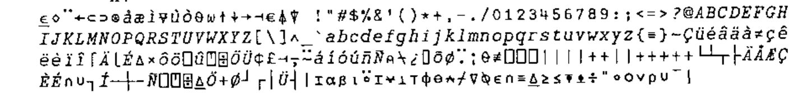

```apl
      ⍴AV
244
```

Note: remember that the characters (consecutive or not) can have the same printed form but a different code: in the vector AV all the codes are different.

There is an even number of characters in AV: I will take advantage of this fact. First I choose from this overabundant set only those characters that are really useful for writing a French text, padding if necessary to have a set with size 122. This will be the vector AL, our alphabet (the 1st character of AL is a blank).

```apl
      AL
```

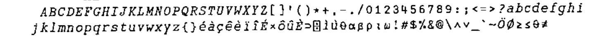

Since cryptanalysis is based on frequencies, a permutation of the original alphabet does not make an attempt at hacking a cipher more demanding. Nevertheless, I shall fool the enemy by making 2 different permutations of our alphabet AL and then concatenating them… This will likely lose him in the labyrinth of numbers.

```apl
      P1←122?122
      P2←122?122
      AL←AL[P1,P2]
      ⍴AL
244

      AL
```

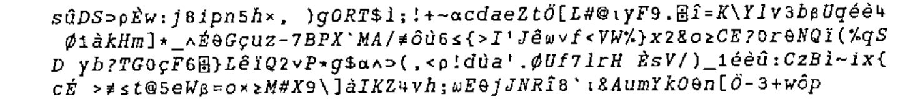

So, I have built a vector AL such that every character in the set of 122 different characters is found in 2 different places, once in the first part, and once in the second, generally in a different place.

Since the dyadic iota in APL gives only the first occurrence, searching for the index of any character of AL in AL will always give an index in the range [1, 122].

An example at random:

```apl
      AL ⍳ 'é'
61
```

This is where the function `IOTA` comes in handy to calculate the indices of all occurrences.

```apl
    ∇ Z←X IOTA Y
[1]   Z←(X=Y)/⍳⍴X
    ∇
```

Let us look for the 2 places where our character occurs in the table:

```apl
      AL IOTA 'é'
61 176
```

You have guessed the trick by now: I am going to use a modulo of 244 to give me numbers in the range [0,243], as if I was working with an alphabet of 244 characters.

For each character of the message M to be encrypted we found the corresponding index: its position in the `⎕AV`; now, we are going to pick its index randomly in one of the 2 repetitions in AL, so that the vector V representing the indices of the characters of M will consist of numbers in the range [0,243].

As usual we will calculate the transformed vector W also composed of numbers in the range [0,243], and for the cipher character vector C to be transmitted we will take from the indices W in the table AV on which we have carried out a complete permutation.

This permutation of AV is called AP (from the French *alphabet permuté*).

```apl
      ,AP←AV[244?244]
```

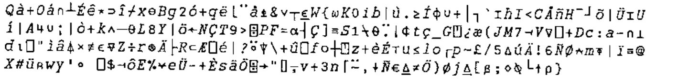

A possible pair of matrices A, B working in modulo 244 is as follows:

```apl
      A
 33 192 116 135
 55  11 173 173
238  97 132 211
  8  13 135 171

      B
176  15 128 243
 27  21 181 185
 44 174 193 109
179  23 216 211

      DET A
302408861
```

Listing of the test function:

```apl
    ∇ TEST X;⎕IO
[1]   ⎕IO←0 ⋄ P←∆∆P←244
[2]   'CALCULATION OF INDICES OF V'
[3]   N←4×⌈(⍴X)÷4 ⋄ X←N↑X ⋄ I←0 ⋄ V←⍳0
[4]   BO:V←V,(AL IOTA X[I])[?2]
[5]   →(N>I←I+1)/BO  ⋄ V
[6]   'CALCULATION  OF TRANSFORMATION OF INDICES'
[7]   W←A CODES V ⋄ W
[8]   'CALCULATION  OF THE CIPHER TO SEND'
[9]   C←AP[W] ⋄ C
[10]  'DECODING OF C'
[11]  '1) RECONSTITUTION OF W'
[12]  ⎕←W←AP⍳C
[13]  '2) RECONSTITUTION OF V'
[14]  ⎕←V←B CODES W
[15]  '3) RECONSTITUTION OF CLEAR'
[16]  AL[V]
    ∇
```

The message to send, code and decipher is:

```apl
      M
```

Maintenant, vous n’avez plus qu’à aller vous faire cuire un œuf!

Here is the test:

```apl
      TEST M
CALCULATION  OF INDICES OF V
85 157 11 13 192 195 13 33 13 192 17 18 54 110 229 0 167 13 96 157 54 195 78
 167 243 53 77 0 167 123 77 96 65 167 157 164 53 195 165 167 213 110 229 0 1
67 162 33 184 116 195 167 31 77 184 116 34 167 77 13 18 4 229 162 27
CALCULATION  OF TRANSFORMATION OF INDICES
132 182 118 159 37 77 154 243 29 146 56 79 66 123 174 163 166 95 58 168 189
80 48 158 201 59 61 148 221 37 131 22 103 55 111 42 134 212 26 133 187 162 1
52 111 109 48 180 167 79 165 44 167 205 243 144 162 167 221 219 150 75 188 1
8 28
CALCULATION  OF THE CIPHER TO SEND
```


```apl
DECODING OF C
1) RECONSTITUTION OF W
132 182 118 159 37 77 154 243 29 146 56 79 66 123 174 163 166 95 58 168 189
80 48 158 201 59 61 148 221 37 131 22 103 55 111 42 134 212 26 133 187 162 1
52 111 109 48 180 167 79 165 44 167 205 243 144 162 167 221 219 150 75 188 1
8 28
2) RECONSTITUTION  OF  V
85 157 11 13 192 195 13 33 13 192 17 18 54 110 229 0 167 13 96 157 54 195 78
 167 243 53 77 0 167 123 77 96 65 167 157 164 53 195 165 167 213 110 229 0 1
67 162 33 184 116 195 167 31 77 184 116 34 167 77 13 18 4 229 162 27
3) RECONSTITUTION  OF  CLEAR

Maintenant, vous n'avez plus qu'à aller vous faire cuire un ⊃uf
!
```

Let us note in passing that the indices in V are indeed in the range [0,243] and also that we have been careful to write ‘œuf’ correctly, which forced us to include the symbol corresponding to the APL `⊃` for the ‘œ’.

Reminder of other properties (for the cryptanalysts).

We reproduce the `TEST` function as far as the ciphering. In order to see the cipher produced, we name it `TESTC` :

```apl
    ∇ TESTC X;⎕IO
[1]   ⎕IO←0 ⋄ P←∆∆P←244
[2]   ⍝'CALCULATION OF INDICES OF V'
[3]   N←4×⌈(⍴X)÷4 ⋄ X←N↑X ⋄ I←0 ⋄ V←⍳0
[4]   BO:V←V,(AL IOTA X[I])[?2]
[5]   →(N>I←I+1)/BO  ⋄ ⍝ V
[6]   ⍝'CALCULATION OF THE TRANSFORMATION OF INDICES'
[7]   W←A CODES V ⋄⍝W
[8]   'CALCULATION OF THE CIPHER TO SEND'
[9]   C←AP[W] ⋄ C
    ∇
```

**Property 1:** The same message sent consecutively has nothing like the same cipher (caramba!).

If you experimented at home and did not obtain the same cipher as in the examples, please stop scratching your head: now, you (must) have understood!

Proof:

```apl
      TESTC M
CALCULATION OF THE CIPHER TO SEND
```

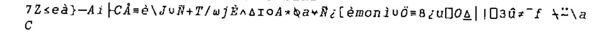

```apl
      TESTC M
CALCULATION OF THE CIPHER TO SEND
```

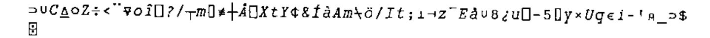

**Property 2:** If one shifts the message, even by one place, all is changed:

Proof: (to have the same cipher, it is enough to reset the random seed)

```apl
      ⎕RL←11111
      TESTC M
CALCULATION OF THE CIPHER TO SEND
```

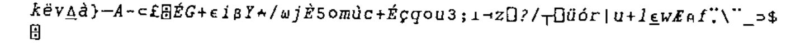

```apl
      ⎕RL←11111
      TESTC M
CALCULATION OF THE CIPHER TO SEND
```

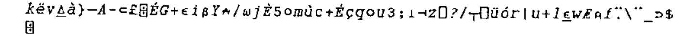

OK? Let’s go:

```apl
      ⎕RL←11111
      TESTC 1⌽M
CALCULATION OF THE CIPHER TO SEND
```

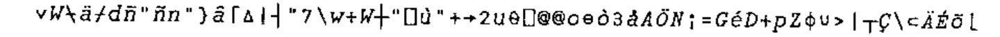

**Property 3:** Even if the random seed is reset, it’s enough to change a single character in an n-uplet for everything to change! (n being the order of the coding and decoding matrices.)

Here is a test:

```apl
      ⎕RL←123456789
      TESTC M
CALCULATION OF THE CIPHER TO SEND
```

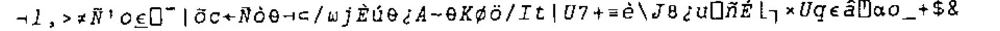

```apl
      U←(4×⍳16)+?16⍴4
      M1←M ⋄ M1[U]←'X'
      ⎕RL←123456789
      TESTC M1
CALCULATION OF THE CIPHER TO SEND
```


It is because at any position in the cipher there is effectively a random character, that we said this algorithm is equivalent to a XOR with a key as long as the message itself.

Any of you with a light in their eyes? If some find this brilliant, I hope that they will have understood!

Do you believe that:

1. a non-APLer would have been able to imagine and write that?
2. the non-APLers have understood? I have my doubts: we will experiment.

And now, go to your keyboards! And have fun.

Some grumpy spirits (or mad!) will still claim that this is decipherable.

OK, here is a text enciphered by this method: the person who can decipher it will have the right to see the next obstacle!

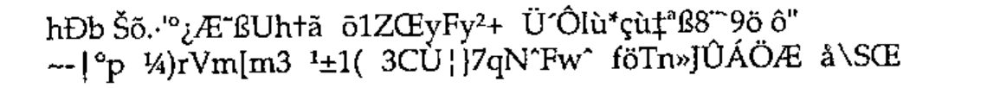

There are a lot of "gaps" in the cipher above, so let us give it in integer values to distinguish them (96 values):

```text
 88 219 214 172  66 181 208 197  39 119  93 200
 25  29   0  88  58   6 114 181  75  30 124 111
 37 111  98 201 144 138 189 155 184 176   3 131
176  52  71  29 125  13  28   4 203 172 159 162
 97   1  10 119 141   5  61 109 195 211 213 205
213 113 217  22 158  75 198 218 113 178  16 153
  7 163  73 157   9  37 171   9  12 173 203 174
 44 224 166 225 169 185 200 121  40  32 102 124
```

But I don’t think it is necessary to raise additional barriers… I remind my readers that the previous cipher is equivalent to producing a random character set… Let us just give the name of a single supplementary tool that one can use, tweaked or not: the exponential modulo.

Note: to make the vectors `v` and `w` more ‘random’ or more deceptive, one could take a vector `AV←(1024⍴AV)[1024?1024]`, which implies that each character of `⎕AV` is found there 4 times (in this case p=1024), and then do the same operation on `AL`. Then one would take `V←V,(AL IOTA X[I])[?4]`. Then do the same thing to `AV`. One could also, when coding, rotate `AV` one place each time: `AV←1⌽AV`, and when decoding do the opposite: `AV←¯1⌽AV`.

There are even worse (for the hacker) ways to mangle the ciphers, ways that come from the APL or J culture, but I shall keep them undisclosed for precaution.

## Conclusion

When one has APL and J tools (and knows how to use them…) it is useless to go mad with the prime numbers of the RSA. First of all, nothing proves that nobody has been able to factorise big numbers. Moreover, it is even possible to break the RSA without factorisation. And the same applies to other fashionable encryption schemes…

## References

[1] Michel J. Dumontier. Inversion matricielle modulo p, Systèmes linéaires modulo p. *Les Nouvelles d’APL* N° 35 pp. 45-54. Translated as Matrix Inversion modulo p, linear Systems modulo p, *Vector* 18.1. p.134

[2] Michel J. Dumontier. Residue and quotient revisited, *APL-CAM Journal*, Vol 13, No 2. Copyright 1991: Michel J. Dumontier

[2bis] Michel J. Dumontier. Résidu et quotient revisités. *Les Nouvelles d’APL* N° 35 pp. 33-44
