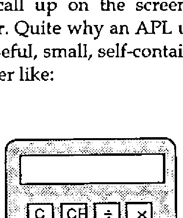
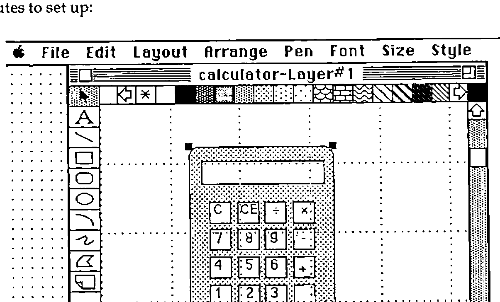

*by David Eastwood*
{ .byline }

## Introduction

It would appear that the APL community as a whole is now being given the chance to explore the world of windows. The 1990 Vendors’ Forum held recently in London by the British APL Association was almost entirely devoted to the impact of windowing environments on mainstream APL development. Here at MicroAPL we were delighted to be told by Adrian Smith (Vector 7.3 *Windows3: The Implications for APL*) that we were ‘laughing like drains’ about all this, and in fact we have been perfecting our drain imitations ever since.

On a more serious note, we have, via work on machines like the Apple Mac, been developing systems in a windowing environment for some time now and it would appear that a lot of the rules about working in these environments will apply irrespective of the flavour of window being used. The more that one studies the requirements of programming in a windowing environment, or, more correctly of programming a graphical user interface, the more it becomes apparent that certain general ‘rules’ exist. There are slight variations between the jargon used, for example, to describe using Windows3 and the Macintosh but the underlying principles are the same.

It is generally maintained that programming graphical interfaces is difficult. Articles discussing graphical interfaces quote figures like ‘adding twice as much again to the workload’ (Program Now, May 1991) when working with conventional programming languages. Graphical information is more extensive than text and requires more effort to specify it. Furthermore direct manipulation of the interface by the user of an application implies a different underlying program structure. The application must constantly monitor user actions which may affect one of many visible components. This jump in difficulty, together with the demands of producing applications which conform to the style guidelines in effect explains the proliferation of high level design aids for the creation of graphical applications.

Working in APL, we do not have these sorts of design tools directly available, although a lot of work is going on into producing interfaces to these tools. I shall be, in this article, illustrating the way in which a simple window-based application might be developed almost entirely in APL and also discussing the way in which one works in a full windowing environment. The work is carried out on the Apple Macintosh.

The facilities offered by an APL which purports to support windows can either be designed to give upwards compatibility with some previous non-windowing version or can be designed from scratch to take advantage of the environment in a way which is relevant to the environment. If one considers the latter route, it would further appear that an APL programmer is placed in a position analogous to the programmer considering using, for example, AP124. The programmer can either choose to build the application ‘by hand’ or can write or find some screen development utilities. In building the sample application discussed here, I have chosen to use non-APL development aids to illustrate that there are perfectly well invented wheels available.

## The Application

Most windowing environments include a ‘calculator’ facility which allows the user to call up on the screen a functional picture of a very simple pocket calculator. Quite why an APL user might want to do this I won’t say, but it does offer a useful, small, self-contained application to develop. The calculator should look rather like:



with a few basic arithmetic functions and the usual clear buttons. The user can either click on the appropriate button on the picture or hit the equivalent key on the keyboard.

## Initial Design

The easiest way to implement the calculator is to draw a picture of the calculator on the screen and to identify certain regions of the picture as graphical input regions (i.e. the calculator buttons) and other regions as output areas (the calculator display). The entire picture will then be placed in its own window, allowing it to be moved around the screen and ‘closed’ via a standard close box. The application requires a fixed sized window and so the calculator window will be declared without scroll bars. This decision will drastically simplify the programming requirements since the application will not need to retain all sorts of global information about current window size, relative position of the scroll bars and so on. The APL application can leave a lot of the window handling to the APL interpreter and underlying operating system but there are four specific ‘events’ (more on this later) which need to be handled by the application:

- Key down
- Mouse click
- Window redraw request
- Close window

The third will require the most handling. Because we have chosen a picture as the basis of the application, the APL application will have to redraw the picture each time the system issues a redraw request. This request will be issued when the calculator window has been overwritten by one of the other windows on the system (for example by moving another application over the calculator and then uncovering it again).

## Graphical Design

The picture of the calculator can be produced in one or a number of ways. It could be drawn within APL by first drawing it on graph paper and then writing some simple graphics code using line and curve drawing graphics calls. A more elegant approach might be to produce some screen design tool within APL.

A third, and I think easier route, is to select a good drawing package such as MacDraw and use that. With MacDraw the calculator layout below took about 10 minutes to set up:



Once the drawing is done it can be copied into the system clipboard and then read into APL:

```apl
      CALC←GETCLIP 1   ⍝Utility to get a picture from the clipboard
      ⍴CALC            ⍝Picture is held as a small integer variable
383
      6↑CALC
100270079 ¯65363 7803137 ¯1610579296 9175296 184549375
      PICRECT CALC     ⍝Another utility shows the size -
0 0 173 119            ⍝ top left to bottom right
```

Now that the picture is ‘in APL’ we need to collect some information about the dimensions of the picture. Again, rather than doing this manually, it is very simple to collect the coordinates of active regions of the picture via some APL code. First we put the picture in a window (window number 10 is used here), and then a small function is used to collect the coordinates.

```apl
    ∇R←FOO
[1]  'CALC' NEWWINDOW 10 100 100 270 220 1 104 1,7⍴0
[2]  DRAWPICTURE CALC ⍝      Set up window and draw picture
[3]  ARROW ⍝                 Arrow pointer
[4]  R←GETCOORDS 10
[5]  DISPOSEWINDOW 10 ⍝      Close the window again
    ∇ 1991-05-24 16.50.33

    ∇ R←GETCOORDS WI
[1]  ⍝ Utility to get mouse coordinates in window <WIN>
[2]   WIN SETEVENTMAP 1 1 3,11⍴1 ⍝ Just pick up mouse events
[3]   R←0 2⍴0
[4]  L:'Click on a point, hit same point twice to quit'
[5]   →(0∊⍴X←GETEVENTS)/⎕CL ⍝ Loop till an event happens
[6]  L1:→(0∊⍴X)/L ⍝          No more events to process, get more
[7]   →(~(WIN,3)≡X[1;1 2])/EL1 ⍝ Must be right wdw, event type
[8]   'Position marked :',⍕,X[;4 5]
[9]   '((¯1 2↑R)≡X[;4 5])/EXIT
[10]  R←R,[1]X[1;4 5]
[11] EL1:X←(1,1↓⍴X)↓X ⋄ →L1
[12] EXIT:'Exit request'
    ∇ 1991-05-24 14.15.15
```

## The APL Coding

We now have a picture of the calculator, and we know its size and the coordinates of points that interest us. Now for the actual APL application. The key point to bear in mind when starting a windowing application in APL (or indeed in any language) is that the application will be ‘watching’ the various events that take place in the environment, discarding some and processing others. Once in a while some additional processing will take place - in this case doing some arithmetic for the calculator. As an aside, my definition of an **event** is ‘something happening’ rather than an APL error - I have always suspected that equating events to errors is a function of what you subconsciously expect your code to produce.

In a windowing environment, it is the responsibility of the application to maintain the contents of its window. The underlying system software (in this case the Mac operating system) will inform the application of events that affect its window (or windows). Some events can be managed by the underlying environment but some will need to be handled by the application. In this example application, quite a lot of the window update has to be carried out by the application since the window contents are graphical and the Mac does not ‘remember’ graphical commands. Were we using a text-only window, then the
 redraw functions could be left to the operating system and we would merely note the revised positions.

Rather than list the entire application code, which will only be of direct use to the Mac user, I have reproduced the ‘skeleton’ function that I use to build my event handlers. As you will see from the comments, the sequence required is to define the window to be used for the application, then to indicate which events are to be monitored. This is setting up a mask of those events which are both likely to happen and also which will affect the application. You will note that the right argument to `NEWWINDOW` contains a window size which derives from the picture itself (elements 2 3 4 5 of the right argument are top left, bottom right of the window). As far as the event handling is concerned (the function `SETEVENTMAP`), the options are:

| | |
|---|---|
| 0 Ignore the event | 1 APL handles the event |
| 2 Pass event to user | 3 APL handles the event and informs the user |

and the right argument of `SETEVENTMAP` is set accordingly.

```apl
    ∇SKELETON;WIN;EVENTS;OLDEST
[1]  ⍝ Skeleton event handler
[2]  ⍝ Define the window to be used e.g.:
[3]   WIN←10 ⍝ Window to be used by application
[4]   WIN NEWWINDOW 10 100 100 270 220 1 104 1,7⍴0
[5]  ⍝
[6]  ⍝ Set Event Map
[7]  ⍝ Set the right argument for events to be monitored e.g.:
[8]   WIN SETEVENTMAP 3 1 3 1 1 1 1 1 3 3 1 1 1 0
[9]  ⍝        *********** EVENT HANDLER ************
[10] L0:ARROW ⍝                       Set pointer to arrow
[11] L1:→(0=1↑⍴EVENTS←GETEVENTS)/L1
[12] L2:→(0=1↑⍴EVENTS)/L0 ⋄ OLDEST←EVENTS[1;]
[13]  EVENTS←1 0↓EVENTS
[14] ⍝                                Handle Events
[15] ⍝ Insert labels and code for those events being handled
[16]  →(EV1,L2,EV3,L2,L2,L2,L2,L2,EV9,EV10,4⍴L2)[OLDEST[2]]
[17] ⍝
[18] ⍝ Each event processor will process its event
[19] ⍝ then (usually) return to L2
[20] EV1:⍝            EVENT - KEYDOWN
[21] EV3:⍝            EVENT - MOUSE DOWN
[22] EV9:⍝            EVENT - REDRAW
[23] EV10:⍝           EVENT - CLOSE
[24] EXIT:DISPOSEWINDOW WIN
    ∇ 1991-05-24 14.32.45
```

The various types of events (14 in all) that might need to be processed (line 8 above) are:

| | | | |
|---|---|---|---|
| 01 Key Down | 02 Key up | 03 Mouse Down | 04 Mouse up |
| 05 Menu Select | 06 Disk insert | 07 Activate window | 08 Deactivate window |
| 09 Redraw window | 10 Close window | 11 Move window | 12 Resize window |
| 13 Full window | 14 Scroll window | | |

In this rather simple application, there are only four events to be handled - and indeed the ‘Close’ handling could just as easily be a branch to 0 to quit the application. In a larger application, you might wish to ask for a confirmation from the user before shutting down.

If the user hits a key, it can be validated against a list of the keys on the calculator. Equally a mouse click can be checked against the ‘active’ regions matrix. The extract shown below illustrates that part of the main function which checks mouse clicks:

```apl
[31] EV3:⍝                         Event - Mouse down
[32]  →(0=BUTTON←OLDEST[6 7]WITHIN COORDS)/L0
[33]  CHAR←CHARS[1;BUTTON] ⍝  Find which 'button' was pressed
[34] STR:⍝                         Process string
```

The event being processed (`OLDEST`) contains window-relative mouse coordinates which are checked against a global variable `COORDS` by the function `WITHIN`. Once it has been established which button on the calculator has been pressed control passes to the calculator string handler to either adjust the display on the calculator or to carry out some arithmetic prior to doing so.

Interestingly enough, it was this arithmetical part of the code that proved the most difficult. I was surprised at the amount of processing logic built into even the simplest pocket calculator. Overall, however, other than standard Mac utilities, only three functions were written:

| | | |
|---|---|---:|
| `GO` | The main event loop | 47 lines long |
| `WITHIN` | Routine to validate active regions | 9 lines long |
| `PROCESS` | Calculator logic | 49 lines long |

About half of each function was comment. The APL.68000 utilities used are generally direct calls to the operating system via a cover function. The cover function generally does little more than validate the arguments and allows the parameter passing to be carried out in a manner suited to an APL function.

## Design Considerations

One can begin to get a flavour of the sort of code required in a graphical application, even from a simple example like the one used here. Richard Nabavi, in a paper at APL89 (*APL Windowing Systems - where next?*) suggested developments in APL whereby the need for the sort of central event loop shown here is removed and instead a number of independent functions are used, each one being ‘woken up’ by a specific event or events.

A further feature of this type of application is the number of global variables needed to manage the application. Traditional full-screen applications have always demanded a lot of global screen information but graphical applications need even more. The need to log information about the state of a window is further increased by the fact that it is difficult to predict the sequences of events that will lead to a particular function being used. For example, within a windowing environment, an application option can usually be selected by a double-click of the mouse or a single click and a menu selection. To process this within APL will require knowledge of where the mouse is when it is clicked, **when** it is clicked (to check for a double-click) and which menu options are valid for that selection.

The calculator functions used globals for

- Coordinates of calculator buttons
- Characters linked to calculator buttons
- Indicators to show whether the calculator button was a number or a fn
- Window and picture size information

but as I have said earlier, we have avoided a number of other requirements for globals by using a fixed sized window. An application requiring a window to contain text (which may be bigger than the window, especially if the window is resized) would need to register information about

- Current window size
- Position of scroll bars
- Text selected (if any)

and dialog boxes (again avoided here) need information on their layout, the state of any radio buttons and so on.

It should be emphasised that the APL application is only concerned about what is going on inside the window. Where the window is does not concern us. The system will inform the APL application if any other applications or windows have corrupted the contents of our application window merely by signalling a Redraw event.

When writing an application which uses multiple windows, the programmer has a choice of continuing with the single event handler shown above, or starting to use an event loop for each window. This latter approach can be taken to the extent that each window within the application is controlled by a single APL task and the tasks communicate via shared variables.

## Conclusions

Once a few basic tricks are learnt, working in a windowing environment can be quite easy. It is important to think out the requirement in advance, and certainly the initial choices of visual effects to be used can have a profound effect on the complexity of the code.

It is also interesting to discuss the way in which the work was done. Producing the calculator application was fairly fast, and certainly being able to use a package like MacDraw made the front end design much easier. At a recent seminar held by IBM UK, we were told that a survey of Fortune 500 PC users showed an **average** of 1.6 applications per PC. When a fully integrated and consistent graphical environment (note those two qualifications) was installed, the number of applications per PC rose to 7. This has been the case on the Mac in my experience.

All the applications that run on the MAC have a consistent user interface (no need to read manuals) and can pass data to one another without any great struggle. Using the non-APL drawing tool to draw my front end saved time and a single clipboard operation took the pertinent data into APL. The real benefit came at the end however. Any proper system needs documenting, and this article could be said to approximate to the documentation for the application.

In common with many other APLers I have spent literally years battling with the problem of printing APL documentation. One needs to find an APL font, then to persuade a wordprocessing package to use it and finally one needs to get a printer to condescend to print the stuff. That’s assuming you can move the code to the word processor in the first place. On the Mac, the fact that one application has a special font means that **all** applications can use it, and if the text can be shown on-screen, then it can be printed. Finally, how easy is it to include pictures?

In order to produce this article I used four applications, and usually there were at least two running simultaneously. The packages were:

- MacWrite
- MacDraw
- MacPaint
- APL.68000

I used MacDraw to produce the calculator image in the first place. Then MacPaint allowed me to edit a screen snapshot, cutting it down a bit and resizing it. I used the wordprocessor MacWrite for the article itself. Pictures are imported into MacWrite via the clipboard and treated as rather large characters. The APL examples came over as text via the clipboard and on occasions went back again to check that alterations I made in the wordprocessor could still actually be executed. That last point is actually very important considering function documentation - how often has some small typesetting change introduced an error into a listing?

Considering the pros and cons of actually using APL at all for this sort of application, I think it can be fairly said that APL at least holds its own against some of the applications generators. If the graphic design element can be done easily, then the internal processing seems to work quite well in APL. The APL code still seems quite a lot less verbose than alternative systems and the array handling facilities can be helpful when having to process responses to events in lots of different graphical regions or within a large dialog box. It is also the case that APL’s calculative facilities are light-years ahead of those offered in many of the other development environments. In order to get my calculator logic sorted out, I only had to shuffle the input to allow a line like:

```apl
[32] RES←⍎NUM1,FN1,NUM2
```

to be executed. The calculator could then have been extended to allow all sorts of arithmetical functions to be run.

In speed terms (usually APL’s downfall with this sort of application) the APL calculator was somewhat slower than the built-in Mac calculator, but could keep up with my fastest data entry, which is what counts.
