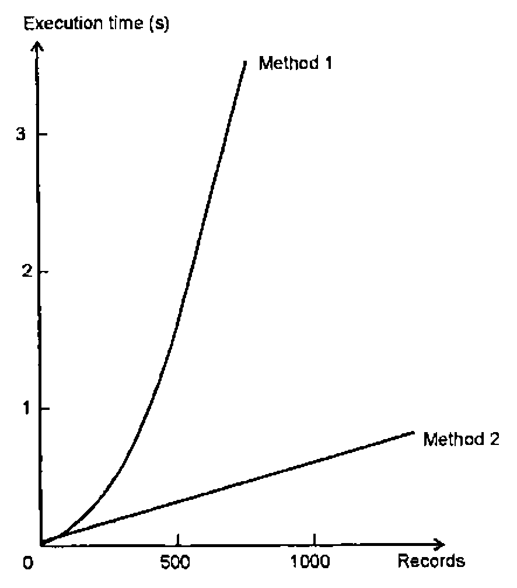

*by David Eastwood*
{ .byline }

When I am attempting to teach APL I usually place program efficiency quite low in my choice of priorities, behind such considerations as legibility, portability and reliability. There does come a time, however, when your APL system simply takes too long to run and you need to do something about it.

Making APL run faster can be addressed in a number of ways, some of which are quite drastic. You might:

- buy a better computer
- speed up your APL code
- get a new programmer
- use something other than APL

… or some combination of the above. For owners of microcomputers, the option to replace hardware is not as flippant as it may first appear given the relative costs of hardware and programmer time, but it may not offer much to the mainframe user. The ‘why did you choose APL in the first place?’ debate is entertaining and indeed I would like to explore on some other occasion the topic of the sort of problem for which APL is not the right choice (yes, there are some!). What I will be doing here is to discuss some of the means to make your APL code run faster.

The options available include:

- better data design
- changes to APL code
- introduction of non-APL code via Auxiliary Processors or APL compilers

I shall confine myself here to considerations of APL code design, touching briefly on the use of non-APL routines. Often, of course, simple observation of a system will indicate that there are one or two routines that are the major bottlenecks. Attention should be focussed on these areas rather than protracted efforts to make everything run faster.

These notes are drawn from a number of sources (see References), almost all of which, unfortunately, are either out of print or not generally available, so this presentation is offered as a means to reissue some of this earlier material, together with some of my own additions.

One of the great joys of APL is that the programmer does not have to worry greatly about the well-being of his computer. You can choose an algorithm and let the computer worry about the type of data being used, how much storage space to allocate and so on. Inevitably, when considering the speed at which things happen you do have to think about the internal workings of APL but I shall be remaining firmly in the realm of observations that are reasonably universal.

Bear in mind that an APL interpreter can be considered as a large collection of routines for data manipulation and so it should be obvious that there will be some that are more efficient than others. In addition interpreter writers add special algorithms for special cases, for example `∧.=` for string search might be a candidate for a special routine. Under these circumstances you will always find performance quirks. It is not really a good idea to code to suit interpreter quirks since the interpreter writers are usually on the lookout for sections of code that can be improved in the next release (especially anything that might be seen as a benchmark).

Any timings shown will be shown for 4 interpreters — APL\*PLUS/PC (v9), APL\*PLUS II (v4), APL2/PC (v1.02) and APL.68000 Level II (v2). I am using the co-processor version in each case. Timings are in milliseconds and the PC versions run on the same 20Mhz 386-based machine. The APL.68000 ran on an Apple Mac II which is of roughly the same performance.

## APL Internals

As far as I am aware, all APLs store data in roughly the same way. As a user you will be accustomed to distinguishing between character and numeric data (I hope) but an APL interpreter will further distinguish between a number of types of numeric data which usually include:

- Boolean
- Integer
- Real

Some APLs will introduce further data types such as complex numbers. Different amounts of storage space will be allocated to these different types of data, for example 1 bit per element for Boolean data or 64 bits per element for Real data. The APL interpreter will change the representation of the data as required. In general, an interpreter will not check data for an optimal representation at every possible point — it would put an intolerable overhead on performance. Instead a number of rules are often followed, for example:

- `⌈` or `⌊` must generate integers
- `÷` must generate reals
- `=` must generate booleans
- numbers above a certain size must become real

There are a couple of implications here.

I have, for example, seen a number of ways to store the date as a single number:

```apl
199210   or   1992.10   for November 1992
```

You might have chosen one or other of these representations because of the way you wished to split the number back into Year and Month but you should bear in mind that an integer representation of data (`199210`) will usually take up half the space of a real number version (`1992.10`), and in some cases even less.

Nearly all APLs will store boolean data as 1 bit per element and character data as 8 bits per element and choices of data representation under these circumstances can be even more important. The exception here is APL\*PLUS/PC which regards boolean data as 16-bit integer. Thus:

```apl
LIVE_ACCOUNTS ← 'YNYNNNNNYY'
```

will usually take up 8 times as much space as

```apl
LIVE_ACCOUNTS ← 1 0 1 0 0 0 0 0 1 1
```

without significantly improving the legibility of the code since most APLers are quite happy with the convention that 1 means ‘yes’.

In terms of speed of execution, your choice of data representation can have an impact. Arithmetic with real numbers will generally be slower than integer arithmetic on two grounds:

- Increased complexity of operation
- Comparison Tolerance (the measure of ‘exactness’ used for comparision operations).

Consider these two operations:

```apl
A←1000?1000
B←A÷100

A←A,1001
B←B,10.1
```

| (50 *Executions*) | *APL.68000* | *APL\*PLUS/PC* | *APL2/PC* | *APL\*PLUSII* |
|---|--:|--:|--:|--:|
| `R←1001⍳A` | 116 | 110 | 880 | 380 |
| `R←10.1⍳B` | 7667 | 1430 | 2310 | 2030 |

Note that I have been careful to put the ‘target’ at the end of my search object.

Moving on from consideration of the amount of space taken up by data to the way in which it is stored, you will find that APL interpreters generally store variables in the same way in the workspace. The interpreter maintains a Symbol Table which points directly or indirectly to an area of memory where the actual data that makes up a variable is held. If you could examine the makeup of a variable you would see something like this:

```text
 -----------------------------------------------------
|   HEADER     TYPE     RANK .    SHAPE     DATA      |
 -----------------------------------------------------
```

and the data is usually held in row by row order (in other words the order in which you would see the data if you used the ravel function).

Thus a matrix:

```apl
MAT←2 3⍴⍳9
```

would look like

```text
<HEADER BYTES> <CODE FOR NUMERIC> <2> <2 3> <1 2 3 4 5 6 7 8 9>
```

You would expect that APL operations that merely adjust the shape of data rather than the content (ravel, reshape etc.) should be very fast indeed. Whenever the content of a variable is changed APL will have to do a greater or lesser amount of work in terms of moving or rearranging this data around within the workspace, and this leads conveniently into the next topic.

## Giving the Interpreter an Easy Time

It would seem reasonable to predict that the less you make the APL interpreter do the quicker the job will be done. Turning this prediction into reality can sometimes be difficult. Is it quicker to use the more complicated APL primitives? Is it quicker to use one-liners or loops?

I shall run through a number of examples.

**(i) Joining data.**

Given the way in which APL stores data internally you should be able to predict that it is significantly quicker to join data along the first dimension rather than the last. Thus when APL is asked to append a row to a matrix, the new data is just joined to the end of some existing data and copied within memory whereas appending a column to a matrix will require the merging of two sets of data as it is copied.

Thus for

```apl
A←100 100⍴100
B←100?100
```

| (50 *Executions*) | *APL.68000* | *APL\*PLUS/PC* | *APL2/PC* | *APL\*PLUSII* |
|---|--:|--:|--:|--:|
| `R←A,[1]B` | 617 | 990 | 1710 | 490 |
| `R←A,[2]B` | 883 | 7580 | 2310 | 600 |

Bear this in mind when you are designing your data structures.

**(ii) Numbers of operations.**

A simple consideration of the number of operations carried out by APL should also enable you to find some extra performance. First consider an example which adds up a number of invoices and adds VAT:

```apl
VAT←1.175
INVOICES←0.01×1000?1000
```

| (50 *Executions*) | *APL.68000* | *APL\*PLUS/PC* | *APL2/PC* | *APL\*PLUSII* |
|---|--:|--:|--:|--:|
| `R←VAT×+/INVOICES` | 500 | 490 | 270 | 930 |
| `R←+/VAT×INVOICES` | 1250 | 4670 | 660 | 1590 |
| `R←VAT+.×INVOICES` | 8600 | 9550 | 2800 | 1760 |

In the first example we have 1 multiplication and 1000 additions, in the second we have 1000 additions and 1000 multiplications. Using a fancy operation doesn’t reduce the amount of work the interpreter has to carry out, in fact the extra power of inner product is ‘wasted’ on this example.

Often the theory that ‘parentheses are bad’ will lead APLers into producing code that is slower than it need be. Here are a couple of ways of computing an average, the obvious way and the ‘look, no parentheses’ way:

```apl
A←1000?1000
```

| (50 *Executions*) | *APL.68000* | *APL\*PLUS/PC* | *APL2/PC* | *APL\*PLUSII* |
|---|--:|--:|--:|--:|
| `R←(+/A)÷⍴A` | 316 | 660 | 270 | 550 |
| `R←+/A÷⍴A` | 1680 | 5770 | 1480 | 2850 |

The next example is less obvious but illustrates the penalty that can be attached to type conversion (as well as the performance implications of real versus integer arithmetic):

```apl
A←1000?1000
B←2.5
```

| (50 *Executions*) | *APL.68000* | *APL\*PLUS/PC* | *APL2/PC* | *APL\*PLUSII* |
|---|--:|--:|--:|--:|
| `R←B++/A` | 300 | 610 | 220 | 490 |
| `R←+/A,B` | 1366 | 5050 | 610 | 1260 |

A final example on this particular topic shows two alternative ways to generate a vector of numbers from A to B:

```apl
A←1000
B←10000
```

| (50 *Executions*) | *APL.68000* | *APL\*PLUS/PC* | *APL2/PC* | *APL\*PLUSII* |
|---|--:|--:|--:|--:|
| `R←A↓⍳B` | 1300 | 2420 | 3960 | 1920 |
| `R←A+⍳B-A` | 1250 | 11090 | 60 | 2630 |

The first operation requires a simple drop after the `⍳` whereas the second will require a whole series of additions. You would expect the `⍳` operation to be quite quick and the drop does not require a vast amount of internal data manipulation. With the numbers chosen above, the second expression requires one subtraction, one `⍳` operation and then 900 additions. The first expression requires one addition, one `⍳` operation and then one `↓` operation.

For the size of data chosen here, there are no immediate conclusions except that there may be something a bit odd going on with APL\*PLUS/PC. The results for APL2/PC illustrate nicely the importance of not reading this sort of note too uncritically. APL2/PC has a special data type called an ‘Arithmetic Progression Vector’ which is held as just a few bytes. The sort of operation shown above is ideal for this type of data structure.

**(iii) Ways to select data.**

There are a number of ways to select data, and all APLs will offer:

- Reshape
- Take/Drop
- Compression
- Indexing (`[]` or `⌷`)

The functions are listed in increasing order of sophistication. Reshape will only offer data starting from the beginning. Take and drop will select data from the beginning or end of a variable but can only offer a ‘chunk’ of the data in an unsorted form. Compress will select data from points throughout the variable but cannot vary their relative positions. Indexing can select data from anywhere in a variable and present it in any order.

```apl
A←100 100⍴10000?10000
B←1 1,98⍴0     ⋄     C←⍳2     ⋄     E←⍳100
```

| (50 *Executions*) | *APL.68000* | *APL\*PLUS/PC* | *APL2/PC* | *APL\*PLUSII* |
|---|--:|--:|--:|--:|
| `R←2 100↑A` | 84 | 110 | 60 | 160 |
| `R←¯98 0↓A` | 84 | 110 | 50 | 160 |
| `R←B/[1]A` | 84 | 7530 | 160 | 220 |
| `R←A[C;E]` | 450 | 330 | 110 | 250 |

Again a couple of anomalies, but on the whole the more complex operation is slower. A sensible conclusion to draw from the results above is to use the simplest function that satisfies your requirements.

## Further Tricks and Tips

None of the examples discussed so far has been other than fairly legitimate APL code but many optimisation techniques do begin to stray into the realms of somewhat dubious style. I shall offer a few borderline examples here.

**(i) Predeclare data**

Although one of the strengths of APL is the way in which you can continuously change the shape, size and type of data you can pay a performance penalty for this power.

Very often you know the shape and size of a result before you start. You might, for example, be reading a known number of records from a file. Consider the difference between setting up an empty data variable before you start and performing continuous appends.

This example simulates reading 1000 records into a variable:

```apl
    ∇ APPEND;I;L
[1]   R←0 20⍴' '
[2]   I←1
[3]   L←(1000⍴LN),LX
[4]  LN:R←R,[1]20⍴'DUMMY DATA'
[5]   →L[I←I+1]
[6]  LX:
    ∇

    ∇ INDEX∆IN;I;L
[1]   R←1000 20⍴' '
[2]   I←1
[3]   L←(1000⍴LN),LX
[4]  LN:R[I;]←20⍴'DUMMY DATA'
[5]   →L[I←I+1]
[6]  LX:
    ∇
```

| (50 *Executions*) | *APL.68000* | *APL\*PLUS/PC* | *APL2/PC* | *APL\*PLUSII* |
|---|--:|--:|--:|--:|
| `APPEND` | 5816 | 13730 | 5940 | 8570 |
| `INDEX∆IN` | 3400 | 4230 | 3840 | 2080 |

You should note that in the example above the differential between the two methods does not remain constant — the time taken for progressively larger catenation operations is not linear as this graph from Smith [1] shows:



**(ii) Style of loops**

Variations of looping style can affect the speed of execution. Consider these four functions that do the same job with marginal differences in looping style:

```apl
    ∇ LOOPS1;Z;I;A
[1]   ⍝ METHODS OF LOOPING
[2]    A←?100 4⍴1000
[3]    I←1
[4]   LNEXT:Z←+/A[I;]
[5]    →((1↑⍴A)≥I←I+1)/LNEXT
    ∇

    ∇ LOOPS1A;Z;I;A;ROWS
[1]   ⍝ METHODS OF LOOPING
[2]    ROWS←1↑⍴A←?100 4⍴1000
[3]    I←1
[4]   LNEXT:Z←+/A[I;]
[5]    →((ROWS)≥I←I+1)/LNEXT
    ∇

    ∇ LOOPS2;Z;I;A;L
[1]   ⍝ METHODS OF LOOPING
[2]    A←?100 4⍴1000
[3]    I←1
[4]    L←((1↑⍴A)⍴LNEXT),LX
[5]   LNEXT:Z←+/A[I;]
[6]    →L[I←I+1]
[7]   LX:
    ∇

    ∇ LOOPS3;Z;I;A;L
[1]   ⍝ METHODS OF LOOPING
[2]    A←?100 4⍴1000
[3]    I←1
[4]    L←((1↑⍴A)⍴LNEXT),LX
[5]   LNEXT:Z←+/A[I;]
[6]    I←I+1
[7]    →L←1↓L
[8]   LX:
    ∇
```

| (1 *Execution*) | *APL.68000* | *APL\*PLUS/PC* | *APL2/PC* |
|---|--:|--:|--:|
| `LOOPS1` | 467 | 550 | 610 |
| `LOOPS1A` | 383 | 440 | 500 |
| `LOOPS2` | 316 | 390 | 380 |
| `LOOPS3` | 370 | 440 | 490 |

*LOOPS1* is probably the way most people would write the code, but note the speed improvement that comes from carrying out the test for the number of rows in our matrix just the once rather than every time round the loop.

*LOOPS2* and *LOOPS3* show an alternative scheme in which a vector of line labels is computed before the loop, quite a common technique when the number of iterations is known in advance. *LOOPS2* is indeed a bit quicker than *LOOPS1* but only marginally faster than *LOOPS1A*. *LOOPS3* introduces the penalty of repeated `↓` operations.

**(iii) Format and execute**

It is not a good idea to have to change the format of data from character to numeric — the process can be quite slow. A common problem with systems that have ‘evolved’ is that data undergoes repeated type conversions because the initial phase of data analysis has been skimped. See what sort of overhead is introduced by having to convert from character to numeric before doing some arithmetic.

```apl
A←,(⍕1000 1⍴1000?1000),' '
B←1000?1000
```

| (50 *Executions*) | *APL.68000* | *APL\*PLUS/PC* | *APL2/PC* | *APL\*PLUSII* |
|---|--:|--:|--:|--:|
| `R←1+⍎A` | 15050 | 16310 | 11150 | 17640 |
| `R←1+B` | 400 | 1100 | 280 | 550 |

You should also remember that execute is doing just that, executing the APL statement. The following example arose recently when we did have to execute a text string. We were given some ‘comma delimited’ data (a common sort of interchange format) and we executed it without considering the penalties:

```apl
A←¯1↓,(⍕100 1⍴⍳100),','
B←,(⍕100 1 ⍴⍳100),' '
```

| (50 *Executions*) | *APL.68000* | *APL\*PLUS/PC* | *APL2/PC* | *APL\*PLUSII* |
|---|--:|--:|--:|--:|
| `R←⍎A` | 4117 | 1150 | 930 | 1540 |
| `R←⍎B` | 1550 | 280 | 220 | 330 |

See what all those hidden catenations did.

**(iv) Use the utilities or system functions**

It is worth investigating well-written utilities as these can often usefully replace ‘raw’ APL. Some APL interpreters will supply special system functions or assembly language routines to help speed up operations that are not particularly quick in APL.

Prime examples would be String Search (`⎕SS`), Matrix to Vector conversion (`⎕BOX` or *VTOM*) and Delimited Blank Removal (`⎕DBR`). String Search, for example, in ‘raw’ APL often uses the `∧.=` inner product. This is undoubtedly elegant in terms of code but horrendously wasteful of time and space. Each character of a string is examined for a match rather than carrying out only enough checks to see if a match is possible. Large intermediate and final results are generated.

If you do seek to replace a bit of your code with an imported utility or system function, do look out for minor differences in behaviour, especially under boundary conditions.

**(v) Looping or non-looping**

I will not offer any specific examples here. APL’s array-handling capabilities and powerful range of functions and operators allow many operations to be carried out in a single line of code. In principle this should be the best way to do things — you are avoiding the overhead of APL having to interpret lines of a function over and over again. On the other hand the non-looping solution may be achieved at the expense of workspace overhead (using `∧.=` for string search, for example).

## Not Using APL

APL is not going to do very well with problems involving many repetitive (simple) operations on small amounts of data. A prime example here might be where a computation depends on the result of the previous computation.

Under these circumstances, the APL programmer can do a certain amount to speed up his APL code but in the end he may have to consider calling non-APL routines. These might either be via an Auxiliary Processor, `⎕NA` or one of the ‘APL compilers’. This route needn’t be as arduous as you might imagine.

We were recently asked to supply an Auxiliary Processor to compute a Cyclic Redundancy Code (the famous CRC code that always crops up when something has broken). The algorithm involves Modulo-2 long division which in turn requires a long, looping APL solution. We found that, once we had understood the Maths involved, it took roughly the same amount of time to write the answer in both APL and Assembly Language (using two programmers who were of equivalent expertise in APL and Assembly Language respectively). The Auxiliary Processor was 480 times faster than the APL solution.

I quote this example because in one of the sources I have used (Wiedmann) he quotes an identical job done in the early 80s at STSC. Their Assembly Language solution was 860 times faster!

Those who like to compare the ‘size’ of APL solutions versus other languages might also like to note that this is also an example where APL doesn’t give you a vast advantage in terms of code size. The APL solution was 12 fairly complicated lines of code and the Assembler source that actually did the work was 32 lines (albeit with another 30 or so lines for the APL-AP interface).

## References

| | |
|---|---|
| Smith[1] | *A Design Handbook for Commercial Systems*, Adrian Smith, J Wiley, 1982 |
| Smith[2] | *Stone-walling in APL*, Adrian Smith, Vector Vol 9 No 1, July 1992 |
| Sykes | *Use and Misuse of APL*, Roy Sykes, STSC, 1973 |
| Wiedmann | *Efficiency in the APL environment*, Clark Wiedmann, Proceedings APL85 |
| Eastwood, Poate | *APL Programming Techniques*, David Eastwood & Robert Poate, MicroAPL training material |
