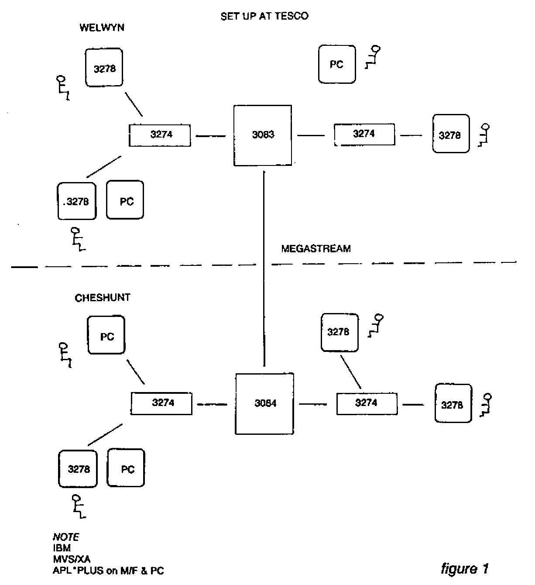
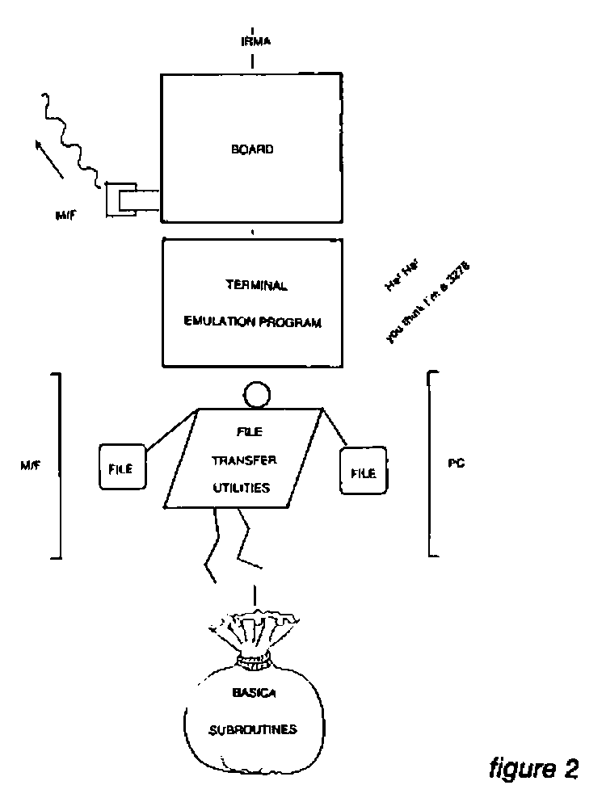

by Graham Fieldsend
{ .byline }

Tesco has invested heavily in IBM hardware, both in mainframes and micros. At present we have twin sites connected by a megastream (see fig. 1). In addition we have over 200 IBM PCs distributed throughout the two sites. We run APL\*PLUS under TSO on our Cheshunt mainframe, and we have a number of PCs running APL\*PLUS/PC.

Such a set-up led to three problems which we needed to resolve. Firstly, it caused a proliferation of terminals, good for IBM no doubt, but not so for me as I only have a small desk. Secondly, we needed to transfer data between mainframe and PC. Thirdly, we wanted to be able to transfer APL systems between mainframe and PC.

Our solution was to purchase IRMA, along with APL\*PLUS/PC TOOLS, at a cost of about £900 and £300 respectively.

IRMA is a communications link between an IBM PC XT and an IBM 3270 network. It consists of four parts (see fig. 2).

The Decision Support Interface (DSI) is a printed circuit board. It plugs into the PC system unit and has a BNC connector for a coaxial link to a 3274 or 3276 controller. It has its own microprocessor to handle the 327X protocol, which is independent from the PC’s 8088 chip, and this starts accepting 327X protocol as soon as the board is installed and receiving power.

The Terminal Emulator Program (TEP) is needed in order to see the information received by the DSI, and send keystrokes made by the operator. As its name suggests, it emulates a 3278 screen (with a few additional features).It is very easy to invoke and may be left and reentered at will. An additional program called GENX allows customisation of the program with such features as APL keyboard.

The BASICA subroutines are provided for BASIC programmers who wish to write their own transfer programs. Also, supplied utilities allow easy transfer of files between mainframe and PC, via the TSO editor and IRMA screen buffer.

At Tesco we actually use a new, faster file transfer utility called IRMAlink. It is simple to use, requiring the READY prompt on the mainframe, and providing a fullscreen menu to prompt for file names. A number of different file types may be transferred, such as CLIST, CNTL, TEXT and DATA.

IRMA is able to solve our first two problems, allowing us to use the TEP to emulate a mainframe terminal and the IRMAlink to transfer data files between mainframe and PC. The third problem, transferring APL systems, was covered by TOOLS.

The IRMA software contained in the TOOLS package divides into sections that equate with the IRMA supplied software. TOOLS has a customised version of the TEP, with APL\*PLUS/PC layout. Its customisation is such that it cannot be reentered as quickly or easily as the standard version, but these problems can largely be overcome by using a RAM disc and defining a function key.

The functions in the I78FNS workspace parallel the BASICA subroutines (with a few added extras), allowing APL programmers to write their own transfer programmers.

The file transfer utilities are contained in the I78XFER workspace, and work in conjunction with the I78HOST workspace, which must first be installed on the mainframe. This installation is not easy, to say the least. Local differences at each site, such as the position of the characters ‘APL’ on the screen, and the type of hardware between the 3278 and mainframe, can make this difficult if not impossible. In our experience, once installed it is slow but reasonably reliable. Several types of file may be transferred, including Shared Files, and functions are provided to store a copy of a workspace on file and restore it after transfer. GDDM must be installed on the mainframe, as this is used to mimic quad-ARBIN, which is used at the PC end. Character vector representations of data are transferred between mainframe and PC, with a quad-AV conversion taking place.

So the TOOLS package was used to solve our third problem. Finally, I supply some timings as recorded on our mainframe during a normal working day. The timings for IRMA and FORTE are for the transfer of a file of total size 1 megabyte, and record length 255 bytes:-

| | *Download* | *Upload* |
| --- | ---: | ---: |
| IRMA | 1hr 58min 31sec | 4hrs 39min 48sec |
| FORTE | 42min 8sec | 47min 1sec |
| IRMAlink | 6min 4sec | 6min 40sec |

Transfer of a 100K workspace using the TOOLS IRMA based software took about 2 hours.
