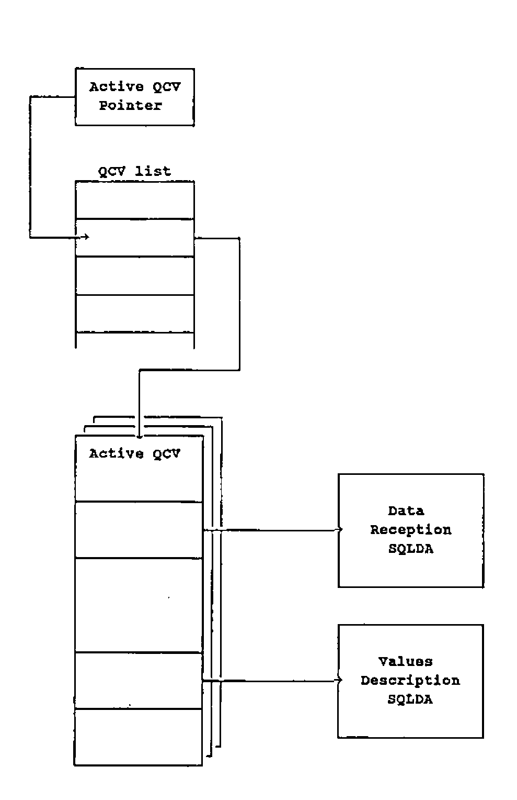
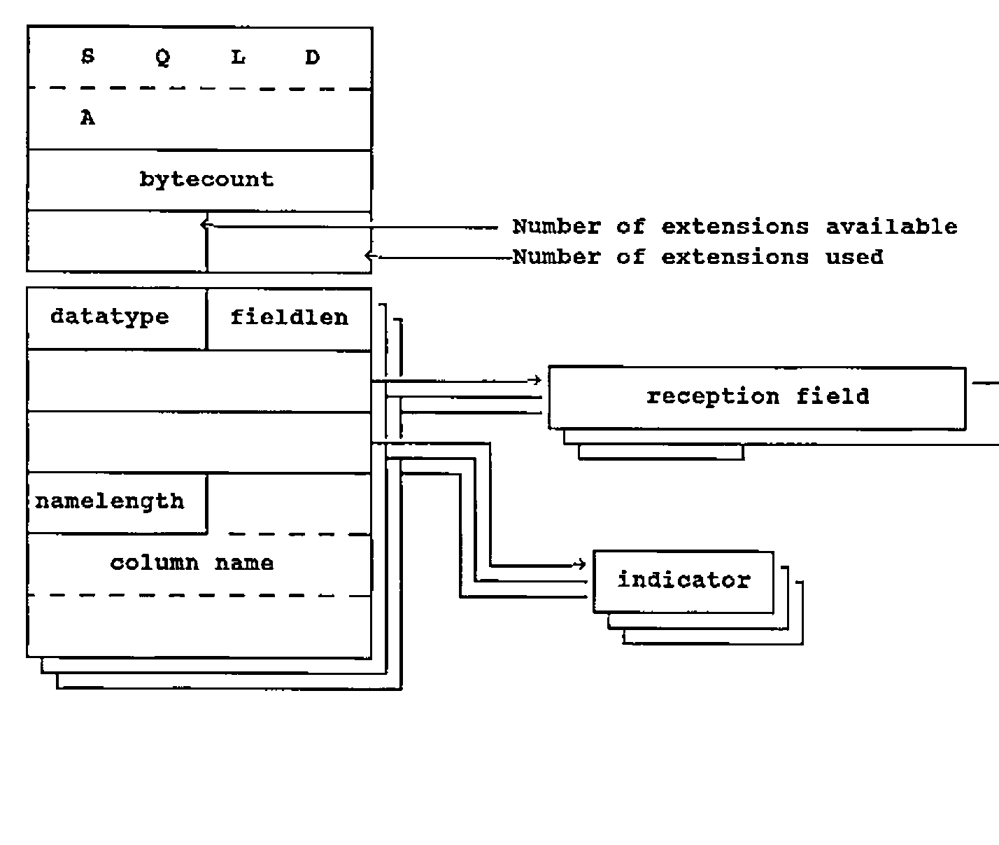

by Allan Gay
{ .byline }

This article introduces AP727, an auxiliary processor presently being developed by Cocking & Drury Limited as a means of interfacing STSC Inc.’s APL\*Plus/TSO with IBM’s DB2. The salient points of the AP727 design are sketched and some technical aspects are described.

Users of other relational database systems and other operating systems should not be deterred by the references to DB2 and TSO. In essence, AP727 is simply a means of interfacing mainframe APL\*Plus and a relational database system by means of the Structured Query Language (SQL). If a given package supports Dynamic SQL and runs under MVS or VM, a suitable variant of AP727 is likely to be feasible.

Indeed, to facilitate the production of such AP727 variants, AP727 has been carefully designed to concentrate operating system, Dynamic SQL and interface specifics into dedicated repluggable modules.

As an interface between STSC Inc’s APL\*Plus/TSO and IBM’s DB2 relational database system, AP727 is functionally equivalent to the MVS/TSO implementation of APL2’s AP127. Compatibility with AP127 has been a client requirement from the outset in order to ensure that users have the option to migrate between these two APLs.

Compatibility means that AP727 has the same repertoire of services as AP127 and that all external interfaces are close APL\*Plus equivalents of their APL2 counterparts. See IBM’s SH20-9217 “APL2 Programming: Using Structured Query Language (SQL)” for details of AP127 repertoire and interfaces.

## Outline Description

AP727 is a demand-responsive auxiliary processor designed to run in the APL\*Plus/TSO environment under MVS/370 or MVS-XA. It is re-entrant and so is capable of being installed as a resident AP if desired. Extended addressing is not used.

AP727 supports up to forty concurrently-shared variables. However, only one variable may be active at a given time. If multiple variables are offered, AP727 matches the offers provided that the shared variable quota is not exceeded. The first variable to be specified (set) by the APL\*Plus user becomes the active shared variable and remains so until the user retracts it or AP727 signs off. If the user retracts the active shared variable, the next shared variable to be set by the user becomes the active shared variable.

The single active shared variable is operated bi-directionally both to receive commands and data from the APL\*Plus user and to return results to the APL\*Plus user. User commands are formed as simple or nested objects. The first or only simple object in the user input is a simple character vector which constitutes an AP727 operation code. Certain operation codes permit or require the provision of additional objects such as statement names, SQL statements, substitution data and so on.

Similarly, AP727 results are formed as simple or nested objects. The first or only simple object is always a 5-element integer returncode vector documenting success or failure. A second object, which may be simple or nested, is returned from many operations and contains result data.

The primary purpose of AP727 is to access DB2 and the databases which it operates. This is done through the medium of SQL. AP727 contains a precoded repertoire of Dynamic SQL statements which are issued in various combinations according to user command input.

Communication between AP727 and DB2 is performed via the Call Attachment Facility (CAF). Two independent subtasks are started by AP727 to maintain and operate the interface. The use of subtasks facilitates the wresting of control from DB2 by the simple expedient of DETACHing them. This action is performed if the user attentions out of a potential interlock or long-running DB2 operation and then retracts the active shared variable.

AP727 does not include any attention-handling logic, relying instead on the Shared Storage Manager (SSM) to process user-generated interrupts.

By default, the DB2 application plan id “APLP” is used. This may be overridden by specifying an alternative id at APL\*Plus startup. The override is retrieved through conventional MVS PARM-processing logic via R1.

## Structure

As Figure 1 demonstrates, AP727 comprises a 9-module main task (shown enclosed by the broken line) and two subtasks.

Module and subtask ids are in the form APPsnnni where:

- APP denotes APL\*Plus
- s indicates the host operating system: T for MVS/TSO-specific modules, V for VM/CMS-specific modules, X for modules which are non-specific as to operating system.
- nnn is the Auxiliary Processor number: 727 for DB2 and SQL/DS
- i is an arbitrarily chosen module differentiator.

*Figure 1: AP727 Module Context Chart*
{ .caption }

## Processing Cycle

All shared variable operations and other SSM transactions are conducted by the Mainline module. When a user submission is received, the Parser module is invoked to validate and reform it. If the submission passes validation, the Parser module returns addressing data for the appropriate service module. If the submission is faulty, diagnostic information is returned instead.

The Mainline module regains control when parsing concludes. If a service module address has been returned, the Mainline module invokes that service module. Like the Parser module, some service routines may return diagnostic information. Finally, the Mainline module packages diagnostic information and result data together, returns them to the APL user via the SSM and issues a wait. When the wait is satisfied, the cycle reiterates.

An outer cycle commences with AP727 sign-on to the SSM and terminates with sign-off when the SSM requests it.

## DB2 Interfacing

Module APPT727I (in the main task) and the two subtasks constitute the mechanism by which AP727 communicates with DB2 in the MVS context. Under VM/CMS, different tools are employed: module APPT727I would be replaced and the two subtasks would be deleted from the design. The relational database system might be SQL/DS instead of DB2.

The use of subtasks provides a ready means of severing interlocks and wresting control from DB2; one simply detaches the relevant subtask. The ensuing abend informs DB2 that the transaction is defunct.

Module APPX727T (in the main task) hosts AP727’s repertoire of precompiled Dynamic SQL statements. Precompilation produces external references to entrypoint DSNHLI, which is dummied in module APPT727I. When APPX727T issues a Dynamic SQL statement, module APPT727I receives control and relays the parameter data to subtask APPT727A. The subtask invokes DSNHLI2 in the Call Attachment Facility’s language interface, the CAF mainline code is triggered and the request passes to DB2.

Subtask APPT727A requests a CAF OPEN for the first Dynamic SQL statement to be issued following AP727 startup or a prior CAF CLOSE. APPT727A requests a CAF CLOSE whenever a COMMIT or ROLLBACK operation is requested. These operations are enacted by means of the CAF CLOSE request’s SYNC and ABRT operation codes respectively. COMMIT and ROLLBACK are never issued as SQL statements per se.

Subtask APPT727C, the Connector, is invoked before AP727 issues the first Dynamic SQL statement of the session. It requests a CAF CONNECT via entrypoint DSNALI and subsequently, by remaining attached, maintains the connection established between the address space and the named DB2 subsystem. This eliminates implicit CONNECT processing and its associated overhead when a thread is opened via CAF OPEN. A CAF DISCONNECT is issued at AP727 shutdown.

## Repertoire

AP727 repertoire consists of its own operations (services which are individually requested by the APL user), SQL statements (formulated and supplied by the APL user), and Dynamic SQL statements (the inbuilt means by which AP727 communicates user-supplied SQL statements to the relational database system and retrieves results).

Thus, for example, the PREP operation might be requested for a SELECT statement, the text of that statement being supplied by the APL user. AP727 would respond by issuing a Dynamic SQL DESCRIBE statement for the supplied SELECT statement.

Each AP727 service is requested by supplying its operation code, together with any necessary data (such as the text of an SQL statement). Operation codes and user-supplied SQL statement texts are character vectors.

The following operation codes request database services:

| | |
| --- | --- |
| CALL | executes a PREPed INSERT, UPDATE or DELETE statement. |
| CLOSE | closes the cursor for an OPENed SELECT statement. |
| COMMIT | files all database changes since the last synchpoint. |
| EXEC | a one-off combined PREP and CALL. |
| FETCH | retrieves data for an OPENed SELECT statement. |
| OPEN | opens a result cursor for a PREPared SELECT statement. |
| PREP | prepares a supplied SQL statement for CALL or FETCH. |
| ROLLBACK | cancels all changes since the last synchpoint. |

The remaining operation codes concern AP727 session management:

| | |
| --- | --- |
| DESCRIBE | reports a SELECT statement’s result format. |
| GETOPT | reports AP727 options extant. |
| MSG | gives the message text for a given returncode. |
| NAMES | gives the names of all extant PREPared statements. |
| PURGE | removes one or all PREPared statements. |
| SETOPT | specifies new AP727 session options. |
| STATE | reports the status of a PREPared SQL-statement. |
| STMT | returns the text of a PREPared SQL-statement. |
| TRACE | activates AP727 self-tracing capabilities. |

Within the confines of the present article it is not possible to describe all the internals of AP727 in detail. Nonetheless, it is worth selecting and exploring one topic so that the general reader may gain some insight into the considerations entailed.

Accordingly, the remainder of the present article is devoted to a description of the mechanisms employed when retrieving data from DB2 in accordance with user-supplied SELECT statements.

## Retrieving Data

SELECT statements are used to retrieve data from the relational database system. They name the relevant fields (“columns”) and may optionally specify row-selection criteria based on field content. The effect of SELECT statement processing is to create – at least, conceptually – a result table containing the selected rows and columns, with a cursor indicating its first row. Rows may then be retrieved successively, the cursor always advancing downwards to indicate the next row to be retrieved.

As a general purpose tool, AP727 is faced with the problem of retrieving data from a relational database system without any prior information about the form and extent of that data. The problem is solved by issuing set sequences of Dynamic SQL statements to process SELECT statement texts provided by the APL user.

Before retrieval may commence, the relational database system must be queried so that data reception areas can be acquired and structured. These areas will vary according to the attributes of the columns in the result table built in response to the user-supplied SELECT statement. A DESCRIBE Dynamic SQL statement is issued to obtain the relevant information.

AP727’s PREP operation conducts all these activities. The OPEN operation completes the preliminaries and declares a cursor id for the result table. Data retrieval may now begin. The FETCH operation retrieves result table rows and returns them in the form of an APL variable. The number of result table rows per FETCH and the organisation of the resulting APL object vary according to the AP727 options in effect. Options may be defaulted, explicitly declared via the SETOPT operation, or supplied as overrides on FETCH statements.

When all desired result table rows have been retrieved, the CLOSE operation may be used to release the cursor, reverting the statement to PREPared status. Finally, the PURGE operation may be used to release all data structures associated with the preparation and use of the SELECT statement.

## Data Retrieval Structures

AP727 supports up to forty concurrent SQL statements. Reference to statements is facilitated by associating a user-supplied name with each. The name, together with much other data, is held in an AP727 control block termed a Query Control Vector (QCV). Each extant statement has its own QCV. A QCV is created when a user-supplied SQL statement is first PREPared. Up to forty concurrent QCVs are supported subject to storage availability. AP727’s PURGE operation is supplied for the purpose of erasing QCVs after use.

As Figure 2 indicates, the address of each extant QCV is held in the QCVLIST. A pointer into this list designates the address of the QCV which is currently active (if any). This enables service routines to refer to QCV fields without repetitive searching, the Parser module having preset the pointer beforehand.

The QCV, besides containing user-supplied data such as SQL statement text and statement name, stands at the head of an expanding hierarchy of data structures used in data retrieval for a single SELECT statement. Of these, the most important is the SQL Descriptor Area (SQLDA). This control block, progressively created and completed by means of the Dynamic SQL DESCRIBE statement, contains size and attribute information for database columns, together with pointers to areas reserved in memory for column data and status indicators.

SQLDAs are used not only when receiving data from the relational database system but also when supplying data to that system. An AP727 QCV may contain a pointer to both a data-reception SQLDA (used to receive FETCHed data) and a values-description SQLDA (used to specify parameters which complete a partial SELECT statement). An SQLDA comprises a fixed-length stub followed by zero or more occurrences of a fixed length extension documenting a single database column. The number of occurrences is recorded in the stub.

To discover how many columns of data will be retrieved when a given SELECT statement is processed, a Dynamic SQL DESCRIBE statement targetting a dummy SQLDA (an SQLDA having no extensions) is issued. The necessary number of extensions – and thus the number of database columns – is reported in a field within the stub. Armed with this information, AP727 then acquires storage, builds an SQLDA having sufficient extensions and issues a DESCRIBE statement targetting that new SQLDA. This causes detailed information about the size and attributes of each column to be placed into the new SQLDA’s extensions.

AP727 consults this information to determine how much space will be required for data reception purposes at FETCH time. Sufficient storage is acquired dynamically and allotted to each column. Reception field addresses are placed into the relevant SQLDA extension fields. Indicator fields (used to signal null data) are similarly allotted and connected.

*Figure 2: The active QCV*
{ .caption }

At this stage, the SELECT statement has attained PREPared status and AP727 is ready to retrieve the first row of the result table.

Figure 3 depicts the data-reception SQLDA for a PREPared statement and shows how the reception fields are connected to it. Given this arrangement, a Dynamic SQL FETCH statement (issued as part of AP727’s FETCH service) will place the next result-table row’s column values into the reception fields associated with the SQLDA.

*Figure 3: a data-reception SQLDA*
{ .caption }

If AP727’s FETCH service were to return only a single row of the result-table, the APL user might have to invoke AP727 many times in order to retrieve an entire table. An extended loop of this kind, entailing shared variable communications on each iteration, would be inefficient. Instead, AP727 consults a user-modifiable count governing how many result-table rows are to be retrieved by each FETCH operation. AP727 loops to retrieve that number of rows and returns them as a single APL object. The object may be a vector of matrices or a matrix of vectors, according to the AP727 options specified, overridden or defaulted by the user.

The additional storage required for the consolidation of result table rows into a single APL object is acquired when the PREPared statement is OPENed and released when it is CLOSEd.

## Conclusion

Although many APL users routinely avail themselves of the services of auxiliary processors, few gain much exposure to auxiliary processor internals. It is hoped that this article, though necessarily an incomplete description of AP727, has cast some light on an unfamiliar area and proved of interest to APL users and relational database users alike.
