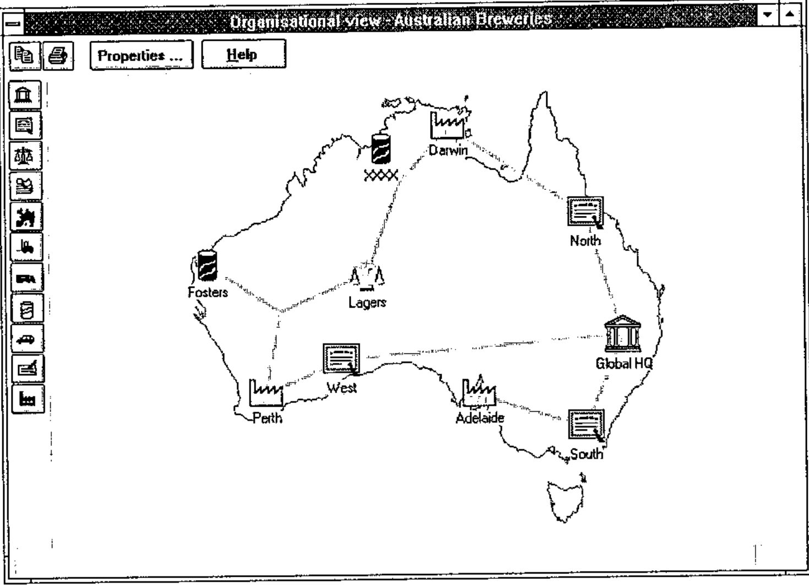

*notes by Marc Griffiths*
{ .byline }

## Background

Adrian Smith took advantage of a business trip to New England to visit Toronto and talk to the Toronto APL SIG on February 26. The meeting took place in a lecture theatre in the Medical Sciences Building at the University of Toronto, the site of the APL’93 Conference. This contributed to a pleasant combination of *déjà vu* and anticipation.

Adrian had organised his presentation into three segments: (i) an introduction to Causeway, (ii) a demonstration of the Organisational Architecture application software written in Dyalog APL/W version 7.1 for SAP AG, and (iii) a look at the NewLeaf report designer, the latest product from Causeway Graphical Systems. Unfortunately, the LCD display panel and Adrian’s laptop computer were unwilling or unable to communicate.

Unfazed, Adrian produced some markup pens and proceeded to illustrate the first part of his talk through the older medium of acetate on an overhead projector. Parts (ii) and (iii) were conducted later in scrums arranged around the lectern to look at the screen on the laptop.

## Causeway

Adrian sketched the ‘Flipper’ form to illustrate the principles underlying Causeway. The Flipper consists of a Windows form with a single text input field together with two control buttons, Flip and Close. Clicking on the Flip button reverses the text which the user has typed in the input field (see the notes from Adrian’s Helsinki workshop in *Vector* Vol.11 No.3). For the benefit of those in the audience who hadn’t seen Flipper or any Causeway application before, Adrian distributed handouts which showed the form and the Event Action table associated with the Flip button.

It was apparent that the audience contained people with a wide range of familiarity not only with Causeway, but also with graphical user interfaces (GUIs) and the concepts behind object-oriented programming. Questions were asked almost from the outset of the presentation, and the evening was highly interactive. For some in the audience, the failure of the LCD display panel was a blessing in disguise.

Without the distracting magic of a live demonstration, we were able to reflect upon the simplicity of Causeway’s structure, and appreciate how far Causeway goes towards removing the need for a lot of low-level coding in prototype development and application programming. In fact, one could say that it does for GUI design and implementation what APL does for application programming: it conceals the low-level detail to allow the analyst/programmer to focus on both designing an application that solves a business problem, and enabling the user to interact as effectively as possible with that application.

In the course of answering questions, Adrian offered a number of insights and tips with respect to using Causeway:

- Think of forms and applications in terms of the events and actions (conditional and unconditional) which are associated with the constituent objects.
- Don’t be afraid to use global variables in the application. Because each form has its own execution stack, there is no central control within the application, but forms must occasionally share data. Localise variables within a form when they must be shared by its children but are not needed outside the form.
- The model used to control the ‘watching’ and ‘hollering’ associated with changes to variables is that of a centralised monitor rather than a network of direct object-to-object messages. The monitor maintains lists of the variables being watched, and of the objects which need to be notified when any of the variables is changed. When the monitor is told about a change to a variable, it notifies each of the objects which had previously registered an interest in any changes to that variable. In circumstances where the notifications may be cyclical, using an appropriate condition in the Event/Action tables will terminate the updates.
- Normally, the ‘holler’ message is sent when the focus leaves a field. To refresh either a large number of inter-related fields, or a field which involves time-consuming calculations or file I/O, remove the variable name from the ‘holler’ list in every object in the form. Then, provide the user with a Calculate or Refresh button which need do nothing other than holler the variable name, or which executes an APL function which performs the calculations before hollering. This is analagous to switching off automatic repagination of a lengthy Word document and selecting Repaginate Now from the Tools menu.

Causeway is being rewritten for Dyalog APL/W Version 8. It will take advantage of namespaces to avoid workspace name conflicts and to provide some performance improvements.

## Organisational Architecture Application

This is a user interface developed by Adrian and Duncan Pearson using the Causeway development environment. It is PC-based and supports the configuration of the R3 client/server integrated business system written by SAP AG in Germany. It is particularly significant because it is not a form-filling, button-clicking, chart-drawing front-end which many people view as a standard GUI. The *Organisational Architect* application is a direct manipulation interface which allows the user to construct a graphical model of the firm’s business processes from a pre-defined collection of business entities. The entities can be seen as classes which range from reporting (cost centres) and legal (subsidiaries) to the physical (factories, distribution points).

The user creates an instance by selecting a business entity from a vertical palette of icons located at the left edge of the screen and dragging it into the main window. The user fills in a few fields of a small pop-up information form to set certain properties of this instance, such as its name. The user then proceeds to link it to other icons already in the window by using the mouse to draw lines between them. Where necessary, another small form may appear to allow the user to describe certain characteristics of the relationship between the connected instances.

When the model is complete, the information about the business entities and their connections is transmitted to the SAP configuration module in a form which it can understand. The performance of the application in redrawing the icons and links was certainly acceptable on the Pentium laptop. The fact that the Organisational Architect application has been distributed worldwide by SAP on CD-ROM is a tribute to its robustness.

## NewLeaf

To greatly understate its functionality, *NewLeaf* is a reporting utility. More accurately, it is a page description package which uses collections of page description objects/elements to describe the layout of individual pages which together comprise a report, much as Causeway uses collections of GUI objects to describe forms.

Information about downloading a Dyalog APL/W beta-test version of NewLeaf from the APL385 Website (see Product Guide) had been provided in the meeting announcement, so some of us had been able to give it a test drive beforehand. Still surrounded by quite a crowd, Adrian provided a quick overview of NewLeaf on his laptop by running a few of the demonstration functions in the workspace and displaying the output on the screen.

He explained that the NewLeaf package comprises three namespaces: *class* contains the element descriptions; *leaf*, the principal namespace, contains the functions which are used by the application to construct the report; and *ps* contains functions which translate the report, held in an ASCII-text page description format, into a form which can be viewed on-line, saved to file, or sent to a printer.

The main object is the **frame** which bounds a rectangular area on a page. Text can be placed in a frame, in which case any text which extends to the right or below the edges of the frame is clipped. Alternatively, text can be flowed into a frame. Each flowed text vector is treated as a paragraph. Each paragraph is wrapped automatically between the sides of the frame and, if it extends beyond the bottom of the frame, it will flow into the next frame, which may be on another page (this "autoflow" property can be switched off).

As well as frames, NewLeaf handles objects such as rules, timestamps, page numbers, drop caps, bitmaps, and graphics from *Rain*. The programmer has control over font selection, font size, style (plain, bold, italicised), and leading; paragraph indents left/right/first line, space before/after, and alignment.

In addition to facilities to handle text as standard paragraphs, NewLeaf allows bullet-formatted text with a choice of bullet from a solid circle, numeric or lowercase alphabetic character (the latter two are incremented automatically). The big contribution is a special group of functions specifically designed to handle tables. Provided they can be expressed in a tree structure, the text for column titles can span more than one column. Lengthy tables are broken between rows and the titles appear automatically at the top of the next page.

## Summary

Despite the equipment failure, no one left the meeting disappointed. After being shown two products which manage low-level, detailed coding of the user interface and report generation, many in the audience were able to breathe more easily at the prospect of once again concentrating on higher level business and system design problems.

A demonstration of a direct manipulation interface was a bonus in terms of providing a good deal of food for thought, and reminding us what GUIs can and ought to be for certain types of application.
