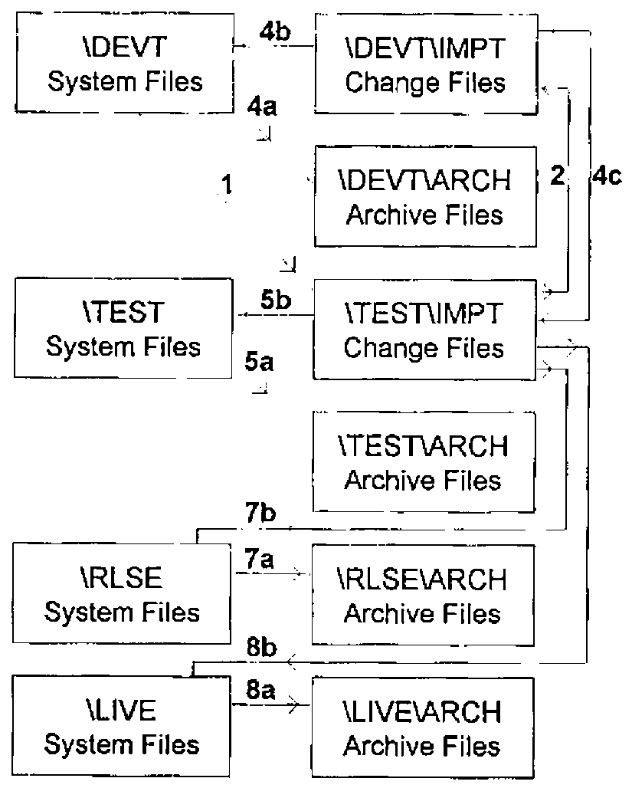
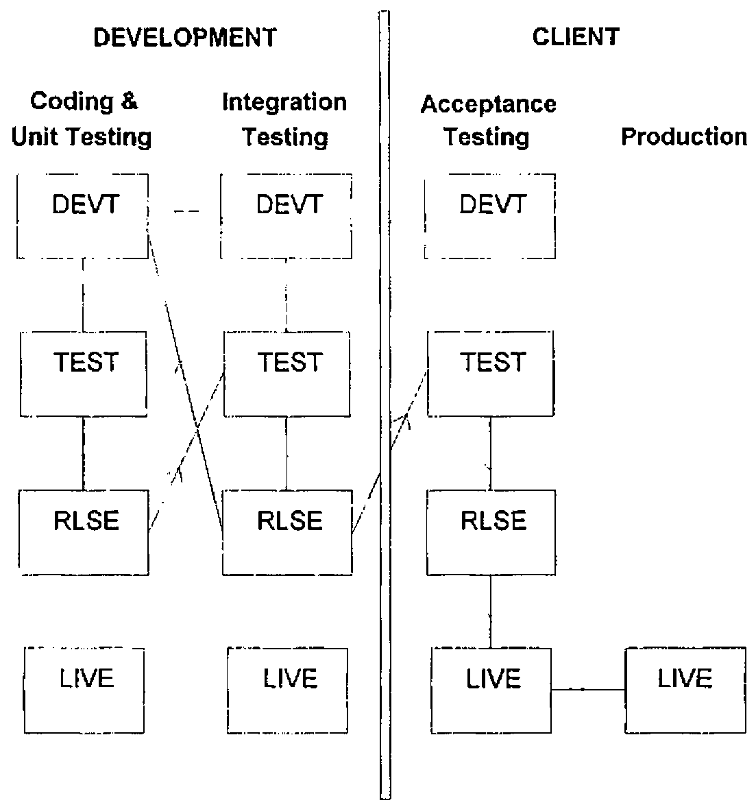

*Marc Griffiths, Chris Hogan, John Jacob, Phil Last*
{ .byline }

Developing variants of a software product for different customers is never the easiest of jobs. And when development takes place in three different locations, none of which is a customer site, you can imagine the difficulties that exist in terms of co-ordinating system development, and the subsequent assembly and testing of software releases. This was the situation that HMW Trading Systems found itself in several years ago. It prompted the development of procedures and software—collectively known as Change Control—as a way of preventing a disaster that was waiting to happen. During the last three years, Change Control has continued to evolve as it has proven to be reliable and robust. It has been accepted by those who use it largely because it places very few constraints on individual development styles. In fact, developers have come to appreciate the additional control over the testing, packaging and shipping of software releases that has resulted from the adoption of Change Control—no one likes emergency support calls!

The description of Change Control that follows is drawn largely from its development within an MS DOS environment as part of the *4XTRA* foreign exchange trading application written in APL\*PLUS/PC.

## What Does Change Control Do?

Change Control monitors and controls the migration of changes to the application code throughout a system, archiving old code before overwriting it with revised versions or adding new items. It also supports the administrative activities that are interleaved with system development and testing. Each time a change is promoted, the integrity of the system is checked and the history of the change is updated and saved. The history is used to create documentation that accompanies the release. Change Control can browse the state and history of any active change, restore archived objects, and delete changes altogether.

## Part of a Bigger Picture—Configuration Management

Before we describe the structure and operation of Change Control, we need to situate it within a broader context. Writing, testing, packaging and distributing software releases are only part of a much bigger topic, Configuration Management. CM, as it is popularly known, deals with the management of software development in its broadest sense, from formal methods through software and hardware products to staff training. Change Control is insufficient in itself to provide a complete CM solution. However, by touching briefly upon three aspects of CM, we can provide some insight into the more important parts of the framework that surrounds Change Control.

### Analysis and Design Method

The phrase *modular prototyping* best describes the analysis and design method that has been used for *4XTRA*. It has much in common with Rapid Application Development. RAD is characterised by extensive user involvement and the division of proposed system development into manageable, functional units that can be delivered as working modules within short time scales. The analysis that we carry out as part of modular prototyping provides input to a resource estimation algorithm that we have implemented as a spreadsheet template. We use this to determine the resource requirements for all releases, whether they are simple bug fixes or major enhancements. This process highlights dependencies between different releases. It also allows the subdivision of a release into smaller work packages of logically or functionally related objects. This is especially important when a release contains objects that are used by more than one process, or when work packages can be developed in parallel by different people.

Within Change Control, a software release comprises one or more work packages, and a developer is allocated one or more of these. Each release has a unique identification number, easily identified work package components, clear dependencies, and specific resource requirements and commitments.

### System Implementation Model

*4XTRA* has been implemented using an overlay model and indirect file references. It has a single workspace together with one or more program or system files and a separate set of application data files. A program file is an APL component file that contains control variables and canonical or vector or object representations of functions. Each program file contains a namelist of the items stored in it, together with additional information about each object on the file, including a pointer to the name of the person who last wrote it to file. A second namelist and an associated array of pointers are used to refer to and define groups of objects. All access to the program file is controlled through cover functions. Only the most widely used utilities reside in the workspace.

In operation, each functional module in the system is associated with a group name on the program file. When the user runs a module, the system reads from file and defines in the workspace the objects that comprise the group name associated with that module. When the module terminates, the objects that were read from file are expunged.

Indirect file references have been implemented by using cover functions for all file creation and file ties. All application code contains only token file names. This allows runtime mapping of each token name to a real file name, directory or drive.

Change Control is itself an overlay module. It also uses the program file structure for storing (change files) modifications to, and saving (archive files) old versions of, individual objects and group definitions. Indirect file references make it possible to avoid the duplication of entire read-only datasets that would otherwise be necessary for development and testing.

### Development Environment

Change Control succeeds only if everyone uses it. To encourage its adoption, we devised a fairly free-form coding and development environment to accommodate the full range of work styles among a group of system developers. We have provided ourselves with a set of tried-and-tested tools, and mandated the use of only one of them. The required tool is a cover function used to edit functions. When the cover function terminates, it inserts or updates the version number, developer name, current date and time in a comment at the top of the edited function. As a safeguard, the function that writes objects to a program file will not write a function without a comment as its first line. In addition to these tools, there is on-line documentation that describes naming conventions, utilities, etc.

As described in the previous section, the system uses overlays to define, execute and expunge objects in the workspace. For development and testing, this behaviour has been modified so that a functional module defines in the workspace only those objects in the group that do not already exist there. Similarly, when a module terminates, only the objects previously read from file are expunged. This allows the developer to copy functions and variables into the workspace, set stop and trace controls, and to edit freely without worrying that the system will get rid of the product of several hours, or even days, of hard work!

The resulting development environment allows experimentation, coding and testing in personal workspaces without fear of side effects. More importantly, it leaves control in the hands of the developer. However, the propagation of changes through an application from the point at which a developer has finished work until the changes are ready to be applied to the production system is managed through Change Control.

## Change Control in Operation

### Application Structure

Change Control utilises an application directory structure that separates the application code from the data, and provides a storage location for release documents (Figure 1). Beneath the code and data are four separate subdirectories, each with a specific purpose:

| | |
|---|---|
| DEVT | For development and unit testing. |
| TEST | For suite, system and volume testing. |
| RLSE | A holding area pending release. |
| LIVE | For parallel runs with a copy of the production system data. Generally used for client acceptance testing. |

This does not imply that there are four complete copies of the application system in existence simultaneously. Where appropriate, indirect file references at each level can point to the same read-only files.

### Development and Testing Activities

Every software release requires analysis to identify work packages and to allocate resources. Generally, the developer who does the coding and unit testing is also involved in the analysis. The release is then given a unique identification number. The Change Control module is invoked at this point to initiate the release at the work package level, i.e., to add the release ID, work package number (1 to 99) and title to the main Change Control registry file. Change Control constructs a unique name for the change file that will be the repository for all modified and new objects that form this work package. The file name has the form S*nnnnnxx*, where *nnnnn* is the release ID number and *xx* is the work package number within the release. For example, the name of the change file for the first work package of release 371 is S0037101. The same scheme is used for temporary (A*nnnnnxx*) and permanent (R*nnnnnxx*) archive files that are created as a work package is promoted from one level to another.

A summary follows of the sequence of activities undertaken by a developer working alone in a single application environment (we describe working with multiple developers and sites a little later). Words in bold correspond to
commands within Change Control selected by the developer (steps 1, 2, 4, 5, 7, 8). The figures in brackets refer to the paths in Figure 2, which illustrates what Change Control does to objects and to change and archive files for each activity. Only the objects about to be changed are archived, not the entire system file.

```text
\APPNAME
├── \CODE       Change Control File
│   ├── \DEVT   System Files
│   │   ├── \IMPT   Change Files
│   │   └── \ARCH   Archive Files
│   ├── \TEST   System Files
│   │   ├── \IMPT   Change Files
│   │   └── \ARCH   Archive Files
│   ├── \RLSE   System Files
│   │   └── \ARCH   Archive Files
│   └── \LIVE   System Files
│       └── \ARCH   Archive Files
├── \DATA
│   ├── \DEVT   Data Files
│   ├── \TEST   Data Files
│   ├── \RLSE   Data Files
│   └── \LIVE   Data Files
└── \RELEASE    Release documents
    └── \TEXT   Release text files
```

**Figure 1. Application Directory Structure**
{ .caption }

1. Initiate a new work package.<br>The developer enters the release ID, work package number and title, then selects the objects. They are copied from the DEVT system file to a new change file [1] ready to be imported to TEST.
2. **Reject** the changes.<br>Move the change file [2] ready to be imported to DEVT.
3. Create or modify any application data files in DATA\DEVT. Bring the objects in the change file into the workspace. Edit and unit test them. When finished, store the modified objects back in the change file.
4. **Import** the changes.<br>Archive objects from DEVT system file [4a];<br>Copy objects from change file to DEVT system file [4b];<br>Move change file [4c] ready to be imported to TEST.
5. Prepare to **Test** the changes.<br>Archive objects from TEST system file [5a];<br>Copy objects from change file to TEST system file [5b].
6. Create or modify any application data files in DATA\TEST. Modify the standard test data. Run the tests.
7. **Accept** the changes.<br>Archive objects from RLSE system file [7a];<br>Copy objects from change file to RLSE system file [7b].
8. **Release** the changes.<br>Archive objects from LIVE system file [8a];<br>Copy objects from change file to LIVE system file [8b].
9. Create or modify any application data files in DATA\LIVE. Conduct one or more parallel runs.
10. Copy the LIVE system file to the Production system. Create or modify any application data files in the Production system.

Change Control manages the migration of objects and group definitions but certain activities are handled manually. These generally deal with one-off modifications to data files that are required as part of a software release. A mechanism for handling these has been built into Change Control but has seldom been used because these changes occur infrequently and tend to be highly idiosyncratic. Instead, the software release includes a supplementary program file that contains routines that are run only once in the workspace by development or operations staff. These routines are developed and tested in the usual way, and instructions are included in the release documentation.

In operation, Change Control allows the developer to use the mouse or keyboard to select items directly from list boxes and to employ various search mechanisms to reduce the lists to a more manageable size. Each Change Control activity shown above also allows the developer to add comments to the change history, an on-line audit trail that is stored in the change file. The change history is updated automatically with information about all the objects in the change file, when it was last promoted and by whom.



**Figure 2. APL Object and Program File Movement within Change Control Activities**
{ .caption }

Whenever a change file is imported, Change Control extracts from the change history various items of information that it writes to a text file. The developer creates a release document for the work package in Microsoft Word, using a defined template and macro to fill in much of the form from the text file. The developer then enters additional details about the new or changed objects in the release such as interdependencies, special cases and restrictions, installation instructions, and any changes to system outputs, user documentation, technical support procedures, etc.

At first glance, all of this probably appears intimidating or unnecessarily tedious. The activities performed through Change Control require negligible time but it is imperative that they be done correctly the first time. We have found that the overall procedure imposes a discipline that has increased the time available for analysis and development while reducing the time spent on support. The process also includes an audit trail, specifications and amendments to documentation. Developers test each other’s coding changes in-house and check the additional information in the release documents before anything gets near the client. And, not only do clients receive a better quality product, they are able to test it themselves within their own Change Control structure (see below).

## Other Change Control Facilities

There are some additional commands available in Change Control.

**Reject**
: When applied to a change at any level, **Reject** restores, at all levels, the previous versions of all archived objects that are associated with the change file. As described above, the change file is then moved from TEST\IMPT to DEVT\IMPT. The state of the change becomes inactive.

**Delete**
: Removes all evidence of an inactive (Rejected) change from Change Control.

**Browse**
: Displays a summary of all known changes and allows viewing of the change history of any one of them.

**Freeze**
: Prevents further changes from being promoted to the LIVE level. This removes concern about the possible effects of other changes on extended parallel testing.

**Unfreeze**
: Removes the "lock-out" imposed by **Freeze**. At this point the LIVE system files can be moved to the production system. Change Control deletes any change file that has been promoted to LIVE as well as all associated temporary archive files in the \ARCH directory at the TEST, RLSE and LIVE levels. The archive files for these changes in DEVT\ARCH become permanent archives by changing the first character (for example, S0037101 is renamed R0037101).

Change Control contains several safeguards. Whenever it promotes changes to another level, it looks in the system file that it is about to update and reports any unauthorised changes. This procedure ensures that no-one can update a system
file directly at any level without detection. In a way, it protects developers from themselves!

Change Control also compares the list of objects in any new change file with the lists of objects in all other active changes. This is designed to prevent a change from being initiated or imported if it contains an object in another change file that has not yet been accepted. If an object is part of a release that has been accepted or released, Change Control issues a warning.

Finally, it is possible, after initiating or importing a release, for the developer to realise that one or more additional objects need to be included in the work package. Change Control can handle this situation in one of two ways. Either the current change file is rejected and the process started anew, or a second change file (a new work package within the same release) is initiated or imported.

## Using Change Control across Multiple Sites

From the outset, Change Control was designed to coordinate activities across multiple sites, whether they are physically separate or merely different logical partitions on a single disk drive. In its simplest form, all development and integration testing takes place in one location, and the client site conducts testing but no development. This allows clients to set up their own data sets for testing. This is especially important for parallel runs, as these generally contain highly sensitive data.

Two additional considerations arise when development occurs on more than one site. First, there is the need to avoid duplicating release and work package IDs. These can be allocated centrally as each work package is defined. Alternatively, the IDs can be allocated in blocks to different developers, especially when the developers conduct the analysis for the work package in the first place. When the block of IDs is exhausted, they simply ask for another. The second consideration is the increase in traffic that is required to ensure that all of the developers have an up-to-date copy of the system. Every release that is exported from the main development site to the client must also be sent to all of the remote development sites.

Work package details are distributed to developers at remote locations by the most appropriate method (electronic mail, fax, snail mail). If the analysis is to be carried out remotely, only the change request information is passed on. When completed, the change files and release documentation are sent from the developers’ sites via floppy disk, electronic mail or a direct machine-to-machine link to the main development environment where they are imported. The ideal migration path is shown in Figure 3 with a solid line, but an alternative (and more frequently used route) is shown with the dashed line. The main development site integrates the changes before testing. The quality of the release documentation is also checked to ensure that the operations staff at the customer site will be able to test and install the changes. After everything is approved, the entire software release is shipped to the customer site, using one of the same methods. Local staff then test the release to satisfy themselves that it works as described before installing it on the production system.



**Figure 3. Change Migration across Multiple Sites**
{ .caption }

## Current and Future Work

Change Control together with the RAD-type design method has provided us with the ability to meet the demands of quite diverse groups. Developers are largely free to use any toolset and work however it suits them. Developers can also spend more time developing and less time supporting clients or themselves (*4XTRA*’s predecessor system had 110 workspaces—migrating code was almost a job for life!). Project managers have access to a visible process with an audit trail that is maintained automatically. Their staff are able to test new releases locally with their own data sets before the software becomes part of the production system. Finally, users take delivery of robust software in reasonably short time frames. They spend more time working and less beta-testing.

As a module within *4XTRA*, Change Control has been ported to Dyalog APL/W together with the rest of the application code. This has presented an opportunity to isolate it as a free-standing module (an exercise that will be completed shortly) that might be able to bring some order to legacy systems as well as supporting new system development. With this in mind, there are plans to investigate and, where feasible, to modify Change Control to:

- automate the creation and amendment of on-line help
- improve on-line and hard copy reporting
- work with, and within, third party products such as Causeway
- support workspace-based applications
- support mainframe or hybrid mainframe/PC applications
- run under APL2000 and APL2/Win interpreters in addition to Dyalog
- accommodate namespaces
- serve as a component within an ISO 9000-compliant environment

So, watch this space!
