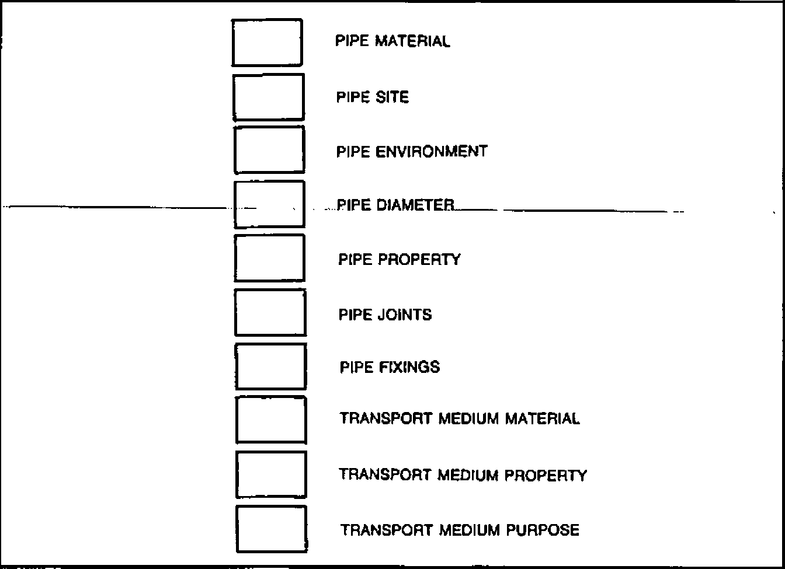

*Case Study: notes by Adrian Smith*

> The paper that follows actually came from the Association meeting on ‘APL and Knowledge-based Systems’ in September. However on reading it I quickly realised that it fell very nicely into the Case Studies category.
>
> It covers the development of a system called PATTIE, which is all about pipes. Given the need to transport (say) hot chocolate half a mile in freezing weather, what sort of pipe do you need? Should it be buried or lagged? Is it a serious industrial hazard to the surrounding community? Can it indeed be done at all??
>
> The experiences of the author in writing PATTIE ‘from the ground up’ make fascinating reading, and I hope you will find his paper as interesting and informative as I did.
>
> In this issue of VECTOR we include the outline and project background of PATTIE.
>
> - VECTOR 4 will include the remainder of the paper, which covers problem areas, and notes on the implementation.
> - for convenience, the references will be printed in both issues.

by Christopher Harvey
{ .byline }

## Outline of the Project

### The Problem

The computer press is full of stories of “Intelligent Knowledge-Based Systems” and “Expert Systems”. Industry seems very excited about them but just what are they?

As part of an Artificial Intelligence section of my Degree I had been introduced to Expert Systems by Mike Winfield, a lecturer who subsequently became my supervisor for the PATTIE (Pipe Analysis Techniques Through Inferential Expertise) project. In common with many people, the more I read, heard and thought about what Expert Systems were and what they could do, the more their potential for use struck me. I had to find out more.

### The Proposed Solution

It was decided that an excellent way to solve the above problem was to actually develop an Expert System. In the same position as myself (excited but ignorant) was a lecturer in the Mechanical Engineering Department called Dr. Steve Douglas.

The obvious struck us: for my final-year major project I could develop an Expert System for, and in conjunction with, Steve Douglas. The system could be in a mechanical engineering vein and would serve the purpose of an introduction to the field of Expert Systems for the both of us.

The initial aims of the project were stated to be: to act as a basis for understanding the following areas: Knowledge Engineering, Knowledge Representation, Natural Language Interfaces and Inferencing Mechanisms.

## How PATTIE Came About

### The Choice of Domain

The next problem was to find a domain around which to design and implement a system; that is to say, for which aspect of Mechanical Engineering could we write an Expert System? (We were lucky to be in the position of being able to choose the subject domain around which we could write our system. This would not, of course, normally be the case!).

After some thought and after considering areas such as Bearing Analysis and Mechanism Theory we came up with Pipe Analysis.

When first-year undergraduates of Mechanical Engineering start their courses there is an initial ‘barrier’ to be got over as regards just what is involved when considering piping from the points of view of design of pipes, what types of material to be used, what types of fluids, gases (the “transport mediums”) can actually pass through those pipes, how those pipes have to be jointed, how they can be fixed to their surroundings, etc.

Therefore a system to aid first-year undergraduates to overcome this barrier would be of some use. This seemed a reasonable idea on which to build.

In choosing the domain that we did we were looking for an area in which the knowledge, or expertise, could be ‘codified’ in the form of rules, relatively simply and straightforwardly, due to the time constraint involved (the system had to be finished inside six months).

Thus the idea was formally stated as: the domain would be that of Pipe Analysis related to Mechanical Engineering. A first-year undergraduate would enter into the system details of the proposed pipe site, the environment, the transport medium flowing through the pipe, etc. and the system would return aspects such as: what pipe materials could be used, how could/should the pipe be jointed and fixed to its surroundings and what other considerations must be taken into account (e.g. lag the pipe, bury it, etc.).

### Basic Operation

We had identified what seemed like a reasonable domain, therefore work could start on the system design. At this stage we knew effectively nothing about the design and development of Expert Systems, although we did know what they could do. From the point of view of a naive entrant to the field, there was little documented that could help with the question “How do you develop an Expert System?”.

As mentioned earlier, there was not a great deal of time in which to write the system. Therefore there was, relatively, little time for doing a vast amount of background reading and research. It was decided to use a well-documented system as a guide on which to base our Expert System.

The system chosen was the medical diagnosis system, MYCIN and its associated knowledge acquisition facility, TEIRSIAS (ref:1).

MYCIN was based on the concept of production rules. An example of a MYCIN rule is:

```
IF the infection is PRIMARY-BACTERENIA
AND the site of the culture is one of the STERILE SITES
AND the suspected portal of entry of the organism is the gastro-intestinal tract
THEN there is evidence that the identity of the organism of BACTERODIES.
```

Rules can therefore be seen to be a means of writing down, and storing, knowledge. It will be seen later how these rules are used by the system.

The next stage was to develop some rules, i.e., codified forms of knowledge, or expertise, involved in our area of Pipe Analysis. Examples of the original rules are:

```
RULE 1
  IF the transport medium is resistant to cold
  AND if it has an absence of taste
  THEN polyethylene can be used for the pipe.

RULE 2
  IF the pipe diameter is greater than 1.2 m
  AND the pipe is made of polyethylene
  THEN a flange joint is required

RULE 3
  IF the pipe is on the land
  AND it is near a fire hazard
  THEN it must be buried
```

The format of these rules is interesting because it is a domain expert’s idea, without the aid of a Knowledge Engineer of how he would formulate, or describe, knowledge of his domain. Knowledge Engineering is a very important part of the design process more of which will be mentioned later.

The next problem was the most difficult and yet the most interesting. How could the knowledge be encoded such that it would be in a format that the Inference Engine could work upon it?

After some deliberation it was decided as a first stage that the various details that had come through by the rules provided would need to be grouped under certain classifications where things could be logically divided up. For example; around the concept of “pipe site” there were things such as: buried, buried in a trench, above the ground, along a wall, etc. There were various types of pipe material: if the transport medium was an acid then do not use polyethylene, or if the purpose of the transport medium was for food manufacture then do not use, for example, brass pipes.

Given classifications such as these and the thirty or so rules provided, the following list of classifications evolved: pipe material, pipe environment, pipe property, pipe site, pipe diameter, pipe joints, pipe fixings, transport medium material, transport medium property, transport medium purpose and notes.

From the rules, examples of classification attributes are:

> Pipe environment — near fire hazard, near road, outdoors, unshaded, still water, running water
>
> Pipe material — polyethylene, cast iron, plastic, aluminium
>
> Transport medium property — resistant to cold, absence of taste, fluid, hazardous, hot
>
> Transport medium material — hydrofluorous acid, drain water, sulphur trioxide, chlorine, milk

The original rules could now be rewritten into a format based upon this concept. For example the three rules above became:

```
RULE 1
  IF a transport medium property is resistant to cold
  AND a transport medium property is absence of taste
  THEN a use-type is polyethylene

RULE 2
  IF the pipe diameter is greater than 1.2 m
  AND the pipe material is polyethylene
  THEN the pipe joints are flange

RULE 3
  IF the pipe site is on land
  AND the pipe environment is near fire hazard
  THEN the pipe site is buried
```

The basic operation which then followed was:

```
User gives:     the transport medium flowing through the pipe

System returns: Possible pipe material types
                How to joint each type
                How to affix each type
                'Properties' of each type
                Notes associated with rules
```

### Language and System Choice

PATTIE was implemented on a 68000-based multi-user micro system, it was written in C and ran under UNIX System III. The reasons for using C were:

i) its portability. If the system was going to be used by the Mechanical Engineering Department, it would be on a different machine. C was the most portable language available.

ii) many commercial Expert Systems are written in Pascal or C. Doing a similar system would give an insight into why this is and the ease of doing it.

iii) experience of C and UNIX was, in itself, desirable.

Prolog would probably have been a more suitable language to use because:

i) it has its own in-built pattern matcher

ii) it has its own in-built inferencing mechanism (using depth-first search techniques)

iii) it would have allowed us to concentrate on developing the Knowledge Base and the Natural Language Interface.

However, the reasons why C was chosen in preference to Prolog were:

i) it was considered that more would be learnt by writing our own inferencing mechanism rather than using the mechanism which is in-built within Prolog

ii) our Prolog interpreter did not work correctly!

## PATTIE System Operation

### General

How does the system actually manipulate the knowledge to produce ‘results’ from the program?

So as to concentrate efforts, the system works in terms of certain types of pipe material. The Knowledge Base is ‘partitioned’ into these types (for the purposes of this discussion let us say brass, concrete and polyethylene). There is also a partition for ‘general’ rules, i.e., rules relevant to pipes in general and not to any specific pipe material type. Rule 3 is a general rule.

New rules are entered into one of these partitions, although new partitions can easily be created.

The system, given the transport medium, tries to infer everything it can from the rules it has, asking questions of the user when it “gets stuck”.

As mentioned, the Knowledge Base is split into partitions, one for each type of pipe material. Given the transport medium, the system will initially try to rule-in or rule-out any of these pipe types. To do this it uses a further partition of rules called “Use-Type” rules. An example would be Rule 1, above. This example says that (given that the two conditions are *both* true then) it is possible to use a polythylene pipe. A Use-Type rule can also rule-out a pipe type (i.e. *not* Use-Type).

This is a very useful feature because it means that a whole section of the Knowledge Base can be eliminated from any future processing. This saves a considerable amount of time and effort from the point of view of the system file reading and pattern matching.

In the case where it is not possible to rule-in or rule-out a pipe type, the system will go ahead and assume that to use the pipe material would be reasonable.

After completion of the above stage in the processing, PATTIE will continue working to try to discover as much about each pipe type that has not been ruled out. When the searching of those relevant partitions of the Knowledge Base has finished, and all possible discoveries have been made, all the items of interest (mentioned earlier) are returned to the user.

Everything discovered by PATTIE comes from comparing rules in the Knowledge Base with other rules (this is detailed in a later section; the Inference Engine). When PATTIE cannot find a rule that will help to satisfy an inference being performed, as a last resort the user will be asked. All answers to queries are stored by the system in what is termed the Short Term Memory, or STM for short. Even answers where the user said NO are stored. This is on the principle that should it become necessary to ask the same question again, the STM can be checked first rather than bother the user who will not understand why the system appears to be repeating itself!

Also stored in the STM are ‘intermediate’ results discovered during processing. This saves work should the system re-trace steps already covered.

An important facility of PATTIE is the DON’T KNOW option. When the system has to ask the user a question there is the possibility that he will not know the answer. Therefore, to avoid the user having to give a potentially misleading piece of information to the system, he can reply DON’T KNOW to a question. The system must take this to mean a reply of NO, in that it proceeds no further with its current line of reasoning (indeed, it *cannot* proceed further) but, at the end of processing, the user is reminded of all questions which were answered in this manner, so that results can be put into perspective.

Another important option offered to the user was that of having a hardcopy at the end of the session detailing everything that happened during that session. This is necessary when a VDU was being used.

It is generally accepted that an Expert System should consist of the five components shown in Diagram 1. Each of these areas will now be gone into in more detail.

*Diagram 1*


### Knowledge Base

The core of the system is the Inference Engine and the Knowledge Base.

The Knowledge Base contains rules about the subject domain. To infer (discover) anything, the system has to be able to compare rules with other rules. Therefore, there has to be a ‘standard’ to which these rules must conform.

A rule clause takes the form:

```
type — classification — associated text
```

Examples:

```
IF   transport-medium-property  hazardous
AND  pipe-environment  hot
THEN pipe-property  lagged
```

Firstly, what are ‘classifications’? These could also be called ‘attributes’. Information about the domain is held with respect to these classifications. They are, if you like, a point of reference that PATTIE can use to compare a clause of one rule with another. Any new rule must be defined in terms of these classifications. A list of classifications and examples were given earlier.

Secondly, what is the “associated text”? Well, the classifications are fixed, rigid entities but the details associated with a classification in a clause of a rule are “free format” (i.e. you can type in whatever you like). It is this part of each clause that will be used during the “pattern matching” comparisons of the Inference Engine.

The example clauses just shown are not very ‘readable’. Therefore the idea of ‘noise’ words is used. Noise words recognised by the system are THE, A, IS and ARE. These words can be inserted into the above rule to give:

```
IF a transport medium property is hazardous
AND the pipe environment is hot
THEN a pipe property is lagged
```

These words are ignored during any processing involving the rule.

To save storage and access time the rules are stored in a compact form. Each of the ‘types’ (IF, AND, THEN, etc.) and each of the ‘classifications’ (pipe site, pipe property, etc.) are replaced by single values. Only the “associated text” needs to be stored in its full form, although even this is stripped of any unnecessary spaces. Upon retrieval of a rule from the Knowledge Base, should the rule need to be printed out, conversion to a more English-like format takes place (as shown above). Great use is made of these noise words.

Also available but as yet unmentioned, is the ability to add a purely textual note to the end of a rule. This was found to be a very useful facility. An example would be:

```
IF the pipe diameter is large
THEN the pipe fixings are concrete ballast
NB in this rule a protective material interface such as flux or plastic foil is required. sdd/11-83
```

The storage required by this rule is increased dramatically but the advantages are worth it.

As stated earlier, the Knowledge Base itself is divided up into logical ‘partitions’. The first partition is for Use-Type rules (rules which suggest whether, or not, certain pipe materials can be used for the scenario in question). The second is for ‘general’ rules (rules which are common to all pipe material types). Subsequent partitions hold rules specific to pipe materials e.g., there could be a partition containing rules about polyethylene, one containing rules about concrete, one about brass, etc.

The ability to group rules logically is very handy; it prevents duplication of effort and allows flexibility as well as the processing savings already stated. Unfortunately, it complicates the user view of the Knowledge Base slightly.

### Inference Engine

The Inference Engine, or program driver, is that part of the system which uses the knowledge held in the Knowledge Base to come up with the results which are output from the system.

Once the basis of the overall system design had been specified, i.e. the clauses of the rules were defined in terms of each other so that comparisons could be made, an inferencing mechanism was required.

That chosen was that of a backward-chained and/or tree; a technique used by MYCIN.

As an example of how the inferencing mechanism works let us assume that we have the following rules:

```
RULE A
  IF the pipe site is not buried
  AND the pipe environment is hostile
  THEN a pipe property is lagged

RULE B
  IF a transport medium property is hot
  AND the pipe environment is cold
  THEN the pipe environment is hostile

RULE C
  IF a transport medium property is cold
  AND the pipe environment is hot
  THEN the pipe environment is hostile
```

The system looks at Rule A. It can say that a property of the pipe is that it should be lagged *if* the pipe is not buried *and* the environment that the pipe is in is hostile. Assuming that it has already proved that the pipe is not buried; how can it show that the environment is hostile? The answer is to look at Rule B. If it can be shown that a property of the transport medium is that it is hot *and* it can be shown that the pipe environment is cold then it can be said that the environment is hostile. Once that has been done, the system can return to Rule A and deduce that a property of the pipe is that it should be lagged. Note that there may be more than one way to prove any particular point. Rule C may be of use if Rule B is not.

*Diagram 2*



It was stated earlier that everything PATTIE discovers is stored in the STM. Also stated was the fact that everything is defined in terms of classifications. The STM can be viewed, conceptually, as shown in Diagram 2.

System operation is easier to understand if viewed in this way. PATTIE is trying to find things to put into the ‘boxes’. Anything discovered is put into the STM. Each time PATTIE tries to prove anything, the STM is looked at to see if the answer is already there. If it is not, each of the other rules in the partition being scanned (and also the ‘general’ partition) is looked at to find a rule that would prove the point in question. If still unsuccessful, the user is asked to provide an answer.

When all the rules in all (available) partitions have been checked then the details in the STM can be given to the user. This is achieved by scanning through the STM printing out those details.

### Natural Language Interface

The interface between the user and PATTIE has been made as friendly, non-technical and easy to understand as possible. The system always has the initiative; it is working on something or asking the user a question. The user is never left alone not knowing what to type in next.

Due to the time constraint involved, it was only possible to implement a Question/Answer interface. All answers to questions are of the YES/NO variety. The, yet to be discussed, Explanation Facility required that the user was able to enter e.g., HOW 13 or WHY 45.3, at any stage in the processing. Therefore, each answer given had to be carefully vetted as to its validity.

It is our contention that the interface between the human and the computer is the most important part of the system. Apart from the obvious — if the user cannot access the system, it will be of no use — there is the equally important point that the user must see the system as a ‘friend’ and forget that he is talking to a machine. This is of great importance especially in the case of Expert Systems when one considers exactly what they are.

Apart from the answering of questions there is another input stage to the system. This occurs when the user is entering a new rule. As stated earlier, each rule has to be defined in terms of the classifications, thus there has to be quite strict checking of user input at this stage. The user is permitted to enter free text. However, the text is parsed and compared with the allowable classifications and the user informed exactly where in the text string an error occurred i.e., the system does more than just say ‘error’.

One of the most striking features of the interface is that it follows the MYCIN example in that the system speaks in terms of YOU and I, e.g. the system says things such as “I have discovered that …..” and “Would you please enter …..”.

As in the MYCIN example, the system repeats certain statements back to the user where there is potential ambiguity. The system knows what question it is answering but does the user know just what question he asked? It may sound daft but it happens.

As mentioned earlier, the concept of noise words was introduced to make the input and output of rules and associated questions as English-like as possible.

Features, such as the ability of the user to answer DON’T KNOW to a question, were considered important to implement even though the system design was complicated by this. Another feature of this type is being able to reply Y,YE,YES for YES i.e. the user can give as much of a reply as to make it unambiguous to the system.

Should the user not be sure about what a question means then he need only type HELP. Since the user is always at a question help is always available. Several levels of help were provided, where and as appropriate.

### Explanation Facility

This component of the system is absolutely vital. The system *must* be able to explain itself to the user. The user must be able to ask the system questions such as “Why do you want to know that?” or “How did you reach that conclusion?”.

At any stage during a session with PATTIE (either during processing or after processing has finished and the results have been returned) the user can ask the question as to WHY something was asked or HOW a conclusion was reached. All questions and conclusions output by the system are preceeded by a “statement number”. When querying something, this number is used, e.g., by typing in

```
WHY 18
```

the system knows that the user wants to know why question 18 was asked. The system will respond by printing back to the user what it interprets that the user wants to know (so there will be no confusion as to the question that will then be answered), followed by the line of reasoning on the point in question.

As well as asking WHY the system wanted to know something (past tense), the user can ask WHY the system wants to know something (present tense). Similarly with asking HOW; HOW did you reach a conclusion (past); HOW will you try to reach a conclusion (future).

It is important to note that the system can, and will, always explain itself to the user.

Provision of the Explanation Facility introduced one of the most complex parts of the system. This is due to the fact that the system has been provided with the ability to look into the future to answer queries such as “How *will* you conclude that …..?”.

A necessary feature of this facility is that it must be possible to obtain a complete line of reasoning, all the way back to the starting point if necessary.

### Knowledge Acquisition Facility

PATTIE operates in two modes. The first is what is called “Pipe Analysis” mode. The second is a mode of operation in which it is possible to directly update or interrogate the Knowledge Base — Knowledge Base Maintenance.

Its major function is the addition of new rules to the Knowledge Base. The input format of rules has been made as ‘natural’ as possible within the constraints necessary to ensure an effective system. There is an editing and correction facility during the input of new rules to ensure that new rules are correctly input to PATTIE.

To allow for tasting and “discovery through playing”, rules are never actually wiped from the Knowledge Base. When a rule is deleted it is marked as such but it remains in the system. The rule is ignored during any processing but it is available should it be required to restore it.

## References and Bibliography

1. Knowledge-Based Systems in Artificial Intelligence — R. Davies & D.B. Lenat (McGraw Hill)
2. The C Programming Language — B.W. Kerninghan & D.M. Ritchie (Prentice Hall)
3. The UNIX System — S.R. Bourne (Addison Wesley)
4. “Expert Systems : An Introduction for the Layman” — M.J. Winfield (Computer Bulletin (12-82))
5. “Themes and Case Studies of Knowledge Engineering” — E.A. Feigenbaum (Expert Systems in th Microelectronic Age (1979) pp 3-25)
6. “Knowledge Engineering for Medical Decision Making : A Review of Computer-Based Clinical Decision Aids” — Shortliffe et al (Proc. IEEE vol. 67 no. 9 (9-79)

*Christopher Harvey, Ph.D. Research (Knowledge-Based Systems), The University of Aston in Birmingham, 15 Coleshill Street, Birmingham B4 7PA.*

… TO BE CONTINUED IN VECTOR 4
