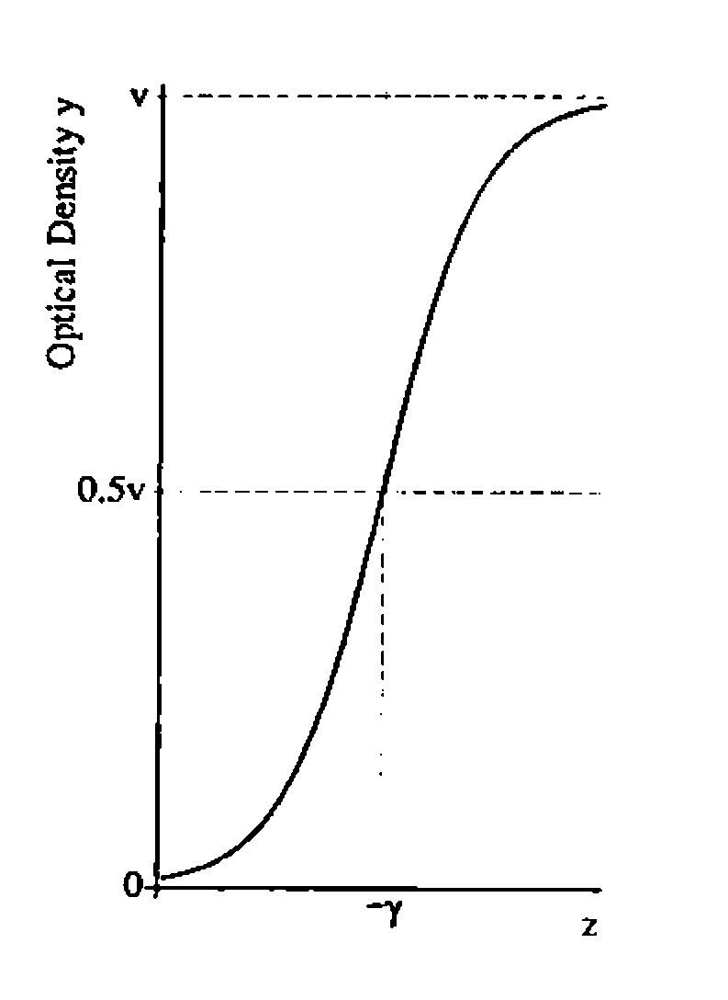
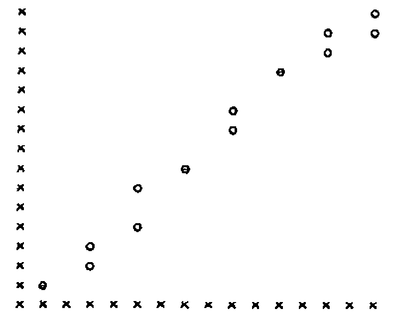
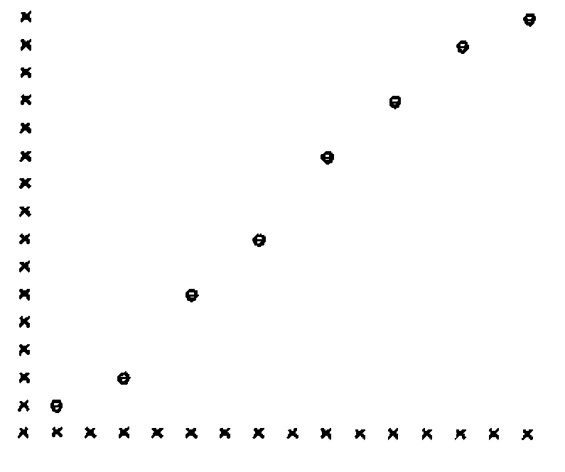
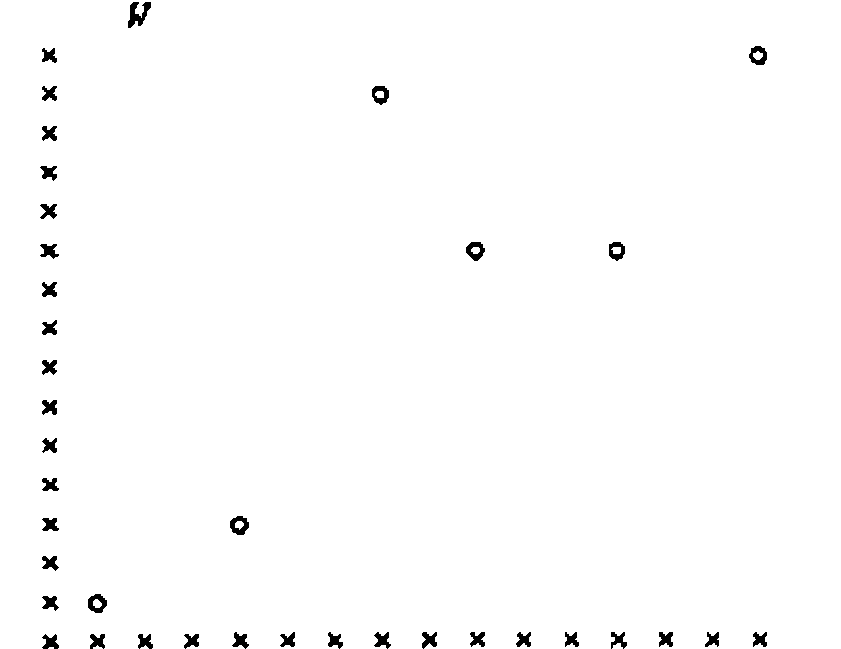
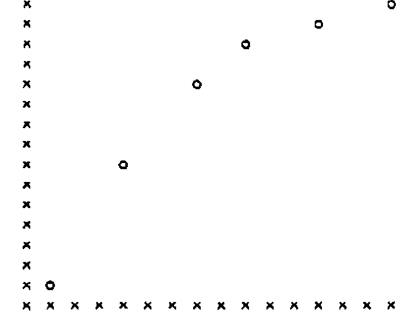

*by Peter Hingley*
{ .byline }

This article is a summary of a talk I gave at the ASL meeting in Gregynog in October 1991. It was suggested that a nonlinear regression modelling volume might be written for a future edition of the library, to augment the functions already available in the Regression shelf for analysing generalised linear models (GLIMs). Since then a similar suggestion has been made by Appleton [1].

In regression a data set is related to an underlying set of independent variables by an appropriate function, and the parameters of the function are to be estimated. One of the simplest examples of regression is of course the straight line model, y = a + bz, solvable on many statistical calculators. In this case the independent variable is z, the dependent variable is y, and the parameters are a and b.

There is a bewildering variety of types of nonlinear model, including time series models [2] and dynamic models exhibiting chaotic behaviour [3]. I shall consider the restricted situation where observed data are imagined to be generated by a regression model consisting of a function of independent variables, assuming fixed but unknown parameters and independent, identically distributed errors.

The aim is to find a method for estimating the values of the underlying parameters. In the functions and examples given below I will further restrict attention to models which are differentiable with respect to parameters, and have a single set of independent variables. Hence the APL functions would need to be greatly augmented to provide general purpose nonlinear estimation routines.

## A Logistic Function for ELISA Data

As an example of a nonlinear regression model, consider the logistic function. This has often been suggested as being appropriate for biochemical measurement systems where the possibility exists of saturation of the system at high levels of dosage input [e.g. 4]. We suggested [5] that one particular formulation of a logistic might be usefully applied to *Enzyme Linked Immunosorbent Assays* (ELISAs) for characterisation of antibodies against Foot and Mouth Disease in animal serum.

In this kind of assay fixed concentrations of serum antibody are reacted with varying concentrations of a standard virus antigen preparation [6]. The extent of reaction between antigen and antibody is given by a coloured indicator, the depth of colour being measured as optical density in a spectrophotometer.

One way of writing the logistic function is:

<i>y</i> = <i>v</i>.10<sup><i>a</i>(<i>z</i>+γ)</sup> / (1+10<sup><i>a</i>(<i>z</i>+γ)</sup>) + <i>e</i> = <i>f</i>(θ,z) + <i>e</i>



Here y is the optical density assay response, z is the applied log dosage of antigen, e is experimental error, v is the optical density at saturation, γ represents the log dosage giving 50% saturation, and a represents antibody heterogeneity.

It is of course obvious to APL users that a data set comprising *n* observations can be represented by nx1 vectors y, z, e; and that a set of *p* parameters like γ, a, v can be represented by a px1 vector θ (here p = 3). To keep things simple we will assume that the constituents of e are all independent and have zero expectation.

Now it is possible to transform the logistic equation so that it becomes a straight line model.

log[ <i>f</i>(θ,z) / (<i>v</i> − <i>f</i>(θ,z)) ] = <i>a</i>(<i>z</i>+γ)

However in doing this the error structure is perturbed. That is, the error structure of the new model becomes itself a function of inputs, outputs and parameters, leading to considerable complications in estimation. It is far better to use an estimation method based on the original model, but taking into account the inherent nonlinearity. In any case many other model formulations can not be so easily linearised as this example.

## Nonlinear Estimation

The following method has been found appropriate for the logistic model, and should be applicable to other cases also. In an earlier publication [5] APL functions were provided to solve a logistic model specifically. In what follows I will generalise the approach to deal with any model of a similar type. I will describe APL functions to implement a Gauss-Newton estimation method [7,8]. Other possible approaches that could be used include Newton-Raphson, Grid Search, Random Search or Derivative free methods, and the interested reader is encouraged to consult Seber and Wild [9] for a description of these. Other useful books include references [10, 11, 12 and 13].

We shall search for parameter estimates, θ = θ̂, which minimise the Residual Sum of Squares (RSS), defined as

RSS = [y − <i>f</i>(θ,z)]<sup>T</sup><sub>1xn</sub> [y − <i>f</i>(θ,z)]<sub>nx1</sub>

where <sup>T</sup> indicates transposition, and f(θ,z)<sub>nx1</sub> is the nonlinear function giving the expected value of y<sub>nx1</sub> for a given vector z<sub>nx1</sub> of independent variables.

The method will redefine the problem in terms of an approximate linear model. A linear model is a special case of the nonlinear model in which the function f(θ,z) is written as a product of a design matrix X<sub>nxp</sub> and a parameter vector B<sub>px1</sub>.

y = X<sub>nxp</sub> . B<sub>px1</sub> + e

It can easily be proved, as is shown in most statistics textbooks [e.g. 7], that the estimate of B̂ that exactly minimises the RSS is:

B̂ = [X<sup>T</sup>X]<sup>-1</sup><sub>pxp</sub> . X<sup>T</sup>y

where []<sup>-1</sup> indicates inversion of a square matrix.

Returning now to the nonlinear case, it is possible to approximate f(θ,z) by means of the first two terms of a Taylor expansion.

<i>f</i>(θ,z)<sub>nx1</sub> ≈ <i>f</i>(θ<sup>a</sup>,z)<sub>nx1</sub> + <i>f</i>′(θ<sup>a</sup>,z)<sup>T</sup><sub>nxp</sub>(θ − θ<sup>a</sup>)<sub>px1</sub>

where θ<sup>a</sup> is a guess for θ, and f′(θ,z)<sub>pxn</sub> is the derivative of f(θ,z) with respect to θ.

The nonlinear model for y can now be approximated as

y = <i>f</i>(θ,z) + e<br>&nbsp;&nbsp;≈ <i>f</i>(θ<sup>a</sup>,z) + <i>f</i>′(θ<sup>a</sup>,z)<sup>T</sup>(θ − θ<sup>a</sup>) + e

Rearranging, we can get an expression for the approximate residuals r<sup>a</sup>.

r<sup>a</sup> = y − <i>f</i>(θ<sup>a</sup>,z)<br>&nbsp;&nbsp;≈ <i>f</i>′(θ<sup>a</sup>,z)<sup>T</sup><sub>nxp</sub>(θ − θ<sup>a</sup>)<sub>px1</sub> + e

This expression is formally equivalent to a linear model, as defined above, with X = f′(θ<sup>a</sup>,z)<sup>T</sup>, and B = (θ − θ<sup>a</sup>). We can therefore write an approximate solution for (θ̂ − θ<sup>a</sup>) as:

(θ̂ − θ<sup>a</sup>) ≈ [<i>f</i>′(θ<sup>a</sup>,z)<sup>T</sup><i>f</i>′(θ<sup>a</sup>,z)]<sup>-1</sup>. <i>f</i>′(θ<sup>a</sup>,z)<sup>T</sup>r<sup>a</sup> = d<sup>a</sup>

Enough now exists for an estimation algorithm (similar to that described in [1]). Make a first guess for θ<sup>a</sup>. Then calculate d<sup>a</sup>, and update θ<sup>a</sup> to give θ<sup>a+1</sup> as

θ<sup>a+1</sup> = θ<sup>a</sup> + d<sup>a</sup>

Repeat the process iteratively, and declare convergence, θ̂ = θ<sup>a+1</sup>, when the next iteration modifies RSS by less than a given tolerance `MI`. That is when

RSS<sup>a</sup> − MI &lt; RSS<sup>a+1</sup> &lt; RSSa + MI

## Overshooting

The iterative process defined above suffers from the difficulty that the linearised parameter increment on any particular iteration can accidentally increase RSS, either by overshooting the point of minimum RSS or by some other peculiarity of the RSS surface. A simple modification to the algorithm can easily stop this happening. If RSS rises by more than the tolerance factor `MI` on any particular iteration, then the parameter increment is successively halved until an acceptable value of θ<sup>a+1</sup> is found.

![Flow diagram: Set up Model (a=0, h=1); Store RSS[a]; Calculate d[a]; θ[a+1] = θ[a] + hd[a]; Check θmin ≤ θ[a+1] ≤ θmax, if not set to limit; Too many iterations? (Yes: STOP); RSS[a+1] < RSS[a] + MI ? (No: h <- h / 2; Too many halvings? Yes: STOP, No: back to θ[a+1]); Yes: RSS[a]-MI < RSS[a+1] ? (Yes: Stop Successfully; No: RSS[a] <- RSS[a+1] and back to Store RSS[a])](art10003590/flow.png)

The flow diagram shown opposite summarises the operation of the algorithm, including limits on the numbers of iterations and halvings, and limits to the range of parameter estimates. It should be noted that the system technically only searches for local optima, and may become confused if the RSS surface has more than one minimum within the allowable range of parameters. The process is not guaranteed to converge successfully, but in regular problems with sensible starting estimates it usually seems to work. The main function `ESTIMATE` calls two subsidiary functions; `MFIZ` specifies the model f(θ,z), while `MDFIZ` specifies the derivatives f′(θ,z). After executing `ESTIMATE` the parameter estimates are found in the vector `PI`, the fitted values f(θ̂,z) in `FIZ`, while RSS is, not surprisingly, given by `RSS`. All the functions in this article were implemented in TRYAPL2, but should be easily transferable to other interpreters.

```apl
    ∇ ESTIMATE
[1]   ⍝  CARRIES OUT NONLINEAR PARAMETER ESTIMATION
[2]   ⍝  CAN BE USED INDEPENDENTLY OR CALLED FROM SIMLATE
[3]   ⍝  THE FOLLOWING GLOBAL VARIABLES ARE EXPECTED:-
[4]   ⍝  Y,  THE VECTOR OF DEPENDENT VARIABLES
[5]   ⍝  P0,  THE P×1 VECTOR OF INITIAL PARAMETER ESTIMATES
[6]   ⍝  PU, PL  P×1 VECTORS SHOWING UPPER AND LOWER BOUNDARIES
[7]   ⍝  HM  THE MAXIMUM NUMBER OF HALVINGS
[8]   ⍝  MI  THE MINIMUM RESIDUAL INCREMENT FOR CONVERGENCE
[9]   ⍝  IM  THE MAXIMUM NUMBER OF ITERATIONS ALLOWED FOR EST'N
[10]  ⍝  CALLS FUNCTIONS MFIZ, MDFIZ
[11]   MFIZ P0
[12]   RSS←+/((Y[;1]-FIZ[;1])*2)
[13]   I←0
[14]  HIS:WSS←RSS
[15]   I←I+1
[16]   XH←1
[17]   YOF←Y-FIZ
[18]   MDFIZ P0
[19]   PINC←YOF⌹(⍉DFIZ)
[20]   J←1
[21]  IIS:PI←P0+(PINC×XH)
[22]   PI←(PI×(PI≤PU))+(PU×(PI>PU))
[23]   PI←(PI×(PI≥PL))+(PL×(PI<PL))
[24]   MFIZ PI
[25]   RSS←+/((Y[;1]-FIZ[;1])*2)
[26]   RD←RSS-WSS
[27]   →JIS×⍳(I=IM+1)
[28]   →NIS×⍳(RD<MI)
[29]   →OIS×⍳(J=HM)
[30]   XH←XH÷2
[31]   J←J+1
[32]   →IIS
[33]  OIS:'TOO MANY HALVINGS'
[34]  NIS:P0←PI
[35]   →HIS×⍳((((RD*2)*0.5)>MI)∨(XH<1))
[36]   →KIS
[37]  JIS:'TOO MANY ITERATIONS'
[38]  KIS:
    ∇
```

```apl
    ∇ MFIZ P
[1]   ⍝  CALCULATES EXPECTED VALUES FOR DEPENDENT VARIABLES OF ESTIMATION MODEL
[2]   ⍝  SETS UP A N×1 MATRIX FIZ
[3]   ⍝  THE FOLLOWING GLOBAL VARIABLES ARE EXPECTED:-
[4]   ⍝  Z,  A VECTOR OF INDEPENDENT VARIABLES
[5]   ⍝  Y,  A VECTOR OF DEPENDENT VARIABLES
[6]    FIZ←(⍴Y)⍴FIZ←0
[7]   ⍝→B
[8]   ⍝  CALCULATIONS FOR LOGISTIC ESTIMATION MODEL
[9]    FIZ[;1]←10*(P[2;]×(P[1;]+Z[;1]))
[10]   FIZ[;1]←P[3;]×FIZ[;1]÷(1+FIZ[;1])
[11]   →C
[12]  ⍝  CALCULATIONS FOR EXPONENTIAL DECAY ESTIMATION MODEL
[13]  B:FIZ[;1]←P[1;]×(1-(10*(¯1×P[2;]×Z[;1])))
[14]  C:
    ∇

    ∇ MDFIZ P
[1]   ⍝  CALCULATES DERIVATIVE MATRIX OF EST MODEL WRT PARAMS
[2]   ⍝  SETS UP A P×N MATRIX DFIZ
[3]   ⍝  THE FOLLOWING GLOBAL VARIABLES ARE EXPECTED:-
[4]   ⍝  Z,  A VECTOR OF INDEPENDENT VARIABLES
[5]   ⍝  Y,  A VECTOR OF DEPENDENT VARIABLES
[6]    ZIPY←⍴Y[;1]
[7]   ⍝  CALCULATIONS FOR LOGISTIC ESTIMATION MODEL
[8]   ⍝→B
[9]    DFIZ←(3,ZIPY)⍴DFIZ←0
[10]   ZIP←10*(P[2;]×(P[1;]+Z[;1]))
[11]   DFIZ[1;]←P[3;]×(⍟10)×P[2;]×ZIP÷((1+ZIP)*2)
[12]   DFIZ[2;]←DFIZ[1;]×(P[1;]+Z[;1])÷P[2;]
[13]   DFIZ[3;]←ZIP÷(1+ZIP)
[14]   →C
[15]  ⍝  CALCULATIONS FOR EXPONENTIAL DECAY ESTIMATION MODEL
[16]  B:DFIZ←(2,ZIPY)⍴DFIZ←0
[17]   ZIP←10*(¯1×P[2;]×Z[;1])
[18]   DFIZ[1;]←1-ZIP
[19]   DFIZ[2;]←(⍟10)×P[1;]×Z[;1]×ZIP
[20]  C:
    ∇
```

## Example 1: ELISA of Antibody/Antigen Interaction

First I will demonstrate the operation of `ESTIMATE` using the logistic model for ELISA specified above. The data for estimation are explained above, and in more detail in [14]. The following output shows a possible terminal session. The plots were drawn using Anscombe’s `SCATTERPLOT` function [15], and show visually that the fitted values `FIZ` agree well with the data.

```apl
      ⍉Z
1.81 1.81 2.11 2.11 2.41 2.41 2.71 2.71 3.01 3.01 3.31 3.31
      3.61 3.61 3.91 3.91

      ⍉Y
0.157 0.144 0.303 0.229 0.538 0.41 0.62 0.599 0.863 0.817 1.049
      1.039 1.147 1.158 1.184 1.274

      IM←500
      MI←0.0001
      HM←20
      PL←3 1⍴¯10 0 0
       PU←3 1⍴10 10 10
       P0←3 1⍴¯2.5 1 1


      ESTIMATE
      ⍉PI
¯2.753996549
0.9207034535
1.340651261

      ⍉FIZ
0.1596307509 0.1596307509 0.272668213 0.272668213 0.4361869199 0.4361869199
0.6390867678 0.6390867678 0.8478902192 0.8478902192 1.025221088 1.025221088
1.152868976 1.152868976 1.234222932 1.234222932


      W←(,Z) SCATTERP (,Y)

      W
```



```apl
      W←(,Z) SCATTERP (,FIZ)

      W
```



## Example 2: Biochemical Oxygen Demand of River Water

Consider a simple data set discussed by Bates and Watts [10], and originally given by Marske [16]. These describe an assay for biochemical oxygen demand of samples of stream water where dissolved oxygen concentration (y, in mg/l) is regressed against time (z, in days). A decay model can be specified as:

<i>f</i>(θ,z) = θ<sub>1</sub>(1 − 10<sup>−θ<sub>2</sub>z</sup>)

```apl
      ⍉Z
1 2 3 4 5 6

      ⍉Y
8.3 10.3 19 16 15.6 19.8

      IM←500
      MI←0.0001
      HM←20
      PL←2 1⍴0 0
      PU←2 1⍴100 10
      P0←2 1⍴25 0.5

      ESTIMATE
      ⍉PI
19.21898833
0.2306874119

      ⍉FIZ
7.91990761 12.57611916 15.31356346 16.92294079 17.86911361 18.4253803

      SIG←((RSS÷4)*0.5)
      SIG
2.588690721


      W←(,Z) SCATTERP (,Y)

      W
```



```apl
      W←(,Z) SCATTERP (,FIZ)

      W
```



Apart from giving a confirmation that `ESTIMATE` works well in another situation, this example is of interest because Bates and Watts report that the expectation surface in parameter space is moderately curved, and the linearised Gauss-Newton steps do not match well to the surface. This might well lead to difficulties in obtaining precise estimates, but actually the results shown above seem adequate. Incidentally the estimates given here have an RSS of 6.701, slightly lower than the RSS of 6.707 obtainable from Bates and Watts’ estimates, though they quote a value of 6.498 which is clearly incorrect. Some degree of indeterminacy in final estimates is always to be expected in nonlinear estimation because convergence is declared at a certain level of acceptable tolerance. It is necessary for the user to ensure that the tolerance value `MI` in any particular case is not too large to lead to inaccurate estimates, but not so small that an excessive number of iterations are required.

## Probability Densities for Least Squares Estimates

There are a variety of statistical diagnostics that can be calculated after fitting a model. For the most part these are analogous to quantities used with linear models, and APL functions could easily be developed for them. However some extra restrictions are usually required on the error terms, typically that the vector e follows a multivariate normal distribution.

In order to demonstrate the advantage of using APL for extensions, I will show how functions can easily be established to simulate many sets of data, estimate parameters from each set, and then display the results in the form of a multi-dimensional frequency table. This kind of table gives a good impression of the shape of the multivariate probability distribution for the estimates, provided that a sufficiently large number of simulated data sets have been used to iron out sampling effects.

Consider the problem of simulating sets of data from the ELISA test logistic curve that has been described above. Assume that each data point from a simulated experiment has a normally distributed error, and that the errors for each point are independent and have constant standard deviation. The following global variables should first be specified: `SIG`, the standard deviation of error assumed; `NSIM`, the number of simulated experimental data sets; `PIN`, the true values of the parameters for generating the curves; and `PST`, the initial guess values for the estimation of parameters for each curve. (In practice we would probably set `PST` = `PIN`, except in the case of estimation when using a different model to that generating the data.)

The function `SETUP` allows the midpoints of the multi-dimensional frequency table to be defined, and then calls `SIMLATE`. Then for each of the simulated data sets, the true data generating model is specified by `MFOZ`, the random normal errors are added by `RNORMAL` (taken from [15]), while the parameter estimation is carried out using `ESTIMATE` and its associated functions as described earlier.

```apl
    ∇ SETUP
[1]   ⍝  THIS SETS UP A MATRIX BIN IN WHICH TO STORE SIMULATION COUNTS,
[2]   ⍝  AND A MATRIX BINL TO STORE CLASS BOUNDARIES.
[3]   ⍝  THE FOLLOWING GLOBAL VARIABLES ARE EXPECTED:-
[4]   ⍝  PIN,  A P×1 MATRIX CONTAINING TRUE PARAMETER VALUES
[5]   ⍝
[6]   ⍝  CALLS FUNCTION SIMLATE
[7]    BIN←1
[8]    DIN←DIN2←1
[9]    BINL←(1,(⍴PIN[;1]))⍴BINL←0
[10]   CPIN←0
[11]   IK←1
[12]  CLA:CPIN←CPIN+1
[13]   'ENTER CLASS DATA FOR PARAMETER ',CPIN
[14]   WDIN2←DIN2
[15]   WDIN←DIN
[16]   DIN2←⎕
[17]   DIN←((⍴DIN2)+1)⍴DIN←0
[18]   DIN[1]←(((3×DIN2[1])-DIN2[2])÷2)
[19]   K←2
[20]  ILA:→ILB×⍳(K=((⍴DIN2)+1))
[21]   DIN[K]←(DIN2[K-1]+DIN2[K])÷2
[22]   K←K+1
[23]   →ILA
[24]  ILB:DIN[(⍴DIN2)+1]←(((3×DIN2[⍴DIN2])-(DIN2[(⍴DIN2)-1]))÷2)
[25]   BIN←(((⍴DIN)+1),(⍴BIN))⍴0
[26]   →DLB×⍳((⍴DIN)≤(⍴BINL)[1])
[27]   WBINL←BINL
[28]   BINL←((⍴DIN),(⍴PIN[;1]))⍴0
[29]   ZE←(((⍴BINL)[1])-((⍴WBINL)[1]))⍴ZE←0
[30]   I←1
[31]  CLB:BINL[;I]←(,WBINL[;I]),(,ZE)
[32]   I←I+1
[33]   →CLB×⍳(I<CPIN)
[34]   BINL[;CPIN]←DIN
[35]   →ELB
[36]  DLB:ZE←(((⍴BINL)[1])-(⍴DIN))⍴ZE←0
[37]   BINL[;CPIN]←(,DIN),(,ZE)
[38]  ELB:IK←IK+1
[39]   →CLA×⍳(CPIN<(⍴PIN[;1]))
[40]   SIMLATE
    ∇
```

```apl
    ∇ SIMLATE
[1]   ⍝  THIS CARRIES OUT NSIM SIMULATIONS OF DATA SETS.  ESTIMATES ARE
[2]   ⍝  GENERATED AND STORED AS COUNTS IN BIN.  A MATRIX BIND IS SET UP IN
[3]   ⍝  WHICH SIMULATED APPROXIMATION OF P.D.F. OF ESTIMATES IS STORED.
[4]   ⍝  THE FOLLOWING GLOBAL VARIABLES ARE EXPECTED:-
[5]   ⍝  INFORMATION GENERATED BY SETUP
[6]   ⍝  SIG,  S.D. OF EXPERIMENTAL ERROR
[7]   ⍝  PU,PL,  P×1 MATRICES CONTAINING UPPER AND LOWER PARAMETER BOUNDARIES
[8]   ⍝  NSIM,  NUMBER OF SIMULATIONS
[9]   ⍝  PST,  P×1 MATRIX CONTAINING PARAMETER STARTING VALUES
[10]  ⍝  PIN,  P×1 MATRIX CONTAINING TRUE PARAMETER VALUES
[11]  ⍝  CALLS FUNCTIONS MFOZ, RNORMAL AND ESTIMATE
[12]   MFOZ PIN
[13]   SJ←1
[14]   TBIN←,BIN
[15]   BINM←⍴BIN
[16]   BIND←TBIN
[17]   N←((⍴FOZ)[1])
[18]  SIMO:Y←RNORMAL N
[19]   DIVI←1
[20]   Y←N 1⍴Y
[21]   Y←(SIG×Y)+FOZ
[22]   P0←PST
[23]   ESTIMATE
[24]   I←1
[25]   J←1
[26]  LA:→LB×⍳(J=(⍴⍴BIN)+1)
[27]   K←0
[28]  LC:K←K+1
[29]   →LD×⍳(K=((⍴BIN)[J]))
[30]   →LC×⍳(PI[J;]>BINL[K;J])
[31]  LD:IT←K-1
[32]   →LD2×⍳(K=1)
[33]   →LD3×⍳(K=((⍴BIN)[J]))
[34]   DIVI←DIVI×(BINL[K;J]-BINL[(K-1);J])
[35]   →LD4
[36]  LD2:DIVI←DIVI×(BINL[1;J]-PL[J;])
[37]   →LD4
[38]  LD3:DIVI←DIVI×(PU[J;]-BINL[(K-1);J])
[39]  LD4:ITI←J
[40]  LG:→LF×⍳(ITI=⍴PIN[;1]+1)
[41]   IT←IT×((⍴BIN)[ITI])
[42]   ITI←ITI+1
[43]   →LG
[44]  LF:I←I+IT
[45]   J←J+1
[46]   →LA
[47]  LB:TBIN[I]←TBIN[I]+1
[48]   BIND[I]←BIND[I]+(1÷(NSIM×DIVI))
[49]   SJ←SJ+1
[50]   →SEND×⍳(SJ=NSIM+1)
[51]   →SIMO
[52]  SEND:BIN←BINM⍴TBIN
[53]   BIND←BINM⍴BIND
    ∇

    ∇ MFOZ P
[1]   ⍝  CALCULATES DEPENDENT VARIABLES FOR TRUE MODEL, IN N×1 MATRIX FOZ
[2]   ⍝  THE FOLLOWING GLOBAL VARIABLES ARE EXPECTED:-
[3]   ⍝  Z,  N×1 MATRIX OF INDEPENDENT VARIABLES
[4]   ⍝  Y,  N×1 MATRIX OF DEPENDENT VARIABLES
[5]   ⍝  CURRENTLY SET UP FOR A LOGISTIC MODEL
[6]    FOZ←(⍴Y)⍴FOZ←0
[7]    FOZ[;1]←10*(P[2;]×(P[1;]+Z[;1]))
[8]    FOZ[;1]←P[3;]×FOZ[;1]÷(1+FOZ[;1])
    ∇
```

```apl
    ∇ Z←RNORMAL N;V
[1]    →2+∨/,(N≥1)∧(N=⌊N)∧0=⍴⍴N
[2]    →0,⍴⎕←'NO GO.',Z←' '
[3]    Z←(÷2147483647)×?(2,⌈N÷2)⍴2147483647
[4]    Z←N↑(,1 2∘.○Z[2;]×○2)×V,V←(¯2×⍟Z[1;])*0.5
    ∇
```

The following printout shows part of a run involving 500 simulated data sets. The analysis represents a continuation directly from the session on ELISA data given above in Example 1. Set `PST` and `PIN` to be the same as the estimates `PI` generated by the real data analysis, and the fixed standard deviation to be equivalent to the estimate obtained from the raw data. After running the simulations the frequency table is given by matrix variable `BIN`, while the class boundaries are shown by the matrix variable `BINL`. Inspection of `BIN` shows the strong interdependent relationship between the three estimates γ, a and v; behaviour that is usually only represented indirectly by the covariance matrix for estimates when using other nonlinear estimation packages.

```apl
      PST←PIN←PI
      SIG←((RSS÷13)*0.5)
      SIG
0.04132816099

      NSIM←500
      ⎕RL
1805305474
      SETUP
       ENTER CLASS DATA FOR PARAMETER 1
⎕:     ¯2.85 ¯2.8 ¯2.75 ¯2.7 ¯2.65 ¯2.6 ¯2.55
       ENTER CLASS DATA FOR PARAMETER 2
⎕:     75 .8 .85 .9 .95 1.0 1.05
       ENTER CLASS DATA FOR PARAMETER 3
⎕:     1.2 1.25 1.3 1.35 1.4 1.45 1.5

         BINL
¯2.875 0.725 1.175
¯2.825 0.775 1.225
¯2.775 0.825 1.275
¯2.725 0.875 1.325
¯2.675 0.925 1.375
¯2.625 0.975 1.425
¯2.575 1.025 1.475
¯2.525 1.075 1.525

         BIN
0 0 0  0  0  0  0 0 2    ... 0 0 0  0  0  0  0 0 0
0 0 0  0  0  0  1 5 0        0 0 0  0  0  0  3 1 0
0 0 0  0  0  0  0 1 0        0 0 0  0  0  3 14 1 0
0 0 0  0  0  0  2 0 0        0 0 0  0  0 12  7 0 0
0 0 0  0  0  0  0 0 0        0 0 0  0  1  1  1 0 0
0 0 0  0  0  0  0 0 0        0 0 0  0  0  0  0 0 0
0 0 0  0  0  0  0 0 0        0 0 0  0  0  0  0 0 0
0 0 0  0  0  0  0 0 0        0 0 0  0  0  0  0 0 0
0 0 0  0  0  0  0 0 0 ...    0 0 0  0  0  0  0 0 0       ... and so on
```

A matrix variable (`BIND`, not shown) is also produced to formally represent the simulated probability distribution of estimates. Actually when an estimation model is linear the estimate distribution will be multivariate normal, but in a nonlinear case like this the situation is more intricate. Such simulations can be used to check the adequacy of analytic approximations, such as those given by asymptotic maximum likelihood theory or saddlepoint approximations [17]. Further, the system can be easily used to investigate the behaviour of estimates when the regression model used for estimation differs from the model that is actually generating the data. It could then be used to augment studies of discrimination between models [18].

## Conclusions

The function `ESTIMATE` can be used for application of the Gauss-Newton method to nonlinear estimation, where an independent constant standard deviation error model is appropriate for a set of data. Fairly obvious extensions could be made to deal with non-normal or non-independent errors, or to other techniques of estimation. It might be sensible to include `ESTIMATE`, or some function related to it, in any potential nonlinear regression volume for the ASL system. A different approach for ASL might be to attempt to re-write generalised linear models as generalised nonlinear models [19], by removing the distinction between the linear predictor and the link function.

I have not made any attempt so far to adapt the functions to ASL standards [20]. Also I have not attempted to make the defined functions maximally efficient in APL terms, and they could probably be written with fewer lines of code. However it is an open question whether general purpose APL functions run more or less efficiently if they are maximally compacted to take into account the elegance of the language.

The extension to probability distributions for estimates is a more specialised area which may not be of universal interest, but is important and demonstrates the kind of investigation which can easily be pursued in the APL milieu.

## References

[1] D.R. Appleton, *Curve-fitting in APL*, Vector, Vol.8, No.3 (1992), pp.23-28.

[2] T. Amemiya, *Advanced econometrics*, Basil Blackwell, Oxford (1985) 521pp.

[3] J.M.T. Thompson, and H.B. Stewart, *Nonlinear dynamics and chaos*, John Wiley, Chichester (1986) 376pp.

[4] D. Rodbard, *Statistical quality control and routine data processing for radioimmunoassays and immunoradiometric assays*, Clinical Chemistry, Vol.20 (1974), pp.1255-1270.

[5] P.J. Hingley, and E.J. Ouldridge, *The use of a logistic model for the quantitative interpretation of indirect sandwich enzyme labelled immunosorbent assays (ELISA) for antibodies and antigens in foot and mouth disease*, Computers in biology and medicine, Vol.15, No.3 (1985), pp.137-152.

[6] E.M.E. Abu Elzein, and J.R. Crowther, *Enzyme labelled immunological assay techniques in foot and mouth disease virus research*, Journal of Hygiene, Vol.80 (1978), pp.391-399.

[7] N.R. Draper, and H. Smith, *Applied regression analysis*, John Wiley, New York, Second edition (1981) 709pp.

[8] R.I. Jennrich, and P.F. Sampson, *Application of stepwise regression to non-linear estimation*, Technometrics, Vol.10 (1968), pp.63-72.

[9] G.A.F. Seber, and C.J. Wild, *Nonlinear regression*, John Wiley, New York (1989), 768pp.

[10] D.M. Bates, and D.G. Watts, *Nonlinear regression analysis and its applications*, John Wiley, New York (1988), 365pp.

[11] A.R. Gallant, *Nonlinear statistical models*, John Wiley, New York (1987), 610pp.

[12] D.A. Ratkowsky, *Nonlinear regression modelling*, Marcel Dekker, New York (1983), 276pp.

[13] G.J.S. Ross, *Nonlinear estimation*, Springer-Verlag, New York (1990), 189pp.

[14] P.J Hingley, *Antibody affinity distribution-based models for vaccine potency assessment*, in *Theoretical Immunology*, A.S. Perelson (ed.), Reading, Massachusetts (1988), Part one, pp.311-325.

[15] F.J. Anscombe, *Computing in statistical science through APL*, Springer-Verlag, New York (1981), 426pp.

[16] D. Marske, *Biochemical oxygen demand data interpretation using sum of squares surface*, unpub. M.Sc. thesis, University of Wisconsin-Madison (1967).

[17] O.E. Barndorff-Nielsen, *Parametric statistical models and likelihood*, Lecture notes in statistics, Vol.50, Springer-Verlag, New York (1988).

[18] D.S. Borowiak, *Model discrimination for nonlinear regression models*, Marcel Dekker, New York (1989), 177pp.

[19] P. McCullagh, and J.A. Nelder, *Generalized linear models*, Chapman and Hall, Second edition, London (1989), 511pp.

[20] D.S. Eastwood, *ASL Standards*, Vector, Vol.8, No.3 (1992), pp.46-51.
