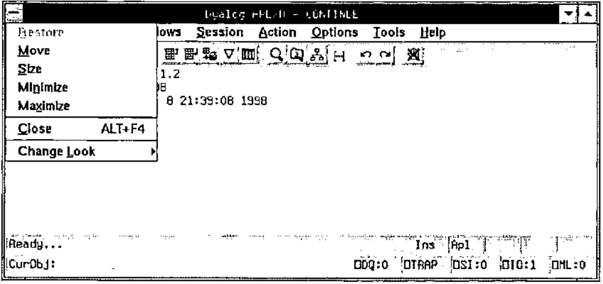
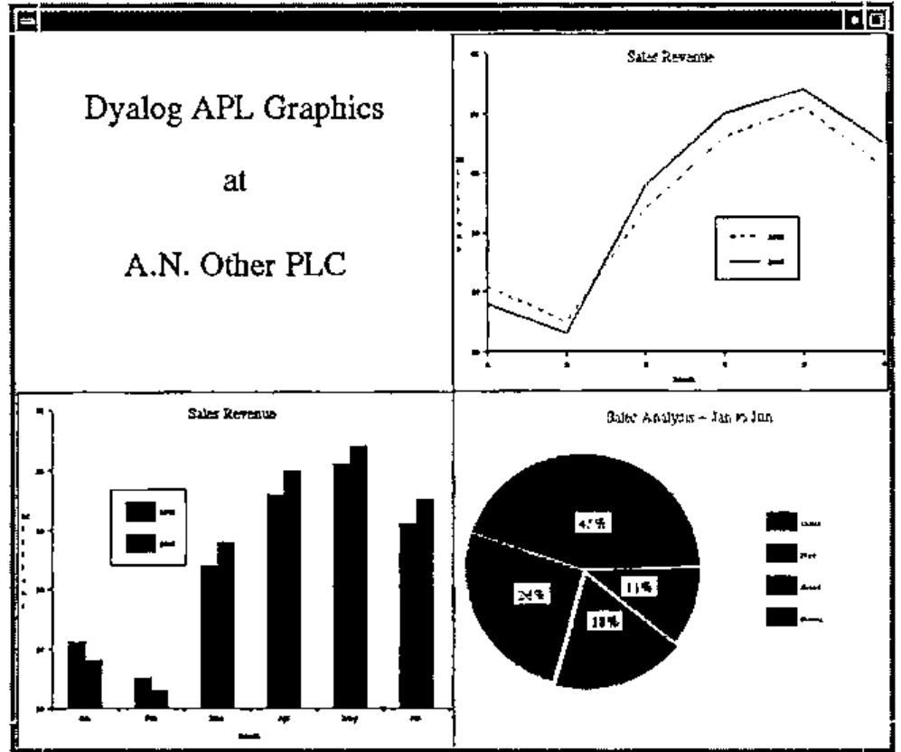

*reviewed by Bob Hoekstra*
{ .byline }

## Abstract

Dyadic Systems had been a major force in the UNIX APL market for some years when they left it to concentrate on developing APL interpreters for Microsoft Windows. With their latest offering they again target the UNIX users, giving them the benefits of the last few years of Windows development.

## Introduction

Those readers who have met me (even only briefly) will know that I am very enthusiastic about two things in computing: APL and UNIX. When these two interests combine (as in this case) I can become positively fanatical.

At home I run Solaris 2.5 on a Sun SPARCstation 2 (the SPARC processor upgraded to a Weitek Power µP). This machine provided the test bed for the software under review, *Dyalog APL/M 8.1.2 for Sun Solaris 2.5*. I also have PCs with Linux (the Debian distribution), Windows NT 4 and Windows 3.11. This is relevant as they provide a basis for comparison — Dyalog APL/M is a UNIX port of APL/W 8.1, which I use under Windows NT.

In fact, I use several versions of APL on many platforms (including mainframes when my clients require this). I have been waiting to get my teeth into this particular APL interpreter ever since I heard of the APL/M project.

## This Review

This is an attempt at providing a comment on a new product. It is targeted at an audience of APL users, many of whom will probably know little or nothing about UNIX. I will try to provide adequate notes and explanations where necessary.

As a separate exercise, I will also be publishing a very similar review in *Browser*, the magazine of the Sun User Forum (previously known as the Sun UK User Group). This will cater for the UNIX (mainly SunOS) users who may be unfamiliar with APL. Of course, there may be a small number of readers who, like me, use both APL and UNIX. Some time after both publications appear in print a version of this review will also appear on my web site, and this version will be kept as up-to-date as my circumstances (and Dyadic Systems) allow. See www.khamsin.demon.co.uk.

Readers are assumed to be familiar enough with Microsoft products not to require any explanatory notes.

Please note that the review is not intended as a vehicle for expressing my views on the qualities of the interpreter itself (which are very favourable) but rather the implementation of that interpreter under the Solaris 2.5 operating system.

### What is UNIX?

**Note:** This is a quick introduction to UNIX. Those readers familiar with UNIX or UNIX-like operating systems may want to skip this section. Please feel free to do so.

UNIX is an operating system with a heritage dating back to the 1960s. It originated in the AT&T laboratories in the USA, but it was a long time before it was offered as a commercial product, first having been taken on board by many universities, scientific laboratories, etc. Each institution added its own features, and as a result the standard UNIX distribution has become an interesting combination of smallish programs, which are not all consistent in their interface. The general idea in UNIX is to have a smallish kernel which provides essential services and to have separate simple programs or tools to provide everything else. This is in sharp contrast to DOS and related operating systems, where all commonly used functions reside in the kernel.

There was some competition as to what a standard UNIX distribution should consist of and this eventually concentrated about two rival camps: those who followed the AT&T line of thought and supported what became known as *System V* UNIXes, and those who followed the adjustments favoured by the University of California at Berkeley and supported *BSD* (Berkeley Software Distribution) UNIXes. In many cases, one would use the same or similar command to perform a task on the two types of system, but the command would react slightly differently. Sun Microsystems’ operating systems up to and including SunOS 4 were BSD compliant. However, SunOS 5 (the operating system that underpins the Solaris 2 product) is a System V Release 4 (SVR4) compliant UNIX. SVR4 is becoming the "standard UNIX", with other vendors following suit.

At first there was no UNIX GUI interface, but soon X Windows (developed at MIT and descended from work done at the Xerox Palo Alto Research Centre or PARC) was adopted almost universally. Unlike the Microsoft operating systems, no UNIX vendor chose to "integrate" the windowing system with the operating system itself. It remains a separate entity, necessary if support for terminals and terminal emulators is to continue. Initially there was much diversity between different vendors’ implementations of X Windows (see Notes 4 and 6) but recently many vendors are becoming CDE compliant (see Note 9).

### Why use UNIX?

I could write a separate article on this subject, but I think I’d better stop at a short list of some of the reasons why (in my opinion) UNIX is a better choice than any Microsoft operating system for the APL developer. Note that none of these features are new but have been in UNIX for years. Some of them are slowly creeping into Windows NT, but (my opinion again) the implementation under NT is *never* as elegant or easy to use.

1. UNIX has always been a multi-user operating system. This means that more than one user can use the computer simultaneously. Proper account is taken of the rights of different users and their ability to protect their data from, or share it with, their fellow users. Only the superuser, root, would normally have the ability to override this security system.
2. The file system supports decent locking facilities which may be used in conjunction with the locking capabilities of the APL interpreter, simplifying the writing of multi-user applications.
3. UNIX is network aware. Proper security exists for logins and resource sharing across networks (this includes the Internet) and so networked applications can be written simply.
4. A version of UNIX is available for almost every computer imaginable (please don’t bombard me with exceptions). Some examples:
    1. SunOS 5 (Solaris 2) runs on PCs (’486 or better) right up to 64-processor SPARC machines. Sun have announced their intention to provide a far greater number of processors (around 1,000!) soon (new hardware, same operating system). And Microsoft say that NT is scalable?
    2. Linux (a free UNIX-like operating system) will run happily on a 4MB 386 machine, SPARC boxes and Alphas. A Macintosh port is in progress.
    3. Talking about Apple, their latest operating system, Rhapsody, is a derivative of what used to be NeXTStep, a Mach-kernel UNIX.
    4. Even IBM have a UNIX (AIX) and I once saw a report of an OSF 1 derivative UNIX that IBM had running on a 360 mainframe!
5. UNIX systems have a single file system. Devices (hard disks, CD ROMs and perhaps even floppies) are "mounted" at points in the file system so that the file system becomes a cohesive single unit. This is extended to remote disks, where machine A may allow machine B to mount part of its file system, which then becomes part of B’s file system also. Note that this is (to the user) a much simpler concept than "mapping" a remote machine’s shared directory to a logical device name as is done under Windows or NT, and that the security implications have (in my humble opinion) been resolved in a far more flexible and satisfactory way. Along with the ability to create symbolic links (see Note 8) and automounting (see Note 13) this makes for a very powerful file system.
6. While there are significant differences between one vendor’s UNIX and another’s, they also share many similarities so that they will very happily share resources over a network. I have worked with networks where machines running SunOS (4.x and 5.x), HP-UX (Hewlett Packard’s UNIX), IRIX (Silicon Graphics’s UNIX), and Linux all share resources in such a way that the users were (blissfully) unaware of the physical location of the disk they were reading from or writing to.
7. The window system (X Windows) is also network aware, allowing the running of a program on one machine with the user interface displaying at another machine altogether. This allows the developer to make full use of the client-server concept. Note that the "display" machine need not be a UNIX box — a PC running Windows 3 and an X server will do nicely.
8. Administration is a lot easier on a UNIX machine. I’m not talking here about opening windows and clicking on buttons to create a new user, but the resolution of real problems which occur in real life. In particular, the unknowledgeable user can be prevented from rendering his machine unusable (e.g. like deleting parts of the operating system) while retaining the power to personalise his own working environment in a safe way.
9. UNIX is a mature, stable operating system. From a recent survey, it was noted that no users of Solaris 2 on PCs had ever seen the equivalent of NT’s "blue screen of death". Not one. Yes, crashes occur, the user may get locked out or applications die in disgrace, but no-one had seen the operating system roll over and die to the point where the only solution was a physical power cycle (which is potentially fatal to a cacheing file system like that of NT or almost all UNIXes). The worst I have ever seen was where I (as system administrator) had to login remotely and force a user off the system, which closed all his open files and the system became usable again (I did reboot the system after this, but this was probably not necessary).

I have really only scratched the surface here. If pressed, I may write a further article justifying my comments, but that would be of little interest to APLers in general.

A little fact that may be of interest is the early tie between UNIX and APL. Apparently Ken Thompson (one of the great names of both UNIX and C) wrote an APL interpreter, APL/11, while at Bell Labs. I have no idea when this was, but to quote Michael Cain (who currently maintains APL/11) "…it spent some time at Yale and finally arrived at Purdue University. Since 1976 it has been modified by Jim Besemer and John Bruner at the School of Electrical Engineering, Purdue, under the direction of Dr. Anthony P. Reeves…". This interpreter lives on as a free APL for UNIX and Linux, and in its latest incarnation as FreeAPL, for Windows as well. Any who are interested may contact the "Licensor" of FreeAPL, Tauno Ylinen, Helsinki, Finland [e-mail address omitted].

### About Dyalog APL

I first came into contact with Dyalog APL in 1990, running version 5 under AIX on an IBM 6150 RT/PC (see Note 1) using dumb terminals. I immediately realised (despite limitations in the hardware) that this was an excellent implementation of the language, in many ways superior to the VSAPL, APL2 (see Note 2) and APL\*Plus (see Note 3) that I had been using in the past. Shortly thereafter I enjoyed using Dyalog APL/X version 6 under SunOS 4 with OpenWindows (see Note 4).

I have subsequently used the Dyadic products under several UNIX variants (see Note 5) as well as MS-DOS and Windows (3, 95 and NT) and have always been impressed by the interpreters. Prior to Dyalog APL version 7, Dyadic Systems’ products had been mainly for various UNIXes. They switched their main development effort on the Windows platform after Version 6. Version 6.x was ported to DOS and later to Windows, and this developed into version 7. Version 8 came later and is intended for 32-bit Windows (i.e. Windows 95 and NT). As far as I am aware, there was never a Dyalog APL version 7 for any UNIX operating system. Perhaps this was not surprising as version 7 saw the introduction of a GUI programming interface under MS Windows. Nevertheless, there have been interesting non-GUI-related developments in version 7 and version 8 . When I heard that version 8 was to be ported back to the UNIX operating systems, I breathed a sigh of relief.

Currently available are version 7.3 for 16-bit Windows (i.e. Windows 3) and version 8.1 for 32-bit Windows: Windows 95, Windows NT and now some versions of UNIX using X Windows, with restrictions on the window managers (see Note 6) in use.

Dyalog APL 6.2 (the character version) is also still available for many UNIX platforms, though APL/X 6.2 (the X Windows version) is no longer sold — its place in the product line has been taken over by APL/M. I suspect that a non-X version 8 will appear soon to offer the non-GUI related benefits to those developers and users who do not need the Gui.

## The Software

The interpreter supplied here is, as far as I can tell, identical to the version 8.1 supplied to Windows 95 or NT users. It is an ISO 8485 compliant APL interpreter and development environment with the usual Dyalog extensions to the ISO standard. The latest of these extensions include namespaces, dynamic functions, coloured function and variable editors and a complete implementation of the MS-Windows GUI tools as implemented by Dyadic Systems in the Windows 95/NT product.

Some readers may be surprised by the last addition. The Windows GUI tools are implemented by the use of the MAINSoft Corporation’s MAINWin Cross Development Kit (CDK). This CDK is based upon Microsoft source code ported to UNIX and is constantly updated as new features are added to Windows. Dyadic Systems stress that MAINWin is *not* an emulator. It executes native machine language and makes direct calls to Xlib.

Use of this CDK entails paying Microsoft a royalty for the use of their code. This is part of the purchase price and is done by the suppliers, not the purchaser. This is no doubt the reason why a freely distributable run-time interpreter, which cannot be used for development, is *not* included in the package. In Windows versions this run-time interpreter is a big selling point.

## The Package

The review copy of Dyalog APL/M arrived on a single compact disk, accompanied by some 10 A4 pages of installation and setup instructions specific to the platform. A purchaser would also receive the same documentation that accompanies an interpreter intended for Windows, which consists of 3 soft-cover books of good quality as well as some additional material. While this is very good documentation for those familiar with APL, it is probably inadequate for those wanting to learn the language, who will have to turn to more suitable literature or attend a language training course.

## Loading the Software

The instructions are clear and easy to follow. The installer should ideally have root access. A quick `cpio` command and a little less than 35 MB is installed on the disk (in my case, in `/usr/mdyalog`, but see Note 8). This took just a few minutes on my machine, even though I was NFS-mounting (see Notes 13 & 14) the CD from my Linux box over my home network.

Next you are instructed to edit the `apl.ini` file in order to set the values for LPTn so printing can be performed. While this may seem disappointingly "Windowsish" to the readers, let us remember that APL/M is a port of the APL/W product. Only PostScript printers are supported. Lastly, a shell script (see Note 7) has to be executed for each user in order to set up their environment, and you are ready to run.

I would have been a little happier if the disk had contained a Solaris-style package, which I think is an extremely neat way to install and remove software. However, given that this software is available for several UNIXes, most of which do not support packages, I am quite happy that Dyadic Systems made the installation as simple as possible.

## Running the Software

I symbolic linked (see Note 8) `/usr/mdyalog/mapl` (a Bourne shell script) to `/bin/mapl` so that I didn’t have to adjust my `PATH`, and entered this command in a `dtterm` session (I usually run CDE). The software immediately started creating a font cache, analysing each of 1254 fonts installed on my system when running CDE! (see Note 9). This took several minutes, but fortunately this is not repeated on subsequent loads, but it may be repeated if the fontpath changes. This happens to me if I change to the `twm`, `olwm` or `olvwm` window managers.

Figure 1: The Session Manager and the "Help/About" box
{ .caption }

After a short delay, the APL session appears, complete with motif adornments (see above). The window adornments are hard-wired into the system, although you do have the option of choosing a "Windows Look" (see below). Even if using OpenWindows (`olwm`, `olvwm` or `twm`), the user sees only Motif or Windows widgets attached to the APL session manager, and trying something more exotic by way of window managers (see next section) really brings problems.

Figure 2: The "Windows Look" — about to return to the "Motif Look"
{ .caption }

It surprised me that the "Windows Look" was in fact that of Windows 3 (or NT 3), and not Windows 95 (or NT 4) as Windows widgets are included in the software which are available in APL/W 8 (for Win95 and NT) and not in APL/W 7 (for Win3). I asked Dyadic systems about this, and they explained that future versions of MAINWin will provide the more modern "look". This is part of the continuing development of the product.

## Trying Other Window Managers

Dyadic Systems warns that *only* the following are supported:

**Supported X servers**

a. X11 Release 4 or 5 on any supported platform 
b. Xnews on Sun with OpenWindows 3 
c. Hummingbird PC X WServer eXceed version 5.1.3.0 or greater

**Supported window managers**

a. mwm version 1.2 
b. olwm on Sun 
c. vuewm on HP HP-UX 
d. 4Dwm on SGI IRIX 
e. CDE 1.0

From my experience, `olvwm` (on Sun) also works and I experienced no problem with `twm`, although Dyadic Systems tell me that this last window manager has caused problems.

I tried to run the software on my Sun box, displaying on my Linux machine (using XFree86 and several window managers, including `afterstep`, `fvwm2`, `kwm`, `olwm` and `vmaker`), but failed. The mouse pointer turned into a black rectangle and the colours were all wrong. In particular, white was sometimes turned into black, but not the reverse, meaning that I was often left with black text on a black background! I am told that XFree86 does not implement the complete set of X intrinsics.

I would have liked to try an X terminal as well as a PC X Server, but I couldn’t due to lack of availability. I also cannot confirm whether I would have been able to display on the other supported configurations, e.g. running on a Sun and displaying on a Silicon Graphics or Hewlett Packard box because I did not have access to the hardware required.

## Performance

I had been warned that the hardware I was using was not really powerful enough for displaying APL/M at its best. Nevertheless, as I had run other versions of Dyalog APL on slower machines, I was keen to try it. I had a copy of APL/X version 6.2.0 at my disposal, and this seemed like the ideal benchmark for the new product.

It was obvious that APL/M takes a long time to start. Repeatedly timing the start gave about 35 seconds for the first time after logon, and about 20 seconds thereafter. I am sure a more powerful machine would have helped here! However, this is something a user does only once or twice per day, so is probably not very important. It certainly becomes insignificant compared to the time taken to start CDE or OpenWindows. By comparison, APL/X was up and running within 2 seconds on my SPARCstation 2.

Once up and running, differences between the two version on my SPARCstation evened out. My tests were not exhaustive, but it appears that APL/X is about 50% faster on simple arithmetic operations and almost twice as fast on creating some (not all) X windows. Again, I mentioned this to Dyadic Systems, who tell me that they are aware of the problem and intend to resolve it. They are confident that APL/M will soon be as fast if not faster than APL/X.

Bearing in mind that the new interpreter (version 8.1.2) has a lot more functionality than the older one (version 6.2.0) and that the original version 8 had been written for a totally different platform, I had been expecting some differences. However, these differences were much larger than I had anticipated.

Someone expecting to do development on this interpreter or use it on large amounts of data is likely to have a more modern workstation and the speed differences would be less important. Generally, I found it quite usable on my machine, except for the initial start-up time, and I don’t see execution speed as a serious problem, although it might be in certain circumstances.

## Porting Code

In the past, porting Dyalog APL code from one platform to another had been a problem. Workspaces had an incompatibility over little and big endian machine architectures and had to be ported between workstations (see Note 10) and PCs. This version of the interpreter can read either little or big endian workspaces, transparently converting the workspace on reading from disk. This means that I could read workspaces saved with APL/X without a problem. However, porting the opposite way (APL/M to APL/X) is more problematic, as they are not compatible. However, I doubt that anyone would want to do this (well, not often, anyway).

Even more useful is the fact that I could swap workspaces with my APL/W on NT without any problem at all in either direction.

Unfortunately, component files (see note 11) are not portable between architectures. To me this seems more important than providing workspace portability, as this means that sites using both architectures will have to maintain separate data sets for each! Utility workspaces are provided which make the porting of component files simple. There are alternatives to this (i.e. creating an APL data server — TCP/IP code is also built into the interpreter and very easy to use). I asked about this and was told that Dyadic Systems intend to implement a platform-independent component file system for both the Windows and the UNIX product in a future release.

I tried running several workspaces that had been created with APL/X and had no problem with any except those that tried to implement X11 graphics routines. This functionality is not included with APL/M. Again, this is not surprising given its heritage, and other ways of producing similar graphics are provided (see Figure 3). *Rain* graphics (from Causeway) also worked without problems.

Figure 3: An example of the graphics available
{ .caption }

Next I tried running code produced using APL/W under NT. This produced few problems and was, on the whole, surprisingly simple. As a final test, I ported a large application (the result of about 3 months’ work) from NT to Solaris. This took me about 24 hours, or 3 man-days. The result worked, although rather slower than on my NT box. It is difficult to be objective about the performance as my NT machine is a modern, fast PC (Cyrix 686 P150+ with 96MB RAM). I suspect that, had I been using an UltraSPARC machine, the performance would have been quite similar.

The following are some of the danger areas I ran into:

### Path separators

APL/M has to have UNIX (/) rather than the DOS (\\) path separators. Readers may think this obvious, but Dyalog APLs for DOS and Windows understand both! This meant that, where you were asking the interpreter to parse a text string that was obviously a path, you could use either forward or backward slashes.

Of course, code that was meant to run on either platform should be written in a platform-independent way, but if you are porting code that isn’t, it could take some time to correct. Note that both slashes have specific meaning in APL code, so a simple "search and replace" will not do.

### Executing operating system commands

Again, this hazard may seem obvious. In a hurry, I had produced sloppy code which obtained the name of my current directory by capturing the response from the DOS `cd` command. When the same workspace did not run successfully under UNIX, it took just a few moments to find the problem: `cd` is also a UNIX command, but the effect on my APL code was quite different!

### Reading ini files

One has to be careful with taking these files from a Microsoft environment, as they contain carriage return/line-feed pairs terminating each line. In a UNIX file system, the carriage return must be removed (or the code which reads the file must remove it) since the extra character can cause problems. On the other hand, I was pleased to find that code using Microsoft utilities to read and write these files worked without any problems.

### Case in file names

This is a tricky one, as many of the DOS utilities that return a file name may do so in upper case. Of course, DOS/Win is not case sensitive, so it doesn’t matter there, but UNIX is. Furthermore, if I move a file from my PC to my Sun box using `ftp` it comes across in upper case, whereas if I boot the PC in Linux and NFS-mount (see Notes 13 & 14) the NT partition is in lowercase! The whole problem is not as trivial as it seems!

## Conclusions

Dyalog APL version 8.1 provides an excellent implementation of the APL language, and this port maintains that standard. Consequently, this is a great choice for sites wanting to port existing APL (especially the most recent version of Dyalog APL) from Microsoft operating systems to any of the supported UNIX systems.

For APL development on a UNIX platform, APL/M provides an easy-to-use interface which lends itself to high productivity from the developer. The creation of GUI interfaces is particularly easy, and the code will be easy to port to a PC should this ever be necessary. Note that the PC version includes a freely distributable run-time interpreter which is not provided with the version being reviewed. Developers would benefit from fairly powerful workstations.

For sites which have high power requirements, processing a lot of data, possibly with a multi-user system running on large UNIX servers, the older APL version 6 may prove more successful as it is faster at present. However, this would mean missing out on some of the excellent recent developments in the language. Personally I am confident that the performance issue will be solved soon.

Lastly, I was expecting just a little bit more from this product. The fact that I’m limited in my choice of window manager is irritating, as is the failure to let me display on my Linux machine’s X server. I plan to take up this matter with XFree86, the producers of the X server used under Linux, and this may still be resolved in a future release. I like many of the features, and even admire some that I don’t like very much. Fancy making an X application look like an MS-Windows one on my X screen!

On balance, I feel that Dyalog APL/M is a success. I am confident that it will become even better as it matures.

## Notes

### Note 1: AIX and the IBM 6150 RT/PC

AIX is IBM’s version of UNIX. This runs mainly on IBM’s RS/6000 range of machines. The 6150 RT/PC was a forerunner to these computers.

### Note 2: VSAPL and APL2

VSAPL and APL2 are IBM products. I used them on a mainframe under the VM/CMS operating system. APL2 is also available for other operating systems, including other mainframe operating systems, OS/2, AIX and SunOS. A Windows version is currently in the beta testing phase.

### Note 3: APL\*Plus

APL\*Plus is a family of APL interpreters created by STSC (originally a time-sharing company that no longer exists). The UNIX and DOS implementations are now in the hands of APL2000, while the mainframe product now belongs to Manugistics.

### Note 4: OpenWindows

OpenWindows is Sun’s implementation of the X Windows environment of the Open Look window manager. This was the standard Sun user environment until Solaris 2 became CDE compliant. It is still an option provided with the Solaris 2 distribution.

### Note 5: UNIXes where Dyalog APL is supported

Dyalog APL is available for many UNIX variants. I have used it running under AIX (IBM), SCO Unix, Dynix (Sequent), SunOS 4 & Solaris 2 (Sun), Xenix (SCO), and I know that it is available for IRIX and HP-UX. There may be other supported operating systems that I am not aware of. From the supported window managers listed in the literature provided with the review software, I gather that at least Sun (Solaris 2), Hewlett Packard (HP-UX) and Silicon Graphics (IRIX) are supported platforms for APL/M. There may be others that I am not aware of — interested parties would have to contact Dyadic Systems.

### Note 6: Window managers

Just as UNIX vendors do not integrate X Windows with the operating system, so the windowing systems leaves the window manager unbundled. This means that a user may conceivably use a different window manager than those provided by the UNIX vendor (or X Windows vendor) if he prefers it. The window manager usually controls the look and feel of the interface, e.g. the window adornments and the buttons on the title bar, the actions performed by the three mouse buttons, drag/drop and copy/cut/paste implementation, the mapping of the viewable to the logical screen, icon positioning and more. Many free window managers are available on the Internet, and for a taste of these I recommend looking at "Window Managers for X", `http://www.PLiG.org/xwinman/`.

### Note 7: Shell scripts

Shell scripts are the UNIX equivalent of the batch file in DOS. However, unlike `*.bat`, the shell supports a very rich and complete programming language of its own. The shell itself is the command interpreter (command.com in DOS) and will, even on the command line, allow the competent user an amazing amount of power and flexibility. In addition, most versions of UNIX come supplied with more than one shell and more are available on the Internet, each with its own features. All UNIXes are supplied with a Bourne shell and the Korn shell is becoming very popular. Other well known shells include the C shell, bash, rsh and more. Possibly the most interesting is dtksh, the Desktop Kornshell (included with all CDE compliant systems) which provides a full GUI windowing interface.

### Note 8: Symbolic links

Symbolic linking is one of the few UNIX file system capabilities that Windows NT has not managed to copy. This feature is nothing more than a pointer in the file system, but can be extremely useful. On my system, for instance, the main disk is rather full and the APL/M installation would not actually have fitted in its logical place (in the partition mounted as `/usr` as `/usr/mdyalog`) although this was where I wanted to make it available. I did have more than enough space on another disk’s partition, which is mounted as `/export/home`, so I created the directory `/export/home/mdyalog`, symbolically linked this to `/usr/mdyalog`, and just installed in this last directory. Problem solved!

### Note 9: CDE

The Common Desktop Environment, or CDE, is the result of an agreement between many of the major UNIX vendors to provide a common "desktop" as a standard. Among other things this includes the use of `dtwm` as the window manager (derived from `mwm`, the motif window manager), `dtlogin` to provide a graphical login screen, `dtksh` (Desktop Kornshell) as an optional shell for GUI interfaces and a variety of desktop tools (editors, shell interface windows, email readers, etc.). All these features are (of course) changeable by the user (except that only the superuser, root, has the ability to change the login interface).

### Note 10: Workstations

The term "workstation" was in use in the UNIX community to denote a powerful desktop machine running UNIX long before PCs started to be described as such. I use it strictly in this form. For me, a PC is a PC, and will forever remain a PC, even if running a UNIX or UNIX-like operating system. A workstation would typically have at least a 19 inch monitor and a decent frame buffer (advanced graphics card to the PC users), a fast processor, lots of memory, and a build quality that PC users can only dream about. Old workstations (like my SPARCstation 2) may be much slower than current PCs, but are still more than capable of doing a good day’s work and will probably run problem-free for another decade at least — now who can say that about the 80286 or even ’386 based machines that were current when the SPARC 2 was new?

### Note 11: Component files

Most APLs provide some form of component file system. These files are the most natural and convenient way to store data for APL applications.

### Note 12: Linux

This is a free UNIX-like operating system named after its creator, Linus Torvalds. Development was done across the Internet and progressed very rapidly. It is now a stable system which will run on many platforms and use the system resources efficiently. It is usually distributed with a free X Server from XFree86 and much software from the Gnu stable.

### Note 13: Automounting

When sharing file resources with other machines across a network, it is often not desirable to have the other machine’s disks mounted continuously. Many UNIXes now provide an automounter, which will mount resources transparently when required. Probably the most obvious (but by no means only) use for this is to mount the user’s home directory (where his/her personal files are stored, including all initialisation scripts) so that the user will have the same environment on any machine on the network.

### Note 14: NFS

The Network File System, NFS, originated from Sun Microsystems in the early 1980s. Essentially (and very simplistically) this is a protocol whereby two UNIX machines may share resources, especially file/disk resources, while maintaining an acceptable level of security. It has also been ported to PCs (Sun has a product called PC-NFS) to allow cross-platform resource sharing as well.

## Web Site References

These may be useful for those who want more information:

| | |
|---|---|
| **APL** | |
| APL and J Home Page: | http://www.acm.org/sigapl/ |
| APL2000: | http://www.APL2000.com/ |
| Dyadic Systems: | http://www.dyadic.com/ |
| Vector: | http://www.vector.org.uk/ |
| The Waterloo APL Archives: | ftp://watserv1.uwaterloo.ca/languages/apl/Welcome.html |
| **Sun** | |
| Sun Microsystems: | http://www.sun.com/ |
| Sun User Forum: | http://www.sunuserforum.org/ |
| SunWorld: | http://www.sun.com/sunworldonline/index.html |
| **Linux** | |
| Debian GNU/Linux: | http://www.debian.org/ |
| GNU (Free Software Foundation): | http://www.gnu.ai.mit.edu/ |
| Window Managers for X: | http://www.PLiG.org/xwinman/ |
| XFree86(TM): Home Page: | http://www.sunsite.doc.ic.ac.uk/XFree86/ |
| **The Author** | |
| The Author’s web site: | http://www.khamsin.demon.co.uk/ |
| The Author’s email address: | [omitted] |
