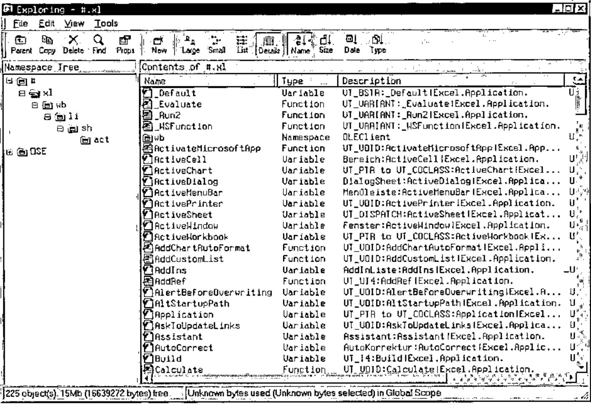
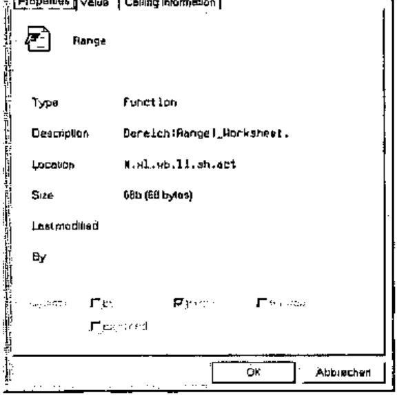
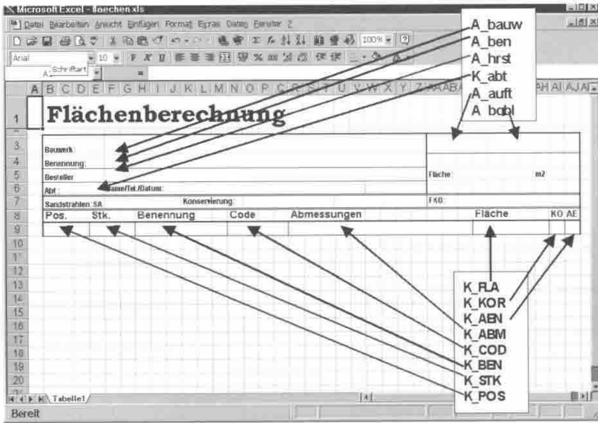
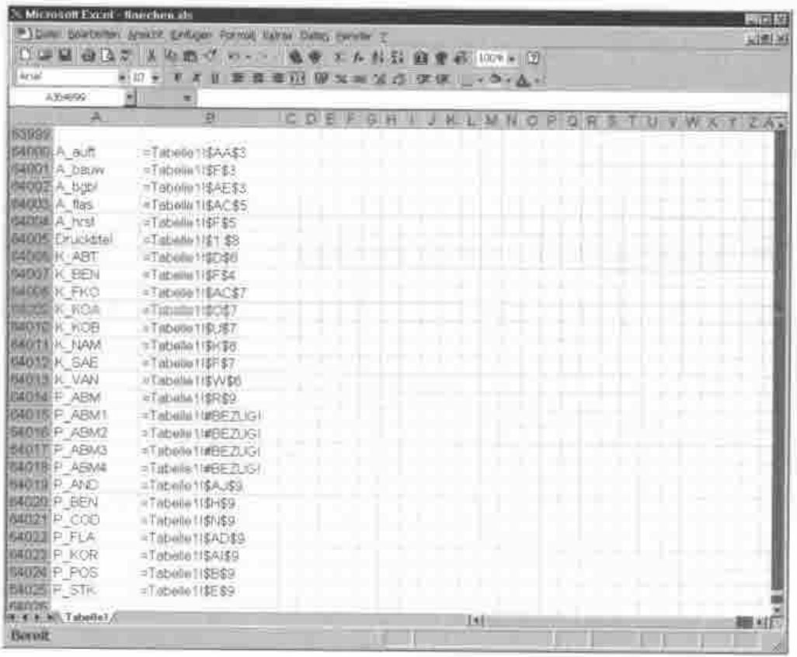
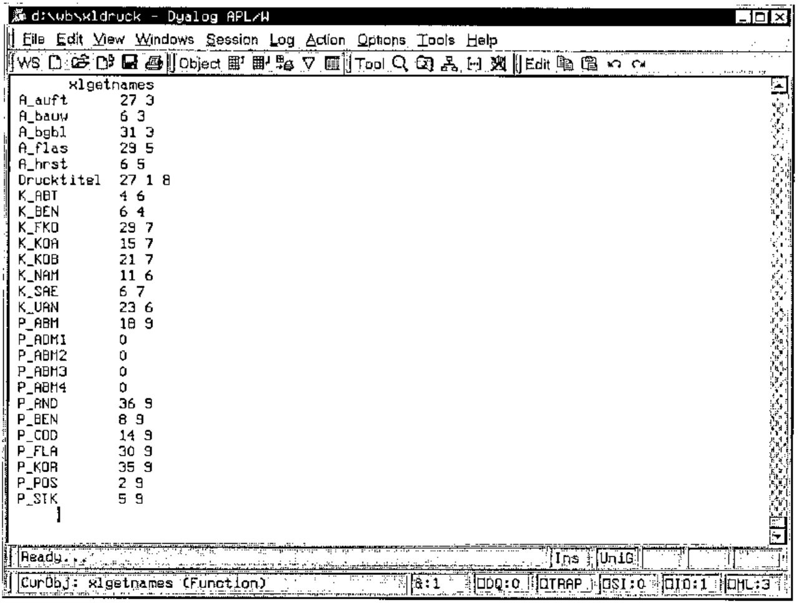

*by Conrad Hoesle-Kienzlen*
{ .byline }

## Introduction

One of the specifications of a rather large APL project was to print complicated forms via Excel. That was the reason for me to investigate in depth the possibilities of the OLE interface built into Dyalog APL. Of the three major APL dialects i.e. APL2, APL 2000 and Dyalog APL, the latter offers the best support, which makes it comparatively easy to get this difficult interface to do what one wants.

This paper describes how to use Excel as an OLE client with APL as the server. The paper was written at a time when Dyalog APL Version 8.3 was on the market, later versions may differ from the screenshots included here, I have no doubt that the current Version 10 is again improved and even easier to use.

## OLE-Support by Dyalog APL

How does the OLE support of Dyalog APL look and feel? First of all, it is very easy to activate Excel (or other OLE applications) from within APL as a client. The code line:

```apl
'xl' ⎕WC 'OLEClient' 'Excel.Application'
```

is all that is needed. It creates a new namespace with the name "xl" (the name can be chosen at will). As with all namespaces, one can browse the content with the explorer. The following screenshot shows such a namespace. It contains other namespaces which will be explained later on.



As one can see, one gets practically the same information about this "strange" namespace, as one gets about an APL namespace. This alone would be quite helpful but there is even more. If one clicks on one of the names with the right mousebutton, one can inspect the properties of that object …



The first page of the properties does not reveal anything new, but the pages "Value" and "Calling Information" are very helpful. If the object is a variable, the "Value" page displays – not surprising – the content of the variable. If the object is a function, the value page is not so interesting but the page "Calling Information" is …

![The Calling Information page for Range: result of type Bereich; parameters Cell and [Cell2] of type VT_VARIANT; a Show Function Help button](art10003670/calling.jpg)

This page tells us, that the function "range" returns a result of type "range" (the German version I use displays "Bereich" for range) and that it uses one, optionally two parameters of type VT_VARIANT and the names "Cell" and "Cell2". This is very concise, but enough information for the insider.

For those who want to get extensive information, there is the button "Show Function Help". If one clicks it, one is transported to the place in the online help for Microsoft Visual Basic for Applications where the function is described in detail (most of the times, that is). That this is invaluable becomes clear after a very short time of working with OLE, VBA and Excel, because the programmers of Microsoft seem to be totally ignorant of conventions and rules.

One of the earliest experiences one makes is, that one should not trust the information about the type of an object (variable or function). Quite often one finds out that an object of type "variable" does not behave like one, that is, cannot be queried or set by assignment but has to be handled like a function. Whether a variable really is a variable is seen easiest by looking at the "value" page. If it is a true variable, one can see the content there. If it is a "function in disguise", the value page displays the name of the object.

A special kind of object are the ones which return a result of type VT_RANGE, VT_PTR (a pointer) or VT_DISPATCH. Those results are not values which one can use directly, but new namespaces, a fact that can be very frustrating. In this case one has to place the new object namespace somwhere in the namespace hierarchy. Sometimes one has the choice where to place it, sometimes it will only work if it is a sub namespace of the parent object. This done, one has to explore the new namespace for a function or variable which gives the desired result one expected because of the name of the object. Sometimes one does not find the desired result at all because there just is no fitting object.

## Working with a Spreadsheet

```apl
'xl' ⎕WC 'OLEClient' 'Excel.Application'
```

starts Excel as an OLE-Client. If one executes this line, a new namespace with the name "XL" is created but nothing more happens. The reason is, that Excel wants to be told which spreadsheet of the folder has to be opened. So the question is, how to open a spreadsheet and connect to it. The following function listing shows the necessary steps:

```apl
[ 0] {sheet}xlopen tab;s
[ 1] ⍝p Open an Excel-Folder as OLE-Client
[ 2] ⍝o CHK 17.01.1999
[ 3] ⍝d sheet: The name of the spreadsheet in the folder
[ 4] ⍝d tab  : The name of the Excel file on the harddisk (including path)
[ 5]
[ 6] →(2=⎕NC'sheet')/⎕LC+1 ⋄ sheet←1       ⍝ use 1st spreadsheet if missing
[ 7] 'xl'⎕WC'OLEClient' 'Excel.Application' ⍝ Create OLEClient Namespace
[ 8] xl.Visible←1                          ⍝ Visible=1 for testing
[ 9] 'xl.wb'⎕WC xl.Workbooks               ⍝ create empty workbook
[10] 'li'xl.wb.Open tab                    ⍝ open folder in workbook
[11] 'xl.wb.li.sh'⎕WC xl.wb.li.Sheets      ⍝ create spreadsheet namespace
[12] 'act'xl.wb.li.sh.Item sheet           ⍝ make spreadsheet active
[13] xl.wb.li.sh.act.Select 1              ⍝ select spreadsheet
```

As one can see, there is quite a lot to do. We already know line [7]. Line [8] is interesting for two reasons. For once one can control the visibility of the whole process. If set to one, Excel will not only be loaded but also displayed on the screen and one can follow the whole process as in a cinema. If visible is set to 0 one can see nothing and everything runs a little bit faster. One shouldn’t expect wonders of speed in any case though.

Secondly line [8] shows a "real" variable and the handling of such an object: it is a variable just like any old APL variable, it can be set by an assignment or queried by its name. If one looks for interesting difficulties, one can even erase it.

In case one has set Visible to 1, an empty Excel is displayed. To see the desired spreadsheet one has to run through steps [9] to [13]. Only then can the spreadsheet be seen and worked upon (even by typing, if one wants!).

Lines [9] and [10] show another interesting aspect of VBA programming: The object "Workbooks" is a "fake" variable. There is no "Calling Information" page in the properties dialog and the "Value" page only shows the name of the object. That one has to use `⎕WC` with it can only be found out by trial and error or – much later – by experience.

"Open" in line [10] on the other hand is a function with a result type "VT_PTR to VT_COCLASS", it has to be called with the filename of the Excel workbook as if it were a normal APL function. That it needs a left argument, namely the name of the new namespace it creates can only be guessed somehow, it is not documented anywhere. The new namespace has to be created as a child of the parent namespace, it will not work anywhere else.

"Sheets" in line [11] is a variable like "Workbooks". One could place the namespace "sh" somewhere else and not under "xl.wb.li" and save a lot of typing later but it is at the logically correct place in the object hierarchy here, so let’s be orthodox.

The function "Item" in line [12] again places its namespace at the end of the object hierarchy. Contrary to "Open" it returns a result of type "VT_DISPATCH", but this does not make any visible difference, both are APL namespaces. For an argument it takes a parameter "index" of type "VT_VARIANT". This can either be the name of the desired spreadsheet, or the numeric index. Dyalog APL provides the necessary type conversion.

After `xlopen` has completed, one can admire an open Excel spreadsheet on the screen.

## The Excel-Spreadsheet

If one wants to, one can now work with the open spreadsheet without further preparations. One can read values from it into the APL workspace or write values into cells in the sheet. But this means that one knows exactly where to read or to write because one has to address the cells like in an APL matrix by row and column (in Excel one has to specify those by a letter-number combination like "C8"). But if somebody has inserted or deleted a row or a column, this will lead to difficulties. It is much safer and more flexible, if one uses named cells or areas and works with those names.

Let us look at the sample spreadsheet more closely. It is a template for a list with a fixed header area which will be repeated on every top of a page, and an arbitrary number of lines of data below.

Finding the place, where that header area has to be defined in Excel has cost me more than an hour. I wonder whether Microsoft has a special department which finds new and unlikely places for important options for each new version of their products. My guess is, that they deem this to be educational. Users should be educated to become more flexible. Anyhow, in my German version of Excel 97 this header area always has the unalterable name "Druckbereich". You will have to find out what the name is in your localized version.

In addition to "Druckbereich" one should allocate a name to every cell or range of cells that one wants to access from APL. BEWARE: this name has to be unique, not only within the spreadsheet but within the whole folder! It is hard to understand why the names do not have their own namespace in each spreadsheet since each spreadsheet has ist own name itself, but it can’t be helped.

If one wants to access a rectangular range of cells it is normally sufficient to name the cell in the upper left hand corner since the number of rows and columns is defined by the size of the APL matrix. In case the size is not known beforehand one can name the lower right-hand cell as well.

The following screenshot shows our template with the names pasted in:



The names can be freely chosen and Excel does not distinguish between upper- and lowercase. But the case is preserved and since APL does distinguish between the two cases one should take this into account.

## Reading from a Spreadsheet

The first question now is: If I want to read something from that spreadsheet, how do I know the names used there? One could, of course, hope for the best and use hard-coded names in the APL program. This is the simple but inelegant and error-prone method. An infinitely more elegant solution is, to read the names in from the spreadsheet. So we use the explorer and shout hooray, because we find an object called "ListNames". Right after using the method with the promising name, we groan. Microsoft programmers have a queer sense of humour, because "ListNames" writes the list of names into the spreadsheet itself! But we are APL programmers and we always find a solution, as can be seen in the listing below:

```apl
[0]  r←xlgetnames
[1]  ⍝p Read in all defined names from an Excel spreadsheet
[2]  ⍝o CHK 17.01.1999
[3]  ⍝d The spreadsheet has to be opened with xlopen beforehand
[4]  ⍝d "ListNames" writes the namelist into the sheet and not to APL!
[5]  ⍝d therefore we have to read them in from the sheet.
[6]
[7]  'now'xl.wb.li.sh.act.Range'A64000' 'B64999' ⍝ define range for list
[8]  xl.wb.li.sh.act.now.ListNames                ⍝ write list there
[9]  r←,xl.wb.li.sh.act.now.Value                 ⍝ read from there into APL
[10] xl.wb.li.sh.act.now.Delete ⍬                 ⍝ delete range
[11] r←((⌈0.5×⍴r),2)⍴r                            ⍝ create two-column Matrix
[12] r←(0≠∊⍴¨r[;1])⌿r                             ⍝ delete empty rows
[13] r[;2]←(r[;2]⍳¨'$')↓¨r[;2]                    ⍝ delete spreadsheet name
[14] r[;2]←r[;2]~¨'$'                             ⍝ delete Dollar signs
[15] r[;2]←xlnumadr¨r[;2]                         ⍝ numeric column/row index.
```

The following screenshot shows the result of "ListNames". To get this list, one has to define a range where the function can write its result, as line [7] shows. To be out of the way of other contents, we chose a range right at the bottom of the sheet. Line [8] calls the function and line [9] reads the result from there into APL. Here is, how the result looks:



As one can see, reading data from a spreadsheet is a very simple thing: One creates a namespace with the desired range (line [8]) and uses its Value-method like an APL variable (line [9]) – that is all! The result occupies two columns. The first column contains the names themselves and the second column is the address of the respective cell. The function "Value" returns a two-element enclosed character string with the content of the two columns. This enclosed string has exactly the content one can see in the spreadsheet. Therefore we have to convert this information into a form which is easier to process in APL. Lines [11] to [15] do this cleanup. The subroutine `xlnumadr` converts Excel addresses like AD9 into numeric indices (30 9).

Since there is no way to query beforehand the number of names, one has to define a rather large area and delete the unused rows later. There are also lines with names where the address is invalid, here marked with #BEZUG! Furthermore we see a different kind of address in the line "Drucktitel", it is not the address of a single cell but the address of a range of cells, namely $1:$8. Those unusable definitions are converted by `xlnumadr` into 0 since we do not need them anyway.

Line [10] deletes our auxiliary range so that the spreadsheet is "clean" again. If one looks at the description of the function "Delete" in the online help, one sees that this function returns a result of type VT_VOID, meaning that there is no result. Delete can be called witout or with one parameter. APL does not provide a means for calling a function without or with a right parameter, so Dyalog APL uses a "Zilde" (`⍬`) as a way of defining "this function is called with no parameter". If the parameter is given, it defines the way in which the neighboring cells are treated.

The following screenshot shows the result after conversion in APL in column-row order:



## Writing to a Spreadsheet

The last section descibed how to read data from a spreadsheet into APL. It is a relatively simple process. One defines a range of cells as a new namespace and uses its Value-method like an APL variable. Writing is the exact opposite:

```apl
[0]  data xlwrite range
[1]  ⍝p Write data from APL into an Excel spreadsheet
[2]  ⍝o CHK 17.01.1999
[3]  ⍝d data : Character vector or matrix with the data
[4]  ⍝d range: Either the name of a cell or range of cells
[5]  ⍝d        or a two element range definition like 'A3' 'C7'
[6]  ⍝d If "range" covers a range of several cells, "data"
[7]  ⍝d has to be a matrix with so many lines and columns
[8]  ⍝d as "range" defines, even with ranges of one line!
[9]
[10] 'now'xl.wb.li.sh.act.Range range    ⍝ create range namespace
[11] xl.wb.li.sh.act.now.Value←data      ⍝ write data into range
```

As stated above, writing is the exact opposite of reading and equally simple. One defines the desired range of cells as a new namespace and assigns the data to the Value-method. The format of the data is described in the comments of the above function listing. It has to be an enclosed character matrix with exactly as many lines and columns as the defined range. Only if the range is a single cell the data may be a character string. If the data for one cell is wider than the cell size, it is displayed exactly as if it was keyed in manually: If the neighboring cell is empty, the data fills the adjacent space. If there is data in the adjacent cell, the content is cut off in the display.

## Copying a Range of Cells

In our template sheet we had defined line 9 as the data area. Since we do not know beforehand, how many lines of data will have to be filled in, we have to multiply those data lines "on the fly". For this we use the function `xlcopy`. The left argument defines the source range from where to copy, the right argument is the target range. In principle one needs only the address of the starting cell of the target area since the range is already known by the size of the source range. If, however, the source range should be copied several times at once (as we want to do here), one has to give the full range into which the source has to be copied. Care has to be taken in defining an exact multiple of the source range, otherwise the operation will result in an error message which is displayed in a great big window on the screen and the process is aborted. The format of the source cells (frames, colors, patterns etc.) is copied as well, the names of cells in the source area are not copied.

```apl
[0]  from xlcopy to
[1]  ⍝p Copy a range of cells to a new target area
[2]  ⍝o CHK 17.01.1999
[3]  ⍝d The spreadsheet has to be opened beforehand with xlopen
[4]  ⍝d from: Source range, e.g. 'C1' 'D9'
[5]  ⍝d to  : Target range, e.g. 'E1'  (address of starting cell)
[6]  ⍝d BEWARE: the target area is inserted, not overwritten!

[7]
[8]  'now'xl.wb.li.sh.act.Range from  ⍝ create source range namespace
[9]  xl.wb.li.sh.act.now.Copy ⍬       ⍝ copy to clipboard
[10]
[11] 'now'xl.wb.li.sh.act.Range to    ⍝ create target namespace
[12] xl.wb.li.sh.act.now.Insert 1     ⍝ insert contzent of clipboard
[13]
[14] 'now'xl.wb.li.sh.act.Range'A1'   ⍝ namespace of first cell
[15] xl.wb.li.sh.act.now.Copy ⍬       ⍝ empty clipboard
```

Interesting here are lines [14] and [15]. A small range (only the first cell) is defined and copied to the clipboard. If one does not do this, Excel (or rather Windows) opens a dialog box and inquires what the user wants to do with the large amount of data in the clipboard. Since we do not want to answer silly questions, we prevent this nuisance with that simple trick.

## Printing the Spreadsheet

We have finally arrived at a spreadsheet, beautifully formatted and filled with highly interesting Data. The logical step that follows is, to print this out for the higher management, because, as we all know, higher management does not know how to handle computers, they prefer paper. The following simple little function automatically prints our wonderful sheet on the standard printer defined in Windows. Unfortunately one cannot specify the number of printouts here, since this is a parameter of the printer driver. But one can, of course, call this function as often as needed. he name of the standard printer can be queried from the variable "xl.ActivePrinter".

```apl
[0] xlprint;i
[1] ⍝p Print the active Excel worksheet
[2] ⍝o CHK 17.01.1999
[3]
[4] i←xl.wb.li.sh.act.Index       ⍝ Index of the active sheet
[5] xl.wb.li.sh.act.PrintOut i    ⍝ print this out
```

One could as well call up the printer dialog, but we want to use this function as a subroutine within a bigger context, therefore we just use PrintOut as often as necessary. Calling the printer Dialog via OLE unfortunately is not possible.

## Closing Excel

After one has filled in and printed out the spreadsheet, one should free the used resources and close Excel. The following function shows what is needed for this action.

As one can see it is not sufficient to delete the namespace "xl". Excel wants to be closed in a civilised way. Line [5] makes Excel believe that the spreadsheet, which had been changed, has been saved. Otherwise Excel would ask, if the changed spreadsheet should be saved before it is closing down. Finally we can tell Excel in line [6] that it is no longer needed and it will shut itself down without a murmur. Then, and only then should we delete the namespace.

```apl
[0] xlclose
[1] ⍝p Close an Excel spreadsheet and delete its namespace
[2] ⍝o CHK 17.01.1999
[3]
[4] :Trap 0
[5]   xl.wb.li.Saved←1       ⍝ prevent "Save" dialog
[6]   xl.Quit                ⍝ shut down Excel
[7] :EndTrap
[8]  ⎕EX'xl'                 ⍝ delete namespace
```

## The Workspace XLCLIENT

This workspace, which can be downloaded from my website (see address at the end of this paper) contains all the functions listed in this paper and some more. The main function `PrintDemo` calls all functions needed to fill in and print out the above shown spreadsheet. Most of the work is done by the function `xlfillsheet`; the listing is not printed out here because of the space needed. But there are loads of comments in that function which explain exactly what is going on in each line. The function reads in the names from the spreadsheet as shown here, looks for variables in the workspace with the same names and writes their content into the sheet.

## Special Functions

In principle, one can reach all functions which Excel offers in menues via OLE. As examples I have listed three of them here for good measure. The first fills the background of a range of cells with a pattern, the second chhanges the frame around a cell and the third defines new colors for the background and content of a cell. It is interesting to see what roundabout ways one has to go for apparently very simple effects.

To fill the background of a range of cells with a pattern, one has to create an "Interior" object first:

```apl
patt xlpattern range
⍝p Fill the background of a range of cells with a pattern
⍝o CHK 17.01.1999
⍝d range: Either the name of a cell or range of cells, or
⍝d        an explicit range definition like 'A3' 'C7'
⍝d patt : A number that defines the style of the pattern

'now'xl.wb.li.sh.act.Range range        ⍝ create range namespace
'xl.int'⎕WC xl.wb.li.sh.act.now.Interior ⍝ create interior object
xl.int.Pattern←0⌈18⌊patt                ⍝ define pattern 0..18
xl.int.PatternColor←1                   ⍝ set color to black
⎕EX'xl.int'
```

Patterns are defined numerically and may have values from 0 to 18. Just try out, what the different numbers mean!

The frame of a cell is not, as one could assume, a property of that cell, but a separate object. The width of the frame influences the type of the frame, dashed frames are only possible with width 0:

```apl
style xloutline range
⍝p Define the frame around a range of cells
⍝o CHK 17.01.1999
⍝d range: Either the name of a cell or range of cells, or
⍝d        an explicit range definition like 'A3' 'C7'
⍝d style: A number that defines the style of the frame

'now'xl.wb.li.sh.act.Range range  ⍝ create range namespace
'xl.bdr'⎕WC xl.wb.li.sh.act.now.Borders  ⍝ create border object
xl.bdr.Weight←1⌈style             ⍝ set the frame style
:If style=0                       ⍝ if style = 0
  xl.bdr.LineStyle←0              ⍝ set style of line to "thin"
:EndIf
⎕EX'xl.bdr'
```

Changing the colour of a cell is very complicated, it is not enough to create a text object of the cell, one also has to create the font object of the text object:

```apl
col xlcolor range
⍝p Change text- and background color of a cell
⍝o CHK 17.01.1999
⍝d range: range of cells, e.g. 'B3' 'C8'
⍝d col  : 2-elem. vector with number of color for text & background

'now'xl.wb.li.sh.act.Range range           ⍝ create range namespace
'char'xl.wb.li.sh.act.now.Characters ⍬     ⍝ create text object
'xl.fnt'⎕WC xl.wb.li.sh.act.now.char.Font  ⍝ and its font object
xl.fnt.ColorIndex←↑col                     ⍝ color of font
'xl.int'⎕WC xl.wb.li.sh.act.now.Interior   ⍝ interior-object
xl.int.ColorIndex←2⊃2↑col                  ⍝ color of background
```

## Finally

Well I hope you liked this excursion into the OLE jungle and perhaps one or the other of the participants have seen just enough on this trip to come back and investigate it further. If so, I hope to be informed of the results.

Those who want to experiment further can download the Dyalog APL Workspace (**Version 8.2!**) together with the Excel spreadsheet from my website:

http://www.hoesle-kienzlen.de/projects.htm
