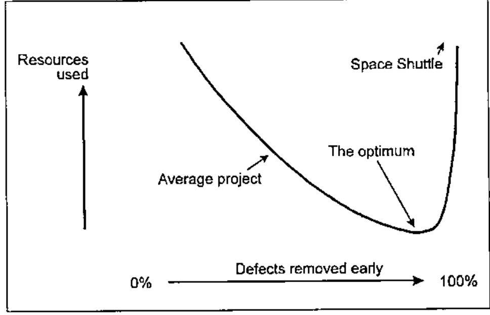

*by Kari Höijärvi*
{ .byline }

I worked for Microsoft Outlook and Exchange groups 1995-1998 and during those three years I learned more about teamwork than I had ever done before, and it sparked my interest in SW Project Management. Most of the knowledge in this article is at least 25 years old, but still not widely understood. While I’m not doing any creative work here, I hope that I can at least teach what others have found out.

## No Industrial Spying, Sorry

Microsoft’s internal development methods have been very well documented by Steve McConnell[1], Steve Maguire and others[2]. R. Shelby and M. Cusumano[3] wrote a detailed book about it. I was personally surprised how open the text was: just as I experienced myself.

## Cost of Quality

Projects that have a tight deadline are completed late, over budget and bad quality. That was a well known fact. But IBM made a strange observation thirty years ago: projects that must have high quality are completed earlier and they cost less. That same was then stated in the classic book "Quality is Free"[4]; the title is incorrect, but sounds more sexy than the precise "Quality requires initial investment but gives a quick bang for your buck."

The diagram shows the relationship between quality and software cost. Producing space shuttle onboard software has cost 25 hours of work per line. A major amount of shuttle SW development time is spent in inspections and testing. Less critical software can be produced with much less work, simply dealing with the errors later, in the production, which is not an option for the Shuttle group.

When you move left in the diagram, at some point reducing quality becomes counter-productive since it’s more expensive to fix damage later. Sadly, most of the software in the world is produced on the wrong side of the optimum: high cost and shoddy quality combined.

### Word for Windows 1.0

In principle I don’t like to show negative examples, since they teach you nothing you really need to know. But this project is a very good collection of bad project management practices.

Word for Windows in a nutshell: [5]

- Exceeded the schedule 400%
- Four development leads in five years
- Impossible goal
- Last twelve months was "stabilization", bug fixing and testing.
- After all, a great success
- 250,000 Lines of code

The original deadline was a year, or at worst thirteen months. Steve McConnell at his website has a free statistical estimation tool, which gives the optimal schedule 580 days and the absolute minimum schedule 460 days. The shortest schedule would cost a lot more, since you have to hire a lot of the very best developers, which then would produce less code per developer.

After a year or two, reality hit a little bit. The estimation error went from 400% to the classical π where it stayed for a long time. The last year the product was regularly shipping in three months, until after four years nine months the "90 days to ship" estimate held.

### Other bad examples

Mac Excel 1.03 was killed due to a runaway bug list.

I have similar experiences from my projects outside MS. Once I was hired to work in a project, that was almost ready but had some bugs. I tested it for a day and found 50. My boss tested it for a day and found 35. The really worrying thing was, that none of the bugs were the same! Statistically I could estimate at least 2500 bugs, since then the chances that you pick all different bugs are 50%. Obviously, fixing thousands of bugs is not an option and the project was started from scratch.

### Four dimensions of software development

- schedule
- resources
- features
- quality

You can set three and predict the last. The major problem with WinWord 1.0 was fixing all the four. You cannot do that. If you want to have **good quality** and M **features** with N **engineers**, then the **schedule** is like **weather**: you can **forecast** it, but you cannot set it. Similarly, if you have a deadline that is fixed, one of the other three must yield.

## Changes to the Process, Birth of MSF

First, a small team with top-notch developers start the project. They create the core architecture and the core code. Testers come into picture right away and once this core part of the product works, more developers can be added to the team.

Features are added to the project. A little at a time, all the time focusing on quality. It’s easier to estimate the schedule if 57 out of 83 features are ready and there are twenty known defects, compared to having all 83 features "done" with 1832 items in the bug list. And you can always ship a product without all the functionality. It’s much more embarrassing to ship a buggy product.

All the projects can be done incrementally. The waterfall method, requirements, design, code, test, integration test, production, all sequential, is rarely the best.

One of the things I like is that people at MS focus in their core competence and are not subject to Peter’s priciple, reaching their level of incompetence. The best developer is not "promoted" to middle management. Testers get better in testing and get promoted in that field. The unfortunate myth is that testing is a low-level job that you have to do until you get a programming job.

### MSF, Microsoft Solutions Framework

The result is now documented at http://www.microsoft.com/msf. Since their documentation is extensive I’m not going to repeat it here. There are six equal teams: program management, product management, development, testing, user education and logistics. It’s to be noticed, that "management" here refers managing code, not people. Program management communicates between the end user and developer, making sure that the product is useful. Product management communicates with the payer, making sure that the product sells.

### Sample Development Process

Here is a simplified MSF project. The core functionality is designed up front. The schedule is split into three major milestones. First the core team puts two first features (**One, Two**) in and gets the product into "dogfood stage". For a dogfood manufacturer the cheapest way to test it is to feed it to the workers and MS do just the same: I have used MS Outlook as my main mail client since ’95, two years before it came to market. It helps to keep developers honest to themselves.

After dogfood, a few features come in (**Three**) and the bug count goes up. Now, instead of fixing them later, they must be fixed now. Once the count is below a pre-agreed limit, Milestone 1 (**M1**) can be declared done. When new features are added the bug count jumps too high. This is unacceptable, everybody’s job is to bring it down. Stop what you are doing, get quality back. Fixing it later would cost more. Milestone 2 is reached as soon as the features are in and the bug count again under the pre-agreed limit.

After **M2** a disaster strikes. Bug count goes incredibly high and one feature is identified as the source. The options are either fix it all or throw it away. In this case, the feature is thrown away and bug count is low again. Milestone 3 is reached. After this, get ready for Beta. There are two reasons for Beta. First, it’s impossible to test all the possible hardware combinations for PC. For Macintosh, maybe, but PC, no. Second, you need to get real users’ feedback. Real feedback beats laboratory tests. The quality of the product must be high to benefit from Beta release, otherwise it’s just test user abuse.

### Mini Milestone Process

There’s no place for 90% done features. Features are either 0% done or 100% done. If you have over a hundred small tasks in your project, this granularity is just fine. Here’s a way I currently do these mini milestones:

1. Get a bug fix or new feature to work on.
2. Review it with appropriate people: do we need to fix this, can we cut the feature, what is the simplest way that we can get away with this and keep the product quality good. If you need to write code, continue.
3. Implementation related activities, code reviews included.
4. Find a person to test your changes. Work, until he replies OK. If the feature takes many fixes before getting accepted, it’s a sign of questionable quality and a good point for a formal review.
5. Get the latest version from the version control, merge your changes, run automated tests, have a code review. If the product is just going out of the door, get acceptance from the project management to include your work. Last minute fixes are always dangerous.
6. Send a check-in mail for the group.
7. Build lab, full automated tests, in-house testing.

This seems like a lot of bureaucracy, but after all this I seldom have to work with the same problem again. I’d rather have more process than less, for example mandatory pair programming[6].

### Build Lab and Daily Build

The product is built every day. Every day, all the automated test scripts are run to catch possible quality regression. Every day, you’re supposed to install your daily dogfood from the build lab.

Some people protest against this and say that once a week is enough. But the longer the interval you have between the builds, the further away good quality can go. If your daily build breaks, it’s usually a matter of hours to get it fixed. If the daily build breaks twice in a row, warning signals go red. And three days with broken build is a sign to stop what you’re doing and fix what you have done.

If a build is done weekly, fixing a broken build gets more and more difficult. I have heard of projects that went months without a working test version. Weekly build can take you to bug hell, daily build can take you back.

If you cannot do a full build with one command, write a script that does it.

### Automated Testing

You need some test automation. You don’t need 100%. [7] Read "Test Automation Snake Oil," it’s excellent.

### Two Main Things to Remember

- Quality. You have to set a measurable level and make sure it stays there. Teams that focus on quality will automatically focus on a lot of important things. If you have low-quality features, fix them or cut them.
- Incremental Process. Do your product with small steps and lots of feedback. measure steps in hours rather than days.

## Recommended Reading...

This is about 1% of my link list, choosing is hard.

> *Spiral and Waterfall* http://www.sei.cmu.edu/cbs/spiral2000/Boehm/
>
> *Cleanroom Software Engineering*: Michael Deck has written excellent papers at http://www.cleansoft.com/cleansoft_library.html and I definitely recommend these for anyone who is working with mission critical systems.
>
> *eXtreme Programming*: How to replace heavy process with discipline. Numerous links, start with http://www.xprogramming.com/
>
> *CrossTalk*: http://www.stsc.hill.af.mil/crosstalk/ . Before you have read your monthly free Crosstalk, don’t waste money on any other magazine.
>
> *Software Project Managers Network* http://www.spmn.com/ has more good stuff than your local bookstore, just a mouse-click away.
>
> *Free, short and 100% on-topic books*: http://www.spmn.com/products_guidebooks.html

## ...and References

1. Steve McConnell has written the best books published by Microsoft Press. I’d recommend "Software Project Survival Guide" ISBN: 1572316217 as a must read, I still skim it through regularly. "Rapid Development" has a lot more useful information, but is harder to read and understand.
2. Steve Maguire wrote "Writing Solid Code" Microsoft Press; ISBN: 1556155514 which describes ways to make your programs less prone to errors, examples are in C but the principles apply to any language. His "Debugging the Development Process" is similar to Jim McCarthy’s "Dynamics of Software Development" ISBN: 1556158238, both telling how MS has done things with bad process and how they were improved.
3. R. Shelby and M. Cusumano: "Microsoft Secrets: How the World’s Most Powerful Software Company Creates Technology, Shapes Markets, and Manages People" Simon & Schuster; ISBN: 0684855313
4. Philip B. Crosby: "Quality is Free" Mentor Books; ISBN: 0451625854
5. Steve McConnell, Rapid development. [1]
6. Pair programming: numerous studies and links, start from http://www.pairprogramming.com/
7. http://www.satisfice.com/articles/test_automation_snake_oil.pdf
