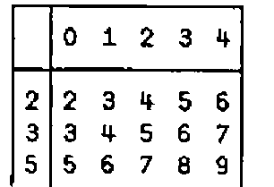
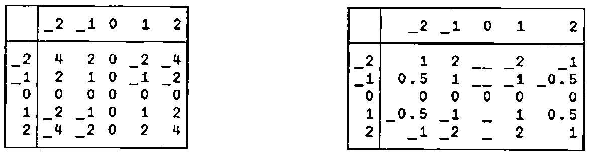
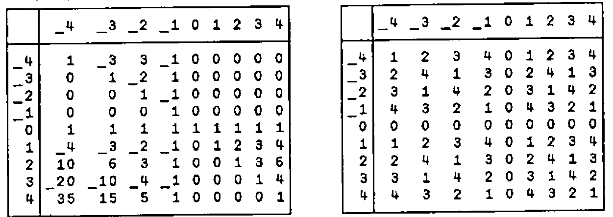
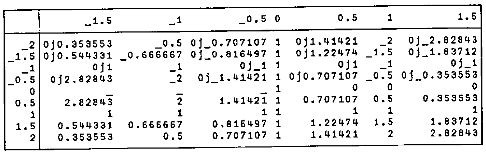
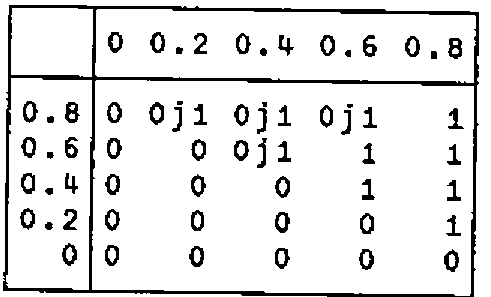
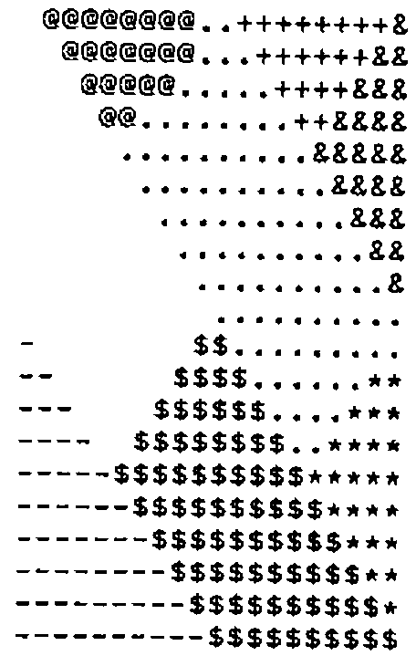
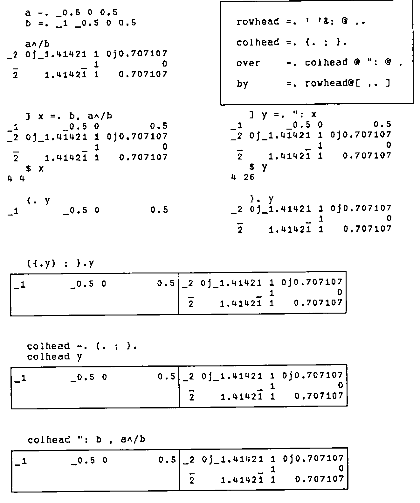

*by Roger K.W. Hui*
{ .byline }

The verb tables produced by `f/` in J (see Reference [1]; `f/` is `∘.f` in APL) are generalizations of the familiar addition and multiplication tables of arithmetic. The utility verbs `over` and `by` (defined and analyzed in the Appendix) are used to annotate verb tables. For example:

```text
   a by b over (a=.2 3 5)+/b=.i.5
```



Verb tables facilitate systematic experimentation, and can reveal new patterns and new meanings even for familiar and seemingly quotidian verbs.

*Cross* (`~`) is an adverb such that `f~y` is `y f y` and `x f~ y` is `y f x`, and is useful in generating verb tables of a list against itself. Thus:

```text
   y by y over y */ y=.2-~i.5        y by y over %/~ y
```



```text
   2 1 0 </2 1 3 0 1 2         *./~0 1        +./~0 1
0 0 1 0 0 0                  0 0            0 1
1 0 1 0 0 1                  0 1            1 1
1 1 1 0 1 1
```

Note the pattern of signs in both the *times* (`*`) and *divide* (`%`) tables, the result of `0%0`, and the infinite possibilities of dividing by 0 [3,4]. The signs of a real table `t` can be displayed using the expression `' +-'{~*t`, using the *signum* (`*`) of `t` to select *from* (`{`) `' +-'`. Tables of boolean verbs (*truth tables*) such as *less than* (`<`), *and* (`*.`), and *or* (`+.`) offer useful classifications.

*Out of* (`!`) produces binomial coefficients; `!/` produces Pascal’s triangle. `5&|@*` is multiplication modulo 5:

```text
   y by y over !/~y=.4-~i.9          y by y over 5&|@*/~y
```



```text
a =. -: 4-~i.9
b =. -: 3-~i.7

   a by b over a ^/ b
```



The *power* (`^`) table contains many subtle patterns. For example, examine the column headed by `0`, and the rows headed by `_1` and `0`. The reader may wish to attempt the same table on other systems; the results may prove interesting.

The verb `j.` produces a complex number from its real and imaginary parts; thus `3 j. 4` is `3j4`. The expression `(|.y) <.@j.~/ y=.5%~i.5` produces a table of the verb `<.@j.~` on the *reverse* (`|.`) of `y` against `y` itself; i.e., *floor* (`<.`) on the lower left corner of the first quadrant of the complex plane. The pattern is made more evident by mapping the result to single glyphs, using the symbols `s=.' @.+&-$*=%'`.

```text
   (|.y) by y over (|.y) <.@j.~/ y =. 5%~i.5
```



```text
   s =. ' @.+&-$*=%'
   map =. {&s @ (~.@, i. ])
   map (|.y) <.@j.~/ y=.10%~i.20
```



Thus, the floor of the complex plane is tiled by "sloping bricks" — unit-area rectangles inclined at minus 45°, whose long sides are the diagonal of the unit square [2]. `map` is a composition of two verbs, `{&s` (*from* bonded with `s`) *atop* the *fork* `~.@, i. ]`; it works by computing the indices of the floor values in the *nubbed ravel* (`~.@,`) of such values, which are then used to select from `s`. *Fork* and *atop* are defined by the following diagrams:

```text
 (f g h) y      x (f g h) y        f@g y       x f@g y
     g               g               f            f
    / \             / \              |            |
   f   h           f   h             g            g
   |   |          / \ / \            |           / \
   y   y          x y x y            y          x   y
```

## Appendix: over and by

```text
rowhead =. ' '&; @ ,.
colhead =. {. ; }.
over    =. colhead @ ": @ ,
by      =. rowhead@[ ,. ]
```



![Continuing: over applied to b and a^/b, 2 1 $ b over a^/b, ,.a and its shape 3 1, ' ' ; ,.a, rowhead a and 2 1 $ rowhead a, (rowhead a) ,. c=.b over a^/b, the table 1 2 3 ,. 9 10 11 and its shape 3 2, (rowhead a[c) ,. a]c, and 1 2['abc' and 1 2]'abc'](art10003770/a2.png)

![Finally, by =. rowhead@[ ,. ] applied as a by c, and a by b over a^/b](art10003770/a3.png)

## References

[1] Iverson, K.E., *ISI Dictionary of J*, Version 4, 1991 12.

[2] McDonnell, E.E., *Complex Floor*, APL73 Conference Proceedings.

[3] McDonnell, E.E., *Zero Divided by Zero*, APL76 Conference Proceedings.

[4] McDonnell, E.E., and Shallit, J.O., *Extending APL to Infinity*, APL 80, North-Holland Publishing Company, 1980 6.
