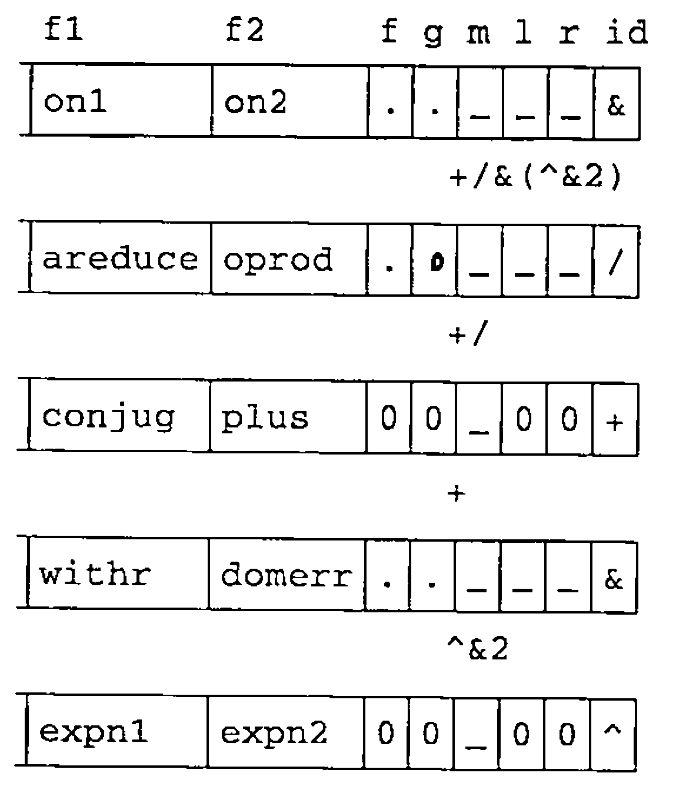

*transcribed by Anthony Camacho*
{ .byline }

It is a pleasure to be in London again and an honour to be invited to speak to this audience. I am going to talk about **An Implementation of** J. Please interrupt me at any time if you have questions.

## What is J?

J is a dialect of APL based on Ken Iverson’s work over the last forty years. It uses the standard ASCII symbols and therefore does not require the special keyboards, special displays, special printers, special editors and so on that previous APLs did.

It has facilities which enable functional programming. It is freely available and runs on many machines including:

> Sun 3<br>
> SPARC<br>
> Silicon Graphics<br>
> Mips<br>
> Next<br>
> RS 6000<br>
> Vax<br>
> PC<br>
> Macintosh<br>
> Archimedes
>
> and others.

It is written in C and is portable. The source code is available. It uses standard facilities. For example it uses STDIN and STDOUT for dialogue. It uses the C library functions `malloc` and `free` for memory management and it provides access to host files or native files.

The following dialogues give a taste of the system. The lines that are indented are those I typed; the lines that begin at the margin the system’s responses.

```text
      a =. 1 2 3 4 5 6
      sum =. +/
      sum a
21
      mean =. sum % #
      mean a
3.5
      report =. i. 2 3 4
      report
 0  1  2  3
 4  5  6  7
 8  9 10 11

12 13 14 15
16 17 18 19
20 21 22 23
```

The first sentence says ‘a’ is a list of six numbers.

‘`sum`’ is a verb or function which computes the sum. The sum of ‘a’ is 21. We call ‘`sum`’ a verb because it applies to a noun to produce another noun. The symbol slash (`/`) is an adverb because it applies to a verb, in this case plus (`+`), to produce another verb. ‘`mean`’ is the sum divided by the number of items. The mean of ‘a’ is 3.5.

Verbs in J apply to elements, lists, tables and reports. For example suppose ‘`report`’ is the revenues for two departments over three countries over four quarters. The mean over the departments is simply ‘`mean report`’.

```text
      mean report
 6  7  8  9
10 11 12 13
14 15 16 17

      mean "1 report
 1.5  5.5  9.5
13.5 17.5 21.5

      mean "2 report
 4  5  6  7
16 17 18 19

      mean "3 report
 6  7  8  9
10 11 12 13
14 15 16 17
```

‘`mean`’ over the four quarters is ‘`mean`’ applied to the list of rank one objects in report and ‘`mean`’ over the three countries is ‘`mean`’ applied to the tables of rank two objects in ‘`report`’. ‘`mean`’ applied to the rank three objects in ‘`report`’ is the same as ‘`mean report`’ because report only has rank three.

The symbol double quote used here is the ‘rank’ conjunction. It is dyadic and applies to a verb left argument and a noun right argument to produce a verb.

```text
      ^ 2 3 4
7.38906 20.0855 54.5982
      1 2 3^2 3 4
1 8 81

      square =. ^&2
      square 1 2 3 4
1 4 9 16

      antilog =. 10&^
      antilog 1 0.699 _1
10 5.00035 0.1

      ss =. +/&(^&2)
      ss"1 report
 14  126  366
734 1230 1854
```

The symbol hat (`^`) denotes a verb and like other verbs it has a monadic and dyadic meaning. The monadic meaning is exponential. The dyadic meaning is exponentiation or power.

Now if you fix one of the arguments of a verb you get a different verb. For example ‘`square`’ is power with a fixed right argument of two. `Antilog` is power with a fixed left argument of ten.

The symbol ampersand denotes a conjunction. If one argument is a noun it does fixing or currying; if both arguments are verbs it does composition. For example sum of squares is sum composed with square.

Like all verbs, these verbs that are derived from conjunctions apply to lists, tables and reports and are in the domain of conjunctions.

## Nouns (arrays)

In the implementation the fundamental structure is the APL array, by which I mean the C structure capital a (`A`), which has the following parts:

> The type<br>
> Reference count<br>
> Number of atoms or elements in the array<br>
> The rank<br>
> The shape or dimensions (the rank gives you the number of elements in the shape)<br>
> The value — the elements of the array in ravelled or ‘row major’ order

```c
typedef long I;
typedef struct {I t,c,n,r,s[1];}* A;
```

| | |
|---|---|
| `t` | type |
| `c` | reference count |
| `n` | number of atoms |
| `r` | rank |
| `s ...` | shape |
| `v ...` | atoms of the ravelled array (row major order) |

All objects, whether numeric, literal or boxed, whether noun, verb, adverb conjunction or punctuation are represented by this structure. For example the string ‘cogito ergo sum’ is represented like this:

`'Cogito, ergo sum.'`

| t | c | n | r | s | v | v | v | v | v |
|---|--:|--:|--:|--:|---|---|---|---|---|
| `CHAR` | 1 | 17 | 1 | 17 | `Cogi` | `to, ` | `ergo` | ` sum` | `.` |

The type is character. There are seventeen elements. The rank is one and the shape seventeen. The value is the seventeen characters in the string held in one byte per element or four bytes per word.

The number 1.61803 is represented as follows:

`1.61803`

| t | c | n | r | v |
|---|--:|--:|--:|--:|
| `FL` | 1 | 1 | 0 | 1.61803 |

The type is floating point. There is one element. The rank is zero so there is no shape and there are two words per element in the value.

Questioner from the audience: *What is the reference count?*

The reference count is the number of times this object is used. I won’t go into that. It has to do with the internal workings of the interpreter and is not very interesting.

The report we saw earlier is represented as follows:

`i. 2 3 4`

| t | c | n | r | s | s | s | v | v | | v | v | v |
|---|--:|--:|--:|--:|--:|--:|--:|--:|---|--:|--:|--:|
| `INT` | 1 | 24 | 3 | 2 | 3 | 4 | 0 | 1 | … | 21 | 22 | 23 |

Type is integer. There are twenty four elements. The rank is three. The shape is 2 3 4 and the value is the integers from 0 to 23 each stored in four bytes.

I said before that not only nouns but also verbs, adverbs and so forth are represented by this structure; so for verbs, adverbs and so on the type would be verb adverb and so on, but the value would interpreted according to the following template or structure denoted by the C structure `V` having these parts:

```c
typedef A(*AF)();
typedef struct {AF f1,f2;A f,g,h;
                       I mr,lr,rr;C id;} V;
```

| | |
|---|---|
| `f1` | monad |
| `f2` | dyad |
| `f` | 1st operator argument |
| `g` | 2nd operator argument |
| `h` | 3rd operator argument |
| `mr` | monadic rank |
| `lr` | left rank |
| `rr` | right rank |
| `id` | identification (byte) |

> If a verb has rank R that means it is defined on arrays of rank R or less and the extension of that verb to arrays of higher rank is the same as for all other verbs.

Questioner from the audience: *What are the first lines on the slide?*

Oh that is really for C hackers; it doesn’t really matter very much. The top line is defining a type called ‘`AF`’ and that’s a function that returns an array result. I put it here because I use ‘`AF`’ in the second line. The second line says that ‘`f1`’ and ‘`f2`’ are of the C type ‘`function`’ returning an array result and ‘`f`’, ‘`g`’ and ‘`h`’ are of the type ‘`APL array`’ and ‘`mr`’, ‘`lr`’ and ‘`rr`’ are the C type ‘`integer`’ and ‘`id`’ is a C type capital c (`C`). I haven’t shown the definitions of I and C but they are just integer and character.

To give you a better idea of what all this means: the verb ‘`sum of squares`’ we saw earlier would be represented as follows.



I haven’t shown the rank, shape, reference count, number of elements and so forth — I chopped it off because the interesting part is what is shown here.

For ‘`sum of squares`’ the root is composition whose symbol is ampersand (`&`) and whose C function is ‘`on1`’. The dyad is the C function ‘`on2`’ and all the ranks are infinite. The operative arguments ‘`f`’ and ‘`g`’ are ‘`sum`’ and ‘`square`’, themselves represented similarly.

‘`sum`’ the symbol is slash (`/`). The monad is the C function ‘`areduce`’. The dyad is the C function ‘`outerproduct`’ and there is only one operative argument, plus (`+`).

For ‘`plus`’ the symbol is plus (`+`). The monad is the C function ‘`conjugate`’. The dyad is the C function ‘`plus`’ and there are no operative arguments because plus is primitive.

Back to ‘`square`’; the symbol is ampersand (`&`). The monad is the C function ‘`withr`’. The dyad is the C function ‘`domainerror`’. The operative arguments are ‘`power`’ and ‘`2`’, themselves represented similarly. ‘`2`’ is a noun whose representation we’ve seen before. ‘`power`’ has the symbol hat (`^`). The monad is the C function ‘`exponential1`’. The dyad is the C function ‘`exponential2`’ and there are no operative arguments because power is primitive.

So I think you can see how this can grow on and on to make more and more complex functions.

## Parsing

This parse table is the cornerstone of the interpreter.

```c
typedef struct {I c[4];AF f;I b,e;} PT;

#define EDGE     (MARK+ASGN+LPAR)
#define NOTCONJ  (NOUN+VERB+ADV)

PT cases[] = {
 EDGE,          VERB,      NOUN,      ANY,       monad, 1,2,
 EDGE+NOTCONJ,  VERB,      VERB,      NOUN,      monad, 2,3,
 EDGE+NOTCONJ,  NOUN,      VERB,      NOUN,      dyad,  1,3,
 EDGE+NOTCONJ,  NOUN+VERB, ADV,       ANY,       adv,   1,2,
 EDGE+NOTCONJ,  NOUN+VERB, CONJ,      NOUN+VERB, conj,  1,3,
 EDGE+NOTCONJ,  VERB,      VERB,      VERB,      forkv, 1,3,
 EDGE,          VERB,      VERB,      ANY,       hookv, 1,2,
 EDGE,          ADV+CONJ,  RHS,       ADV+CONJ,  formo, 1,3,
 EDGE,          ADV+CONJ,  ADV+CONJ,  ANY,       formo, 1,2,
 EDGE,          CONJ,      NOUN+VERB, ANY,       curry, 1,2,
 EDGE,          NOUN+VERB, CONJ,      ANY,       curry, 1,2,
 NAME+NOUN,     ASGN,      RHS,       ANY,       is,    0,2,
 LPAR,          RHS,       RPAR,      ANY,       punc,  0,2,
};
```

A sentence to be parsed is placed on a queue and as parsing proceeds, words are moved from the queue onto a stack. After each move the first four words on top of the stack are compared to these patterns. If they match a pattern then the action in this column is triggered and that action will be applied to the words indicated in the last two columns and the result of the application put on the stack in place of the matching items.

The implementation makes extensive use of macros, defined constants and type definitions. You have already seen some of them; for example the types A and V, the defined constants noun, adverb, conjunction and so forth.

The advantages of such usage is that it greatly augments the expressive power of C, it enforces uniformity and increases readability. For example, by ‘an APL function’ I mean a function that applies to array arguments and returns an array result. These macros encapsulate that convention. The macros ‘`f1`’ and ‘`f2`’ are for primitive APL functions and ‘`df1`’ and ‘`df2`’ for derived or non-primitive functions. The argument ‘`self`’ is an array whose monad or dyad is ‘`f`’.

```c
#define F1(f)    A f(  w)A    w;
#define F2(f)    A f(a,w)A  a,w;

#define DF1(f)   A f(  w,self)A    w,self;
#define DF2(f)   A f(a,w,self)A  a,w,self;
```

Using such definitions and macros the functions and programs in the implementation look like this. The monad itemised is defined in one sentence. Likewise the C implementation is one line. Notice the use of the ‘`f1`’ macro which says that this is a monadic function which applies to one array argument and returns an array result.

> Dictionary:
>
> `,:y` adds a single unit axis to `y`, making the shape `1,$y`.
>
> C:
>
> ```c
> F1(lamin1){R reshape(over(one,
>    shape(w)),w);}
> ```

The dyad ‘`laminate`’ is also specified in one sentence and again its C implementation is one line. The ‘`f2`’ macro indicates that this is a dyadic function which applies to two array arguments and returns an array result.

> Dictionary:
>
> An atomic argument in `x,:y` is first reshaped to the shape of the other (or to a list if the other argument is also atomic); the results are then itemized and catenated, as in `(,:x),(,:y)`.
>
> C:
>
> ```c
> F2(lamin2){RZ(a&&w);
>    R over(AR(a)?lamin1(a):a,
>    AR(w)?lamin1(w):
>    AR(a)?w:table(w));}
> ```

The conjunction ‘`ampersand`’ that we saw earlier is implemented as follows. As indicated previously if one argument is a noun and the other a verb then it does ‘fixing’ or ‘currying’. If both arguments are verbs then it does composition and if both arguments are nouns then it signals domain error.

The functions ‘`on1`’, ‘`on2`’ and ‘`withr`’ that we saw earlier are defined thus.

```c
static DF1(withl){DECLFG; R g2(fs,w,gs);}

static DF1(withr){DECLFG; R f2(w,gs,fs);}

static CS1(on1,  f1(g1(w,gs),fs))

static CS2(on2,  f2(g1(a,gs),g1(w,gs),fs))

F2(amp){
 RZ(a&&w);
 switch(CONJCASE(a,w)){
  case NN: ASSERT(0,EVDOMAIN);
  case NV: R CDERIV(CAMP,withl,0L, RMAXL,RMAXL,RMAXL);
  case VN: R CDERIV(CAMP,withr,0L, RMAXL,RMAXL,RMAXL);
  case VV: R CDERIV(CAMP,on1,  on2,mr(w),mr(w),mr(w));
}}
```

## Statistics

| | |
|---|--:|
| C Fns | 793 |
| Lines | 4521 |
| Average lines/fn | 5.7 |
| Min | 1 |
| Max | 81 |
| Median | 1 |
| One-liners | 435 |
| | |
| Lines | 4521 |
| +/ Line lengths | 143481 |
| Average chars/line | 31.7 |
| Min | 1 |
| Max | 89 |
| Median | 28 |
| One-character lines | 293 |

440 of the 793 fns are APL functions

These statistics are derived from the J source code for version 6. As you can see the implementation consists of a large number of functions which are short, having short lines and following a well defined uniform interface. These are characteristics of an APL programming style.

This concludes the prepared part of my talk. Are there any questions?

---

*[Reporter’s note: The question and answer exchanges below are summaries of what was said.]*

**Q** Why should APLers use J?<br>
**A** Because it has no special characters, enables functional programming and for other reasons — why don’t you invite Ken Iverson to come and talk to you about it?

**Q** Can all APL functions be translated into J?<br>
**A** What I called an ‘APL function’ was defined as a function that processes arrays and gives an array result. This is not necessarily the meaning of APL function in APL\360. Translation from APL to J has to be done by hand.

**Q** Does J have the concept of the workspace?<br>
**A** Yes. It is currently implemented in a workspace interchange form and future versions may use different representations.

**Q** Can you tell us something about J’s relationship with its operating environment?<br>
**A** It provides an interface to host or native files and also can call functions that follow the C calling convention. The details are to be found in appendix C of *An Implementation of J*. It is called the link-J interface.

**Q** J has changed rapidly over the last few years: to what extent was this implementation style designed to make such change possible?<br>
**A** I had a slide of statistics at Copenhagen over two years ago. The figures were very similar to these. This programming style has actually evolved out of desperation because that was the only way I could keep up with Ken Iverson.

**Q** Were you an APL programmer before you did C?<br>
**A** Yes; I was an APL programmer for about thirteen years before I did this. I knew APL from the outside before writing its inside.

**Q** Would you have written the C like this without that experience?<br>
**A** Probably not. These statistics are one indication that this is an APL programming style effected in C.

**Q** Are there any efficiency consequences; is this style of C slower than others?<br>
**A** No; no necessarily. Between Copenhagen statistics and these I did an extensive speed up without affecting the style or the statistics.

**Q** Are there any limitations such as a maximum rank?<br>
**A** Yes, there is an artificial limit on rank of 127. There is also a limit on the number of elements in an array — as it is stored in four bytes there is a limit of two billion.

**Q** What is ‘`EDGE`’ in the parse table?<br>
**A** ‘`EDGE`’ is ‘`marker`’, left parenthesis or assignment arrow.

**Q** Please explain parsing again as I didn’t follow.<br>
**A** Words are moved from the queue to a stack and the top of the stack is compared to the pattern in the parse table. Suppose we are parsing `a =. 1`. The queue will contain a marker ‘`(`’ followed by `a`, `=.` and `1`. We move `1` to the stack. There is no match so we move `=.` to the stack; still no match. We move `a` to the stack. The stack now contains `a =. 1` and this matches line 12 of the parse table because RHS is any of noun, verb, adverb or conjunction, so we invoke the C function ‘`is`’ with the arguments indicated in the last two columns; the result is a 1 which replaces the `a =. 1` on the stack. We then proceed from there.

**Q** So to change the way hook works you would change this parse table?<br>
**A** Yes. If you take out some lines from this table you get the APL\360 parsing rules. That’s why hook and fork and so on are proper extensions to the APL\360 rules: we just took expressions which would have been errors and assigned meanings to them.

**Q** What about currying?<br>
**A** Lets look at the pattern: if you have two adverbs in a row or two conjunctions in a row or if you have an adverb and a conjunction then that fits the pattern. An example is ‘`+\`’ which is ‘`sum`’. To define a scan like the APL scan all I need is ‘`/\`’ — two adverbs in a row and that would be handled by this rule.

**Q** Could the parse table really be used to parse APL?<br>
**A** It would have problems with anomalies such as semicolon bracket indexing and it couldn’t do strands, but otherwise it would work.

**Q** What about 1 space 2 space 3?<br>
**A** We consider that part of word formation rather than parsing. That is done before putting sentences in the queue.

**Q** How is memory used?<br>
**A** I `malloc` each little bit as I go, so how memory is used depends on how `malloc` works.

**Q** What about saving a workspace?<br>
**A** What I mean by a saved workspace is slightly different from other APLs. I just put each object in turn into a standard representation.

**Q** Why does loading a workspace use more memory than the size of the workspace when on file?<br>
**A** The standard representation packs objects economically. On loading they are expanded to a form which is easy to handle — the form you have seen. Also the process of doing the conversion uses space.

**Q** Between J and APL, which do you prefer?<br>
**A** I prefer J because I implemented it.

**Q** Is J APL?<br>
**A** Yes — it is obvious that J is enhanced APL thinking.

**Q** Which goes faster, J or APLIWIN?<br>
**A** The windows code is the same for both and this takes most of the processing. I believe J is competitive on the rest of the timing.

**Q** What are your hopes for J?<br>
**A** I have no ambitions in that regard.

**Q** Could someone with an APL background understand your C?<br>
**A** Yes definitely. The source assumes the reader knows both J and C but the reader who knows C and not J or APL is under a much greater handicap than an APLer who doesn’t know C.

**Q** How do conventional C programmers react to this?<br>
**A** With horror!

**Q** Can you describe the workspace environment?<br>
**A** It’s perhaps a little misleading to describe the space where objects are held as a workspace, because all it is is space obtained from `malloc` and freed by ‘`free`’ when no longer used. Again see appendix C of the book.

**Q** Do you have things like symbol tables as well?<br>
**A** Yes, the symbol table is just another type of object with the type ‘`symboltable`’ and it relates the name to the value. Either name or value could be used when the symbol table is referred to depending on what would be most convenient.

**Q** Can you have multiple symbol tables to avoid ‘symbol table full’ messages?<br>
**A** Yes I do but not for that reason. I use multiple symbol tables to hold localised variable names.

**Q** On the J disk of source code version 6 there is a directory J41 as well as a directory J6. Why?<br>
**A** The book is fully compatible with J version 4.1 but J version 6 is the latest version.

*[Applause]*

**Announcement**: The book *An Implementation of J* by R K W Hui, published by Iverson Software Inc, is available from ISI in Canada for $90 plus $20 for air mail and packing. These are US Dollars not Canadian. I-APL will get it for you for sixty pounds plus three pounds packing if you order from the enquiry address. It is not shown on the I-APL price list because sales do not justify the space it would take.
