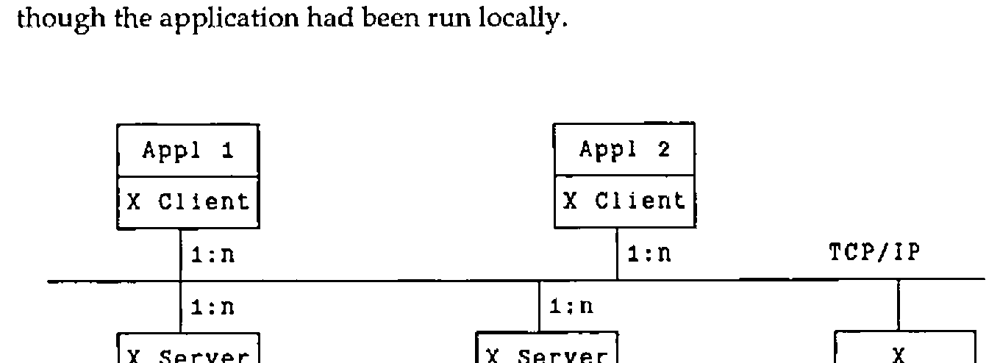
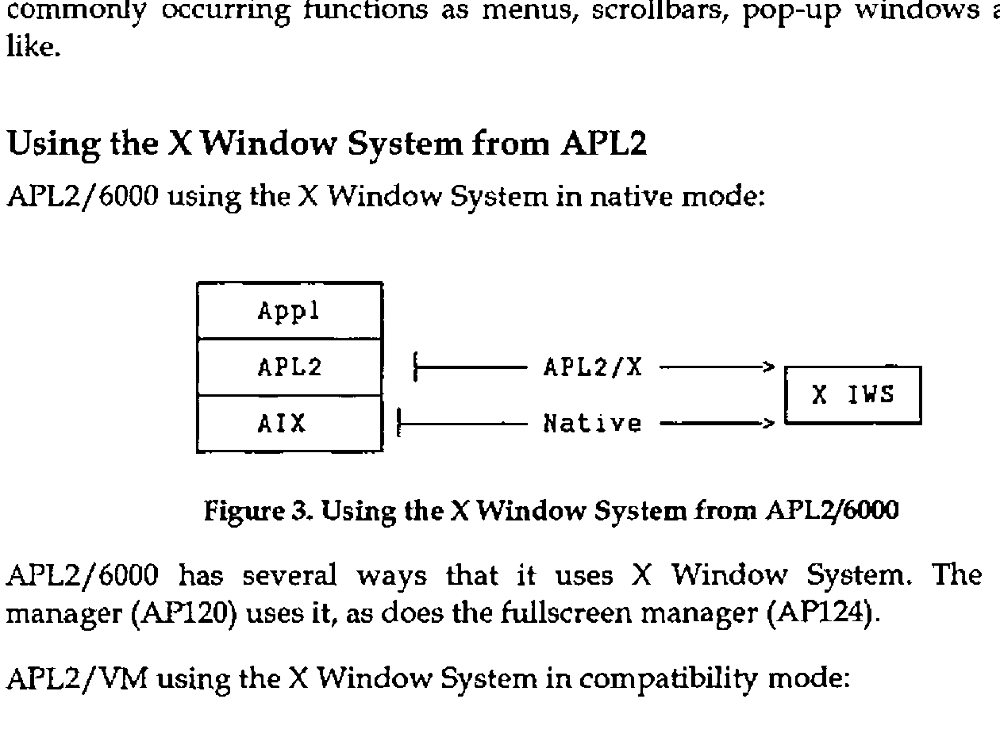

*by John R. Jensen and Kirk A. Beaty*
{ .byline }

## Abstract

This document describes APL2/X, an interface between the X Window System and APL2, designed and built at the IBM Cambridge Scientific Center. APL2/X enables all of the X Window System Xlib calls and data-structures to be used from the APL2 environment. In so doing, it enables APL2 to use a true windowing environment. Several APL2 sample programs using the interface have been coded to illustrate and validate the interface.

The X Window System is a large application written in C. APL2/X has therefore been built upon, as well as heavily influenced, a general APL2-to-C interface that runs on APL2/6000 under AIX, on APL2/370 under VM/CMS and MVS/TSO, and on APL2/PC under PC/DOS. When running under AIX or DOS, a new auxiliary processor, AP144, is used. When running under VM or MVS, APL2 will communicate with C using APL2’s associated processor 11.

The APL2 AP144 X Window System interface has been announced as an integral part of the APL2/6000 product (5765-012). The APL2 X Window System interface for VM/CMS has been released as part of the TCP/IP Version 2 for VM product (5735-FAL). The other implementations remain experimental.

## Overview of the X Window System

Since the X Window System is probably not that well-known in the APL2 community, a brief introduction may be in order. It is similar to other windowing systems such as Microsoft Windows and Presentation Manager in that it gives you a multitude of calls to control a windows-oriented system, handling the manipulation of the windows on the screen, drawing of text and graphics, and managing the event queue. It is the de-facto standard in the UNIX world, but it can also be used from other operating system environments as well.

The output capabilities of the X Window System can be summarized as follows:

- Managing a multitude of overlapping windows on one or more display screens.
- Drawing of graphics primitives (lines, arcs, rectangles and polygons with or without fills).
- Writing high-quality text.
- Supporting colour.
- Image support.

Inputs are received in the form of events. Events can be generated by:

- The user using the workstation keyboard.
- The user manipulating the mouse (moving it, using the mouse buttons).
- Other events, such as when a window is cleared and needs to be redrawn.

Other important facts about the X Window System:

- Network transparent - An application running on one machine can display on the same machine, or another.
- Vendor independence - The underlying display hardware is hidden by the protocol from the application, enhancing portability.
- Concurrency - Several applications active on the workstation at any one time.
- Information sharing across applications.

The X Window System is separated into three major components:

| Component | Use |
|---|---|
| Client | The client services represent the interface to the application programs. It consists of all the calls that the application programs can use to invoke the various services of the X Window System. It communicates with the X Window System server through the defined X Window System network protocol. |
| Server | The server receives the network protocol requests, and acts upon them, drawing windows, graphics, text and images on the display. It also generates event messages whenever the user performs an action such as typing a letter, moving the mouse, etc., and returns these events to the user via the client services. |
| Window Manager | The window manager controls the appearance of the various windows on the display. Different window managers exist. A window manager now in common use is the OSF/Motif window manager that gives the X Window System the same "look and feel" as that of the OS/2 Presentation Manager. |

These three components of the X Window System need not run on the same physical machine. As shown in Figure 1, the application may be running on, say, a VM host, communicating through the X Window System client services with an X Window System server running on a RT PC or a RISC System/6000. The information flow between these machines is handled by TCP/IP. The net effect of this is that the application’s results appear on the workstation’s display as though the application had been run locally.



*Figure 1. The X Window System client-server relationship*
{ .caption }

It is also possible for a single client to display on many servers at once. Likewise, a server can also service many clients at the same time, displaying the output of many application programs at once. Figure 1 illustrates the relationship.

The X Window System defines a layered architecture. Figure 2 shows the layers of the hierarchy. An application can draw upon the calls of all of these layers.

```
+-----------------------+
| Application Program   |
|  +--------------------+
|  | OSF/Motif          |
|  +--------------------+
|  | X Widgets          |
|  +--------------------+
|  | X Intrinsics       |
|  +--------------------+
|  | Xlib               |
+-----------------------+
| X Network Protocol    |
+-----------------------+
```

*Figure 2. The X Window System hierarchy*
{ .caption }

The X Window System network protocol is at the base of this hierarchy, ultimately defining the traffic flowing between the client and server components.

The next level up is the Xlib level. Most application programmers will never interface with the X Window System at a lower level than the Xlib level. It consists of about 400 separate calls written in C, and more than a 100 data structures.

The next two layers, the X Intrinsics and the X Widgets, form sets of routines that create higher-level abstractions. These are then used as a basis for a number of X-based toolkits. A number of standard toolkits are provided with the X Window System, supplied by various vendors. OSF/Motif can be viewed as one of the more elaborate toolkits in existence today. It provides calls to handle such commonly occurring functions as menus, scrollbars, pop-up windows and the like.

## Using the X Window System from APL2

APL2/6000 using the X Window System in native mode (Figure 3), and APL2/VM using the X Window System in compatibility mode (Figure 4):



*Figures 3 and 4. Using the X Window System from APL2/6000 and from APL2/VM*
{ .caption }

APL2/6000 has several ways that it uses X Window System. The session manager (AP120) uses it, as does the fullscreen manager (AP124).

The simplest way to use the X Window System today from APL2 is to use it in compatibility mode. Thus, the existing interfaces remain unchanged, but the display will now take place on the X Window System workstation. Two possibilities exist to do this:

**X3270** is a terminal emulator that enables you to run a 3270-type session on an X Window System workstation, given the proper network attachments. It supports different size fonts including APL2, GDDM-style graphics, 3277GA emulation and some mouse-support. X3270 is an announced IBM product.

**GDDM/XD** is an interface which permits the display of graphics output from GDDM on workstations supporting the X Window System It is available as part of the TCP/IP product for both VM and MVS. It displays both character and graphics output in a separate window on the X Window System workstation.

## Exploiting the X Window System from APL2

APL2/X takes a different approach to the X Window System. In order to exploit fully the X Window System from the APL2 environment it is essential that APL2 have direct access to the basic X Window System calls. How this is achieved will be the topic for the rest of this paper.

All the X Window System calls are defined in a table, along with parameter type codes that are used to validate argument inputs and generate call outputs. All calls to the X Window System from APL2 are done using the single APL2 function `XWIN`, rather that define APL2 functions for each separate X Window System call.

The `XWIN` function uses the associated processor 11 in the VM environment to communicate with C, and the new auxiliary processor AP144 in the AIX environment, but this usage is completely transparent to the user. To him or her there is a single, common interface to the X Window System from APL2.

```apl
(rc [results]) ← [c] XWIN command [parm] [parm]...
```

`command`
:   The name of the X Window System call to be invoked, specified as an APL2 character vector.

`[parm]`
:   All but a few of the X Window System calls require additional input parameters to be specified. These are given after the name of the call itself, in the same order as listed in the X Window System documentation.

`[c]`
:   An optional vector of up to two elements controlling the behaviour of the `XWIN` function. The two elements are orthogonal to each another:

    The first element determines what is returned by the function:

    | | |
    |---|---|
    | c = 0 x | The function never returns anything |
    | c = 1 x | Return an integer return-code rc |
    | c = 2 x | Return any result data produced by the call, if any. If no data is produced, nothing is returned in z. |
    | c = 3 x | Return a one- or two-element vector. The first element always contains the return-code. The second element, if present, contains the result data produced by the call. |

    The second element determines what happens if the call results in an error:

    | | |
    |---|---|
    | c = x 0 | Ignore any errors |
    | c = x 1 | Generate a message to the console listing the cause of the error |
    | c = x 2 | Halt execution on occurrence of an error |
    | c = x 3 | Generate a message to the console listing the cause of the error, followed by halting the execution of the program. |

    If only the first element is given, the second is assumed equal to 0. c can be omitted entirely. The behaviour will then be equivalent to a setting of "2 3".

`[rc]`
:   The operation return-code.

`[results]`
:   The output from the call (if any) is returned in the form of an explicit result. This result includes the X Window System explicit result (if any), as well as any implicit results passed back via output parameters given on the call. More on this topic below.

The different control options caters to many different possibilities. If called with a setting of "3 0", then `XWIN` will pass back an error code as part of the function return. It is then up to the calling program to check this code and take appropriate action on a non-zero return-code.

If, on the other hand, `XWIN` is called with a control setting of "2 3", then `XWIN` will in effect provide a default error handler to check the return-codes as they are returned from each call to APL2/X. If an error is encountered, then `XWIN` will suspend operation in the function to give the programmer a chance to correct the problem.

The call **XOpenDisplay** can serve to illustrate the close correspondence between the X Window System calls issued from C and from APL2. In C, a call to this might look like:

```c
dp = XOpenDisplay("");
```

The same call can be issued from APL2 via APL2/X:

```apl
dp ← XWIN 'XOpenDisplay' ''
```

The X Window System call name becomes the first parameter specified on the call through APL2/X. Apart from this, everything else remains the same.

## HelloWorld

It seems as though it is a rite of passage for a windows-based package to have a HelloWorld sample program; APL2/X follows this trend. We will use the APL2 function `HelloWorld` to introduce many of the concepts of APL2/X.

The goal of `HelloWorld` is to create a window on the workstation, display some text, and then wait for the user to initiate any further processing. The program is notified of the user’s actions. It responds to three different types of actions on the part of the user:

- **Pressing the left mouse button:** When this button is pressed, the text "Hi!" will be written at the tip of the pointer.
- **Pressing any alphanumeric key:** The key symbol is written in the window at the tip of the pointer, except in the case of a "q" being pressed. A "q" terminates the application, closing the window.
- **A window expose:** This event is generated whenever the window is uncovered. It is a signal to the application to redraw the initial content of the window. Any text written to the window as a result of either of the two actions mentioned above are lost.

**HelloWorld** exhibits two fundamental concepts of windows-based systems: window manipulation and responding to user-generated events. As such, it serves as an excellent vehicle to introduce these concepts. The discussion here will focus on how to run the HelloWorld program from the APL2 environment, with each X Window System call being generated from APL2. The design of this program is described in:

> Oliver Jones: Introduction to the X Window system<br>
> Prentice Hall, 1989; ISBN 0-13-499997-4

See this text for a full description of each of the X Window System calls.

### Initialization

```apl
     ∇
[0]   HelloWorld;⎕IO;dp;w;gc;s;e;k;rw;bp;wp;m;hello;
       hi;done;None;hp;hints;rc;nl;x;ep
[1]   ⍝ Sample X program, based on helloworld.c from
[2]   ⍝ Oliver Jones:
[3]   ⍝ Introduction to the X Window system
[4]   ⍝ Prentice-Hall, 1989;  ISBN 0-13-499997-4
[5]    ⎕IO←0
[6]
[7]   ⍝ Define some constant text-strings
[8]    hello←'Hello, World.'
[9]   ⍝ The exclamation point makes hi ugly:
[10]   hi←'Hi',('A'=⎕AF 65)⊃⎕AF 90 33
[11]
```

The initial section of the functions merits few comments. All that happens in this section is the setting up of the text strings that will be shown in the window later on, and definition of some local identifiers. The only note-worthy item is the way the exclamation point has to be defined. This ensures portability of the code.

### Connect to X Window System

```apl
[12]  ⍝ Initialization
[13]   →(0=dp←XWIN 'XOpenDisplay' '')↓lopen
[14]   ⎕←'XOpenDisplay failed ... HelloWorld aborted'
[15]   →lexit
[16]  lopen:
[17]
```

The first call to X Window System is to open a connection to the display. The call results in a ‘handle’ or magic number that will be used to identify the connection in all subsequent X call requests. The handle is saved in the `dp` variable.

Notes:

- All X Window System calls pass through the `XWIN` function.
- The first parameter to this function is always the name of the X call.
- If the X call requires parameters to be specified, then these are given following the name of the call. The **XOpenDisplay** call has one parameter: the name of the display to be used. This is given as an APL2 character string. (The default display will be used, as we have specified an empty string.)
- Character strings are passed (and returned) by value. APL2/X will convert these parameters to the C char \* pointers that X ultimately requires. APL2/X also handles NULL-termination of the character strings.
- All output from invoking X Window System calls are returned as explicit results of `XWIN`.

The HelloWorld function as described performs minimal error checking. This should obviously be changed for programs and applications targeted for a production environment.

### Get more information

```apl
[18]  ⍝ Default pixel values
[19]   s←XWIN 'XDefaultScreen' dp
[20]   bp←XWIN 'XBlackPixel' dp s
[21]   wp←XWIN 'XWhitePixel' dp s
[22]
```

Once the connection to the display is established, X can provide the calling program with a lot of information. Here we retrieve the number designating the default screen and the pixel values for black and white.

Notes:

- All input and output parameters on these three calls are integers. They are passed to (and returned from) X Window System by value.
- APL2/X handles any required conversion between boolean and integer data types. Floating point numbers cannot be used.

### Using X constants

```apl
[23]  ⍝ Define an X constant[24]   None←0
[25]
[26]  ⍝ Prepare to set window position and size
[27]   (rc nl)←'H¯' axGetFF 'XSizeHints'
[28]   m←+/PPosition PSize
[29]
```

X Window System defines a large number of named constants in its C header files. These constants should also be available to APL2. However, there are too many constants defined to keep them all in the workspace. (Although technically feasible, it would define so many symbols in the workspace that it would obscure the "real" application variables.)

The simplest solution to this problem is to specify these constants by value rather than by name. However, by doing so we lose a lot of the information content associated with the constant, and we increase any future maintenance burden.

Another fairly simple solution is to define the needed constants as APL2 variables, and then to use these variables whenever the constant is called. The variables can either be defined as global variables, or as local variables within the applicable functions, as is done with `None`. This is **not** a recommended solution, though, as it relies on the constants staying forever unchanged. (`None` will be used further down in the function, in the call to XSetStandardProperties.)

A better way is to use the support for constants built into APL2/X. APL2/X groups the constants by categories. Each group can be brought into the workspace independently of other groups, ensuring that the latest values are used. The `axGetFF` function loads a named group of constants and establishes them as APL2 variables in the workspace. `PPosition` and `PSize` are examples of two such constants.

Notes:

- `axGetFF` returns a list of names of constants established in the workspace. We will use the list later on to clear away the variables when they are no longer needed.
- The name of the group of constants is specified as the right argument to `axGetFF`. This name is in fact the name of an X data structure. We will return to this topic below.
- `PPosition` and `PSize` each contain 32 individual bits, although given to APL2 as four-byte integers. The simple adding works here because their bits are orthogonal. In the general case this cannot be assumed to be the case, so a combination of decode, logical operation and encode is the advisable course to take, e.g.:

    ```apl
    m←2⊥∨/(32⍴2)⊤PPosition PSize
    ```

### Creating a new structure instance

```apl
[30]  ⍝ Build an XSizeHints structure instance
[31]   hp←XWIN 'New' 'XSizeHints'
```

APL2/X provides extensive support for X Window System data structures. A number of these commands exist to help you manipulate the X Window System data structures from APL2. The command is specified as the first parameter, and the structure name as the second parameter. Additional parameters will often be required; these follow the structure name on the call.

In this case, New allocates space for a new instance of the **XSizeHints** structure and returns the address of this instance to APL2. The structure instances are stored in C free storage space (i.e. via calls to the C `malloc()` routine).

### Importing a structure into APL2

```apl
[32]   hints←XWIN 'Get' 'XSizeHints' hp
```

To be used from within the APL2 workspace the structure must be imported into the workspace. This is done by using the **Get** command. This commands copies the values of the structure into an APL2 vector. Each field in the structure is mapped to an element in the vector in the same order as in the X Window System structure definition. APL2/X handles the appropriate data conversions when copying the data.

### Changing the values in a structure (within APL)

```apl
[33]   hints[H¯flags H¯x H¯y]←m 200 300
[34]   hints[H¯width H¯height]←350 250
```

Once copied into the workspace the structure instances can be used like any regular APL2 array. Here five of the fields are updated.

The indices of the elements to be changed are given by constant variables prefixed by `H¯`. These constants were generated by the `axGetFF` function when the **XSizeHints** structure definition was loaded in line 27. To recall:

```apl
[27]   (rc nl)←'H¯' axGetFF 'XSizeHints'
```

The `axGetFF` function establishes a number of global variables in the workspace. These variables can be divided into two separate groups:

Field indices
:   These variables are used to indicate the location of a given field in a structure. They provide a rough equivalence between the C structure member operation `hints.mask` and the APL2 version `hints[H¯mask]`.

    Since structure field names all tend to be very common identifiers, eg. "x", "name", or "size", it is possible (and advisable) to specify a prefix that will be applied to each field name before it is established in APL2. This avoids name conflicts between the various structures’ field-name index variables. "`H¯`" is the prefix used in the example given here.

Constants
:   We met these earlier on. They are combined with the structure definitions because they often are used in conjunction with these. It is common that the valid values for a given field in a structure are given by constants, but they can be put to whatever use is wanted. Names of constants are never changed; i.e. the prefix does not apply to constants.

### Updating a structure instance (within C)

```apl
[35]   XWIN 'Put' 'XSizeHints' hp hints
[36]
```

Changing the values of a structure variable only has effect within APL2. The **Put** command is necessary to make the updated structure values available to the X Window System calls.

The **Put** command expects exactly three parameters:

1. the name of the structure (e.g. `'XSizeHints'`),
2. a pointer to an already defined storage location (e.g. `hp`), and
3. the data values to be stored in the structure instance (e.g. `hints`).

### Creating a simple X Window System window

```apl
[37]  ⍝ Window creation
[38]   rw←XWIN 'XDefaultRootWindow' dp
[39]   x←hints[1 2 3 4],5 bp wp
[40]   w←XWIN 'XCreateSimpleWindow' dp rw,x
```

We are now in a position to create our application window. This is accomplished with these two calls. From an APL2/X point of view these are both very ordinary calls.

**Note:** The `hints` values can be used like any other APL2 variable. Here four of them are used to specify the window start and extent.

### Using the structure pointer

```apl
[41]   x←hello hello None('A' 'test')2 hp
[42]   XWIN 'XSetStandardProperties' dp w,x
```

The **XSizeHints** structure created is now put to use. As the name of the call implies it defines defaults for a number of the window attributes.

Notes:

- **XSetStandardProperties** uses an **argv** parameter. This type of parameter is specified from APL2 as a vector of character vectors. (*argv* and *argc* are well-known C variable types. X uses them in several of its calls).
- The **argv** parameter is followed by an **argc** parameter. The information content of this parameter is in a sense redundant in APL2, since the information can be determined by examining the argv variable. One of our general design rules in building the APL2/X interface has been to maintain a fidelity to the standard X Window System call syntax, even though at times it means specifying more information in the call than is strictly necessary.

### Freeing the structure after use

```apl
[43]   XWIN 'SFree' 'XSizeHints' hp
[44]
```

**Note:** It is important that the structure is freed after it is no longer needed. If this is not done, it will continue to occupy space in storage, and may lead to storage fragmentation in the long run.

- The name **SFree** is used in place of **Free** so as not to conflict with the **free** associated with the C **malloc** function.

### Creating a Graphics Context

```apl
[45]  ⍝ Graphics Context creation and initialization
[46]   gc←XWIN 'XCreateGC' dp w 0 0
[47]   XWIN 'XSetBackground' dp gc bp
[48]   XWIN 'XSetForeground' dp gc wp
[49]
```

A graphics context is the X Window System version of a magic paintbrush. It is used on any drawing calls to define colours, patterns, and like items. We define one here, so we can use it later on to write some text to the window.

### Show the window outline

```apl
[50]  ⍝ Window mapping
[51]   XWIN 'XMapRaised' dp w
[52]
```

We are now ready to show the window to the user. This call will do just that. But note that we have yet to write any text into it, nor are we quite ready to accept input from the user just yet.

### Which events are we interested in

```apl
[53]  ⍝ Input event selection
[54]   m←'ButtonPressMask' 'KeyPressMask'
[55]   m←m,⊂'ExposureMask'
[56]   (rc m)←m axGetFF1 'XEvent'
[57]   XWIN 'XSelectInput' dp w(+/m)
[58]   ep←XWIN 'XGetEventBuffer'
[59]
```

**XSelectInput** tells the X Window System which events we are interested in being notified about. It is a straight-forward call, except that the last parameter is a bit-mask. The various constants defining the individual bits are defined in the **XEvent** structure. We could now use the `axGetFF` function introduced earlier to load in all fields and constants, and then use the variables thus established. However, we chose to take slightly different route:

The `axGetFF1` function is used in place of `axGetFF`. Instead of establishing variables based on the names of the fields and constants it returns the values of a set of named items. Since we are only interested in three specific constants, we use `axGetFF1` to retrieve their values.

- The values retrieved represent individual bits. It is therefore possible to just add them instead of performing a bit-wise "or".
- Bit-flags are returned in "packed" form, i.e. as integers.

The **XGetEventBuffer** establishes a pointer to the buffer used to hold events. The same buffer is used for all events, hence we only need to make this call once per session. More on this below, in the discussion of the key events.

### Get the event codes

```apl
[60]  ⍝ Get some more constants
[61]   m←'KeyPress' 'ButtonPress'
[62]   m←m,'Expose' 'MappingNotify'
[63]   (rc m)←m axGetFF1 'XEvent'
[64]  ⍝ ... and some event structure layouts
[65]   nl←nl,1⊃'K_' axGetFF 'XKeyEvent'
[66]   nl←nl,1⊃'B_' axGetFF 'XButtonEvent'
[67]   nl←nl,1⊃'E_' axGetFF 'XExposeEvent'
[68]
```

X Window System notifies us of the user’s actions by returning events to us upon our requesting them. The type of events will be limited to ones enabled by the **XSelectInput** call just executed. One of the fields in the returned event will specify the type of event that is being returned. These event types are also defined in the **XEvent** structure. To be able to distinguish the returned events by type we set up a vector with the expected types with the `axGetFF1` function.

We also load in the field definition variables describing the event structures we might receive. They will help us access the right fields in the structures.

### The event loop

```apl
[69]  ⍝ Main event-reading loop
[70]   done←0
[71]  levent:→(done=0)↓lend
[72]
```

We now sit in an event loop, responding to the incoming events as they come in from the display, until done.

### XNextEvent

```apl
[73]  ⍝ Read and process the next event
[74]   x←lKeyPress lButtonPress lExpose lMappingNotify
[75]   →(m=K_type⊃e←XWIN 'XNextEvent' dp)/x
[76]
```

**XNextEvent** returns the next event in the queue to us. Once the event has been returned the event type is compared with the mask defined earlier to set up the proper branch. Effectively this serves as a "Case-on-Event" statement. The event is returned as a vector of structure fields, much the same way that the structure Get call would return a structure instance.

This differs from the way that the **XNextEvent** call is handled in X Window System. In native X Window System, the **XNextEvent** call also specifies a second parameter, a pointer to an **XAnyEvent** structure. **XNextEvent** fills in the structure fields, thereby making the event values available the calling program. This is an example of how APL2/X differs from native X Window System by automatically handling the call’s output parameters.

### Handling the Expose events

```apl
[77]  lExpose: ⍝ Repaint window on expose events
[78]   →e[E_count]↑levent     ⍝ Count > 0 ?
[79]   x←e[E_display E_window],gc,50 50
[80]   XWIN(⊂'XDrawImageString'),x,hello(⍴hello)
[81]   →levent
[82]
```

Expose events are generated whenever a window is made visible on the screen. Multiple expose events may be generated, so it makes sense only to respond to the last one. X Window System caters for this approach by providing a count of future, already pending expose events as one of the fields in the expose event itself. We use this field to ignore all but the last expose event.

When we receive the final expose event we want to write the content of the `hello` variable to the screen. This we do using the **XDrawImageString** call.

- All events provide the value of the originating display connection in the `e[E_display]` item in the event structure. This identifies the origins of an event, in case of multiple, concurrent display connections have been established. Here its value equals that of `dp`.
- Most (but not all) events also specify the window that generated the event (some events do not come from windows). This equals the value of `w` here.
- The last parameter (`(⍴hello)`) may seem superfluous. This is certainly the case in the APL2 environment, where the information could be had from the preceding parameters. Again, as stated earlier, APL2/X sticks as closely to the defined syntax of the X Window System calls as possible. In this case, the inconvenience of having to specify this size field did not outweigh the desire to maintain fidelity to the X Window System call syntax.

### Handling the ButtonPress events

```apl
[83]  lButtonPress: ⍝ Process mouse-button presses
[84]   x←e[B_display B_window],gc,e[B_x B_y]
[85]   XWIN(⊂'XDrawImageString'),x,hi(⍴hi)
[86]   →levent
[87]
```

The comments here mimic those made for Expose events. The only noteworthy change is the use of `events[B_x B_y]` to indicate the position where the writing is to start. This coordinate pair is returned as part of the ButtonPress event structure, and indicates the position of the tip of the mouse pointer when its button was pressed. The net effect of this code fragment is to write the text "Hi!" at the mouse pointer when the mouse button is pressed.

### Handling the KeyPress events

```apl
[88]  lKeyPress: ⍝ Process keyboard input
[89]   →(done←(↑k←∊1⊃XWIN 'XLookupString' ep)∊'qQ')↓levent
[90]   x←e[K_display K_window],gc,e[K_x K_y]
[91]   XWIN(⊂'XDrawImageString'),x,k(⍴k)
[92]   →levent
[93]
```

KeyPress events are generated when the user presses any of the keys on the keyboard. However, information about the key pressed is not part of the returned event structure, so we need to use the **XLookupString** call to acquire this information. This call has one input parameter, the event whose key we want to ascertain. This parameter can be specified either as the set of values returned on the **XNextEvent** call, or using the pointer to the event buffer that we set up earlier on. The latter method is faster, as it does not involve passing a lot of information through the interface, so we use it here.

The key pressed is returned as the second element of the **XLookupString** return. We test on this field to see if it matches a "q". If so, we terminate the program. If not, we print the key character at the current mouse pointer location.

All event structures are exactly as defined by X Window System, except for the **XKeyEvent** structure returned by the KeyPress (and KeyRelease) events. The **XKeyEvent** structure contains one additional field not found in the X Window System definition: the character representation of the key. This last field is named "key" and is appended to the end of the structure.

### Mapping Notify

```apl
[94]  lMappingNotify: ⍝ Reset keyboard
[95]   XWIN 'XRefreshKeyboardMapping' e
[96]   →levent
[97]
```

**MappingNotify** events are generated when the keyboard mapping needs to be re-established (i.e. when it has been changed elsewhere). See the referenced text for more information on this call.

### Termination

```apl
[98]  lend: ⍝ Termination
[99]   XWIN 'XFreeGC' dp gc
[100]  XWIN 'XDestroyWindow' dp w
[101]  XWIN 'XCloseDisplay' dp
[102]  nl←⎕EX¨nl
[103] lexit:
     ∇ 1991-4-16 18.43.0 (GMT-4)
```

Before terminating the `HelloWorld` sample program we free up the resources we have used. Some of these resources are controlled by X Window System, so the X Window System must free them.

We also clear the workspace of all the APL2/X-defined variables. These could conceivably be saved with the workspace, obviating the necessity of loading them every time the application is run. A production level application probably should take this latter approach, unless the underlying structures change very frequently.

## Current Status

At the time of this writing, all the X Window System Xlib calls have been implemented. The full interface is available as AP144 in the APL2/6000 product (5765-012), and as part of the TCP/IP Version 2 for VM product (5735-FAL).

Where do we go from here? A number of possibilities are possible as experimental work in the Cambridge Scientific Center. The following is a list of some of these:

- Port APL2/X to MVS.
- Implement selected higher-level calls from the Toolkit and OSF/Motif.
- Build an APL2 workspace of functions to make better use of the X Window System calls. The present set of functionality is very rich, but very tedious to work with. It is like using GDDM directly (via AP126) to generate 3270 panels, without the use of any APL2 cover functions, except that the problem is further magnified.
- Enable other packages written in C to be used from APL2. Since APL2/X is built upon a general APL2-to-C interface, these possibilities are made available. One such set of functions would be the TCP/IP communications protocol.

## Trademarks

**X Window System** is a trademark of Massachusetts Institute of Technology.<br>
**Microsoft** is a registered trademark of Microsoft Corporation.<br>
**Windows** is a trademark of Microsoft Corporation.<br>
**OS/2** is a registered trademark of International Business Machines Corporation.<br>
**Presentation Manager** is a trademark of International Business Machines Corp.<br>
**UNIX** is a trademark of UNIX System Laboratories, Inc.<br>
**OSF/Motif** is a trademark of Open Software Foundation, Inc.<br>
**RT PC** and **RISC System/6000** are trademarks of International Business Machines.
{ .note }
