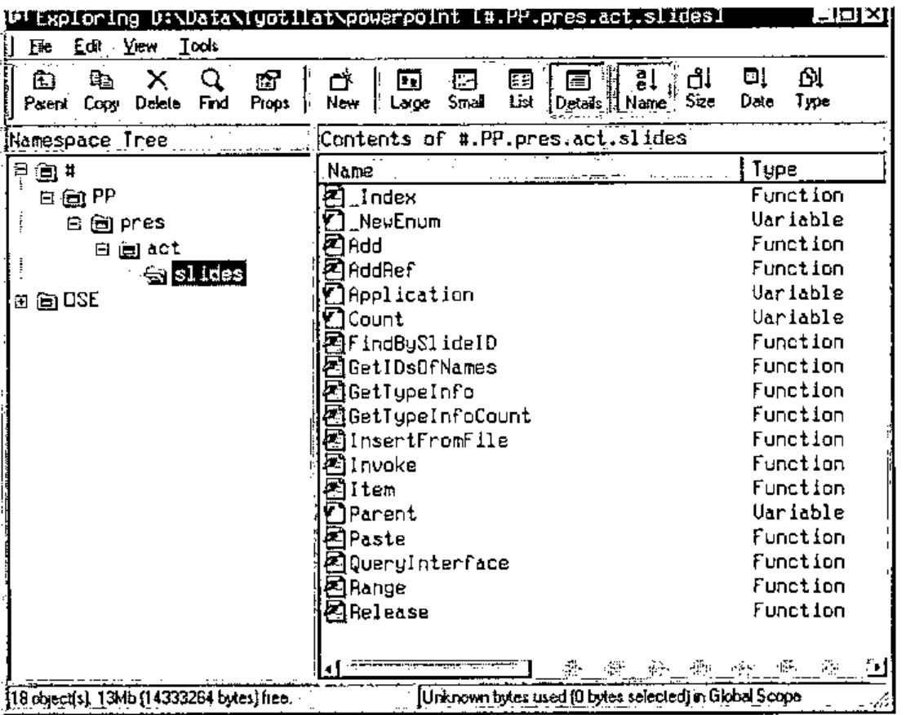
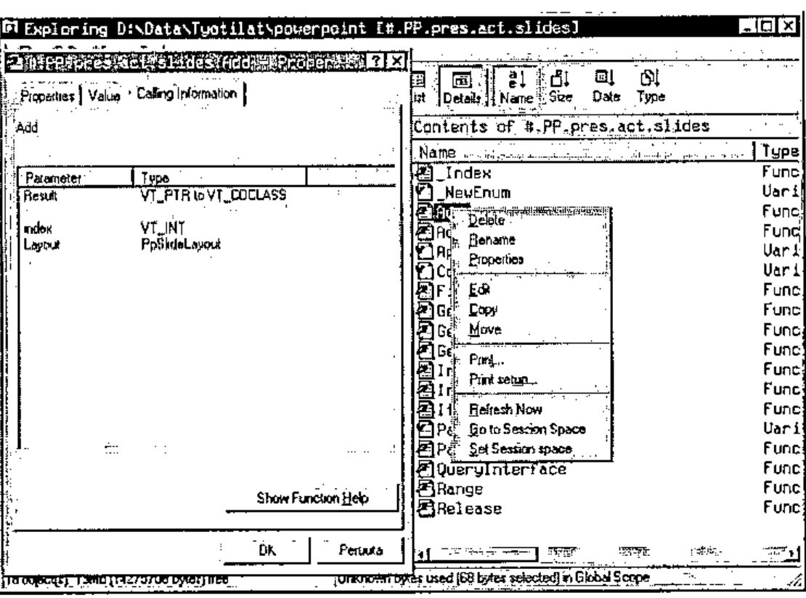
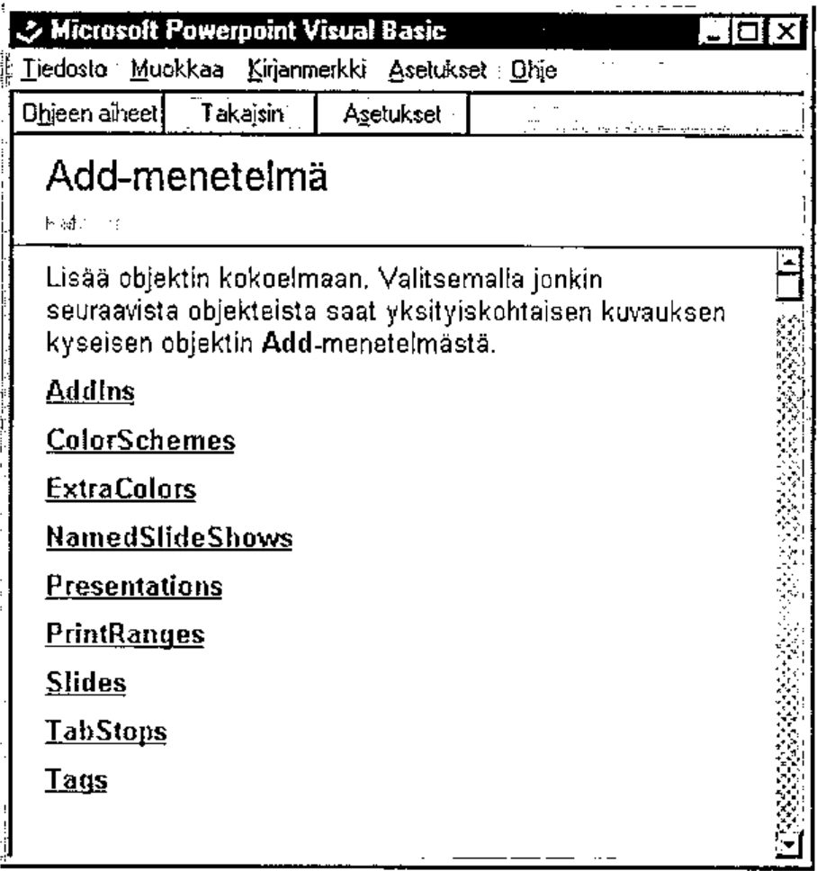
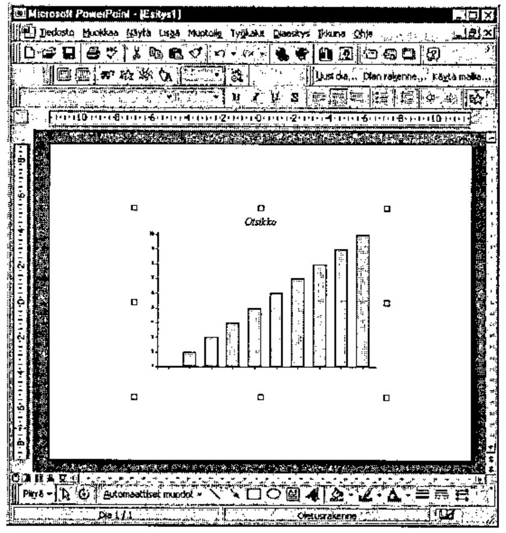

*by Jouko Kangasniemi*
{ .byline }

This is a brief story of APL-PowerPoint co-operation. PowerPoint has nearly a monopoly in the presentation application-market. One has to use it more or less by force. The same phenomena can be recognised in the word processor market and in the spreadsheet market.

Presentations with business graphics are often shown by PowerPoint. If you already have excellent tools like APL & RainPro and you mainly deal with PDFs, the graph side of your life is already covered quite well. PP is not interesting to someone who can do Rain. But still you occasionally have to deliver stat information in PP format.

So what should I do? Should all the beautiful linecharts with nice thick lines to be done again. PP graphics is actually the same MsGraph as in Excel and you can not do anything special with it. It is even a bit trickier to use than Excel. At least for me. Is there a way to get the beautiful Rain-graphs directly to Mickeysoft-world with a minimal amount of tears? With no need to invent the same things again and being forced to maintain two versions of the same thing?

If you can’t invent, copy! So why don’t I make a metafile of the image and copy it to clipboard and then paste it to PowerPoint? Not a bad idea. One can move one chart manually, but if the copy-paste is frequent, some sort of automation is in demand. OLE-automation is the answer here. The technique is very similar to Excel’s and Word’s OLE-interfaces, but the terms are naturally a bit different. So this rehearsal is about how to make PP dance, or at least walk slowly, through OLE from Dyalog APL.

Beginning is easy in this case. Let’s make a chart. Load Rain and write a bit of code. (“Otsikko” is head in Finnish for those who wonder…)

```apl
ch.Set('Head' 'Otsikko')
ch.Bar ⍳10
PG←ch.Close
```

Variable PG can be copied to clipboard with the function Clip that comes with Rain.

```apl
#.PostScrp.Clip PG
```

So we are halfway home, or what? We have done the graph and it’s sitting waiting at the clipboard. Unfortunately there is still lot to do and we must dive into the inner parts of PowerPoint.

First we have to start the damn thing. Write

```apl
p←'PP'⎕WC'Oleclient' 'Powerpoint.Application'
```

and it has to be made visible

```apl
p ⎕WS'visible' 1
```

As a technical detail I should mention that I use Dyalog APL version 8.2. That is why I still use objects the old way. Version 9 introduced the dot-syntax, but somehow this traditional way is still more familiar.

Adventures in the OLE-land are often based on wild guess, trial and error and lots of lost time, at least in my case. But of course you get aid by asking properties and methods of the functions

```apl
'PP' ⎕WG'Proplist'
Type Active HWND Visible WindowState Height Width Top Left VBE A
   ddIns Creator ActivePrinter OperatingSystem Version Build FileF
   ind FileSearch Assistant Caption Name Path CommandBars SlideSh
   owWindows ActivePresentation ActiveWindow Dialogs Windows Presen
   tations ClassName Event Data Handle ClassID KeepOnClose Method
   List VerbList TypeList HelpFile LastError Locale AutoBrowse In
   stanceMode ChildList EventList PropList
```

From this piece of text we can guess that the word "Presentations" might be useful. A good way to speed up the beating of the OLE-objects is also to search for OLE tips from the internet’s dark Visual Basic section and to try them the APL-way. It saves time.

The wonders of objects can also be investigated with the excellent Dyalog resource tool, that gives us the objects and methods of those OLE plums. For example, from inside the "slides" object we find the following:



If you press the right button of the mouse you get a menu. "Properties" gives you useful information related to objects and methods and how to use them. Especially the "Calling Information"-tab is often rewarding.



And we are lucky, Show Function Help-button gives us a good Microsoft help topic. Usually the help does not help at all, only makes one angry, but after a while something useful is bound to be found (Again some Finnish below).



Back to the subject. Now that we have the program running, we need a presentation. It can be done with the presentations-object. Let’s say

```apl
pres←'PP.pres'⎕WC PP.Presentations
```

and then the "Add" method

```apl
3 ⎕NQ pres'Add', or PP.pres.Add 1
```

which gives us an empty presentation with no slides at all. We must get those next. The journey that continues towards a slide has to be done with active presentation. Let’s define

```apl
act←(pres,'.act')⎕WC PP.ActivePresentation
```

A "Slides"-object can be created as a child of the presentation:

```apl
slid←(act,'.slides')⎕WC(⍎act,'.Slides')
```

So here we are, ready to add the slide with the "Add"-command

```apl
3 ⎕NQ slid'add' 1 'ppLayoutBlank'
```

"One" is the position of the new slide and `ppLayoutBlank` is the type of the new slide. Just an empty slide. There are around dozen different slide types. A single presentation can contain several slides. The number of these can be queried:

```apl
     (pres,'.act.slides')⎕WG'Count'
1
```

If we want the new slide to be the last one, we can call it Count+1 of course.

We must paste the metafile from the clipboard through the current active window. Let’s ask who is active at the moment

```apl
actv←(pres,'.actv')⎕WC PP.ActiveWindow
```

View-object is the thing that is next in demand in order to do get the chart from the clipboard

```apl
view←(pres,'.actv.vi')⎕WC(⍎actv,'.View')
```

and finally we say "Paste" and bang we have a PP chart

```apl
3 ⎕NQ view'Paste'
```

Place and size of the image can be altered with OLE and animations etc. can be added to make the owner of the presentation happy and to make the audience suffer.

An image can also be added from a file. There we need object "Shapes", and it has a method called "AddPicture" that does the trick. The clipboard way is faster and easier.

The show can be started automatically. To do that, we need an object called "Slideshowsettings".

```apl
sls←'PP.pres.act.sls'⎕WC PP.pres.act.SlideShowSettings
```

And the show can go on…

```apl
3 ⎕NQ sls'Run'
```

It is best to save the presentation with SaveAs-method. With it you do not have to care if there already is a file with the same name.

```apl
3 ⎕NQ act 'SaveAs' 'd:\data\esitykset\koe'
```

The presentation is closed with the Close-method.

```apl
3 ⎕NQ act 'Close'
```

and it can be reopened

```apl
3 ⎕NQ pres 'Open' 'd:\data\esitykset\koe.ppt'
```

To make PowerPoint go away the Quit command is not enough. All the presentations must be closed, then Quit and then we must delete the 'PP'-namespace.

```apl
3 ⎕NQ p 'Quit' ⋄ ⎕ex p
```

As a conclusion it can be mentioned that this simple operation took a considerable amount of time doing it the first time. It pays to save frequently because Dyalog tends to crash occasionally with OLE trial-and-error development. All the useful objects and methods that are found must be documented right away. And I should have studied the PP object model at the beginning, not after several hours of trial and error. On the other hand now it is a bit clearer to me. There are lots of possibilities in what can be done with PP and OLE. If someone has already gone further please let me know. And here is proof that it works:



## What About Dyalog 9?

*by the Editor*
{ .byline }

I admit it: after all the time since Dyalog 9 was released, I fail to see what is so exciting about using all those quotes when dealing with OLE Automation. The developers at Dyadic have done an excellent job to simplify the interaction between APL and an application like Microsoft PowerPoint. Therefore here’s my quick rephrasing of Jouko’s snippets, in modern syntax.

```apl
ch.Set 'Head' 'Testa' ⍝ "Testa" is of course Italian for "Head"
ch.Bar ⍳10
PG←ch.Close
#.PostScrp.Clip PG    ⍝ Nothing new this far

'PP' ⎕wc 'OleClient' 'Powerpoint.Application'

PP.Visible←1                           ⍝ Let there be light!
pres←PP.Presentations.Add 1            ⍝ a new Presentation
pres.Slides.Add 1 PP.ppLayoutBlank     ⍝ a new Slide
PP.ActiveWindow.ViewType←PP.ppViewNormal ⍝ to prepare for Paste
PP.ActiveWindow.View.Paste    ⍝ Paste the Rain-generated picture
pres.SlideShowSettings.Run    ⍝ Run the slideshow
pres.SaveAs 'd:\data\esitykset\koe'  ⍝ Save the new presentation
pres.Close                           ⍝ Close it

)erase pres

PP.Presentations.Open'd:\data\esitykset\koe' ⍝ Reload it
PP.Presentations.(Item 1).Close              ⍝ Close it again

PP.Quit         ⍝ That's all folks!

)erase PP
```

In other words, thank you John!
