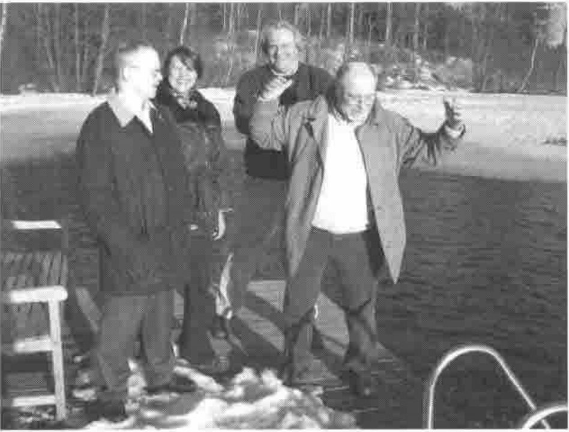

*reported by Jouko Kangasniemi*
{ .byline }

The 8th annual Finnish Forest APL seminar took place on 18.3.2004-19.3.2004 at the Vanajanlinna castle. The distance from Helsinki is almost 100 km. There were 35 participants this year. The guest speaker was David Liebtag, one of the main developers of IBM APL2.

The seminar was held at the Ratsula-house (stables in English), which is 500 metres from the main building. All the hotel rooms close to the venue were occupied by the participants, so we got our own APL-privacy without any disturbances by the (real) outside world. These are my notes of the event.

**Olli Palosaari, Eija Ahopelto, Kimmo Kekäläinen and David Liebtag get close to water**

The seminar was started at 09:15 by Antti Korpela, the president of the Finnish APL association. The welcome coffee was a bit late, but we all got it nearly in time. Veli-Matti Jantunen from Statistics Finland was the first speaker. He educated the crowd in how to handle (extremely) big text files with Dyalog APL. The presentation was informative and colourful, as always. Personally I have not even dreamt of handling files whose size can be over 10 megabytes, but the treatment was relatively easy with VM’s tools. Veli-Matti’s current challenge is to tackle gigabyte-size files.

Olli Palosaari shed light on the APL-history of the Employers’ Confederation of Service Industries from the 1980s to today. The mainframe has been replaced with workstation Dyalog APL within that time. Wage statistics, business surveys and member registers are being treated with APL tools.

David Liebtag presented the wonders of modern APL2 in the Windows environment. Mainframe APL is familiar to many of us, but today’s APL2 was distant to most of the audience. The modern windows development system seems to be as good as the others. Several auxiliary processors and good connections to other programming tools gave the impression, that I could solve my programming problems with APL2 also.

**Lunch time.** Yam! After lunch was the presentation of the history of the Vanajanlinna castle. It was originally built as a hunting cottage nearly 100 years ago for a well off Finn called Carl Wilhelm Rosenlew. Then it was owned by a German industrialist for a short period of time. After the second world war it was a training facility for communists. It went bankrupt quickly after the Soviet Union collapsed, and now the castle is owned by the city of Hämeenlinna. It is a very popular place for meetings and seminars, and they are now building a golf course which makes it even more popular.

Göran Koreneff from VTT Technical Research Centre of Finland introduced the wonders of electricity markets, the prices and the volumes. He has built an application that can model and handle data even by the hour. Dyalog APL and Causeway tools were used. Lots of Rainpro-graphs.

Reima Naumanen showed how they have boosted the Dyalog APL session at MT-palvelut. The first thing to do when starting the development environment is to load some tools to session. There Reima then has the utilities for small and even bigger tasks. Workspace comparison and tracking of changes was swift. And with added namespaces and the new stuff that comes with version 10, one must conclude that Dyalog APL can be a very effective development environment. Reima mentioned that he uses an additional monitor simultaneously with his laptop, which I also had to try at home, and now I have double as much screen size as before.

Vanajanlinna’s seminar rooms have all wireless data networks, but Reima’s 30 metre long data cable made it unnecessary. You could read your email in every corner of the room with that, and it would have been possible also in the car park.

Markku Koskela from Dinosoft presented how to make dynamic web graphics with dotnet-tools. Dinosoft has managed to combine Causeway’s graphic tools with a statistics web tool called *PxWeb*. The application produced quality graphs swiftly. The engineering involved was a bit complex to me, because not only Dyalog APL but also Javascript and C# were used. We must return to this in further meetings.

Then was the time for the traditional sauna-seminar. And after that dinner. Then we went to the wine cellar, where we had some refreshments. Also singing and vivid conversation took place until it was (well past) time to go to bed.

Friday morning was the first real spring day, and the sun was shining brightly as ever. I dragged myself at 09:00 to the seminar room and showed how to calculate the probability of a downturn. There Dyalog APL churns some Markov processes and Bayesian probabilities.

Antero Ranne from Ilmarinen Mutual Pension Insurance Company presented the investment optimization model of a pension fund. The aim is to find the best portfolio with the desired risk level. Bankruptcy is something one tries to avoid. Dyalog APL is used as a part of a large application. We saw some nice real time graphics at the time when calculation proceeded.

Ismo Risku and Peter Biström from the Finnish Centre for Pensions introduced us to new long term forecast model for pension expenditure. One could model the development of expenditure for years and years and… We also saw a population forecast model done with Dyalog APL.

Hannu Virtanen from Tietoenator showed the web services interface to Eportti-portal. Hannu claimed that the technique is simple and “low tech”. Somehow I am not going to try it right away, because I still have some dark spots in my XML, SOAP, TCP/IP etc. knowledge. Good to know that all that can be done with Dyalog tools.

Then it was David again. He and his colleagues had been lately spending their time with a Java interface of APL2, and we got the honour to be one of the first ones to see it. At the beginning of his presentation David promised to make us all Java programmers in 5 minutes. I do not know if it is the teacher or the student to blame, but in my case I still need at least some extra minutes of education before starting my Java business. But anyhow, APL2 can talk Java and vice versa.

Then it was time for Antti Korpela’s closing remarks, which ended the seminar. The fellows from Tietoenator transported me all the way to my home stairs, which was very comfortable. A good seminar once again, and maybe I’ll be there again next year.
