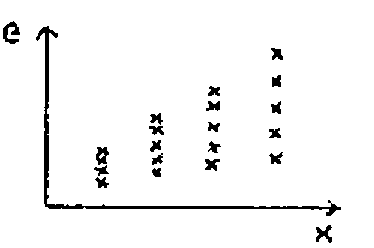
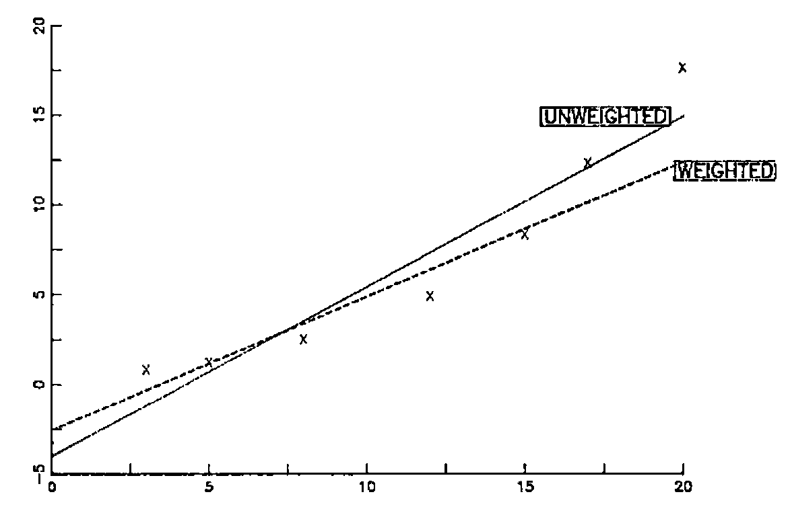
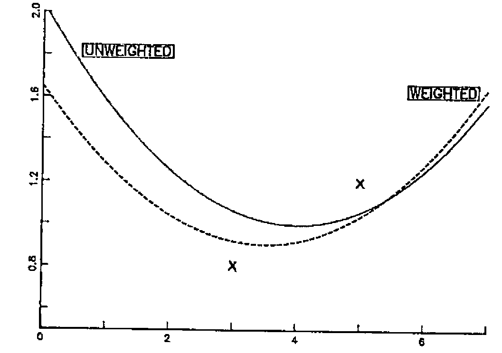

by Peter Kelly and Norman Thomson
{ .byline }

It is well known that the APL domino function includes a routine to obtain least squares fits of a straight line to a set of observations. Specifically, suppose that the model to be fitted to a set of multivariate data containing n observations is

y = b<sub>0</sub> + b<sub>1</sub>x<sub>1</sub> + b<sub>2</sub>x<sub>2</sub> + … b<sub>p</sub>x<sub>p</sub> + e

where the residuals e<sub>i</sub> (i = 1,2,…n) are assumed to be identically and independently distributed with an error variance which has to be estimated along with the b’s. Suppose further that the data is presented in the form of a matrix with n rows and (p+2) columns, the leftmost of which gives the y values, and the remainder the x-values, starting with a column of 1’s to correspond to the fitting of the constant term b<sub>0</sub>. The vector of regression coefficients is then given by :

```apl
BS : R[;1]⌹0 1↓R
```

and the residuals by

```apl
ES : R+.ׯ1,BS R
```

The error variance is given by

```apl
EVAR : (+/(ES R)*2)÷1+-/⍴R
```

and the variances of the b’s by

```apl
BVAR : 1 1⍉(EVAR R)×IMS R
```

where IMS stands for “Inverse Matrix Squared”, a function which as (X′X)<sup>-1</sup> occurs repeatedly in analysing residuals. It is defined as

```apl
IMS : ⌹(⍉X)+.×X←0 1↓R
```

In practice there are situations in which the assumptions that the residuals are identically distributed is not tenable, e.g. if the population is in fact several subpopulations whose residual variances are proportional to one of the x values, or if the residual variances corresponding to particular x values are known as the result of repeated experimentation, as might happen say in a physics experiment. The appropriate analysis is then <u>weighted</u> least squares. Assume that the variance corresponding to the ith. observation is w<sub>i</sub> times the error variance, where (w<sub>1</sub>, w<sub>2</sub>,… w<sub>n</sub>) are the items of a known vector W. The appropriate regression coefficients, error variance, and variances of the b’s are the BS, EVAR, and BVAR of the data matrix

```apl
(DIAG ÷W*.5)+.×R
```

where DIAG is a function which constructs a diagonal matrix with the weights w<sub>1</sub> … w<sub>n</sub> as the leading diagonal, e.g.

```apl
DIAG : ((2⍴⍴R)⍴R)×T∘.=T←⍳⍴R
```

To give a specific example, consider the data

| x : | 3 | 5 | 8 | 12 | 15 | 17 | 20 |
| --- | ---: | ---: | ---: | ---: | ---: | ---: | ---: |
| y : | 0.8 | 1.2 | 2.5 | 4.9 | 8.3 | 12.3 | 17.6 |

as a candidate for a least squares fit

y = b<sub>0</sub> + b<sub>1</sub>x<sub>1</sub> + e

so that R is

```text
 0.8   1    3
 1.2   1    5
 2.5   1    8
 4.9   1   12
 8.3   1   15
12.3   1   17
17.6   1   20
```

The coefficients b<sub>0</sub> and b<sub>1</sub> are given by

```apl
      BS R
¯4.018 0.9466
```

If, however, there is evidence that the spread of the residuals increases with x so that a plot of e vs x has the appearance



then weighted least squares is appropriate. Assuming weights proportional to x gives a regression line y = -2.562 + 0.8192x. As the graph below shows the effect is to downgrade the importance of the last two points which are in the relatively more variable x region.



The more the weights are “strengthened”, e.g. by taking them to be the <u>squares</u> of the x values which gives y = -1.721 + 0.709 x, the more closely does the weighted squares line track the smaller value points.

If the model

y = b<sub>0</sub> + b<sub>1</sub>x<sub>1</sub> + b<sub>2</sub>x<sub>2</sub> + e

is chosen, i.e. the data matrix is changed to

```apl
R,R[;3]*2
```

the fitted quadratics are

y = 2.037 - 0.5199x + 0.06482x² (unweighted)

and

y = 1.649 - 0.4258x + 0.06066x² (weighted)

The effect of weighted least squares is to cause the regression parabola to approach closer to the lowest x-value point as the graph below illustrates.


