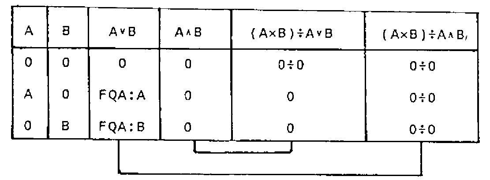

a survey by Joseph L.F. De Kerf
{ .byline }

## Abstract

A survey is given of symbolic logic and the algebra of propositions. It is shown how this algebra is implemented in APL 1 and may be simulated with the relational and maximum/minimum functions, the latter being especially useful for the manipulation of fuzzy sets. Implementations and standardisation of extended dyadic `∨` and `∧` in APL 2 - the gcd and lcm of the arguments - are discussed.

## Symbolic Logic and the Algebra of Propositions - A Survey

In symbolic logic and the algebra of propositions, propositions are generally represented by letters - for instance P, Q, R, etc. If a proposition is true, it’s given the value 1 (or T for TRUE), and if the proposition is false, it’s given the value 0 (or F for FALSE). From any proposition, or set of propositions, other propositions may be formed. Let us define the following basic functions:

(1) The Negation (NOT)

:   The negation of the proposition P is the proposition ~P, being false when P is true, and being true when P is false.

    Other notations are e.g.: P′ P\* ¬P

(2) The Disjunction (OR)

:   The disjunction of the propositions P and Q is the composite proposition P∨Q, which is true when P or Q or both P and Q are true, and which is false when P and Q are false.

    Other notations are e.g.: P∪Q P+Q

(3) The Conjunction (AND)

:   The conjunction of the propositions P and Q is the composite proposition P∧Q, which is true when both P and Q are true, and which is false when P or Q or both P and Q are false.

    Other notations are e.g.: P∩Q P&Q P×Q

As P∨Q is true when both P and Q are true, the disjunction is also called the inclusive disjunction.

| P | ~P |
|:-:|:-:|
| 1 | 0 |
| 0 | 1 |

| P | Q | P∨Q |
|:-:|:-:|:-:|
| 1 | 1 | 1 |
| 1 | 0 | 1 |
| 0 | 1 | 1 |
| 0 | 0 | 0 |

| P | Q | P∧Q |
|:-:|:-:|:-:|
| 1 | 1 | 1 |
| 1 | 0 | 0 |
| 0 | 1 | 0 |
| 0 | 0 | 0 |

*Table 1*
{ .caption }

Truth tables of the negation and of the disjunction ∨ and conjunction ∧ are given in Table 1. With these truth tables it may be shown that the functions defined, the disjunction ∨ and the conjunction ∧, satisfy the postulates of Huntington(1):

P1. The functions ∨ and ∧ are commutative:

```
P∨Q ↔ Q∨P
P∧Q ↔ Q∧P
```

P2. The values 0 and 1 are identity elements relative to the functions ∨ and ∧ respectively:

```
R∨0 ↔ 0∨R ↔ R
R∧1 ↔ 1∧R ↔ R
```

P3. Each function ∨ and ∧ is distributive over the other:

```
P∨(Q∧R) ↔ (P∨Q)∧(P∨Q)
(P∧Q)∨R ↔ (P∨R)∧(Q∨R)
P∧(Q∨R) ↔ (P∧Q)∨(P∧R)
(P∨Q)∧R ↔ (P∧R)∨(Q∧R)
```

P4. The negation satisfies the identities:

```
R∨(~R) ↔ (~R)∨R ↔ 1
R∧(~R) ↔ (~R)∧R ↔ 0
```

This means that the algebraic structure {0,1},∨,∧ is a boolean algebra (2), whereby:

- the disjunction ∨ is the boolean addition;
- the conjunction ∧ is the boolean multiplication;
- 0 and 1 are the identity elements versus the boolean addition and multiplication respectively;
- and the negation ~ is the boolean complementation.

The algebraic structure {0,1},∨,∧ being a boolean algebra, the following identities may be derived from the postulates:

```
T1. R∨R ↔ R  and  R∧R ↔ R
T2. R∨1 ↔ 1∨R ↔ 1  and  R∧0 ↔ 0∧R ↔ 0
T3. P∨(P∧Q) ↔ (P∧Q)∨P ↔ P  and  P∧(P∨Q) ↔ (P∨Q)∧P ↔ P
T4. P∨(Q∨R) ↔ (P∨Q)∨R  and  P∧(Q∧R) ↔ (P∧Q)∧R
T5. ~(~R) ↔ R
T6. ~(P∨Q) ↔ (~P)∧(~Q)  and  ~(P∧Q) ↔ (~P)∨(~Q)
```

Of course these identities may be derived directly from the truth tables. Deriving the identities from the postulates, however, proves that those identities are valid for every boolean algebra.

## The Complete Set of Dyadic Logical Functions

Fundamentally, `2*2*2` or 16 dyadic logical functions may be defined. Truth tables of these 16 dyadic logical functions F1…F16 are given in Table 2.

| P | Q | 1 | 2 | 3 | 4 | 5 | 6 | 7 | 8 | 9 | 10 | 11 | 12 | 13 | 14 | 15 | 16 |
|:-:|:-:|:-:|:-:|:-:|:-:|:-:|:-:|:-:|:-:|:-:|:-:|:-:|:-:|:-:|:-:|:-:|:-:|
| 1 | 1 | 1 | 1 | 1 | 1 | 1 | 1 | 1 | 1 | 0 | 0 | 0 | 0 | 0 | 0 | 0 | 0 |
| 1 | 0 | 1 | 1 | 1 | 1 | 0 | 0 | 0 | 0 | 1 | 1 | 1 | 1 | 0 | 0 | 0 | 0 |
| 0 | 1 | 1 | 1 | 0 | 0 | 1 | 1 | 0 | 0 | 1 | 1 | 0 | 0 | 1 | 1 | 0 | 0 |
| 0 | 0 | 1 | 0 | 1 | 0 | 1 | 0 | 1 | 0 | 1 | 0 | 1 | 0 | 1 | 0 | 1 | 0 |

*Table 2*
{ .caption }

F1 and F16 are trivial in that they have no dependence on the arguments P and Q: F1↔1 and F16↔0. F4 and F6, and F11 and F13 are special cases since they depend on only one of the arguments. F4 and F6 return P and Q respectively. F11 and F13 return ~Q and ~P respectively, and as such define the negation ~ of one of the arguments - which actually is a monadic function.

From the 10 remaining nontrivial dyadic functions, the definition of two of them - the disjunction F2 and the conjunction F8 - has been given in the previous section. The 8 remaining nontrivial dyadic functions may be defined as follows:

(4) The Non-Disjunction (NOR) - F15

:   The non disjunction P⍱Q of the propositions P and Q is the negation ~ of the disjunction P∨Q. The composite proposition is true when both P and Q are false, and is false when P or Q or both P and Q are true.

    P⍱Q ↔ ~(P∨Q) ↔ (~P)∧(~Q)

    Other notations are e.g.: P⋀Q P∩Q P|Q P↑Q P↓Q

(5) The Non-Conjunction (NAND) - F9

:   The non-conjunction P⍲Q of the propositions P and Q is the negation ~ of the conjunction P∧Q. The composite proposition is true when P or Q or both P and Q are false, and is false when both P and Q are true.

    P⍲Q ↔ ~(P∧Q) ↔ (~P)∨(~Q)

    Other notations are e.g.: P↑Q P↓Q

(6) The Implication or Conditional - F5

:   The implication P⊃Q is the composite proposition which is false when and only when P is true and Q is false.

    P⊃Q ↔ (~P)∨Q ↔ ~(P∧(~Q))

    Other notations are e.g: P→Q P0Q

(7) The Non-Implication - F12

:   The non-implication P⊅Q is the negation ~ of the implication P⊃Q (P⊅Q ↔ ~(P⊃Q)). The composite proposition is true when and only when P is true and Q is false.

    P⊅Q ↔ P∧(~Q) ↔ ~((~P)∨Q)

(8) The Inclusion or Converse Implication - F3

:   The inclusion P⊂Q is the composite proposition which is false when and only when P is false and Q is true.

    P⊂Q ↔ P∨(~Q) ↔ ~((~P)∧Q)

    Other notations are e.g.: P←Q P>Q

(9) The Non-Inclusion - F14

:   The non-inclusion P⊄Q is the negation ~ of the inclusion P⊂Q (P⊄Q ← ~(P⊂Q)). The composite proposition is true when and only when P is false and Q is true.

    P⊄Q ↔ (~P)∧Q ↔ ~(P∨(~Q))

(10) The Equivalence or Biconditional - F7

:   The equivalence P≡Q of the propositions P and Q is the composite proposition which is true when and only when both P and Q are true or both P and Q are false.

    ```
    P≡Q ↔ (P∧Q)∨((~P)∧(~Q))
          (P∧Q)∨(~(P∨Q))
          (P∧Q)∨(P⍱Q)
          (P∨(~Q))∧((~P)∨Q)
    ```

    Other notations are e.g.: P↔Q PϕQ P∇Q

(11) The Non-Equivalence or Exclusive Disjunction - F10

:   The non-equivalence P≢Q of the propositions P and Q is the negation ~ of the equivalence P≡Q (P≢Q ↔ ~(P≡Q)). The composite proposition is true when and only when P is true and Q is false or P is false and Q is true.

    ```
    P≢Q ↔ (P∨Q)∧((~P)∨(~Q))
          (P∨Q)∧(~(P∧Q))
          (P∨Q)∧(P⍲Q)
          (P∧(~Q))∨((~P)∧Q)
    ```

    Other notations are e.g.: P⊻Q P±Q PΔQ

As the equivalence P≡Q is the conjunction ∧ of the conditionals P⊃Q and P⊂Q, it is also called the biconditional. As the non-equivalence PQ is true when P or Q are true, but is false when both P and Q are true, it is also called the exclusive disjunction (this in contrast with the inclusive disjunction P∨Q).

A set of functions is called functionally complete provided every propositional function can be expressed in terms of the functions in the set. As shown above, the set {∨,∧,~} is functionally complete. As however, the conjunction ∧ may be expressed in terms of the negation ~ and the disjunction ∨, and the disjunction ∨ may be expressed in terms of the negation ~ and the conjunction ∧, the sets {∨,~} and {∧,~} are also functionally complete:

```
P∧Q ↔ ~((~P)∨(~Q))
P∨Q ↔ ~((~P)∧(~Q))
```

| NOT |
|:-:|
| ~1 ↔ 0 |
| ~0 ↔ 1 |

| P | Q | OR P∨Q | AND P∧Q | NOR P⍱Q | NAND P⍲Q |
|:-:|:-:|:-:|:-:|:-:|:-:|
| 1 | 1 | 1 | 1 | 0 | 0 |
| 1 | 0 | 1 | 0 | 0 | 1 |
| 0 | 1 | 1 | 0 | 0 | 1 |
| 0 | 0 | 0 | 0 | 1 | 1 |

*Table 3*
{ .caption }

Finally, the negation ~, the disjunction ∨, and the conjunction ∧ may be expressed each in terms of the non-disjunction ⍱ only, or in terms of the non-conjunction ⍲ only. This means that the functions ⍱ and ⍲ are both functionally complete:

```
 ~P ↔ P⍱P                 AND      ~P ↔ P⍲P
P∨Q ↔ (P⍱Q)⍱(P⍱Q)                 P∨Q ↔ (P⍲P)⍲(Q⍲?∧
P∧Q ↔ (P⍱P)⍱(Q⍱Q)                 P∧Q ↔ (P⍲Q)⍲(P⍲?∧
```

The non-disjunction ⍱ and non-conjunction ⍲ are generally called the Pierce Stroke Function (3) and the Sheffer Stroke Function (4) respectively. They are especially useful for the design of logical circuits in which only one type of gates is to be used (05).

## Logical Functions and APL 1 (ISO APL)

The initial implementation of the Iverson notation at IBM in 1965 only supported the negation ~ the disjunction ∨ and the conjunction ∧.

It did not include the nor ⍱ and the nand ⍲ functions. E.E.McDonnell reports that the introduction was suggested by Peter Calingaert, then at Science Research Associates in Chicago, sometime in 1967 (7).

Finally, the following logical functions were implemented in APL\360-1968 (8) and its successors APLSV-1973 and VS APL-1975 (9): the monadic ~ and the dyadic ∨ ∧ ⍱ ⍲.

The functions are respectively called the NOT-OR-AND-NOR-NAND and are defined through their truth tables as shown in the adapted Table 3. It should be noted that in the ISO-APL Second Draft Proposal DIS8485 (10), the same names are given and that the funtions are informally defined as boolean instead of logical:

NOT ………………… as the “boolean complement”<br>
OR ………………… as the “boolean sum”<br>
AND ………………… as the “boolean product”<br>
NOR ………………… as the “boolean complement of the boolean sum”<br>
NAND ………………… as the “boolean complement of the boolean product”

| | | | |
|---|:-:|:-:|:-:|
| Negation | `~P` | `P=0` | `1-P` |
| Disjunction | `P∨Q` | `P≥Q=0` | `P⌈Q` |
| Conjunction | `P∧Q` | `P>Q=0` | `P⌊Q` |
| Non-Disjunction | `P⍱Q` | `P=0` | `1-P⌈Q` |
| Non-Conjunction | `P⍲Q` | `P≤Q=0` | `1-P⌊Q` |
| Implication | `Q∨~P` | `P≤Q` | `Q⌈1-P` |
| Non-Implication | `P∧~Q` | `P>Q` | `P⌊1-Q` |
| Inclusion | `P∨~Q` | `P≥Q` | `P⌈1-Q` |
| Non-Inclusion | `Q∧~P` | `P<Q` | `Q⌊1-P` |
| Equivalence | `(P∧Q)∨P⍱Q` | `P=Q` | `(P⌊Q)⌈1-P⌈Q` |
| Non-Equivalence | `(P∨Q)∧P⍲Q` | `P≠Q` | `(P⌈Q)⌊1-P⌊Q` |

*Table 4*
{ .caption }

As shown in Table 4, the logical functions may be simulated by the relational functions `< ≤ = > ≥ ≠` as well as by the combination of the minus function (`-`) with the maximum and minimum functions (`⌈` and `⌊`).

Column 1 gives the logical expressions as derived under Sections 1 and 2. Column 2 gives the corresponding expressions based on the relational functions. It should be noted that the negations P=0 and Q=0 may be replaced by the negations P≠1 and Q≠1. An advantage of the logical expressions is that their domain is restricted to the near-boolean integer arguments 0 and 1, while this is not the case for the expressions based on the relational functions.

Column 3 gives the expressions based on the combination of the minus function with the maximum and minimum functions. Here too, the domain of the arguments is not restricted to the near-boolean integers 0 and 1, but the advantage of these expressions is that they may be used e.g. for the manipulation of the characteristic or membership vectors `V` of fuzzy sets `FS` (11)(12):

- where the domain of the membership vectors is the interval [0,1];
- `V1⌈V2` gives the membership vector of the union `FS1∪FS2`;
- `V1⌊V2` gives the membership vector of the intersection `FS1∩FS2`;
- and `1-V` gives the membership vector of the complementation of `FS`.

| A | B | GCD |
|:-:|:-:|:-:|
| 1 | 1 | 1 |
| 1 | 0 | 1 |
| 0 | 1 | 1 |
| 0 | 0 | 0 |

| A | B | LCM |
|:-:|:-:|:-:|
| 1 | 1 | 1 |
| 1 | 0 | 0 |
| 0 | 1 | 0 |
| 0 | 0 | 0 |

*Table 5*
{ .caption }

As `0÷1 ↔ 0` and `0÷0 ↔ 1` and as far as the arguments are restricted to the near boolean integers 0 and 1, the negations `1-P` and `1-Q` may be replaced by the expressions `0÷P` and `0÷Q` in Column 3. However, this means that the expressions are no longer applicable for the manipulation of the characteristic or membership vectors of fuzzy sets.

Note: ……………… In fact, although different symbols are used, the maximum `⌈` and minimum `⌊` functions are consistent extensions of the logical disjunction ∨ and conjunction ∧ respectively.

## Dyadic ∨ and ∧ in APL2 (Extended APL)

The study of the greatest common divisor GCD and the least common multiple LCM constitutes an important subject of number theory.

They are generally represented by the notations:

- (A,B) for the greatest common divisor group GCD of A and B;
- [A,B] for the least common multiple LCM of A and B.

A number D is called a greatest common divisor GCD of the numbers A and B if D is a common divisor of A and B which is a multiple of every other common divisor C:

```
D|A   D|B   C|A and C|B   imply C|D
```

A number M is called a least common multiple LCM of the numbers A and B if M is a common multiple of A and B which is a divisor of every other common multiple C:

```
A|M   B|M   A|C and B|C   imply M|C
```

Here `A|B` means that B is divisible by A, such that is there is some integer X such that `A×X↔B`. We call B a multiple of A, and A a divisor of B.

The numbers D and M are not unique. In the real number domain both definitions determine two numbers which are each others additional inverse. In the complex number domain both definitions determine four numbers with the same modulus or absolute value and which are mutually associated. To remove this multiplicity, the greatest common divisor GCD may be restricted to the first-quadrant-associate, and the least common multiple LCM may be restricted to the corresponding associate which satisfies the identity:

```
A×B ↔ (A,B)×[A,B]
```

Several authors, such as G. Birkhoff and S. Mac Lane (13) and W. Greub (14), have proposed to denote the greatest common divisor GCD and the least common multiple LCM by the notations A∨B and A∧B. The motivation is that their algebra is a boolean algebra and is a consistent extension of the proposition algebra.

Indeed, let `S ↔ {0,1}`. Based on the above given definitions and conventions, it may be shown that the composition tables of the greatest common divisor GCD or A∨B and the least common multiple LCM or A∧B of the elements of S are identical with the truth tables of the disjunction ∨ and the conjunction ∧ respectively (Table 5).

As an illustration of the extension, let `N` be a non-negative integer (e.g. 30) and `S` the set of non-negative integer divisors of `N` {1,2,3,5,6,10,15,30}. It may be shown that the greatest common divisor GCD or A∨B and the least common multiple LCM or A∧B of the elements of `S` satisfy the above mentioned postulates of Huntington. As a consequence, the algebraic structure `S,∨,∧` is a boolean algebra, whereby:

- the greatest common divisor A∨B is the boolean sum;
- the least common multiple A∧B is the boolean product;
- `N` and 1 are the identity elements versus the boolean addition and boolean multiplication respectively;
- and `N÷C` is the boolean complementation of `C`.

In fact G. Birkhoff and S. Mac Lane proposed the notations `(A,B) ↔ A∧B` and `[A,B] ↔ A∨B`, while W. Greub proposed the notations `(A,B) ↔ A∨B` and `[A,B] ↔ A∧B`. It’s true that the functions ∨ and ∧ satisfy the duality law, but to preserve the above described consistency with the algebra of propositions, the definitions `(A,B) ↔ A∨B` and `[A,B] ↔ A∧B` may not be interchanged: the greatest common divisor is an extension of the disjunction ∨ and the least common multiple is an extension of the conjunction ∧.

In a presentation at the Working Conference on Mechanical Language Structures, Princeton, New Jersey, August 1963, K.E. Iverson (15) proposed to add `A⌊B ↔ (A,B)` and `A⌈B ↔ [A,B]` to his notation. At APL 75 E.E. McDonnell, then at IBM in Palo Alto, now with I.P. Sharp Associates, proposed to use the notations `A∨B ↔ (A,B)` and `A∧B ↔ [A,B]` in APL. The mathematics behind the proposal are thoroughly discussed in the paper and - though couched in terms of integral arguments - the extension to real and complex arguments is easy. The extension - as formulated by E.E. McDonnell - has been included in Iverson’s Dictionary of APL (17).

The proposed extension `A∨B ↔ (A,B)` and `A∧B ↔ [A,B]` has been implemented in SHARP APL (IPSA) (18). The implementation has not been retained in the commercial versions of APL2, but has been implemented recently in APL90 (19). It has been included in the list of topics to be explored by the ISO APL Working Group in their preparation of Extended APL (20) and a text to be used for further examination has been edited by E.E. McDonnell (21).

Extensions of APL and their standardisation are very important for the future of the language. Some authors insist - and with justice - on keeping them clear and plain. The proposed extension satisfies these requirements. If APL is to maintain this prestige as a better mathematical notation and as the ideal programming tool to support the teaching of mathematics, the proposed extension must be incorporated in the so-called Extended APL.



*Table 6*
{ .caption }

Note: ……………… In his paper presented at APL 75, E.E. McDonnell claims “…that the value of `0÷0` in APL should be 0 (not 1 as currently the case)”. The proposal was further elaborated by the author in a paper presented at APL 76 (22). Arguments pleading in favour of keeping the value of `0÷0` as 1 in APL were given at APL80 (23).

From the identity `A×B ↔ (A∨B)÷A∧B` we may derive the formulas

- if `A∨B` is different from 0: `A∧B ↔ (A×B)÷A∨B`;
- if `A∧B` is different from 0: `A∨B ↔ (A×B)÷A∧B`.

The question arises if those formulas are still valid when `A∨B` or `A∧B` or both `A∨B` and `A∧B` are 0 (Table 6).

If `A` and `B` are 0, both `A∨B` and `A∧B` are 0. Both formulas reduce to the form `0÷0` and give `1`. This suggests indeed that `0÷0` should be set to 0 instead of `A`.

If `A` and `B` are 0, but not both, `A∨B` is the first-quadrant-associate of the non-zero argument and `A∧B` is 0. The first formula gives the correct result 0, but the second formula reduces to the form `0÷0` and gives 1, while it should give the first-quadrant-associate of the non-zero argument. This suggests that `0÷0` should be set neither to 0 nor to 1, but that it must be possible to assign it the appropriate value.

The real problem is indeed that `0÷0` is undefined and that APL should give a `DOMAIN ERROR` to be consistent with our mathematics. If the APL implementation supports event handling, the user may trap the error message and assign `0÷0` its appropriate value e.g. with a system function like the IBM APL `⎕EA` (Execute Alternate). A more acceptable solution however may be to implement a system variable which implicitly sets the current value of `0÷0` (such as `⎕DIV` - the default value being 1).

## Further Extensions

ISO APL only supports the monadic form of the tilde function, the boolean complement `~B`. Several implementations, however, support the dyadic form `A~B`, the set difference of sets `A` and `B`, which in Iverson’s APL Dictionary is called “less”. It has been included in the list of topics to be explored by the ISO APL Working Group in their preparation of Extended APL and a text to be used by this APL Working Group for further examination has been edited by E.E. McDonnell (24). Set Functions and APL are discussed in a paper to be published in one of the next issues of the APL-CAM Journal (25).

So far, there are no proposals for the extension of the dyadic logical functions `A⍱B` and `A⍲B`, nor for the monadic use of the dyadic logical functions (`∨B ∧B ⍱B ⍲B`). Perhaps inspiration may be found in the fact that some authors use the symbols ∨ and ∧ for the logical existential qualifier ∃ and the universal qualifier ∀ respectively.

## References

1. E.V. Huntington; The Algebra of Logic;<br>Transactions of the American Mathematical Society, Vol. 5, 1904; pp. 288-309.
2. J.E. Whitesitt; Boolean Algebra and its Applications;<br>Addison-Wesley Series in the Engineering Sciences; Addison Wesley Publishing Company, Reading, Massachusetts, 1961
3. C.S. Pierce; On the Algebra of Logic<br>Chapter 1: Syllogistic<br>Chapter 2: The logic of non-relative terms<br>Chapter 3: The logic of relatives;<br>American Journal of Mathematics, Vol.3, 1880, pp. 15-57
4. H.M. Sheffer; A Set of Five Independent Postulates For Boolean Algebra - With Applications to Logic Constants;<br>Transactions of the American Mathematical Society, Vol. 14, 1913; pp. 481-488.
5. D.Zissos; Logic Design Algorithms;<br>Harwell Series: Oxford University Press, London, Great Britain, 1972.
6. A Abian; Boolean Rings;<br>Branden Press Publishers, Boston, Massachusetts, 1976
7. E.E. McDonnell; The Caret and the Stick Functions;<br>APL Quote Quad, Vol. 8, No. 4, June 1978, pp. 35-39
8. A.D. Falkoff and K.E. Iverson; APL 360\User’s Manual;<br>Program Numbers 5734-XM1 and 5736-XXM1; Form No. GH20-0683-0; IBM Corporation, Technical Publications Department, White Plains, New York, September 1969.
9. A.D. Falkoff and K.E.Iverson; APL Language;<br>Form No. GC26-3847-0; IBM Corporation, Programming Publishing, San Jose, California, March 1975.
10. Second Draft Proposal for Programming Language APL - DIS 84-85;<br>Edited by L.A. Morrow; Document Number ISO/TC97/SC22/WG3/N55; AFNOR, Secretariat ISO/TC97/SC22/WG3, Paris, France, 25 February 1986.
11. L.A.Zadeh; Fuzzy Sets; Information and Control,<br>Vol. 8, No.3, June 1965, pp. 338-353.
12. H.J. Zimmerman; Fuzzy Set Theory - and Its Applications;<br>International Series in Management Science and Operations Research; Kluwer-Nijhoff Publishing, Hingham, Massachusetts, 1985.
13. G. Birkoff and S. Mac Lane; A Survey of Modern Algebra (3rd Edition);<br>The Macmillan Company, New York, 1965
14. W.Greub; Linear Algebra (Fourth Edition);<br>Graduate Texts in Mathematics, Vol. 23; Springer-Verlag, Berlin-Heidelberg-New York, 1976.
15. K.E.Iverson; Formalism in Programming Languages;<br>Communications of the ACM, Vol. 7, No2, February 1964, pp. 80-88.<br>Reprint; A Source Book in APL; Edited by E.E. McDonnell; APL Press, Palo Alto, California, 1981; pp. 17-25.
16. E.E. McDonnell; A notation for the GCD and LCM Functions;<br>APL 75 Congress Proceedings, University of Pisa, Italy, 11-13 June 1975; Edited by P.S. Abrams, G.H. Foster, H.R. Haegi, and S. Trumpy; Association for Computing Machinery ACM, New York, 1975; pp.240-243.
17. K.E.Iverson; A Dictionary of APL;<br>I.P. Sharp Associates, Toronto, Canada, March 1987. Revised Edition; APL Quote Quad, Vol. 18, No.1, September 1987, pp. 5-40.
18. P. Berry; Greatest Common Divisor and Least Common Multiple now available as primitive functions;<br>The I.P. Sharp Newsletter, Vol.9, No.1, January/February 1981, Technical Supplement 30, pp. T1-T4.
19. J.J. Girardot et P.B. Amade; APL90; Journees d’Etude “L’Univers d’APL2”, Paris, France, 28-29 Janvier 1988, Association Francaise pour la Cybernetique Economique et Technique AFCET, Paris, France, 1988; pp. 54-70. Reprint: APL-CAM Journal, Vol. 10, No. 2, 16 April 1988, pp. 338-353
20. Draft Minutes of ISO-APL Working Group Meeting held at Mobil Research & Development, Farmer’s Branch, Texas, 5-7 May 1987; Edited by E.E. McDonnell; Document ISO/TC97/SC22/WG3 N106 (20 May 1987).
21. Or/GCD and And/CM (Proposal for Extended APL) Edited by E.E. McDonnell; Document ISO/TC97/SC22/WG3 N108 (1 August 1987).
22. E.E. McDonnell; Zero Divided by Zero;<br>APL 76 Conference Proceedings, Ottawa, Canada, 22-24 September 1976; Edited by G.T. Hunter; Association for Computing Machinery ACM, New York, 1976; pp. 295-296.
23. J.L.F. De Kerf; The Story of `0÷0`;<br>APL80 International Conference on APL, Noordwijkerhout, The Netherlands, 24-26 June 1980; Edited by G.A. van der Linden; North-Holland Publishing Company, Amsterdam, The Netherlands, 1980; pp. 133-135.
24. Without (Proposal for Extended APL);<br>Edited by E.E. McDonnell; Document ISO/TC97/SC22/WG3 N107 (23 June 1987).
25. J.L.F. De Kerf; Set Functions and APL;<br>In Preparation - to be published in the APL CAM Journal.
26. P.Lorenzen; Formale Logik; Sammlung Goschen Band 1176/1176a;<br>Walter De Gruyter & Co., Berlin, 1962.
