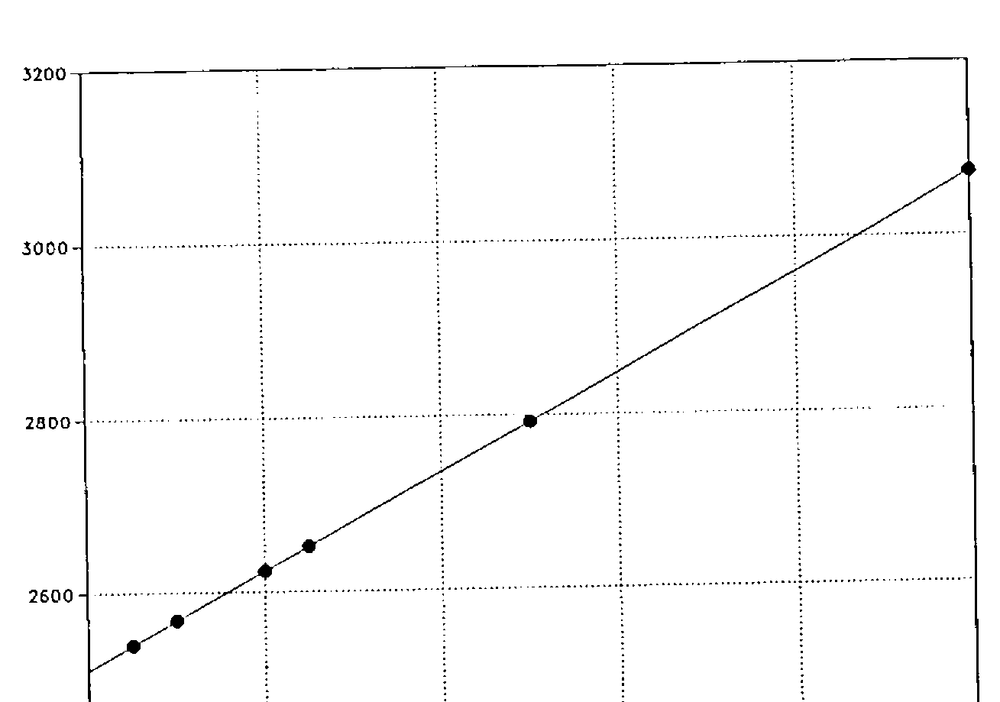
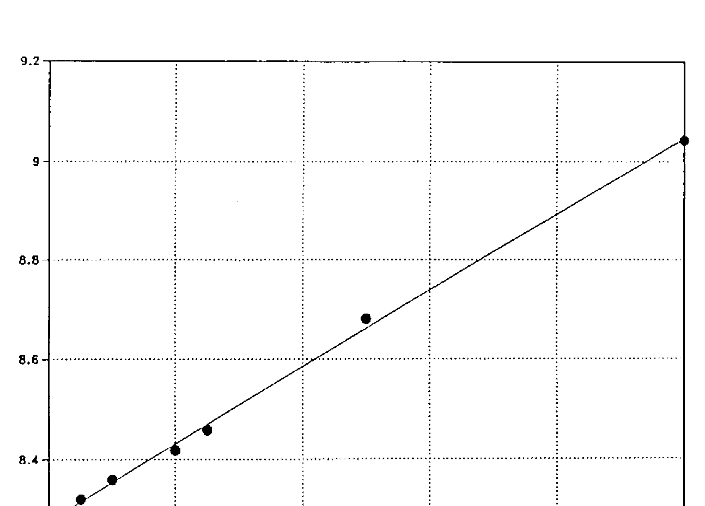

by Joseph L.F. De Kerf
{ .byline }

## Abstract

Some details and commentaries are given about the use of the semi-colon character, mixed output, the diamond statement separator, and the functions lev and dex. It is claimed that Extended APL, the new ISO APL Standard under development, should include the diamond statement separator.

## The Semicolon Character (;)

The APL character set may be subdivided into the following four sub-sets:

- the alphabetic characters;
- the numeric characters;
- the special characters;
- and the blank character.

Most of the special characters are used to represent the primitive functions and operators. Some of them however are used for other purposes such as punctuation and as delimiters/separators. One of them is the semicolon, which is used:

- as a separator for heterogeneous or mixed output. A sequence of expressions separated by semicolons is evaluated from right to left and the values of those expressions are displayed from left to right, e.g.:

    ```apl
          X←2
          Y←3
          'THE SUM OF X AND Y IS ';X+Y
    THE SUM OF X AND Y IS 5
    ```

- as a separator for bracket indexing of higher rank arrays (e.g. `A[I;J]`, `A[I;J;K]`, etc.) and as a separator for specifying subarrays when using the bracket axis operator (e.g. `Z←F[KZ;KB]B` and `Z←AF[KZ;KA;KB]B`). The bracket axis operator is only supported in APL2 IUP (IBM). The facility is not supported, either in APL2 PP (IBM), or in any other commercial implementation of APL.

- as a separator in the list of local variables in the header of a defined function or operator (`∇-----;L1;L2;L3;...`). In APL2 IUP & PP (IBM), separating local names by semicolons is optional on input, but on display the semicolons are always included in the operation header.

- with the dyadic format system function `⎕FMT`, as a separator in the right argument list of expressions to be formatted:

    ```apl
    Z←A ⎕FMT B OR
    Z←A ⎕FMT (B1;B2;B3;...)
    ```

- with the APL.68000 (TCC - MicroAPL) string search and replacement system function `⎕SS`, as a separator in the right argument list specifying the target string, the substring(s) to be searched, and eventually the replacement substring(s):

    ```apl
    Z←⎕SS (STR;SUB)
    Z←⎕SS (STR;(SUB1;SUB2;...;SUBN))
    Z←⎕SS (STR;SUB;REP)
    Z←⎕SS (STR;(SUB1;SUB2;...;SUBN);REP)
    Z←⎕SS (STR;(SUB1;SUB2;...;SUBN);(REP1;REP2;...REPN))
    ```

    a similar mechanism is used with the text editing system function `⎕TE` in Xerox APL (Atkins) and 0S4000 APL (GEC).

- with the nested arrays implementation of AOS/VS APL (Data General), as a separator in list notation, a shorthand for catenation of two or more enclosed arrays:

    ```apl
    (A;B;C;...;Z) ↔ (<A),(<B),(<C),...,(<Z)
    ```

Note: In APL90 (SYNC), the underscored semicolon (;̲) may be used with mixed output, suppressing the display of the result of the right hand adjacent expression.

## Mixed Output

Heterogeneous or mixed output was introduced in APL\\360 [1] to allow the mixture of character and numeric output on a single line. Expressions are separated by semicolons. As stated above, the sequence of expressions is evaluated from right to left and the values of these expressions are displayed from left to right. Each value separated by semicolons is displayed - even if the expression is an assignment. Arrays of rank two and greater however are displayed on separate lines.

```apl
      A←20
      'THE VALUE OF A IS';A
THE VALUE OF A IS 20

      A←2 3⍴⍳6
      'THE VALUE OF A IS';A
THE VALUE OF A IS
1 2 3
4 5 6
```

Mixed output of course does not produce a single array as a result: the output cannot be assigned to a variable and cannot be used as the argument to a function or an operator.

In 1970, A.L. Anger [2] recommended adopting a character-conversion function - possibly monadic ▯ - which would produce a character array identical in displayed appearance to the numerical argument. Such a primitive function was implemented, originally as the monadic enquote ⊤, later on as the now well-known monadic format ⍕.

Combination of catenation and this monadic format, is much more powerful than mixed output [3]. Results to be displayed are combined into a single character array. In addition, character arrays and formatted numeric arrays of higher rank may be displayed side by side.

```apl
      A←20
      'THE VALUE OF A IS ',⍕A
THE VALUE OF A IS 20

      A←2 3⍴⍳6
      (2 18⍴36↑'THE VALUE OF A IS'),⍕A
THE VALUE OF A IS 1 2 3
                  4 5 6
```

The use of catenation, combined with monadic format, may be more desirable and more powerful, but it is less handsome. In addition, the type of the numeric data is lost. In APL2-like implementations however - those which permit heterogeneous arrays - the results to be displayed, whatever their type or rank, may be juxtaposed as items of a heterogeneous nested vector. Vector notation may be used, and as such displaying even the most complicated configuration of results becomes very simple, preserving the type of the numeric results.

```apl
      A←20
      THE VALUE OF A IS' A
THE VALUE OF A IS 20

      A←2 3⍴⍳6
      THE VALUE OF A IS' A
THE VALUE OF A IS 1 2 3
                  4 5 6
```

Taking it all in all, mixed output is considered obsolete [4]. It was a convenience whose necessity has been outlived [5]. On the other hand, several rather recent implementations of APL still support mixed output. A list of more than fifty past and current implementations of APL, indicating whether mixed output is supported or not, is given in Appendix 1.

## The Diamond Separator (⋄)

Heterogeneous or mixed output is not a so-called “proper APL construction” [5]. In any case, it is not a statement separator:

- The sequence of expressions are evaluated from right to left;
- Results of rank zero or one are displayed side by side;
- All expressions listed must return a value;
- Some constructs like branching are not allowed.

An authentic statement separator, the diamond was introduced by the Scientific Time Sharing Corporation - now STSC - in its APL\*PLUS System in 1974 [6]. In execution mode as well as in a defined function or operator, statements normally listed from top to bottom may be written from left to right:

```
----------
STATEMENT1
STATEMENT2
STATEMENT3
----------

BECOMES FOR INSTANCE

--------------------------------
STATEMENT1⋄STATEMENT2⋄STATEMENT3
--------------------------------
```

The sequence of statements is executed from the leftmost statement to the rightmost. A branch within the line transfers control immediately. A conditional branch in a line to an empty vector however executes the next statement to the right in the same line, if there is one. If an error is encountered, the error report is displayed and execution is suspended in the usual way. Statements to the right of the statement in error are not executed. Execution can resume only at the leftmost statement in the line. A weak interrupt has an effect only between successive lines, not between statements in the same line.

In addition, within a defined function/operator, the following interpretations also apply [6]: the entire line has only a single line number; a label can only appear at the left end of the line; a branch to the line transfers control to the leftmost statement in the line. Tracing a compound statement displays the function/operator name, the line number, the value for the leftmost statement, and on separate lines, a diamond, some blanks, and the value for each subsequent statement on the same line. Finally, the comment feature is independent of the presence of diamond separators.

The diamond separator feature makes it easier to write more concise programs. Whether replacing a list of statements on successive lines by a one-line list of statements separated by the diamond improves readability, is open to discussion. In any case, “it reduces the temptation to write obscure statements just to reduce the number of function/operator lines”.

```apl
    I←0 ⋄ V←⍳1 ⋄ R←3 ⋄ J←¯1
```

is clearer than

```apl
    J←×-R←3,0⍴V←⍳~I←0
```

In addition, as a side effect, replacing a list of statements on successive lines by a one-line list of statements separated by the diamond may save memory space and CPU time [7].

IBM implementations of APL do not support the diamond separator. On the other hand, most other current implementations do support this feature. A list of more than twenty of them is given in Appendix 2. Results of a benchmark, showing that for the examples, memory space and CPU time is saved, are reported in Appendix 3.

## The Lev (⊣) and Dex (⊢) Functions

In a note published in 1981 in the Technical Supplement of the I.P.Sharp Newsletter [8], R. Bernecky and K.E.Iverson maintain that “a statement separator introduces a new syntactic element into APL” and that “the use of statement separators forces an order of reading and writing which is contrary to that used in APL expressions”. They conclude: “It is the opinion of the authors that the benefits of statement separators might be better achieved in other ways, such as introduction of a LEV function which returns its left argument. LEV, being a normal APL function, would lead to no new rules.”

But let’s go back in history. In a paper presented at a Working Conference on Mechanical Language Structure, Princeton, New Jersey, August 1963, K.E. Iverson [9] discussed the four boolean “unary” functions: `X⍺Y↔Y`, `X⍵Y↔Y`, `X⍺Y↔X`, and `X⍵Y↔Y` (x and y being the logical negation of x and y respectively). These functions however, were not implemented, either in APL\360, or in any of its successors.

Extending in 1972 P.S.Abrams’ notion of a selection operation [10], A.Hassitt and L.E.Lyon used the defined function `AFTER`, giving as explicit result the left argument [11]:

```apl
    ∇ Z←A AFTER B
[1] Z←A
    ∇
```

Possibly inspired by the application of this defined function, MCM Computers Limited implemented in 1974 in its MCM/70 APL [12] the dyadic primitive function `A∘B`, evaluating the right argument `B` and deferring the left argument `A`. The function serves to evaluate `A`, then ignore that result, and proceed to evaluate `B` [7].

As a side effect, the function may be used as a substitute for the diamond separator. The advantage is that - if this is an advantage - no new syntactic construct is needed. In contrast with the diamond separator however, the sequence of statements is executed from the rightmost statement to the leftmost, such that:

```
----------
STATEMENT1
STATEMENT2
STATEMENT3
----------

should be written ....

--------------------------------
STATEMENT3∘STATEMENT2∘STATEMENT1
--------------------------------
```

The one-line list of statements must be written and read from the right to the left, which is said to be the normal APL syntax, but if this is desirable with statement separation, is open to discussion.

In fact this dyadic primitive function `A∘B` is a forerunner of the dyadic lev and dex functions, the names being derived from the latin words “laevus” and “dexter”. The dyadic function lev `A⊣B` returns the left argument `A` and the dyadic function dex `A⊢B` returns the right argument `B` (lev and dex “commute”). Both functions were made available for SHARP APL (IPSA) in 1983 [13] and both functions are included in K.E. Iverson’s “APL Dictionary” - being called “left” and “right” respectively [14].

Motivations for including these functions are given in the dictionary and at a talk, presented by K.E. Iverson at APL87 [15]. As an example of the use of dyadic lev as a substitute for the diamond separator, either of the following expressions:

```apl
N←⍴R ⋄ B←N⍴2 ⋄ T←B⊤⍳×/B ⋄ S←(⍳1+N)∘.=+⌿T ⋄ P←R×.*T ⋄ C←S+.×P
C←S+.×P⊣P←R×.*T⊣S←(⍳1+N)∘.=+⌿T⊣T←B⊤⍳×/B⊣B←N⍴2⊣N←⍴R
```

will determine the coefficients of a polynomial equivalent to a polynomial with roots r, but where the second expression may be simplified (? - note of the author of this paper) to:

```apl
C←S+.×P⊣P←R×.*T⊣S←(⍳1+N)∘.=+⌿T←B⊤⍳×/B⊣B←N⍴2⊣N←⍴R
```

It is also shown how the lev function may be used to avoid parentheses, as for example in the expression:

```apl
S*.5⊣S←+/A*2      (or S←+/A*2 ⋄ S*.5 vs (+/A*2)*.5 - the author)
```

… which may be read “the square root of s, where s is the sum of the squares of a” (the symbol ⊣ being read as “where”). Whether such clever constructs avoiding the use of parentheses are really simplifications is doubtful. The author of this note for instance, is still asking himself “what’s wrong with parentheses?” As a matter of fact, in a lot of cases, the use of parentheses - even when not needed - is shorter and/or improves readability!

In the meantime, IBM implementations of APL do not support the lev and dex functions. Only SHARP APL (IPSA) and APL90 (SYNC) support them. Surprisingly, both implementations support the diamond separator as well.

## ISO APL and ISO Extended APL

ISO APL (DIS 8485) [16] does not include mixed output. In fact, this means that mixed output is a consistent extension. Indeed, a consistent extension is a facility not specified in the standard that, for a construct the standard specifies as producing an error, gives some effect other than signalling the specified error. This means too, that a conforming implementation may support mixed output. A conforming program however, shall not use consistent extensions, and as such may not use mixed output.

ISO APL (DIS 8485) [16] includes three optional facilities: the shared variable protocol, the statement separator facility, and trace and stop control. A conforming implementation may provide an optional facility, but if it does, the optional facility shall behave as specified by the standard. A conforming program may use an optional facility. The diamond separator, as described above, behaves as specified by the standard. Consequently, a conforming implementation may support and a conforming program may use this diamond separator.

In the meantime, the former ISO/TC97/SC22/WG3-APL, now ISO-IEC/JTC1/SC22/WG3-APL, is preparing the new standard Extended APL. At the La Hulpe Meeting (25-29 April 1988) [17], it was decided to make the diamond separator “a deprecated feature, with the intention of removing this facility from the standard in some future revision”. On the other hand, at the London Meeting (1-4 October 1988) [18], a proposal of E.E. McDonnell [19] for including the dyadic functions lev and dex (and the function identity - the monadic form of dex) has been endorsed.

We don’t discuss here the desirability of including the functions lev and dex in the new standard Extended APL. We only establish that more than twenty current implementations of APL support the diamond separator, while only two of them support the functions lev and dex. In addition, a lot of publications and software made available over the past ten to fifteen years make use of the diamond separator.

In a paper published in the SIGPLAN Notices, N.W.Rickert [20] proposes a very commendable set of guidelines for language standards committees:

1. Changes proposed by a standards committee should be evolutionary, not revolutionary.
2. The new standard must respect the philosophy and tradition of the language.
3. Changes in the language should reflect the needs of the users, rather than be changes imposed by the standards committee.
4. Standards must attempt to preserve the investment in existing software written in the language.
5. New standards should maintain as high a degree of compatibility as possible with previous standards.

Taking it all into account, we claim that ISO Extended APL should include the diamond statement separator.

## References

[1] A.D.Falkoff and K.E.Iverson;APL\360 User’s Manual;<br>Form GH20-0683-0;IBM Corporation,Technical Publications Department,White Plains,New York; September 1969.

[2] Arthur L.Anger;On Mixed Output; APL Quote Quad,Vol.2,No.3,23 September 1970,pp.18-19. See also APL Quote Quad: The Early Years; APL Press,Palo Alto,California,1982;pp.127-128.

[3] Raymond P. Polivka and Sandra Pakin;APL:The Language and Its Usage; Prentice-Hall Series in Automatic Computation; Prentice-Hall,Eaglewood Cliffs,New Jersey, 1975;pp.248-250.

[4] Paul Berry;SHARP APL Reference Manual;<br>I.P.Sharp Associates Limited,Toronto,Ontario,Canada,March 1979;pp.48-49.

[5] Jon Mcgrew;An Introduction to APL2;<br>Form SH20-9229-0;IBM Corporation,Programming Publishing,San Jose,California,August 1984;pp.254-255.

[6] H.A.Driscoll;A User’s Guide to Enhancements in the APL\*PLUS System; First Edition( + Supplements);Scientific Time Sharing Corporation,Bethesda,Maryland,December 1974.

[7] Garth H.Foster;What Lies Beyond the Branch Arrow?; APL75 Congress Proceedings,University of Pisa,Italy,1975;Edited by P.S.Abrams; Association for Computing Machinery,New York,New York,1975;pp.115-122.

[8] Robert Bernecky and Kenneth E.Iverson;Statement Separators;<br>I.P.Sharp Newsletter,Vol.9,No.5,September/October 1981 - Technical Supplement 34,pp.T4-T5.

[9] Kenneth E Iverson;Formalism in Programming Languages;<br>Communications of the ACM,Vol.7,No.2,February 1964,pp.80-88<br>See also:A Source Book in APL; APL Press,Palo Alto,California,1981;pp.17-25.

[10] Philip S Abrams;An APL Machine;<br>SU-SEL-70-017;Stanford University;Stanford Electronics Laboratories,Digital Systems Laboratory,Stanford,California,February 1970. Also available from the US Department of Commerce as Document AD-706-741.

[11] A.Hassitt and L.E.Lyon;Efficient Evaluation of Array Subscripts of Arrays; IBM Journal of Research and Development,Vol.16,No.1,Jan 1973,pp.45-57.

[12] MCM/70 User’s Guide;<br>Micro Computer Machines,Willowdale,Ontario,Canada,1974.

[13] Language Extensions of May 1983;SHARP APL Technical Note - SATN 45; I.P.Sharp Associates Limited,Toronto,Ontario,Canada,2 May 1983.

[14] Kenneth E.Iverson;A Dictionary of APL; Publ Code - 0402 8703 E 3;I.P.Sharp Associates Limited,Toronto,Ontario,Canada,March 1987(45 pages).<br>See also: APL Quote Quad,Vol.18,No.1,September 1987,pp.5-40.

[15] Kenneth E.Iverson;APL87;APL87 Conference Proceedings, Dallas,Texas,10-14 May 1987;Edited by John Aliburton;APL Quote Quad,Vol.17,No.4,June 1987,pp.64-68

[16] Second Draft Proposal ISO/DP8485-Programming Language APL; Document ISO/TC97/SC22/NO61 - May 1985(Prepared by ISO/TC97/SC22/WG3 - Edited by L.A.Morrow);ISO/TC97/SC22 Secretariat - Canada SCC; Circulated for voting by 15 July 1985.Reprint:BACUS Monograph 85001;Belgian APL-CAM Users Society BACUS,Duffel,Belgium,1 November 1985.

[17] Draft Minutes of ISO-APL Working Group Meeting held at IBM IEC, La Hulpe, Belgium, Monday-Friday, April 25-29,1988; Document ISO-IEC/JTC1/SC22/WG3/N172; E.E.McDonnell;13 May 1988.<br>See also:APL-CAM Journal,Vol.11,No.1,16 January 1989,pp.4-12.

[18] Draft Minutes of ISO-APL Working Group Meeting held at I.P.Sharp Assodiates Ltd, 10 Dean Farrar Street, London, SW1H 0DX, England, Saturday-Tuesday, October 1-4,1988; E.E.McDonnell;26 October 1988.<br>See also: APL-CAM Journal,Vol.11,No.1,16 January 1989,pp.30-39.

[19] Left,Right and Identity; Document ISO-IEC/JTC1/SC22/WG3/N202; Prepared by E.E.McDonnell;17 August 1988; Presented at the London ISO-APL Working Group Meeting, October 1988.

[20] Neil W.Rickert; The role of the language standards committee; SIGPLAN Notices,Vol.23,No.4,April 1988,pp.51-55<br>See also: Document ISO-IEC/JTC1/SC22/WG3/N174.

## Appendix 1

### List of APL Implementations versus Mixed Output

| Implementation | Mixed output | Vendor | Year |
|---|:-:|---|--:|
| APL\360 | + | International Business Machines IBM | 68 |
| APLSV | + | International Business Machines IBM | 73 |
| VS APL | + | International Business Machines IBM | 76 |
| 5100 APL | + | International Business Machines IBM | 75 |
| 5100/5120 APL | + | International Business Machines IBM | 77 |
| APL2 IUP | - | International Business Machines IBM | 82 |
| APL2 PP | - | International Business Machines IBM | 84 |
| APL PC/PS | - | International Business Machines IBM | 83 |
| APL2 PC/PS | - | International Business Machines IBM | 88 |
| Xerox APL | + | Atkins Computing Services Ltd | 76 |
| MAINSTREAM APL | + | Boeing Computer Services BCS | 77 |
| APL/700 | + | Burroughs - Unisys | 73 |
| APLB | - | Burroughs - Unisys | 85 |
| APL/66 | + | Cii Honeywell Bull | 75 |
| APL-64 | - | Cii Honeywell Bull | 80 |
| APL/CSTS | + | Computer Sciences Corporation | 80 |
| APL470 | + | Computer Usage Company | 81 |
| APL\*CYBER | + | Control Data Corporation CDC | 73 |
| APL 2.0 | + | Control Data Corporation CDC | 76 |
| NOS/VE APL | + | Control Data Corporation CDC | 84 |
| AOS/VS APL | - | Data General Corporation DG | 81 |
| APL-11 | + | Digital Equipment Corporation DEC | 77 |
| APL-Basic | + | Digital Equipment Corporation DEC | 77 |
| APLSF | + | Digital Equipment Corporation DEC | 77 |
| VAX APL | + | Digital Equipment Corporation DEC | 82 |
| Dyalog APL | - | Dyadic Systems Limited | 82 |
| APL90 | + | Ecole des Mines de Saint-Etienne-SYNC | 84 |
| APL90 Macintosh | + | Ecole des Mines de Saint-Etienne-SYNC | 87 |
| 0S4000 APL | + | GEC Computers Limited | 79 |
| Harris APL | + | Harris Computers Systems | 78 |
| APL\3000 | - | Hewlett Packard HP | 76 |
| I-APL | - | I-APL Limited | 87 |
| 2900 APL | - | International Computers Limited ICL | 79 |
| SHARP APL | + | I.P.Sharp Associates Limited IPSA | 69 |
| SHARP APL + | + | I.P.Sharp Associates Limited IPSA | 81 |
| APL/LW | + | MIPS Software Development | 80 |
| APL/LWSF | + | MIPS Software Development | 80 |
| APL\*MYRIADE | - | Olivier-Ouellet-Morin Incorporated | 81 |
| PortaAPL | + | Portable Software | 83 |
| PortaAPL/PC | + | Portable Software | 83 |
| APL\16 | + | SEMS | 79 |
| APL1 | + | Siemens AG | 77 |
| VIZ::APL | - | Sigma Accounting & Management Sciences Ltd | 82 |
| APL-NET | + | SLIGOS-BARTS | 78 |
| APL 1100 | + | Sperry Univac - Unisys | 77 |
| APL\*PLUS | + | Scientific Time Sharing Corporation -STSC | 69 |
| APL\*PLUS/PC et al | - | Scientific Time Sharing Corporation -STSC | 69 |
| APL.68000 | + | The Computer Company - MicroAPL Ltd | 81 |
| TIS-APL | + | Telecompute Integrated Systems TIS | 80 |
| Tiivis APL | + | TMT-Team 0y | 81 |
| Tymshare APL | + | Tymcom Program Products | 79 |
| APL/Z80 | + | Vanguard Systems Corporation | 79 |
| APL/V80 | + | Vanguard Systems Corporation | 79 |
| Waterloo microAPL | - | Waterloo Computing Systems Ltd | 81 |
| WATCOM APL | - | WATCOM Products Incorporated | 83 |

Listed are:

1. The name of the APL implementation
2. Whether Mixed output is implemented (+) or not (-)
3. The name of the vendor
4. The year of the 1st release of the implementation.

## Appendix 2

### List of Implementations of the Diamond Separator

| Implementation | Vendor | Year |
|---|---|--:|
| APL/66 | Cii Honeywell Bull | 77 |
| APL-64 | Cii Honeywell Bull | 80 |
| APL 2.0 | Control Data Corporation CDC | 76 |
| AOS/VS APL | Data General Corporation DG | 81 |
| VAX APL | Digital Equipment Corporation DEC | 82 |
| Dyalog APL | Dyadic Systems Limited | 82 |
| APL90 | Ecole des Mines de Saint-Etienne-SYNC | 84 |
| APL90 Macintosh | Ecole des Mines de Saint-Etienne-SYNC | 87 |
| 0S4000 APL | GEC Computers Limited | 79 |
| Harris APL | Harris Computers Systems | 78 |
| APL\3000 | Hewlett Packard HP | 76 |
| 2900 APL | International Computers Limited ICL | 79 |
| SHARP APL | I.P.Sharp Associates Limited IPSA | 78 |
| SHARP APL + | I.P.Sharp Associates Limited IPSA | 81 |
| PortaAPL | Portable Software | 83 |
| PortaAPL/PC | Portable Software | 83 |
| APL1 | Siemens AG | 79 |
| APL-NET | SLIGOS-BARTS | 85 |
| APL\*PLUS | Scientific Time Sharing Corporation -STSC | 74 |
| APL\*PLUS/PC et al | Scientific Time Sharing Corporation -STSC | 82 |
| APL.68000 | The Computer Company - MicroAPL Ltd | 81 |
| TIS-APL | Telecompute Integrated Systems TIS | 80 |
| Tymshare APL | Tymcom Program Products | 79 |
| WATCOM APL | WATCOM Products Incorporated | 83 |

Listed are:

1. The name of the APL implementation
2. The name of the vendor
3. The year of implementation of the diamond separator (as far as known to the author).

## Appendix 3

### Benchmark - Diamond Separator

In order to be able to compare memory allocation and CPU times when using the diamond statement separator, a benchmark has been carried out with six such defined functions. Each function performs the same twenty assignments, but despersed over twenty, ten, five, four, two and one line respectively (cfr. display below). The benchmark was carried out with VAX APL Verson 3.0, under VMS, on a VAX 8700 (DEC).

Memory allocation was measured by individually copying the defined functions from a library, and making each time the difference between workspace availability before and after the copy (`⎕WA`). CPU times were measured in 3 series of 1000 executions for each function and averaged. CPU times were gathered by using the VAX APL monitoring facility (`⎕MONITOR`). Results of the benchmark are given below.

Figures 1 and 2 illustrate that, for the defined functions explored, memory allocation and CPU times are linear functions of the number of lines. The slope of the linear functions being positive, it is shown - as stated in the text - that using the diamond statement separator may save memory space and time.

| DF | N | 20N | Byte | CPU Times (ms) | | Rel T |
|---|--:|--:|--:|--:|--:|--:|
| SEP1 | 1 | 20 | 3072 | 9.042 | (9.046) | 1.000 |
| SEP2 | 2 | 10 | 2792 | 8.681. | (8.662) | 0.957 |
| SEP4 | 4 | 5 | 2652 | 8.458 | (8.470) | 0.936 |
| SEP5 | 5 | 4 | 2624 | 8.418 | (8.431) | 0.932 |
| SEP10 | 10 | 2 | 2568 | 8.360 | (8.354) | 0.923 |
| SEP20 | 20 | 1 | 2540 | 8.321 | (8.316) | 0.919 |

*Results: Memory Allocation (bytes) and CPU Times (ms)*
{ .caption }

```apl
    ∇ SEP1
[1] A1←1
[2] A2←2
[3] A3←3
[4] A4←4
[5] A5←5
[6] A6←6
[7] A7←7
[8] A8←8
[9] A9←9
[10] A10←10
[11] A11←11
[12] A12←12
[13] A13←13
[14] A14←14
[15] A15←15
[16] A16←16
[17] A17←17
[18] A18←18
[19] A19←19
[20] A20←20
    ∇

    ∇ SEP2
[1] B1←1 ⋄ B2←2
[2] B3←3 ⋄ B4←4
[3] B5←5 ⋄ B6←6
[4] B7←7 ⋄ B8←8
[5] B9←9 ⋄ B10←10
[6] B11←11 ⋄ B12←12
[7] B13←13 ⋄ B14←14
[8] B15←15 ⋄ B16←16
[9] B17←17 ⋄ B18←18
[10] B19←19 ⋄ B20←20
    ∇

    ∇ SEP4
[1] C1←1 ⋄ C2←2 ⋄ C3←3 ⋄ C4←4
[2] C5←5 ⋄ C6←6 ⋄ C7←7 ⋄ C8←8
[3] C9←9 ⋄ C10←10 ⋄ C11←11 ⋄ C12←12
[4] C13←13 ⋄ C14←14 ⋄ C15←15 ⋄ C16←16
[5] C17←17 ⋄ C18←18 ⋄ C19←19 ⋄ C20←20
    ∇

    ∇ SEP5
[1] D1←1 ⋄ D2←2 ⋄ D3←3 ⋄ D4←4 ⋄ D5←5
[2] D6←6 ⋄ D7←7 ⋄ D8←8 ⋄ D9←9 ⋄ D10←10
[3] D11←11 ⋄ D12←12 ⋄ D13←13 ⋄ D14←14 ⋄ D15←15
[4] D16←16 ⋄ D17←17 ⋄ D18←18 ⋄ D19←19 ⋄ D20←20
    ∇

    ∇ SEP10
[1] E1←1 ⋄ E2←2 ⋄ E3←3 ⋄ E4←4 ⋄ E5←5 ⋄ E6←6 ⋄ E7←7 ⋄ E8←8 ⋄ E9←9 ⋄ E10←10
[2] E11←11 ⋄ E12←12 ⋄ E13←13 ⋄ E14←14 ⋄ E15←15 ⋄ E16←16 ⋄ E17←17 ⋄ E18←18 ⋄ E19←19 ⋄ E20←20
    ∇

    ∇ SEP20
[1] F1←1 ⋄ F2←2 ⋄ F3←3 ⋄ F4←4 ⋄ F5←5 ⋄ F6←6 ⋄ F7←7 ⋄ F8←8 ⋄ F9←9 ⋄ F10←10 ⋄ F11←11 ⋄ F12←12 ⋄ F13←13 ⋄ F14←14 ⋄ F15←15 ⋄ F16←16 ⋄ F17←17 ⋄ F18←18 ⋄ F19←19 ⋄ F20←20
    ∇
```



*Figure 1: Memory Allocation in Bytes versus Number of Lines*
{ .caption }



*Figure 2: CPU time in milliseconds versus Number of Lines*
{ .caption }
