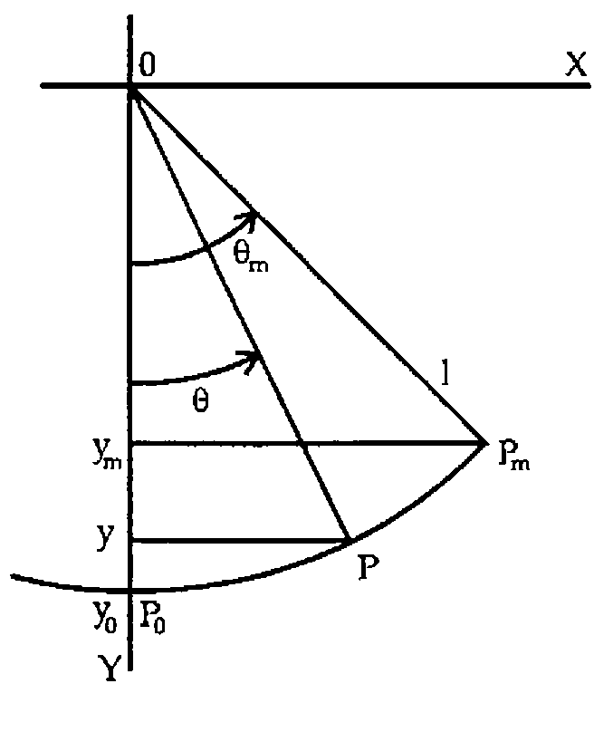

*by Joseph De Kerf (Reprinted from APL-CAM Journal, Vol.18 No.1)*
{ .byline }

## Abstract

Calculation of time *t* as a function of the declination θ of the simple pendulum with length *l* is reduced to the calculation of an incomplete elliptic integral of the first kind *K*(ϕ;*p*). For the period *T* this is reduced to the calculation of a complete elliptic integral of the first kind *K*(*p*). Algorithms, based on the common mean concept, are illustrated with APL user-defined functions. Examples are given.

## Introduction



In a previous paper [1], we have shown that the rectification of a lot of so-called closed curves is reduced to the calculation of elliptic integrals. The elliptic integrals were evaluated with algorithms based on the common mean concept [2], as such algorithms are much more efficient in cpu time than those based on gaussian quadrature or serious expansion. Implementation was illustrated with APL user-defined functions, calling the user-defined functions described in [3] and [4]. In this paper, we follow the same line of thought for the solution of the simple or plane pendulum: the calculation of time *t* as a function of the declination θ [5].

## The Simple Pendulum

The simple or plane pendulum consists of a mass point *m* (*P*) at one end of a massless rigid rod with length *l*, pivoted at the other end (0) and placed in a uniform gravitational field *g*. Let *P* (declination θ) be moving from the equilibrium position *P*<sub>0</sub> (declination 0) towards its maximum displacement *P*<sub>*m*</sub> (maximum declination or amplitude θ<sub>*m*</sub>).

## Time versus Declination

Kinetic energy of the system is: &emsp; ½*mv*<sup>2</sup> &emsp; with

*v* = *ds*/*dt* &emsp; and &emsp; *s* = *l*θ &ensp; (*v* = *l dθ*/*dt*)

Potential energy of the system is: &emsp; *mgl* (1 − cos θ)

as *y*<sub>0</sub> = *l* &emsp; and &emsp; *y* = *l* cos θ

Conservation of energy gives: &emsp; ½*mv*<sup>2</sup> + *mgl* (1 − cos θ) = *mgl* (1 − cos θ<sub>*m*</sub>)

½*mv*<sup>2</sup> = *mgl* (cos θ − cos θ<sub>*m*</sub>)

*v* = √(2*gl* (cos θ − cos θ<sub>*m*</sub>))

Substituting *v* by *l dθ*/*dt* we get: &emsp; *d*θ/*dt* = √((2*g*/*l*)(cos θ − cos θ<sub>*m*</sub>))

or: &emsp; *dt* = √(*l*/2*g*) · *d*θ / √(cos θ − cos θ<sub>*m*</sub>)

Setting the time at the equilibrium point *t*<sub>0</sub> = 0, time *t* for declination θ becomes:

*t* = √(*l*/2*g*) ∫<sub>0</sub><sup>θ</sup> *d*θ / √(cos θ − cos θ<sub>*m*</sub>)

Substituting: &emsp; sin(θ/2) = *p* sin ϕ &emsp; with &emsp; *p* = sin(θ<sub>*m*</sub>/2)

*d*θ = 2*p* cos ϕ *d*ϕ / √(1 − *p*<sup>2</sup> sin<sup>2</sup> ϕ)

we have: &emsp; √(cos θ − cos θ<sub>*m*</sub>) = √(2(sin<sup>2</sup>(θ<sub>*m*</sub>/2) − sin<sup>2</sup>(θ/2))) = √2 *p* cos ϕ

such that: &emsp; *t* = √(*l*/*g*) ∫<sub>0</sub><sup>ϕ</sup> *d*ϕ / √(1 − *p*<sup>2</sup> sin<sup>2</sup> ϕ) = √(*l*/*g*) *K*(ϕ;*p*)

*K*(ϕ;*p*) being the incomplete elliptic integral of the first kind with

ϕ = arc sin(sin(θ/2) / *p*) &emsp; and &emsp; *p* = sin(θ<sub>*m*</sub>/2).

## APL Function

An APL user-defined function *TIME* for calculating time *t* as a function of the declination θ may be:

```apl
      ∇TIME[⎕]∇
    ∇T←LA TIME D;F;P
[1]   F←((1↑LA)÷980.6294)*0.5
[2]   P←1○○(1↓LA)÷360
[3]   T←F×(¯1○(1○○D÷360)÷P) IEI1 P
    ∇
```

with: *LA* being the catenation of the length *l* (cm) and the maximum declination or amplitude θ<sub>*m*</sub> (degrees°)

- *D* the declination θ (degrees°)
- *P* the parameter *p* = sin(θ<sub>*m*</sub>/2)
- *F* the factor √(*l*/*g*)
- *IEI1* the user-defined function described in [4]

and geodetic constant *g* being set to 980.6294cm/sec<sup>2</sup> (Hayford latitude 45°) [6].

Example: &emsp; *l* = 100cm, &ensp; θ<sub>*m*</sub> = 60°, &ensp; θ = 10°(10°)60°

```apl
      LA←100 60
      D←10×⍳6
      2 0 12 6 ⍕ D,⊃(6⍴⊂LA) TIME¨ D
10  0.056021
20  0.113851
30  0.175831
40  0.245926
50  0.333733
60  0.538320
```

## Note:

The time to go from position *P*<sub>0</sub> to maximum displacement *P*<sub>*m*</sub> (θ = θ<sub>*m*</sub> or ϕ = π/2) is one-fourth of the period *T*. Therefore, the period of the pendulum is:

*T* = 4√(*l*/*g*) ∫<sub>0</sub><sup>π/2</sup> *d*ϕ / √(1 − *p*<sup>2</sup> sin<sup>2</sup> ϕ) = 4√(*l*/*g*) *K*(*p*)

with *p* = sin(θ<sub>*m*</sub>/2) and *K*(*p*) being the complete elliptic integral of the first kind.

The period *T* may be calculated with the function *TIME*, setting the right argument to the maximum declination or amplitude θ<sub>*m*</sub>, and multiplying the result by 4. An APL user-defined function *PERIOD* for calculating the period directly from the complete elliptic integral of the first kind, more efficient in cpu time, may be:

```apl
      ∇PERIOD[⎕]∇
    ∇T←L PERIOD A;F;P
[1]   F←(L÷980.6294)*0.5
[2]   P←1○○A÷360
[3]   T←4×F×CEI1 P
    ∇
```

with: L being the length *l* (cm)

- A the maximum declination of amplitude θ<sub>*m*</sub> (degrees °)
- CEI1 the user-defined function described in [3]

and the geodetic constant *g* being set to 980.6294cm/sec<sup>2</sup> (Hayford latitude 45°) [6]. The period *T* is returned in seconds.

Example: &emsp; *l* = 100cm, &ensp; θ<sub>*m*</sub> = 60°

```apl
      8 6 ⍕ 4×100 60 TIME 60
2.153281
      8 6 ⍕ 100 PERIOD 60
2.153281
```

## References

1. J. De Kerf: *Rectification with APL*; APL-CAM Journal, Vol. 17, No. 4, 16th December 1995 pp. 560 - 582.
2. J. De Kerf: *The Common Mean and APL*; APL-CAM Journal, Vol. 16, No. 3, 16th July 1994, pp. 370 - 372.<br>*See also*: Vector, Vol. 11, No. 3, January 1995, pp. 21 - 23.
3. J. De Kerf: *The Complete Elliptic Integrals and APL*; APL-CAM Journal, Vol. 16, No. 4, 16th October 1994, pp. 631 - 635.<br>*See also*: Vector, Vol. 12, No. 1, July 1995, pp. 102 - 106.
4. J. De Kerf: *The Incomplete Elliptic Integrals and APL - An Extension*; APL-CAM Journal, Vol. 17, No. 3, 16th September 1995, pp. 455 - 460.<br>*See also*: Vector, Vol. 12, No. 2, October 1995, pp. 95 - 100.
5. H.C. Corben and P. Stehle: *Classical Mechanics*; John Wiley & Sons, New York, 1950.
6. M.Abramowitz and L.A. Stegun (eds.): *Handbook of Mathematical Functions*; Applied Mathematics Series No. 55; National Bureau of Standards, Washington D.C., 1964 (and subsequent revisions).

## Appendix

For convenience of the reader, the APL user-defined functions *CEI1* [3] and *IEI1* [4], referred to in this paper, are reproduced here:

```apl
      ∇CEI1[⎕]∇
    ∇R←CEI1 P
[1]   R←1,(1-P*2)*0.5
[2]   LAB:→(≠/R←(0.5×+/R),(×/R)*0.5)/LAB
[3]   R←(○1)÷+/R
    ∇

      ∇IEI1[⎕]∇
    ∇R←F IEI1 P;I;A;B
[1]   →((1≠|P)∨(○÷2)≤|F)/LAB1
[2]   →0,R←⍟3○0.5×F+○0.5
[3]   LAB1:R←(2+I←¯1),÷÷(1-P*2)*0.5
[4]   LAB2:A←(-/R)×1○F×2*1+I←I+1
[5]   B←2×+/R×(2 1○F×2*I)*2
[6]   F←F-(¯3○A÷B)÷2*I+1
[7]   →(≠/R←(0.5×+/R),(×/R)*0.5)/LAB2
[8]   R←F÷0.5×+/R
    ∇
```
