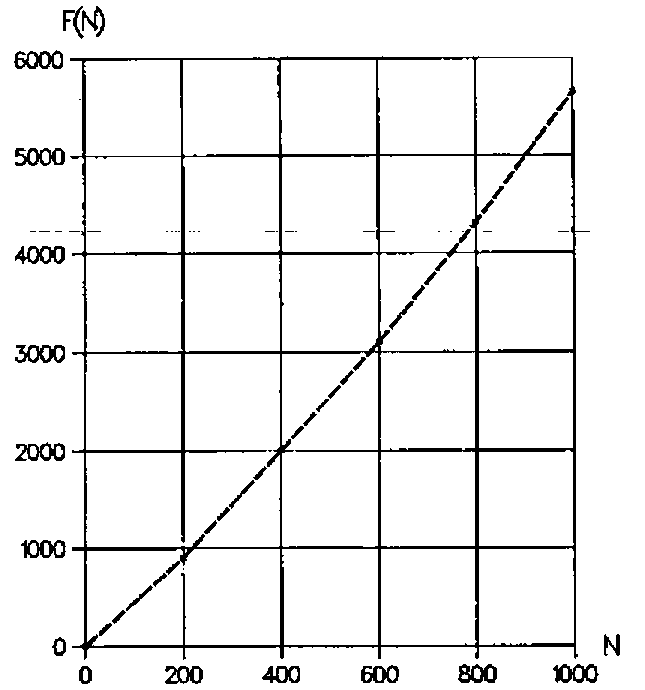
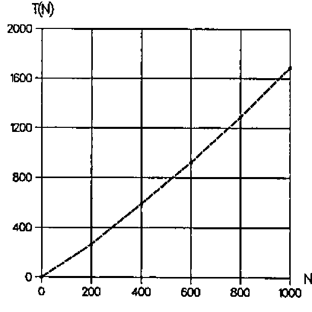

*by Joseph De Kerf*
{ .byline }

A positive integer or natural number is a *niven number* if it is divisible by its digital sum [1]. For instance, the integer 12 is a niven number as 12 is divisible by 1+2=3, while the integer 11 is not a niven number because 11 is not divisible by 1+1=2. Niven numbers were defined as such by R. Kennedy [1].

Starting with the niven number 1, let *F(N)* be the *N*th niven number. Niven numbers *F(N)* for *N* = 1(1)100 are listed in Table 1.

```text
  1   2   3   4   5   6   7   8   9  10
 12  18  20  21  24  27  30  36  40  42
 45  48  50  54  60  63  70  72  80  81
 84  90 100 102 108 110 111 112 114 117
120 126 132 133 135 140 144 150 152 153
156 162 171 180 190 192 195 198 200 201
204 207 209 210 216 220 222 224 225 228
230 234 240 243 247 252 261 264 266 270
280 285 288 300 306 308 312 315 320 322
324 330 333 336 342 351 360 364 370 372
```

Table 1: *F(N)* for *N* = 1(1)100
{ .caption }

Niven numbers *F(N)* for higher values of *N* are given below (*cf.* also Figure 1 for *N* = 200(200)1000).

```text
   N  F(N)       N   F(N)          N     F(N)
 200   902    2000  12532      20000   166860
 400  2000    4000  27168      40000   357210
 600  3102    6000  43080      60000   570042
 800  4311    8000  60816      80000   804600
1000  5652   10000  80118     100000  1033781
```

As *F(N)* increases with *N*, the frequency of the niven number decreases when *N* increases, Some aspects of this frequency have been studied by C. Cooper and R. Kennedy [2]. For instance, it was shown that there can exist at most twenty consecutive niven numbers. Further characteristics of such consecutive niven number sequences were studied by B. Wilson [3].

So far, however, no algorithm has been found to calculate *F(N)* directly from *N*. This means that, to calculate *F(N)*, the sequence of positive integers or natural numbers 1, 2, 3,… has to be checked for niven-ness until *N* niven numbers have been found. In other words a loop of *F(N)* cycles has to be executed.

Two APL user-defined functions *NIVEN1* and *NIVEN2* for calculating the sequence of niven numbers F(1), F(2), …, F(N) are given below.

```apl
      ∇NIVEN1[⎕]∇
    ∇Z←NIVEN1 N;I;J
[1]   →(N≤0)/0,Z←⍳I←0
[2]   LAB:J←⍴⍕I←I+1
[3]   →(0≠(+/(J⍴10⊤I)|I)/LAB
[4]   →(N>⍴Z←Z,I)/LAB
    ∇

      ∇NIVEN2[⎕]∇
    ∇Z←NIVEN2 N;I;J
[1]   →(N≤0)/0,Z←⍳I←0
[2]   LAB:J←1+⌊10⍟I←I+1
[3]   →(0≠(+/(J⍴10⊤I)|I)/LAB
[4]   →(N>⍴Z←Z,I)/LAB
    ∇

      NIVEN1 20
1 2 3 4 5 6 7 8 9 10 12 18 20 21 24 27 30 36 40 42

      NIVEN2 20
1 2 3 4 5 6 7 8 9 10 12 18 20 21 24 27 30 36 40 42
```

On line [1], it is checked if *N* is negative, a counter *I* is set to 0, and the explicit result *Z* is set to the empty vector `⍳0`. In line `[2]`, the counter *I* is increased by 1 and the number of digits *J* of *I* is evaluated. In line `[3]`, using the function *encode*, the counter *I* is split into its digits and, using the function *residue*, it is checked if *I* is divisible by the sum of those digits, in which case *I* is a niven number. Finally, in line `[4]`, if the counter *I* is a niven number, *Z* is catenated with this counter, and the loop is closed when the shape of the explicit result is equal to *N* (or `⌈N`). If *N* is negative or zero, the empty vector `⍳0` is returned. If *N* is positive, the vector of niven numbers `F(1), F(2), ..., F(⌈N)` is returned.



Figure 1: *F(N)* for *N* = 200(200)1000
{ .caption }

The difference between *NIVEN1* and *NIVEN2* lies in the procedure used to count the digits of *I*. In *NIVEN1* this is done by evaluating the shape of the format of *I*. In *NIVEN2* it is done by adding a 1 to the floor of the common logarithm of *I*. To compare the effectiveness of the two procedures, cpu times *T(N)* for both functions have been monitored, and this for *N* = 200(200)1000. Average results in ms for 10 series of 100 executions are given in Table 2 (*cf.* also Figure 2). Differences in performance are negligible.

```text
N        200   400   600    800   1000
NIVEN1   266   592   923   1287   1689
NIVEN2   268   594   924   1288   1690
```

Table 2: CPU times *T(N)* in ms for *N* = 200(200)1000
{ .caption }

*T(N)/N* increases very rapidly with N, such that for instance *T(N)* becomes about 29.3 *seconds* for N = 10000 and about 16.0 *minutes* for N = 100000.



Figure 2: CPU times *T(N)* in ms for *N* = 200(200)1000
{ .caption }

In *NIVEN1* and *NIVEN2*, the count *J* of the digits of *I* and checking if *I* is a niven number is done in two separate lines `[2]` and `[3]`, this for readability. Performance in cpu times may be improved by substituting lines `[2]` and `[3]` by a one-liner. This is done in the user-defined functions *NIVENA* and *NIVENB*

```apl
      ∇NIVENA[⎕]∇
    ∇Z←NIVEN2 N;I;J
[1]   →(N≤0)/0,Z←⍳I←0
[2]   LAB:→(0≠(+/((⍴⍕I)⍴10)⊤I)|I←I+1)/LAB
[4]   →(N>⍴Z←Z,I)/LAB
    ∇

      ∇NIVENB[⎕]∇
    ∇Z←NIVEN2 N;I;J
[1]   →(N≤0)/0,Z←⍳I←0
[2]   LAB:→(0≠(+/((1+⌊10⍟I)⍴10)⊤I)|I←I+1))/LAB
[4]   →(N>⍴Z←Z,I)/LAB
    ∇

      NIVENA 20
1 2 3 4 5 6 7 8 9 10 12 18 20 21 24 27 30 36 40 42
      NIVENB 20
1 2 3 4 5 6 7 8 9 10 12 18 20 21 24 27 30 36 40 42
```

Results for the same benchmark as done for *NIVEN1* and *NIVEN2* are given in Table 3. Ratios of the results versus those for *NIVEN1* and *NIVEN2* are added.

```text
N         200     400     600     800    1000
NIVENA    255     568     886    1236    1624
NIVENB    256     570     888    1237    1624

Ratios  0.957   0.960   0.960   0.960   0.961
```

Table 3: CPU times *T(N)* in ms for *N* = 200(200)1000
{ .caption }

Just as for *NIVEN1* and *NIVEN2*, differences in performance between *NIVENA* and *NIVENB* are negligible. Improvement of performance of the functions *NIVENA* and *NIVENB* versus the functions *NIVEN1* and *NIVEN2* is about 4% for the domain investigated but decreases for higher values of N, such that *T(N)* is still about 28.3 *seconds* for N = 10000 and about 15.6 *minutes* for N = 100000. In summary, performance in cpu times of the user-defined functions given is *very poor* for higher values of N and it would be a challenge to find an algorithm which *drastically* improves this performance.

Programming, calculations and benchmarks have been done on a MicroLine Pentium-S 100, with Dyalog APL/W Version 7.1.2, under Windows 3.11. Benchmarks have been done using the system function `⎕MONITOR`.

## References

1. R. Kennedy, T. Goodman and C. Best: *Mathematical Discovery & Niven Numbers.* The MATYC Journal, Vol. 14, no. 1, 1980, pp. 21–25
2. C. Cooper and R. Kennedy: *On Consecutive Niven Numbers.* The Fibonacci Quarterly, Vol. 31 no. 2, May 1993, pp. 146–151
3. B. Wilson: *Construction of Small Consecutive Niven Numbers.* The Fibonacci Quarterly, Vol. 34 no. 3, June-July 1996, pp. 240–243
4. *Dyalog APL/W Language Reference – Version 7.* Dyadic Systems Ltd., Basingstoke, 1994
