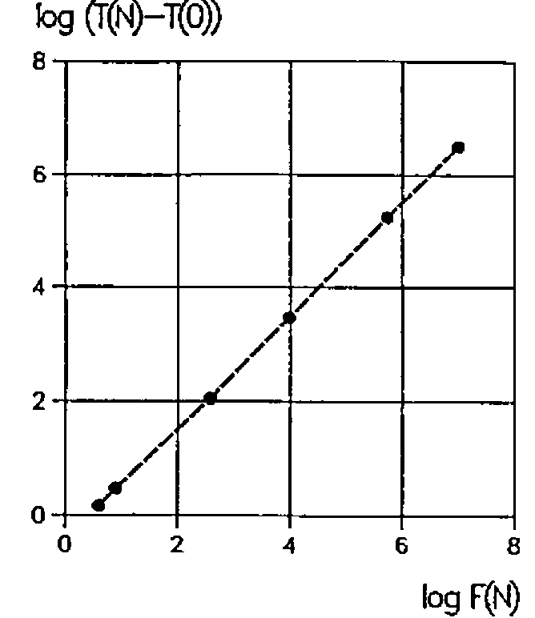
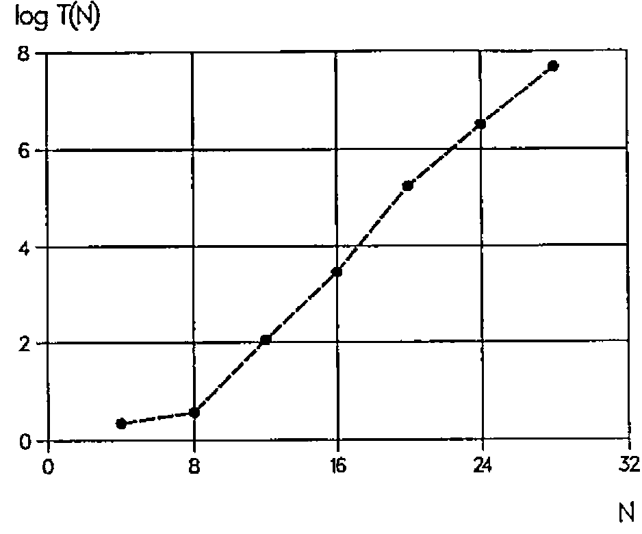

*by Joseph De Kerf*
{ .byline }

*This paper originally appeared in BACUS 18.4, December 1996, reprinted by permission of the author*

In a previous paper we treated *niven numbers* [1]. In this paper we treat *armstrong numbers* [2].

A positive integer or natural number *I* is an *armstrong number* if the sum of the *J*th powers of its digits is equal to the original number, *J* being the number of its digits:

> I = a<sup>J</sup> + b<sup>J</sup> + c<sup>J</sup> …

For instance, the integer 153 is an armstrong number as 1<sup>3</sup>+5<sup>3</sup>+3<sup>3</sup> = 153. Starting with the armstrong number 1, let *F(N)* be the *N*th armstrong number. Armstrong numbers *F(N)* for *N* = 1(1)28 are listed in Table 1.

As *F(N)* strongly increases with *N*, the frequency of the armstrong numbers strongly decreases when *N* increases. The nine digits 1 … 9 are armstrong numbers. There exists no armstrong number of two digits. And for *J*≥3, there exist at most two armstrong numbers; if *I* is an armstrong number, then *I*+1 is an armstrong number, if and only if the last digit of *I* is 0. Or, if *I* is an armstrong number, then *I*-1 is an armstrong number, if and only if the last digit of *I* is 1. Examples:

> 370, 371 and 24678050, 24678051

So far, however, no algorithm has been found to calculate *F(N)* directly from *N*. This means that, to calculate *F(N)*, the sequence of positive integers or natural numbers 1, 2, 3,… has to be checked until *N* armstrong numbers have been found.

```text
N F(N)    N F(N)    N    F(N)    N      F(N)
1    1    8    8   15    8208   22   4210818
2    2    9    9   16    9474   23   9800817
3    3   10  153   17   54748   24   9926315
4    4   11  370   18   92727   25  24678050
5    5   12  371   19   93084   26  24678051
6    6   13  407   20  548834   27  88593477
7    7   14 1634   21 1741725   28 146511208
```

Table 1: *F(N)* for *N* = 1(1)28
{ .caption }

Two APL user-defined functions *ARMSTRONG1* and *ARMSTRONG2* for calculating the sequence of armstrong numbers F(1), F(2), … F(N) are given below:

```apl
    ∇Z←ARMSTRONG1 N;I;J
[1]  →(N≤0)/0,Z←⍳I←0
[2] LAB:J←⍴⍕I←I+1
[3]  →(I≠+/((J⍴10)⊤I)*J)/LAB
[4]  →(N>⍴Z←Z,I)/LAB
    ∇

    ∇Z←ARMSTRONG2 N;I;J
[1]  →(N≤0)/0,Z←⍳I←0
[2] LAB:J←1+⌊10⍟I←I+1
[3]  →(I≠+/((J⍴10)⊤I)*J)/LAB
[4]  →(N>⍴Z←Z,I)/LAB
    ∇

      ARMSTRONG1 16
1 2 3 4 5 6 7 8 9 153 370 371 407 1634 8208 9474

      ARMSTRONG2 16
1 2 3 4 5 6 7 8 9 153 370 371 407 1634 8208 9474
```

In line `[1]` it is checked if *N* is negative or 0, a counter *I* is set to 0, and the explicit result *Z* is set to the empty vector `⍳0`. In line `[2]`, the counter *I* is increased by 1 and the number of digits *J* of *I* is evaluated. In line `[3]`, using the function encode, the counter *I* is split into its digits and it is checked if the sum of the *J*th powers of those digits is equal to *I*, in which case *I* is an armstrong number. Finally, in line `[4]`, if the counter *I* is an armstrong number, *Z* is catenated with this counter, and the loop is closed when the shape of the explicit result *Z* is equal to *N* (or `⌈N`). If *N* is negative or 0, the empty vector `⍳0` is returned. If *N* is positive, the vector of armstrong numbers *F*(1), *F*(2), … *F*(`⌈N`) is returned.

| N | *ARMSTRONG1* | *ARMSTRONG2* | *ARMSTRONGA* | *ARMSTRONGB* |
|--:|--:|--:|--:|--:|
| 0 | 0.8 ms | 0.8 ms | 0.8 ms | 0.8 ms |
| 4 | 2.3 ms | 2.3 ms | 2.2 ms | 2.2 ms |
| 8 | 3.8 ms | 3.8 ms | 3.7 ms | 3.7 ms |
| 12 | 116.0 ms | 115.0 ms | 111.0 ms | 109.0 ms |
| 16 | 2.97 sec | 2.94 sec | 2.86 sec | 2.80 sec |
| 20 | 2.98 min | 2.91 min | 2.87 min | 2.77 min |
| 24 | 55.30 min | 54.00 min | 53.40 min | 51.70 min |
| 28 | average: about 13.5 hours | | | |

Table 2: CPU times for *N* = 0(4)28
{ .caption }

The difference between *ARMSTRONG1* and *ARMSTRONG2* lies in the program used to count the digits of *I*. In *ARMSTRONG1* this is done by evaluating the shape of the format of *I*. In *ARMSTRONG2* it is done by adding 1 to the floor of the common logarithm of *I*.

In *ARMSTRONG1* and *ARMSTRONG2*, the count *J* of the digits of *I* and checking if *I* is an armstrong number is done in two separate lines, `[2]` and `[3]`, for readability. Performance in CPU times may be improved slightly by substituting a one-liner for lines `[2]` and `[3]`. This is done in the user-defined functions *ARMSTRONGA* and *ARMSTRONGB*:

```apl
    ∇Z←ARMSTRONGA N;I;J
[1]  →(N≤0)/0,Z←⍳I←0
[2] LAB:→(I≠+/((J⍴10)⊤I)*J←⍴⍕I←I+1)/LAB
[3]  →(N>⍴Z←Z,I)/LAB
    ∇

    ∇Z←ARMSTRONGB N;I;J
[1]  →(N≤0)/0,Z←⍳I←0
[2] LAB:→(I≠+/((J⍴10)⊤I)*J←1+⌊10⍟I←I+1)/LAB
[3]  →(N>⍴Z←Z,I)/LAB
    ∇

      ARMSTRONGA 16
1 2 3 4 5 6 7 8 9 153 370 371 407 1634 8208 9474

      ARMSTRONGB 16
1 2 3 4 5 6 7 8 9 153 370 371 407 1634 8208 9474
```



Figure 1: log(*T(N)*-*T*(0)) versus log *F(N)* for *N* = 4(4)24
{ .caption }

To compare the effectiveness of the user-defined functions shown, CPU times *T(N)* for *N* = 0(4)28 have been monitored. Results are reported in Table 2 (*cf.* also Figures 1 and 2).

Of course *T(N)* - *T*(0) is approximately proportional to *F(N)*. Performance of *ARMSTRONGB* versus *ARMSTRONG1* increases, for the domain investigated, from about 3% to 7% with *N*. Most importantly however, performance of the user-defined functions given is *very poor* and becomes impractical for even small values of *N*. Just as for the functions reported to calculate niven numbers, it would be a challenge to find an algorithm that *drastically* improves the performance of the functions to calculate the armstrong numbers.

The user-defined functions shown conform to the ISO Standard for APL [3]. Programming, calculations, and benchmarks have been done on a MicroLine Pentium-S 100, with Dyalog APL/W Version 7.1.2, under Windows 3.11 [4]. Benchmarks have been done using the system function `⎕MONITOR`.



Figure 2: log *T(N)* versus *N* = 4(4)48
{ .caption }

## References

1. J.De Kerf; *Niven Numbers and APL*; APL-CAM Journal, Vol. 18, No. 3, 16 September 1996, pp. 388-396
2. D.D.Spencer; *Computers in Number Theory*; Computer Science Press, Rockville, Maryland, 1982, pp. 126-127
3. International Standard ISO8485: 1989 (E), First Edition; 1989-11-01; *Programming Languages - APL*; International Organization for Standardization, Geneva, Switzerland, 1989.
4. *Dyalog APL/W Language Reference - Version 7*; Dyadic Systems Ltd., Basingstoke, Hampshire, U.K., 1994.
