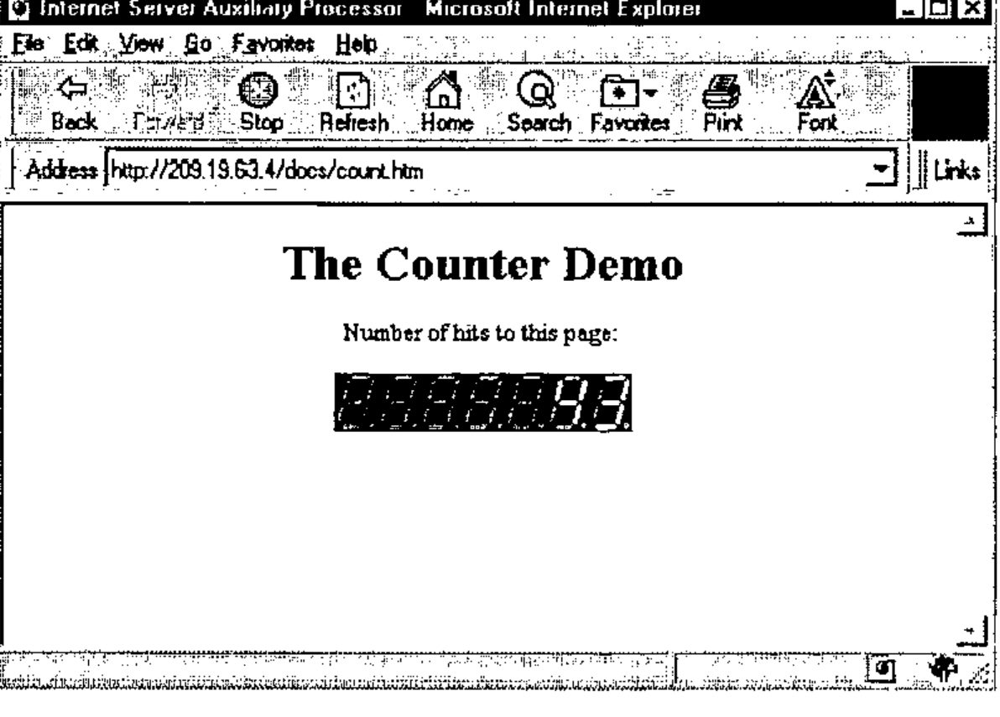

*by Andrei Kondrashev*
{ .byline }

## Processes and Threads

*Multitasking* is the ability of an operating system to run multiple programs concurrently. Under the Windows NT operating system, concurrently running programs are called *processes*. Each process has a private virtual address space, its own copy of the executable code, GDI objects, etc. Very few Windows resources can be shared between different processes. Processes have limited possibilities to communicate with each other. All interprocess communication methods are strictly controlled by the operating system. *Multithreading* is the ability of a process to multitask within itself. Each process starts with a single *thread*. Additional threads can be created later on. All threads of a process run in the same virtual address space and share all resources of the process. A thread can execute any part of a process’ code, including a part executed by another thread. This allows many independent and concurrently running threads that are using the same code, to perform similar operations on different data. All threads can access global variables of the process, but they use their own stacks that make the thread’s local variables unique. Windows NT implements multitasking at the thread level.

## HTTP

HTTP (stands for HyperText Transfer Protocol) is an application-level networking protocol. HTTP can be implemented on top of any reliable transport protocol (usually TCP). Well-known port number for HTTP is 80. HTTP is a multi-purpose data transfer protocol. It can be used to transfer any type of data. HTTP is a "sessionless" protocol. When a client needs to get data from the server, it connects to the server’s port 80 and sends an *HTTP request*. The server replies with the *HTTP response* and closes the connection. Thus, the term "sessionless" means that the session consists of only a single act of message exchange. A good example of a "session-oriented" application protocol is FTP. HTTP is very easy to implement, but relatively tricky to use in interactive network applications. Despite the fact that modern Web browsers and servers are able to re-use the TCP connection to increase performance, that does not change anything for the application programmer. From his point of view, each HTTP request initiates an absolutely new session with the server. No previous exchange history is directly available.

An HTTP request consists of three parts: the HTTP request line, HTTP request headers, and the HTTP request body. The structure of the request line is:

```text
<METHOD><SP><URL>[<?><PARAMETERS>]<HTTP/1.0><CRLF>
```

Where:

> Characters "<" and ">" are used to separate different elements of the line;<br>
> `<METHOD>` can be "GET", "HEAD", or "POST";<br>
> `<SP>` means the blank space ASCII character;<br>
> `<URL>` is a universal resource locator;<br>
> `<PARAMETERS>` is an optional list of parameters;<br>
> `<CRLF>` means two ASCII characters: carriage return and line feed.

The *universal resource locator* (URL) is a character string that identifies the resource (data file, or something that will produce the data file) on the Internet. Generally, it consists of the address of the Internet server and the path information. Both IP and DNS addresses can be used to address the server. The path information indicates the location of the resource on the server. The server will map this virtual path using its own internal rules to find the physical location of the resource requested.

*Parameters* (or query string) may specify additional information for the server’s data-producing process. Parameters are separated from the URL by the "?" character. For example:

```text
www.lingo.com/isap/isap.dll?ws=counter
```

The *method* defines how the additional request information is being transferred to the server. If the method is "GET" or "HEAD", the request does not contain the request body. If the method is "POST", the request body contains additional information to be used by the server’s data-producing process.

The *request headers* follow immediately after the request line. Header fields (each must be terminated with CRLF) carry additional information about the request and the client itself. If the request body is present, there will be at least the `Content-Type` and the `Content-Length` headers. An empty line (contains CRLF only) indicates the end of request headers.

The *request body* can be anything. The type of the information is defined by the `Content-Type` header. If it is missing, plain ASCII text is assumed. This is an example of an HTTP request (note the empty line between the request’s headers and body:

```text
POST www.lingo.com/isap/isap.dll?mydoc.htm HTTP/1.0
Accept:image/gif,image/jpeg,*/*
Content-Type:application/x-www-form-urlencoded
Content-Length:7
- empty line here -
ws=demo
```

The structure of the HTTP response is similar to the structure of the HTTP request. Only the request line is replaced with the *response status line*. This is an example of the HTTP response:

```text
HTTP/1.0 201 OK
Content-Type:text/html
Content-Length:44
- empty line here -
<HTML><BODY>This is a response</BODY></HTML>
```

The response body can be any binary output: plain text, HTML, GIF or JPEG images, movie clips, etc. It also can contain client-side-specific data, such as a Microsoft Excel spreadsheet, for example. There are two distinct ways the HTTP server can prepare the response:

- server returns a static document defined by the URL;
- server runs a data-producing program defined by the URL, and that program prepares the document that is returned by the server.

The client doesn’t distinguish between these cases, and doesn’t care how the HTTP response was produced.

## HTTP Servers and APL

A program that understands HTTP requests, and is able to send back to the client HTTP responses, is called an HTTP (or *Web*) server. As we saw above, HTTP is a very simple protocol. All Web "magic" happens on the client side. A Web browser is a rather complex program that parses HTML, creates forms, decides what method and URL to use, optimizes communications with the server, etc. The server, in its turn, is relatively simple. One of the most important features that any HTTP server should support, is the ability to run external data-producing programs that generate HTTP responses dynamically. This feature drives all commercial use of the Internet. A data-producing program can be run as a separate process on the server’s computer or as a separate thread of the server’s process.

The simplicity of an HTTP server is very tempting. As soon as the socket programming became available under all major APL (and J) implementations, it was possible to develop HTTP servers purely in APL. If the socket interface has a callback feature, a pretty decent simple HTTP server can be implemented in about 30 lines of APL code. This server, of course, will be able to use APL programs to generate dynamic HTTP responses. Let’s discuss what’s wrong with this idea.

**Poor performance.** Up to 99% of the work that any Web server has to perform is simple file transfer. It means that the APL program will frequently `⎕NTIE`, `⎕NREAD`, and `⎕NUNTIE` the files. APL is not very suitable for these operations. There will be multiple moves of data between various buffers before the data will be, finally, dumped to the TCP output buffer. Note that Windows NT is able to send files over the TCP connection very efficiently, in the background, taking almost no CPU time. Internet servers use this facility, so the performance of an APL-based server that has to send many static documents will be much worse in comparison with, let’s say, Microsoft Internet Information Server, that has been specifically designed to perform such operations very efficiently. Next, as of this writing, an APL-based server cannot take direct advantage of the fact that it is running under a multitasking operating system. Only non-preemptive multitasking can be implemented under all currently available APL systems, until real multithreading is available. As a result, the simple file transfer operations that IIS does in parallel on all active connections, would be executed sequentially by an APL server. Of course, the performance is something application-dependent. You may decide that the performance of an APL server is acceptable for you. My point here is that standard tools will perform better anyway.

All industry-standard Internet servers must support various **security and encrypting features.** In order to implement the necessary level of security, the server must be deeply integrated with the operating system. APL programs run under control of an APL interpreter that isolates them from the operating system. Of course, anything is achievable, but is the result worth the effort spent? Probably not, especially because full-scale security and encrypting cannot be implemented purely in the APL environment anyway.

The **maintenance** issue is rather important. Usually, in large organizations a special department performs everyday routine maintenance of all servers such as data backup, setting the permissions on the server’s resources, and so on. In most cases those people are not programmers at all. They are "certified" users (network administrators, etc.), who completed special training and who know exactly how to do certain things. Infrastructure departments don’t like to use non-standard critical software developed by a third-party vendor, because it might be difficult to find and/or to train the supporting personnel. This is why, for example, it is so easy to invent yet another programming language, but it is so difficult to make someone else use it. It’s the same story with Internet servers: clients prefer to use system software developed by Microsoft, IBM, or Netscape, but not by MyCompany, Inc.

**An APL HTTP server won’t be able to run anything except APL.** This is not good. There are many other Internet programming tools around. There will be more, for sure. Not all tools are equally suitable for all purposes. The freedom to choose the right tool and to use more than one of them simultaneously on the very same Internet server is important for many companies that use the Internet commercially.

### Résumé

APL Web servers are possible, but their usage is limited to Intranets (because of lack of sufficient security). They can be acceptable for really heavy applications that are used by a very limited number of concurrent users, in cases when a data-producing program is so complex that other issues become less important in comparison with the advantages of direct use of APL. There are various tricks that allow deploying APL servers indirectly and under control of "standard" Web servers. As an example, you may look at `http://www.1travel.com`. The hotel booking part of this Web site is supported by a hidden APL server (implemented by *Lingo Allegro USA, Inc.* and *Shepp & Associates LLC*).

The access to this server is fully controlled by another Internet application written in a language other than APL.

However, APL is a very suitable language for Web-based applications. Much better, from my point of view, than anything else available on the market now, including Perl. The only (and usual for APL) problem is how to use it together with other existing software systems and only in the area where APL is unbeaten: the data processing. Let’s look at what is currently available.

## CGI vs. IISAPI

One of the most popular and simple methods of creating dynamic HTTP responses is called *Common Gateway Interface* (CGI). The idea of CGI is very simple. When the server determines that the URL defines a data-producing program, it creates a new process using the code defined by the URL. The server sets the process’s environment variables in order to pass the parameters of the request: `REQUEST_METHOD`, `CONTENT_TYPE`, `CONTENT_LENGTH`, and others. The server also re-directs the process’s standard input and standard output devices to the TCP socket that supports the HTTP connection. Thus, a CGI program can simply use the standard input/output functions to read and write to the socket. The CGI process terminates when the program has sent all data to the socket. The main advantage of CGI is that virtually any programming language can be used, including APL. All that you need is the ability to access the environment variables, and to read and write to the standard output device. Because the processing of HTTP requests heavily involves string manipulation operations, special languages have been designed specifically to use with CGI.

What’s bad about CGI? First of all, each CGI request must be supported by its own process. For example, if there are ten CGI requests processed by the server, there will be ten concurrently running processes (probably, executing exactly the same code) on the server computer. Despite the fact that NT tries to re-use code and resources from the previous instances of the same program, by mapping portions of physical memory to the virtual memory of different processes, it is not always possible to avoid the replication of the same code. When APL runs, the workspace will be duplicated for sure. You can use the Task Manager to analyse how much it costs you to run more than one instance of your application.

Secondly, it takes some time to start a CGI process. For such a "heavy" system as APL, this time can be substantial (we will need to load a workspace too). Next, because a CGI process terminates when it’s done with the request, it cannot take direct advantage of previous runs of the same program. For example, if a CGI program must access a database server in order to create the response, it will have to log on to the server every time, when it starts. For many industry standard database servers, the logon is a very unpleasant and long procedure (may take dozens of seconds), which will add an additional overhead to the HTTP server response time. All these reasons make CGI practically unusable for sophisticated server-side processing. CGI programs can be used only for very simple operations and should be coded in compiled languages that produce small executables.

Different vendors of HTTP servers introduced various alternatives to CGI for developing data-producing programs. The rest of this article will discuss so-called *server extensions* for the Microsoft Internet Information Server (IIS).

IIS exposes a special application interface (IISAPI) that can be used by developers to create very effective data-producing programs. Server extensions are Windows dynamic link libraries (DLL) and they run as threads of the IIS process. When IIS receives a request that requires running an extension, it loads the corresponding DLL and uses the DLL’s code to start yet another thread. The DLL remains in the IIS virtual address space even after the request is completed. Because threads can share the same executable code, IIS needs to have only one copy of the extension DLL to run any number of concurrent independent threads, which require this DLL in order to generate HTTP responses. Many different extension DLLs can be used at the same time.

Thus, the first obvious advantage of IISAPI versus CGI is that IIS extensions require zero loading time. Secondly, they do not waste memory, if more than one concurrently executed request requires running the same data-producing program. Extensions are more effective than CGI, because they can take advantage of the fact that they are part of the server. The IIS exports functions that allow the program to perform data exchange operations more efficiently, rather than just reading and writing to the standard input/output device. IIS extensions can also use the fact that they are not removed from the memory. They can be permanently connected to a database server, for example. IISAPI provides the best possible performance in comparison with all other available server-side Internet programming tools.

The only disadvantage of IIS extensions is that they are relatively difficult to develop. Only the C language can be used for programming. An extension DLL must be *thread-safe*. It means that the DLL must work correctly, even if more than one thread, based on the same code, is run by the same process. Any additional DLLs that could be used by an extension, must be thread-safe too. If you are planning to use ODBC, be prepared that most ODBC drivers *are not* thread-safe. So, for us, as APL programmers, it would be very desirable to use APL as an IIS extension. Lingo Allegro USA, Inc. developed the Internet Server Auxiliary Processor (ISAP) that can be used with Dyalog APL to develop IIS extensions in APL.

## Internet Server Auxiliary Processor

The idea of ISAP is to provide the interface between Microsoft Internet Information Server and Dyalog APL. From IIS’s point of view, it has to be just an extension DLL. From Dyalog APL’s point of view, it should be something that can accept commands and data from APL. ISAP needs to inform APL about incoming HTTP requests, and to be able to execute IIS functions on behalf of APL, such as getting information about requests, reading client data, and sending back HTTP responses. And it has to be able to handle multiple concurrent requests too.

Figure 1 shows the architecture of the IIS-ISAP-Dyalog APL interface.


Figure 1
{ .caption }

When ISAP.DLL is loaded by IIS for the first time, there is only one main ISAP’s thread running. This thread handles communications with Dyalog APL using one shared variable. Immediately after loading, ISAP starts Dyalog APL with an application workspace. How to start APL and what workspace to use is specified in ISAP’s initialization file. When an HTTP request that refers to ISAP.DLL in its URL arrives at the server, the server starts a new thread of ISAP. This new thread is called a *channel*. The channel posts a notification message to APL and switches into a wait state, effectively allowing other threads to run. The notification message has only one parameter - the channel number. After the notification message is received, an APL application can execute commands on this channel. More than one channel can exist at the same time. The APL application can work with the channels in any order it wants. It can process more important requests before less important ones, for example. It can split time-consuming requests into steps and process short requests between the steps of long requests. All of this is decided by the APL programmer.

The *SERVER* function below is a generic IIS-based application.

```apl
     SERVER;_ISF
[1]  SETGLOBALS
[2]  →SHARE↓EXIT
[3]  '_ISF'⎕WC'FORM'('COORD' 'PIXEL')('EVENT'5'SERV_CB')('VISIBLE'0)
[4]  SAY'NOTIFY'('_ISF'⎕WG'HANDLE')
[5]  '.'⎕WS'EVENT' 131 'SERV_CB'
[6]  ⎕DQ'.'
[7] EXIT:CLEANUP
[8]  END
```

When Dyalog APL starts the application workspace, this function is executed as the result of the execution of the latent expression. First, the application performs its initialization by running the *SETGLOBALS* function. This is application-specific. Next, it executes the *SHARE* function, which is a part of ISAP. This function establishes the connection between ISAP and Dyalog APL by sharing a variable. After that, the application creates an invisible window, called *\_ISF*, that will receive the notification messages from ISAP (of course, you can use any other name for the form object). *\_ISF*’s callback function (*SERV_CB*) must process at least one message, message 5, which is ISAP’s notification message. Other events can be processed too, if the application is going to implement any kind of non-preemptive multitasking within itself. When the notification window is created, the program sends the NOTIFY command to ISAP, which informs it about which window should receive the notification messages. The callback function should also handle event 131 - Windows shutdown - in order to perform any necessary clean-up (such as disconnection from a database server, updating and closing files, and so on). Finally, the *SERVER* goes into the message waiting state. When `⎕DQ` exits, which can happen on IIS shutdown, the application performs the necessary exit procedures by executing the *CLEANUP* function. The *END* function is a standard ISAP procedure that terminates ISAP.

The *SAY* function is a part of ISAP and is used to send commands to the auxiliary processor. The general syntax is:

```apl
R←SAY COMMAND ARGUMENTS
```

*COMMAND* is a simple character vector—the command’s mnemonic. *ARGUMENTS* is a general APL array that depends on the command used. The function returns the result of the command, as its explicit result, or generates error 667 that has to be trapped by the application. Most of ISAP’s commands should pass the channel number as one of their arguments. ISAP will execute such commands in the context of the appropriate thread of the IIS. Many commands are executed by ISAP asynchronously. It means that in cases where it is possible ISAP will return control to APL before IIS completes the execution of the command. This allows APL and IIS run simultaneously, increasing overall server performance.

All real work on processing HTTP requests takes place in the *SERV_CB* function. This function could be very straightforward and simple, if the application only needs to process a single HTTP request, or it can be rather sophisticated, if you want to run more than one APL application under IIS. It can process HTTP requests in the order it receives them, or it can implement a non-preemptive multitasking to process many requests simultaneously. These are choices that are left completely up to the APL programmer. ISAP doesn’t care which approach you use. Figure 2 shows the principal diagram of HTTP request processing under ISAP.


Figure 2
{ .caption }

The processing always starts with the GETINFO command (unless you don’t care what request you are processing). This command returns a 19-item nested vector that carries the complete information about the IIS channel and the HTTP request. It also contains the posted data from the client, if the `POST` method was used in the HTTP request. All data, returned by this command, are translated to the Dyalog APL character set, including any characters that are transmitted as escape sequences.

The processing of any request must end with the CLOSE command. This command informs IIS that the processing of the request has been completed. IIS terminates the corresponding ISAP’s thread and closes the TCP connection with the client.

An APL programmer can use anything available in the APL language and other ISAP’s commands between GETINFO and CLOSE in order to send an HTTP response back to the client. Any type of response body can be used: HTML, image, or a custom binary file. It is also possible to redirect the request to another URL on the same server, or to a URL on some other server on the Internet. ISAP supports several commands that produce GIF and x-bitmap images that can be constructed using the standard graphical functions of Dyalog APL.

You can download the complete ISAP documentation from the Lingo Allegro USA, Inc. Web site at `http://www.lingo.com`.

## Sample Application: Page Reference Counter

One of the most popular applications running on Web sites is a page reference counter. This application displays (usually in the form of a nice looking picture) the number of references to a page (usually, the site’s home page). Of course, if some Web page is generated dynamically, the page counter can be generated as text simultaneously with the page content. However, this is not convenient to use. Many pages are very complex and the most of their content is static. A better approach would be to take advantage of the fact that some HTML elements require an additional HTTP request to be sent by a browser. One such element is an embedded image. Images can be inserted in the HTML document using the `` tag. The `SRC` parameter of the tag denotes the URL that the browser should use in the HTTP request in order to obtain the image file. Thus, if we use the URL to a picture-producing program, instead of a static picture file, it will do the job. This approach allows the use of the same counter-generating program to count any page on the Internet by simply inserting the appropriate `` tag in the document we want to count references to.

The following is the example of an HTML file that can be found at `http://209.19.63.4/docs/count.htm` (the IP address is fictional):

```text
<HTML><HEAD>
<TITLE>Internet Server Auxiliary Processor</TITLE>
</HEAD>
<BODY BGCOLOR="#FFFFFF" TEXT="#000000">
<CENTER>
<H1>The Counter Demo</H1>
<P>Number of hits to this page:
<P>
</BODY></HTML>
```

We are assuming that the ISAP.DLL file can be found in the `/ISAP` virtual directory on the server. To make our example as simple as possible, we will create an application that is able to handle only one HTTP request. This is why the `SRC` parameter of the `` tag refers to ISAP.DLL without any additional information, such as the application name, which would be needed, if we wanted to execute more than one APL application using ISAP on the same server.

First of all, we need to decide how we will keep the information about pages and their reference counters. In APL the simplest way to do this is to use a two-column nested matrix. The first column is a nested vector of simple character vectors that are URLs of pages that we are counting. The second column is a simple numeric vector, each element of which is the current number of references to the corresponding URL from the first column. We could store this matrix in an APL file. The application will read this file at initialization time, and will write the updated matrix back to the file when it terminates. The file will have the same name as the application workspace, and will be stored in the same directory. We need to create this file manually and to initialize its first component with an empty matrix.

There are many ways to construct the counter’s image. One possibility is to use bitmaps that represent elements of the counter. How the counter will look is a matter of taste. Let’s use a fixed length counter with, let’s say, seven decimal places. We will fill unused decimal places with a "blank" element. It means that we need eleven bitmaps of the same size that represent "blank" and ten digits. I have created such bitmaps that look like the elements of an LCD display. It is a good idea to read these bitmaps from the disk during the initialization to save time while processing requests. We should delete them, when the application ends. We will assume that all bitmaps are stored in the same directory where the application workspace resides, and that the file names are `B0.BMP`, …, `B10.BMP`, where `B10.BMP` represents the blank element. It will be possible to change the appearance of the counter by replacing the bitmaps.

Now we are ready to write the *SETGLOBALS* and *CLEANUP* functions for our server application (see the *SERVER* function above).

```apl
     SETGLOBALS;PATH
[1]  ⎕WSID ⎕FSTIE TN←1+⌈/0,⎕FNUMS
[2]  URL←⎕FREAD TN,1
[3]  COUNT←URL[;2] ⋄ URL←URL[;1]
[4]  PATH←(-(⌽⎕WSID)⍳'\')↓⎕WSID
[5]  PATH←(⊂PATH,'\B'),¨(⍕¨¯1+⍳11),¨⊂'.BMP'
[6]  ('B',¨⍕¨⍳11)⎕WC¨(⊂⊂'BITMAP'),¨⊂¨(⊂⊂'FILE'),¨⊂¨PATH
[7]  HEIGHT WIDTH←'B1'⎕WG'SIZE'
```

The *SETGLOBALS* function creates eleven bitmap objects with names *B1*, *B2*, …, *B11*. It also leaves five global variables in the workspace: *URL* - the vector of previously referenced URLs, *COUNT* - the vector of current numbers of hits for each URL, *TN* - the database file tie number, *HEIGHT* - the height of the counter image, *WIDTH* - the width of one element of the counter image.

```apl
     CLEANUP
[1]  (PAGE,[1.5]COUNT)⎕FREPLACE TN,1
[2]  ⎕FRESIZE TN
[3]  ⎕FUNTIE TN
[4]  ⎕EX ⎕NL 9
```

The *CLEANUP* function writes the updated content of the database back to the file and destroys all GUI objects. The text of the application’s callback function is shown below.

```apl
     MSG←SERV_CB MSG;CHAN;DATA;I;MF;SIZE;PNT;PIC;SIZ;⎕TRAP
[1]  ⍝ IS WINDOWS SHUTTING DOWN?
[2]   →(131=2⊃MSG)↑SHUT
[3]  ⍝ IS IIS SHUTTING DOWN?
[4]   →(32767=CHAN←4⊃MSG)↑EXIT
[5]  ⍝ SET ERROR TRAPPING
[6]   ⎕TRAP←667 'C' '→DONE'
[7]  ⍝ GET URL OF REFERER
[8]   DATA←⊂TOUPPER 8⊃SAY'GETINFO'CHAN
[9]  ⍝ FIND THIS URL IN THE DATABASE
[10]  →((⍴URL)≥I←URL⍳DATA)↑L1
[11] ⍝ NEW REFERER. ADD IT TO THE DATABASE
[12]  URL←URL,DATA ⋄ COUNT←COUNT,0
[13] ⍝ INCREMENT THE REFERENCE COUNTER
[14] L1:COUNT[I]←COUNT[I]+1
[15] ⍝ REPRESENT COUNTER AS A SEQUENCE OF BITMAPS
[16] I←'B',¨⍕¨'0123456789 '⍳7 0⍕COUNT[I]
[17] ⍝ CREATE METAFILE
[18]  SIZE←HEIGHT,7×WIDTH
[19]  'MF'⎕WC'METAFILE'('COORD' 'PIXEL')('SIZE' SIZE)
[20] ⍝ WRITE BITMAPS IN THE METAFILE
[21]  PNT←⊂¨(⊂⊂'POINTS'),¨0,¨WIDTHׯ1+⍳7
[22]  PIC←⊂¨(⊂⊂'PICTURE'),¨I
[23]  SIZ←⊂⊂'SIZE'(HEIGHT,WIDTH)
[24]  (⊂'MF.')⎕WC¨(⊂⊂'IMAGE'),¨SIZ,¨PNT,¨PIC
[25] ⍝ SEND IMAGE TO THE CLIENT
[26]  CHAN SENDIMAGE('MF'⎕WG'HANDLE')(⌽SIZE)
[27] ⍝ CLOSE THE CHANNEL
[28]  DONE:SAY'CLOSE'CHAN 0
[29]   →0
[30] ⍝ WINDOWS IS SHUTTING DOWN
[21] SHUT:CLEANUP
[32]  CHAN←⎕SVR ⎕NL 2 ⋄ CHAN←⎕DL 1 2 ⋄ ⎕NQ'.' 131
[33]  →0
[34] ⍝ IIS IS SHUTTING DOWN
[35] EXIT:⎕EX'.'
```

When the client’s browser loads the `count.htm` file (without the participation of our program) and finds the `` tag, it will send another request using the URL that is specified in the `SRC` parameter of the tag, in order to get the image. The `REFERER` parameter of the HTTP request will be the URL of the parent Web page (the `count.htm` file). IIS will recognize that the extension program should be run and will call ISAP. ISAP sends the notification message to APL signaling that it is time to start the processing of the request.

The *SERV_CB* function that will be called by the interpreter, when the notification message arrives, first checks whether Windows or IIS is going to be shut down. If so, the application terminates. Otherwise, the fourth element of the message is ISAP’s channel number. The function sets the trap for error 667 that can be generated by ISAP commands. If everything is OK with the code, this error can be generated when, for example, a client presses the browser’s **Stop** button before our program sends the response. In this case, IIS will close the TCP connection with the client, and the attempt to send the response will fail. If this happens, we simply need to close the channel. The program obtains the URL of the referrer as the 8th element of the result of the GETINFO command on this channel (line 8 of the function). This is a simple character vector. It is converted into upper case and stored in the *DATA* variable. Lines 9-16 update the database and retrieve the current value of the counter for the URL. The value of the counter is represented as a nested vector of seven names of the bitmap objects that we created before. Lines 17-22 of the function create a metafile and assemble the counter picture from those bitmaps. The *SENDIMAGE* function is used to create and to send a GIF image back to the client. After that the program closes the channel and the callback function exits.

The *SENDIMAGE* function uses two ISAP commands: IMAGE and WRITE:

```apl
     CHAN SENDIMAGE ARG
[1]  ⍝ SENDS GIF IMAGE
[2]   SAY'WRITE'CHAN'N'(''IMAGE ARG)
```

In the above context, the IMAGE command converts the metafile into a GIF image and returns the complete HTTP response, including all necessary headers, that is sent back to the client by the WRITE command. Figure 3 shows the browser’s window after loading `count.htm` file a few times.



Figure 3
{ .caption }

## Multitasking

The idea of using APL for server-side Internet programming assumes that we should be able to run more than one APL application from the same server. The simplest, but not the best, way of doing this is to run more than one copy of ISAP.DLL (must be placed in different virtual IIS directories) connected to its own copy of Dyalog APL. The only advantage of this approach is that Windows NT will run the applications in parallel without any effort spent from our side. Another approach would be to implement the multitasking using only a single copy of ISAP and Dyalog APL. This is much better, because it saves a lot of computer resources and in many cases can work even faster than straightforward replication.

Figure 4 shows the idea of an application manager that can run multiple APL applications using only one copy of Dyalog APL.


Figure 4
{ .caption }

The application manager consists of the root namespace (the manager itself) and the library of applications (several namespaces). When an HTTP request invokes the application manager, it obtains the request’s channel number (in our case 2) and creates an empty namespace, called *CLIENT2*. So, the channel number serves as a thread identifier. After that, the manager reads the request parameters and stores them as a thread global variable. The request must include the application name. In our example, the value of the request’s `WS` parameter identifies the namespace to run. The manager copies all objects from the corresponding library namespace to the *CLIENT2* namespace and starts the execution of the thread by executing the value of some global variable in the namespace (the namespace’s "latent expression"). When the execution of the "latent expression" is completed, the application manager closes the channel, deletes the namespace, and exits the callback function.

This idea of running many applications using a single copy of Dyalog APL is used on Lingo Allegro USA, Inc.’s Web site. You can download a sample workspace that will explain all the details of this approach. Other similar solutions are also possible.

This method, however, will not allow us to run more than one "application thread" at the same time. The reason for this is that the application manager cannot receive any new messages until the callback function exits. In order to implement non-preemptive multitasking, the program manager must interrupt the execution of a "thread" and exit from the callback function more or less often. Of course, the manager cannot really "interrupt" the execution of a program in a namespace, but a namespace itself can yield control to the program manger. A good opportunity for that, for example, could be a situation when a program places a request to a database server and waits for its answer. The program manager should be able to recognize such situations and to exit the callback function without expunging the namespace. The namespace will continue its execution, when the notification message arrives from the database access tool, and the program manager calls the namespace from the point where the namespace’s execution was interrupted. Of course, a database auxiliary processor has to have a callback mechanism, like Lingo Allegro’s AP747 does. Any external operation that is executed by Windows in a separate thread, and which causes an APL program to wait for its results, is a suitable moment for a namespace to yield control to the application manager. However, there must be a callback feature in place that is able to signal back to APL that the program can continue its execution.

Not all applications need to be interrupted. For example, the page counter program that we showed above needs just a fraction of a second to complete. Such applications can be run in a single step of execution. If a namespace just runs, performing long calculations, interrupts can be organized artificially. In this case, the namespace must post (not send) an appropriate message using the `⎕NQ` function in order to resume its execution at a later time.

As soon as APL interpreters have real multithreading, server-side applications would become much simpler and would have much better performance.
