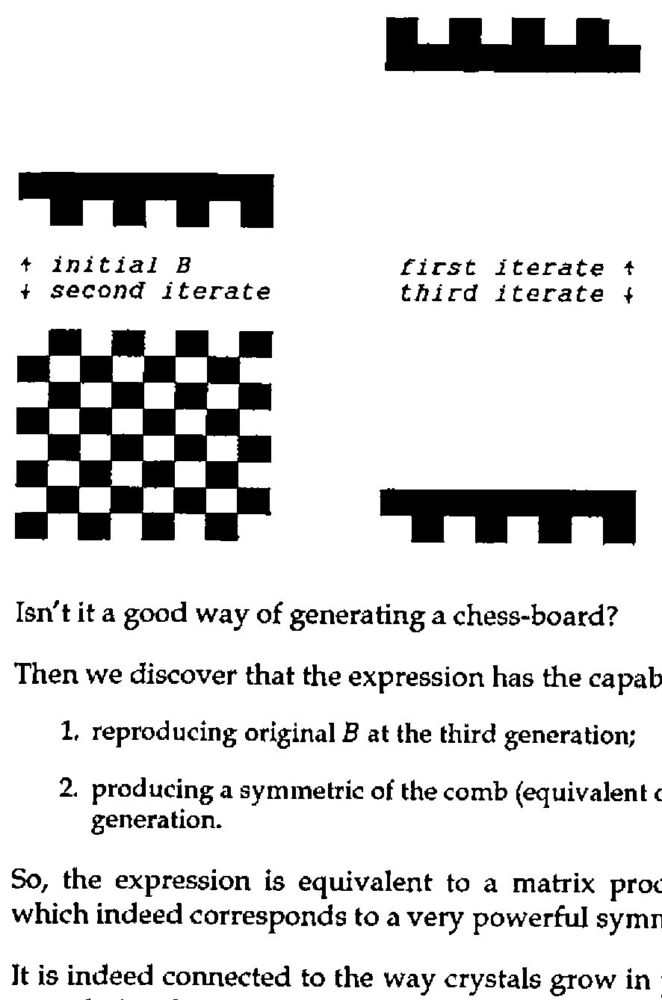
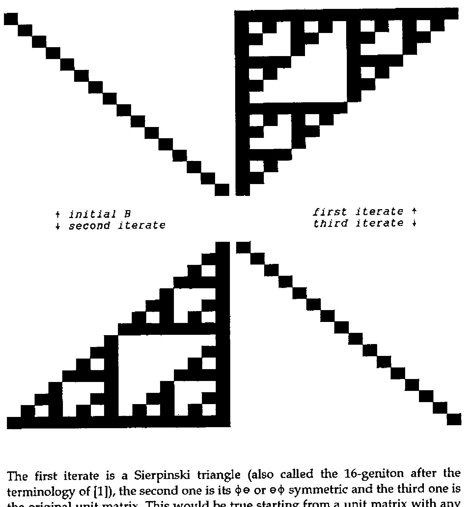
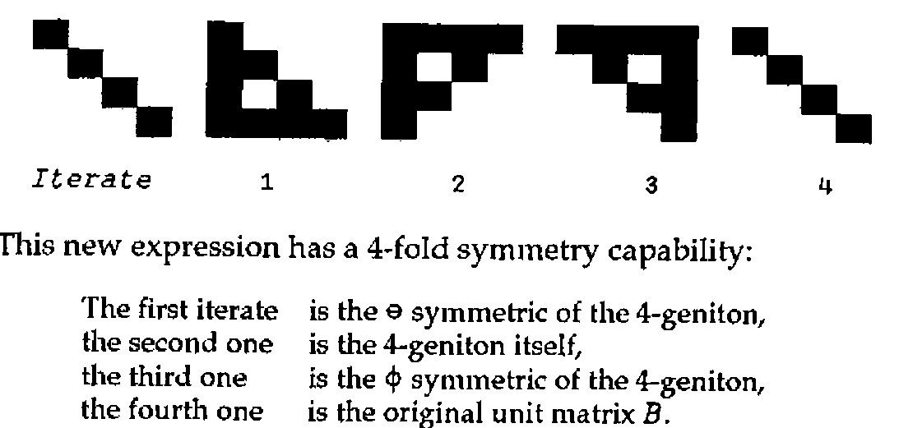
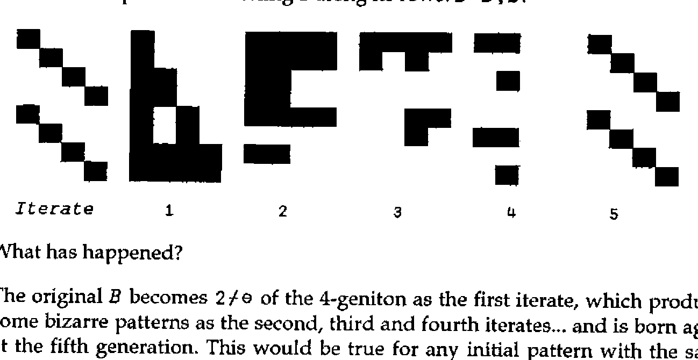
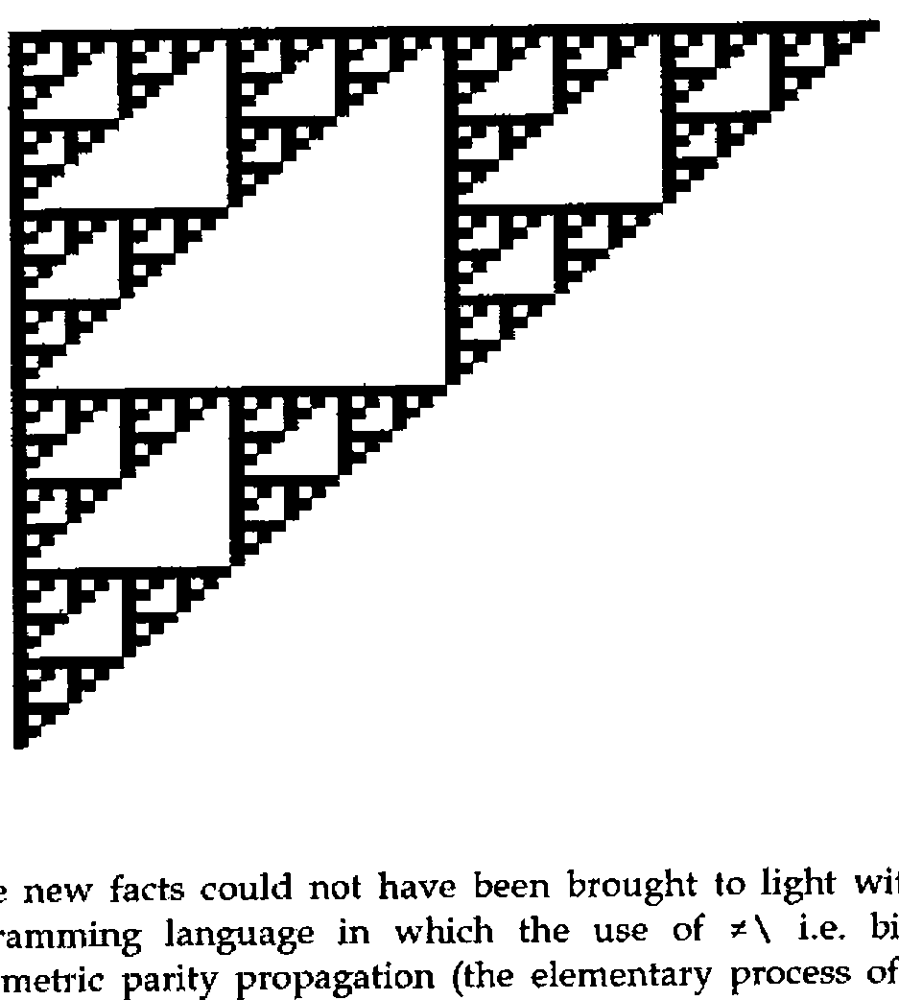

*by Gérard A. Langlet*
{ .byline }

## Abstract

The vital execute is an infinite loop which will execute a program or an expression as many times as possible. Iterations stop as soon as any error is encountered or when a break occurs. We ARE driven by such a force until death. So is Nature. So is the Universe which is, at the same time, fractal, symmetric and asymmetric.

## APL Simulation

Although it is possible to program such a concept in various APL-level-1 implementations, using error trapping which is not covered by the ISO standard, and then not fully compatible, we shall prefer the `⎕EA` (EXECUTE ALTERNATE) feature of APL2, which is simple, ignores error types and has been adopted by various implementers. *A* and *B* being APL statements, `A ⎕EA B` tries to execute *B*. If no error occurs, everything is all right; in the case of ANY error, the execution of *B* is interrupted, then *A* is executed. The best thing to do is to put into *A* an expression which never produces any error.

As an example, let us consider the following "vital-do" function which is short and self-explanatory:

```apl
    ∇ vdo ∆E
[1]   '→' ⎕EA ∆E ⋄ →1
    ∇
```

*∆E* is any APL expression. Character delta is used so as to allow the use of "normal names" within the expression. If no error occurs during execution of *∆E*, this function generates an infinite loop with it. If any error or break happens, then the absolute branch is executed so that *vdo* as well as the possible calling functions are stopped in a clean way, i.e. with a clear state indicator.

## Applications

For pedagogy as well as for everyday-programming, the vital execute simplifies the burden of controlling loops, unless one has disabled the break or interrupt key(s)! There is no more need to control the end of the loop. "vdo" is a synonym of "do it as much as you can", if not of LIFE itself.

```apl
Example:    I←5 ⋄ vdo '⍳I←I-1'            produces (in 1-origin)
1 2 3 4
1 2 3
1 2
1
            ←      (empty vector)
```

and stops automatically because `⍳¯1` has produced an error.

Do not try replacing "-" with "+", or buy paper and be patient!

The best usage of the vital execute we have found concerns automata, sorting (models for parallel processing), or data transforms (Fourier analogues in image-processing) especially when they involve recursive or fractal processes. Also, when programming in APL2, the "disclose" at various depths of sub-cells is not so easy, perhaps because of the absence of Iverson’s function-ranks concept, and "vdo" has brought some help. Of course, the left argument of `⎕EA` can contain many other statements than the absolute stack-clearing branch, even an empty vector, so that the control returns to the calling program. `'→0'` as the left argument of `⎕EA` may not be adequate in all cases, e.g. if *∆E* calls another function, because the branch concerns the called function and not the calling one; however this is what we shall do from now on, in this paper.

We now give a short example which is bound to symmetries in Nature and results from the theory of binary integration [1].

```apl
N←⍴B ⋄ vdo 'R←1↑⍴B⋄ K←1≠L←R⍴1 0⋄ A←L⌿B⋄ B←A≠K⌿B⋄ B←B,A' ⋄ B←N⍴B
```

Let *B* initially be a square bitmap with a dimension such as `2⍴8` and try to see what happens after successive iterations of the above-given expression, which has (as usual in RISC-programming style) no parentheses, no goto (*vdo* taking care of the loop), and moreover, does not make use of arithmetical primitives at all. the only logical scalar primitive is `≠` (*XOR*), `1≠` being formally equivalent to *NOT*.

In order to display bitmaps nicely, we shall use the following function:

```apl
    ∇ R←MAT R
[1]  R←2/' █'[R+⎕IO]
    ∇
```

The first candidate will be the *COMB* matrix; let us see what happens, iterating three times the expression with the following *B*.

```apl
      B←COMB←¯8 8↑1,[⎕IO-.1]8⍴1 0     ⍝ and displaying iterates:
```



Isn’t it a good way of generating a chess-board?

Then we discover that the expression has the capabilities of:

1. reproducing original *B* at the third generation;
2. producing a symmetric of the comb (equivalent of `⌽⊖COMB`) at the first generation.

So, the expression is equivalent to a matrix product (try to find which one!) which indeed corresponds to a very powerful symmetry operator.

It is indeed connected to the way crystals grow in plane layers, especially quasi-crystals in physics. More than that, such an expression is able to build a nice fractal.

Let us try with a unit Boolean matrix as initial *B*.

```apl
B←16 16⍴17↑1
```



The first iterate is a Sierpinski triangle (also called the 16-geniton after the terminology of [1]), the second one is its `⌽⊖` or `⊖⌽` symmetric and the third one is the original unit matrix. This would be true starting from a unit matrix with any size.

One can indeed relate the initial APL expression to matrix algebra, knowing the properties of genitons: the square of a geniton is its own binary matrix inverse, so that all genitons are cubic roots of the unit matrix. (The binary matrix inverse is, when it exists, given by `⎕CT>|⌹B` and the binary matrix product is `A∧.≠B` or `1∧2|A+.×B` which is faster in most implementations, `1∧` being useless in APL\*PLUS/PC, which has no Boolean coding, and in Dyalog-APL which converts to binary automatically.)

Now, let us try another version of the initial expression, after commuting the dimensions on which selections and catenations take place:

```apl
N←⍴B ⋄ vdo 'R←1↓⍴B⋄ K←1≠L←R⍴1 0 ⋄ A←L/B⋄ B←A≠K/B ⋄ B←A⍪B' ⋄ B←N⍴B
```

and try to display what happens to `B←4 4⍴5↑1` a smaller unit matrix:



This new expression has a 4-fold symmetry capability:

> The first iterate is the `⊖` symmetric of the 4-geniton,<br>
> the second one is the 4-geniton itself,<br>
> the third one is the `⌽` symmetric of the 4-geniton,<br>
> the fourth one is the original unit matrix *B*.

Let us now experiment doubling B along its rows: `B←B⍪B`:



What has happened?

The original *B* becomes `2⌿⊖` of the 4-geniton as the first iterate, which produces some bizarre patterns as the second, third and fourth iterates… and is born again at the fifth generation. This would be true for any initial pattern with the same size: the 5-fold symmetry has suddenly emerged from a very simple APL expression with no complex numbers, no square root of 5, no trigonometry, no exponential, no golden section and no apparent Fibonacci series, even no arithmetic.

The 5-fold symmetry operators are bound to Penrose tilings and concern many processes involved in Life (not only quasi-crystals): from the structure of many viruses to the ones of starfishes, of silk fibers, of many plants and of our hands. All symmetries of the Universe can result from applying just `≠` with some elementary rules, even the ones of helices (and double helices) as shown in [1] and some other previous papers. Holograms, Fourier-like transforms as well as impressive genetic automata also result from the unique properties and of the *exclusive* use of the same logical primitive (*Exclusive* OR).

```apl
B← 64 64 ⍴65↑1
```



These new facts could not have been brought to light without APL, the only programming language in which the use of `≠\` i.e. binary integration or asymmetric parity propagation (the elementary process of Nature, which also leads to rebuilding chaos theory and gives at last the explanation of Mendel’s laws as well as the one of Pauli’s principle), is really intuitive.

## References

[1] G.A. Langlet, *Towards the Ultimate APL-T.O.E.*, APL92, St Petersburg, Russia & APL Quote-Quad, ACM Press, USA (July 1992).
