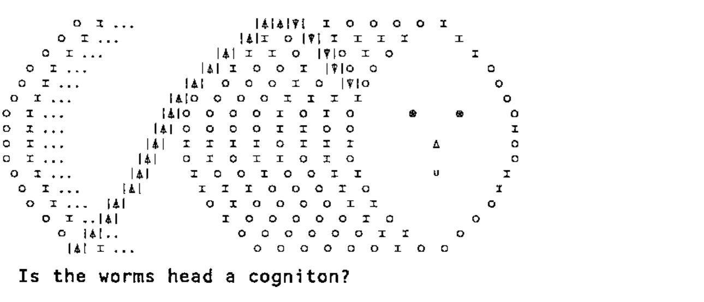
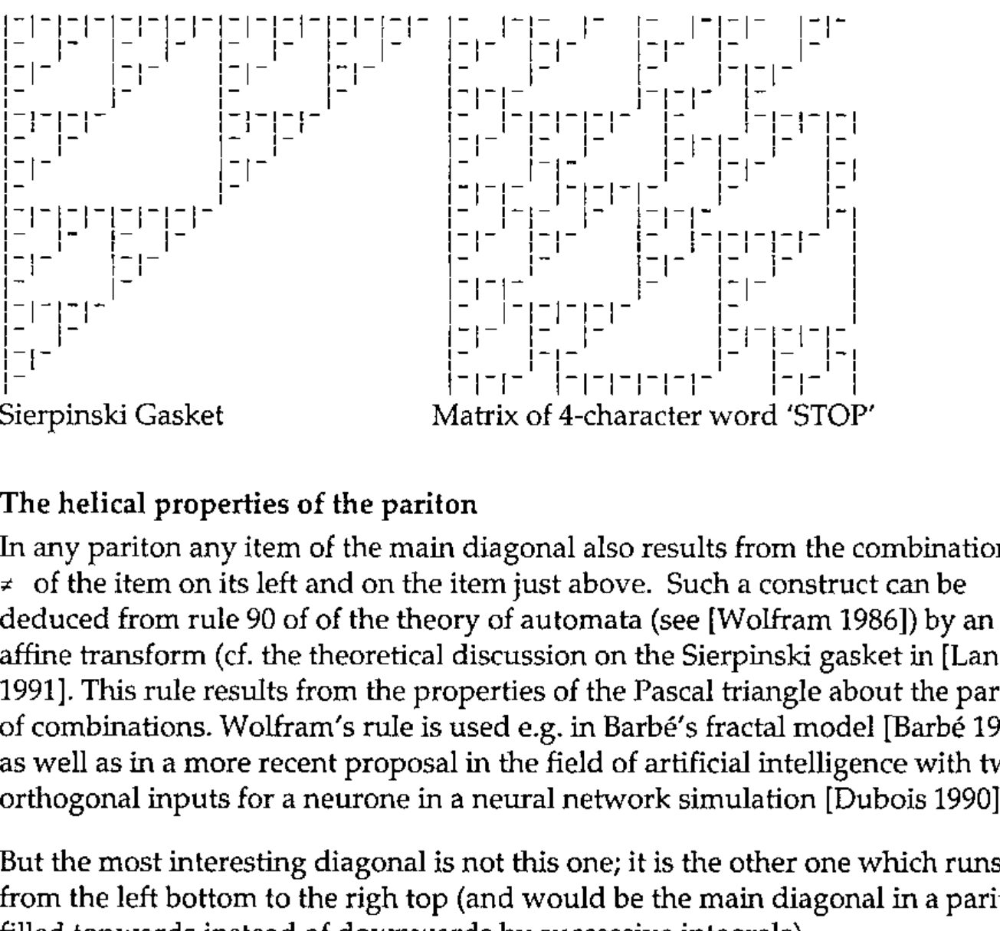

*The late Gérard A. Langlet, translated & edited by Sylvia Camacho*
{ .byline }

## Abstract

Recent developments in the sciences of Biology, Physics, Chemistry, Computing and Mathematics, together with interdisciplinary studies such as Linguistics, Music and Botany have been particularly impressive. Information handling is what these apparently disconnected disciplines have in common. This paper is the result of analysing ideas and concepts taken from all these viewpoints. The reduction of many algorithms to their most elementary components has shown that it is possible to use them to elucidate more and more natural phenomena. Not unexpectedly, the proposed model for Natural Information Processing is closely related to fractals such as are found in music, clouds, mountains, anatomy, astronomy, turbulence and earthquakes. The mathematical method is to use binary discrete logics to demonstrate the common underlying model. *Parity* is the essential, highly discontinuous, property involved in this theory. This should not surprise specialists in computer science or theoretical physics but may seem less familiar to biologists - although reproduction is indeed a parity and fractal problem. A second important property is *Symmetry/Asymmetry*. No attempt to create the model with continuous functions can be made because parity evolves abruptly, not smoothly, wherever it is found. Much work has still to be done: only observation and thinking can help.

### Remarks for readers who know APL

This text has been written to expound a new theory which is, we hope, potentially able to explain many phenomena in a large variety of domains. It has been found and built with the help of *APL* over several years of patient research. The fundamental reason – or perhaps faith - was that *APL* is so powerful that it must comprise the foundations of information processing, if not of human thought. This is why the author never stopped revisiting, compressing and simplifying all his algorithms (rejecting parentheses, branches, arrays, trigonometry etc. and even, recently, all arithmetic) until he discovered that the most useful primitive was `≠` and the most general and fantastic idiom `≠\` from which it is possible to rebuild, with the help of `∧` and `⊂`, anything (see a related paper about the Sierpinski gasket). It is even possible to reconstruct a model of the Universe and to explain its properties … which, after all, is not surprising if one knows that Nature was operating long before geometry, the theory of numbers, matrix algebra and continuous functions were invented by man.

The reader need not know *APL* at all. What is necessary, for expository purposes, is in the form of *Iverson’s notation*. This paper pays a sincere homage to Ken Iverson, whose work indeed helps people to think and not only to program. It is also in homage to Joseph de Kerf whose APL-CAM Journal contributes to the renown of *APL* throughout the European Community and even all over the world.

## Parity in bit sequences

Consider any sequence of information *I* in binary form e.g.

```text
011000010111000001101100                    (1)
```

The parity of a sequence may be defined as: 0 if the number of 1’s is even; 1 if the number of 1’s is odd.

*I* contains 1 in 10 different positions, so given the above definition the parity of *I* is 0. Parity is also the sum of all items of *I* modulo 2.

Parity is often used when transmitting information on a line to check the quality of transmission, i.e. the integrity of the message. Usually the transmitter inserts an extra bit after each group of bits and the receiver checks that this bit has the same parity as the group; if not this latter is considered ‘bad’ and the receiver asks for a second transmission. This procedure is a ‘checksum modulo 2’. A real checksum, i.e. a counting of all 1 bits, is done by all computers when files are written to tapes and disks and checked when reading from them.

Instead of adding 1 within an arithmetic register, initially set to 0, every time 1 is encountered in the bit sequence and then extracting the parity of the accumulated result, it is more efficient to propagate only the parity of successive bits using the properties of the Exclusive OR (XOR in computer jargon) in Boolean algebra.

Note: We shall use Iverson’s mathematical notation in what follows because it has been standardised by ISO [ISO 1989]; all expressions are simple: they can be immediately verified and used ‘as is’ in interactive mode on many computers, in especial most of the personal ones.

XOR is denoted `≠` so that:

```text
0 ≠ 0 is 0   (0 is not different from 0)
0 ≠ 1 is 1
1 ≠ 0 is 1
1 ≠ 1 is 0   (1 is not different from 1).
```

This operation is commutative. Its contrary (NOT XOR) is denoted `=` so that `0 = 0` is 1, `0 = 1` is 0, etc.

An arithmetic sum is denoted `+/` so that `+/` applied to any bit sequence gives the number of 1’s within this sequence (upper case SIGMA in mathematics). Of course `+/` can be applied to any sequence of numbers, integer or not, in order to produce its sum. The result is a scalar when the argument is a one-dimensional array. A statement such as `+/I` with *I* equal to the above sequence (1) would display the number 10 since *I* contains 10 bits set to 1.

Compare with the FORTRAN90 statement: S=SUM(I) (with I a numeric vector, i.e. a one-dimensional array), followed by a PRINT or WRITE statement in order to display S (cf [Metcalf 1990] page 182).

The symbol `/` denotes reduction. So, in `+/I`, vector *I* is reduced by `+` and the result is automatically displayed because it is not assigned to any variable name. By contrast `S ← +/I` will assign the result to *S* without displaying it. So statement *S*, that is the variable name alone, displays the contents of *S*. The backslash symbol `\` denotes *scan*, i.e. a propagation or cumulation.

(There are equivalent statements in programming languages such as \*LISP or C++ for parallel computers but not in FORTRAN90).

The result of `\` is an array of the same shape as the argument: if *I* is a vector the result is a vector of the same length. The first item of the result is always equal to the first item of the argument and does not depend on the function (e.g. `+`) which is being propagated. The propagation of addition is denoted `+\` and all intermediate sums are present in the result.

```text
so     +\ 1 2 3 4 is 1 3 6 10  (a vector)
while  +/ 1 2 3 4 is 10        (a scalar i.e. the last number of the result of +\).
```

Other functions may be used with `\`:

```text
so     ×\ 1 2 3 4 is 1 2 6 24  (i.e. 1!, 2!, 3!, 4! in conventional mathematics)
and    ×/ 1 2 3 4 is 24        (i.e. upper case PI in mathematics)
and    ≠\ 0 1 1 0 0 0 0 1 0 1 1 1 0 0 0 0 0 1 1 0 1 1 0 0
gives:    0 1 0 0 0 0 0 1 1 0 1 0 0 0 0 0 0 1 0 0 1 0 0 0
while  ≠/ 0 1 1 0 0 0 0 1 0 1 1 1 0 0 0 0 0 1 1 0 1 1 0 0
is        0                    (which is the last item of the result of its ≠\).
```

*Every item in the result of `≠\` applied to any sequence of bits represents the accumulated PARITY from the beginning of the sequence (first item) to the current item. This may be considered as a theorem. The last (rightmost) item, also given by `≠\`, is the parity of the sequence (corollary).*

Since there is no notation in mathematics to represent operations such as `≠/` `≠\` `=/` `=\` or a few others we shall define later, we are grateful to Iverson for having invented his own linear notation which considerably simplifies the exposition of concepts and the demonstration of theorems and the development of algorithms for parallel computing. However, his use of indices, exponents and Greek letters will be avoided here.

## The bricks of parity logics

In Iverson’s notation [Iverson 1962], [ISO 1989], an important notion is ‘scalar extension’.

For any scalar dyadic function such as `+ - × ÷ ≠` etc. when one of the two arguments is a scalar (or, in many implementations, a one-item array which gets forced to a scalar) the scalar is extended, by intrinsic replication to the dimensions of the other argument. Thus scalar operations are applied itemwise within arrays of any shape and dimension, provided both arguments have the same shape and dimension or provided one argument is scalar or a one item array.

(This was a fantastic simplification and proves nowadays to be so useful for array processors and parallel computers that it has been introduced into many other computer languages).

Thus statements `2 2 2 + 5 6 7` or `2 + 5 6 7` or `5 6 7 + 2` or `5 6 7 + 2 2 2` are equivalent and produce `7 8 9`.

Let us come back to the parity domain and take any binary sequence such as:

```text
   V
1100110111100001
```

using only `≠ 0 1` as hypothetical bricks, we can generate: The dummy function whose output equals its input:

```text
   0≠V
1100110111100001
```

The binary negation NOT:

```text
   1≠V
0011001000011110
```

Death, flat encephalogram:

```text
   V≠V
0000000000000000
```

Spacefill: (The result of `V≠V` is negated) (Expressions are executed from RIGHT to LEFT)

```text
   1≠V≠V
1111111111111111
```

Let us take *W* as another sequence of bits with the same length as *V*:

```text
   W
1110010000001100
```

and when we compare: (The result of `V≠W` if negated) (Expressions are executed from RIGHT to LEFT)

```text
   1≠V≠W
1101011000010010
```

with:

```text
   V=W
1101011000010010    we see it is the same.
```

From the BRICKS 1 and XOR we have generated NOT and then NXOR. Since 0 is the intrinsic result of 1 XOR 1 it follows that 0 is NO LONGER an ELEMENTARY BRICK ‘quod erat demonstrandum’.

## Integrals and differentials

`+/`produces the sum of any numerical or logical sequence (‘True’ and ‘False’ being respectively designated 1 and 0). Then `+\` can be used to plot the integral of any function computed at regular intervals provided the number of intervals is big enough for a good approximation in the discrete domain. Similarly, `≠\` may be used to plot a *parity integral* on 2 different levels (0 and 1) along the ordinate axis. Then `≠\≠\` i.e. `≠\` applied twice is the parity integral of the parity integral. Such a process can be iteratively applied and will lead to interesting results. But before explaining the consequences of these operations in the Boolean domain we note that:

*While `+/` and `+\` may introduce errors in their numerical result because of limited computer precision for rational numbers, `≠/` and `≠\` will never do so: their result is always exact for any bit sequence.*<br>
*If `≠\` is applied iteratively to any finite sequence of m bits, a PERIODICITY will appear after a finite number c (the cycle) of iterations.*

A fundamental question arises: what is the inverse function of `≠\` ? Given the result of `≠\` on a sequence is it possible to reproduce the original sequence from it, i.e. to find the ‘parity differential’? The answer is yes. The first item of `≠\` applied to any sequence *I* is the first item of the sequence *I*, so this we already know. Let *J* be the result of `≠\I` and let *K* be the result of dropping the first item of *J* and let *L* be the result of dropping the last item of *J*. Thus K and L have the same length permitting comparison. Compute `K ≠ L` obtaining *M* and ‘stick’ or ‘catenate’ it to the retained first item of *J*. This reproduces *I*.

Expressed in natural language this means that the parity differential *I* of *J* is the first item of *J* followed by the result of the application of the exclusive OR, itemwise, to the first and second items of *J*, then to the second and third items of *J*, etc. This is a Boolean finite difference on *J*.

This procedure is not so simple as its inverse `≠\` as it involves cutting the sequence in two locations and sticking the pieces together again after itemwise application of `≠` ; this requires more energy. However, it is noticeable that up to here the only logical operation involved is `≠` : *cut* and *stick* being structuring operations. Moreover, there is another way of doing it: the *wait-and-see* method.

### The Pariton

The phrases *parity integral* and *propagation of the binary difference* are equivalent because the parity integral is the result of the propagation of the binary difference. After a while we shall use only the words *integral* or *integration* and *differential* and omit *parity*.

Let us define the PARITON as the Boolean MATRIX containing as rows, the differing bit sequences of successive parity integrals of an original bit sequence. (The PARITON may be the same as Prof. Stonier’s hypothetical ‘infon’ [Stonier 1990]).

It can also be viewed as a linear cellular automaton (see [Wolfram 1986]). The initial state is a sequence of *m* bits, *m* being, to keep things simple, a power *p* of 2 (i.e. 2 4 8 16 32 etc). The matrix rows are the time-dependent (generations) or successive states of the automaton. If *p*=0 the automaton is static: the pariton has 1 row and 1 column and it contains the initial state. Its parity has the same value and so have all integrals or differentials, 0 or 1. (It behaves like the exponential function whose integral is itself).

For *p*=1, there are 4 different combinations for the initial sequences: 0 0, 0 1, 1 0, 1 1, i.e. the 2-bit representation of the numbers 0, 1, 2, 3. The automaton is static (i.e. unchanging) if the left bit is 0, i.e. for the first two possibilities. This can be generalised to show that if the leftmost half of any sequence is filled with 0 then changes are confined to the right hand half: the automaton is ‘degenerate’ being equivalent to that for *p*-1 instead of *p*. It also implies that, if *m* (the number of bits in the sequence) is not a power of 2 that the automaton if left-filled with 0’s will be equivalent to the automaton with *p* set to the next integer capable of encompassing length m.

The parity integral of 1 0 being 1 1 and conversely, the first dynamic (oscillating) pariton is the square matrix containing these two sequences as rows and so having parity alternating between 0 and 1. An important consequence follows immediately. Such a matrix is the smallest generating pattern of the Sierpinski gasket and thus connects the pariton with *fractal geometry*. See [Langlet 1991].

The parity integral of 1 followed by any number of 0’s contains only 1’s. This results from the fact that the parity propagated from the left to the right, even to infinity, can only be 1. The parity integral of an all-1 sequence is an alternate sequence 1 0 1 0 … (grey vector or zebra).

For *p*=2 the pariton will have 4 columns. For the reasons discussed above, only the cases for which there is at least one 1 in the two leftmost positions have to be discussed, i.e. 0 1 0 0 , 0 1 0 1, 0 1 1 0, 0 1 1 1, plus the same states as these 4 having 1 instead of 0 in the leftmost position i.e. 1 0 0 0, 1 0 0 1, 1 0 1 0, 1 0 1 1 and 4 having 1 1 in the leftmost position i.e. 1 1 0 0, 1 1 0 1, 1 1 1 0, 1 1 1 1. These 12 states correspond to binary 4,5,6,7,8,9,10,11,12,13,14,15. Choosing any one of these as the initial state and iterating `≠\` will cause the automaton to fall into one of 3 cycles: 4 7 5 6 4 …, 9 14 11 13 9 …, 8 15 10 12 8 … Thus there will be altogether 3 different possible constructs with periodicity 4 for p=2 (or for 2 &lt; *m* ≤ 4).<br>
[Readers may find it helpful to play using the function below: SMC]

```apl
     r←length cycle value;⎕io;boo;mat
[1]   ⍝ show ≠\ scan cycle for boolean
[2]   ⍝ of given length and value
[3]    ⎕io←0 ⋄ r←,value
[4]    boo←(length⍴2)⊤value
[5]    →((2⊥boo)≠value)/err ⋄ mat←(1,length)⍴boo
[6]   l1:boo←≠\boo ⋄ mat←mat⍪boo
[7]    r←r,2⊥boo
[8]    →((1↑r)=¯1↑r)/end ⋄ →l1
[9]   err:'length ',(⍕length),' insufficient for ',⍕value
[10]   →0
[11]  end:→(32<⍴mat)/out
[12]   mat
[13]  out:'cycle of ',(⍕¯1+⍴r),' values ',⍕r
```

*The periodicity of integrals or, conversely, of parity differentials – that is the length of the cycle (c) will always equal 2 to the power p (integer) for non-degenerate sequences.*

*An immediate consequence is that the parity differential for any non-degenerate sequence of bits can also be obtained as the (c-1)th parity integral, without cutting and sticking the sequence as shown above (this is the WAIT-AND-SEE method). No algorithm other than the iteration of `≠\` is necessary. The more difficult way proposed above for parity differential may be ignored unless it is required as a ‘shortcut’ when periodicity (c) is very large or as a possible repair mechanism when a ‘mutation’ (unknown error) has disrupted somewhere the perfect regularity of the integrating process.*

### The cyclic memory

The pariton, like a matrix, is a topological entity. It can take numerous shapes. It is not bound by any Euclidian constraint (not even by the first postulatum). As soon as periodicity has been quantified we can consider the pariton either as a DISCRETE CYLINDER or as a flat matrix. Every row will lie on a generating line and the successive parities (last items) of every row form the apices of a polygon which, if *p* is large enough, will look like a circle or section of a cylinder. So let us examine more attentively the properties of the pariton as a matrix keeping in mind its potential cylindricity.

Considering that successive rows represent different temporal states of the original information in the *I* sequence and, starting from ANY row randomly, we can retrieve this sequence after performing from 1 to *c*-1 integrations. When c is large enough, information coded in an alphabet of about 32 symbols, e.g. the Roman alphabet and the blank plus some punctuation and separators (.:?-) extracted from an 8-bit ensemble i.e. 256 possible configurations (as is found on almost all computers), the probability that any other row than the one we look for could also contain meaningful information with all successive sequences of 8 bits belonging to 32 among 256 is already quite low (0.2% for 4 characters i.e. 32 bits). It decreases very quickly as *c* increases. Such a pariton occupies 1024 bits i.e. 128 bytes.

A 128-character sentence (about one and a half lines of text in a book) considered as a body of information, generates a pariton with 1024 rows and 1024 columns occupying 128 kilobytes. This is not much in comparison with the memory available on desk-top computers and negligible by comparison with human brain capacity. We shall see that most practical applications discussed here involve small paritons only.

From the rightmost column R, which contains the parities of all rows and which is, on the cylinder, a circular sequence of bits with no origin and no end and thus atemporal, one can deduce the whole cylinder and thence find the original information. This is done in the following way: we define the minus-one-step circular-shift operation, which is not arithmetic, calling it CSM1. For reasons of symmetry we also define CSP1 i.e the plus-one-step circular-shift operation.

*Some implementations of Iverson’s notation allow direct definitions such as `CSM1←¯1⌽` and `CSP1←1⌽` ,using `⌽` (the circular shift symbol). Circular lists exist in LISP where such definitions could also be established easily. Even in FORTRAN90 a CSHIFT statement has been introduced and runs beautifully on the Connection Machine.*

`R ≠ CSM1 R` produces Q, i.e. the last but one column of the pariton matrix (this is a parallel differential operation as shown above). The same application to Q produces P i.e. the column to the left of Q, etc. for *c*-1 iterations.

If the original sequence was degenerate the number of iterations becomes smaller. Just stop when all bits in the same column are 0 or 1 and fill the left columns with 0’s in order to get a square matrix. The application of CSP1 instead of CSM1 would yield a completely different pariton: the direction of the shift, i.e. of the spatial orientation (spin) is of primary importance. On the other hand, when the pariton is filled storing the first integral in the last row, the second integral in the last-but-one row, etc. until the *c*th integral, i.e. the original sequence in the highest row, then this pariton is the image of the other in a horizontal mirror. So CSP1 is the correct appication to retrieve the mirrored pariton from circular memory, the spin of it being also reversed.

The pariton itself is highly asymmetric, unlike a magic square or an optical hologram. We have not yet explored the properties of the diagonals, which on a cylinder correspond to helices.



This procedure shows that the circle on the right contains all the information: it resembles the toruses of the ferrite memory of early computers. We will call it a COGNITON. Conversely the left column only conveys the information that the first bit of the original sequence is either 0 or 1. In between the pariton contains only fuzzy circles, i.e. with the correct intermediate coding for the sequence from the first bit to the bit number matching the column position in the matrix.

The period of the left half of the pariton is half that of the whole (*c*) pariton and the period of the left fourth of the pariton is one fourth of *c* etc. up to the first column in which all bits are the same and which has, of course, a period of 1. Even if all the columns except the last but one of a pariton are destroyed it is always possible to start from this remnant. Just one bit (the last one on the right) may be wrong as one chooses arbitrarily between 0 and 1. The probability of reading correctly the whole message when the last two columns are scratched or corrupted is still high. One may get a mistake, a misspelling of the last character. Anyway everything that has been said about the pariton has symmetric properties. If one has taken the precaution to code an anti-pariton i.e. starting from left to right, there will be significant redundancy.


32-bit Pariton Matrix coding the 4-character word ‘STOP’<br>
(In most computers in which the 128 ASCII characters are the FIRST half of the 256 ones in an 8-bit set.)

```text
                                                       Parity Integral No.
0 1 1 0 0 0 1 0 0 1 1 0 0 1 1 1 1 0 0 0 1 0 1 0 0 1 1 0 0 0 0 0  1
0 1 0 0 0 0 1 1 1 0 1 1 1 0 1 0 1 1 1 1 0 0 1 1 1 0 1 1 1 1 1 1  2
0 1 1 1 1 1 0 1 0 0 1 0 1 1 0 0 1 0 1 0 0 0 1 0 1 1 0 1 0 1 0 1  
0 1 0 1 0 1 1 0 0 0 1 1 0 1 1 1 0 0 1 1 1 1 0 0 1 0 0 1 1 0 0 1  4
0 1 1 0 0 1 0 0 0 0 1 0 0 1 0 1 1 1 0 1 0 1 1 1 0 0 0 1 0 0 0 1  
0 1 0 0 0 1 1 1 1 1 0 0 0 1 1 0 1 0 0 1 1 0 1 0 0 0 0 1 1 1 1 0  
0 1 1 1 1 0 1 0 1 0 0 0 0 1 0 0 1 1 1 0 1 1 0 0 0 0 0 1 0 1 0 0  
0 1 0 1 0 0 1 1 0 0 0 0 0 1 1 1 0 1 0 0 1 0 0 0 0 0 0 1 1 0 0 0  8
0 1 1 0 0 0 1 0 0 0 0 0 0 1 0 1 1 0 0 0 1 1 1 1 1 1 1 0 1 1 1 1  
0 1 0 0 0 0 1 1 1 1 1 1 1 0 0 1 0 0 0 0 1 0 1 0 1 0 1 1 0 1 0 1  
0 1 1 1 1 1 0 1 0 1 0 1 0 0 0 1 1 1 1 1 0 0 1 1 0 0 1 0 0 1 1 0  
0 1 0 1 0 1 1 0 0 1 1 0 0 0 0 1 0 1 0 1 1 1 0 1 1 1 0 0 0 1 0 0  
0 1 1 0 0 1 0 0 0 1 0 0 0 0 0 1 1 0 0 1 0 1 1 0 1 0 0 0 0 1 1 1  
0 1 0 0 0 1 1 1 1 0 0 0 0 0 0 1 0 0 0 1 1 0 1 1 0 0 0 0 0 1 0 1  
0 1 1 1 1 0 1 0 1 1 1 1 1 1 1 0 0 0 0 1 0 0 1 0 0 0 0 0 0 1 1 0  
0 1 0 1 0 0 1 1 0 1 0 1 0 1 0 0 0 0 0 1 1 1 0 0 0 0 0 0 0 1 0 0  16
0 1 1 0 0 0 1 0 0 1 1 0 0 1 1 1 1 1 1 0 1 0 0 0 0 0 0 0 0 1 1 1  
0 1 0 0 0 0 1 1 1 0 1 1 1 0 1 0 1 0 1 1 0 0 0 0 0 0 0 0 0 1 0 1  
0 1 1 1 1 1 0 1 0 0 1 0 1 1 0 0 1 1 0 1 1 1 1 1 1 1 1 1 1 0 0 1  
0 1 0 1 0 1 1 0 0 0 1 1 0 1 1 1 0 1 1 0 1 0 1 0 1 0 1 0 1 1 1 0  
0 1 1 0 0 1 0 0 0 0 1 0 0 1 0 1 1 0 1 1 0 0 1 1 0 0 1 1 0 1 0 0  
0 1 0 0 0 1 1 1 1 1 0 0 0 1 1 0 1 1 0 1 1 1 0 1 1 1 0 1 1 0 0 0  
0 1 1 1 1 0 1 0 1 0 0 0 0 1 0 0 1 0 0 1 0 1 1 0 1 0 0 1 0 0 0 0  
0 1 0 1 0 0 1 1 0 0 0 0 0 1 1 1 0 0 0 1 1 0 1 1 0 0 0 1 1 1 1 1  24
0 1 1 0 0 0 1 0 0 0 0 0 0 1 0 1 1 1 1 0 1 1 0 1 1 1 1 0 1 0 1 0  
0 1 0 0 0 0 1 1 1 1 1 1 1 0 0 1 0 1 0 0 1 0 0 1 0 1 0 0 1 1 0 0  
0 1 1 1 1 1 0 1 0 1 0 1 0 0 0 1 1 0 0 0 1 1 1 0 0 1 1 1 0 1 1 1  
0 1 0 1 0 1 1 0 0 1 1 0 0 0 0 1 0 0 0 0 1 0 1 1 1 0 1 0 0 1 0 1  
0 1 1 0 0 1 0 0 0 1 0 0 0 0 0 1 1 1 1 1 0 0 1 0 1 1 0 0 0 1 1 0  
0 1 0 0 0 1 1 1 1 0 0 0 0 0 0 1 0 1 0 1 1 1 0 0 1 0 0 0 0 1 0 0  
0 1 1 1 1 0 1 0 1 1 1 1 1 1 1 0 0 1 1 0 1 0 0 0 1 1 1 1 1 0 0 0  
0 1 0 1 0 0 1 1 0 1 0 1 0 1 0 0 0 1 0 0 1 1 1 1 0 1 0 1 0 0 0 0  32
[------S------] [------T------] [------O------] [-------P------]
                                                        COGNITON
                                                  circular memory
```

Note that in rows 8,16 and 24, ‘S’ is reproduced, ( ‘ST’ in row 16).<br>
The fractal character appears in many places (0 triangles). Note that the 32 bit Sierpinski gasket would be 1 followed by 31 zeros.

HELIX TRANSFORM of ‘STOP’ (diagonal from left to right, bottom to top):<br>
`01000110000001110001101100011110`<br>
COGNITON for word ‘STOP’ (ATEMPORAL: with no origin and no end):<br>
`01111000110011001110000100110000`<br>
The FIRST BIT is the LAST BIT of the first integral i.e. the PARITY of the bit conversion of ‘STOP’ (matches row 32 in which 14 bits are 1).



### The helical properties of the pariton

In any pariton any item of the main diagonal also results from the combination by `≠` of the item on its left and on the item just above. Such a construct can be deduced from rule 90 of of the theory of automata (see [Wolfram 1986]) by an affine transform (cf. the theoretical discussion on the Sierpinski gasket in [Langlet 1991]. This rule results from the properties of the Pascal triangle about the parity of combinations. Wolfram’s rule is used e.g. in Barbé’s fractal model [Barbé 1988] as well as in a more recent proposal in the field of artificial intelligence with two orthogonal inputs for a neurone in a neural network simulation [Dubois 1990].

But the most interesting diagonal is not this one; it is the other one which runs from the left bottom to the righ top (and would be the main diagonal in a pariton filled topwards instead of downwards by successive integrals).

*In any pariton, if any sequence I produces a diagonal D, a sequence equal to D produces a diagonal which contains I.*<br>
So *D* will be named - *I* from now on (no confusion can arise from the minus sign because the pariton involves no arithmetic).<br>
*It means that –I is the* helix inverse *or* helix transform *of D.*<br>
(-*I* could be written *I* -1 by analogy with matrix algebra).<br>
*As a corollary, any* row *of the matrix has its corresponding* helix inverse *on the cylinder.*

And the other diagonal *D′* (the main diagonal in our setting) also has some properties. If *I* is the information the diagonal for *D′*, taken as the information, is not *I*. It will be necessary to iterate this regressive application many times (a power of 2) in order to obtain *I* again.

*So the properties of paritons permit a full decoding from any helical path providing no bits have changed in the selected direction.*<br>
*There is a strong anisotropy between the two possible helix orientations: one of them provides from a pariton of any size an immediate transform capability but the other only has a very-long-term transform capability.*<br>
*Moreover, any labyrinthine walk from any row on the left to any row on the right, provided the full path is known (e.g. 3 steps up, 2 steps right, 1 step down etc. just like walking in a ruined city – briefly any ‘taxi run’, after the theory of automata) should allow the pariton to be reconstructed with full integrity.*

&gt;&gt; The pariton is a kind of:

| | |
|---|---|
| *easy to learn* | (mastery of only one Boolean application is required). |
| *secure* | (it has – or rather it is – an automatic parity check) |
| *asymmetric* | (the consequence of monodirectional propagation). |
| *discrete* | (by definition). |
| *hologram-like* | (at any scale without loss of precision). |

MEMORY

```apl
     r←length matrix value;⎕io;boo;vec
[1]   ⍝ show ≠\ scan cycle for boolean
[2]   ⍝ of given length and value
[3]    ⎕io←0 ⋄ r←(0,length)⍴0
[4]    boo←(length⍴2)⊤value
[5]    →((2⊥boo)≠value)/err ⋄ vec←,value
[6]   l1:boo←≠\boo ⋄ r←r⍪boo
[7]    vec←vec,2⊥boo
[8]    →((1↑vec)=¯1↑vec)/0 ⋄ →l1
[9]   err:'length ',(⍕length),' insufficient for ',⍕value

     r←helix nums;⎕io;c;left;right
[1]   ⍝ create nums half of helix transform table
[2]    ⎕io←0 ⋄ c←¯1
[3]    r← 3 0 ⍕ 32 1 ⍴nums
[4]    left←⍉(6⍴2)⊤nums
[5]    right← 32 6 ⍴0
[6]   l1:→(32=c←c+1)↑end
[7]   ⍝ boolean of diagonal into c row of right hand column
[8]    right[c;]←⌽(0 0)⍉⌽(6 6)↑6 matrix nums[c]
[9]    →l1
[10]  end:r←' ',r,' ',⍕left
[11]   r←r, 3 0 ⍕ 32 1 ⍴2⊥⍉right
[12]   r←r,' ',⍕right
```

[The above functions may be used to create the table below – SMC]

### Helix Tranform for all 6-bit configurations

```text
 N produces N′                      N produces N′
 0 0 0 0 0 0 0  0 0 0 0 0 0 0    32 1 0 0 0 0 0 51 1 1 0 0 1 1
 1 0 0 0 0 0 1  1 0 0 0 0 0 1    33 1 0 0 0 0 1 50 1 1 0 0 1 0
 2 0 0 0 0 1 0  3 0 0 0 0 1 1    34 1 0 0 0 1 0 48 1 1 0 0 0 0
 3 0 0 0 0 1 1  2 0 0 0 0 1 0    35 1 0 0 0 1 1 49 1 1 0 0 0 1
 4 0 0 0 1 0 0  5 0 0 0 1 0 1    36 1 0 0 1 0 0 54 1 1 0 1 1 0
 5 0 0 0 1 0 1  4 0 0 0 1 0 0    37 1 0 0 1 0 1 55 1 1 0 1 1 1
 6 0 0 0 1 1 0  6 0 0 0 1 1 0    38 1 0 0 1 1 0 53 1 1 0 1 0 1
 7 0 0 0 1 1 1  7 0 0 0 1 1 1    39 1 0 0 1 1 1 52 1 1 0 1 0 0
 8 0 0 1 0 0 0 15 0 0 1 1 1 1    40 1 0 1 0 0 0 60 1 1 1 1 0 0
 9 0 0 1 0 0 1 14 0 0 1 1 1 0    41 1 0 1 0 0 1 61 1 1 1 1 0 1
10 0 0 1 0 1 0 12 0 0 1 1 0 0    42 1 0 1 0 1 0 63 1 1 1 1 1 1
11 0 0 1 0 1 1 13 0 0 1 1 0 1    43 1 0 1 0 1 1 62 1 1 1 1 1 0
12 0 0 1 1 0 0 10 0 0 1 0 1 0    44 1 0 1 1 0 0 57 1 1 1 0 0 1
13 0 0 1 1 0 1 11 0 0 1 0 1 1    45 1 0 1 1 0 1 56 1 1 1 0 0 0
14 0 0 1 1 1 0  9 0 0 1 0 0 1    46 1 0 1 1 1 0 58 1 1 1 0 1 0
15 0 0 1 1 1 1  8 0 0 1 0 0 0    47 1 0 1 1 1 1 59 1 1 1 0 1 1
16 0 1 0 0 0 0 17 0 1 0 0 0 1    48 1 1 0 0 0 0 34 1 0 0 0 1 0
17 0 1 0 0 0 1 16 0 1 0 0 0 0    49 1 1 0 0 0 1 35 1 0 0 0 1 1
18 0 1 0 0 1 0 18 0 1 0 0 1 0    50 1 1 0 0 1 0 33 1 0 0 0 0 1
19 0 1 0 0 1 1 19 0 1 0 0 1 1    51 1 1 0 0 1 1 32 1 0 0 0 0 0
20 0 1 0 1 0 0 20 0 1 0 1 0 0    52 1 1 0 1 0 0 39 1 0 0 1 1 1
21 0 1 0 1 0 1 21 0 1 0 1 0 1    53 1 1 0 1 0 1 38 1 0 0 1 1 0
22 0 1 0 1 1 0 23 0 1 0 1 1 1    54 1 1 0 1 1 0 36 1 0 0 1 0 0
23 0 1 0 1 1 1 22 0 1 0 1 1 0    55 1 1 0 1 1 1 37 1 0 0 1 0 1
24 0 1 1 0 0 0 30 0 1 1 1 1 0    56 1 1 1 0 0 0 45 1 0 1 1 0 1
25 0 1 1 0 0 1 31 0 1 1 1 1 1    57 1 1 1 0 0 1 44 1 0 1 1 0 0
26 0 1 1 0 1 0 29 0 1 1 1 0 1    58 1 1 1 0 1 0 46 1 0 1 1 1 0
27 0 1 1 0 1 1 28 0 1 1 1 0 0    59 1 1 1 0 1 1 47 1 0 1 1 1 1
28 0 1 1 1 0 0 27 0 1 1 0 1 1    60 1 1 1 1 0 0 40 1 0 1 0 0 0
29 0 1 1 1 0 1 26 0 1 1 0 1 0    61 1 1 1 1 0 1 41 1 0 1 0 0 1
30 0 1 1 1 1 0 24 0 1 1 0 0 0    62 1 1 1 1 1 0 43 1 0 1 0 1 1
31 0 1 1 1 1 1 25 0 1 1 0 0 1    63 1 1 1 1 1 1 42 1 0 1 0 1 0
```

Up to 6 bits, the Helix inverse (or transform) of any sequence is also a generating line (row) on the same cylinder.<br>
This table also gives helix inverses for 2 and 4-sequences if one ignores the zeros on the left.<br>
*2 PRODUCES 3 and 3 PRODUCES 2 (with the two rightmost bits); This couple is the Sierpinski gasket generator (cf. [Langlet 1991]).*

The complement of the corresponding Matrix

```text
[1 0]   is   [0 1]
[1 1]        [0 0]
```

When using conventional matrix algebra, e.g. to perturbate ‘invariant subspaces’ with a supposed continuous variation of eigenvalues, if the leftmost zero of the second row becomes EPSILON then difficulties appear: see [Stewart & Sun 1990] for a full mathematical exposition of the subject within the matrix perturbation theory. This cannot happen with the discrete pariton theory.

### Pariton Dynamics

If one breaks the corners off the following discrete triangle what remains?

```text
   o
  o o
 o   o
o o o o
```

The answer is:

```text
  o o
 o   o
  o o
```

Knowing that the upper pattern generates the Sierpinski triangle by autosimilarity, the lower pattern – a hexagon which looks like the structure of the graphite crystal – will create, if we add intermediate points, a pattern of scaling dodecagons. Our brain which tries to find contours everywhere, creating the illusion of continuity, will ‘see’ circles. This construct will give a picture very close to the famous problem invented by Apollonios of Perga (circa 200 BC) which although a priori continuous is historically the first approach to fractals in plane geometry, long before Cantor, von Koch, Julia, Sierpinski, Mandelbrot and Menger. Let us add that the paradox of Achilles and the turtle can also be considered as a fractal. Solitaire and many other games are fractal ancestors of the cellular automata proposed by Conway and Wolfram.

A cylindrical pariton, seen from the distance along its axis looks like a circle, though it is always a ‘power-of-2-gon’ without sides. If we consider it as a rotating drum we can build a set of gear wheels. Then the pariton is able to deliver its information (by electric or magnetic influence if we associate with the bits some charges or spins) to many other cylinders: this is exactly what a laser printer does (unfortunately producing only one copy at a time). Pixels or characters are also processed this way by rotary printing presses when publishing books and newspapers.

Several networks can be imagined which will tile the plane with circles and transmit information to other circles at any scale without spending much energy: see the recent study in [Herrmann 1990] about tectonics and turbulence, naturally strongly connected to fractal geometry. Also consider Kolmogoroff’s theory in thermodynamics. Refer also to [Bergé 1988 & later] about Bénard cells in convection.

There is a controversy in crystallography: many crystal structures which are conventionally described by Wyckoff positions in Bravais lattices as in the International Tables (Hahn 1983) may be better understood as superimposed layers which, up to a certain extent, look like the Herrmann model [Lima de Faria 1969]. See the examples of spinel and hodgkinsonite in [Langlet 1975]. Many crystals are somehow Apollonian models in 3-D. What is the model of the molecule of methane, the precursor of organisms (after Stanley Miller’s experiment)?

To build such constructs (with inner as well as outer tangency) in 2D, 3D and in any hyperspace of dimension N with combinations of N+1 hyperspheres you can try the fast general method given in [Langlet 1979]. This was found using the power of Iverson notation.

### Is external motion necessary to transmit information?

If the mechanism of propagation of the binary difference is permanent along the generating lines of the drum, the answer is NO. Consider the following schematic construct:

Take 3 fibres, neural columns, pipes or any other objects of more or less the same shape. Suppose that one helix of the first fibre contains a sequence of information D; then put the second fibre adjacent to the first one by the generating line which contains –D, i.e. the inverse of the information on the first fibre. The neighbouring generating line will contain the information NOT –D, i.e. the Boolean negation of the inverse of D. Automatically one helix of the second fibre will contain -NOT -D (i.e. D except for the first bit of the parity which remains reversed; but anyway this content is not for the moment used). If a third fibre is put side by side along the second, the same effect of an inverse operation will occur automatically: the parity of the first bit also takes its original value. As a consequence one among the helical paths of the third fibre should contain D.

In fact the choice of the adjacent generating line has little importance: if the contacting generating line is randomly chosen on the first fibre it will contain one of the integrals of the inverse of D. So if the contacting line is also randomly chosen between the second and third fibre, it will also contain on the third fibre one of the integrals of the inverse of D. And one of the helices of the first fibre has to contain D. One can then add more fibres and clone information D at will, even at various scales, using the above described spur-geared mechanism. The analogy with the negative copy in photography or with matrices in the recording industry is complete although here a single bit makes the difference between negative and positive ‘prints’.

*For any sequence of bits the length of which is a power of 2, if D is the helix inverse of I, the helix inverse of NOT D only differs from I by the parity of the first bit.*

*The best lightweight model to illustrate this is a pack of cigarettes with 20 pieces (25 in Belgium) on which it is possible to draw helices – it is easier on the cork of the filter, which moreover has approximately the proportions of the regular pariton i.e. a length equal to circumference; one can unfold it, draw a diagonal and stick it again around the cotton wool.*

Several mountings are feasible. Let us replace the second fibre by a double-size fibre (a cigar – cigars are made rolling tobacco leaves diagonally so that helices are visible: no more drawing is necessary!). This corresponds to a doubling of the number of rows in the pariton matrix; one now sticks the last row before the first row after continuing integration for 2*c* cycles instead of *c*. The cigar may then be viewed as a *double helix*.

In this case two opposite generating lines of the second fibre always contain the same sequence and if the third fibre is in the same plane as the other two, thus adjacent on the other side, then the original information D is present on the helix of the third fibre which starts in the same plane; however the third fibre is rotated by half a turn (180 degrees) with respect to the first one.

A giant second fibre would allow us to reproduce, on its periphery, a large quantity of clones of the first fibre’s information or to catenate several sequences coming from several fibres, using symmetry properties again to ensure synchronism.

### The cost of a pariton

*The mass m of information within a sequence I is the number of its bits.*

Each iteration (integration) costs *m* times the elementary quantum of cost necessary to apply `≠` i.e. XOR to two bits, store the result at the appropriate address and progress by one step along the row (elementary scalar cycle cost).

But the cost of keeping the whole pariton in memory will also be proportional to its size (it is not necessary to keep anything else), which is at the minimum if no 0-filling on the left is done, *c* times *m*. Then we must integrate *c* times. The cost will be the product of these factors.

However, at a given scale, when coding between *m* and *c* bits i.e. objects which have approximately the same length (*m* greater than `c÷2` and not greater than *c*), or if *c* is fixed so as to code also smaller sequences in larger paritons, all having the same number of rows, we can take for the elementary unit cost the cost of one complete iteration in one row i.e. the cost of `≠\` as a whole (elementary vector cycle cost).

*Then we shall have to spend mc2 to create a pariton of mass m.*

### Pariton and Order

Maxwell would have been fully satisfied to observe that the pariton does his hypothetical demon’s work. A rapid glance at any pariton shows that the organisation of information is ‘nil’ on the left side and maximum on the right side (the cyclic memory).

The binary integral mechanism is a *self-associative auto-organiser.*

The pariton model may indeed be applied ‘as is’ to neural networks (see [Dubois 1990]), to image processing [Langlet 1991] without any computing, once the propagation of the difference is established within any system as the main, thus *vital*, mechanism. Is the pariton a prototype for the computers of the next generation?

What is Maxwell demon’s task?<br>
To segregate molecules or extract consistent information from noise or to separate isotopes involves the same concept: sorting, which indeed corresponds to the most important algorithm that millions of computers perform every day especially in financial applications or in decision making (strategy). But sorting is also the key to many problems frequently covered by graph theory, the end of which is optimisation (see e.g. [Langlet 1989, 1990] about the Travelling Salesman Problem, correlated also with circuit design, vision, routing, cutting and storing) and by conventional expert systems. Maxwell’s demon is the best theoretical expert ever invented by the human brain although not yet fully realised by human technology. The pariton is a cheap model for it.

A huge side effect of the Maxwell demon outcome was the *entropic paradox.* It implies that the pariton is highly related to thermodynamics and energy conversion. There is no reason why what is true for information should be different for molecules or other entities. The discussion is open and pending.

### Pariton, Theoretical Chemistry and Morphogenesis

We shall not develop this point in detail here.. However it is worth noting that the pariton model fits the premises, the remarks or the conclusions expressed by many authors in these fields. In particular parity propagation tries to equalise permanently any ‘donor-acceptor’ couple and the model respects the Löwdin theorem, see [Reed 1988 p903 eq 7b].

We hope it may help specialists to simplify the increasing complexity of computer simulations which, even when super computers are used, are still not able to explain with sufficient accuracy the properties and the interactions of the large molecules which are involved at all steps in biology and biochemistry. And perhaps they will then take into account the fact that temporal cycles are important. For cells see e.g. [He 1991].

Symmetry and asymmetry are closely related to isotropy and anisotropy in crystals and molecules. All organised structures which are observed in nature respect the principle of the highest possible symmetry which is compatible with the most balanced distribution of parities; electric charge is a parity problem, so is relative size. Combining these last two parities optimally leads to many crystal structures.But at a more macroscopic level than the atomic construction set itself, ‘parity equilibrium’ also leads to helical structures, which themselves have a tendency to form secondary, then tertiary etc…larger helical structures or quasi-planar networks (see the 4-fold symmetry of duck skin, the plywood-like assemblage of fibrillae) or even both at the same time (chicken embryo cornea, coleopter endocuticle, coelacanth scale, after [Bouligand 1980] gen. ref.).

## Specific References [applying to pages 399 to 416 of the original edition]

Let us extract a quotation from [Reed, 1988], ref. 135<br>
&lt;&lt; One of the principal objects of theoretical research in any department of knowledge is to find the point of view from which the subject appears in its greatest simplicity.&gt;&gt;

Buckingham,A.D.; Fowler,P. & Hudson,J. *Theoretical Studies of van der Waals Molecules and Intermolecular Forces,* Chemical Reviews, 88.6 p971 (supermolecule, intermolecular exchange, Pauli principle) (1988)<br>
Grant,J.A.; Williams,R.L. & Sheraga,H.A. *Ab Initio Self-Consistent Field and Potential-Dependent Partial Equalization of Orbital Electronegativity Calculations . . .,* Biopolymers, 30 p935 (formulae 12 & 13) (1990)<br>
He,Q.; Skog,S. & Tribukait,B. *Cell cycle related studies on thymidine kinase and its isoenzymes in Erlich ascites tumours* Cell Prolif. 24.4 fig. 1 (1991)<br>
Hobza,P. & Zahradnik,R. *Intermolecular Interactions between Medium-Sized Systems . . . Successes and Failures* Chem. Rev. 88 (V. Prospects) p894 (1988)<br>
Price,S.L. *The limitations of isotropic site-site potentials to describe a N2-N2 intermolecular potential surface.* Molecular Physics, 58.3 p654 (1986)<br>
Reed,A.E.; Curtiss,L.A. & Weinhold,F. *Intermolecular Interactions from a Natural Bond Orbital, Donor-Acceptor Viewpoint* Chem. Rev. 88 p923 (1988)<br>
Wheatley,R.J. & Price,S.L. *An overlap model for estimating anisotropy of repulsion* Molecular Physics 69.3 p507 (1990)

## References [Pages 428, 429 of original edition: SMC]

Avnir,D. (ed.) *The Fractal Approach to Heterogeneous Chemistry,* J.Wiley & Sons Ltd. ISBN 0 471 91723 0 (1989) see Kopelman<br>
Barbé,A. *Invariant Properties in the Binary Difference Field under a certain Conservation Law* Fractal Aspects of Materials, Disordered Systems, Materials Research Society extended abstracts, p171 (1988)<br>
Bergé,P., Pomeau,Y. & Vidal,Ch. *L’Ordre dans le Chaos, ISBN-2-7056-5980-3, 2nd ed.,* Hermann, Paris, a: p25 [van der Pol], b: p51, c: p90, d: p225 (1988) [in French]<br>
Bouligand,Y. *La Morphogénèse, de la Biologie aux Mathématiques,* Maloine, Paris, ISBN 2-224-00654-3, Contribution by Favard,P. & Bouligand,Y. Fig 2, p106, Contr. by Bouligand,Y. p121 (1980) [in French]<br>
Caverie,P. *Contribution à l’Étude des Interactions Moléculaires,* Thèse de Doctorat d’État ès-Sciences Physiques, Université Paris VI, CNRS Nr 8214 pII&III (March 1973) [French]<br>
Dubois,D. *Self-organisation of fractal objects in XOR rule-based multilayer Networks,* Neuro-Nîmes ’90 p555 (1990)<br>
Dumontier,M. & Langlet,G.A, *Taxinomie Linguistique,* Colloque de Taxinomie UITF, UNESCO, Paris (Nov 1990) [French]<br>
Eigen, M. & Schuster,P. *The hypercycle, a Principle of Natural Self-Organisation,* Springer-Verlag, Berlin Heidelberg New York, ISBN 3-540-09293-5 [German] & 0-387-09293-5 [English] (1979)<br>
Hahn,T.(ed), Arnold,H.; Berthaut,E.; Billiet,Y.; Buerger,M.; Burzlaff,H.; Donnay,J.D.H.; Fischer,W.; Fokkema,D.S.; Hahn,T.; Klapper.H.; Koch,E.; Langlet,G.A.; Vos,A.; de Wolff,P.M.; Wondratschek,H.; Zimmermann,H.; *International Tables for Crystallography, Vol. A, Space-group Symmetry,* D. Reidel Publishing Company, Dordrecht:Holland/Boston:USA/Lancaster:GB, ISBN 90-277-2280-3 (1983, rev. 1987)<br>
Herrmann,H.J.; Mantica,G. & Bessis,D. *Space-Filling Bearings,* Phys. Rev. Letters 65.26 (1990)<br>
ISO 8485-E/F, *APL Standard,* International Standards Organisation, Geneva, Switzerland (1989) [E:English F:French]<br>
Kopelman, R. *Diffusion-controlled Reaction Kinetics* p296 in [Avnir 1989]<br>
Langlet,G.A. *Extension of the FIGATOM Program to the automatic Plotting of Layers in Close-Packed Structures,* J. Appl. Cryst. 8, p515 (1975)<br>
Langlet,G.A. *New Fast Direct Solution to the Problem of the Sphere Tangent to Four Spheres,* Acta Cryst. A35 p836-7 (1979) see also: *APL et les Empilements de Sphères,*APL-CAM Journal, Belgium, 12.3 p582-590 (1990) [French]<br>
Langlet,G.A. *The Travelling Salesman Problem,* APL Quote-Quad, ACM Press, 20.4 p228 (1990)<br>
Langlet,G.A. *Théorie des Images Fractales,* in *La Technologie de l’Image,* Academia, Louvain-la-Neuve, Belgium. ISBN 2-87209-125-4 (revised edition) (1991) p48-62 [French]<br>
Langlet,G.A. *Variations sur Serpinski, Pascal et Fibonacci,* APL-CAM Journal, BACUS, Belgium, 13.2 (Apr 1991) [French]<br>
Langlet,G.A. *The Dual Structure of Ordered Trees,* APL91, Stanford University, California, USA, APL Quote-Quad, ACM Press, 21.4 (July 1991)<br>
Locquin,M.(ed) *Aux Origines de la Vie,* Fayard/fondation Diderot, Paris, Contribution by Lépinard,D p159 (1987) [French]<br>
Locquin,M. & Langlet,G.A. *Factotum Mycoloc, progiciel interdisciplinaire,* UITF, Paris (1989)<br>
Lima de Faria,J. & Figueiredo,M.O. Z. Kristallogr. 130, p54-67 (1969) see also<br>
Langlet,G.A.; Figuerido,M.O. & Lima de Faria,J. *The Void Program,* J. Appl.Cryst. 10, p21-23 (1977)<br>
Mandelbrot,B.B. *Les Objets Fractals,* Flammarion, Paris, 3rd ed. ISBN 2-08-211188-1 a:p50 b:p149 (1989)<br>
Metcalf,M. & Reid,J., *Fortran90 Explained,* Oxford Science Publications, ISBN 0-19-853824-3 p182 (1990)

Peitgen,H.O. & Saupe,D. (ed) *The Science of Fractal Images,* Springer-Verlag, New York, ISBN 0-387-96608-0, Appendix C, p282 (1988)<br>
Pullman,A. & Pullman,B. *Quantum Biochemistry,* Interscience Pub. J. Wiley & Sons, New York (1963) see also *Les Théories Électroniques de la Chimie Organique,* Masson, Paris, p129 fig. 4 (1952) [French] (The 6-cogniton model for benzene solves the difficulties of Rumer’s Theorem)<br>
Stonier,T. *Information and the Internal Structure of the Universe,* Springer-Verlag, New York – Berlin, ISBN 3-540-19599-8 [German]: 0-387-19599-8 [English] (1990)<br>
Wolfram,S. *Theory and Applications of Cellular Automata,* Advanced Series on Complex Systems, vol 1, World Scientific, ISBN 9971-50-123-6 pp 11,52,131,503 (1986)

## Additional References (most are not quoted in the text) (Complexity comparison, Related observations)

Chaitin,G.J. *A Computer Gallery of Mathematical Physics,* IBM Research Report, Yorktown Heights, NY,USA p46 &52 (March 23rd 1985)<br>
Creutz,M. *Quarks, Gluons and Lattices,* Cambridge University Press, Cambridge (1983)<br>
D’Arcy W. Thompson, *On Growth and Form,* Cambridge University Press, Cambridge, 2nd ed. pp 171, 325, 379, 395, 741 (1952)<br>
Davies,P. *The Forces of Nature,* Cambridge University Press (1988); *Les Forces de la Nature* A. Colin, Paris, ISBN 2-200-24016-3 (1989)<br>
Feynman,R. *The Character of Physical Law,* MIT Press, Cambridge, Mass. USA (1967)<br>
Gaveau,B.; Jacobson,T.; Kac,M. & Schulman,L.S. *Relativistic extension between Quantum mechanics and Brownian motion,* Phys. Rev. Lett., 53 p419 (1984)<br>
Iverson,K.E. *A Programming Language,* J. Wiley & Sons, New York, ISBN 0-471-43014-5 (1962)<br>
Lévy-Leblond,J.M. & Balibar,F. *Quantique,* CNRS-InterEditions, Paris, ISBN 2-7296-0046-9 & 2-222-03345-4 (1984) [French]<br>
Moriyasu,K., *An Elementary Primer for Gauge Theory,* World Scientific, Singapore (1983)<br>
Resnikoff,H.L. *The Illusion of Reality,* Springer-Verlag, New York, ISBN 0-387-96398-7 (1989)<br>
Schrödinger,E. *What is Life?,* Cambridge University Press (1944)<br>
Stewart,G.W. & Ji-guang Sun, *Matrix Perturbation Theory,* Academic Press, Boston, USA, ISBN 0-12-670260-6 p230 (1990)<br>
Watson,J.D.; Hopkins,N.H.; Roberts,J.W.; Steitz,J.A. Weiner,A.M., *Molecular Biology of the Gene,* 4th ed., The Benjamin/Cummings Publishing Co. Menlo Park, Cal. USA (1987) or *Biologie Moléculaire du Gène,* InterEditions, Paris, ISBN 2-7296-0235-6 (1989) [French]

### Last-minute Ref:

Bak,P. & Chen,K. *Les Systèmes critiques auto-organisés,* Pour la Science, M2687,161, p52-60 (March 1991); see also Nature, 342, 6251, 780 (1989) and Phys. Lett. 147, 5-6, 297 (1990)

> The late Gérard A. Langlet<br>
> Commisariat à l’Energie Atomique, Direction des Sciences de la Matière,<br>
> Départment de Recherches sur l’État Condensé, les Atomes et les Molécules,<br>
> Service de Chimie Moléculaire,<br>
> Laboratoire de Recherche en Intelligence Naturelle,<br>
> Centre d’Études de Saclay, F-91191-Gif sur Yvette, France
