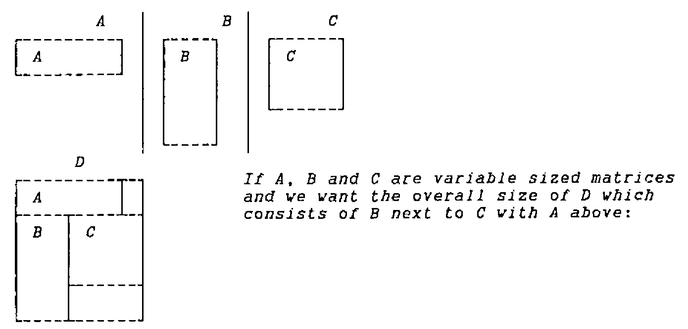

*by Phil Last*
{ .byline }

In this article I shall discuss operator syntax, introduce a new idiom, and describe some defined operators which use it.

In expressions and identities (distinguished by having ‘↔’ between two equivalent expressions) I shall try to use symbols consistently as:

> (a) (b) (l) (r) are arrays.<br>
> (f) (g) (h) are functions.<br>
> (A) is an ambivalent object which might be an array or a function according to parameter substitution for operators.<br>
> (O) and (P) are operators.

**A grasp of operator syntax and of the construction and derivation of derived functions is a prerequisite to the understanding of what follows.**

I have used the old terminology of distinguishing OPERANDS from ARGUMENTS. In fact the word ’argument’ is generic and can be used to refer to parameters to both functions and operators while the word ’operand’ is (within APL) reserved for operator arguments. I shall use the words from now on as follows:

> An ARGUMENT is exclusively an array parameter to a FUNCTION (primitive, defined or derived).<br>
> An OPERAND is a parameter (function or array) to an OPERATOR (primitive or defined).

Functions are ambivalent - left arguments may be elided. Operators are either monadic or dyadic - never ambivalent. Monadic Operators take their single operand on the LEFT. Operands are ambivalent in the sense that they may be either functions or arrays.

In the expression:

```apl
a f O g b
```

wherein (*O*) is a DYADIC operator

> (*f*) and (*g*) are the operands to (*O*).<br>
> (*a*) and (*b*) are the arguments to the derived function (*f O g*).

```apl
a f O g b ↔ a(f O g)b  ⍝ for dyadic O
```

In the expression:

```apl
a f P g b
```

wherein (*P*) is a MONADIC operator

> (*f*) is the operand to (*P*).<br>
> (*a*) is the left argument to the derived function (*f P*).<br>
> (*b*) is the right argument to function (*g*).<br>
> (*g b*) is the right argument to the derived function (*f P*).

```apl
a f P g b ↔ a(f P)g b  ⍝ for monadic P
```

In the expression:

```apl
R←a f O g P h b
```

wherein (*O*) and (*P*) are DYADIC operators

> (*h*) is the right operand to (*P*)<br>
> (*f O g*) is the left operand to (*P*)<br>
> (*f*) (*g*) are the operands to (*O*)<br>
> (*a*) (*b*) are the arguments to function (*f O g P h*)

```apl
a f O g P h b ↔ a(f O g)P h b  ⍝ for dyadic O and P
```

It is this fact which gives rise to the oft mentioned misapprehension that in function expressions (containing operators) execution proceeds from left to right. In fact the left operand (*f O g*) is derived prior to the execution of (*P*) but is then only executed under the control of (*P*) if at all. In other words as always execution proceeds from right to left unless parentheses are used to alter that order. In the expression:

```apl
a(f O r)b
```

wherein (*O*) is a DYADIC operator

> (*f*) is the left function operand to (*O*)<br>
> (*r*) is the right array operand to (*O*)<br>
> (*a*) and (*b*) are the arguments to derived function (*f O r*)

The parentheses are non-redundant.

The expression:

```apl
a f O r b
```

is a *SYNTAX ERROR* for dyadic (*O*) as:

> (*r b*) is either the right operand to (*O*) `a(f O r b)`<br>
> or the right argument to (*f O*) `a(f O)r b`

The expression is missing either a right argument or a right operand. APL syntax does not permit the derivation of left monadic functions or the elision of right operands.

> Unfortunately IBM’s APL2 and compatibles make the binding of right operands take precedence over vector binding, viz: the `1 2 3 4` in the statement:
>
> ```apl
> R←A fn DOP 1 2 3 4
> ```
>
> is not necessarily a vector. Then:
>
> ```apl
> a f O r b ↔ a(f O r)b   ⍝ for dyadic O in IBM APL2
>                         ⍝  and compatibles only
> a f O r b ↔ a(f O)r b   ⍝ for monadic O
> ```
>
> whereas DYALOG, APL\*PLUS II etc. interpret:
>
> ```apl
> a f O r b ↔ a(f O)r b ⍝ in all cases
> ```
>
> and generate a *SYNTAX ERROR* for dyadic O.

In fact parentheses around function expressions, although often required for clarity, are only absolutely necessary when:

- a dyadic call is made to a function derived from an operator having an array left operand:

```apl
a l O g b ↔ (a l O g)b ⍝ monadic call to (a l O g)
a(l O g)b              ⍝ parentheses required for dyadic call.
```

- or a derived function is used as right operand to a dyadic operator.

```apl
a f O g P b ↔ a(f O g)P b  ⍝ fn derived from O is operand to P
a f O(g P)b                ⍝ fn derived from P is operand to O
```

The separation of array right operands from right arguments to the derived function can often be achieved without parentheses by use of a right identity:

```apl
⊢   ⍝ where implemented
+   ⍝ where the domain is real
,   ⍝ where the argument is a vector etc.

a f O r ⊢ b ↔ a(f O r)b ⍝ for dyadic O
```

What follows makes extensive use of:

`⊢` dex - the ambivalent right identity function

```apl
a ⊢ b ↔ b
  ⊢ b ↔ b
f ⊢ b ↔ f b
```

`∘` the compose operator

```apl
a(f∘g)b  ↔  a f g b
 (f∘g)b  ↔  f g b
 (l∘g)b  ↔  l g b
 (f∘r)b  ↔  b f r
```

Either or both of these might be implemented using a different character on your system, or one or both might not have been implemented. They are both very simple to define … combining dex and compose:

```apl
    (⊢∘f)b ↔ f b              (i)
   a(⊢∘f)b ↔ f b             (ii)
    (⊢∘r)b ↔ r              (iii)
 ⊢∘(⊢∘f)b ↔ f b              (iv)
 ⊢∘(⊢∘r)b ↔ r                 (v)
a⊢∘(⊢∘f)b ↔ f b              (vi)
a⊢∘(⊢∘r)b ↔ r               (vii)
```

(`⊢∘f`) and (`⊢∘(⊢∘f)`) are both ambivalent functions which ignore their left arguments and call function (*f*) MONADICALLY. (`⊢∘r`) and (`⊢∘(⊢∘r)`) are respectively MONADIC and AMBIVALENT CONSTANT functions which return (*r*) whatever their argument(s).

An aside: by definition of reduction:

```apl
⊃f/⊂a ↔ ⊃f/,⊂a ↔ a          (viii)
    ⊃f/(⊂a),⊂b ↔ a f b        (ix)
```

We can now derive the idiom:

using (viii) and (ix)

```apl
⊃f/(0⍴⊂a),⊂b ↔ b         ⍝ conditional execution     (1)
⊃f/(1⍴⊂a),⊂b ↔ a f b     ⍝ of dyadic function f      (2)
```

substitute ambivalent function from (ii)

```apl
⊃⊢∘f/(0⍴⊂a),⊂b ↔ b       ⍝ conditional execution     (3)
⊃⊢∘f/(1⍴⊂a),⊂b ↔ f b     ⍝ of monadic function f     (4)
```

remove now redundant reference to (a)

```apl
⊃⊢∘f/(⍳0),⊂b ↔ b         ⍝ conditional execution     (5)
⊃⊢∘f/(⍳1),⊂b ↔ f b       ⍝ of monadic function f     (6)
```

substitute equivalent function from (vi)

```apl
⊃⊢∘(⊢∘f)/(⍳0),⊂b ↔ b     ⍝ conditional execution     (7)
⊃⊢∘(⊢∘f)/(⍳1),⊂b ↔ f b   ⍝ of monadic function f     (8)
```

substitute constant function from (vii)

```apl
⊃⊢∘(⊢∘r)/(⍳0),⊂b ↔ b     ⍝ condition selection       (9)
⊃⊢∘(⊢∘r)/(⍳1),⊂b ↔ r     ⍝ of array r               (10)
```

Most important is the similarity of 7, 8, 9 and 10 which differ only in a single logical value and the function/array ambivalence of f and r

These permit the coding of the conditional ambivalent expression:

```apl
⊃⊢∘(⊢∘A)/(⍳L),⊂b ↔ b     ⍝ when L is untrue         (11)
                 ↔ A b   ⍝ when L is true and A is a function
                 ↔ A     ⍝ when L is true and A is an array
```

I believe this idiom to be new. It is very useful.

I have used dex and compose because compose is implemented on my system; an alternative pair will do the same job:

`⊣` lev - the ambivalent left identity function

```apl
a ⊣ b ↔ a
  ⊣ b ↔ b
f ⊣ b ↔ f b
```

and lever - a defined operator

```apl
 (f lever)b ↔ f b        ⍝ cf. (iv) (v) (vi) and (vii)
 (l lever)b ↔ l
a(f lever)b ↔ f b
a(l lever)b ↔ l

  A lever   ↔  ⊢∘(⊢∘A)                                 (x)
```

(*f lever*) is an ambivalent function which calls the function operand (*f*) MONADICALLY. (*l lever*) is an ambivalent constant function which always returns array (*l*)

Substituting (x) into (11) gives: (12)

```apl
⊃A lever/(⍳L),⊂b ↔ b     ⍝ when L is untrue
                 ↔ A b   ⍝ when L is true and A is a function
                 ↔ A     ⍝ when L is true and A is an array
```

If your system has `∘` (or equivalent) but lacks `⊢` and `⊣` then:

```apl
⊃dex∘(dex∘A)/(⍳L),⊂b    ⍝ from (11)
```

… is the better alternative as dex does not have a great deal to do:

```apl
∇ R←L dex R
∇
```

If your system has `⊢` and `⊣` but lacks compose then:

```apl
⊃A lever/(⍳L),⊂b             ⍝ from (12)
```

is preferable as the defined operator is unconditional:

```apl
    ∇ R←A(F lever)B
[1]   R←F⊣B
    ∇
```

My first use of this idiom is in defined operator `IF_`:

```apl
    ∇ R←(F IF_ G)R
[1]   ⍝ IF G or G R then R←F or F R
[2]   ⍝ F: any array or monadic function
[3]   ⍝ G: any array or (conditional) monadic function
[4]   ⍝ R: any array in domains of (F) and (G) if functions
[5]    R←⊃⊢∘(⊢∘F)/(⍳1∊G⊣R),⊂R
    ∇
```

```apl
    ∇ R←(F IF_ G)R ...
[5]   ⍝ alternative defn without primitive lev and dex:
[6]    R←⊃dex∘(dex∘F)/(⍳1∊(dex∘G)R),⊂R
    ∇

    ∇ R←(F IF_ G)R ...
[5]   ⍝ alternative defn without primitive compose:
[6]    R←⊃F lever/(⍳1∊G⊣R),⊂R
    ∇

      (-IF_ 1) 3                ⍝ operands: function and array
¯3
      (-IF_ 0)3
3
      ÷IF_×3                    ⍝ operands: function and function
0.3333333333
      ÷IF_×0
0
      'WRONG' IF_(0∘∊)1 2 3     ⍝ operands: array and function
1 2 3
      'WRONG' IF_(0∘∊)1 2 3 0
WRONG
```

A simple switching of operands makes the following operator more convenient to use in certain syntactical circumstances.

```apl
    ∇ R←(F THEN_ G)R
[1]   ⍝ if F or F R THEN R←G or G R
[2]   ⍝ F: any array or (conditional) monadic function
[3]   ⍝ G: any array or monadic function
[4]   ⍝ R: any array in domains of (F) and (G) if functions
[5]    R←⊃⊢∘(⊢∘G)/(⍳1∊F⊣R),⊂R
    ∇

      1 THEN_ ⌽ ⍳4
3 2 1 0
      0 THEN_ ⌽ ⍳4
0 1 2 3
```

When an alternative to the execution or non-execution of a function is required:

```apl
    ∇ R←L(F ELSE_ G)R
[1]   ⍝ if L then R←F or F R ELSE R←G or G R
[2]   ⍝ L: any array (which may or may not contain a 1)
[3]   ⍝ F: any array or monadic function
[4]   ⍝ G: any array or monadic function
[5]   ⍝ R: any array in domains of (F) and (G) if functions
[6]    R←⊃⊢∘(⊢∘F)/(⍳1∊L),⊢∘(⊢∘G)/(1~L),⊂R
    ∇

      1 (+\) ELSE_ (×/) 1 2 3 4
1 3 6 10
      0 (+\) ELSE_ (×/) 1 2 3 4
24
```

Here is a complete résumé of all four calling sequences for each of the three operators wherein:

> cond fn0 and fn1 are monadic functions<br>
> true ar0 and ar1 are arrays<br>
> a condition is fulfilled if (1∊true) or (1∊cond R)

```apl
 R←fn0 IF_ cond R ↔ IF cond R THEN R←fn0 R ELSE no-op
 R←ar0 IF_ cond R ↔ IF cond R THEN R←ar0   ELSE no-op
R←(fn0 IF_ true)R ↔ IF true   THEN R←fn0 R ELSE no-op
R←(ar0 IF_ true)R ↔ IF true   THEN R←ar0   ELSE no-op

 R←cond THEN_ fn1 R ↔ IF cond R THEN R←fn1 R ELSE no-op
R←(cond THEN_ ar1)R ↔ IF cond R THEN R←ar1   ELSE no-op
 R←true THEN_ fn1 R ↔ IF true   THEN R←fn1 R ELSE no-op
R←(true THEN_ ar1)R ↔ IF true   THEN R←ar1   ELSE no-op

     R←true fn0 ELSE_ fn1 R ↔ IF true THEN R←fn0 R ELSE R←fn1
    RR←true(fn0 ELSE_ ar1)R ↔ IF true THEN R←fn0 R ELSE
R←ar1R←true(ar0 ELSE_ fn1)R ↔ IF true THEN R←ar0   ELSE R←fn1
    RR←true(ar0 ELSE_ ar1)R ↔ IF true THEN R←ar0   ELSE R←ar1
```

The three operators are related in the following way:

```apl
f THEN_ g ↔ g IF_ f

true f ELSE_ g b ↔ (f IF_ true)(g IF_(~true))b
```

which identities can readily be observed in the code.

The idiom as stated above:

```apl
⊃⊢∘(⊢∘A)/(⍳L),⊂b
```

can be extended in use if we remember that `⍳` has a larger domain than merely logical values.

```apl
⊃⊢∘F/(⍳0),⊂b ↔ b
⊃⊢∘F/(⍳1),⊂b ↔ F b
⊃⊢∘F/(⍳2),⊂b ↔ F F b
...
```

Hence:

```apl
    ∇ R←(F POWER_ G)R
[1]   ⍝ DO R←F R FOR N=1 TO G or G R
[2]   ⍝ F: a monadic fn whose codomain is a subset of its domain
[3]   ⍝ G: any single non-negative integer or function on R
[4]   ⍝    returning any single non-negative integer.
[5]   ⍝ R: any array in domain of F (and of G if a function)
[6]    R←⊃⊢∘F/(⍳G⊣R),⊂R
    ∇
```

Here are two more:

```apl
    ∇ R←(F WHILE_ G)R
[1]   ⍝ DO R←F R WHILE G R
[2]   ⍝ F: any monadic function
[3]   ⍝ G: any monadic (conditional) function
[4]   ⍝ R: any array in domains of F and G
[5]    R←⊃⊢∘(F WHILE_ G)∘F/(⍳1∊G R),⊂R
    ∇
```

This is a vivid illustration that we are dealing with conditional execution without `⍎` or `→`. Whoever saw a recursive function without either?

```apl
    ∇ R←L(F WHILEC_ G)R
[1]   ⍝ DO R←F R WHILE G R FOR N=1 TO L
[2]   ⍝ F: any monadic function
[3]   ⍝ G: any monadic (conditional) function
[4]   ⍝ R: any array in domains of F and G
[5]   ⍝ L: non-negative integer defining maximum iterations
[6]    R←⊃⊢∘(F IF_ G)/(⍳L),⊂R
    ∇

    ∇ R←SINGLE B
[1]   R←B<10
    ∇

      (2∘×) WHILE_ SINGLE 1
16
      (*∘2) WHILE_ SINGLE 3
81
      (2∘×) WHILE_ SINGLE 10
10
      (*∘2) WHILE_ SINGLE 1
INTERRUPT
WHILE_[2] R←⊃⊢∘(F WHILE_ G)∘F/(⍳1∊G R),⊂R
          ^
      R
1
      ⍴⎕LC
1071
      ⍝ infinitely recursive!
      →
      100 (*∘2) WHILEC_ SINGLE 1
1
      (1.1∘×) WHILE_ SINGLE 1
10.83470594
      1.1⍟10.8347059425
25
      (1.1∘×) WHILEC_ SINGLE 1
10.83470594
      24 (1.1∘×) WHILEC_ SINGLE 1
9.849732676
```

Both of these operators have the domain of both operands as strictly FUNCTION. As indicated in the examples (`WHILE_`) has the problems:

(i) possible infinite recursion. While (`WHILEC_`) overcomes this problem by setting a limit on the number of iterations it introduces two others the first of which is also indicated in the examples:

(ii) The condition might remain true throughout the permitted iterations although it would have become untrue some time later.

(iii) The condition is tested for the full number of permitted iterations although it might have become untrue at or near the first iteration.

> Problems (i) and (ii) are in the nature of the semantics of DO WHILE and therefore require no further consideration. There does not seem to be any way to overcome problem (iii) without undue additional processing overhead.

( Unless of course, you code a loop! I hope (but I’m not too hopeful) that I am not going to overly great lengths to avoid looping. I’m afraid that I do have an aversion to ’→’, indeed, at least as much as to ’⍎’. Mainly I would like to see interpreter writers giving priority to parts of the language which facilitate the avoidance of these. I have been known (even if only to myself) to allow a less efficient construct when it avoids a loop, skip or execute. )

While we are at it here are the DO UNTIL counterparts of the above:

```apl
    ∇ R←(F UNTIL_ G)R;L
[1]   ⍝ DO R←F R UNTIL G R
[2]   ⍝ F: any monadic function
[3]   ⍝ G: any monadic (conditional) function
[4]   ⍝ R: any array in domains of F and G
[5]    R←⊃⊢∘(F UNTIL_ G)/(1~G L),⊂L←F R
    ∇

    ∇ R←L(F UNTILC_ G)R
[1]   ⍝ DO R←F R UNTIL G R FOR N=1 TO L
[2]   ⍝ F: any monadic function
[3]   ⍝ G: any monadic (conditional) function
[4]   ⍝ R: any array in domains of F and G
[5]   ⍝ L: non-negative integer defining maximum iterations
[6]    R←⊃⊢∘(F IF_(1∘~∘G))/(⍳L-1),⊂F R
    ∇
```

As expected the test is done AFTER the operation as opposed to before as in the DO WHILE operators. All problems and advantages are exactly as above.

And a special case of UNTIL:

```apl
    ∇ R←(F LIMIT_)R;L
[1]   ⍝ DO R←F R UNTIL R≡F R
[2]   ⍝ F: any monadic function
[3]   ⍝ R: any array in domain of F
[4]    R←⊃⊢∘(F LIMIT_)/(⍳L≢R),⊂L←F R
    ∇
```

The function is applied. If its result is different from its argument then apply it again. Infinite recursion is yet again a possibility. I do have a (`LIMITC_`) alternative but it has to do some nasty tricks to avoid a loop and I’m not showing it to anyone.

This is getting a bit complicated now. The next operator actually runs into two lines of code:

```apl
    ∇ R←L(F SEL_ G)R;I;J;K
[1]   ⍝ R←L M N... (F SEL_ G SEL_ H... )R
[2]   ⍝ SELECT
[3]   ⍝   IF L THEN IF FN F THEN R←F R ELSE R←F
[4]   ⍝   IF M THEN IF FN G THEN R←G R ELSE R←G
[5]   ⍝   IF N THEN IF FN H THEN R←H R ELSE R←H
[6]   ⍝   ...
[7]   ⍝ END
[8]   ⍝ L: logical vector
[9]   ⍝ F: any array or monadic fn or fn derived by SEL_
[10]  ⍝ G: any array or monadic function
[11]  ⍝ R: any array in domain of F or G if selected
[12]   J←(∨/J)>⍴(K←⍳0⊥J),I←⍳1 0≡J←<\L=1
[13]   R←⊃⊢∘(⊢∘F)/I,F/(J⍴⊂¯1↓L),⊢∘(⊢∘G)/K,⊂R ∇
```

The following description applies to a derived function which contains multiple calls to `SEL_` as depicted in the comment.

L M N
:   is a boolean vector equal in length to the number of operands in the SELECT statement (i.e. 1 more than the number of calls to the operator (`SEL_`). It is treated as (`<\L M N …`) i. e. the first only if any (1) in the vector selects the operand to be used.

F G H
:   the operands, are any arrays or monadic functions. Parentheses are only required around individual operands if they are derived within the statement and not the first, e.g. `((⍳4)∊I) FOO/ SEL_(FO1\)SEL_ FO2 SEL_(FO3¨) R` but are probably preferable in any case for clarity. The entire function expression excluding only the arguments must be parenthesised if either the first or last operand is an array.

R
:   is any array in the domain of the function, if any, eventually selected to be run.

R
:   becomes the result of (fn R) where fn is the selected function or it is the selected array or it is the unchanged argument R when no operand is selected.

```apl
      0 0 0 0 +/SEL_(+\)SEL_(×/)SEL_(×\) 1 2 3 4
1 2 3 4
      1 0 0 0 +/SEL_(+\)SEL_(×/)SEL_(×\) 1 2 3 4
10
      0 1 0 0 +/SEL_(+\)SEL_(×/)SEL_(×\) 1 2 3 4
1 3 6 10
      0 0 1 0 +/SEL_(+\)SEL_(×/)SEL_(×\) 1 2 3 4
24
      0 0 0 1 +/SEL_(+\)SEL_(×/)SEL_(×\) 1 2 3 4
1 2 6 24
```

The conditional execution of functions relies this time on identities (1) and (2) as well as (11).

```apl
    ⊃f/(L⍴⊂a),⊂b ↔ b         ⍝ when L is untrue
                 ↔ a f b     ⍝ when L is true
⊃⊢∘(⊢∘A)/(⍳L),⊂b ↔ b         ⍝ when L is untrue
                 ↔ A b       ⍝ when L is true and A is a function
                 ↔ A         ⍝ when L is true and A is an array
```

This is because we have also a conditional dyadic function call.

When the left argument is all zeros then none of the conditional expressions results in an operand being selected and the argument returned. When only the last item in the left argument is (1) the right operand is selected and its result returned. When other than the last item is (1) then one of two things occurs. If there are only two items then the left operand is selected and its result returned. If there are three or more items then the left operand is run dyadically with the minus one drop (`¯1↓`) of the left argument. This is because more than two items indicate that another call to (`SEL_`) is a component of the left derived function and a blind recursive call is made.

The next is a very similar operator which will run any number of its selected operands rather than only the first. Any selected function acts on the result of previously selected operands (or the right argument if it is the first selected) while selected array operands replace previous results. In this case execution is forced to APPEAR to be left to right.

```apl
    ∇ R←L(F SEQ_ G)R;I;J;K
[1]   ⍝ R←L M N... (F SEQ_ G SEQ_ H... )R
[2]   ⍝ SEQUENTIAL
[3]   ⍝   IF L THEN IF FN F THEN R←F R ELSE R←F
[4]   ⍝   IF M THEN IF FN G THEN R←G R ELSE R←G
[5]   ⍝   IF N THEN IF FN H THEN R←H R ELSE R←H
[6]   ⍝   ...
[7]   ⍝ END
[8]   ⍝ L: logical vector
[9]   ⍝ F: any array or monadic fn or fn derived by SEQ_
[10]  ⍝ G: any array or monadic function
[11]  ⍝ R: any array in domains of F and G if selected
[12]   K←⍳0⊥J←L=1 ⋄ J←(∨/¯1↓J)>⍴I←⍳1 0≡<\J
[13]   R←⊃⊢∘(⊢∘G)/K,F/(J⍴⊂¯1↓L),⊢∘(⊢∘F)/I,⊂R
    ∇

      0 1 0 1 +SEQ_-SEQ_×SEQ_÷ 2 5
¯0.5 ¯0.2
```

And last of this set:

```apl
    ∇ R←A(F PAR_ G)B;I;J;K;L;M
[1]   ⍝ X Y Z... ←I J K... (F PAR_ G PAR_ H... )X Y Z...
[2]   ⍝ PARALLEL
[3]   ⍝   IF I THEN IF FN F THEN X←F X ELSE X←F
[4]   ⍝   IF J THEN IF FN G THEN X←G Y ELSE Y←G
[5]   ⍝   IF K THEN IF FN H THEN X←H Z ELSE Z←H
[6]   ⍝   ...
[7]   ⍝ END
[8]   ⍝ A: logical vector
[9]   ⍝ F: any array or monadic fn or fn derived by PAR_
[10]  ⍝ G: any array or monadic function
[11]  ⍝ B: vector to items of which F and/or G may be applied
[12]   K I←⍳¨(0⊥L),(⊃L)∧⊃M J←1 0=2=⍴⊃L R←↓(A=1),[⎕IO-0.1]B
[13]   R←(M/⊢∘(⊢∘F)/I,⊂⊃R),(J/⊃F/M↓¯1↓¨L R),⊢∘(⊢∘G)/K,⊂⊃⌽R
    ∇

      0 1 1 0 ⌊PAR_⌈PAR_-PAR_÷ 1.1 2.2 3.3 4.4
1.1 3 ¯3.3 4.4
```

This one applies operands selected by its scalar conforming logical vector left argument to respective items in its conforming right argument. N.B. The term parallel is NOT, in this implementation, concerned with WHEN but WHERE to apply particular operands. In fact selected operands are applied temporally right to left but as they are applied to different items this is entirely irrelevant.

The array/function ambivalence permitted in operands and tolerated by idioms such as:

```apl
A⊣b ↔ A       when (A) is an array
    ↔ A b     when (A) is a function
```

is a very powerful feature and allows us to write entirely ambivalent statements.

When left arguments to functions are elided, assigning the ambivalent right identity to the name by:

```apl
[2]   ⍎(0=⎕NC'A')/'A←⊢'
```

or

```apl
[2]   →1+(0≠⎕NC'A')⍴⎕LC ⋄ A←⊢
```

or fixing an equivalent function by:

```apl
[2]   0 0⍴⎕FX 1 5⍴'R←A R'
```

instead of the conditional assignment of an array value permits us to continue with ambivalent statements throughout the function.

Calls to subfunctions with the elided left argument as their left argument are genuinely monadic (we don’t have to guess what the SUBFN’s defaults are),

```apl
[3]   R←A SUBFN 'this might well be a monadic call'
```

while default values can be assigned transparently when required.

```apl
[4]   PARM←A⊣default ⍝ A if an array, default otherwise
```

It seems probable that there are NO cases when this is NOT applicable.

```apl
~∘(∨/)∘~ ↔ ∧/  ⍝ De Morgan
```

This surely is a case for an alternative form of function ambivalence wherein the left argument has an array value by parameter substitution or defaults to the ambivalent right identity, all done by the interpreter.

When I first wrote this that was as far as I was concerned an original thought. I have since read an article of Maurice Jordan (Vector 7.4) in which he suggested almost exactly the same thing.

This should banish at least the most common reason for conditional `⍎` or `→1+condition⍴⎕LC`

The last operator I want to describe derives functions which are identical to that contentious and hypothetical animal, the function vector. Honest Guv! Come on, you must have known it was coming when you saw the previous one!

```apl
A B C... (F _ G _ H...)X Y Z... ↔  (A F X)(B G Y)(C H Z)...
         (F _ G _ H...)X Y Z... ↔  (F X)(G Y)(H Z)...

    ∇ R←A(F _ G)B;L;N
[1]   ⍝ Function vector operator
[2]   ⍝ A: optional (scalar conformable with B)
[3]   ⍝ F: function (possibly derived by this operator)
[4]   ⍝ G: function to be applied to last item(s) of (A and) B
[5]   ⍝ B: vector (may be a scalar if A is a vector)
[6]    ⍎(0=⎕NC'A')/' A←⊢ ⋄ F←⊢∘F ⋄ G←⊢∘G '
[7]    L N←1 0=2=⍴⊃R←R R←↓(A⊣B),[⎕IO-0.1]B
[8]    R←(L/F/⊃¨N↓R),(N/⊃F/¯1↓¨L↓R),G/⊃∘⌽¨R
    ∇
```

I have broken several of my own rules here so I shall list my excuses first:

The name I have given this operator is ’_’

> Single character names should be reserved for strictly local purposes but I have tended to view this operator since its creation as a semi-primitive, and its having an almost invisible name allows its derived functions more easily to be viewed as idioms.

I have used conditional execute (and with diamonds do you believe).

> The functions derived by this operator have argument ambivalence. A conforming left argument is required for laminate on line [7], which subsequently becomes the left argument to functions run under reduction on line [8] whether the operands are dyadic or monadic. In the monadic case the functions must be run monadically under reduction. This requires:
>
> (`⊢∘F`)`/` instead of `F/` and (`⊢∘G`)`/` instead of `G/`
>
> I could have put in a skip around one line with diamonds or three lines without. I could have put a skip at the start of a single line with diamonds. In the end I chose the expression you see as being the one of several more or less equivalent evils which looked nicest in view of the relative length of the other lines of code.

I have re-assigned parameter names within a defined operation (*A*, *F* and *G*).

> Remarks above relate to (*A*). I suppose I could have assigned: `U←F ⋄ V←G` prior to the conditional `U←⊢∘U ⋄ V←⊢∘V` and changed line 3 to call *U* and *V* instead. Perversity won in this case (aesthetics played a hand).

And now an example:



*If A, B and C are variable sized matrices and we want the overall size of D which consists of B next to C with A above:*
{ .caption }

```apl
⍴D ↔ ((1↑⍴A)+(1↑⍴B)⌈1↑⍴C),(¯1↑⍴A)⌈(¯1↑⍴B)+¯1↑⍴C
```

Look at the functions in the above:

```apl
+   ⌈   ⌈   +
```

How about:

```apl
⍴D ↔ (⍴A)(+⌈)(⍴B)(⌈+)⍴C
```

which is precisely what I coded several years ago when I required the answer and was not yet fully conversant with all the restrictions in APL and had never heard of function arrays, merely assuming that consistent and meaningful statements would give me the answer I required.

Well, now I can code:

```apl
⍴D ↔ (⍴A)+_⌈(⍴B)⌈_+⍴C
```

and it DOES give me the answer.

In fact a defined operator to do that task can be much simpler than that coded above as there are only two operands.

What we can do with this one is slightly more generalised.

```apl
      ⍝ dyadic vector/vector
      1 2 3 4 5 6 +_-_×_÷_⌈_⌊ 7 8 9 10 11 12
8 ¯6 27 0.4 11 6

      ⍝ dyadic scalar/vector
      1 +_-_×_÷_⌈_⌊ 2 3 4 5 6 7
3 ¯2 4 0.2 6 1

      ⍝ dyadic vector/scalar
      1 2 3 4 5 6 +_-_×_÷_⌈_⌊ 7
8 ¯5 21 0.5714285714 7 6

      ⍝ monadic vector
      +_-_×_÷_⌈_⌊ 1 2 3 4 5 6
1 ¯2 1 0.25 5 6
```

And it works uniformly with mixed, defined and derived functions and with nested arguments so long as at least one argument has length equal to the number of function operands and the other, for a dyadic call, is the same length or is a scalar.

The reason it works is as for operator (`SEL_`) described previously. The control on which function is run is by the length of the argument(s). When the length is 2 then the left operand must be the function to run on the first (`⊃`) item of the argument(s). If the length is greater than 2 then the left operand must be a function derived with a further call to ’_’ so its arguments are passed as the `¯1↓¨` of the arguments at this calling level and a blind recursive call is made. The right operand is always the function to be run on the last (`⊃⌽`) item(s).

That’s it.
