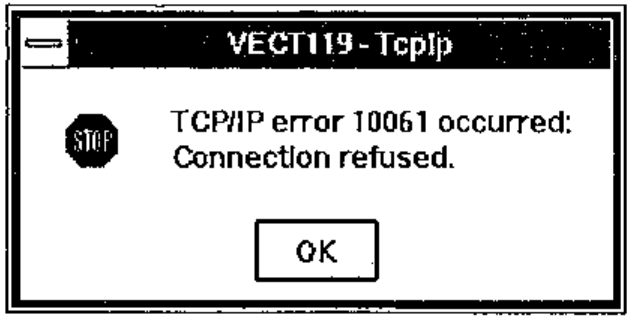

*by Timo Laurmaa*
{ .byline }

## Introduction

AP119/W is a product which hooks Dyalog APL/W to TCP/IP, today regarded as *the* communications protocol to connect computers together. It was written by Andrei Kondrashev of Lingo Allegro, Inc. The product sells for US$300, but early birds attending APL95 were able to get a price of just below $80. Prices as low as these are not likely to generate significant revenues for Lingo Allegro, but that does not necessarily create a problem: Lingo’s main business is in consulting, and the primary purpose of tools like AP119/W or GDDME (see *Vector* 10.2 and 10.3) is to leverage their consulting business, in which connections to the mainframe APL2 world are valuable.

AP119/W was apparently designed to be fully compatible with AP119, IBM’s TCP/IP auxiliary processor, with a target of providing the communication between APL user interfaces in Windows and APL2 legacy applications on the mainframe. However, judging by the enhancements that have been implemented in 8 months between version 1.0 beta and 2.1 beta (my current version), AP119/W is developing into a sophisticated but easy to use package, which connects APL/W with other APL versions and non-APL environments such as Internet servers and browsers.

## Installation and Documentation

The installation and invocation of AP119/W are almost identical to those of GDDME, a GDDM emulator by the same author (*Vector* 10.2 pp. 45–48). *ap119.exe* is an independent task, and it uses DDE to communicate with APL/W. It is enough to copy ap119.exe into the directory of your choice, indicate the location by the *PATH* variable and call an APL function such as:

```apl
    ∇ TCPSHARE;R
[1]   ⍝ Sign on to AP119/W using TcpIp
[2]    →(2=⎕SVO'TcpIp')/0
[3]   ⍝Set initial value
[4]    TcpIp←''
[5]    R←'DDE:'⎕SVO'TcpIp'
[6]   ⍝ Load and run AP119
[7]    ⎕CMD(PATH,'AP119 -',⎕WSID,' -TcpIp ')''
[8]   ⍝ Be sure that AP119 has answered
[9]   Wait:→(1≠2⊃⎕SVS'TcpIp')/Wait
[10]  ⍝ Set full interlock
[11]   R←1 ⎕SVC'TcpIp'
    ∇
```

Provided that a TCP/IP stack and the file *winsock.dll* are present, a TcpIp icon pops up (unless hidden by a startup parameter) and the shared variable *TcpIp* can be assigned AP119 commands. The use of a cover function is recommended:

```apl
    ∇ Z←TCP X;APRC;TCPRC
[1]   ⍝Pass a request to TCP/IP via AP119
[2]    TcpIp←X
[3]    Z←TcpIp
[4]    (APRC TCPRC Z)←Z
[5]    →(APRC=0)/0
[6]    ('AP119 error: ',⍕APRC TCPRC)⎕SIGNAL 666
    ∇
```

The *Programmer’s Reference* follows Lingo Allegro’s tradition of high quality documentation. It is a useful combination of a 30-page function reference and a 20-page introduction to TCP/IP and sockets. I learned the basics of socket programming by reading IBM’s *APL2 System Services Reference*, and I am convinced that the AP119/W manual is at least equally suitable reading for TCP/IP beginners.

## Working with Sockets

In TCP/IP, a *socket* is the fundamental concept onto which all protocols (such as FTP or HTTP) are based. AP119/W supports stream sockets and datagram sockets, of which I will only discuss the former. The following AP119 call allocates a new socket:

```apl
      ⎕←TCP 'SOCKET' 'STREAM'
0
```

Since sockets are used for two different purposes, communicating with a known partner, or waiting for new connections initiated by so far unknown users, I found the following piece of code to be useful, because it combines the AP119 calls that are always required:

```apl
    ∇ Z←L TCPSOCKET V;A;IA;PN;PT;S
[1]   ⍝ Get a new socket
[2]   ⍝ For listening if L=1
[3]    (IA PN)←V                          ⍝ IP address, port nr
[4]    Z←S←TCP'SOCKET' 'STREAM'           ⍝ Get a new socket
[5]    →L/LB                              ⍝ Jump if LISTENing
[6]    A←TCP'BIND'S 0 '0.0.0.0'           ⍝ Bind the socket
[7]    A←TCP'CONNECT'S PN IA              ⍝ Address IA, port PN
[8]    →0
[9]   LB:A←TCP'BIND'S PN'0.0.0.0'         ⍝ Bind to port PN
[10]   A←TCP'LISTEN'S 5                   ⍝ Socket for listening
    ∇
```

If you want to create a client connecting to the World Wide Web server of Statistics Finland, the IP address of which is 193.166.0.71, the connection to their WWW port 80 is established by:

```apl
      ⎕←0 TCPSOCKET '193.166.0.71' 80
1
```

The result 1 indicates that socket number 1 is successfully connected to port 80 of *www.stat.fi*. If the IP address or port number are incorrectly specified, AP119 blocks for about half a minute and then returns an error code:

```text
      AP119 error: 1 10061
```

AP119 has an optional error display facility which shows the error codes together with a description in a message box:



Message boxes are very useful when designing and testing an application, but the possibility to turn them off is invaluable in production systems, particularly servers, where the application is intelligent enough to trap non-zero error codes and take the necessary action.

If instead of connecting to a known server you want to create a server of your own, you allocate a socket by:

```apl
      ⎕←1 TCPSOCKET '' 3850
2
```

The result 2 indicates that socket number 2 is now listening to port 3850 (a not-so-well-known port of your choice). A client can now connect to this socket by knowing your IP address and your port number 3850. There are several ways to proceed and find out if a client wants to connect:

```apl
      ⎕←TCP 'ACCEPT' 2
3 1256 158.152.217.93
```

The server has accepted the connection from socket 2 and created *a new socket* number 3 for the communication that will take place between your server and the client, whose IP address is `158.152.217.93`. The original socket 2 remains listening for new connections. The problem with *ACCEPT* is that the system blocks until a client requests a connection. This is where the *SELECT* command will be useful:

```apl
      1⊃TCP 'SELECT' (2 3) '' '' 15
0 1
```

AP119 will wait at most 15 seconds (the last item in the vector is timeout) for data to be read from sockets 2 or 3, and returns a 1 for each socket where an event has taken place. In this case, there has been no activity in socket 2, but data can be read from socket 3, which was created above for the communication between this server and user `158.152.217.93`. *SELECT* can be set to wait indefinitely (timeout 0) or return immediately (timeout negative).

The data sent by user `158.152.217.93` can now be read:

```apl
      ⎕←TCP 'RECV' 3 0 'N'
Hello, are you there?
```

and a response can be sent:

```apl
      ⎕←TCP 'SEND' 3 0 'N' 'Yes I am. Who are you?'
22
      ⍝ 22 characters were sent
```

These examples show that to get going with AP119/W is quite easy. Building full scale applications with multiple users, possibly working on different platforms, is more challenging but by no means terribly difficult.

## Building Real Applications

Considering that AP119/W is an APL interface to a standard *winsock.dll*, the application designer needs to be aware of pitfalls such as:

- Data is sent and received as simple character strings. Unless only APL/W users are involved, the application must convert numeric, nested and multidimensional to and from a transfer form. I developed a simple `⎕TF` emulator for APL/W in order to exchange data between APL2/370 and APL/W.
- If APL characters are sent across different platforms, the application must convert between different `⎕AV`s.
- TCP/IP chops the data into chunks of 2 kb or less. Even though the SEND command may accept very long strings, on the other side the RECV command only returns one chunk at a time, and the application must catenate them together and know when end-of-data has been reached. If only APL/W users are involved, AP119/W goes quite a bit further (in release 2.1).

## AP119/W Release 2.1

For some weeks now I have had a beta version of the new release of AP119. Some of the enhancements make the application designer’s life just a little bit easier, some of them are bound to revolutionise the way of APL programming with sockets.

- The new conversion option *W* allows for an automatic conversion from any APL array into a character string (when sending) and vice versa (when receiving). This option also caters for catenating small chunks together before returning the full APL variable.
- Andrei has been clever enough to notice that this approach may have its downside: if AP119 receives a large variable using the *W* format, the execution of the *RECV* command does not terminate until the whole variable has been built from possibly hundreds of small chunks. Network failures or problems on the sender’s side may even lead to a case where AP119 never receives the entire data. The solution is to receive the data without conversion as character strings and at the end apply a new command *CONVERT* which returns an APL array.
- The commands *GETHOSTID* and *GETHOSTNAME* have been extended to use Internet name servers to convert between host names and Internet addresses. You can now query IP addresses by specifying host names such as *apl-385.demon.co.uk* or *www.stat.fi*.
- The gem of release 2.1 is the introduction of event driven socket programming.

## Event Driven Socket Programming

The traditional approach to detect - typically in a server - if any of the active sockets has pending client requests is to call *SELECT* with a reasonable timeout. The longer the timeouts, the less the application can do other things. With the availability of the new *NOTIFY* command AP119 is now able to make the TCP/IP kernel interrupt the APL application when an event of interest occurs in the network.

The TCP/IP events get to the APL workspace via an invisible form, from which APL/W is able to catch the information related with the events. Therefore, the invocation of AP119 should be followed by statements like

```apl
      'TCPF'⎕WC'FORM' 'APL-119' ('COORD' 'PIXEL')
      'TCPF'⎕WS('EVENT' 5 'TCPEVENT')('VISIBLE' 0)
```

The sockets allocated later on will notify this form about their TCP/IP events if a statement like this is called for socket *S*:

```apl
      TCP'NOTIFY'S('TCPF'⎕WG'CAPTION')(+/1 8 32)
```

Whenever socket S is ready for *RECV* (1), *ACCEPT* (8) or *CLOSE* (32), the callback function *TCPEVENT* is executed, for example:

```apl
    ∇ TCPEVENT MSG;A;EVENT;ERROR;IA;P;S;⎕IO
[1]   ⍝ A simple TCP/IP event handler
[2]    ⎕IO←1
[3]    (ERROR EVENT)←0 256⊤3⊃MSG           ⍝ Get event nr
[4]    SN←4⊃MSG                            ⍝ Socket number
[5]    →(EVENT=1 8 32)/READ,ACC,CLS        ⍝ Jump to event
[6]   READ:A←TCP'RECV'SN 0 'N'             ⍝ Receive chunk
[7]    ⍎'DATA',(⍕SN),',←A'                 ⍝ Append to data
[8]    →0
[9]   ACC:(S2 P IA)←TCP'ACCEPT'S           ⍝ Get new socket
[10]   ⍎'DATA',(⍕S2),'←IA'                 ⍝ New data variable
[11]   →0
[12]  CLS:A←TCP'CLOSE'SN                   ⍝ Close socket
[13]   STORE⍎'DATA',⍕SN                    ⍝ Store data
    ∇
```

This is all it takes to implement a simple TCP/IP protocol, which in the example above collects data sent by clients and, when the client closes the socket, calls *STORE* to save the collected data further to a suitable place. The beauty in the functionality of *NOTIFY* is that when *ACCEPT* creates a new socket *S2* based on the listening socket *S*, *S2* inherits the properties of *S*, including the *NOTIFY* settings.

## Suggestions for Improvement

The new version leaves little to be desired. Nevertheless, a full-blown TCP/IP product might well offer additional goodies such as:

- standardisation of the TCP/IP solutions of different APL vendors would be necessary to allow for the effortless transmission of APL arrays between different APLs.
- a built-in data compression facility could reduce transmission times dramatically. Standardisation would be an issue here, too.
- it seems that AP119/W does not work well with all versions of *winsock.dll*. An additional warning in the documentation about this might be useful.

## Who is AP119/W for?

For any company or institution, where TCP/IP is in place, AP119/W is an easy and inexpensive starting point for solving APL connectivity problems. It is not (and is not intended to be) a turnkey solution, but it provides all facilities for the rapid development of cross-platform connectivity between APL2 and APL/W - or within a network of APL/W PCs.

AP119/W is particularly attractive for APL2 shops, where Windows has been selected as the standard PC operating system and where the unavailability of OS/2 excludes the use of IBM’s built-in co-operative processing facilities across different platforms. Instead of APL2/2 and its AP119, Dyalog APL/W with AP119/W can provide a nice path to program-to-program communication. This typically means accessing mainframe data from PCs, but a less traditional approach would be to let mainframe programs have real time access to PC or LAN based data.

AP119/W offers attractive possibilities for home users, too. I installed the new WinCim 2.0 for integrated CompuServe and Internet access, and was excited to see that the setup allowed me to establish an AP119/W connection from my home PC in Switzerland to an APL2/370 workspace that Jaakko Ranta had `)LOAD`ed in Finland. Using the same concept, any computer connected to Internet can be used from almost anywhere in the world, for a price close to what a local telephone call costs. Quite a tool for a travelling APL consultant who can use, design and maintain applications far away from the customer.

## Conclusion

AP119/W release 1.0 was a solid piece of programming, which provided the means for building client/server applications across different APL platforms. Release 2.1 goes several steps further by introducing the concept of event driven socket programming and by facilitating the exchange of APL arrays across the network. Unlike GDDME, which was Lingo Allegro’s solution for the declining market of old APL2/370 applications run on PCs, the company now has a product for an exploding (I hope) market of Internet and intranet connectivity. The ideal place, however, for AP119/W would be as an integral part of Dyalog APL/W.
