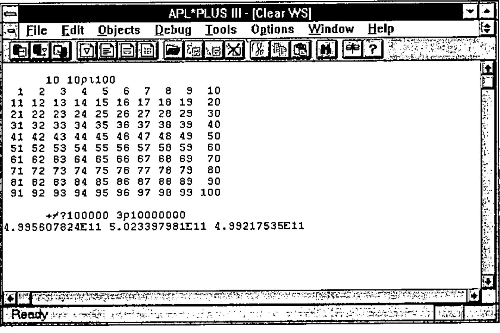
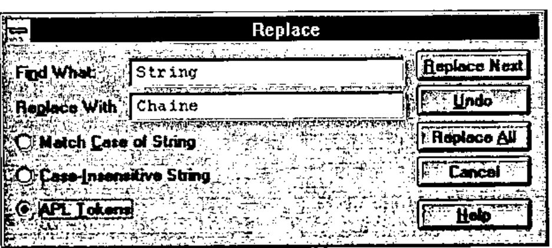
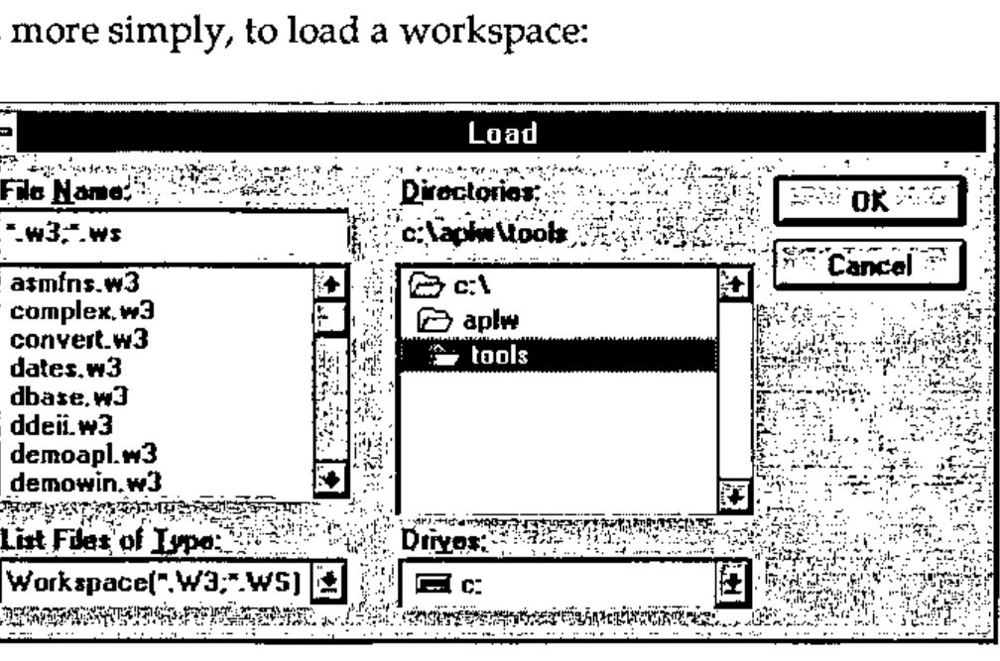
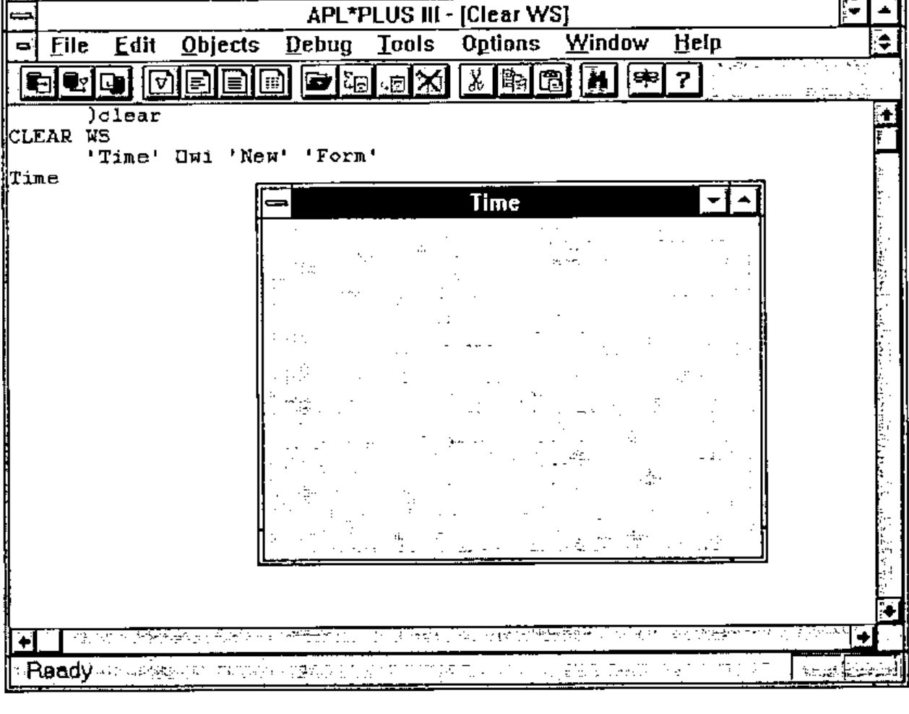
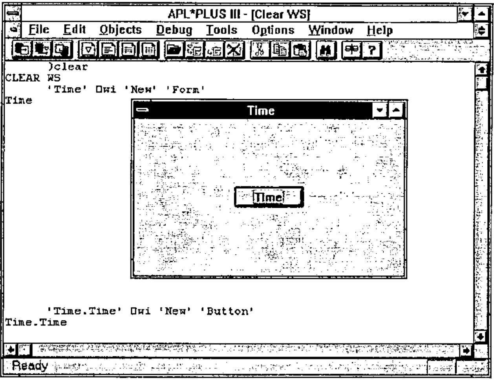
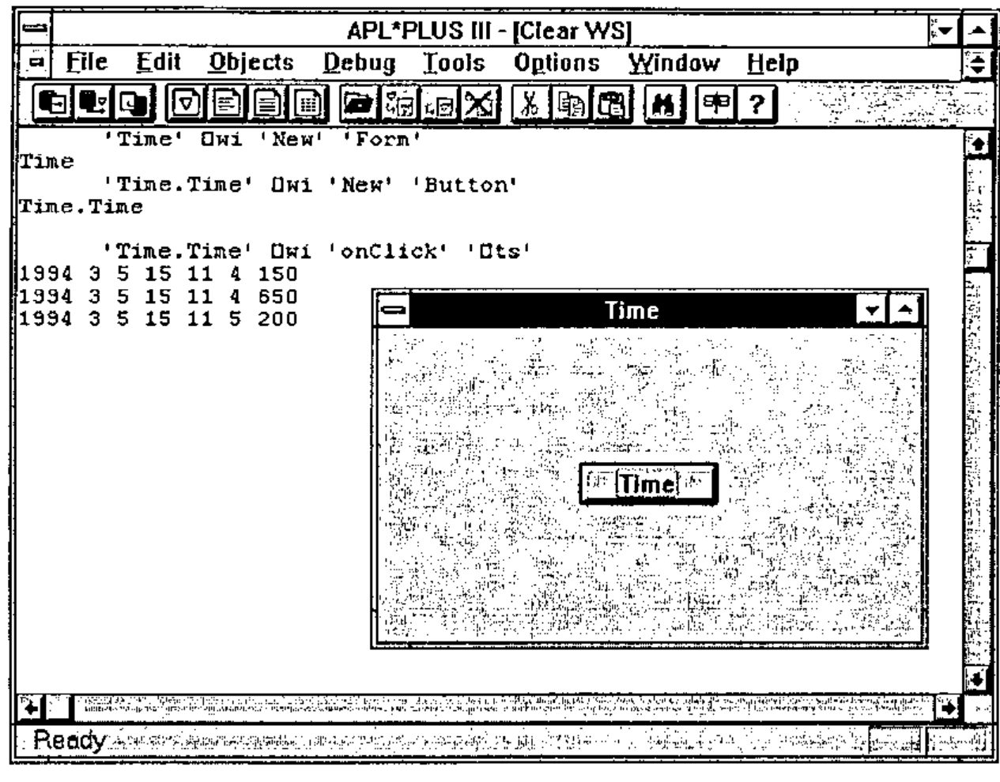
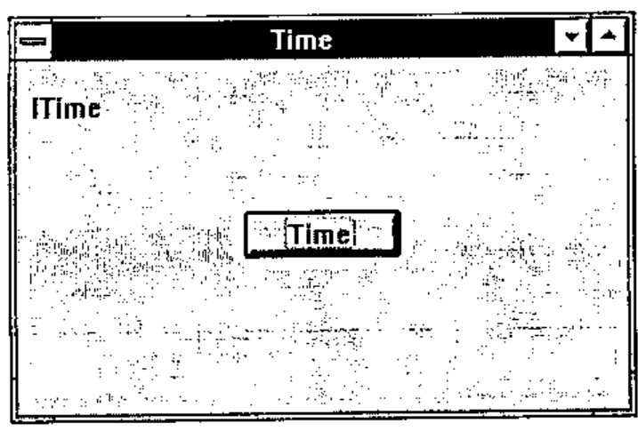
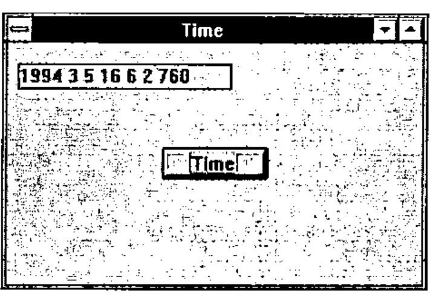

*by Eric Lescasse, Part I of II*
{ .byline }

## Introduction

The goal of this article is to show how to approach building Windows applications with APL. To do this, we will use APL\*PLUS III for Windows, version 1.1, the new product from Manugistics, Inc. You will see that programming Windows applications, a task reputed to be more difficult overall than DOS application programming, is in fact

- within the reach of all APL developers, even the most occasional ones
- much more simple than developing in APL under DOS.

As one example of this simplicity, the French APL keyboard is handled automatically without your having to do anything. Printing APL code is equally simple: you need only select a part of the APL session with the mouse (or the keyboard) and choose Print in the File menu. This means no more APL character downloads, or utility programs to enable the French APL keyboard!

The resulting applications involve much less APL code, and are much more reliable and easier to maintain. Moreover, you still continue to have 100% of the traditional characteristics of APL at your disposal, in particular its unequalled interactive development environment, its great power for modelling and data processing, and its unsurpassed speed for processing large amounts of data.

## The APL\*PLUS III Working Environment

APL\*PLUS III is a pure Windows application, having been developed with the collaboration of Microsoft, with a modern, Windows-style development interface.

APL\*PLUS III for Windows is a Windows MDI (Multiple Document Interface) application, in the tradition of major Windows products such as Microsoft Word and Excel. This means that there can co-exist on the screen as many "documents" as you like. In the case of APL\*PLUS III, these documents will be: the APL session, the editing sessions (functions and variables) and the numeric editor.

The ability to use multiple documents simultaneously is particularly useful: it gives you separate windows to view your APL session and multiple APL functions and variables, and the ability to cut and paste between the sessions using the mouse.



Figure 1—The APL\*PLUS III working environment
{ .caption }

Choosing menu options in APL\*PLUS III causes dialog boxes like the following to appear:



Figure 4—Dialog box for replacing a character string
{ .caption }

![The Editor Colors dialog: Text, Background, Default and B/W buttons for APL Session, Functions, Matrices, Vectors, [0000] and Numeric, and a palette](art10004980/fig5.jpg)

Figure 5—Colour choices for APL\*PLUS III editing sessions
{ .caption }

Or, more simply, to load a workspace:



Figure 6—Dialog box for loading a workspace
{ .caption }

These few examples should suffice to give you an idea of the APL\*PLUS III development environment.

Note that with the Tools… dialog in the Options menu you can dynamically modify the APL\*PLUS menus to install your own most frequently used commands in the Tools menu. This facility is particularly enjoyable to use.

## Developing an Application under Windows

Now we are going to develop a complete Windows application with APL\*PLUS III. The example that we will use is intended more as an illustration than actually to be useful. The following are provided for developing a Windows application:

- the system functions `⎕wi`, `⎕wgive`, and `⎕wcall`
- the system variables `⎕wself`, `⎕warg`, `⎕wres`, and `⎕wevent`

Let’s begin in a clear APL workspace:

```apl
      )clear
CLEAR WS
```

Let’s create a Windows window, or "form":



Figure 7—Creating a Window
{ .caption }

The instruction `'Time' ⎕wi 'New' 'Form'` creates a new window named `Time`. New is the name of the method used. Form is the name of the object class.

The window created has a default size equal to half of the width and height of the screen and is centred on the screen. It has a maximise and minimise button as well as a system menu. Its title, or "caption", is by default the same as the name of the window, which is "Time".

Windows programming in APL\*PLUS III is true object-oriented programming, called APLGUI. It lets you manipulate the following classes, or types of objects

| Object Class | Meaning |
|---|---|
| # | System object |
| Button | Push button |
| Check | Check box |
| Combo | Combo box, an input field with drop-down list of choices |
| Edit | Input field |
| Form | Window |
| Label | Text label |
| List | List of choices |
| Menu | The form’s main menu |
| Option | Radio button |
| Printer | Printer object |
| Scroll | Scroll bar |
| Timer | Period interval timer |
| Toolbox | Button bar or tool bar |

These objects are organised in a hierarchy, and can inherit certain "properties" from their "parents". In the same way that a pencil has properties (colour, weight, length,…) the APLGUI objects also have properties that you can easily modify using the system function `⎕wi`.

Let’s add an object to our Time form:

```apl
      'Time.time' ⎕wi 'New' 'Button'
Time.Time
```

Our screen now looks like this:



Figure 8—Creating a button in a form
{ .caption }

The button is named Time (like the form, but we could have given it any other name) and it is by default placed in the centre of our window. The result of the function `⎕wi` is the name of the object created: `Time.Time`. The period indicates the hierarchy: the button `Time` is a "child" of the form `Time`.

Now, let’s associate an action with the time button, with the following instruction:

```apl
      'Time.Time' ⎕wi 'onClick' '⎕ts'
```

This instruction indicates that when the event `onClick` (that is, a click with the mouse) is produced with the object `Time.Time`, the character string `'⎕ts'` should be executed. `⎕ts` is an APL instruction that returns the current date and time in the form of a numeric vector.

Now, let’s push the button `Time` three times. Our APL\*PLUS III screen will then have the following appearance (after having moved the window `Time` over and down a little with the mouse):



Figure 9—Clicks on the button Time
{ .caption }

Note that we could return to the APL session simply by clicking with the mouse in the last example: the window `Time` then disappears, covered by the APL session. Typing **Alt-Tab** makes it reappear.

We now have a little Windows application, complete and functional. We only needed to use the following three instructions:

```apl
'Time'      ⎕wi 'New' 'Form'
'Time.Time' ⎕wi 'New' 'Button'
'Time.Time' ⎕wi 'onClick' '⎕ts'
```

Note that we could have achieved the same result with a single call to the function `⎕wi`, by writing this:

```apl
'Time' ⎕wi 'New' 'Form' ('Time.New' 'Button' ('onClick' '⎕ts'))
```

or this:

```apl
var←'Time.New' 'Button'
var←var,⊂'onClick' '⍕ts'
'Time' ⎕wi 'New' 'Form',⊂var
```

## Independence between Forms and Workspaces

The forms that you create are independent of the workspace, which is a major advantage. It means that you can freely change the active workspace without affecting the functioning of your forms.

To illustrate, let’s load a new workspace, for example C:\APLW\TOOLS\UTILITY

```apl
      )xload c:\aplw\tools\utility
C:\APLW\TOOLS\UTILITY SAVED 02/17/1994 18:15:00
```

Press **Alt-Tab** to make our `Time` form reappear. Push the `Time` button. The time is displayed in the APL session and our window is still functional!

Note that if you close the window `Time` by choosing Close from its system menu, you need only enter `'Time' ⎕wi 'Wait'` to reactivate our little Windows application. Close the `Time` window, then enter:

```apl
      )clear
CLEAR WS
      'Time' ⎕wi 'Wait'
```

The `Time` window reappears; moreover, it still works correctly.

## Improving our Windows Application

Instead of displaying the time in the APL session, let’s make it appear in our form. To do this, we will create a **Label**, which we will position in the upper left of the form and in which we will display the time.

Let’s create the label:

```apl
'Time.lTime' ⎕wi 'New' 'Label' ('where' 1 1 1.2 20)
```

Notice that this time, in creating our label, we changed its where property (its position in the window) by putting it one unit (=1 character) from the upper left corner.

Our form `Time` now looks like this:



Figure 10—The form `Time` with a button and label
{ .caption }

The name of the label (`lTime`) is written in it by default. We will clear it, and also add a frame to the label:

```apl
'Time.lTime' ⎕wi 'caption' ''
'Time.lTime' ⎕wi 'border' 1
```

This could have been done in one instruction:

```apl
'Time.lTime' ⎕wi 'Set' ('caption' '')('border' 1)
```

using the method `Set`, which lets you change several properties of an object at once. Next, let’s modify the expression associated with clicking the button `Time`, so that it will now display the time in our label:

```apl
'Time.Time' ⎕wi 'onClick' '''Time.lTime''⎕wi''caption'' (⍕⎕ts)'
```

Or, alternatively and more simply, let’s change the `onClick` property of our button as follows and write a function `Time`, containing the following APL code:

```apl
'Time.Time' ⎕wi 'onClick' 'Time'

    ∇ Time
[1]   'Time.lTime' ⎕wi 'caption' (⍕⎕ts)'
    ∇
```

Such a function is called a **"callback"** function, which means a function that is automatically executed in response to an event. Make your form `Time` reappear by typing **Alt-Tab**, then click on the button `Time`. Your window will look like:



Figure 11—Clicking the button `Time` writes the time in the label
{ .caption }

Now our application has become a real Windows application that no longer needs the display of the APL\*PLUS III working environment to function. You can iconify APL\*PLUS III by clicking on its minimise button (at upper right).

To summarise: This is all that we have done so far:

```apl
'Time' ⎕wi 'New' 'Form'
'Time.Time' ⎕wi 'New' 'Button'
'Time.Time' ⎕wi 'onClick' '⎕ts'
'Time.lTime' ⎕wi 'New' 'Label' ('where' 1 1 1.2 20)
'Time.lTime' ⎕wi 'Set' ('caption' '')('border' 1)
'Time.Time' ⎕wi 'onClick' 'Time'

    ∇ Time
[1]   'Time.lTime' ⎕wi 'caption' (⍕⎕ts)'
    ∇
```

You will note that this complete little Windows application uses only one APL primitive, `⍕` (format), which is necessary to transform the numeric date and time `⎕ts` into characters.
