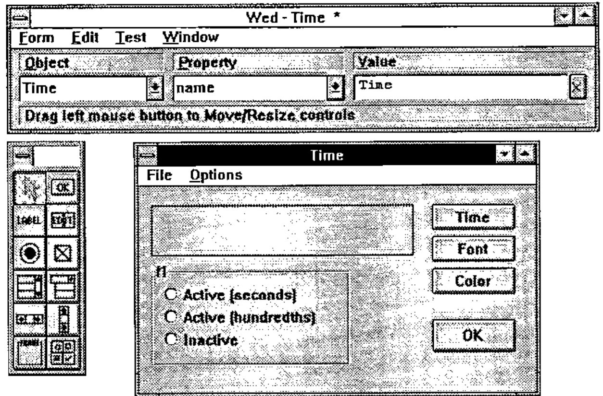
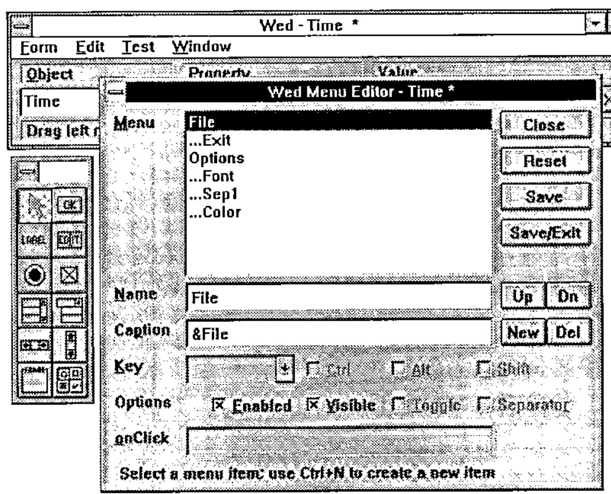
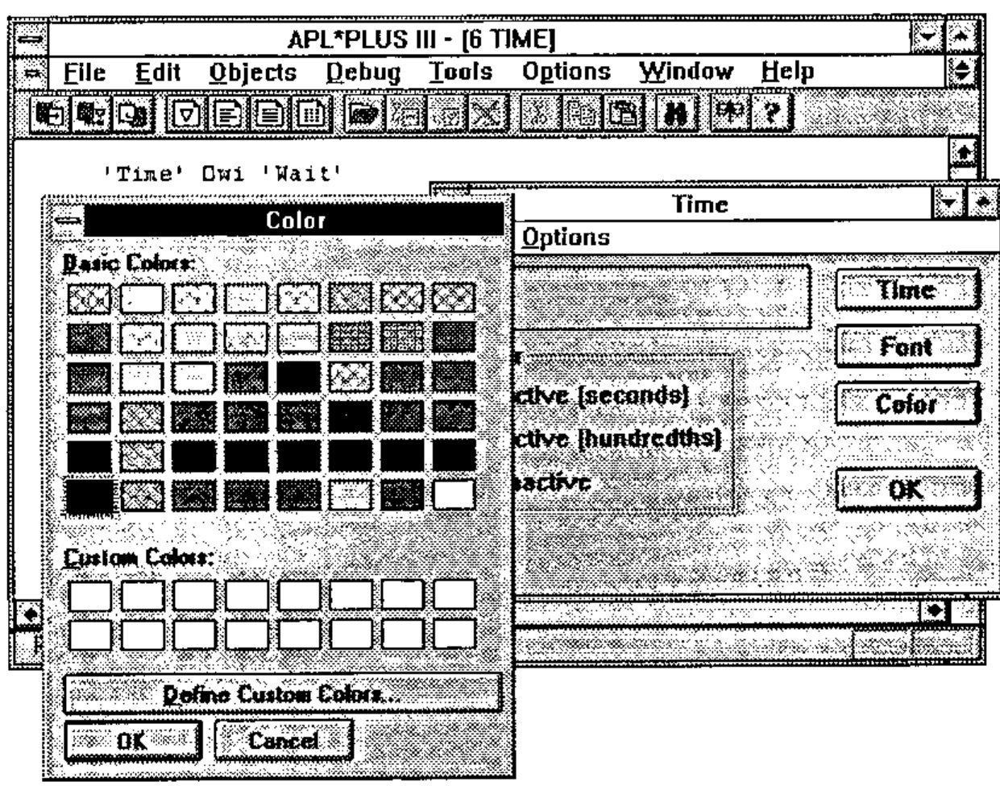
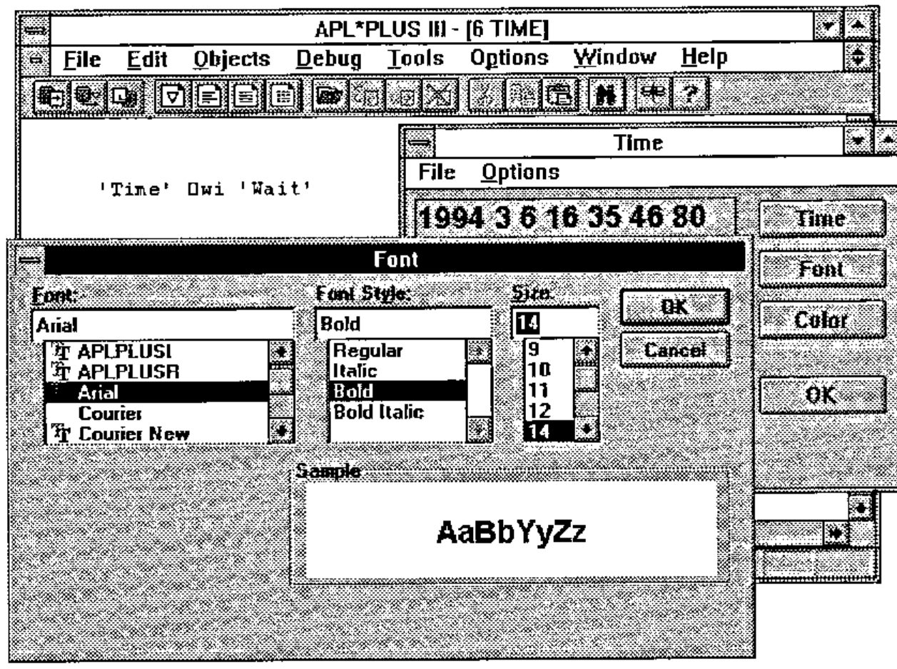
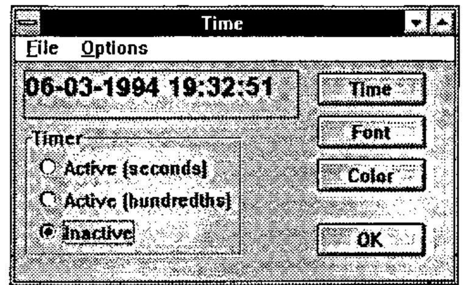

*by Eric Lescasse, Part II of II*
{ .byline }

## Introduction

The goal of this article is to show how to approach building Windows applications with APL. To do this, we will use APL\*PLUS III for Windows, version 1.1, the new product from Manugistics, Inc. You will see that programming Windows applications, a task reputed to be more difficult overall than DOS application programming, is in fact

- within the reach of all APL developers, even the most occasional ones
- much more simple than developing in APL under DOS.

The resulting applications involve much less APL code, and are much more reliable and easier to maintain. Moreover, you still continue to have 100% of the traditional characteristics of APL at your disposal, in particular its unequalled interactive development environment, its great power for modelling and data processing, and its unsurpassed speed for processing large amounts of data.

## Saving Windows

By querying the *def* property of an object, we can obtain a snapshot of the object in the form of an APL variable.

For example:

```apl
      Time_def←'Time' ⎕wi 'def'
      ⎕pw←60
      Time_def
710430785 65539 19940305 162231800 OTime 8589934592 CForm 7
   68 Pcaption Time C_Window 512 Pwhere  7.25 33.625 13 4
   0  OTime 0 CButton 1024 Pcaption Time C_Window 512 Pwh
   ere  4.875 14.5 1.5 10  HonClick Time OlTime 0 CLabel
   2560 Pcaption 1994 3 5 16 22 13 400 C_Window 512 Pbord
   er 1 Pwhere  1 1 1.2 20

      ⍴Time_def
38
      ⎕pw←80
```

Our form `Time` is thus saved in an APL variable named `Time_def`, which is a nested array of 38 elements. This variable can be:

- saved with the workspace
- stored in an APL\*PLUS component file
- copied from one workspace to another, etc…

If we destroy our form `Time` by applying the method `Delete`:

```apl
'Time' ⎕wi 'Delete'
```

we can recreate it later with the following simple instruction:

```apl
'Time' ⎕wi 'New' Time_def
```

Even better, you can save only a part of a Windows form in this way, for example, a frame and all the radio buttons it contains, and re-install all of these sub-objects in another form, with one simple instruction like this:

```apl
'New_form.New_frame1' ⎕wi 'New' Frame_def
```

## Let’s Make Our Application More Lively!

We are going to modify our Windows application so it displays the time continuously in the label `lTime`. To do this, we need to use a new kind of object called a **Timer**, which is independent of our form:

```apl
'tTime' ⎕wi 'New' 'Timer' ('interval' 1000) ('onTimer' 'Time')
```

The above instruction creates a Windows timer, gives it an interval property equal to 1000 milliseconds (one second) and indicates that the "callback" function to be executed at each expiration of the Timer is our function `Time`, which is already written.

Press **Alt-Tab** to make our window appear. We can see that the exact time now displays continuously in our window. Note that the button `Time` remains active and continues to operate correctly. To ascertain the execution speed of APL\*PLUS III, let’s modify the interval property of our Timer to give it a value of 10 ms:

```apl
'tTime' ⎕wi 'interval' 10
```

Press **Alt-Tab** to make the form reappear. We can see that the time is updated every hundredth of a second! Notice that, without closing the Time window, you can click in the APL session and continue to work without any slowdown!

## The Window Editor `]WED`

We will now make the following modifications to our window to complete it:

- move the **Time** button toward the top right part of the window
- Add a button **Font**
- Add a button **Color**
- Add a button **OK**
- Add a frame **Timer**, containing
    - a radio button **Activate (seconds)**
    - a radio button **Activate (hundredths)**
    - a radio button **Inactive**
- Add a menu with the selections <u>F</u>ile and <u>O</u>ptions.

The `]WED` editor is written in the form of a User Command so it is available in every APL workspace, even in a clear workspace. It is an interactive resource editor, that lets you create or modify windows, dialog boxes, or menus, letting you work mainly with the mouse.

```apl
]Wed Time
```

After using the editor to make our modifications, the screen looks like:



The `]WED` editor contains three windows:

- The top window, called *Wed*

    This lets you chose the object (**<u>O</u>bject**) that you want to work with (left combo box), the property (**<u>P</u>roperty**) that you want to modify or the event that you want to handle (middle combo box), and the value (**<u>V</u>alue**) that you want to give it (input field on the right).

- The window at left (with no title)

    This contains the tool palette, in which each icon represents a class of object that you can create in your window. By clicking on one of these buttons, then "dragging" with the right mouse button to set the size of the object in the form.

- The form being edited (in this case, the form **Time**)

After exiting from the `]WED` editor, you will find that you have a variable `Time_def` containing a description of our form.

The menus in our form have been created with the aid of the menu editor that you can invoke from within the **Wed** form by choosing the **<u>M</u>enu** option from the **<u>E</u>dit** menu or typing the "shortcut" key **Ctrl-M**.



From the `]WED` editor you can also directly define the "callback" functions associated with events that you wish to handle in your form, and also test the functionality of your form.

After exiting from `]WED`, we re-create our form with the instruction:

```apl
'Time' ⎕wi 'New' Time_def
```

Having defined the menus for our form `Time` with the menu editor, let’s see how we could have defined them with the system function `⎕wi`.

In the instructions that follow note that the periods (.) indicate the hierarchy of the menus and that the ampersand (&) indicates the character that will be underlined in the menus.

```apl
'Time.File' ⎕wi 'New' 'Menu' ('caption' '&File')
'Time.File.Exit' ⎕wi 'New' 'Menu' ('caption' 'E&xit')
     ('onClick' 'Exit')
'Time.Options' ⎕wi 'New' 'Menu' ('caption' '&Options')
'Time.Options.Font' ⎕wi 'New' 'Menu' ('caption' '&Font')
    ('Shortcut' 'F' 2)('onClick' 'Font')
'Time.Options.Sep1' ⎕wi 'New' 'Menu' ('separator' 1)
'Time.Options.Color' ⎕wi 'New' 'Color' ('caption' '&Color')
    ('shortcut' 'C' 2)('onClick' 'Color')
```

Now we need to write our "callback" functions `Font` and `Color`, as well as handle the button **OK** so it ends our application and closes our form.

This last task is very simple. It suffices to assign the value 2 to the `style` property of the **OK** button, with the following instruction:

```apl
'Time.OK' ⎕wi 'style' 2
```

Click on the **OK** button and note that the window is closed. To reactivate the `Time` form, do this:

```apl
'Time' ⎕wi 'Wait'
```

Now let’s define the callback function `Color` like this:

```apl
    ∇ Color;A;⎕wself
[1]   ⎕wself←'Time.lTime'
[2]   :if ~0≡A←WChooseColor ⎕wi'color'
[3]       ⎕wi 'color' (1⊃A)
[4]   :end
    ∇
```

and copy the utility function `WChooseColor` and its subroutines into the workspace:

```apl
      )copy c:\aplw\tools\windows WChooseColor WhwndOwner
SAVED 02/18/1994 08:40:15
      )copy c:\aplw\tools\winapi D2C I2C W_Mem
SAVED 02/17/1994 18:15:39
```

Now click on the **Color** button. You will obtain a screen similar to the following:



Now let’s bring the **Font** button in our form to life. We’ll define the "callback" function `Font`, which modifies the font property of the `lTime` label, as follows:

```apl
    ∇ Font;A;⎕wself
[1]   ⎕wself←'Time.lTime'
[2]   :if ~0≡A←WChooseFont ⎕wi'font'
[3]       ⎕wi 'font' (1⊃A)
[4]   :end
    ∇
```

and copy the utility function `WChooseFont` and its subroutines into our workspace:

```apl
      )copy c:\aplw\tools\windows WChooseFont
SAVED 02/18/1994 08:40:15

      )copy c:\aplw\tools\winapi W2C C2I
SAVED 02/17/1994 18:15:39
```

Now, press the **Font** button in our **Time** form. A screen similar to the following will appear:



## Activating the Menus

To make the menu options active, we set their `onClick` properties to execute the "callback" functions that are already created:

```apl
'Time.Options.Font' ⎕wi 'onClick' 'Font'
'Time.Options.Color' ⎕wi 'onClick' 'Color'
```

For the <u>E</u>xit option of the <u>F</u>ile menu to be able to close the form, it must apply the `Close` method to the form:

```apl
'Time.File.Exit' ⎕wi 'onClick' 'Close'
```

The "callback" function `Close` is defined as follows:

```apl
    ∇ Close;A
[1]   A←'Time' ⎕wi 'Close'
    ∇
```

## Handling the Radio Buttons

Using the `]WED` editor, we have created a frame that we have called `fTimer`, and some radio buttons that we have named **Seconds, Hundredths,** and **Inactive.**

Let’s associate with each of these buttons a "callback" function to handle a mouse click.

```apl
'Time.fTimer.Seconds'  ⎕wi 'onClick' 'Timer'
'Time.fTimer.Hundredths' ⎕wi 'onClick' 'Timer'
'Time.fTimer.Inactive' ⎕wi 'onClick' 'Timer'
```

Note that we use the same "callback" function that, for simplicity, we have called `Timer`. This function is defined in the following fashion:

```apl
    ∇ Timer;w
[1]   'tTimer' ⎕wi 'Delete'
[2]   :select ⎕wi '.name'
[3]       :case 'Seconds'
[4]           w←'tTimer' ⎕wi 'New' 'Timer'
[5]                w ⎕wi 'interval' 1000
[6]                w ⎕wi 'onTimer' 'Time'
[7]                Time
[8]       :case 'Hundredths'
[9]           w←'tTimer' ⎕wi 'New' 'Timer'
[10]               w ⎕wi 'interval' 10
[11]               w ⎕wi 'onTimer' 'Time'
[12]  :endselect
    ∇
```

You will notice that this function uses a "control structure" of the type `:SELECT …. :CASE … :CASE … :ENDSELECT` (the control structures, like the system functions and system variables of APL\*PLUS III, can be written with either uppercase or lowercase letters).

This is an important innovation for APL that permits the language to be structured and brings it closer to traditional languages such as Visual Basic or C++. This also simplifies reading programs and facilitates maintaining APL applications.

The function `Timer` begins by cancelling the timer `tTimer` (line 1), then tests the name of the radio button that was clicked ( ‘Seconds’, ‘Hundredths’, or ‘Inactive’). Notice that inside the callback function it is not necessary to specify the name of the object being processed in the left argument to `⎕wi`.

The instruction `:select` tests which radio button has been clicked: if it is the button named **Seconds,** lines 4 through 7 are executed, and if it is button **Hundredths,** lines 9 through 11 are executed. The function `Timer` then creates a timer with an interval of 1 second if the user selected button 1, and an interval of 1/100 second if the user selected button 2.

Now we will modify our callback function `Time`, so it writes the data and time in a more agreeable form and so it does not show the milliseconds if the one-second timer is running.

Here is the new code for the function `Time`:

```apl
    ∇ Time;A;B;C;D
[1]   A←'Time.fTimer.Seconds' ⎕wi 'value'
[2]   :if A
[3]       B←⎕ts[3 2 1 4 5 6]
[4]       C←'G<99-99-9999 99:99:99>'
[5]       D←100 100 10000 100 100 100⊥B
[6]   :else
[7]       B←⎕ts[3 2 1 4 5 6 7]
[8]       C←'G<99-99-9999 99:99:99 999>'
[9]       D←100 100 10000 100 100 100 1000⊥B
[10]  :end
[11]  'Time.lTime' ⎕wi 'caption' (,C ⎕fmt D)
    ∇
```

Line 1 queries the value property of the first radio button (**Seconds**): the result will be 1 if the radio button is selected and 0 if it is not. Then we use the control structure `:IF … :ELSE … :END` to reduce the format of the time (eliminating the milliseconds) if the first radio button is selected.

On line 11 we use a "picture" type format instruction (which reminds one of those used by COBOL programmers) to format the date and time.

Our form now has the following appearance:



## Low-Level Calls

APL\*PLUS III allows you to:

- Call any other Windows application from your APL application
- Make calls to the hundreds of base functions in the Windows API
- Use any other commercially available DLL library and provide you with the services of the utilities it contains

The following section will show us how to do this.

## Transforming Our Application into a Multimedia Application

By way of example, we are going to complete our callback function `Time`, so that our window beeps every fifteen seconds and plays chimes on the minute.

Calling a function in the base Windows API is done with the aid of the system function `⎕wcall`. It is in general quite simple. You need to have the documentation of the Windows API at your disposal to know the list of available functions and their syntax.

Let’s call the function Windows API function **MessageBeep** to emit a beep sound. Try the following instruction:

```apl
      ⎕wcall 'MessageBeep' 0
1
```

A beep sound is produced and the function `⎕wcall` immediately returns the result of the function **MessageBeep**, which is 1.

Now we will show how we can as easily call an application written in another language from APL. To illustrate this point, we have written a very small Visual Basic application, that we have compiled and called **MM.EXE**.

This application uses the multimedia functions of Windows to generate a sound resembling chimes, a sound recorded in a .WAV file. It makes the sound **TADA.WAV** supplied with Windows.

To execute our Visual Basic application from APL:

```apl
      ⎕wcall 'WinExec' 'c:\vb\work\mm.exe' 'sw_show'
33
```

This instruction returns the instance number of the Visual Basic application. The sound **TADA.WAV** is then played on the sound card.

Now let’s make the final changes to our function `Time` to transform our Windows application into a multimedia Windows application.

```apl
    ∇ Time;A;B;C;D
[1]   A←'Time.fTimer.Timer[1]' ⎕wi 'value'
[2]   :if A
[3]       B←⎕ts[3 2 1 4 5 6]
[4]       C←'G<99-99-9999 99:99:99>'
[5]       D←100 100 10000 100 100 100⊥B
[6]   :else
[7]       B←⎕ts[3 2 1 4 5 6 7]
[8]       C←'G<99-99-9999 99:99:99 999>'
[9]       D←100 100 10000 100 100 100 1000⊥B
[10]  :end
[11]  'Time.lTime' ⎕wi 'caption' (,C ⎕fmt D)
[12]  :if A
[13]      :select B[6]
[14]          :case 0
[15]             A←⎕wcall 'WinExec' 'c:\vb\work\mm.exe' 'sw_show'
[16]          :caselist 15 30 45
[17]             A←⎕wcall 'MessageBeep' 0
[18]      :end
[19]  :end
    ∇
```

To do this, we add lines 11 through 17. Note the nested control structures, and the possibility of using the `:caselist` option with the `:select` control structure.

`B[6]` represents the sixth element of our date/time vector, the seconds. In the case where it strikes the minute mark (`:case 0`), it calls our Visual Basic application to play the chimes, and in the case where the seconds are valued 15, 30, or 45 (`:caselist 15 30 45`), it only produces the beep sound.

## Conclusion

Windows programming becomes something very simple with the object-oriented tools of APL\*PLUS III. Very few of the languages or tools on the market let you develop under Windows as easily and as rapidly. Even Visual Basic, which we have used for several months, proves to be more laborious and slower overall than APL\*PLUS III. C is undoubtedly faster in execution, but consumes much more time (and therefore costs) in development.

APL is simultaneously becoming more innovative and better structured. The examples in this complete application show clearly that it is now possible to develop APL applications using few APL primitives and yielding programs that are easily readable and maintainable.

What gives APL its remarkable power remains, as always:

- its remarkable interactivity
- its great powers in handling arrays of data.

Very few languages fit with Windows as well as APL. Those APL users who are already developing under Windows are enjoying these benefits now.

## Listing of the APL Programs for the `WinTime` Application

We have named our little Windows application `WinTime`. The main function `WinTime` repeats the main instructions (used in calculator mode in this article) that create our application’s windows.

Note that in real application development you would not need to write a function like this, with the position and properties of every object coded by hand. Instead you would design the form with the visual editor `]wed` and interactively develop and test the code that works with it. Then, you would generate this main function automatically using the utility command `]wmake` that is part of the built-in utility library of APL\*PLUS III.

Following the main function are all the functions in the `WinTime` application. Note also that all the lines in certain functions have been commented to make them easier to read. Other programs have been abundantly explained in the article.

An excellent practice that we recommend to everyone is systematically to include a comment on each line of code and to align the comment symbols in column 40 (that is, in the middle of the screen). This facilitates maintenance of the code and, moreover, forces one to write short lines of code.

```apl
    ∇ WinTime;w
[1]   ⍝∇ Sample Windows Application written in APL*PLUS III v1.1
[2]   ⍝∇ Eric Lescasse 18-02-1994
[3]
[4]    'Time' ⎕wi 'Delete'                ⍝ deletion of the form
[5]
[6]   w←'Time' ⎕wi 'New' 'Form'           ⍝ creation of the form
[7]       w ⎕wi 'onDestroy' 'KillTimer'
[8]   w←'Time.Time' ⎕wi 'New' 'Button'
[9]       w ⎕wi 'where' .5 28 1.5 10
[10]      w ⎕wi 'onClick' 'Time'
[11]  w←'Time.Font' ⎕wi 'New' 'Button'
[12]      w ⎕wi 'where' 2.5 28 1.5 10
[13]      w ⎕wi 'onClick' 'Font'
[14]  w←'Time.Color' ⎕wi 'New' 'Button'
[15]      w ⎕wi 'where' 4.5 28 1.5 10
[16]      w ⎕wi 'onClick' 'Color'
[17]  w←'Time.OK' ⎕wi 'New' 'Button'
[18]      w ⎕wi 'where' 7.5 28 1.5 10
[19]      w ⎕wi 'style' 2
[20]  w←'Time.lTime' ⎕wi 'New' 'Label'
[21]      w ⎕wi 'caption' ''
[22]      w ⎕wi 'border' 1
[23]      w ⎕wi 'where' .5 1 2 25
[24]  w←'Time.fTimer' ⎕wi 'New' 'Frame'
[25]      w ⎕wi 'where' 3 1 6 20
[26]  w←'Time.fTimer.Seconds' ⎕wi 'New' 'Option'
[27]      w ⎕wi 'caption' 'Active (seconds)'
[28]      w ⎕wi 'onClick' 'Timer'
[29]      w ⎕wi 'where' 1.25 1.25 1.27 17.5
[30]  w←'Time.fTimer.Hundredths' ⎕wi 'New' 'Option'
[31]      w ⎕wi 'caption' 'Active (hundredths)'
[32]      w ⎕wi 'onClick' 'Timer'
[33]      w ⎕wi 'where' 2.75 1.25 1.27 17.5
[34]  w←'Time.fTimer.Inactive' ⎕wi 'New' 'Option'
[35]      w ⎕wi 'caption' 'Inactive'
[36]      w ⎕wi 'onClick' 'Timer'
[37]      w ⎕wi 'where' 4.25 1.25 1.27 17.5
[38]
[39]  w←'Time.File' ⎕wi 'New' 'Menu'       ⍝ menu definitions
[40]      w ⎕wi 'caption' '&File'
[41]  w←'Time.File.Exit' ⎕wi 'New' 'Menu'
[42]      w ⎕wi 'caption' '&Exit'
[43]      w ⎕wi 'onClick' 'Close'
[44]  w←'Time.Options' ⎕wi 'New' 'Menu'
[45]      w ⎕wi 'caption' '&Options'
[46]  w←'Time.Options.Font' ⎕wi 'New' 'Menu'
[47]      w ⎕wi 'caption' '&Font'
[48]      w ⎕wi 'shortcut' 'F' 2
[49]      w ⎕wi 'onClick' 'Font'
[50]  w←'Time.Options.Sep1' ⎕wi 'New' 'Menu'
[51]      w ⎕wi 'separator' 1
[52]  w←'Time.Options.Color' ⎕wi 'New' 'Menu'
[53]      w ⎕wi 'caption' '&Color'
[54]      w ⎕wi 'shortcut' 'C' 2
[55]      w ⎕wi 'onClick' 'color'
[56]  'Time' ⎕wi 'Wait'                   ⍝ call the window
    ∇

    ∇ Time;A;B;C;D
[1]   A←'Time.fTimer.Seconds' ⎕wi 'value'
[2]   :if A
[3]       B←⎕ts[3 2 1 4 5 6]
[4]       C←'G<99-99-9999  99:99:99>'
[5]       D←100 100 10000 100 100 100 ⊥B
[6]   :else
[7]       B←⎕ts[3 2 1 4 5 6 7]
[8]       C←'G<99-99-9999  99:99:99 999>'
[9]       D←100 100 10000 100 100 100 1000 ⊥B
[10]  :end
[11]  'Time.lTime' ⎕wi 'caption' (,C ⎕fmt D)
[12]  :if A
[13]      :select B[6]
[14]         :case 0
[15]             A←⎕wcall 'WinExec' 'c:\vb\work\mm.exe' 'sw_show'
[16]         :caselist 15 30 45
[17]             A←⎕wcall 'MessageBeep' 0
[18]      :end
[19]  :end
    ∇

    ∇ Font;A;⎕wself
[1]   ⎕wself←'Time.lTime'                ⍝ be on the object lTime
[2]   :if ~0≡A←WChooseFont ⎕wi'font'     ⍝ call the font dialog box
[3]       ⎕wi 'font' (1⊃A)               ⍝ apply font to lTime
[4]   :end
    ∇

    ∇ Color;A;⎕wself
[1]   ⎕wself←'Time.lTime'                ⍝ move to form
[2]   :if ~0≡A←WChooseColor ⎕wi'color'   ⍝ color choice dialog box
[3]        ⎕wi 'color' (1⊃A)             ⍝ apply to label lTime
[3]   :end
    ∇

    ∇ Timer;w
[1]   'tTimer' ⎕wi 'Delete'               ⍝ clear existing timer
[2]   :select ⎕wi '.name'                 ⍝ which radio button?
[3]       :case 'Seconds'                 ⍝ if it's the first...
[4]         w←'tTimer' ⎕wi 'New' 'Timer'  ⍝ we create a timer ...
[5]           w ⎕wi 'interval' 1000       ⍝ with a 1sec interval
[6]           w ⎕wi 'onTimer' 'Time'      ⍝ exec Time when fired
[7]           Time                        ⍝ and update the time
[8]       :case 'Hundredths'              ⍝ if it's the sec button
[9]         w←'tTimer' ⎕wi 'New' 'Timer'  ⍝ we create a timer
[10]          w ⎕wi 'interval' 10         ⍝ with a 1/100s interval
[11]          w ⎕wi 'onTimer' 'Time'      ⍝ run Time each 1/100s
[12]  :endselect
    ∇

    ∇ Close;A
[1]   A←'Time' ⎕wi 'Close'                ⍝ close the form
    ∇

    ∇ KillTimer
[1]   'tTimer' ⎕wi 'Delete'               ⍝ 'kill' the timer
    ∇
```
