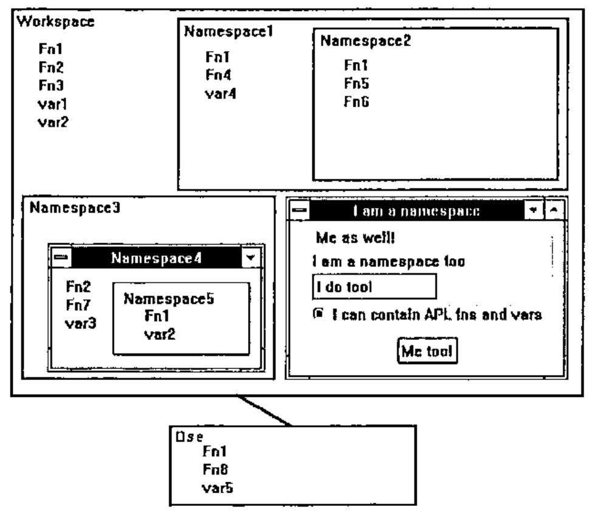
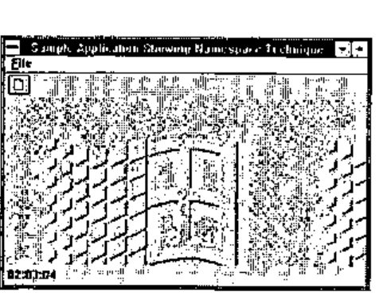
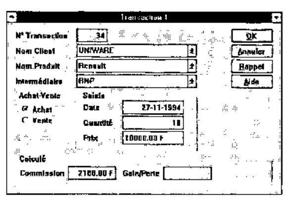

*by Eric Lescasse (Uniware)*
{ .byline }

## Introduction

I have always been very surprised to notice how slow APL users are, in general, to start using new features of the language. We have seen that only a rather small percentage of the user base is taking advantage of such simple, powerful and useful tools as the APL\*PLUS User Command Processor, error handling facilities (including wonderful utilities like *HANDLERFOR* or *ELXHANDLER*) and nested arrays. On the other hand, one encouraging note is how well the Control Structures have been accepted and adopted by the APL\*PLUS community.

But, I have asked myself several times what are the conditions for a new feature to be adopted by APL users **quickly**. I think they are multiple:

- there needs to be a lot of noise and publicity made around the new feature
- people have to understand the new feature and what benefits it can bring to them
- the new feature has to be simple to use (i.e. control structures) and really useful
- users have to be educated in simple terms about the new feature

I think, among these 4 conditions, the second two, and especially the last, are by far the most important and I feel that it is through the lack of them that many APL users are still using only a small part of their favourite software.

One brand new concept recently brought to APL is the one of *namespaces*. This article is aimed to help people discover namespaces (a new Dyalog APL feature), and show them a few simple techniques involving namespaces that can make a huge difference in terms of development ease.

## What are Namespaces?

To simplify, namespaces are just sub-workspaces:

> One workspace can contain one or more namespaces, as well as other objects: functions, variables and GUI (Graphical User Interface) objects like forms.
>
> A workspace always has a root namespace (represented by `#`).
>
> A namespace can itself contain other namespaces, as well as other objects: functions, variables and GUI objects.
>
> In fact, a GUI object, like a form, is itself a namespace, and every other GUI object (buttons, list boxes, combos, scroll bars, you name them) are all namespaces.

One consequence, which we will be using a lot, is that any GUI object, being a namespace, can itself contain functions and variables. These functions and variables are said to be "encapsulated" within the GUI object. Another consequence is that the workspace and its own namespaces constitute a hierarchy.

Here is a simple diagram better explaining what namespaces are:


As one can see, several objects can have the same name within one workspace, provided that they belong to different namespaces.

## Notation

The dot serves as a separator to denote the hierarchy leading to one object. Thus, function *Fn1* within *Namespace5* is represented by the following full name:

```apl
Namespace3.Namespace4.Namespace5.Fn1
```

while function *Fn1* in *Namespace1* is represented by the following full name:

```apl
Namespace1.Fn1
```

and *Fn1* within the workspace is represented by the following full name:

```apl
Fn1
```

All this, assuming that we are positioned within the root namespace of our workspace. Yes, you guessed it: you can decide to position yourself within any of your workspace namespaces, in which case names are relative to the place where you stand.

Assume you have put yourself within *Namespace4*: to access function *Fn1* in *Namespace5* from there, you only need to type:

```apl
Namespace5.Fn1
```

If you positioned yourself within *Namespace2*, you can type:

| | |
|---|---|
| `Fn1` | to execute the *Namespace2* *Fn1* function |
| `##.Fn1` | to execute the *Namespace1* *Fn1* function |
| `#.Fn1` | to execute the workspace *Fn1* function |
| `#.Namespace1.Fn1` | to execute the *Namespace1* *Fn1* function |

`##` represents the parent namespace. `#` represents the workspace itself.

This notation is very similar to the DOS notation used to access files within directories, so you will quickly feel very comfortable with it.

All this is very simple, isn’t it.

## The APL Session Namespace (`⎕se`)

Namespaces are a brilliant idea. But the implementors have had a second brilliant idea which marries well with namespaces.

The APL session itself, which is your development environment, with its own menus, toolbar, statusbar, is itself a Dyalog APL GUI object, called `⎕se`, hence a namespace! This not only means that you can configure it at will (i.e. you can change its menus to your own native language, change the toolbar and the statusbar, etc...), but you can also store objects within it, namely, functions, variables and other namespaces!

`⎕se` works as an external namespace, relative to your workspace. This means that if you load another workspace you can still directly access objects within `⎕se`; this means that if you do `)clear` you can still directly access objects within `⎕se`.

That leads to an immediate idea: store your main and most often used utilities, forms, … within `⎕se`. They will suddenly become available to you at all times, while you work in Dyalog APL. The previous diagram becomes:



To execute the `⎕se` *Fn1* function, from your workspace or from any namespace in your workspace, just enter:

```apl
⎕se.Fn1
```

If you positioned yourself inside `⎕se`, you can enter:

| | |
|---|---|
| `#.Fn1` | to execute your workspace *Fn1* function |
| `#.Namespace1.Fn1` | to execute your *Namespace1* *Fn1* function |

## Positioning Yourself in a Namespace

The `)CS` command is used to position yourself in any namespace.

The `)NS` command, used "niladically", tells you in which namespace you currently are. Here are a few examples:

```apl
      )ns
#                      ⍝ we start from the root namespace in your workspace

      )cs Namespace1   ⍝ change from root to Namespace1
#.Namespace1           ⍝ we are now in Namespace1

      )ns              ⍝ proof
#.Namespace1

      )cs Namespace2   ⍝ change from Namespace1 to Namespace2
#.Namespace1.Namespace2      ⍝ we are now in Namespace2

      )cs ##           ⍝ change to parent namespace
#.Namespace1

      )cs Namespace2   ⍝ back into Namespace2 again
#.Namespace1.Namespace2

      )cs #.Namespace3.Namespace4   ⍝ change from Namespace2 to Namespace4
#.Namespace3.Namespace4

      )cs              ⍝ niladic )cs brings back to root namespace
#
```

As you see, navigating between namespaces is fairly easy.

## Creating New Namespaces

You use the `)NS` command to create namespaces. Examples:

```apl
      )ns
#                      ⍝ we start from the root namespace

      )ns Namespace6   ⍝ create Namespace6
#.Namespace6           ⍝ echo

      )ns
#                      ⍝ pay attention: we are still in the root namespace

      )cs Namespace6   ⍝ shift from root namespace to new Namespace6
#.Namespace6

      )ns Namespace7   ⍝ create sub-namespace Namespace7
#.Namespace6.Namespace7

      )ns #.Namespace8 ⍝ from N'space6, create Namespace8 as child of root
#.Namespace8

      )ns
#.Namespace6

      )cs
#

      )ns Namespace9.Namespace10   ⍝ create 2 new namespaces at once
#.Namespace9.Namespace10
```

Nothing difficult in all this either.

There is another way of creating a new namespace, and, as you guessed, it is to create any new GUI object, using `⎕wc`. Examples:

| | |
|---|---|
| `'F' ⎕wc 'Form'` | create namespace *F* (and also create form *F*, of course!) |
| `'F.OK' ⎕wc 'Button'` | create namespace *OK* as a child of namespace *F* |

## Moving Objects from Namespace to Namespace

The dyadic `⎕ns` system function is used to:

- create new namespaces (if left argument is not an existing namespace)
- move objects from one namespace to another (if right argument is not empty)
- report current namespace (if both arguments are empty)

Its syntax is:

```apl
R ← D ⎕ns S
```

where:

| | |
|---|---|
| *R* | is the full name of the *D* namespace |
| *D* | is the destination namespace (created by `⎕ns` if non existent) |
| *S* | is one or more objects to be copied into *D* |

Examples:

```apl
      'Namespace11' ⎕ns ''          ⍝ create Namespace11
#.Namespace11

      'Namespace11' ⎕ns '#.Namespace1.Fn1' '#.Namespace3.Namespace4.Fn2'
#.Namespace11                       ⍝ copy 2 functions into Namespace11

      'Namespace12' ⎕ns '#.Fn1' '#.Fn2'   ⍝ create Namespace12 and copy into it
#.Namespace12
      '' ⎕ns ''                     ⍝ report current namespace name
#

      )cs Namespace12
#.Namespace12

      )fns
Fn1  Fn2
```

Note that a simple way to copy variables from one namespace to another can be achieved by the following simple method:

```apl
dest.var ← source.var
```

where *dest* is the destination namespace and *source* the source namespace.

Example:

```apl
#.var3 ← #.Namespace3.Namespace4.var3
```

## Rules for Evaluation

The last important topic to understand, before we move to the major subject of this article, concerns the way the interpreter evaluates expressions when they involve namespaces. Assume we are positioned in the workspace root namespace and want to execute the following expression:

```apl
R ← Namespace1.Fn1 var1
```

where *var1* is a variable in the root namespace. Dyalog APL does the following:

- evaluates variable *var1* in the root namespace to produce argument for function
- switches to namespace *Namespace1*
- executes function *Fn1* within *Namespace1*, using argument *var1* from root namespace
- switches back to root namespace
- assign variable *R* in root namespace

One very important notion to understand is that, while *Fn1* is executing, in the previous example, it is executing WITHIN *Namespace1*. That means, that, if it needed to use variable *var2* from the root namespace, it should refer to it as `#.var2` and NOT just as `var2`.

This is essential to understanding how to work with namespaces.

## What Else Can You Do with Namespaces?

Most system functions and the `⍎` primitive are namespace aware. This means you can do such things as:

```apl
      )ns
#.Namespace1
      #.Namespace3.Namespace4.⎕nl 2
var3
      '#' ⍎ 'Fn1'
      ⎕se.⎕ed 'Deb'
      Namespace2.var1←⍳10
```

## Benefits from Using Namespaces

After having read these few pages introducing namespaces, you have understood most namespaces concepts, but may be still asking yourself what are your benefits of using such things?

In fact they are numerous. Namespaces can help you:

1. **Store your utilities in the `⎕se` namespace and have them handy at any time.** This is probably one of the first things you will want to do. It brings similar advantages as APL\*PLUS User Command Processor, with better performance. I could no longer work in APL without either one of these tools.
2. **Avoid name conflicts.** Example: if you kept your workspace root namespace empty and stored all your functions and variables in namespaces, you would never worry about name conflicts when copying objects in your workspace.
3. **Clean up your workspace and group objects logically.** And do not clutter any namespace with hundreds of functions and variables.
4. **Avoid local functions.** They can be replaced by identical functions called from namespaces.
5. **Have several objects with the same name within one workspace.** Namespace will let you do such things as emulate the following SQL syntax:

    ```text
    select employee.name,dept.name,employee.salary
    from Employee where employee.id eq dept.id
    ```

    where *name* and *id* would be variables residing in the *employee* and *dept* namespaces! This would have been impossible without namespaces or without using quotes.

6. ***Encapsulate* all callback functions in GUI objects.** This really is the major advantage of namespaces, in my opinion. And I will conclude this article by showing a namespace technique which greatly simplifies the programming of GUI objects and of Windows applications with Dyalog APL/W.
7. **Exchange information between GUI objects without using global variables or *'data'* property.** It very often occurs when programming GUI objects that a callback routine needs a piece of information created by another callback routine. Unfortunately, the nature of event driven programming makes all callback functions independent of each other and moreover global objects in the workspace. Therefore the only way to pass information from one to another is to use global variables. But as you all know, this is not good APL programming practice and should be avoided. Both APL\*PLUS and Dyalog APL provide a *'data'* property for almost all of their objects, within which you can store any amount of information. But there is only one data property per object and, even if you store nested arrays in it, it is not as convenient to use as just storing variables in the object namespace.

There are certainly several other advantages of using namespaces which I have not yet discovered or used, but these ones are already more than enough to make me wish that namespaces one day become standard in any APL. As well as control structures!

## A Useful and Simple Namespace Technique to Program GUI Objects

### GUI programming

The previous pages were necessary for Dyalog APL/W or namespace novices to understand the following part of this article. We have seen that each GUI object has its own namespace. The whole job of GUI programming is to write small APL routines to react to events occurring on GUI objects.

The work is quite simple:

- create and design your form, installing objects in it and giving them properties
- identify all user events that can occur on these objects
- write one APL callback function for each (object, event) couple

For example, if one wants to react to a user click on the *OK* button of form *F*, one needs to associate an APL function to the *'Select'* event on the *'F.OK'* button, with the following expression:

```apl
'F.OK' ⎕WS 'Event' 'Select' 'F_OK_Click'
```

where *F_OK_Click* is the name of the APL callback function.

When the user clicks on the *OK* button, the APL interpreter instantaneously executes *F_OK_Click* because it knows, since our `⎕ws` expression, that we have associated this name to the *'Select'* (alias click) event on the button.

### Problems with GUI programming

The problem is that the GUI programmer quickly discovers that his workspace soon gets cluttered with hundreds of callback functions. This is because one dialog box can easily contain 20 objects and each of those can easily get several different events. Remember that you have to write one APL function for each (object, event) couple.

A second problem is that your form and all of its children objects will not run unless all of its callback functions and (global!) variables are there with it in the same workspace environment.

Imagine one day wanting to copy this form object into a new workspace and then discovering that you have also to copy a hundred callback functions to choose among a thousand functions residing in the source workspace. What a headache!

### A solution to the problems of GUI programming

The answer, of course, comes from namespaces. Here are the rules:

- It seems natural to store a callback function in the object (namespace) to which it refers
- It seems natural to name this callback function before the event it handles

For example, an APL callback function handling the Select event on a button, will be named *Select* and will be stored in the button namespace.

We would then really use a lot of the power of namespaces: we will have several functions in our workspace bearing the same name (*Select* for example): only namespaces allow that!

We will also encapsulate all callbacks within our form and its child objects, making our form self-functioning. We can then copy it as a stand-alone object in another workspace and start using it immediately: it will run perfectly, because the hundred callback functions will have been carried with it when copied into the new workspace.

That’s great: it means we can write self-functioning forms!

We have spent years writing utility functions, and creating our own library of powerful utilities to develop lightning fast with APL: it means we can now start writing utility forms or better, what I will call **PARTS**, i.e. GUI objects that we can easily plug into any new application we write.

Imagine: almost all Windows applications have a *File* menu and the *File* menu structure is fairly standard: even the accelerator keys it uses tend to be standard across applications. Well, we can use namespaces and write a *File* menu **PART** which will encapsulate parameterized callbacks.

Then we can plug it in any new Windows application we write, just as is, or clone it with `⎕OR` and change it by exception. Half an hour (or may be an hour) saved each time.

### A namespace technique that will save you a lot of time and effort

With Dyalog APL/W, you generally start developing your forms with the *WDESIGN* workspace which is a nice resource editor. However, once you have designed your form and set most of its properties and children’s properties, you generally want to create a *_MAKE* function representing your form and start working with this *_MAKE* function, forgetting about *WDESIGN*.

If you install callbacks within your form objects, they will be lost every time you run your *_MAKE* function, since the *_MAKE* destroys your form when recreating it with `⎕WC`.

Soon comes the idea of installing the callback functions within the *_MAKE* function so that they are re-installed properly within their relevant objects’ namespace every time *_MAKE* is rerun. *The namespace technique I have developed is doing exactly that.* We have worked with it for a couple of months, developed a lot of forms using it, and it has proved to be a real time and effort saver, for programming GUI objects.

How does it work in practice? It is best described by an example.



Here is a sample application: It is a simple MDI application which shows several objects:

- a form
- a menu bar with a File menu
- a toolbar with one icon
- a status bar with one field displaying the current time
- an MDI client with a bitmap image

This application handles the following events:

| Object | Event | Action to perform |
|---|---|---|
| *F* | *Close* | Kill the timer |
| *F* | *KeyPress* | If Esc, terminate the application |
| *F.TM* | *Timer* | Display the new time |
| *F.MB.FILE.NEW* | *Select* | Start child window application (*#.Transaction*) |
| *F.MB.FILE.QUIT* | *Select* | Terminate application |
| *F.TB.B1* | *Select* | Same as *Select* on *F.MB.FILE.NEW* |

The listing below shows the stand-alone APL function that can recreate the whole application. The top part of the function has been more or less created by *WDESIGN* and contains the instructions that can recreate the form and its child objects. The bottom part of the function contains all the callbacks relative to this form. Each of them starts with a line following a ∇ symbol.

The key to our technique is the use of the *storefns* routine, called from `⎕se`, on line 30. This utility analyses the code of its calling function (*Main* here), recreates the callback functions and installs them in the relevant objects. It will be explained in more detail later on.

```apl
    ∇ Main
[1]
[2]   ⍝ Create main form
[3]    'F'⎕WC'Form' 'Sample Application Showing Namespace Technique'
[4]    'F'⎕WS('bcol' 255 255 255)('Coord' 'Pixel')
[5]    'F'⎕WS('Accelerator'(27 0))('3D' 'Default')
[6]
[7]   ⍝ Create toolbar
[8]    'NEW'⎕WC'Bitmap' 'c:\wdyalog\ele\bmp\new'
[9]    'F.TB'⎕WC'ToolBar'
[10]   'F.TB.B1'⎕WC'Button' ''(2 4)(22 24)('Picture' 'NEW')
[11]
[12]  ⍝ Create menu bar
[13]   'F.MB'⎕WC'MenuBar'
[14]   'F.MB.FILE'⎕WC'Menu' '&File'
[15]   'F.MB.FILE.NEW'⎕WC'MenuItem' '&New'
[16]   'F.MB.FILE.QUIT'⎕WC'MenuItem' '&Quit'
[17]
[18]  ⍝ Create timer
[19]   'F.TM'⎕WC'Timer'('interval' 1000)
[20]
[21]  ⍝ Create status bar
[22]   'F.SB'⎕WC'StatusBar'
[23]   'F.SB.F1'⎕WC'StatusField'('size'⍬ 60)
[24]
[25]  ⍝ Create MDI Client and menu
[26]   'BMP1'⎕WC'Bitmap' 'C:\WINDOWS\WINLOGO.BMP'
[27]   'F.MDI'⎕WC'MDIClient'('3D' 'Default')('Picture' 'BMP1' 1)
[28]   'F.MB'⎕WS'MDIMenu' 'FEN'
[29]
[30]   ⎕SE.storefns         ⍝ store callbacks in form objects
[31]   ⎕DQ'F'
[32]   →0
[33]
[34]  ⍝ +++ Callbacks section +++
[35]
[36]   ∇
[37]   Close                                    ⍝ F
[38]   ⎕EX'TM'
[39]
[40]   ∇
[41]   KeyPress                                 ⍝ F
[42]   ⎕EX'TM'
[43]   #.⎕EX'F'
[44]
[45]   ∇
[46]   A←FormatCurrentTime;subroutine           ⍝ F.TM
[47]   A←,'G<99:99:99>'⎕FMT 100⊥⎕TS[⎕IO+3 4 5]
[48]
[49]   ∇
[50]   Timer                                    ⍝ F.TM
[51]   '#.F.SB.F1'⎕WS'text'FormatCurrentTime
[52]
[53]   ∇
[54]   Select                                   ⍝ F.MB.FILE.NEW
[55]   #.Transaction
[56]
[57]   ∇
[58]   Select                                   ⍝ F.MB.FILE.QUIT
[59]   #.⎕EX'F'
[60]
[61]   ∇
[62]   Select                                   ⍝ F.TB.B1
[63]   #.F.MB.FILE.NEW.Select
    ∇
```

You can notice that:

- all callbacks described in the above table are defined within the *Main* function
- they are separated by a ∇ symbol
- all callbacks are named before the events they represent
- on line 30 utility *storefns* is called from `⎕SE`
- *FormatCurrentTime* is a subroutine: it is not an event.
- the word *'subroutine'* must be localized in *FormatCurrentTime* to distinguish it from a callback
- callback *Select* on button *F.TB.B1* calls another callback *F.MB.FILE.NEW.Select*
- callback *Timer* uses a subroutine (*FormatCurrentTime*)
- it has not been necessary to use such expressions as `('Event' 'Select' 'F.TB.B1.Select')`

Let’s now analyse in more detail, what the *storefns* is doing.

### Analysis of *storefns* utility

This function looks at the code of the function that calls it, i.e. the *Main* function here. It searches lines starting with the ∇ symbol and extracts pieces of code separated by ∇s and fixes them as functions in the root namespace.

It then analyses the comment on line 0 of these functions (another nice feature of Dyalog APL/W that we are exploiting here) which is supposed to contain the name of the object in which the callback is to be stored.

It then activates the events by issuing the `'object' ⎕WS 'Event' 'event' 'object.event'` instruction for us: this means we do not need to add all these instructions in the top part of our *Main* function! Note that it does not activate events for functions that have the word *subroutine* localised.

It then copies the callback functions in the relevant objects and finishes by erasing the callback functions from the root namespace. In case you want to use this technique, here is the code of *storefns*:

```apl
      ⎕se.⎕vr'storefns'
    ∇ storefns;A;B;C;D;E;G;I;L;⎕ML;⎕IO
[1]   ⍝ Store local functions in their corresponding objects namespaces
[2]   ⍝ Can only be executed in main workspace namespace.
[3]   ⍝ Copyright (c) 1994 Eric Lescasse 21oct94
[4]    ⎕IO←×⎕ML←2
[5]    A←#.⎕CR 2⊃⎕SI                        ⍝ name of calling function
[6]    A←(⊂1 0)↓¨(A[;2]='∇')⊂[1]A           ⍝ event handlers code
[7]    I←1                                  ⍝ loop index
[8]    →L←((⍴A)⍴a),0                        ⍝ loop labels
[9]   a:B←I⊃A                               ⍝ function ⎕cr
[10]   C←B[1;]                              ⍝ function line 0
[11]   D←((C⍳'⍝')↓C)~' '                    ⍝ object name
[12]   →(1='⍎'∊D)↓b                         ⍝ is it a dynamic name?
[13]   D←'#'⍎D~'⍎'                          ⍝ evaluate dynamic name
[14]  b:E←#.⎕FX B                           ⍝ create function
[15]   G←('#.',D)⎕NS'#.',E                  ⍝ copy function in object namespace
[16]   →(1∊';subroutine'⍷C)⍴c               ⍝ do not activate event if subroutine
[17]   ('#.',D)⎕WS'Event'E('#.',D,'.',E)    ⍝ activate event for this object
[18]  c:#.⎕EX E                             ⍝ erase function
[19]   →L[I←I+1]                            ⍝ loop back
    ∇
```

## Raising the Difficulty

Our application is an MDI application and as such can create child forms. One of the problems of MDI applications is that you have to keep track of child forms’ names since the user can generally create multiple copies of them (MDI would not mean Multiple Document Interface otherwise, would it?). Therefore it is your application that needs to dynamically generate these child form names as the user creates new ones. How does this fit with the *storefns* utility? We cannot pre-allocate dynamic object names on the line 0 comment of callback functions. Well, this is solved by prefixing the object names with the execute symbol, as our application *Transaction* function shows.

But first let’s look at the Transaction child document:



The function that creates the above child document is the following (where we have not reproduced all lines in order to save space in this article):

```apl
    ∇ Transaction;childname
[1]
[2]    childname←'F.MDI.TR',⍕D            ⍝ dynamic name
[3]
[4]    childname ⎕WC'SubForm'
[5]    childname ⎕WS('BCOL'(192 192 192))('CAPTION'('Transaction ',⍕D))
[6]    ... ⍝ change more properties
[7]
[8]    (childname,'.BOK')⎕WC'BUTTON'('CAPTION' '&OK')('POSN' ...
[9]    (childname,'.BAnn')⎕WC'BUTTON'('CAPTION' '&Annuler')('POSN' ...
[10]   ... ⍝ create more objects
[11]
[12]   ⎕NQ childname'MDIActivate'
[13]
[14]   ⎕SE.storefns
[15]   →0
[16]
[17]   ∇
[18]   Select                             ⍝ ⍎childname,'.BAnn'
[19]   ⎕EX'##'⎕NS''
[20]
[21]   ∇
[22]   R←CheckField A;B;I;subroutine      ⍝ ⍎childname
[23]   ... ⍝ is only a callback subroutine
[24]
[25]   ∇
[26]   Select;A;B;C;D;E;F;G;H;I;bad       ⍝ ⍎childname,'.BOK'
[27]   A←##.CheckField'CCli'
[28]   B←##.CheckField'CPro'
[29]   ...
    ∇
```

We just need to add an `⍎` symbol before the dynamic expression that represents the name of our child document: lines 12 and 13 of utility *storefns* handle object names starting with the `⍎` symbol (such as: `⍎childname,'.BOK'`).

## Benefits of the Namespace Technique Explained Above

The benefits are many:

- you can write self-functioning forms with complete encapsulation
- your whole form can be recreated by just one function (*Main* or *Transaction* here)
- you do not risk losing any callback encapsulated within objects
- you do not need issuing the `'object' ⎕ws 'Event' 'event' 'callback'` sentences
- you can visualise several or all callbacks at once
- you can most easily copy and paste APL code between callbacks (often needed in GUI programming)
- you do not clutter your workspace with numerous callback functions

The whole MDI application shown above (simplified from a real case) is contained in the 2 following functions:

```apl
      )fns
Main Transaction
```

## Is Encapsulation Possible with APL\*PLUS III?

For those of you who are using APL\*PLUS III, it IS possible to encapsulate all your callback routines within your main application form, although in a different manner.

Here is a possible technique.

- Create an additional button called ***code*** on your form
- Give it a *'where'* property of `¯100 ¯100` so that it is located outside the form
- Store all your callbacks and utilities in the *'data'* property of this button. Something like:

```apl
'form.code' ⎕wi 'data' (⎕vr¨'callback1' ... 'lastcallback')
```

- Then, define the *Open* callback of your form as:

```apl
'form' ⎕wi 'onOpen' 'handlers←⎕def¨''form.code''⎕wi''data'' ⋄ form_Open'
```

- And define the *Close* handler of your form so that it erases all handlers:

```apl
'form' ⎕wi 'onClose' 'form_Close ⋄ ⎕erase¨handlers'
```

## Conclusion

Namespaces is a very interesting extension to APL. It is the path to a real object oriented APL which will exist one day. And for now, it is a rather simple to use and very powerful feature. Some further refinements are needed, some nice extensions of the namespace concepts are possible as well, but even as they have been done in the first place, they are more than useful: they can make GUI programming with APL much nicer and much easier and they really allow us to write PARTS and, if used well, bring us re-usability and encapsulation, and are close to bringing us polymorphism as well.
