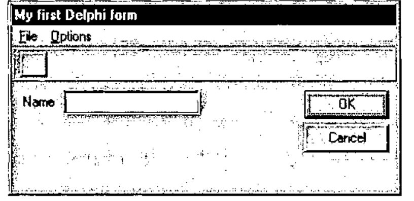
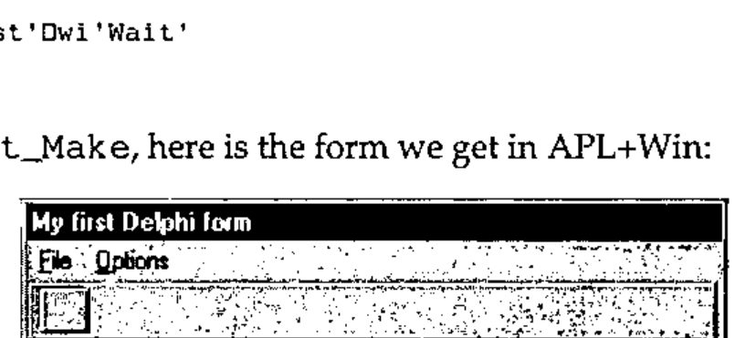
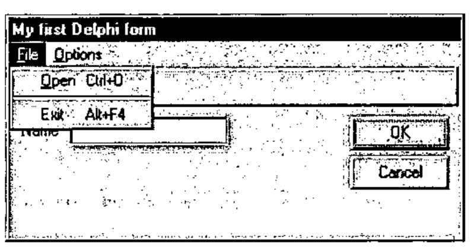
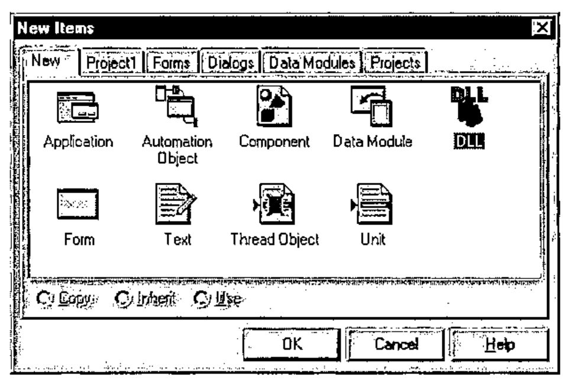
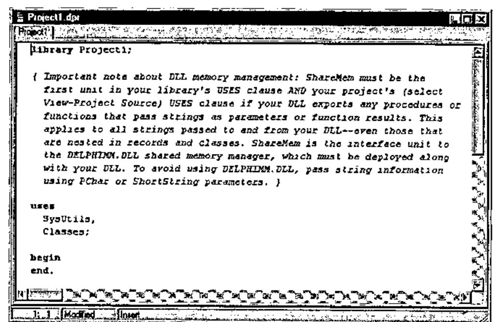
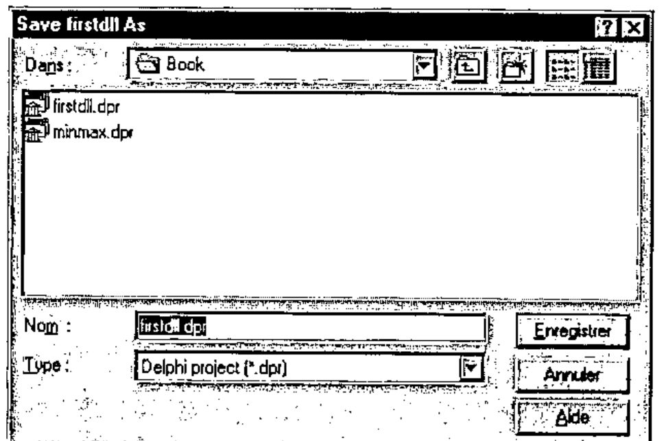
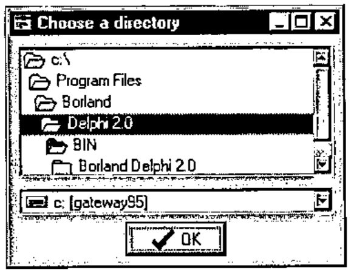

*by Eric Lescasse*
{ .byline }

## Introduction

Delphi is a Rapid (Windows) Application Development system developed by Borland. Its development environment is similar to Visual Basic. It lets you develop Windows applications with a minimum of code and headaches and produces fast compiled executables. Delphi exists in two flavours: Delphi 1, the 16-bit version of Delphi and Delphi 2, the 32-bit version of Delphi.

In this article we will use 32-bit products: Delphi 2, Dyalog APL/W 8 and APL+Win 1.8 running under Windows 95 (or NT). Everything which is presented in this article could be applied with little change to Delphi 1, Dyalog APL/W 7.2 and APL+Win running under Windows 3.1.

Delphi 2’s main characteristics are:

- a true fast optimising native code 32-bit compiler
- compiled applications up to 50 times faster than PCode applications
- extremely powerful visual development environment
- self-contained compiled applications in one .EXE file
- ability to easily develop true Windows 32-bit DLLs
- complete support for Windows 95 and NT
- very powerful and easy to use multimedia capabilities
- complete object-oriented system
- OCX and OLE2 support
- Delphi 1 included in the Delphi 2 package
- executables with no royalties

Delphi can be of great help to the APL developer and we will show a few examples in this article. Here are a few things you can do with Delphi:

- build forms with the powerful Delphi form editor and auto-generate APL programs which recreate a functional and identical form. To do so, you would have to write a "Delphi Forms Translator" APL program to convert your Delphi forms into APL functions, as I did.
- write non-GUI Delphi DLLs and call them directly from APL using `⎕NA`
- write GUI Delphi DLLs and call them directly from APL using `⎕NA`
- solve some problems more easily with Delphi than with APL
- easily write multimedia applications
- add Web-surfing capabilities to your applications
- easily write forms (with no code) to access almost any database
- write starter Delphi applications for APL applications
- call Delphi executables directly from APL

Perhaps the most interesting and useful characteristic of Delphi for an APL developer is its ability to write 32-bit DLLs so easily. This article will concentrate on how to develop such DLLs and how to use them from APL.

However, Delphi has many other usages to complement APL, as listed above, that should not be overlooked, most of which are described in detail in my book *"Advanced Windows Programming with APL and Delphi"*.

Finally, we will only study one side of the APL to Delphi interface, i.e. the one where you develop in APL and call Delphi. Another interesting topic would be to develop an application in Delphi and call APL when necessary (mostly in Delphi event handler functions), but we will not talk about that here.

To make this article more readable, we will be using the following standard Dyalog APL/W and APL+Win icons as paragraph titles when showing APL code and examples. Moreover, we will use a different APL font to display examples written in APL+Win and in Dyalog APL/W.

Examples:

**APL+Win**

```apl
    ∇ A←CreateDirectory A;CreateDirectory
[1]   'DLL UTILSDLL.CreateDirectory(*C1,*I4←)'⎕na'CreateDirectory'
[2]   A←CreateDirectory A 0
    ∇
```

**Dyalog APL/W**

```apl
    ∇ A←CreateDirectory A;CreateDirectory
[1]   ⎕NA'C:\BOOK\UTILSDLL.C32|CreateDirectory <0T =I1'
[2]   A←CreateDirectory A 0
    ∇
```

Delphi examples will be shown in a fixed Courier font. Example:

```text
type
  pInt=^Integer;

procedure IntegerArg(X:pInt);stdcall;
begin
  X^:=X^+100;
end;
```

This article assumes that you have a basic knowledge of the Delphi programming environment, some notions of Pascal and that you understand how to use `⎕NA` to call DLL functions from APL. If you don’t however, I guess you will still be able to follow me.

## Designing your forms in Delphi

Delphi contains a wonderful forms editor, with all the bells and whistles you need to develop perfect forms most quickly.

You can:

- select multiple controls and move them altogether with the mouse
- select multiple controls and move them pixel by pixel, with cursor keys, without risking a change to their vertical or horizontal positions
- use Delphi’s Alignment Palette to perfectly align controls, evenly space them on the form, centre them in the form, ...
- copy/paste controls retaining all of the properties of the copied controls

All these features are missing from Dyalog APL/W *WDESIGN* workspace and from the APL+Win *]WED* editor and they are very important to the form’s designer. Without them, you both lose a lot of time when designing forms and almost cannot do a perfect job as far as controls alignment, centering, etc. is concerned.

Therefore the idea quickly comes to write an APL program which takes a Delphi form and translates it into an APL form. Although not obvious, this is quite feasible. I have developed such a tool called *"Delphi Forms Translator"*. It would take too long to describe it here in detail, but a simple example will show the results.

Here is a form designed with Delphi:



Now run the Delphi Forms Translator (utility ParseDFM) in APL+Win, for example:

```apl
      ParseDFM'fmTest'
fmTest_Make
```

The `ParseDFM` utility generates an APL program called `fmTest_Make` which is reproduced below:

```apl
    ∇ fmTest_Make;⎕wself
[1]   ⍝∇fmTest_Make -- Created 6/01/96 at 10:57:36
[2]   'fmTest'⎕wi'Delete'
[3]
[4]   ⎕wself←'fmTest'⎕wi'New' 'Form' 'Close'
[5]   ⎕wi'scale' 5
[6]   ⎕wi'border' 3 16 32
[7]   ⎕wi'where' (PixelstoLC 108 200 174 351)
[8]   ⎕wi'caption' 'My first Delphi form'
[9]
[10]  ⎕wself←'fmTest.lLabel1'⎕wi'New' 'Label'
[11]  ⎕wi'where' 41 9 13 28
[12]  ⎕wi'caption' 'Name'
[13]
[14]  ⎕wself←'fmTest.bnButton1'⎕wi'New' 'Button'
[15]  ⎕wi'where' 38 261 25 75
[16]  ⎕wi'caption' 'OK'
[17]
[18]  ⎕wself←'fmTest.bnButton2'⎕wi'New' 'Button'
[19]  ⎕wi'where' 68 261 25 75
[20]  ⎕wi'caption' 'Cancel'
[21]
[22]  ⎕wself←'fmTest.edEdit1'⎕wi'New' 'Edit'
[23]  ⎕wi'where' 37 45 23 123
[24]
[25]  ⎕wself←'fmTest.tbPanel1'⎕wi'New' 'Frame'
[26]  ⎕wi'caption' ''
[27]  ⎕wi'scale' 5
[28]  ⎕wi'style' 3
[29]  ⎕wi'where' 0 0 30 343
[30]
[31]  ⎕wself←'fmTest.tbPanel1.bnButton3'⎕wi'New' 'Button'
[32]  ⎕wi'caption' ''
[33]  ⎕wi'where' 4 7 22 24
[34]
[35]  ⎕wself←'fmTest.mFile1'⎕wi'New' 'Menu'
[36]  ⎕wi'onClick' 'Test_mFile1_Click'
[37]  ⎕wi'caption' '&File'
[38]
[39]  ⎕wself←'fmTest.mFile1.mOpen1'⎕wi'New' 'Menu'
[40]  ⎕wi'onClick' 'Test_mFile1_mOpen1_Click'
[41]  ⎕wi'shortcut' 79 2
[42]  ⎕wi'caption' ('&Open',⎕tcht,'Ctrl+O')
[43]
[44]  ⎕wself←'fmTest.mFile1.mN1'⎕wi'New' 'Menu'
[45]  ⎕wi'separator' 1
[46]
[47]  ⎕wself←'fmTest.mFile1.mExit1'⎕wi'New' 'Menu'
[48]  ⎕wi'onClick' 'Test_mFile1_mExit1_Click'
[49]  ⎕wi'shortcut' 115 4
[50]  ⎕wi'caption' ('Exit',⎕tcht,'Alt+F4')
[51]
[52]  ⎕wself←'fmTest.mOptions1'⎕wi'New' 'Menu'
[53]  ⎕wi'onClick' 'Test_mOptions1_Click'
[54]  ⎕wi'caption' '&Options'
[55]
[56]  ⎕wself←'fmTest.mOptions1.msortbyDate1'⎕wi'New' 'Menu'
[57]  ⎕wi'onClick' 'Test_mOptions1_msortbyDate1_Click'
[58]  ⎕wi'caption' 'sort by &Date'
[59]
[60]  ⎕wself←'fmTest.mOptions1.msortbySize1'⎕wi'New' 'Menu'
[61]  ⎕wi'onClick' 'Test_mOptions1_msortbySize1_Click'
[62]  ⎕wi'enabled' 0
[63]  ⎕wi'caption' 'sort by &Size'
[64]
[65]  ⎕wself←'fmTest.mOptions1.msortbyExtension1'⎕wi'New' 'Menu'
[66]  ⎕wi'onClick' 'Test_mOptions1_msortbyExtension1_Click'
[67]  ⎕wi'value' 1
[68]  ⎕wi'caption' 'sort by &Extension'
[69]
[70]  0 0⍴'fmTest'⎕wi'Wait'
    ∇
```

If we run `fmTest_Make`, here is the form we get in APL+Win:



The *ParseDFM* utlity is also available for Dyalog APL/W 7.2 and 8 and would create an APL function that would build an identical form.

Using Delphi to design a form is a great time saver when you have a lot of controls in the form, or when the form has complex menus. The Delphi menu editor is exceptionally good and easy to use.

The Delphi Forms Translator has also converted the menus, accelerator keys, etc.:



## Writing 32-bit DLLs with Delphi 2

A Delphi DLL is just a Delphi program, except that it should start with the word **library** instead of the word **program**.

To create a DLL in Delphi 2, use the following simple steps:

1. select New... from the File menu — the following dialog box shows up:

   

2. select the **DLL** icon and click **OK** or Enter. The editor informs you that you must install **ShareMem** in the **Uses** clause of your DLL and must use **DELPHIMM.DLL** if you want to pass strings as parameters or function results. This is not necessary if your strings are declared as **Pchar** or **ShortString**. So we will use **PChar** arguments to pass character strings back and forth between APL and Delphi 2 and we can therefore forget about this comment.

   

3. save your DLL project by selecting **Save Project As...** from the Delphi File menu, and enter **firstdll.dpr** as the DLL project name.

   

Fine. You have saved your first DLL project. We now need to write the DLL.

## Developing the DLL and calling it from APL

We may install either Object Pascal **functions** or **procedures** in a DLL. To add a **function** or **procedure** to the DLL, simply add the function code below the uses clause and add a reference to this function in an **exports** clause at the end of the DLL as shown in the source code below.

It is advisable that you always use **procedures** rather than **functions** in your DLLs.

First, we will remove the warning comment displayed at the top of the DLL. Then we will add 3 procedures called **IntegerArg**, **DoubleArg** and **CharString** which will respectively accept a Delphi **Integer** and a Delphi **Double** (floating point) and a **PChar** (=pointer to a null terminated string) as arguments and return different values to APL.

```text
library firstdll;

uses
  SysUtils,
  Classes;

type
  pInt=^LongInt;
procedure IntegerArg(X:pInt); stdcall;
begin
  X^:=X^+100;
end;

type
  pDbl=^Double;
procedure DoubleArg(X:pDbl); stdcall;
begin
  X^:=X^+100.1;
end;

procedure CharString(X:PChar);stdcall;
begin
   X:=StrUpper(X);
end;

exports
  IntegerArg index 1,
  DoubleArg index 2,
  CharString index 3;

begin
end.
```

Note that we have declared 2 new types: **pInt** which is a pointer to a **LongInt** and **pDbl** which is a pointer to a **Double**. We need to do that because we want our procedures to modify their arguments and return a different value, through them, to APL. The `^` notation in Delphi is used to represent pointers. **PChar** are themselves pointers to null terminated strings, so we do not need to declare a new pointer type there.

Note also the **exports** clause at the end of the DLL: it is essential to make your routines visible from the outside world (namely APL here).

Now, choose Project/Compile or press **Ctrl+F9** to compile your DLL. If you have not mis-typed anything, it should compile OK.

Now that we have done the Delphi part, we need to perform the APL part of the work. If you have never seen or used `⎕NA` yet, please read the few documentation pages in your APL manuals that describe its syntax: `⎕NA` lets you call a DLL function from a 16-bit or 32-bit DLL, pass to it arguments from APL and receive results back in APL. One of the key points to understand is that you always need to use **pointers** when you want your DLL procedure to return a value to APL different from the one you passed from APL.

Once a function is successfully associated through `⎕NA`, it appears as a locked function in your workspace and can be used like any other APL function.

**Dyalog APL/W**

We need to issue the following `⎕NA` statement in order to associate our 3 procedures:

```apl
      ⎕NA'C:\BOOK\FIRSTDLL.DLL.C32 |IntegerArg =I4'
      ⎕NA'C:\BOOK\FIRSTDLL.DLL.C32 |DoubleArg =F8'
      ⎕NA'C:\BOOK\FIRSTDLL.DLL.C32 |CharString =0T'
```

A Delphi **procedure** does not return any direct result; in Dyalog APL/W, if you prefix a **procedure** argument with the `<`, `>` or `=` symbols, it means the following:

| Prefix | Meaning for the argument |
|---|---|
| `<` | **Input array or pointer to an input** — data is passed from APL to the DLL function/procedure as an array or pointer |
| `>` | **Output array or pointer to an output** — data is passed from the DLL function/procedure back to APL as an array or pointer |
| `=` | **Input/output array or pointer** — data is both passed from APL to the DLL function/procedure AND/OR returned from it as an array or pointer |

Here, for example, we have used an `=F8` parameter code to indicate that we pass an eight-byte floating point value to the Delphi procedure AND that it should also return to us an eight-byte floating point value though this F8 parameter.

For character strings, we must use the =0T code to denote a null-terminated string argument.

Let’s try our new associated functions:

```apl
      DoubleArg 3.14159
103.24159

      CharString ⊂'eric'
ERIC
```

**APL+Win**

We need to issue the following `⎕NA` statement in order to associate our 3 DLL procedures in APL+Win:

```apl
      'DLL FIRSTDLL.IntegerArg(*I4←)' ⎕na 'IntegerArg'

      'DLL FIRSTDLL.DoubleArg(*F8←)' ⎕na 'DoubleArg'

      'DLL ⊃FIRSTDLL.CharString(⊂*C1←)' ⎕na 'CharString'
```

In APL+Win, you need to prefix the parameter code with `*` to indicate you are using a pointer and suffix it with `←` to indicate that the DLL routine changes the parameter value and returns a different one to APL.

Therefore we use an `*F8←` parameter code to indicate that we pass an eight-byte floating point value to the Delphi procedure AND that it should also return to us an eight-byte floating point value. Let’s try our new associated function:

```apl
      DoubleArg 3.14159

103.24159
```

It works fine.

For character strings, we must use the **C1** code in APL+Win.

```apl
      'DLL ⊃FIRSTDLL.CharString(⊂*C1←)' ⎕na
'CharString'
```

You must call the associated APL function the following way:

```apl
      CharString 'eric'
ERIC
```

Note that we are using the `⊂` additional prefix for the DLL routine parameter to indicate that it must be enclosed, and the `⊃` result prefix indicating that the result must be disclosed. If we had not used `⊂` and `⊃` we would have had to make the following call from APL:

```apl
      ⊃ CharString ⊂'eric'
```

or:

```apl
      ↑ CharString ⊂'eric'
```

## First Example: Creating a Directory

Dyalog APL/W does not include any system function to create a new directory on your disk and if you need to do so in an application, you have a problem. Let’s write a very simple Delphi DLL to solve the problem.

Here is the source code of the Delphi DLL:

```text
library utilsdll;

uses
  SysUtils,
  Classes;

type
   pBool=^Boolean;
procedure CreateDirectory(dir:PChar;b:pBool);stdcall;
begin
   b^:=CreateDir(dir);
end;

exports
   CreateDirectory index 1;

begin
end.
```

This example is pretty simple: we are just using the Delphi **CreateDir** function which returns **True** (i.e. 1) if the directory was successfully created and False (i.e. 0) if the directory could not be created.

**Dyalog APL/W**

Here is a sample function we could use:

```apl
    ∇ A←CreateDirectory A;CreateDirectory
[1]   ⎕NA'C:\BOOK\UTILSDLL.C32 |CreateDirectory <0T =I1'
[2]   A←CreateDirectory A 0
    ∇
```

Note that the function returns a single boolean value (pointed by the **=I1** pointer); the first argument is only passed as an **input pointer** (using the &lt; notation).

**APL+Win**

```apl
    ∇ A←CreateDirectory A;CreateDirectory
[1]   'DLL UTILSDLL.CreateDirectory(*C1,*I4←)'⎕na'CreateDirectory'
[2]   A←CreateDirectory A 0
    ∇
```

Call this function the following way:

```apl
      CreateDirectory  'C:\TEST',⎕tcnul

1

      CreateDirectory  'C:\TEST',⎕tcnul

0
```

A return code of 1 indicates success: the CreateDirectory associated function fails the second time because the C:\TEST directory already exists.

Of course, in APL+Win you could have used the `⎕mkdir` system function to get the same result.

## Including a Delphi form in a DLL

It is almost as simple to include a Delphi form in a DLL.

We will simply take an example. Let’s assume that you need a form to select a directory from your hard disk. You do not want to use the standard Windows File Open box because you are not interested in selecting a file, but simply in selecting a directory.

To solve this problem you could select one of 3 techniques:

- try to create your own APL form, but that would be pretty hard since you would have to deal with such things as find existing drives, find directory hierarchy, use owner draw list boxes and combo boxes to display nice bitmaps to the left of drives and directories, ... a task clearly out of reach of most APL users.
- try to "customize" the standard Windows File Open box by using a hook function: this is not easy programming either and requires quite a number of low level calls plus the ability to receive low level callbacks from Windows which only APL+Win permits. APL2000 has solved this problem with APL+Win and, with their permission, I have included hereafter the code of the functions they wrote, because these functions are extremely interesting to study and teach a lot about Windows programming. You can also download these functions from the APL 2000 Web site.

  > http://members.aol.com/apl2000

  selecting **APL+World** on their page, then **Demonstration APL+Win workspaces**, then selecting **GETDIR.W3** to download.
- write a simple Delphi DLL with a simple Delphi form.

Let’s write a simple Delphi DLL to solve this problem.

1. select File/New... and double click the **DLL** icon
2. remove the long comment that shows up in the code
3. select File/New Form (this creates a new unit: **Unit1**)
4. click the **Save All** toolbar button and save your project as **SelDir_.pas** and **SelDir.dpr**
5. change the form’s **Caption** property to **Choose a directory**
6. click the **System** tab on the component palette
7. double click the **DriveComboBox** object to drop it on the form
8. double click the **DirectoryListBox** object to drop it on the form
9. click the **Standard** tab on the component palette
10. double click the **BitBtn** object to drop it on the form
11. change its **Kind** property to **bkOK**
12. click once on the **DriveComboBox1** object in your form to select it
13. change its **DirList** property to **DirectoryListBox1**

Your Delphi form should look like the following, in Delphi design mode:

![The form “Choose a directory” in design mode: a directory list from C:\ through Program Files, Borland and Delphi 2.0 to BIN, a drive combo box showing c: [gateway95], and an OK button](art10005010/choosedir.jpg)

Most of the code you need has been written for you by Delphi. In the source code reproduced below, I used a grey background to show lines which you have to write yourself.

Here is the source code of your DLL project:

```text
library seldir;

uses
  SysUtils,
  Classes,
  seldir_ in 'seldir_.pas' {Form1};

exports
  ChooseDir index 1;

begin
end.
```

and here is the code handling the form:

```text
unit seldir_;

interface

uses
  Windows, Messages, SysUtils, Classes, Graphics, Controls,
  Forms, Dialogs, StdCtrls, Buttons, FileCtrl;

type
  TForm1 = class(TForm)
    DriveComboBox1: TDriveComboBox;
    DirectoryListBox1: TDirectoryListBox;
    BitBtn1: TBitBtn;
  private
    { Private declarations }
  public
    { Public declarations }
  end;

var
  Form1: TForm1;

procedure ChooseDir(s:pChar);stdcall;export;

implementation

{$R *.DFM}

procedure ChooseDir(s:pChar);stdcall;export;
begin
  Form1:=TForm1.Create(Application);
  try
    Form1.ShowModal;
    StrPCopy(s,Form1.DirectoryListBox1.Directory);
  finally
    Form1.Free;
  end;
end

end.
```

Whenever you want to add a form to a Delphi DLL, you must write code similar to that reproduced below. Your code should include the following lines:

```text
  Form1:=TForm1.Create(Application);
  try
    Form1.ShowModal;
  finally
    Form1.Free;
  end;
```

where you first dynamically create an instance of your form (thus allocating memory for it), then use the Delphi error handling structure **try...finally...end** which ensures that in case of error in the **try** section, the **finally** section is always executed, thus being sure to release the dynamically allocated memory.

The form is displayed by invoking its **ShowModal** method (same as APL+Win Wait method or same as using `⎕DQ` in Dyalog APL/W).

When the user closes the form, the **Directory** property of the **DirectoryListBox1** object is read. We need to use Delphi **StrPCopy** function to copy the **Directory** property which is a **String** to variable s which is declared as a **PChar** (=null terminated string).

Now we need to call the **ChooseDir** function from APL.

**Dyalog APL/W**

Write a simple Dyalog APL/W function similar to the following one:

```apl
    ∇ A←ChooseDir;ChooseDir
[1]   ⎕NA'c:\temp\seldir.C32 |ChooseDir =0T'
[2]   A←ChooseDir ⊂256⍴' '
    ∇
```

**APL+Win**

```apl
      'c'⎕chdir'c:\temp'
C:\temp
```

We first set the current directory to the one containing our new compiled DLL, so that APL finds it. Then we write the following simple APL function:

```apl
    ∇ A←ChooseDir;ChooseDir
[1]   A←'DLL ⊃SELDIR.ChooseDir(⊂*C1←)'⎕na'ChooseDir'
[2]   A←ChooseDir 256⍴' '
    ∇
```

and finally we call it.

```apl
      ChooseDir
c:\Program Files\Borland\Delphi 2.0\BIN
```

The form which is displayed is the following.



As you have noticed, Delphi not only helped solve our problem but also allowed us to return directories with long file names and got a bitmap button as a little bonus!

## The APL 2000 GetDir solution to selecting a directory

I am reproducing below the 2 functions that you may find in the GetDir.W3 workspace downloadable from APL2000’s Web page.

The GetDir workspace demonstrates APL+Win capabilities to tap into Windows low level API calls and callbacks when necessary. They show exactly what a C programmer must do to perform the same action.

Basically the idea is to intercept and handle a message which occurs when the File Open common dialog is about to be displayed on the screen.

This message is called `WM_INITDIALOG` in Windows.

The structure of the `GetDir` function is basically the same as the `WGetOpenFileName` function distributed in the APL+Win `Windows.W3` workspace.

The only important differences are lines 24, 26, 41, 49 and 51.

On line 24 a new pattern is added to the APLW.INI file, using the `W_Ini` internal utility, in order to add a `WM_INITDIALOG_GetDir` message to the system. In fact, the `WM_INITDIALOG_GetDir` message is defined using the Windows constant `WM_INITDIALOG` as the message type, so that `WM_INITDIALOG_GetDir` be recognized as a kind of a `WM_INITDIALOG` message.

Then, on line 26, the function creates a filter for the `WM_INITDIALOG_GetDir` message, so that the APL instruction: `GetDir_Init ⎕warg` will be executed when `GetOpenFileName` is called, just prior to displaying the File Open common dialog. The value found in `⎕warg` will be the `WM_INITDIALOG_GetDir` message, i.e. the File Open common dialog handle (as a matter of fact, because of the ~ symbols in the message declaration, only the first message parameter, which is the dialog handle, is passed to APL in `⎕warg`).

In Windows terminology, the `GetDir_Init` function is called a **hook function**.

Line 41 includes the pointer to the hook function in the OPENFILENAME data structure which is then passed as an argument to `GetOpenFileName`.

Calling `GetOpenFileName` generates a `WM_INITDIALOG_GetDir` message which in turn fires the `GetDir_Init` APL hook function.

Now, this function does all the job of customizing the File Open dialog box just before it gets displayed (that hardly takes a few milliseconds, so all this process is absolutely transparent to the user).

The `GetDir_Init` function basically runs two loops. The first one is used to hide all of the File Open common dialog controls which are not useful to select a directory, i.e. all those which are on the left of the dialog box (the file name edit control, the file names list box, ...).

The second loop is used to move all the remaining controls by the same offset to the left of the dialog box, retaining their vertical positions.

Finally, the dialog box is resized to avoid displaying it with a large empty space on the right of the moved controls.

*[The two APL+Win functions `R←Title GetDir Dir` (51 lines) and `GetDir_Init hDlg` (40 lines), each marked “Copyright 1996 APL2000, Inc.”, are printed on pp.140–141 and are not transcribed here; see the page images. GetDir builds an OPENFILENAME structure, registers the `WM_INITDIALOG_GetDir` message and its hook filter (lines 24 and 26), passes the hook pointer (line 41), calls GetOpenFileName, and then destroys the filter and frees the memory (lines 49–51). GetDir_Init hides the controls of the dialog’s first column, moves those of the second and third columns left by the same offset, and resizes the dialog.]*
{ .note }

The technique shown here of using hook functions is the same you should use if you simply wanted to display a common Windows dialog box at a specific location on your screen, something otherwise impossible and which often bothers Windows programmers. I am sure that, from the examples given above, you can easily derive, as I could do now, the right hook function to do this if you need it.

## Conclusion

This article is just a very simple introduction to interfacing APL and Delphi.

It shows a couple of simple examples proving that Delphi can be quite useful to the APL developer, particularly when you write Delphi 32-bit DLLs and use them from APL.

However there are many other tasks that you could easily perform with Delphi and which would perfectly solve some otherwise difficult problems.

Here are a few:

- a starter application, displaying a nice logo form immediately while APL and your application are loading and leaving this logo form displayed until your application’s main form gets displayed
- create functional dialog boxes in Delphi and use them from APL
- write simple database forms or even more complex master/detail forms with lookup fields in order to browse/update traditional relational databases (believe it or not, you can do this with almost no code, in minutes, then install these forms in a DLL and use them from APL)
- call all common Windows dialog boxes easily
- create resources DLLs where you save most of your application resources (bitmaps, icons, cursors, strings, ...) thus reducing the amount of files delivered, speeding up application initialisation, ...
- extremely easily adding multimedia capabities to your APL applications (videos, sounds including .MID, ...)
- even, surfing the Web from your APL application

What is especially nice is that most of these things are easy to do with Delphi, but, in order to fully exploit using Delphi from APL you will need to learn how to pass all kinds of data back and forth between APL and Delphi and you need to learn a bit about Delphi and Object Pascal.

I have spent quite some time exploring all this and ended up writing a 200 pages book titled *"Advanced Windows Programming with APL and Delphi"* which describes all types of arguments/results passing between APL and Delphi, and shows most of the above listed Delphi techniques and how to directly use them from APL.

This article is adapted from this book which is available from Uniware. The book includes a disk with all of the book examples’ source code in Delphi 2, Dyalog APL/W 8 and APL+Win 1.8.

If you attend APL96 you may also want to attend my talk on the subject.
