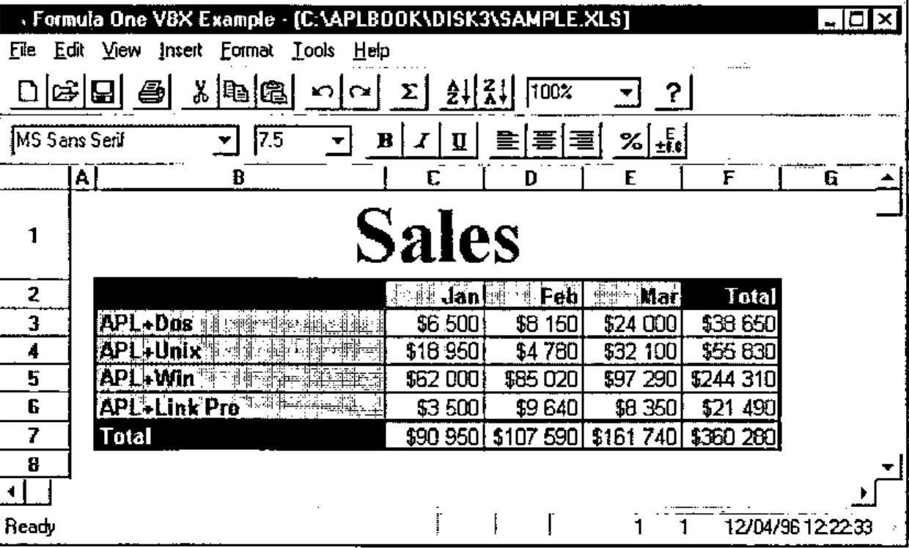
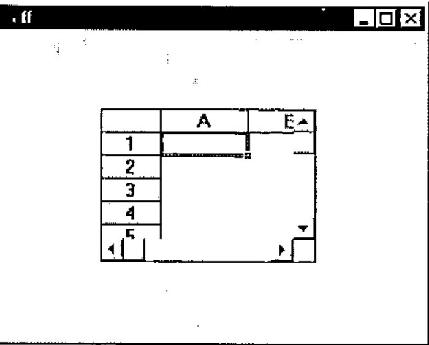
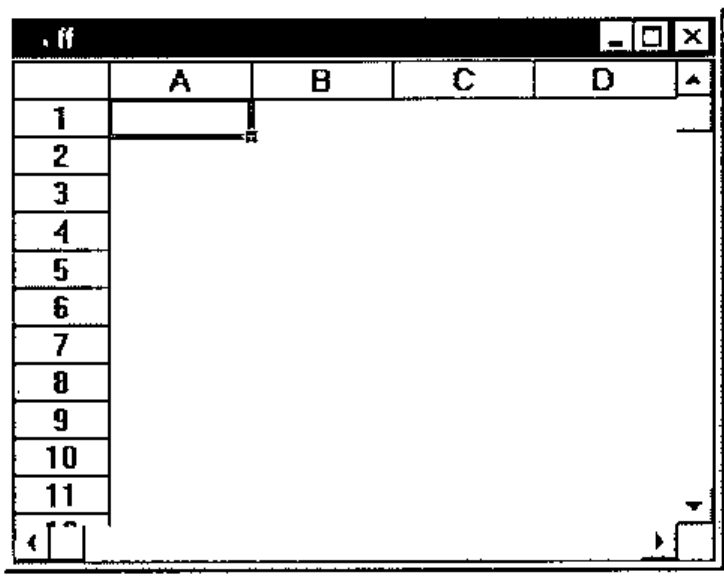
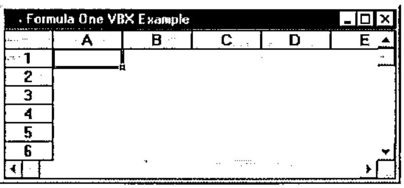
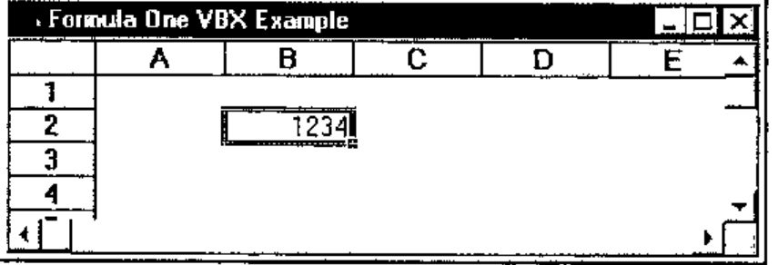
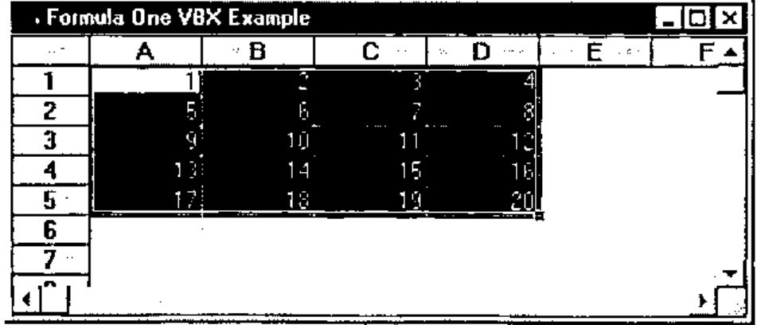
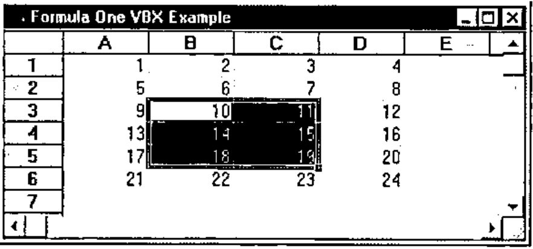
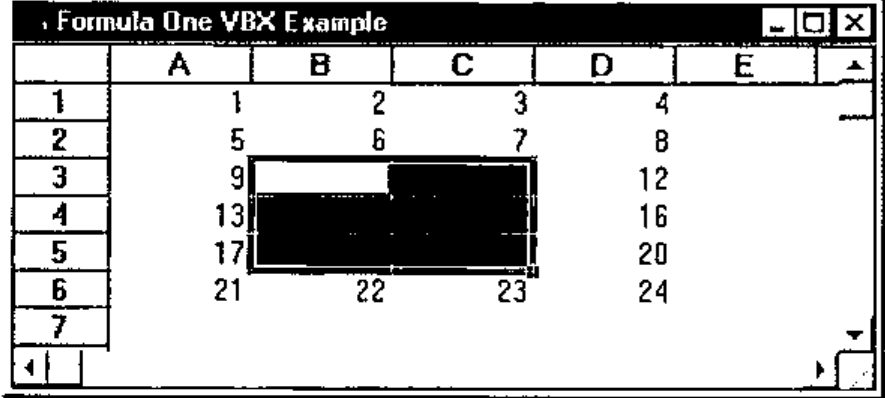
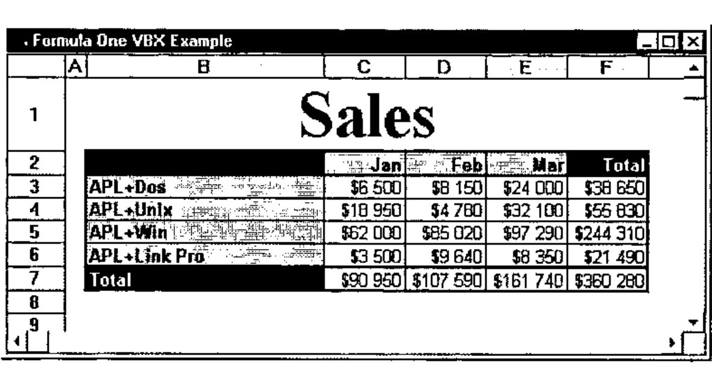
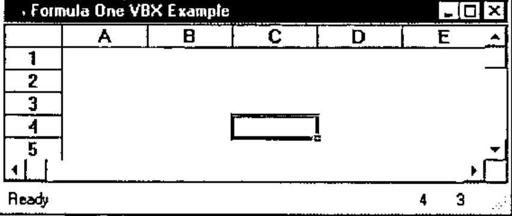

*by Eric Lescasse*
{ .byline }

## Introduction

If you are an APL\*PLUS user, especially an APL+Win user, or more generally if you are interested in APL and Windows programming, we have started a new on-line program called "**Monthly APL+Win Training Program**" which is available from our Web site. You may visit **http://www.uniware.fr/uk** to learn more about this program.

This program includes a monthly SETUPi.EXE file to download. The Windows SETUPi.EXE installation program installs a 50-page (or more) WinWord document on your computer as well as an APL+Win workspace, full of reusable APL+Win code, and additional utility files. The WinWord documents explain in detail one or more aspects of advanced Windows programming with APL+Win.

The goal of this program is to teach you how to exploit APL+Win fully to write complete and spectacular Windows applications, as well as providing users with a large library of re-usable and easily adaptable APL+Win code in order to save a lot of development time.

Today’s chapter is extracted from one of the monthly WinWord documents: it introduces you to the use of VBXs with APL+Win under Windows 95 by showing how to use the Formula One VBX Excel-compatible spreadsheet from APL+Win.

In this chapter we will learn:

- how to use DLLs from APL+Win
- how to use VBXs from APL+Win (under Windows 3.1 and 95)

Formula One is quite probably the best spreadsheet control available on the market: it is simple enough to use and extremely complete. It will help you solve the following problems with APL+Win:

- exchanging data between APL and Excel
- directly exploiting Excel sheets from APL
- printing sophisticated reports with Excel print quality from APL
- using a spreadsheet or grid object in your APL+Win applications

## Sample Formula One VBX Application

To give you an idea of the kind of GUI interface Formula One and APL+Win allow, here is a sample application using a Formula One object:

```apl
'c:\aplbook\disk3\sample.xls' FOneVBX ''
```



This looks a little like Excel, doesn’t it?

Believe it or not, it is an APL+Win application (written in one day) using a Formula One VBX object. We do not have room here to explain all of this application in detail, but you will get the basics.

Formula One VBX allows you to load any Excel 4 spreadsheet, retaining all its formatting and most of its formulas. Once you have loaded the Excel sheet into an APL+Win form containing a Formula One object, you can print this sheet getting Excel quality printout. It is also very easy to load an APL variable (generally a nested matrix) into a Formula One object and from there to save it as an Excel .XLS file, and as easy to retrieve an Excel .XLS file directly into an APL variable.

As you read these lines, APL+Win 2.0 should be shipping with OCX support. OCXs are the successors of VBXs: if you run Windows 95 or NT, you should use the Formula One OCX. It should be very easy to convert the programs and instructions shown in this article from Formula One VBX to Formula One OCX. We will publish an OCX version of this application in our Monthly APL+Win Training Program.

## Preparing to use the Formula One VBX with APL+Win

Starting with version 1.8.07, APL+Win supports VBXs under Windows 95. Of course VBX can also be used with APL+Win under Windows 3.1. In order to be able to use a Formula One VBX with APL+Win, using the new VBX interface, you need to change the Config section of your APLW.INI file (found in the Windows directory) so that it contains the 2 following lines:

```text
[Config]
...
APXList=AVB1032
VBXList=vtss
```

The first one (APXList=AVB1032) declares that you want to use the new APL+Win VBX interface. The second one declares that you want to use Formula One VBX, called **vtss.**

You also need to copy the following redistributable Formula One files into your C:\WINDOWS\SYSTEM directory:

```text
VTSS.VBX
VTSSDLL.DLL
```

You can get these 2 files by purchasing a copy of Formula One VBX, or by subscribing to our "Monthly APL+Win Training Program" (they are included within file SETUP3.EXE).

## Using the Formula One VBX from APL+Win

Once you have made the above changes in your APLW.INI file, you may load your version of APL+Win (it needs to be 1.8.07 or later) and look at the names of the available object classes:

```apl
      '#' ⎕wi 'classes'
Button Check Combo Edit Form Frame Imagelist Label List Listview
      MDIForm Menu Option Page Picture Printer Progress Scroll
      Selector Spinner Status Timer Toolbox Trackbar Tree VBSSEdit
      VBSSView
```

As you can see 2 new classes are showing up: `VBSSEdit` and `VBSSView`. These 2 classes are Formula One object classes.

The first one (`VBSSEdit`) is used to get an Edit bar above the grid and the second one (`VBSSView`) is the Formula One spreadsheet object class itself.

The nice thing about third party controls (VBXs and OCXs) is that once you have declared them properly, you can generally use them, just as if they were standard APL+Win controls, using the `⎕WI` system function. In the case of Formula One VBX though, we will also want to use many of the routines included in the VTSSDLL.DLL file. More on this later.

### Creating a form with a Formula One object

This is as simple as the following:

```apl
      'ff' ⎕wi 'New' 'Form' ('scale' 5)
ff
      'ff.ss' ⎕wi 'New' 'VBSSView'
ff.ss
```



It is advisable to use pixel coordinates (`'scale' 5`) for the APL+Win parent form, since VBXs only understand pixels.

### Resizing the Formula One object

One of the first things you will want to do is to resize the Formula One object so that it uses the entire client area of your APL+Win form. This is easily done by changing its `where` property, by:

```apl
      'ff.ss' ⎕wi 'where' 0 0,'ff'⎕wi'size'
```



However, if you now use your mouse to resize the parent form, the Formula One object does not get resized accordingly to match its new parent form client area. In order to do so, you need to handle the *onResize* event of the parent form.

We will start to write a program with our APL instructions to make things simpler. Here is the first version of our program:

```apl
    ∇ FOneEx A;⎕wself
[1]   ⍝∇ FOneEx A -- Formula One VBX Example
[2]   ⍝∇ A ←→ ''          ⍝ means: build the interface
[3]   ⍝∇   or 'message'   ⍝ means: handle a 'message'
[4]
[5]   :select A
[6]   :case ''
[7]       'ff'⎕wi'Delete'
[8]       ⎕wself←'ff' ⎕wi 'New' 'Form'('scale' 5)'Close'
[9]            ⎕wi'caption' 'Formula One VBX Example'
[10]           ⎕wi'onResize' 'FOneEx''Resize'''
[11]
[12]      ⎕wself←'ff.ss' ⎕wi 'New' 'VBSSView'
[13]
[14]      0 0⍴'ff'⎕wi'Wait'
[15]
[16]  :case 'Resize'
[17]      ⎕wi'.ss.where'0 0,2⍴⎕warg
[18]
[19]  :end
    ∇
```

This program should be quite easy to understand.

Its argument is either an empty character vector (`''`) in which case the interface (the form plus the Formula One object) is built; or it may be a character string message, in which case the program branches to the right `:case` instruction to handle the corresponding message.

This technique is called "**callback encapsulation**": it allows you to encapsulate ALL callbacks in the very same function which creates the interface. Using this technique, you can have a one-to-one relationship between APL+Win forms and APL+Win functions in your workspace: a form becomes a "unique function" which behaves like a self-contained utility. If you need to use the same form in another workspace, you just need to copy the function (here `FOneEx`) to another workspace and it will still fully run because it will carry with it all its event handling routines.

Coming back to our `FOneEx` function:

- on **line 8** we have added a call to the `'Close'` method: this is because we want to avoid seeing the form until the Formula One object has been added to it. By closing the form immediately, it does not show up until a `Wait` method is applied to it (on **line 14**)
- **line 9** sets a caption for the form title bar
- **line 10** declares that whenever the user resizes the form, APL+Win should automatically execute: `FOneEx 'Resize'`
- **line 14** invokes the `Wait` method: this is where the form gets displayed all at once with the Formula One object on the screen
- **line 17** is the instruction we want to be run by the APL+Win system every time the form is resized by the user: it just resizes the Formula One object so that it occupies the whole client area of the form

Let’s run this function:

```apl
      FOneEx ''
```



Try resizing the form to check our `Resize` callback. It works fine.

## Using Formula One Properties

Do not close the above form (or rerun `FOneEx` if you have closed it); press Alt+Tab to go to the APL session. Once an object is alive you can query its list of available properties.

```apl
      'ff.ss' ⎕wi 'properties'
border children class color data def deferexit edge enabled eve
     nts extent font help hwnd instance keys methods mode modif
     ied modifystop name opened order pointer prompt properties
      scale self size state suppress tabgroup tabparent tabstop
      tooltip translate vbAllowAppLaunch vbAllowArrows vbAllowD
     elete vbAllowEditHeaders vbAllowFillRange vbAllowFormulas
     vbAllowInCellEditing vbAllowMoveRange vbAllowObjSelections
     ...
```

I have not reproduced all of them here because the list is just too long! The properties which do not start with the `'vb'` prefix are standard APL+Win properties which still apply to the VBX object (like `color`, `edge`, `enabled`, …, `where`, …). All the properties starting with the `'vb'` prefix are Formula One specific properties.

Let’s try to install a numeric value in the B2 cell. First we need to select the B2 cell. This is done by setting the `vbSelection` Formula One property to `'B2'` as follows:

```apl
      'ff.ss' ⎕wi 'vbSelection' 'B2'
```

Press **Alt+Tab** to look at the Formula One object: cell **B2** is now selected. Then we need to clip the numeric value, say **1234**, into the selected cell: we can do this by setting the `vbNumber` property as follows:

```apl
      'ff.ss' ⎕wi 'vbNumber' 1234
```



Let’s change the number, then try to read this value from the Formula One object by now querying the `vbNumber` property:

```apl
      'ff.ss' ⎕wi 'vbNumber'
4567

      4567 ≡ 'ff.ss' ⎕wi 'vbNumber'
1
```

Two other properties can help set the active row and active column in the Formula One object: these are `vbRow` and `vbCol` which are demonstrated in the next example. So, if we want to fill a complete range with values, we could write a double `:for` loop, something like:

```apl
(L C)←⍳¨⍴M←5 4⍴⍳20
:for I :in L
    'ff.ss'⎕wi'vbRow' I
    :for J :in C
        'ff.ss'⎕wi'vbCol' J
        'ff.ss'⎕wi'vbNumber' (M[I;J])
    :end
:end
```

Similarly, if we wanted to read a whole range of values from the Formula One object into an APL variable, we could use:

```apl
(L C)←⍳¨⍴M←5 4⍴0
:for I :in L
    'ff.ss'⎕wi'vbRow' I
    :for J :in C
        'ff.ss'⎕wi'vbCol' J
        M[I;J]←'ff.ss'⎕wi'vbNumber'
    :end
:end
```

However, if we had a large matrix to install into the Formula One object, these techniques would be too slow since they would represent hundreds of lines of interpreted APL code.

Happily, Formula One has other useful properties for writing or reading data into the spreadsheet. The `vbClip` property lets you write a tab-delimited text into a range of cells, all at once. Use it in conjunction with the `DDEFmt` and `DDEUnfmt` utilities which are distributed with APL+Win in the `WINDOWS.W3` workspace. As an example the above loops could be replaced by:

```apl
      'ff.ss' ⎕wi 'vbClip' (DDEFmt 5 4⍴⍳20)
```



and

```apl
      ↑¨ ⎕fi ¨ DDEUnfmt 'ff.ss' ⎕wi 'vbClip'
 1  2  3  4
 5  6  7  8
 9 10 11 12
13 14 15 16
17 18 19 20
```

which are a little easier to program and really faster to run than the previous loops. Note that `DDEUnfmt` returns a nested matrix of character cells and that `⎕fi` is necessary to convert them to numeric.

Formula One has 102 specific properties and it would take much too long to explain all of them here, but once you know how to use one property, you know how to use them all: it’s really easy.

However a real spreadsheet object is a complex object which needs many more than 102 properties to be complete and completely customizable. Instead of creating several hundred properties for their spreadsheet Visual Components, the makers of Formula One have decided to write DLL functions. That’s why they have created the **VTSSDLL.DLL** file.

## Declaring Formula One DLL Functions

Using DLL functions from APL+Win is a little more difficult than using VBX properties, but once you understand how to do it, it is still pretty simple. The Formula One VTSSDLL.DLL file contains more than 300 DLL functions which you can all use from APL to completely customize the Formula One object.

Almost all of these DLL functions accept one or more arguments, and for almost all of them the first argument is the Formula One object handle.

### The Formula One object handle

At any time you may query which is the Formula One object handle by getting its vbSS property.

```apl
      'ff.ss' ⎕wi 'vbSS'
1339688375
```

This handle is a long integer which does not change until the Formula One object is closed, so you can read it into a global variable and go on using this variable until the Formula One object is closed.

Rather than using a global variable (which is rarely a good idea), you could write a simple utility called `Hss` which would always return the right Formula One object handle:

```apl
    ∇ R←Hss
[1]   R←'ff.ss' ⎕wi 'vbSS'
    ∇
```

We will use this function from here on in this article, as the first argument of all our DLL functions.

### The APL+Win ⎕na system function

Before you can use the Formula One DLL functions, you must understand the `⎕na` system function. The `⎕na` system function lets you call any DLL function from a DLL, pass arguments to it and retrieve results from this DLL function. I will only describe the subset of `⎕na` which is necessary to be able to use VTSSDLL.DLL. Its general syntax, for 16-bit DLLs (like VTSSDLL.DLL), is:

```apl
'DLL16 res←DLLNAME.fnname(arg1,arg2,...,argN)' ⎕na 'fnname'
```

where:

- `DLL16` is a fixed required term for a 16-bit DLL
- `res` is a the result type code
- `DLLNAME` is the DLL name which must be in a directory found in the DOS path
- `fnname` is the name of the DLL function you want to use
- `arg1, ... ,argN` are the type codes of the arguments

Note that the result of Formula One DLL functions is almost invariably a return code which you can convert to an explicit error message by using function `SSErrorNumberToText`.

Other rules for using `⎕na` are:

- when an argument is a character string, it must be described as \*C1
- other types of arguments are:
    - I2 &emsp; short integer (2 bytes, from -32768 to 32767)
    - I4 &emsp; long integer (4 bytes, from -2147483648 to 2147483647)
    - F8 &emsp; floating point (any non integral numeric value)
- when a function needs to retrieve and return some additional information, you need to prefix the argument type with a \* (meaning this argument is a pointer, not a value) and to suffix it with ← (meaning the argument will be modified and then returned in the result)
- you still need to include parentheses for functions having no arguments

### Associating Formula One DLL functions with ⎕na

The only difficulty is in finding the data type to use for each argument. The results, being short integer return codes, are almost always I2.

Concerning the arguments, apply the following simple rules:

- the spreadsheet handle is a long integer and must be I4
- character string is \*C1
- if the argument is a character string which must be returned the argument is `*C1←`
- if you are in any doubt and if you purchased Formula One VBX, you can have a look at the VTSS.TXT distributed file: it contains Visual Basic declarations for all the VTSSDLL.DLL functions. In Visual Basic declarations, the data types are denoted by a one character suffix to the arguments according to the following table:

| VB Suffix | Data Type | ⎕na datatype |
|---|---|---|
| % | Short Integer | I2 |
| & | Long Integer | I4 |
| # | Float | F8 |
| @ | Currency | F8 |
| $ | String | \*C1 |

The above information should be enough for you to be up and running.

Note that I have designed a product called **DLL Parser for APL+Win** which takes any Visual Basic declaration file like VTSS.TXT and automatically converts it to the exact right set of equivalent `⎕na` instructions. For more information on DLL Parser for APL+Win, visit our Web site at **http://www.uniware.fr/dllparse.html**

## Examples:

### Functions with no arguments:

```apl
S←'DLL16 I2←VTSSDLL.SSClearClipboard()' ⎕na 'SSClearClipboard'
S←'DLL16 I2←VTSSDLL.SSVersion()' ⎕na 'SSVersion'
```

### Functions with one argument (the spreadsheet handle):

```apl
S←'DLL16 I2←VTSSDLL.SSEditCut(I4)' ⎕na 'SSEditCut'
S←'DLL16 I2←VTSSDLL.SSFormatFixed(I4)' ⎕na 'SSFormatFixed'
```

### Functions with more arguments:

```apl
S←'DLL16 I2←VTSSDLL.SSFilePrint(I4,I2)' ⎕na 'SSFilePrint'
S←'DLL16 I2←VTSSDLL.SSInsertRange(I4,I2,I2,I2,I2,I2)' ⎕na 'SSInsertRange'
```

### Functions which modify arguments and return them in result:

```apl
S←'DLL16 I2←VTSSDLL.SSGetActiveCell(I4,*I2←,*I2←)' ⎕na 'SSGetActiveCell'
S←'DLL16 I2←VTSSDLL.SSGetFont(I4,*C1←,I2,*I2←,*I2←,*I2←,*I2←,*I2←,*I4←,*I2←,
*I2←)' ⎕na 'SSGetFont'
```

### Remarks:

In order to remember Formula One function names more easily you may notice:

- all Formula One functions start with the letters **SS**
- all Formula One functions that retrieve information start with **SSGet**
- all Formula One functions that set properties start with **SSSet**

## Using Formula One DLL functions

Now that we know how to declare Formula One DLL functions, we may start to use them. Run the following:

```apl
      FOneEx ''
      'ff.ss' ⎕wi 'vbClip' (DDEFmt 6 4⍴⍳24)
      'ff.ss' ⎕wi 'vbSelection' 'B3:C5'
```

Press **Alt+Tab**: you should see:



Now type the following:

```apl
'DLL16 I2←VTSSDLL.SSEditCut(I4)' ⎕na 'SSEditCut'
```

if this instruction returns 1, this means the `SSEditCut` Formula One DLL function has been associated in the workspace (and you should see it if you look at the functions in your workspace).

```apl
      SSEditCut Hss
0
```

The 0 return code indicates that the DLL function call has been successful.



Well, we have successfully used our first Formula One DLL function: with it we could erase a range of cells in the Formula One object, from APL.

Now let’s read a whole Excel 4 spreadsheet into our Formula One object. Type:

```apl
      S←'DLL16 I2←VTSSDLL.SSRead(I4,*C1,I2)' ⎕na 'SSRead'
      SSRead Hss 'c:\aplbook\disk3\sample.xls' 2
0
```



The Formula One help file will of course give you full explanations about function arguments. For your information, here is the documentation for SSRead copy pasted from their file.

> **SSRead Function Call**
>
> **Description**<br>
> Reads a worksheet from disk.
>
> **Syntax (C)**
>
> ```text
> SSERROR SSEXPORTAPI SSRead(
> HSS hSS,                // handle to a view
> LPCSTR pPathName,       // file path name
> int FAR *pFileType      // file type
> );
> ```
>
> **Parameters**<br>
> **hSS** is a handle to a view.<br>
> **pPathName** is a string containing the name of the file to read. The name can include drive, path, and file name.<br>
> **pFileType** returns the type of file that is read. The following table lists the values returned by this parameter.
>
> | Values | Constants | Description |
> |---|---|---|
> | 1 | kFileFormulaOne | Formula One format |
> | 2 | kFileExcel4 | Excel 4.0 format |
> | 3 | kFileTabbedText | Tab-delimited text file |
>
> The parameter is undefined if SSRead returns an error.
>
> **Remarks**<br>
> SSRead initializes a worksheet structure and reads a worksheet from the specified file. If there is not a worksheet attached to the view, a new worksheet is created.

Let’s assume we want to print this spreadsheet now. Type the following:

```apl
      S←'DLL16 I2←VTSSDLL.SSFilePrint(I4,I2)' ⎕na 'SSFilePrint'
      SSFilePrint Hss 0
```

and here we go with a printout of this Sales sheet with the same print quality you would obtain if you had printed this sheet from Excel.

## Reading the Excel spreadsheet into an APL nested array

What if we wanted to read this Excel spreadsheet into an APL nested array?

We could use what we learnt so far and a little APL:

```apl
      'ff.ss' ⎕wi 'vbSelection' 'B1:F7'
      A←DDEUnfmt Wtooem 'ff.ss' ⎕wi 'vbClip'

      A
Sales
              Jan      Feb      Mar      Total
APL+Dos       $6 500   $8 150   $24 000  $38 650
APL+Unix      $18 950  $4 780   $32 100  $55 830
APL+Win       $62 000  $85 020  $97 290  $244 310
APL+Link Pro  $3 500   $9 640   $8 350   $21 490
Total         $90 950  $107 590 $161 740 $360 280

      B←,'$'∊¨A                        ⍝ find numeric cells
      (B/,A)←⎕fi¨(B/,A)~¨⊂' $'         ⍝ remove $, blanks and convert to numeric

      A
Sales
                Jan    Feb    Mar  Total
APL+Dos        6500   8150  24000  38650
APL+Unix      18950   4780  32100  55830
APL+Win       62000  85020  97290 244310
APL+Link Pro   3500   9640   8350  21490
Total         90950 107590 161740 360280
```

And we get a nested APL matrix made of character and numeric cells! Note that the `Wtooem` function is necessary to convert strings back to APL correctly. You will find it in the distributed `WINDOWS.W3` workspace.

## Handling Formula One Events

You can look at the list of available Formula One events with:

```apl
      'ff.ss' ⎕wi 'events'
Close Destroy Exit ExitError Focus Hide KeyDown KeyPress KeyUp
     Modified MouseDown MouseDrag MouseMove MouseUp Move Open P
     aint Resize Send Show Unfocus VBCancelEdit VBClick VBDataN
     ewRow VBDataRowLoad VBDblClick VBDragDrop VBDragOver VBEnd
     Edit VBEndRecalc VBGotFocus VBKeyDown VBKeyPress VBKeyUp V
     BLostFocus VBObjClick VBObjDblClick VBRClick VBRDblClick V
     BSelChange VBStartEdit VBStartRecalc VBTopLeftChanged
```

Note that all specific Formula One events start with VB.

Let’s just handle one specific event: the `VBSelChange` event which occurs each time the current Formula One object selection changes and therefore each time you move to a new cell in the spreadsheet. We want to display the current cell coordinates in 2 status bar fields, as the user moves around the spreadsheet.

Let’s create a status bar (a new APL+Win object) in our form.

Change the `FOneEx` function so that it looks like the following:

```apl
    ∇ FOneEx A;B;⎕wself
[1]   ⍝∇ FOneEx A -- Formula One VBX Example
[2]   ⍝∇ A ←→ ''          ⍝ means: build the interface
[3]   ⍝∇   or 'message'   ⍝ means: handle a 'message'
[4]
[5]   :select A
[6]   :case ''
[7]       'ff'⎕wi'Delete'
[8]       ⎕wself←'ff' ⎕wi 'New' 'Form'('scale' 5)'Close'
[9]            ⎕wi'caption' 'Formula One VBX Example'
[10]           ⎕wi'onResize' 'FOneEx''Resize'''
[11]
[12]      ⎕wself←'ff.ss' ⎕wi 'New' 'VBSSView'
[13]           ⎕wi'onVBSelChange' 'FOneEx''ss.VBSelChange'''
[14]
[15]      ⎕wself←'ff.st' ⎕wi 'New' 'Status'('scale' 5)
[16]           B←1 4⍴1 'Ready'   0   8
[17]           B←B ⍪2 ' '       20   1
[18]           B←B ⍪3 ' '       20   1
[19]           B←B ⍪¯1 ''        0   8
[20]           ⎕wi'status' B
[21]
[22]      0 0⍴'ff'⎕wi'Wait'
[23]
[24]  :case 'Resize'
[25]      ⎕wi'.ss.where'0 0,2⍴⎕warg
[26]
[27]  :case 'ss.VBSelChange'
[28]      'ff.st'⎕wi'SetStatus' 2 (⍕⎕wi'vbRow')
[29]      'ff.st'⎕wi'SetStatus' 3 (⍕⎕wi'vbCol')
[30]  ⍝ Alternative using the SSGetActiveCell DLL function:
[31]  ⍝ S←'DLL16 I2←VTSSDLL.SSGetActiveCell(I4,*I2←,*I2←)' ...
[32]  ⍝ (B C)←⍕¨1↓SSGetActiveCell ('ff.ss'⎕wi'vbSS') 0 0
[33]  ⍝   'ff.st'⎕wi'SetStatus' 2 B
[34]  ⍝   'ff.st'⎕wi'SetStatus' 3 C
[35]
[36]  :end
    ∇
```

The `FOneEx` function is almost self explanatory.

We have added **line 13** to handle the `onVBSelChange` event.

Then we have created a new status object with 4 fields, fields 2 and 3 having 20 pixels width.

The new `VBSelChange` callback is using the Status object method `SetStatus` to fill fields 2 and 3 with the appropriate cell co-ordinates (row and column) as the user moves around in the spreadsheet.

Here is the result:



Unfortunately, I have to stop here: I must dramatically cut the *Monthly APL+Win Training Document* on APL+Win and VBXs, for the sake of available space in *Vector*, but I hope this article will still help many users to start using Formula One from APL+Win.

Just for your curiosity, here is the code of the main function which creates the first form I displayed in this article:

```apl
    ∇ R←A FOneVBX B;C;D;E;F;G;H;I;S;hss;⎕wself
[1]   ⍝∇ A FOneVBX B -- Uses Formula One VBX to access Excel 4 sheets
[2]   ⍝∇ A ←→ (optional) data to be loaded into spreadsheet
[3]   ⍝∇ Note: if A is used it must be a nested matrix, each cell
[4]   ⍝∇ being a character string or a numeric scalar.
[5]   ⍝∇ If A is a simple character vector it should represent an Excel 4
[6]   ⍝∇ .XLS file name to load into the spreadsheet.
[7]   ⍝∇ B ←→ ''            meaning: build the interface
[8]   ⍝∇   or 'message'     meaning: handle this message
[9]   ⍝∇ Note:  use FOneOCX from APL+Win 2.0 to access Excel 5 & 7 sheets
[10]  ⍝∇ Requires: (F) DDEFmt FormName INIFile InstallDir FileMenu_FOneVBX
[11]  ⍝∇                ... StatusBar_FOneVBX ToolBar_FOneVBX
[12]  ⍝∇                ssError ssGet
[13]  ⍝∇           (Files) BUTTONS.BMP VTSSDLL.DLL VTSS.VBX
[14]  ⍝∇ Copyright (c) 1996 Eric Lescasse [2dec96]
[15]
[16]  :select B
[17]  :case ''
[18]      :if 0=⎕nc'A' ⋄ A←0 0⍴' ' ⋄ :end
[19]      C←'fmFOne'
[20]      E←InstallDir
[21]      C ⎕wi'Delete'
[22]      ⎕wself←C ⎕wi'New' 'Form'('scale'5)('visible'3)'Close'
[23]          ⎕wi'caption' 'Formula One (VBX)'
[24]          ⎕wi'font' 'MS Sans Serif' 8
[25]          ⎕wi'onClose' 'FOneVBX''Close'''
[26]          ⎕wi'onFocus' 'FOneVBX''Focus'''
[27]          ⎕wi'onOpen' 'A FOneVBX''Open'''
[28]          ⎕wi'onResize' 'FOneVBX''Resize'''
[29]          ⎕wi'onWait' 'FOneVBX''Wait'''
[30]
[31]      C ToolBar_FOneVBX 1 2 18 0 4 0 5 6 7 0 11 12 0 40 0 36 37 0 1003 0 8
[32]      C ToolBar_FOneVBX 1001 0 1002 0 22 29 45 0 31 25 34 0 92 95
[33]      C FileMenu_FOneVBX ''
[34]      C EditMenu_FOneVBX ''
[35]      C ViewMenu_FOneVBX ''
[36]      C InsertMenu_FOneVBX ''
[37]      C FormatMenu_FOneVBX ''
[38]      C ToolsMenu_FOneVBX ''
[39]      C HelpMenu_FOneVBX ''
[40]      C StatusBar_FOneVBX ''
[41]
[42]      ⎕wself←(C,'.ss')⎕wi'New' 'VBSSView'
[43]          ⎕wi'vbBorderStyle' 0
[44]          ⎕wi'onVBEndEdit' 'FOneVBX''ss.VBEndEdit'''
[45]          ⎕wi'onVBSelChange' 'FOneVBX''ss.VBSelChange'''
[46]          ⎕wi'onVBStartEdit' 'FOneVBX''ss.VBStartEdit'''
[47]
[48]      R←C ⎕wi'Wait' A
[49]
[50]  :case 'Close'
[51]      C←⎕wself
[52]      ⎕wself←((¯1+C⍳'.')↑C),'.ss'
[53]      hss←⎕wi'vbSS'
[54]      D←¯1 ssGet''
[55]      C ⎕wi'value'D
[56]
[57]  :case 'Focus'
[58]      ⎕wi'.ss.Focus'
[59]
[60]  :case 'Open'
[61]      ⍝ Initialize VBX object
[62]      hss←⎕wi'.ss.vbSS'
[63]      S←SSSetHdrSelection hss 1 1 1
[64]      S←SSSetFont hss ('MS Sans Serif',⎕tcnul) 8 1 0 0 0 0 0
[65]      S←SSSetHdrSelection hss 0 0 0
[66]      S←SSSetSelection hss ¯1 ¯1 ¯1 ¯1
[67]      S←SSSetDefaultFont hss ('MS Sans Serif',⎕tcnul) 8
[68]      S←SSSetAlignment hss 1 0 2 0
[69]      S←SSSetSelection hss 1 1 1 1
[70]
[71]  :case 'Resize'
[72]      (C D)←2⍴⎕warg
[73]      :if 0≠⍴⎕wi'.fTb1.self'
[74]          ⎕wi'.fTb1.where' (E←0) ¯3 32 (D+4)
[75]          :if 0≠⍴⎕wi'.fTb2.self'
[76]                  ⎕wi'.fTb2.where' (E+30) ¯3 32 (D+4)
[77]                  :if 0≠⍴⎕wi'.fTb3.self'
[78]                      ⎕wi'.fTb3.where' (E+60) ¯3 32 (D+4)
[79]                      :if 0≠⍴⎕wi'.fTb4.self'
[80]                          ⎕wi'.fTb4.where' (E+90) ¯3 32 (D+4)
[81]                      :end
[82]                  :end
[83]          :end
[84]      :end
[85]      ⎕wi'.ss.where' (E+30) 0 (C-E+30) D
[86]
[87]  :case 'Wait'
[88]      ⍝ Install data passed as left argument
[89]      hss←⎕wi'.ss.vbSS'
[90]      :select ↑⍴⍴A←⎕warg
[91]      :case 1
[92]          :if 82=⎕dr A
[93]              S←SSRead hss (A,⎕tcnul) 2
[94]          :end
[95]      :case 2
[96]          (B C)←⍴A
[97]          S←SSSetRepaint hss 0
[98]          S←SSSetTabbedText hss 1 1 B C 1 ((DDEFmt A),2⍴⎕tcnul)
[99]          S←SSSetColWidthAuto hss 1 1 B C 1
[100]         S←SSSetRowHeightAuto hss 1 1 B C 1
[101]         S←SSSetRepaint hss 1
[102]     :end
[103]
[104] :case 'ss.VBEndEdit'
[105]     :if~(⎕wi'∆text')≡1⊃⎕warg
[106]         ⎕wi'modified'1
[107]     :end
[108]
[109] :case 'ss.VBSelChange'
[110]     hss←⎕wi'vbSS'
[111]     (B C)←⍕¨ssError SSGetActiveCell hss 0 0
[112]     D←FormName
[113]     (D,'.st1')⎕wi'SetStatus' 5 B
[114]     (D,'.st1')⎕wi'SetStatus' 6 C
[115]
[116] :case 'ss.VBStartEdit'
[117]     hss←⎕wi'vbSS'
[118]     S←2⊃SSGetText hss (256⍴⎕tcnul) 256
[119]     S←(¯1+S⍳⎕tcnul)↑S
[120]     ⎕wi'∆text'S
[121]
[122] :end
    ∇
```

`ToolBar_FOneVBX`, `StatusBar_FOneVBX` and the menu functions (`FileMenu_FOneVBX`, `EditMenu_FoneVBX`, …) have been created in minutes from re-usable template functions called `ToolBar`, `StatusBar`, `FileMenu`, `EditMenu`, … which are the kind of reusable APL code we are including in our on-line Monthly APL+Win Training Program.

## Conclusion

I would have liked to reproduce the complete article about APL+Win and VBXs in this issue of Vector, but I would need at least 50 pages and of course this was not possible. The complete article goes much into much greater depth concerning Formula One and APL.

We have just touched on the basics of using Formula One VBX with APL+Win here. However I feel you can guess, from these few pages, the tremendous power you can gain from using VBXs like Formula One (and now OCXs as you read these lines) with APL+Win.

With our "Monthly APL+Win Training Program" you will be able to download each month:

- a complete WinWord document (at least 50 pages) talking in depth about one aspect of APL+Win programming
- an APL+Win workspace and accompanying files, full of reusable APL code

If you want to subscribe to the "Monthly APL+Win Training Program", go online to:

**http://www.uniware.fr/uk/subsform.html**

You can download a free trial month from our Web site by entering:

**http://www.uniware.fr/aplbook/setup1.exe**

Uniware<br>
Web: http://www.uniware.fr/uk
