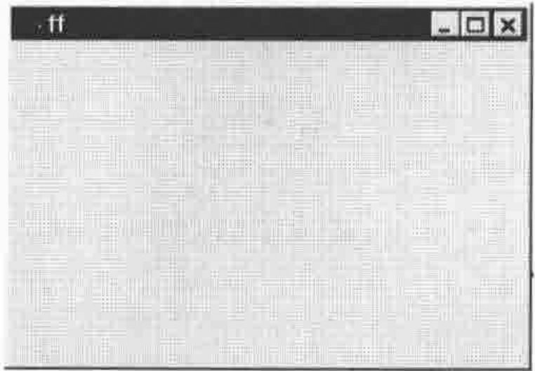
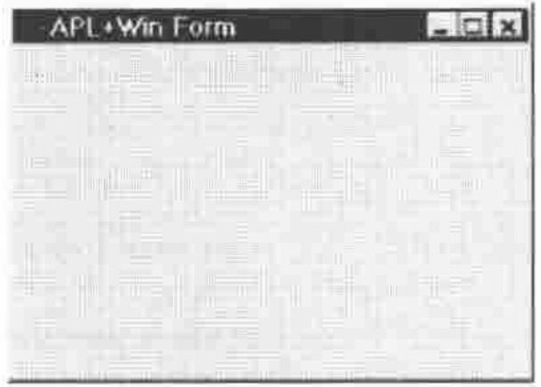
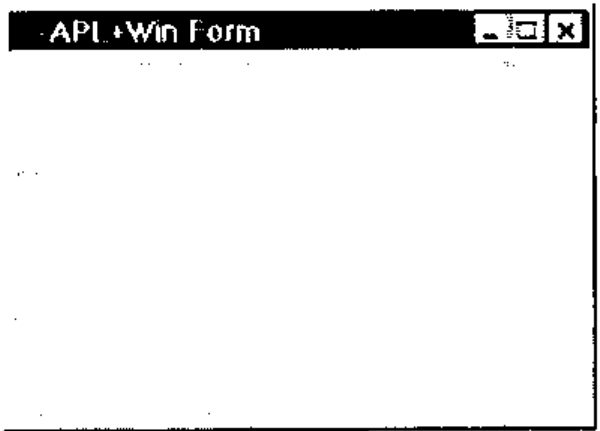
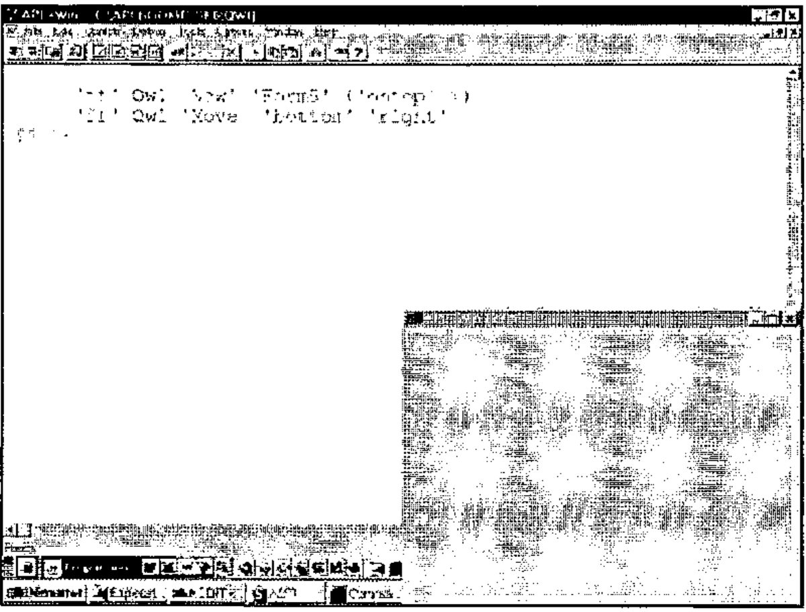

*by Eric Lescasse*
{ .byline }

*I want to thank Chris Lee from Softmed who inspired me with his UDC (User Defined Classes) concept.*

## Introduction

This long article, to be published in Vector in 2 parts, is extracted from the **Monthly APL+Win Training Program** available on the Internet from the **Lescasse Consulting** Web site at `www.lescasse.com`. It represents one of 3 chapters included in the APL+Win Training for May 97.

The article will show how a few simple APL utilities can be created to allow real Object Oriented Programming in APL+Win. It will both demonstrate how these utilities can be progressively built and introduce various Object Oriented concepts like *Encapsulation, Inheritance, Polymorphism, Methods Overloading,* etc. It will also show how you can create new classes of objects which inherit from the standard APL+Win Windows Interface objects or can inherit from each other, allowing you to build a complete hierarchy of new objects.

Object Oriented Programming with APL can be quite pure and much simpler than you may think. Read on.

## The Source Idea

The original idea is as follows: APL+Win offers us a limited set of built-in objects which we programmers can easily manipulate with one system function: `⎕WI`. With `⎕WI`, we can query or set object properties, event handlers and invoke object methods.

If we create our own new objects for use in APL+Win, we will not be able to use the `⎕WI` system function to manipulate them since they will not be known to the APL+Win system itself. However, we can create a utility which would behave exactly like `⎕WI` and would allow us to work with our own objects "as if" they were built into the APL+Win system. A good name for this utility would be *Qwi*.

This being so, using *Qwi* we can resolutely adopt a pure Object Oriented style of programming and benefit from encapsulation, inheritance, polymorphism and methods overloading!

But, first let’s think a little more about what exactly is an object.

## Objects

An object is something which exists and has a particular set of properties and behaviour. An APL+Win object is something which exists and has a particular set of properties and methods. A car for example is a real-life object: it has a colour, a weight, a size, a maximum speed and average mileage per gallon which all are **properties**. It also knows how to start its engine when you turn the ignition key.

An APL+Win button is an APL+Win object: it has a colour, a size, a caption which all are **properties**; it also knows how to hide itself when you invoke its **Hide** method. A car has a **Start** method: somebody has built some mechanism within the car so that it understands the Start method (=turning the ignition key on) and reacts to it by starting the engine.

The APL+Win button has a **Hide** method: somebody has built some computer code within the button so that it understands the **Hide** method and reacts to it by hiding itself. The important thing to understand is the following:

- as a car user, you are not concerned about how mechanics work inside the car to start the engine when you turn the ignition key on: all you need to know is that it works the way you expect and also that it always reacts in the exact same way in the future
- as an APL+Win application user, you are not concerned about the C code which hides the button when you invoke its **Hide** method: all you need to know is that it works the way you expect and that it will always do so.

In other words, objects are "black boxes" with a well defined consistent built-in behaviour. Once the object has been made and is tested, you will never need to look inside it again: it will always behave according to the laws built into it. From the outside, all you can do, at any time, is:

- change some of its properties (you can repaint the car another colour)
- invoke any of its methods (turn the ignition key for example)

The key point is that a well-defined and well-built object will faithfully serve us forever (or almost: as you know it’s not really the case as far as cars are concerned, unfortunately!).

On top of all this, we will programming in such a way that an APL+Win object will *really be an APL+Win function* (when you think about it, any software object always ultimately ends up being computer code anyway!). Functions are one of the easiest things to manipulate in APL and you may be surprised to see how easy it is to use Object Oriented Programming in APL+Win.

## The Rewards of Creating New APL+Win Objects

In this chapter we will be extending the power of APL+Win by creating several new APL+Win objects — and we will be able to use and reuse these objects forever! Through these few examples, you will quickly see how some very simple new objects can save us a lot of time and effort, as well as make our programs much more secure and our applications much more consistent.

The rewards can be tremendous! But of course we have to pay a price for it (nothing is ever free!). It will cost us quite a lot of thinking and design to build our objects, perfect as we want them. They have to be totally secure so we will need to test them thoroughly. It will also cost us a small performance degradation. This is because we will not be able to avoid adding an APL code layer above `⎕WI` in order to work with our own object properties and methods. But we will try to keep this code layer as minimal as possible.

## The First Building Block: the *Qwi* Function

The key to our new Object Oriented approach to APL+Win programming is the *Qwi* utility. We want it to accept any of the following possible syntax:

```apl
 ⎕wself←'object_name'  Qwi 'New' 'class_name'
 ⎕wself←'object_name'  Qwi 'New' 'class_name' ('prop1' value1) ... ('propN'
valueN)
 res← ['object_name'] Qwi 'prop'
      ['object_name'] Qwi 'prop' value
      ['object_name'] Qwi ('prop1' value1)...('propN' valueN)
 res← ['object_name'] Qwi 'Get_Method' [arguments]
      ['object_name'] Qwi 'Set_Method' [arguments]
```

where:

| | |
|---|---|
| `object_name` | is a user defined object name |
| `class_name` | is the new object class name |
| `prop, prop1, ... , propN` | are object property names |
| `value, value1, ... , valueN` | are property values (character or numeric) |
| `Get_Method` | is a method which returns some values |
| `Set_Method` | is a method which sets some values |
| `arguments` | is a single argument or a nested vector of arguments |
| `[ ]` | denote optional elements |

As you can see the *Qwi* syntax is very similar to the `⎕WI` syntax. You choose the class name of the new class you want to create: new class names can be identical to existing APL+Win built-in class names. *Qwi* will distinguish between the two:

```apl
      'ff' Qwi 'New' 'Form'
```

But, since this new *Form* class is yours, you can make it work as you want. Let’s take an example and we will explain the *Qwi* utility later in this chapter.

## The Second Building Block: the Class Function

What will our new class of objects be represented by? As already mentioned, it will indeed and not surprisingly be represented by an APL function. This APL function name will also be the class name of our new class of objects. That’s why I am calling it the **class function**.

Here is a very simple function which can serve as a model for building new objects for APL+Win. I have voluntarily simplified the first version to make things clearer. We will complement it later on.

```apl
    ∇ A QwiNewClass B;C;D;R;class;⎕io
[1]   ⍝∇ A QwiNewClass B -- Template class function
[2]   ⍝∇ A ↔ object name
[3]   ⍝∇ B ↔ ⊂'property'
[4]   ⍝∇   or 'property' value
[5]   ⍝∇   or ⊂'Method'
[6]   ⍝∇   or 'Method' argument1 ... argumentN
[7]   ⍝∇ Requires: (F) QwiRegister
[8]   ⍝∇ Copyright (c) 1997 Eric Lescasse [8mar97]
[9]
[10]   ⎕io←1                             ⍝ environment
[11]   C←↑B                              ⍝ property or method
[12]   D←1↓B                             ⍝ arguments or value
[13]
[14]   :select C
[15]
[16]   :case 'New'                       ⍝ constructor
[17]       ⍝ Add code here to create an instance of the class
[18]       ⍝ Example:
[19]       ⍝ R←A ⎕wi 'New' 'Form' 'Hide'  ⍝ create a Form object
[20]       '#'⎕wi'∆wres' R               ⍝ result returned in ∆wres property
[21]       QwiRegister A                 ⍝ register new class name
[22]
[23]   :case 'Close'                     ⍝ close object
[24]
[25]   :case 'Destroy'                   ⍝ destructor
[26]
[27]   :end
    ∇
```

The function comments describe the function arguments.

On **line 11** the property or method name is extracted from the right argument.

On **line 12** the property value or the method argument(s) if any, are retrieved from the right argument into *D*.

Then a simple `:select :case :case :end` control structure allows us to branch to various parts of the program depending on the property or method name used.

> Note that all new objects will have a *New* method which we call the **constructor** method and that they will often have a *Close* method and a *Destroy* method which we call the **destructor** method: that’s why we have already hard coded these special cases into our template new object function.

> Note also that you should never remove the *class* local variable from a **class function**, even if it is not used in the function code. This local variable will help the *QwiClasses* utility find all user defined objects in the workspace: we will see that later in this chapter.

Finally, there is one subroutine called on **line 21**: *QwiRegister*, whose role is to register the new class of objects. We will comment on it later, but let’s simply know for now that registering the new class consists of saving the object class name in the object `∆class` user-defined data property.

When defining a new object we will:

- edit the *QwiNewClass* function
- change its name to some meaningful object class name
- write custom code for the *New* and possibly for the *Close* and *Destroy* methods
- add other properties or methods

Now that you have been quickly introduced to the basic blocks, let’s take an example.

## A New Class of APL+Win Forms

When you make some trials in your APL session, building forms with `⎕WI`, you might be tired of having to first delete an existing form before you can recreate it.

Example (assuming you already have an *ff* form object):

```apl
      'ff' ⎕wi 'New' 'Form'
⎕WI OBJECT ERROR: Object already exists
      'ff' ⎕wi 'New' 'Form'
      ^

      'ff' ⎕wi 'Delete'
      'ff' ⎕wi 'New' 'Form'
ff
```

So, let’s create a new APL+Win Form object, which will know how to delete itself before it is recreated.

Here is a first attempt at this new *Form1* class:

```apl
    ∇ A Form1 B;C;R;class
[1]   ⍝∇ A Form1 B -- User Defined Form1 Class
[2]   ⍝∇ A ↔ object name
[3]   ⍝∇ B ↔ 'property'
[4]   ⍝∇   or 'property' value
[5]   ⍝∇   or 'Method'
[6]   ⍝∇   or 'Method' argument1 ... argumentN
[7]   ⍝∇ Requires: (F) QwiRegister
[8]   ⍝∇ Copyright (c) 1997 Eric Lescasse [8mar97]
[9]
[10]  C←↑B                               ⍝ property or method
[11]
[12]  :select C
[13]
[14]  :case 'New'                        ⍝ constructor
[15]      A ⎕wi'Delete'                  ⍝ delete existing form
[16]      R←A ⎕wi 'New' 'Form'           ⍝ create form
[17]         '#'⎕wi'∆wres' R             ⍝ result returned in ∆wres property
[18]          QwiRegister A              ⍝ register class name
[19]
[20]  :end
    ∇
```

The above *Form1* function represents our new *Form1* class of objects. These objects distinguish themselves from standard APL+Win forms by being able to first destroy themselves before being recreated. The *Form1* function is a modified copy of the *QwiNewClass* template function where we have removed all unnecessary code. Our first example, the *Form1* class is a very simple new class. But it can already save us a lot of keystrokes every day.

Let’s use this new class:

```apl
      'ff' Qwi 'New' 'Form1'
ff
```



Well! Let’s try to recreate the form:

```apl
      'ff' Qwi 'New' 'Form1'
ff
```


As you see this works well, without producing the traditional `⎕WI OBJECT ERROR: Object already exists` error message.

If you look at the *Form1* function you see that our new *Form1* class is the same as a standard APL+Win form class (`R←A ⎕wi'New' 'Form'` on **line 16**) except that its *New* method has been **overloaded** with an additional instruction (`A ⎕wi'Delete'` on **line 15**).

OK, I am sure you already have some ideas on how to improve our new user defined *Form1* class.

## Improving Our New *Form1* Class

My own preference with forms, is always to work with **pixel coordinates** (`'scale' 5`). So why not build that property in, by default. I would also like to have a nicer default caption, of **APL+Win form**. And be sure always to use the same default font of ‘MS Sans Serif’ in size .8. Let’s make these changes to our *Form1* class and rename it *Form2*. Here is what we get:

```apl
    ∇ A Form2 B;C;D;R;class;⎕io
[1]   ⍝∇ A Form2 B -- User Defined Form2 Class
[2]   ⍝∇ A ↔ object name
[3]   ⍝∇ B ↔ 'property'
[4]   ⍝∇   or 'property' value
[5]   ⍝∇   or 'Method'
[6]   ⍝∇   or 'Method' argument1 ... argumentN
[7]   ⍝∇ Requires: (F) QwiRegister
[8]   ⍝∇ Copyright (c) 1997 Eric Lescasse [8mar97]
[9]
[10]  ⎕io←1                              ⍝ environment
[11]  C←↑B                               ⍝ property name or method name
[12]  D←1↓B                              ⍝ property value or method arguments
[13]
[14]  :select C
[15]
[16]  :case 'New'                        ⍝ constructor
[17]      A ⎕wi'Delete'                  ⍝ delete existing form
[18]      R←A ⎕wi 'New' 'Form'           ⍝ create form
[19]       '#'⎕wi '∆wres' R              ⍝ result returned in ∆wres property
[20]        A ⎕wi 'caption' 'APL+Win Form'  ⍝ default caption
[21]        A ⎕wi 'font' 'MS Sans Serif' .8 ⍝ default font
[22]        A ⎕wi 'scale' 5              ⍝ pixel coordinates
[23]        QwiRegister A                ⍝ register class name
[24]
[25]  :end
    ∇
```

**Lines 10 and 12** are not necessary for now, but will be later in this paragraph.

Let’s try this new class:

```apl
      'ff' Qwi 'New' 'Form2'
ff
```



Of course, since our new form class is built over the standard APL+Win form class, we can use the standard `⎕WI` system function to query or set form properties afterwards:

```apl
      'ff' ⎕wi 'scale'
5 0 0 353 504

      'ff' ⎕wi 'font'
 MS Sans Serif 0.8 0 ansi
```

However, if we wanted to use our *Qwi* function to retrieve standard form properties, we can see that no values are returned:

```apl
      'ff' Qwi 'font'
```

or more exactly the *Qwi* function returns an empty matrix.

```apl
      ⍴'ff' Qwi 'font'
0 0
```

This is because our *Form2* class function does not attempt to process right arguments other than those starting `'New'`.

We can easily fix this problem by adding an `:else` clause to the `:select` control structure of our *Form2* function and renaming it *Form3*, as follows:

```apl
    ∇ A Form3 B;C;D;R;class;⎕io
[1]   ⍝∇ A Form3 B -- User Defined Form3 Class
[2]   ⍝∇ A ↔ object name
[3]   ⍝∇ B ↔ 'property'
[4]   ⍝∇   or 'property' value
[5]   ⍝∇   or 'Method'
[6]   ⍝∇   or 'Method' argument1 ... argumentN
[7]   ⍝∇ Requires: (F) QwiRegister
[8]   ⍝∇ Copyright (c) 1997 Eric Lescasse [8mar97]
[9]
[10]  ⎕io←1                              ⍝ environment
[11]  C←↑B                               ⍝ property name or method name
[12]  D←1↓B                              ⍝ property value or method arguments
[13]
[14]  :select C
[15]
[16]  :case 'New'                        ⍝ constructor
[17]      A ⎕wi'Delete'                  ⍝ delete existing form
[18]      R←A ⎕wi 'New' 'Form'           ⍝ create form
[19]       '#'⎕wi '∆wres' R              ⍝ result returned in ∆wres property
[20]        A ⎕wi 'caption' 'APL+Win Form'  ⍝ default caption
[21]        A ⎕wi 'font' 'MS Sans Serif' .8 ⍝ default font
[22]        A ⎕wi 'scale' 5              ⍝ pixel coordinates
[23]        QwiRegister A                ⍝ register class name
[24]
[25]  :else                              ⍝ process all other props/methods
[26]      :if (⊂C)∊A ⎕wi'properties'     ⍝ if a standard property ...
[27]      :orif (⊂C)∊A ⎕wi'methods'      ⍝ or a standard method
[28]          :if 0∊⍴D                   ⍝ when no value or arguments passed
[29]              '#'⎕wi'∆wres'(A ⎕wi C) ⍝ return current value
[30]          :else                      ⍝ else...
[31]              A ⎕wi (⊂C),D           ⍝ apply value or arguments
[32]          :end
[33]      :end
[34]
[35]  :end
    ∇
```

Now, we can also use *Qwi* to get or set standard APL+Win form properties as well as invoke standard APL+Win form methods:

```apl
      'ff' Qwi 'New' 'Form3'
ff

      'ff' Qwi 'font'
 MS Sans Serif 0.8 0 ansi

      'ff' Qwi 'font' 'Arial' 1

      'ff' ⎕wi 'font'
 Arial 1 0 ansi

      'ff' Qwi 'font'
 Arial 1 0 ansi

      ('ff' ⎕wi 'font')≡'ff' Qwi 'font'
1
```

Therefore, please add the same `:else` clause to our *QwiNewClass* template function so that it now reads as follows:

```apl
    ∇ A QwiNewClass B;C;D;R;class;⎕io
[1]   ⍝∇ A QwiNewClass B -- Template class function
[2]   ⍝∇ A ↔ object name
[3]   ⍝∇ B ↔ ⊂'property'
[4]   ⍝∇   or 'property' value
[5]   ⍝∇   or ⊂'Method'
[6]   ⍝∇   or 'Method' argument1 ... argumentN
[7]   ⍝∇ Requires: (F) QwiRegister
[8]   ⍝∇ Copyright (c) 1997 Eric Lescasse [8mar97]
[9]
[10]  ⎕io←1                              ⍝ environment
[11]  C←↑B                               ⍝ property name or method name
[12]  D←1↓B                              ⍝ property value or method arguments
[13]
[14]  :select C
[15]
[16]  :case 'New'                        ⍝ constructor
[17]      ⍝ Add code here to create an instance of the class
[18]      ⍝ Example:
[19]      ⍝ R←A ⎕wi 'New' 'Form' 'Hide'  ⍝ create a Form object
[20]      '#'⎕wi'∆wres' R                ⍝ result returned in ∆wres property
[21]      QwiRegister A                  ⍝ register new class name
[22]
[23]  :case 'Close'                      ⍝ close object
[24]
[25]  :case 'Destroy'                    ⍝ destructor
[26]
[27]  :else                              ⍝ process all other properties/methods
[28]      :if (⊂C)∊A ⎕wi'properties'     ⍝ if a standard property ...
[29]      :orif (⊂C)∊A ⎕wi'methods'      ⍝ or a standard method
[30]          :if 0∊⍴D                   ⍝ when no value or arguments passed
[31]              '#'⎕wi'∆wres'(A ⎕wi C) ⍝ return current value
[32]          :else                      ⍝ else
[33]              A ⎕wi (⊂C),D           ⍝ apply value or arguments
[34]          :end
[35]      :end
[36]
[37]  :end
    ∇
```

## Adding a Property to a User Defined Class

Let’s add a new property to our *Form3* class and make it the *Form4* class. The new property will be called **ontop**. Just as for any standard APL+Win object property, you must use only lower case characters for property names.

The **ontop** property will be either **0** or **1**. If it is set to **1**, then the created instance of the *Form4* class will stay on top of all other forms.

We have already seen how to make a form "on top" of all other forms (see code starting at **line 63** in the *SystemMenu* function described in **Chapter 8 pp. 65-66**).

Here is how we can implement the **ontop** property:

```apl
[25]  :case 'ontop'                                   ⍝ ontop property
[26]      :if 0∊⍴D                                    ⍝ if not property value
[27]          '#' ⎕wi '∆wres' (A ⎕wi '∆ontop')        ⍝ query property
[28]      :else                                       ⍝ else
[29]          S←(1+1≡↑D)⊃'hwnd_notopmost' 'hwnd_topmost' ⍝ windows constant to use
[30]          S←S 0 0 0 0 'swp_nomove swp_nosize'     ⍝ other arguments
[31]          S←⎕wcall'SetWindowPos' (A ⎕wi'hwnd'),S  ⍝ call SetWindowPos
[32]          A ⎕wi '∆ontop' (1≡↑D)                   ⍝ register property value
[33]      :end
```

Let’s comment the above lines of code. First, whenever you implement a property, you need to process 2 kinds of cases:

- the property is queried
- the property is set

That’s why we have an `:if ... :else ... :end` clause above.

> The key point to understand and the cleverness here is to use user-defined data properties to save our property values into the object itself. So we are using a `∆ontop` user defined data property to store our boolean **ontop** property value.

When we query the **ontop** property, the code is as simple as retrieving the current value of the `∆ontop` user-defined data property (**line 27**) and to return it as a result.

When we set the **ontop** property (**lines 29 to 32**), we need to perform 2 different actions:

- do the required job (**lines 29 to 31**)
- save the new value of the **ontop** property in the `∆ontop` user-defined data property (**line 32**)

As you see it is pretty simple to implement a new property in a user-defined object. You just have to add a `:case 'property'` clause to your class function with the right code to query and set the property.

Let’s test our new class:

```apl
      'ff' Qwi 'New' 'Form4' ('ontop' 1)
ff
```



Now click into the APL session, outside the APL+Win form: as you see the APL+Win Form stays on top!

We can query the **ontop** property of the form:

```apl
      'ff' Qwi 'ontop'
1
```

Of course, if we tried to do it using `⎕WI` we would get an error since the APL+Win system does not know about the **ontop** property for an APL+Win Form object:

```apl
      'ff' ⎕wi 'ontop'
⎕WI ACTION ERROR: Action "ontop" not found
      'ff' ⎕wi 'ontop'
      ^
```

Change the APL+Win form **ontop** property to **0**:

```apl
      'ff' Qwi 'ontop' 0
```

Now click into the APL session outside the APL+Win Form: this time the APL+Win form is sent to the back.

Let’s now see how we can implement a new method for our form.

## Adding a Method to a User Defined Class

Let’s create a new *Form5* class starting with the *Form4* class, by adding a new method to the class. We would like to be able to easily move our form out of our way so that it is moved to the top right of the screen (or to the bottom right or bottom left or top left of the screen). Likewise it would be good if this new method knew how to centre the form on the screen.

Whenever you add a new property or method to an object, you have to think carefully about the design so that the method will be simple for the developer to use. All methods should start with an uppercase letter, as do all standard APL+Win methods. Let’s call our new method **Move**. This method will accept 2 arguments. Each of them can be a character vector or an integer.

The 1st argument describes the vertical position of the form : it can be ‘top’ ‘bottom’ or ‘center’ or an integer denoting the **percent of the vertical size of the screen where the form will be located**

The 2nd argument describes the horizontal position of the form : it can be ‘left’ ‘right’ or ‘center’ or an integer denoting the **percent of the horizontal size of the screen where the form will be located**

So we would like to use such expressions as:

```apl
      'ff' Qwi 'Move' 'top' 'right'
      'ff' Qwi 'Move' 'bottom' 'left'
      'ff' Qwi 'Move' 0 0
      'ff' Qwi 'Move' 'center' 10
      'ff' Qwi 'Move' 50 50
```

We will also design the **Move** method so that it returns the old form position in pixels. Here are the lines of code you should add to function *Form4* (which we rename at the same time as *Form5*) in order to implement the **Move** method:

```apl
[25]  :case 'Move'
[26]      :if 2≠⍴D ⋄ :return ⋄ :end                      ⍝ exit if not 2 arguments
[27]      (E F)←D                                        ⍝ get method arguments
[28]      G←(1+82=⎕dr E)⊃E 0                             ⍝ G is 0 if 1st arg char
[29]      H←(1+82=⎕dr F)⊃F 0                             ⍝ H is 0 if 2nd arg char
[30]      (I J)←'#'⎕wi'size'                             ⍝ get screen dimensions
[31]      (K L M N)←A ⎕wi'where'                         ⍝ get form position & size
[32]      '#'⎕wi'∆wres'(K L×2⍴'#'⎕wi'units')             ⍝ return old form position
[33]      K←(.01×0 50 100 G×I-M)['top' 'center' 'bottom'⍳⊂E]  ⍝ new vert form pos
[34]      L←(.01×0 50 100 H×J-N)['left' 'center' 'right'⍳⊂F]  ⍝ new horz form pos
[35]      A ⎕wi'where' K L M N                           ⍝ move form
```

This method is pretty simple to understand.

First, if the **Move** method did not receive exactly 2 arguments, we do nothing and exit (**line 26**).

If 2 arguments were passed to **Move**, as expected, we retrieve them in variables *E* and *F* (**line 27**).

On **lines 28 and 29**, we transform *E* and *F* to **0**, only if they are character vectors: if *E* and/or *F* were numeric, we do not change their values. We store the new values in variables *G* and *H*.

Then we need to retrieve the screen dimension in row/col coordinates (**line 30**).

Then we retrieve the current form position in variables *K* and *L* and the current form size in variables *M* and *N* on **line 31**.

On **line 32** we save the current form position in the `∆wres` property (the result of our **Move** method).

The new form vertical position is easily calculated on **line 33** and the new horizontal form position is easily calculated on **line 34**, which each handle all cases of arguments in just one simple instruction. A much longer alternative way of writing **line 33** would for example be:

```apl
:select E
:case 'top'
    K←0
:case 'center'
    K←.5×I-M
:case 'bottom'
    K←I-M
:else
    K←.01×E
:end
```

Finally the form is moved by changing its *where* property with the `⎕WI` system function, on **line 35**.

Let’s try our new class:

```apl
      'ff' Qwi 'New' 'Form5' ('ontop' 1)
ff

      'ff' Qwi 'Move' 'bottom' 'right'
12 32
```

resulting in the following screen where I have increased the APL font size so that you can read it better .



Note that we could have specified everything in just one expression:

```apl
      'ff' Qwi 'New' 'Form5' ('ontop' 1) ('Move' 'bottom' 'right')
192 256
```

but please note that in such a case, *Qwi* always returns the result of the rightmost method in the phrase.

So, after addition of the Move method, the *Form5* class function is as follows:

```apl
    ∇ A Form5 B;C;D;E;F;G;H;I;J;K;L;M;N;R;S;class;⎕io
[1]   ⍝∇ A Form5 B -- User Defined Form5 Class
[2]   ⍝∇ A ↔ object name
[3]   ⍝∇ B ↔ 'property'
[4]   ⍝∇   or 'property' value
[5]   ⍝∇   or 'Method'
[6]   ⍝∇   or 'Method' argument1 ... argumentN
[7]   ⍝∇ Requires: (F) QwiRegister
[8]   ⍝∇ Copyright (c) 1997 Eric Lescasse [8mar97]
[9]
[10]  ⎕io←1                              ⍝ environment
[11]  C←↑B                               ⍝ property name or method name
[12]  D←1↓B                              ⍝ property value or method arguments
[13]
[14]  :select C
[15]
[16]  :case 'New'                        ⍝ constructor
[17]      A ⎕wi'Delete'                  ⍝ delete existing form
[18]      R←A ⎕wi 'New' 'Form'           ⍝ create form
[19]       '#'⎕wi '∆wres' R              ⍝ result returned in ∆wres property
[20]        A ⎕wi 'caption' 'APL+Win Form'  ⍝ default caption
[21]        A ⎕wi 'font' 'MS Sans Serif' .8 ⍝ default font
[22]        A ⎕wi 'scale' 5              ⍝ pixel coordinates
[23]        QwiRegister A                ⍝ register class name
[24]
[25]  :case 'Move'
[26]      :if 2≠⍴D ⋄ :return ⋄ :end                      ⍝ exit if not 2 arguments
[27]      (E F)←D                                        ⍝ get method arguments
[28]      G←(1+82=⎕dr E)⊃E 0                             ⍝ G is 0 if 1st arg char
[29]      H←(1+82=⎕dr F)⊃F 0                             ⍝ H is 0 if 2nd arg char
[30]      (I J)←'#'⎕wi'size'                             ⍝ get screen dimensions
[31]      (K L M N)←A ⎕wi'where'                         ⍝ get form position & size
[32]      '#'⎕wi'∆wres'(K L×2⍴'#'⎕wi'units')             ⍝ return old form position
[33]      K←(.01×0 50 100 G×I-M)['top' 'center' 'bottom'⍳⊂E]  ⍝ new vert form pos
[34]      L←(.01×0 50 100 H×J-N)['left' 'center' 'right'⍳⊂F]  ⍝ new horz form pos
[35]      A ⎕wi'where' K L M N                           ⍝ move form
[36]
[37]  :case 'ontop'                                      ⍝ ontop property
[38]      :if 0∊⍴D                                       ⍝ if not property value
[39]          '#' ⎕wi '∆wres' (A ⎕wi '∆ontop')           ⍝ query property
[40]      :else                                          ⍝ else
[41]          S←(1+1≡↑D)⊃'hwnd_notopmost' 'hwnd_topmost' ⍝ windows constant to use
[42]          S←S 0 0 0 0 'swp_nomove swp_nosize'        ⍝ other arguments
[43]          S←⎕wcall'SetWindowPos' (A ⎕wi'hwnd'),S     ⍝ call SetWindowPos
[44]          A ⎕wi '∆ontop' (1≡↑D)                      ⍝ register property value
[45]      :end
[46]
[47]  :else                              ⍝ process all other properties/methods
[48]      :if (⊂C)∊A ⎕wi'properties'     ⍝ if a standard property ...
[49]      :orif (⊂C)∊A ⎕wi'methods'      ⍝ or a standard method
[50]          :if 0∊⍴D                   ⍝ when no value or arguments passed
[51]              '#'⎕wi'∆wres'(A ⎕wi C) ⍝ return current value
[52]          :else                      ⍝ else...
[53]              A ⎕wi (⊂C),D           ⍝ apply value or arguments
[54]          :end
[55]      :end
[56]
[57]  :end
    ∇
```

## Simplest Form of the *Qwi* Function

*Qwi* is the very chore of our Object Oriented approach to APL+Win development. Here is a simple first version of *Qwi* which is sufficient to run the examples we have shown before:

```apl
    ∇ R←A Qwi1 B;C;E;I
[1]   ⍝∇ R←A Qwi1 B -- ⎕WI emulator
[2]   ⍝∇ ⎕wself←'object_name'  Qwi1 'New' 'class_name'
[3]   ⍝∇ ⎕wself←'object_name'  Qwi1 'New' 'class_name'('prop1' value1)...
[4]   ⍝∇ res←  ['object_name'] Qwi1 'prop'
[5]   ⍝∇       ['object_name'] Qwi1 'prop' value
[6]   ⍝∇       ['object_name'] Qwi1 ('prop1' value1)...('propN' valueN)
[7]   ⍝∇ res←  ['object_name'] Qwi1 'Get_Method' [arguments]
[8]   ⍝∇       ['object_name'] Qwi1 'Set_Method' [arguments]
[9]   ⍝∇ Copyright (c) 1997 Eric Lescasse [8mar97]
[10]
[11]  :if 2≠⎕nc'A' ⋄ A←⎕wself ⋄ :end    ⍝ ⎕WSELF if no left arg
[12]  :if 1=≡B ⋄ B←,⊂B ⋄ :end           ⍝ be sure B is nested
[13]  :if 'New'≡↑B                      ⍝ if method is 'New'
[14]      C←2⊃B                         ⍝ get specified class name
[15]      B←(⊂'New' C),2↓B              ⍝ rebuild argument
[16]  :elseif 0≠⍴A ⎕wi'self'            ⍝ else if object A exists
[17]      C←↑A ⎕wi'∆class'              ⍝ get registered class name
[18]  :end
[19]  :if 2=≡B ⋄ B←,⊂B ⋄ :end           ⍝ ensure B depth is ≥ 3
[20]  E←2>≡¨B ⋄ (E/B)←⊂¨E/B             ⍝ ensure each element is of depth 2
[21]  B←,B ⋄ '#'⎕wi'∆wres'(0 0⍴0)       ⍝ define default result
[22]  :for I :in ⍳⍴B                    ⍝ for each element in argument
[23]      ⍎'A ',C,' I⊃B'                ⍝ execute the class function
[24]  :end
[25]  R←'#'⎕wi'∆wres'                   ⍝ return result saved in ∆wres
    ∇
```

On **line 11**, we set the left argument *A* to `⎕WSELF` if it has been omitted. Then, from **line 12 to line 20** we normalize the right argument *B* so that it has a normalized **depth 3** structure. For example, arguments such as:

```text
      ]display 'ontop'
┌→────┐
│ontop│
└─────┘
```

are changed to:

```text
      ]display ,⊂,⊂'ontop'
┌→──────────┐
│┌→───────┐ │
││┌→────┐ │ │
│││ontop│ │ │
││└─────┘ │ │
│└∊───────┘ │
└∊──────────┘
```

while arguments such as:

```text
      ]display 'ontop' 1
┌→─────────┐
│┌→────┐   │
││ontop│ 1 │
│└─────┘   │
└∊─────────┘
```

are changed to:

```text
      ]display ,⊂'ontop' 1
┌→────────────┐
│┌→─────────┐ │
││┌→────┐   │ │
│││ontop│ 1 │ │
││└─────┘   │ │
│└∊─────────┘ │
└∊────────────┘
```

and finally arguments such as:

```text
      ]display 'New' 'Form4'('ontop' 1)'SetDefaultColor'
┌→────────────────────────────────────────────┐
│┌→──┐ ┌→────┐ ┌→─────────┐ ┌→──────────────┐ │
││New│ │Form4│ │┌→────┐   │ │SetDefaultColor│ │
│└───┘ └─────┘ ││ontop│ 1 │ └───────────────┘ │
│              │└─────┘   │                   │
│              └∊─────────┘                   │
└∊────────────────────────────────────────────┘
```

are changed to:

```text
      ]display ('New' 'Form4')('ontop' 1)(⊂'SetDefaultColor')
┌→──────────────────────────────────────────────────┐
│┌→─────────────┐ ┌→─────────┐ ┌→─────────────────┐ │
││┌→──┐ ┌→────┐ │ │┌→────┐   │ │┌→──────────────┐ │ │
│││New│ │Form4│ │ ││ontop│ 1 │ ││SetDefaultColor│ │ │
││└───┘ └─────┘ │ │└─────┘   │ │└───────────────┘ │ │
│└∊─────────────┘ └∊─────────┘ └∊─────────────────┘ │
└∊──────────────────────────────────────────────────┘
```

Finally, arguments such as:

```text
      ]display ('ontop' 1) ('Move' 10 10)
┌→────────────────────────────┐
│┌→─────────┐ ┌→────────────┐ │
││┌→────┐   │ │┌→───┐       │ │
│││ontop│ 1 │ ││Move│ 10 10 │ │
││└─────┘   │ │└────┘       │ │
│└∊─────────┘ └∊────────────┘ │
└∊────────────────────────────┘
```

already have the right structure and are left unchanged.

**Lines 12 to 20** have a second role: they also are used to find out what is the object **class name**.

If we are constructing an instance of a new object (i.e. if the *New* method was invoked in the *Qwi1* right argument), then the second element of the *Qwi1* right argument is the class name (**line 14**).

If method *New* was not invoked, that means we are attempting to work on an existing instance of the class and in that case, the class name has been saved in this instance `∆class` user-defined data property (**line 17**).

On **line 20** we set the system object `∆wres` user-defined data property to a default empty matrix value. This property will get any result that the class function needs to return.

Then a simple `:for` loop allows us to process each element of the normalized *Qwi1* right argument, one at a time.

For example, if we called:

```apl
      'ff' Qwi1 'New' 'Form5' ('ontop' 1)
```

the right argument is first normalized to be: `('New' 'Form5') ('ontop' 1)` and the `:for` loop is performed twice.

The 1st time it executes the following expression:

```apl
      A Form5 'New' 'Form5'
```

and the second time it executes:

```apl
      A Form5 'ontop' 1
```

where *Form5* is our class function.

Finally on **line 25**, any value saved in the `∆wres` system object property is retrieved and returned by *Qwi1*. Since each call of *Form5* might have saved a result value into `∆wres`, *Qwi1* only returns the last one saved in `∆wres`.

This should not be a limitation since you can always decide to cut your *Qwi1* instruction into several *Qwi1* instructions in order to get all results.

For example:

```apl
      'ff' Qwi1 'New' 'Form4' ('Move' 10 10)
192 256
```

and we get only the result of the **Move** method, losing the result of the New method. If we needed both results, we could always write:

```apl
      'ff' Qwi1 'New' 'Form4'
ff

      'ff' Qwi1 'Move' 10 10
192 256
```

## Adding Error Handling to *Qwi1*

If you do a lot of trials from the APL session and make typos you may mis-spell the class name when creating a new instance of an object.

In that case you may have seen that you get the following error:

```apl
      'ff' Qwi1 'New' 'Test'
VALUE ERROR
Qwi1[24] ⍎ A ∆Test I⊃B
             ^
```

It would be much nicer to exit cleanly from *Qwi1*, signalling an error to the user, as in:

```apl
      'ff' Qwi1 'New' 'Test'
Unknown class: Test
      'ff' Qwi1 'New' 'Test'
      ^
```

There are 2 ways we could achieve this:

- first, we could add an APL test just before the `:for` loop to check if we do have a class function of the right name (here *Test*) available in the workspace
- second, we could rely on error handling to trap a `VALUE ERROR` on **line 23**

I am choosing to show you the second approach, since you all know how to perform the first, since the second approach has faster execution, and finally since it is another opportunity to use the remarkable *HANDLERFOR* utility which we already introduced in **Chapter 9 (Error Handling)**.

In order to add error handling to our *Qwi1* function, we need to do 3 things:

- localize `⎕ELX`
- set `⎕ELX` to `'⍎HANDLERFOR ⎕DM'` at the beginning of our *Qwi1* function
- add an error handling comment on the line which could fail with `VALUE ERROR` (**line 23**)

**Line 23** should become:

```apl
[24]        ⍎'A ',C,' I⊃B' ⍝∇{VALUE:⎕error'Unknown class: ',C}
```

If no error occurs when **line 23** executes, our error handling comment will consume no CPU time. But if a `VALUE ERROR` occurs, the expression following the colon in our error handler will automatically execute and an error will cleanly be signalled to the calling environment.

Example:

```apl
      'ff' Qwi1 'New' 'Test'
Unknown class: Test
      'ff' Qwi1 'New' 'Test'
      ^
```

To finish with error handling, we could add a couple of other tests to signal errors to the calling environment. The *Qwi1* function, dressed with error handling is renamed *Qwi2* is:

```apl
    ∇ R←A Qwi2 B;C;E;I;⎕elx
[1]   ⍝∇ R←A Qwi2 B -- ⎕WI emulator
[2]   ⍝∇ ⎕wself←'object_name'  Qwi2 'New' 'class_name'
[3]   ⍝∇ ⎕wself←'object_name'  Qwi2 'New' 'class_name'('prop1' value1)...
[4]   ⍝∇ res←  ['object_name'] Qwi2 'prop'
[5]   ⍝∇       ['object_name'] Qwi2 'prop' value
[6]   ⍝∇       ['object_name'] Qwi2 ('prop1' value1)...('propN' valueN)
[7]   ⍝∇ res←  ['object_name'] Qwi2 'Get_Method' [arguments]
[8]   ⍝∇       ['object_name'] Qwi2 'Set_Method' [arguments]
[9]   ⍝∇ Copyright (c) 1997 Eric Lescasse [8mar97]
[10]
[11]  ⎕elx←'⍎HANDLERFOR ⎕DM'
[12]  :if 2≠⎕nc'A' ⋄ A←⎕wself ⋄ :end    ⍝ ⎕WSELF if no left arg
[13]  :if 1=≡B ⋄ B←,⊂B ⋄ :end           ⍝ be sure B is nested
[14]  :if 'New'≡↑B                      ⍝ if method is 'New'
[15]      C←2⊃B                         ⍝ get specified class name
[16]      B←(⊂'New' C),2↓B              ⍝ rebuild argument
[17]  :elseif 0≠⍴A ⎕wi'self'            ⍝ else if object A exists
[18]      :if 0=C←↑A ⎕wi'∆class'                ⍝ get registered class name
[19]          ⎕error'Use ⎕WI instead of Qwi2'   ⍝ if none signal error
[20]      :end
[21]  :else                                     ⍝ if not 'New' & not an object
[22]      ⎕error'Unknown object: ',A            ⍝ signal error
[23]  :end
[24]  :if 2=≡B ⋄ B←,⊂B ⋄ :end           ⍝ ensure B depth is ≥ 3
[25]  E←2>≡¨B ⋄ (E/B)←⊂¨E/B             ⍝ ensure each element is of depth 2
[26]  B←,B ⋄ '#'⎕wi'∆wres'(0 0⍴0)       ⍝ define default result
[27]  :for I :in ⍳⍴B                    ⍝ for each element in argument
[28]      ⍎'A ',C,' I⊃B'                        ⍝∇{VALUE:⎕error'Unknown class: ',C}
[29]  :end
[30]  R←'#'⎕wi'∆wres'                   ⍝ return result saved in ∆wres
    ∇
```

Here are a few examples showing the new *Qwi2* behaviour:

***First example:*** trying to set a property with *Qwi2* on an object not created with *Qwi2*

```apl
      'gg' ⎕wi 'New' 'Form'
gg

      'gg' Qwi2 'font' 'Arial' 1
Use ⎕WI instead of Qwi2
      'gg' Qwi2 'font' 'Arial' 1
      ^
```

***Second example:*** trying to use a method or set a property with *Qwi2* on a non-existent object:

```apl
      'hh' Qwi2 'ontop' 1
Unknown object: hh
      'hh' Qwi2 'ontop' 1
      ^
```

More information about the **Monthly APL+Win Training Program** can be obtained from the Lescasse Consulting's Web site at `www.lescasse.com`.

***Please note:*** *I have created a new company called “Lescasse Consulting”: Uniware has transferred its whole APL business to Lescasse Consulting. The Monthly APL+Win Training Program is now distributed worldwide by Lescasse Consulting, except in the USA and Finland where we have local distributors.*

Eric Lescasse<br>
Lescasse Consulting (SARL)
