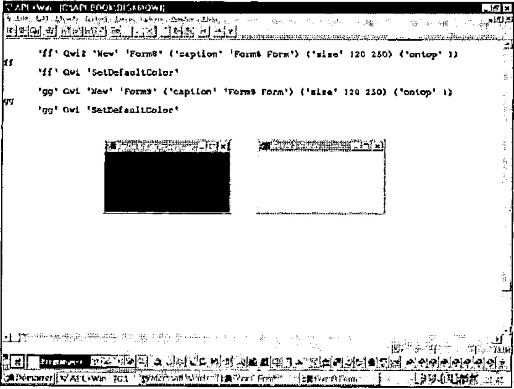

*by Eric Lescasse*
{ .byline }

*I want to thank Chris Lee from Softmed who inspired me with his UDC (User Defined Classes) concept.*

## Introduction

This long article, published in Vector in 2 parts, is extracted from the **Monthly APL+Win Training Program** available on the Internet from the **Lescasse Consulting** Web site at `www.lescasse.com`. It represents one of 3 chapters included in the APL+Win Training for May 97.

## Inheritance

The way of programming with *Qwi* described in this Chapter is really **Object Oriented Programming with APL+Win**. To convince you about this assertion, read on.

**First**, we are really creating new classes of objects. When you create a new class, you choose a class name for it (example: **Form** or **Form5** or **MaskEdit**, etc.) and then you create one APL function with a name that matches the new object’s class name you’ve chosen.

Remember that you can replace existing APL+Win classes (like **Form**) with your own class of the same name.

You may also overload existing class properties or methods with your own behaviour. This is exactly what we have done in all examples so far with the **New** method, which does exist for the APL+Win standard **Form** class, but which we overloaded with additional functionality in our **Form1** to **Form5** classes.

**Second**, we can easily go one step further and use **inheritance**, one of the basic concepts of all Object Oriented development systems. We will now describe how to do that.

Let’s suppose that we would like our new **Form** class to behave exactly like the **Form5** class except that the **Esc** key would be a shortcut key used to close the form. We could change our *Form5* function by adding one more line in the overloaded **New** method code and rename *Form5* to *Form6* (which you will find in workspace *QWI.W3*). The line to add would be:

```apl
[24]  R←(A,'.bnEsc')⎕wi'New' 'Button'('size' 0 0)('style' 2)  ⍝ Esc button
```

This line creates an invisible button (invisible because its size is set to 0 0!) with style **2** on our form. Because this button has style **2**, it is known by the APL+Win system as a **Cancel** button which is automatically clicked by pressing the **Esc** key, therefore closing the form.

So, we have perfectly solved our problem of creating a new class of forms which would react to pressing the **Esc** key by closing themselves. However, there are several drawbacks to this approach:

- first, we are duplicating the *Form5* code to become *Form6* and losing precious workspace room
- second, and more importantly, if we need to make any change in our **Form5** class, we must make the same changes in **Form6** class, so that **Form6** objects continue to behave exactly like **Form5** objects (except for the added **Esc** key functionality)

Could we try to take advantage of the Object Oriented **inheritance** concept instead? Yes, and it is ***very*** easy. Let’s just design a new **Form7** class as follows:

```apl
    ∇ A Form7 B;R;class
[1]   ⍝∇ A Form7 B -- User Defined Form7 Class
[2]   ⍝∇ A ↔ object name
[3]   ⍝∇ B ↔ 'property'
[4]   ⍝∇   or 'property' value
[5]   ⍝∇   or 'Method'
[6]   ⍝∇   or 'Method' argument1 ... argumentN
[7]   ⍝∇ Requires: (F) QwiRegister
[8]   ⍝∇ Copyright (c) 1997 Eric Lescasse [9mar97]
[9]
[10]  :select ↑B
[11]  :case 'New'                    ⍝ constructor
[12]      A Form5 B                  ⍝ inherits Form5 class
[13]      QwiRegister A              ⍝ save class name
[14]      R←(A,'.bnEsc')⎕wi'New' 'Button'('size' 0 0)('style' 2)
[15]
[16]  :else
[17]      A Form5 B                  ⍝ inherits Form5 class
[18]
[19]  :end
    ∇
```

That’s a very simple and crystal clear way of implementing inheritance.

When the *Form7* class function is called with an argument starting with `'New'` to create a new instance of a **Form7** kind of a form, the *Form5* **New** method code is used instead (**line 12**) and is simply followed by the additional behaviour we wanted (**line 14**). Note that we must not forget to register our new class (**line 13**).

For all other **Form7** class properties and methods, the behaviour is inherited from the **Form5** class (**line 17**).

You may want to check if this works OK. Try:

```apl
      'ff' Qwi2 'New' 'Form7'
ff
```

click in the form to set the focus to it and press the **Esc** key: this closes your form.

Then try:

```apl
      'ff' Qwi2 'New' 'Form7' ('ontop' 1)
ff

      'ff' Qwi2 'Move' 'bottom' 'right'
192 256
```

The form moves as expected. The **ontop** property and the **Move** method are purely inherited from the **Form5** class!

I suppose you see how this brings a terrific power to APL+Win programming!

APL+Win allows you to do **Object Oriented Programming** and in a manner which is most simple.

Having understood inheritance as shown above, we could have designed our **Form1** to **Form5** classes as a hierarchy of classes, all descendants from the APL+Win **Form** class, according to the following tree:

- Form
    - **Form1** — Delete
        - Form2 — caption, font, scale
            - Form3 — other APL+Win properties
                - Form4 — ontop
                    - Form5 — Move
                        - Form7 — Esc key

In the above tree, I have shown at each level of the tree, the changed or added properties and methods.

## Exercise

I leave it as an exercise for you to start a new workspace, copy functions *Qwi*, *HANDLERFOR*, *Form1* from workspace *QWI.W3* in it and rewrite *Form2*, *Form3*, *Form4*, *Form5* and *Form7* implementing inheritance at all levels.

Then add a new property to the **New** method of the **Form1** class, like changing the default form *size* to **10 30**, and check that all other classes (**Form2** to **Form7**) do inherit correctly from the **Form1** class.

## Polymorphism

Another unique characteristic of **Object Oriented Programming** is **polymorphism** whereby different objects respond to the same message with their own unique behaviour.

How can we use polymorphism with our new objects? The answer is simple: if you assume that invoking an object method is in fact sending a message to the object instructing it to run a named piece of code (the method), then we simply need to implement methods sharing the same name in different ways according to the classes in which they are implemented.

An example will help understand this polymorphism concept. Let’s define 2 new classes of objects **Form8** and **Form9** which both inherit from class **Form7**. In both **Form8** and **Form9** classes, we will implement a *SetDefaultColor* method, which sets the form background colour to some default class color when it is invoked. However we will design *SetDefaultColor* so that it changes the colour of **Form8** forms to black and the colour of **Form9** forms to white. Here are our 2 new class functions:

```apl
    ∇ A Form8 B;R;class
[1]   ⍝∇ A Form8 B -- User Defined Form8 Class
[2]   ⍝∇ A ↔ object name
[3]   ⍝∇ B ↔ 'property'
[4]   ⍝∇   or 'property' value
[5]   ⍝∇   or 'Method'
[6]   ⍝∇   or 'Method' argument1 ... argumentN
[7]   ⍝∇ Requires: (F) QwiRegister
[8]   ⍝∇ Copyright (c) 1997 Eric Lescasse [9mar97]
[9]
[10]  :select ↑B
[11]  :case 'New'                    ⍝ constructor
[12]      A Form7 B                  ⍝ inherits Form7 class
[13]      QwiRegister A              ⍝ save class name
[14]
[15]  :case 'SetDefaultColor'        ⍝ SetDefaultColor method
[16]      A ⎕wi 'color' 0            ⍝ set background color to black
[17]
[18]  :else
[19]      A Form7 B                  ⍝ inherits Form7 class
[20]
[21]  :end
```

and:

```apl
    ∇ A Form9 B;R;class
[1]   ⍝∇ A Form9 B -- User Defined Form9 Class
[2]   ⍝∇ A ↔ object name
[3]   ⍝∇ B ↔ 'property'
[4]   ⍝∇   or 'property' value
[5]   ⍝∇   or 'Method'
[6]   ⍝∇   or 'Method' argument1 ... argumentN
[7]   ⍝∇ Requires: (F) QwiRegister
[8]   ⍝∇ Copyright (c) 1997 Eric Lescasse [9mar97]
[9]
[10]  :select ↑B
[11]  :case 'New'                    ⍝ constructor
[12]      A Form7 B                  ⍝ inherits Form7 class
[13]      QwiRegister A              ⍝ save class name
[14]
[15]  :case 'SetDefaultColor'        ⍝ SetDefaultColor method
[16]      A ⎕wi 'color' (3⍴255)      ⍝ set background color to white
[17]
[18]  :else
[19]      A Form7 B                  ⍝ inherits Form7 class
[20]
[21]  :end
    ∇
```

Now let’s try to create instances of the **Form8** and **Form9** classes, which we will distinguish by changing their caption property and let’s send them a *SetDefaultColor* message.

```apl
      'ff' Qwi2 'New' 'Form8' ('caption' 'Form8 Form') ('size' 120 250) ('ontop' 1)
ff
      'ff' Qwi2 'SetDefaultColor'


      'gg' Qwi2 'New' 'Form9' ('caption' 'Form9 Form') ('size' 120 250) ('ontop' 1)
gg
      'gg' Qwi2 'SetDefaultColor'
```

Here is what you will see.



This is exactly what **polymorphism** is.

**Polymorphism** refers to the ability of a given message to assume different functions, depending upon to what object it is sent.

## Using Superclass Methods

It may sometimes happen that you would like to use not the class definition of a (possibly polymorphic) method, but its **superclass** definition instead. A **superclass** is simply the parent class which a given class inherits from.

For example, the **Form8** superclass is **Form7**.

Let’s assume that we have also implemented a *SetDefaultColor* method in the *Form7* class. Change class function *Form7* as follows and rename it as *Form10*:

```apl
    ∇ A Form10 B;R;class
[1]   ⍝∇ A Form10 B -- User Defined Form10 Class
[2]   ⍝∇ A ↔ object name
[3]   ⍝∇ B ↔ 'property'
[4]   ⍝∇   or 'property' value
[5]   ⍝∇   or 'Method'
[6]   ⍝∇   or 'Method' argument1 ... argumentN
[7]   ⍝∇ Requires: (F) QwiRegister
[8]   ⍝∇ Copyright (c) 1997 Eric Lescasse [9mar97]
[9]
[10]  :select ↑B
[11]  :case 'New'                    ⍝ constructor
[12]      A Form5 B                  ⍝ inherits Form5 class
[13]      QwiRegister A              ⍝ save class name
[14]      R←(A,'.bnEsc')⎕wi'New' 'Button'('size' 0 0)('style' 2)
[15]
[16]  :case 'SetDefaultColor'        ⍝ SetDefaultColor method
[17]      A ⎕wi 'color' 255          ⍝ set background color to red
[18]
[19]  :else
[20]      A Form5 B                  ⍝ inherits Form5 class
[21]
[22]  :end
    ∇
```

Then change function *Form8* to *Form11* as follows:

```apl
    ∇ A Form11 B;R;class
[1]   ⍝∇ A Form11 B -- User Defined Form11 Class
[2]   ⍝∇ A ↔ object name
[3]   ⍝∇ B ↔ 'property'
[4]   ⍝∇   or 'property' value
[5]   ⍝∇   or 'Method'
[6]   ⍝∇   or 'Method' argument1 ... argumentN
[7]   ⍝∇ Requires: (F) QwiRegister
[8]   ⍝∇ Copyright (c) 1997 Eric Lescasse [9mar97]
[9]
[10]  :select ↑B
[11]  :case 'New'                    ⍝ constructor
[12]      A Form10 B                 ⍝ inherits Form10 class
[13]      QwiRegister A              ⍝ save class name
[14]
[15]  :case 'SetDefaultColor'        ⍝ SetDefaultColor method
[16]      A ⎕wi 'color' 0            ⍝ set background color to black
[17]
[18]  :else
[19]      A Form10 B                 ⍝ inherits Form10 class
[20]
[21]  :end
    ∇
```

We now have a new class of forms: **Form11** which knows about the *SetDefaultColor* message and inherits the **Form10** class.

The **Form10** class also understands the *SetDefaultColor* message, albeit in a different manner and the **Form10** class inherits the **Form5** class.

When we are working with a **Form11** kind of a form, sending a *SetDefaultColor* message to the form results in running the *SetDefaultColor* method of the **Form11** class.

If you want to run the *SetDefaultColor* method instead in the **Form11** superclass (i.e. in class **Form10**) you should send a **super SetDefaultColor** message to the **Form11** form.

Example:

```apl
      'ff' Qwi3 'New' 'Form11' ('caption' 'Form11 Form')('size' 120 250)('ontop' 1)
ff
```

Let us first invoke the **Form11** class *SetDefaultColor* method:

```apl
      'ff' Qwi3 'SetDefaultColor'
```

This results in a **black** form being displayed on the screen.

And now, let’s call the **Form11 superclass** *SetDefaultColor* instead:

```apl
      'ff' Qwi3 'super SetDefaultColor'
```

This results in a **red** form being displayed on the screen.

For this to work properly, you need to change utility *Qwi2* to now be *Qwi3*, as follows:
