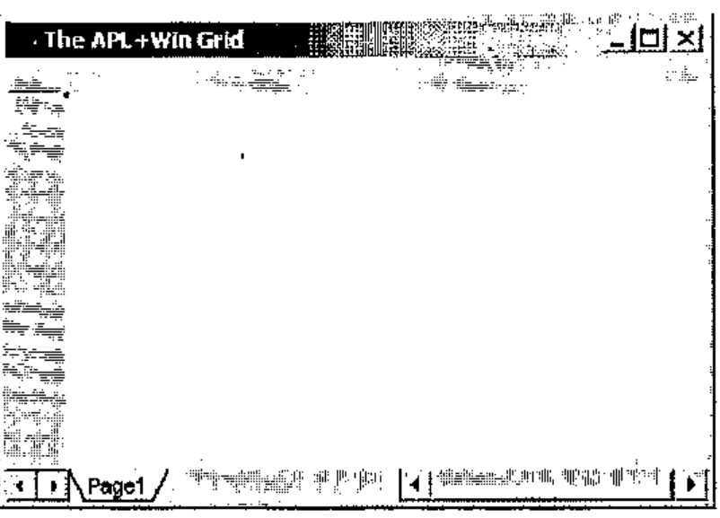
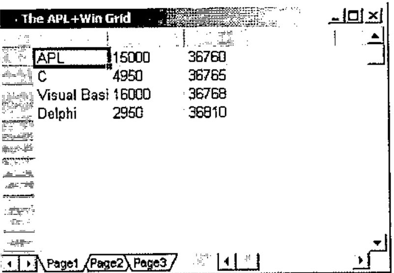
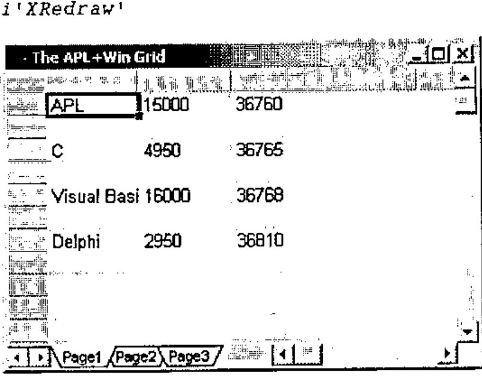
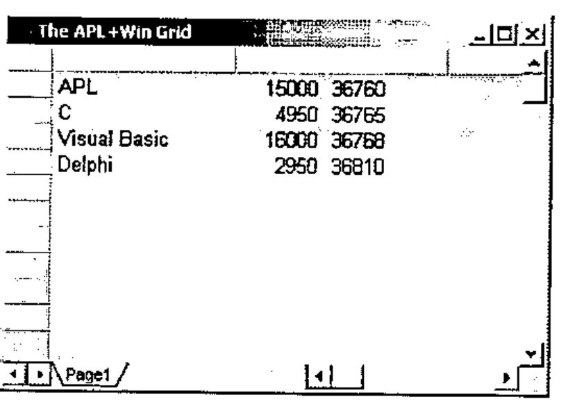
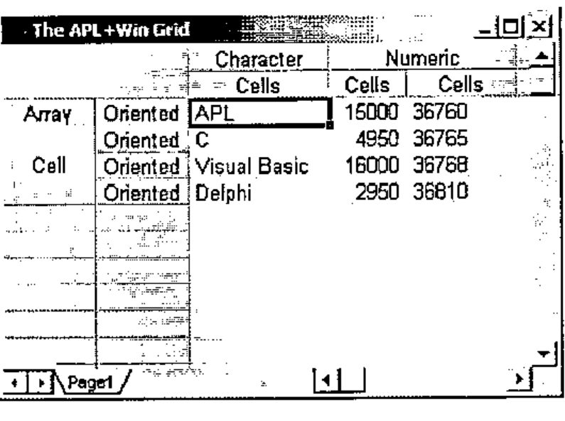
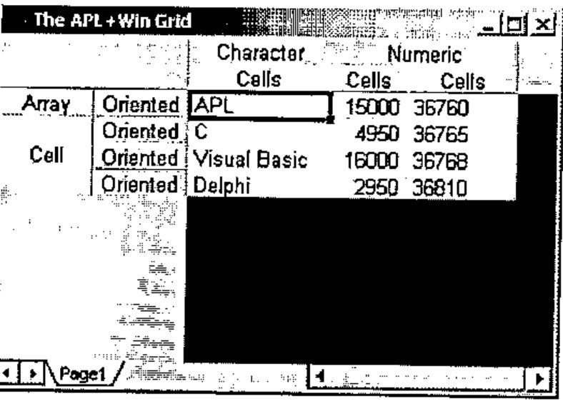
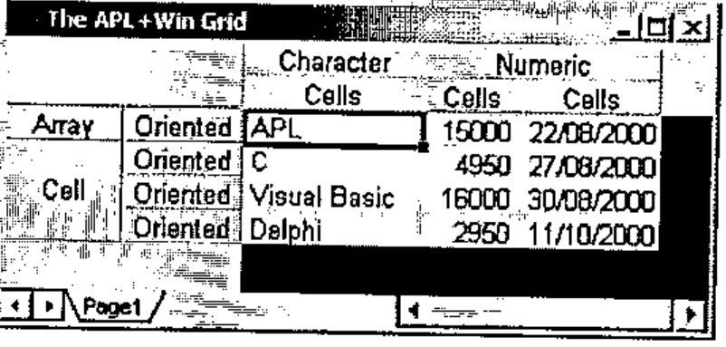
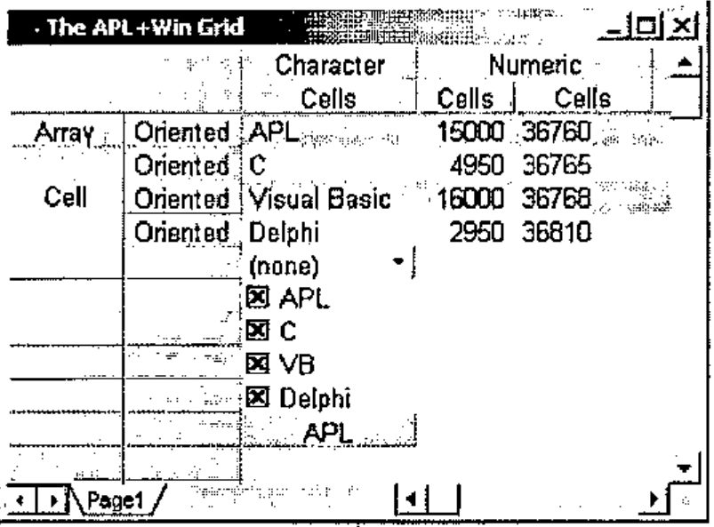
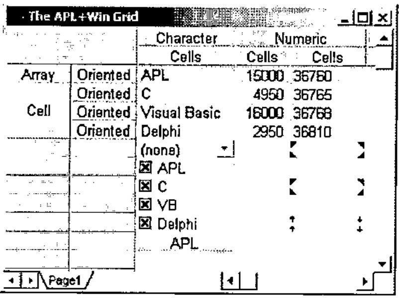
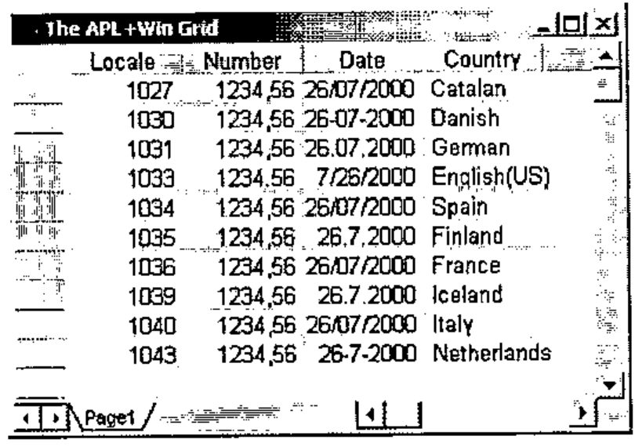

*by Eric Lescasse*
{ .byline }

Every APL developer knows that it is very difficult to find an application where using a Grid object of some kind is not required. Among all the applications I have been writing for the last 10 years, I don’t remember any of them not using a Grid.

Before APL+Win was out, we had to write our own Grid in APL+PC or APL+Dos and though a somewhat difficult and time-consuming task, this was still feasible. So, many APL+ users developed their own Grid tools. With Windows, developing a Grid object becomes a very difficult and arduous task: it proves to be just impossible for most APL developers.

Dyalog APL has had a Grid object for several years now, but APL+Win was still lacking one. So APL+Win developers have been using third party Grid tools, starting with the Formula One VBX years ago, and more recently various ActiveX Grids such as Formula One from TideStone, Spread from FarPoint, FlexGrid from VideoSoft, etc.

These ActiveX Grids are fine: they are the tools that Visual Basic and C application developers frequently use, and I have used several of them with complete success in various Dyalog APL and APL+Win applications. However none of them are designed to be used in an array oriented language like APL and therefore they are sometimes a bit cumbersome to work with. In the worst case, you have to deal with individual cells, not with matrices, and that makes them a little slow for some operations.

So finally APL2000 has decided to add a new Grid object to APL+Win and to make it from start to finish an array-aware Grid that is simple to use and very efficient.

An Alpha test of this Grid object was presented by Patrick Parks at the APL2000 User’s Conference in November in Orlando (USA), and I have had a chance to be able to use this Grid object extensively since its early development stages in spring 2000.

Although the APL2000 Conference Manual clearly states *"This is an ALPHA TEST version of the control and should not yet be deployed in your production applications. All features discussed here are subject to change"*, I have indeed been using it in 2 large applications which are being developed, at my own risk.

## A Quick Overview of the APL+Win Grid

First let’s have a look at it …


This shows what is already available.

- Populating the grid with APL nested arrays
- Colors, Borders, Alignments
- Hierarchical multi-line/columns headings
- Formatting
- Various data types (text, number, Boolean, date, currency)
- Merge cells
- Cell objects (button, check box, dropdown list, arrows)
- Multiple sheets
- Selections
- Tracking Window
- Support for locales
- Fixed rows and/or columns
- Formatting patterns for cells
- Images in cell corners
- Support for XML

The Grid is currently delivered as a single DLL (APLGRID.DLL) and must be registered before it can be used, with:

```text
Regsvr32 c:\aplwin36\aplgrid.dll
```

Note that this DLL may be installed in any directory on your hard drive; as long as it is properly registered. The Grid can be used with versions of APL+Win other than the latest 3.6.09 (or the 3.7 Beta). I have tried it with success under APL+Win 3.5 and even 3.0.

To uninstall the Grid simply enter:

```text
Regsvr32 -u c:\aplwin36\aplgrid.dll
```

provided you had installed the grid in c:\aplwin36

Note that the APLGRID.DLL uses other Windows system DLLs which must be present on your machine:

```text
ADVAPI32.DLL
COMCTL32.DLL
GDI32.DLL
KERNEL32.DLL
MFC42.DLL
MSVCRT.DLL
MSVCP60.DLL
OLE32.DLL
OLEAUT32.DLL
OLEPRO32.DLL
RPCRT4.DLL
USER32.DLL
```

Under a 32-bit Windows operating system you should find all these DLLs under your Windows System directory, except maybe MSVCP60.DLL.

## Exploring the Grid

### Creating a Grid

Once APLGRID.DLL has been installed, start APL+Win and you’re ready to use the grid.

```apl
      ⎕wself←'ff'⎕wi'Create' 'Form'('caption' 'The APL+Win Grid')
      ⎕wself←'ff.ss'⎕wi'Create' 'APL.Grid'('where'0 0,'ff'⎕wi'size')
```



By default the grid appears with 1 page, no rows and no columns.

Even in its Alpha Test stage, the Grid already has a large number of properties, methods and events hooked in:

```apl
      ⍴¨⎕wi¨'properties' 'methods' 'events'
100 27 38

      70 TELPRINT(aaa[;1]='x')⌿aaa←⊃⎕wi'properties'
xActiveCell            xFixedRows    xSelection
xAlign                 xFontName     xSelectionCol
xArrayObjects          xFontSize     xSelectionCols
xAutoEditStart         xFontStyle    xSelectionCount
xBorderStyle           xFormat       xSelectionMode
xCellType              xGuidelines   xSelectionRow
xCellTypeEx            xHeadCols     xSelectionRows
xCol                   xHeadRows     xStayInSelection
xColSize               xImage        xTabWidth
xColorBack             xImageFile    xText
xColorGrid             xImageSize    xTrackingWindow
xColorSelBack          xLocale       xValue
xColorSelText          xNumber       xValueDigits
xColorText             xPage         xValueEx
xCols                  xPageName     xValueType
xConversionErrorValue  xPages        xXML
xCurrency              xRow          xXMLChanges
xDate                  xRowSize      xXMLPage
xFixedCols             xRows         xXMLRange

      70 TELPRINT(aaa[;1]='X')⌿aaa←⊃⎕wi'methods'
XAddSelection   XJoin                 XSetSelection
XEditCancel     XMoveTrackingWindow   XWhereIs
XEditStart      Xredraw

      70 TELPRINT(aaa[;1]='X')⌿aaa←⊃⎕wi'events'
XCanColSize       XCellMouseLeave  XEditStart      XRowSized
XCanRowSize       XCellMouseMove   XEditVerify     XRowSizing
XCellChange       XCellMouseUp     XKeyMove        XSelectionChange
XCellClick        XColSized        XPageChanged    XViewChange
XCellMouseDown    XColSizing       XPageChanging
XCellMouseEnter   XEditEnd         XPageOpen
```

The syntax for a given property, method or event may be obtained using a question mark:

```apl
      ⎕wi'?Text'
xText : property Text
  Ref: Variant <- xText(Variant Rows, Variant Cols)
  Set: xText(Variant Rows, Variant Cols) <- Variant
```

### Properties and methods

Rows and columns are added with the Rows and Cols properties:

```apl
      ⎕wi'Rows'100
      ⎕wi'Cols'20
```

It is also possible to add more sheets:

```apl
      ⎕wi'Pages'3
```

Now let’s populate the grid with some APL data:

```apl
      data←3 3⍴'APL' 15000 36760 'C' 4950 36765 'Visual Basic' 16000 36768 'Delphi' 2950 36810

      data
APL           15000 36760
C              4950 36765
Visual Basic  16000 36768
Delphi         2950 36810

      ⎕wi'Text'1 1 data
      ⎕wi'XRedraw'
```



Note that the whole nested array is installed in the Grid with one matrix operation with the Text property. When the array is contiguous only the starting row and column is required. You may however specify the row and column numbers for each row and column of the array. This allows us to do things such as installing data on alternate lines:

```apl
      ⎕wi'Text'(1 3 5 7)(⍳3)data
      ⎕wi'XRedraw'
```



Also note that the XRedraw operation is necessary to display the data set with the Text property. The principle is that you may want to make several changes to the Grid, before you want to display all of them at once in one XRedraw operation. This not only reduces any flickering to a minimum but also speeds up things considerably.

Example:

```apl
      ⎕wi'Text'(⍳4)(⍳3)data
      ⎕wi'ColorBack'(1 3)(⍳20)(256⊥192 192 192)
      ⎕wi'ColSize'(1 2 3)(120 60 80)
      ⎕wi'Align'(⍳4)(2)2
      ⎕wi'XRedraw'
```



To add data to another page, be sure the grid has several pages (with the Pages property), shift to another page with the Page property, add the necessary rows and columns, and use the Text property again:

```apl
      ⎕wi'Pages'2

      ⎕wi'Page'2
      ⎕wi'Rows'(1⊃⍴data)
      ⎕wi'Cols'(2⊃⍴data)
      'ff.ss'⎕wi'Text'1 1 data
      'ff.ss'⎕wi'Redraw'
```

Note that although you installed text in each cell with the Text property, cell content may be read as numbers using the Number property:

```apl
      ⎕dr¨⎕←,⎕wi'Text'(⍳4)3
 36760  36765  36768  36810
82 82 82 82
      ⎕dr¨⎕←,⎕wi'Number'(⍳4)3
36760 36765 36768 36810
323 323 323 323
```

This is a very useful feature.

Row and column headings are easily added using negative row and column numbers:

```apl
      ⎕wi'HeadRows'2
      ⎕wi'HeadCols'2
      ⎕wi'ColSize'(¯2 ¯1)(60) ⍝ note: sizes are expressed in pixels
      ⎕wi'Join'2 ¯2 3 1
      ⎕wi'Text'(⍳4)(¯2 ¯1)('Array' 'Cell' '' '',[1.5]4⍴⊂'Oriented')
      ⎕wi'Join'¯2 2 1 2
      ⎕wi'Text'(¯2 ¯1)(⍳3)('Character' 'Numeric' '',[.5]3⍴⊂'Cells')
      ⎕wi'XRedraw'
```

The following small utility function can help immediately see the result of a command, without having to type `⎕wi'XRedraw'`:

```apl
    ∇ ss A
[1]   ⎕wi'XRedraw'
    ∇
```

Example:

```apl
      ss ⎕wi'Join'¯2 2 1 2
      ss ⎕wi'Text'(¯2 ¯1)(⍳3)('Character' 'Numeric' '',[.5]3⍴⊂'Cells')
```



The Join method above merges 1 line, starting at line ¯2 and merges 2 columns starting at column 2 on this line, hence the "Numeric" heading spanning columns 2 and 3.

Rows and columns may of course be restricted to the minimum necessary to hold all the data, and colour can be set for the background of the grid:

```apl
      ⎕wi'Rows'4
      ⎕wi'Cols'3
      ⎕wi'ColorGrid'0
```



We may convert the numbers in column 3 to dates:

```apl
      ss ⎕wi'Date'(⍳4)3(⎕wi'Number'(⍳4)3)
```

Dates are automatically formatted according to your Windows International Settings unless you specify another locale (see later).



```apl
      ss ⎕wi'Rows'10
```

Now let’s define cell 5 1 as a Combo Box:

```apl
      ss ⎕wi'CellType'5 1 1
      ss ⎕wi'Text'5 1 '(none)'
      ss ⎕wi'ValueEx'5 1('(none)',⎕tclf,'APL',⎕tclf,'C',⎕tclf,'Visual Basic',⎕tclf,'Delphi',⎕tclf)
```

and cell 6 1 to 9 1 as Check Boxes

```apl
      ss ⎕wi'CellType'7 1 2 ⋄ ss ⎕wi'ValueEx'6 1'APL'
      ss ⎕wi'CellType'7 1 2 ⋄ ss ⎕wi'ValueEx'7 1'C'
      ss ⎕wi'CellType'8 1 2 ⋄ ss ⎕wi'ValueEx'8 1'VB'
      ss ⎕wi'CellType'9 1 2 ⋄ ss ⎕wi'ValueEx'9 1'Delphi'
      ss ⎕wi'Align'(6 7 8 9)1 1  ⍝ note: 1=Left Align
```

and cell 10 1 as a Button:

```apl
      ⎕wi'CellType'10 1 4
      ⎕wi'ColorBack'10 1(256⊥192 192 192)
      ⎕wi'Text'10 1'APL'
      ss ⎕wi'Align'10 1 4  ⍝ note: 4=Center
```



Note that it would make things even easier to define another small utility called `ee` as follows:

```apl
    ∇ A←A ee B
[1]   A←⎕wi(1↑B),A,1↓B
    ∇
```

and the last 4 instructions could be written:

```apl
      ss(⊂10 1)ee¨('CellType'4)('ColorBack'(256⊥3⍴192))('Text' 'APL')('Align'4)
```

Check boxes could be checked by program with such instructions as:

```apl
      ⎕wi'Value'(6 7 8 9)1 1
```

and unchecked with:

```apl
      ⎕wi'Value'(6 7 8 9)1 0
```

You may also display images in the Grid using the **image** property. Images are specified as a rank 3 cube where the first coordinate represents the placement axis and the rows and columns represent the rows and cols of the grid. First plane is TopLEFT, Second is TopRIGHT, Third is BottomLEFT, Fourth is BottomRIGHT.

One use of the Image property is to duplicate the comment symbol from Excel, but because you have more control over images and placement, they have lots of other uses.

```apl
      images←1 2 3 4 ∘.+ 4×3 2⍴0 1 2 3 4 5
      ⎕wi'Image' (⍳4) (5 7 9) (3 5) images
      ⎕wi'ImageFile' 'd:\aplwin\grid66.bmp'
```



One nice feature of the future APL Grid is that it understands "locales", i.e. whatever country you live in, you’ll be able to display numbers and dates in the local standard format for your country.

In order to see this, let’s create a simple Grid example:

```apl
      ⎕wi'Rows'100
      ⎕wi'Cols'20
      loc←10 1⍴1027 1030 1031 1033 1034 1035 1036 1039 1040 1043
      ⎕wi'value'¯1(1 2)('Locale' 'Number' 'Date' 'Country')
      ⎕wi'locale'(⍳10)(2 3)(loc,loc)
      ⎕wi'number'(⍳10)1 loc
      ⎕wi'number'(⍳10)2(10 1⍴1234.56)
      ⎕wi'date'(⍳10)3 36733 ⋄ ⎕wi'align'(⍳10)3 2
      ⎕wi'text'(⍳10)4(10 1⍴'Catalan' 'Danish' 'German' 'English(US)' 'Spain' 'Finland' 'France' 'Iceland' 'Italy' 'Netherlands')
      ⎕wi'XRedraw'
```



Notice how dates are differently formatted depending on the countries and notice that European use a comma as the decimal separator while USA uses a dot.

There’s also a Tracking Window feature which automatically displays a window as your mouse cursor enters some cells.

I’ll stop here describing the Grid methods and properties. A complete book would be necessary to describe and show them all in detail, even with the Alpha Test version of the Grid. At least you’ve got a flavour of what this object will be.

### Events

The Grid already contains 22 events hooked in. Here they are again:

```text
XCanColSize       XCellMouseLeave  XEditStart      XRowSized
XCanRowSize       XCellMouseMove   XEditVerify     XRowSizing
XCellChange       XCellMouseUp     XKeyMove        XSelectionChange
XCellClick        XColSized        XPageChanged    XViewChange
XCellMouseDown    XColSizing       XPageChanging
XCellMouseEnter   XEditEnd         XPageOpen
```

The ones which have been put in bold are the ones which fired in the simple example shown below.

One way to see some of them in action is to define a simple handler for all of them at once with an expression like:

```apl
      ⎕wi¨(⊂¨(⊂'on'),¨⎕wi'events'),¨⊂¨⊂'⎕wself ⎕wevent ⎕warg'
```

Then move the cursor to cell 6 2 and start typing APL, then press Enter, then type C in cell 7 2 and press the down arrow key.

You should see the following flow of events displayed in the APL session:

```text
...
ff.ss XCellMouseLeave   5 2 6 2
ff.ss XCellMouseEnter   6 2 5 2
ff.ss XCellChange   6 2 7 2
ff.ss XSelectionChange   6 2 1 1 1
ff.ss XCellMouseDown   6 2 1 1 0
ff.ss Focus
ff.ss Focus
ff.ss XCellMouseUp   6 2 1 0 0
ff.ss XEditStart   0 6 2 394204
ff.ss XEditVerify   65 1 6 2 394204
ff.ss XCellMouseLeave   6 2 0 0
ff.ss XCellMouseEnter   0 0 6 2
ff.ss XEditVerify   80 1 6 2 394204
ff.ss XEditVerify   76 1 6 2 394204
ff.ss XKeyMove   7 2 6 2 13 0
ff.ss XEditEnd   0 6 2 394204 APL
ff.ss XCellChange   7 2 6 2
ff.ss XSelectionChange   7 2 1 1 1
ff.ss XCellMouseEnter   6 2 0 0
ff.ss XCellMouseEnter   6 2 0 0
ff.ss XEditStart   0 7 2 394204
ff.ss XEditVerify   67 1 7 2 394204
ff.ss XKeyMove   8 2 7 2 40 0
ff.ss XEditEnd   0 7 2 394204 C
ff.ss XCellChange   8 2 7 2
ff.ss XSelectionChange   8 2 1 1 1
ff.ss XCellMouseLeave   6 2 6 1
ff.ss XCellMouseEnter   6 1 6 2
...
ff.ss Unfocus
```

Every time an event occurs `⎕warg` provides you with important information you need to know to properly handle this event, like the current cell coordinate, the value of the key pressed, the cell content, etc.

## Current State of the Grid

In my opinion, in its current state (Alpha Test) the APL+Win Grid is far from being finished. There will probably be quite a number of additional methods, properties and events added and improvements made before APL+Win Release 4.0 is out.

Some properties are incomplete or do not work yet.

Even like that, this object is secure enough and we have been able to use it with success in 2 different applications, though sometimes we encounter difficulties.

Here is a list of the things we have been missing most:

- The **modified** property which is common to all APL+Win objects and tells if the object has been changed, is not yet hooked in: we have had to write our own modified property for the Grid
- The APL+Win **def** property which stores an image of a form in an APL variable currently ignores the Grid, so we can’t use it to recreate forms containing grids
- The **FontName, FontSize, FontStyle** do not yet work and the Grid can only display one font in one size. Happily this font and size is fine. Of course this should be fixed for Release 4.0
- Some properties like the **BorderStyle** property are not easy to use and APL2000 is aware of that
- Probably the most annoying problem is the fact that we have had to fight a lot to get the grid display correctly in our real life applications. In a complex form with a Selector and many Pages containing Grid objects, the Grid would not display at all when opening a Page: we would have to click where the Grid should have appeared to make it display itself. Or the Grid would display without its scroll bars and only display its scroll bars when we click in it. In other cases the only way we found to get the grid displayed correctly was to change a column width by one pixel and change it back immediately. The **XRedraw** method did not always work the way we expected (i.e. forcing the Grid to display itself immediately). The good news is that we have been able to solve ALL of these problems by changing the way we were displaying the grid’s parents or grandparents. But still there should be work done to improve this area, since in its current state it is time consuming to solve these problems. Of course we knew we were using an Alpha Test version of the Grid and that these kinds of problems are more than expected.
- The **onEditVerify** event fires when pressing alphanumeric keys but does not fire for some other keyboard keys (usually handled by the **onKeyDown** event). This is a serious problem which is difficult to get around when you need to react to KeyDown keys pressed in the Grid. I hope there will be a solution to trap KeyDown keys some way or another in the final release.
- There is no way to change grid line colors
- The horizontal scroll bar does not go away when all the columns fit within the visible part of the Grid object. There is no such problem with the vertical scroll bar.

## Conclusion

Despite these little early Alpha Test problems, this APL+Win Grid object is a real pleasure to use and is already quite secure: in 6 months use, I don’t remember having crashed APL+Win because of it.

There is no doubt for me that the APL+Win Grid will soon become the most important object most APL+Win developers will use, as soon as Release 4.0 is out.

There are a lot many ways in which one can use a good Grid object and a lot of tricks that can be made with such an object. It can greatly improves GUI interfaces and at the same time greatly eases the application development process.

It is extremely useful in almost all applications.

The APL+Win Grid is very promising because it has the following qualities:

- It is completely array oriented and designed for APL-minded people
- It is extremely fast
- It is very easy to use
- It is very consistent in its design (it always uses Row and Column vectors in the data arguments)
- It announces itself to be very complete
- It seems to be based on a solid product with a small memory FootPrint and 100% based on MFC
- It seems very secure
- It can be called from Javascript, so you can use the same object in a Web based front end to your APL application

My only regret is that such an object has waited so long to find its way within APL+Win but it just might be worth the wait.
